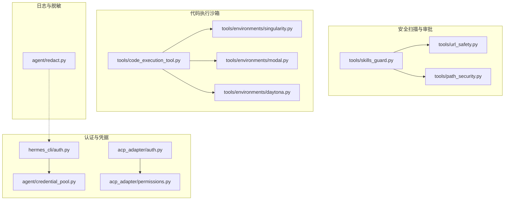
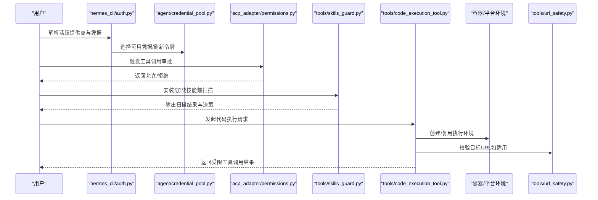
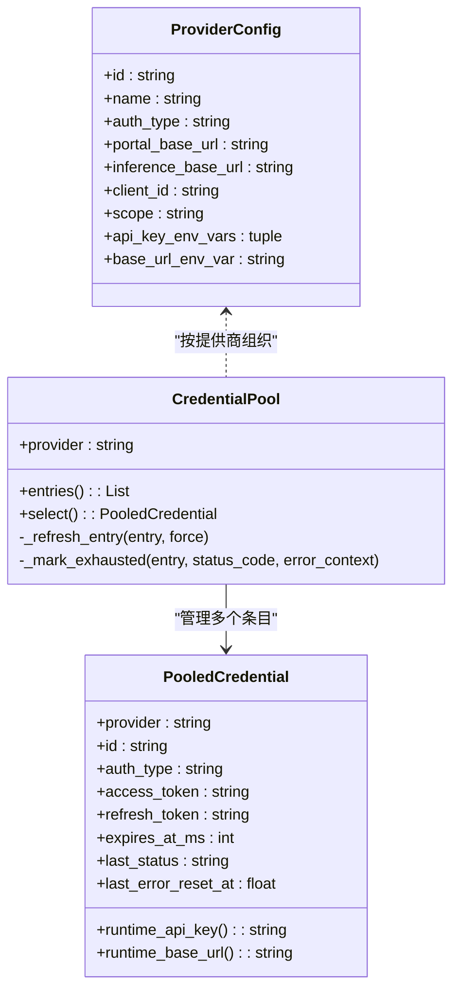
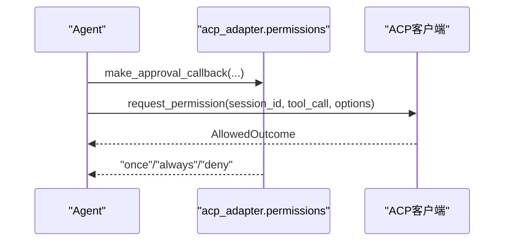
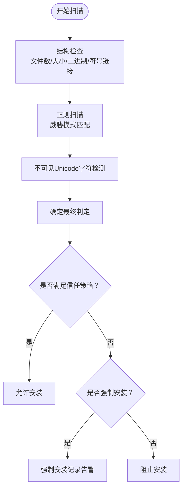
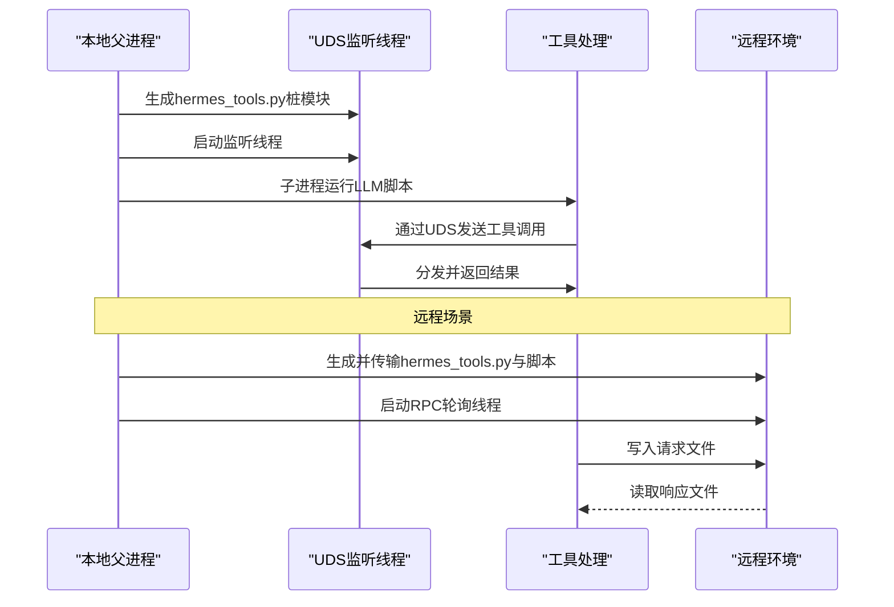
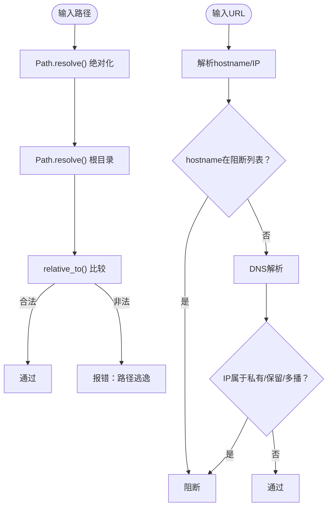
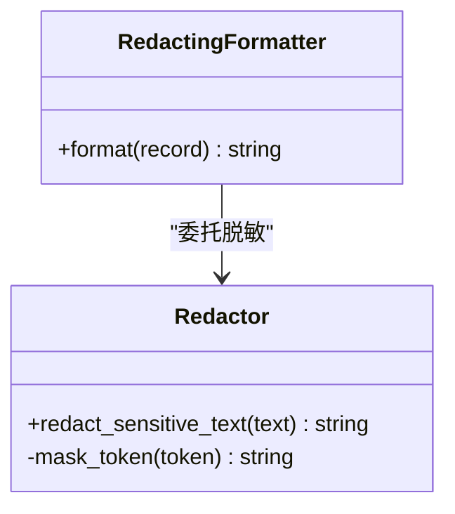
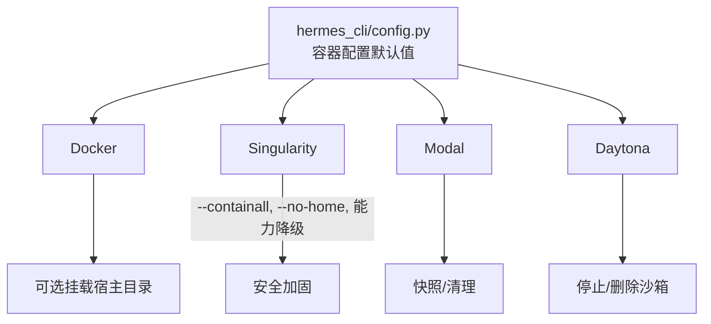
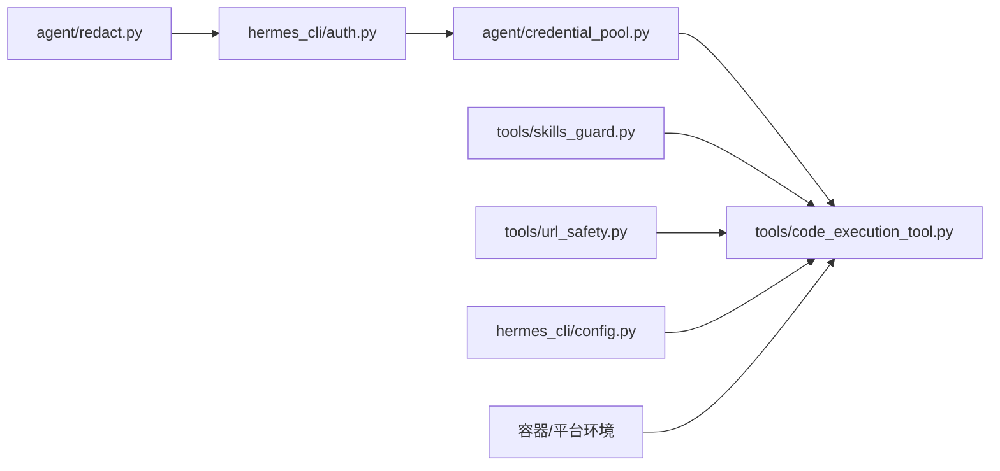

# 安全最佳实践

<cite>
**本文引用的文件**
- [acp_adapter/auth.py](file://acp_adapter/auth.py)
- [acp_adapter/permissions.py](file://acp_adapter/permissions.py)
- [agent/credential_pool.py](file://agent/credential_pool.py)
- [agent/redact.py](file://agent/redact.py)
- [hermes_cli/auth.py](file://hermes_cli/auth.py)
- [tools/code_execution_tool.py](file://tools/code_execution_tool.py)
- [tools/path_security.py](file://tools/path_security.py)
- [tools/skills_guard.py](file://tools/skills_guard.py)
- [tools/url_safety.py](file://tools/url_safety.py)
- [docker/entrypoint.sh](file://docker/entrypoint.sh)
- [Dockerfile](file://Dockerfile)
- [tools/environments/singularity.py](file://tools/environments/singularity.py)
- [tools/environments/modal.py](file://tools/environments/modal.py)
- [tools/environments/daytona.py](file://tools/environments/daytona.py)
- [hermes_cli/config.py](file://hermes_cli/config.py)
- [tests/tools/test_daytona_environment.py](file://tests/tools/test_daytona_environment.py)
- [tests/gateway/test_ssl_certs.py](file://tests/gateway/test_ssl_certs.py)
</cite>

## 目录
1. [简介](#简介)
2. [项目结构](#项目结构)
3. [核心组件](#核心组件)
4. [架构总览](#架构总览)
5. [详细组件分析](#详细组件分析)
6. [依赖分析](#依赖分析)
7. [性能考量](#性能考量)
8. [故障排查指南](#故障排查指南)
9. [结论](#结论)
10. [附录](#附录)

## 简介
本指南面向Hermes Agent的安全运营与开发团队，系统阐述项目在安全架构、权限控制、危险命令检测、代码执行沙箱、API密钥管理与敏感信息保护、跨平台隔离与容器安全、网络安全与SSRF防护、安全审计与漏洞评估、以及安全事件响应等方面的最佳实践。文档以仓库中现有实现为依据，结合可操作的建议与图示，帮助读者快速建立可落地的安全基线。

## 项目结构
Hermes Agent围绕“工具链+会话+环境”的分层设计构建安全能力：
- 认证与凭据：多提供商OAuth与API Key管理，持久化凭据池与刷新策略
- 权限与审批：基于ACP的工具调用审批桥接
- 危险扫描：技能安装前的静态扫描与信任策略
- 执行沙箱：本地Unix域套接字与远程文件RPC两种传输通道
- 路径与网络：路径合法性校验与URL SSRF防护
- 容器与平台：Docker/Singularity/Modal/Daytona等后端的资源限制与隔离
- 日志与脱敏：统一脱敏格式化器与敏感信息掩码

**图表来源**
- [hermes_cli/auth.py:102-261](file://hermes_cli/auth.py#L102-L261)
- [agent/credential_pool.py:358-741](file://agent/credential_pool.py#L358-L741)
- [acp_adapter/auth.py:8-24](file://acp_adapter/auth.py#L8-L24)
- [acp_adapter/permissions.py:26-77](file://acp_adapter/permissions.py#L26-L77)
- [tools/skills_guard.py:595-640](file://tools/skills_guard.py#L595-L640)
- [tools/url_safety.py:51-98](file://tools/url_safety.py#L51-L98)
- [tools/path_security.py:15-44](file://tools/path_security.py#L15-L44)
- [tools/code_execution_tool.py:73-76](file://tools/code_execution_tool.py#L73-L76)
- [tools/environments/singularity.py:1-46](file://tools/environments/singularity.py#L1-L46)
- [tools/environments/modal.py:386-420](file://tools/environments/modal.py#L386-L420)
- [tools/environments/daytona.py:210-229](file://tools/environments/daytona.py#L210-L229)
- [agent/redact.py:113-171](file://agent/redact.py#L113-L171)

**章节来源**
- [hermes_cli/auth.py:102-261](file://hermes_cli/auth.py#L102-L261)
- [agent/credential_pool.py:358-741](file://agent/credential_pool.py#L358-L741)
- [tools/skills_guard.py:595-640](file://tools/skills_guard.py#L595-L640)
- [tools/code_execution_tool.py:73-76](file://tools/code_execution_tool.py#L73-L76)

## 核心组件
- 凭据与认证
  - 多提供商注册表与运行时解析，支持OAuth设备码与API Key两类
  - 凭据池持久化、并发锁、过期冷却与令牌刷新
  - 跨进程文件锁保护auth.json
- 权限与审批
  - ACP审批回调桥接，超时自动拒绝，映射允许/拒绝结果
- 技能安全
  - 正则模式扫描、不可见字符检测、结构检查（文件数/大小/二进制/符号链接）
  - 基于来源的信任策略（builtin/trusted/community/agent-created）
- 代码执行沙箱
  - 本地UDS与远程文件RPC两种传输；仅允许白名单工具；限制工具调用次数与超时
  - 远程后端复用终端环境，统一资源限制
- 路径与网络
  - 绝对路径与相对化校验，禁止路径穿越
  - URL SSRF防护：私有/回环/保留地址阻断，已知内部主机名阻断
- 日志与脱敏
  - 统一脱敏格式化器，掩码API Key、Token、数据库连接串、电话号码等
- 容器与平台
  - Docker/Singularity/Modal/Daytona资源限制与隔离；默认持久化文件系统；可选挂载宿主目录

**章节来源**
- [hermes_cli/auth.py:579-637](file://hermes_cli/auth.py#L579-L637)
- [agent/credential_pool.py:358-741](file://agent/credential_pool.py#L358-L741)
- [acp_adapter/permissions.py:26-77](file://acp_adapter/permissions.py#L26-L77)
- [tools/skills_guard.py:595-640](file://tools/skills_guard.py#L595-L640)
- [tools/code_execution_tool.py:73-76](file://tools/code_execution_tool.py#L73-L76)
- [tools/path_security.py:15-44](file://tools/path_security.py#L15-L44)
- [tools/url_safety.py:51-98](file://tools/url_safety.py#L51-L98)
- [agent/redact.py:113-171](file://agent/redact.py#L113-L171)
- [tools/environments/singularity.py:1-46](file://tools/environments/singularity.py#L1-L46)
- [hermes_cli/config.py:360-379](file://hermes_cli/config.py#L360-L379)

## 架构总览
下图展示从用户发起到工具执行的关键安全路径：凭据解析、权限审批、技能扫描、执行沙箱与网络/路径校验、日志脱敏。

**图表来源**
- [hermes_cli/auth.py:772-800](file://hermes_cli/auth.py#L772-L800)
- [agent/credential_pool.py:358-741](file://agent/credential_pool.py#L358-L741)
- [acp_adapter/permissions.py:26-77](file://acp_adapter/permissions.py#L26-L77)
- [tools/skills_guard.py:595-640](file://tools/skills_guard.py#L595-L640)
- [tools/code_execution_tool.py:706-817](file://tools/code_execution_tool.py#L706-L817)
- [tools/url_safety.py:51-98](file://tools/url_safety.py#L51-L98)

## 详细组件分析

### 凭据与认证（API密钥与OAuth）
- 多提供商注册表定义OAuth设备码与API Key两类认证方式，支持环境变量覆盖基础URL
- 运行时解析优先级：配置文件、环境变量、外部状态（如Claude Code凭据文件）
- 凭据池支持轮询/随机/最少使用等策略，内置过期冷却与刷新逻辑
- auth.json采用原子写入与跨进程文件锁，严格限制权限（仅属主读写）

**图表来源**
- [hermes_cli/auth.py:85-100](file://hermes_cli/auth.py#L85-L100)
- [agent/credential_pool.py:92-173](file://agent/credential_pool.py#L92-L173)
- [agent/credential_pool.py:358-415](file://agent/credential_pool.py#L358-L415)

**章节来源**
- [hermes_cli/auth.py:102-261](file://hermes_cli/auth.py#L102-L261)
- [hermes_cli/auth.py:579-637](file://hermes_cli/auth.py#L579-L637)
- [agent/credential_pool.py:358-741](file://agent/credential_pool.py#L358-L741)

### 权限与审批（ACP桥接）
- 将ACP的权限选项映射为“一次允许/总是允许/拒绝”，超时或异常默认拒绝
- 回调在事件循环中异步执行，确保不阻塞主线程

**图表来源**
- [acp_adapter/permissions.py:26-77](file://acp_adapter/permissions.py#L26-L77)

**章节来源**
- [acp_adapter/permissions.py:26-77](file://acp_adapter/permissions.py#L26-L77)

### 技能安全扫描（危险命令与注入检测）
- 结构检查：文件数量上限、总大小、单文件大小、二进制扩展、符号链接
- 正则扫描：数据外泄、提示词注入、破坏性操作、持久化、网络隧道、混淆、进程执行、路径遍历、加密货币挖矿、供应链风险、提权、代理配置修改、硬编码凭证
- 不可见Unicode字符检测
- 信任策略：builtin/trusted/community/agent-created，不同来源阈值不同

**图表来源**
- [tools/skills_guard.py:595-640](file://tools/skills_guard.py#L595-L640)
- [tools/skills_guard.py:734-798](file://tools/skills_guard.py#L734-L798)
- [tools/skills_guard.py:530-592](file://tools/skills_guard.py#L530-L592)

**章节来源**
- [tools/skills_guard.py:595-640](file://tools/skills_guard.py#L595-L640)
- [tools/skills_guard.py:734-798](file://tools/skills_guard.py#L734-L798)
- [tools/skills_guard.py:530-592](file://tools/skills_guard.py#L530-L592)

### 代码执行沙箱（工具调用限制与传输通道）
- 本地：Unix域套接字（UDS），仅允许白名单工具（web_search/web_extract/read_file/write_file/search_files/patch/terminal）
- 远程：文件RPC（请求/响应文件），复用终端环境（Docker/SSH/Modal/Daytona）
- 限制：工具调用次数上限、超时、禁止后台/PTY参数、输出长度限制
- 远程后端要求Python可用，且通过环境变量传递RPC目录

**图表来源**
- [tools/code_execution_tool.py:130-163](file://tools/code_execution_tool.py#L130-L163)
- [tools/code_execution_tool.py:307-426](file://tools/code_execution_tool.py#L307-L426)
- [tools/code_execution_tool.py:564-704](file://tools/code_execution_tool.py#L564-L704)

**章节来源**
- [tools/code_execution_tool.py:73-76](file://tools/code_execution_tool.py#L73-L76)
- [tools/code_execution_tool.py:130-163](file://tools/code_execution_tool.py#L130-L163)
- [tools/code_execution_tool.py:307-426](file://tools/code_execution_tool.py#L307-L426)
- [tools/code_execution_tool.py:564-704](file://tools/code_execution_tool.py#L564-L704)

### 路径与网络安全（路径合法性与SSRF）
- 路径校验：使用绝对化与相对化比较，防止路径穿越；快速检查“..”组件
- URL SSRF：阻断私有/回环/保留/多播/未指定地址；阻断CGNAT范围；阻断特定内部主机名；DNS失败即阻断

**图表来源**
- [tools/path_security.py:15-44](file://tools/path_security.py#L15-L44)
- [tools/url_safety.py:51-98](file://tools/url_safety.py#L51-L98)

**章节来源**
- [tools/path_security.py:15-44](file://tools/path_security.py#L15-L44)
- [tools/url_safety.py:51-98](file://tools/url_safety.py#L51-L98)

### 日志与敏感信息脱敏
- 统一脱敏格式化器，支持多种前缀、环境变量赋值、JSON字段、Authorization头、Telegram Bot Token、私钥块、数据库连接串、E.164电话号码
- 长令牌保留前后缀，短令牌全掩码
- 可通过环境变量开关脱敏行为

**图表来源**
- [agent/redact.py:173-182](file://agent/redact.py#L173-L182)
- [agent/redact.py:113-171](file://agent/redact.py#L113-L171)

**章节来源**
- [agent/redact.py:113-171](file://agent/redact.py#L113-L171)
- [agent/redact.py:173-182](file://agent/redact.py#L173-L182)

### 容器与平台安全（Docker/Singularity/Modal/Daytona）
- 默认启用持久化文件系统，可配置CPU/内存/磁盘配额
- Docker可选挂载宿主工作目录，需显式开启；支持卷挂载与环境转发
- Singularity安全强化：containall、no-home、能力降级
- Modal/Daytona支持快照与清理；超时与退出码语义化（如124表示超时）

**图表来源**
- [hermes_cli/config.py:360-379](file://hermes_cli/config.py#L360-L379)
- [tools/environments/singularity.py:1-46](file://tools/environments/singularity.py#L1-L46)
- [tools/environments/modal.py:386-420](file://tools/environments/modal.py#L386-L420)
- [tools/environments/daytona.py:210-229](file://tools/environments/daytona.py#L210-L229)
- [tests/tools/test_daytona_environment.py:256-269](file://tests/tools/test_daytona_environment.py#L256-L269)

**章节来源**
- [hermes_cli/config.py:360-379](file://hermes_cli/config.py#L360-L379)
- [tools/environments/singularity.py:1-46](file://tools/environments/singularity.py#L1-L46)
- [tools/environments/modal.py:386-420](file://tools/environments/modal.py#L386-L420)
- [tools/environments/daytona.py:210-229](file://tools/environments/daytona.py#L210-L229)
- [tests/tools/test_daytona_environment.py:256-269](file://tests/tools/test_daytona_environment.py#L256-L269)

### 网络安全与证书
- URL SSRF：阻断私网/保留/多播/未指定地址与特定内部主机名
- SSL证书：自动设置SSL_CERT_FILE，优先系统CA，其次certifi，最后常见路径

**章节来源**
- [tools/url_safety.py:51-98](file://tools/url_safety.py#L51-L98)
- [tests/gateway/test_ssl_certs.py:17-39](file://tests/gateway/test_ssl_certs.py#L17-L39)

## 依赖分析
- 组件耦合
  - 凭据池依赖认证模块与配置加载，提供运行时API Key与基础URL
  - 执行沙箱依赖工具处理函数与终端环境工厂，受信任策略与工具白名单约束
  - 技能扫描独立于执行路径，但影响安装决策
- 外部依赖
  - httpx用于OAuth探测与Z.AI端点探测
  - Docker/Singularity/Modal/Daytona SDK用于环境管理
  - 日志系统与标准库用于脱敏与时间戳

**图表来源**
- [hermes_cli/auth.py:772-800](file://hermes_cli/auth.py#L772-L800)
- [agent/credential_pool.py:358-415](file://agent/credential_pool.py#L358-L415)
- [tools/code_execution_tool.py:706-817](file://tools/code_execution_tool.py#L706-L817)
- [tools/skills_guard.py:595-640](file://tools/skills_guard.py#L595-L640)
- [tools/url_safety.py:51-98](file://tools/url_safety.py#L51-L98)
- [agent/redact.py:113-171](file://agent/redact.py#L113-L171)
- [hermes_cli/config.py:360-379](file://hermes_cli/config.py#L360-L379)

**章节来源**
- [hermes_cli/auth.py:772-800](file://hermes_cli/auth.py#L772-L800)
- [agent/credential_pool.py:358-415](file://agent/credential_pool.py#L358-L415)
- [tools/code_execution_tool.py:706-817](file://tools/code_execution_tool.py#L706-L817)
- [tools/skills_guard.py:595-640](file://tools/skills_guard.py#L595-L640)
- [tools/url_safety.py:51-98](file://tools/url_safety.py#L51-L98)
- [agent/redact.py:113-171](file://agent/redact.py#L113-L171)
- [hermes_cli/config.py:360-379](file://hermes_cli/config.py#L360-L379)

## 性能考量
- 凭据池并发访问通过锁与原子写入保障一致性，避免频繁I/O
- 执行沙箱限制工具调用次数与超时，降低长尾风险
- URL SSRF与路径校验为轻量级预检，失败即阻断，减少后续错误开销
- 容器资源限制避免资源滥用，提升多租户稳定性

## 故障排查指南
- 凭据相关
  - auth.json无法写入：检查文件权限与锁文件；确认跨进程锁未超时
  - 刷新失败：检查网络与第三方服务可用性；查看重试与同步逻辑
- 执行沙箱
  - UDS不可用：确认非Windows平台；检查socket路径与权限
  - 远程后端无响应：确认Python可用、RPC目录存在、请求/响应文件读写正常
- 技能安装
  - 扫描阻断：根据报告定位高危模式；必要时使用--force并加强审计
- 容器环境
  - Modal/Daytona清理失败：查看清理流程与快照存储；确认任务ID与持久化状态
- 网络与证书
  - SSRF阻断：核对目标域名与解析结果；确认未被内部主机名阻断
  - SSL证书：确认SSL_CERT_FILE设置与CA路径可用

**章节来源**
- [hermes_cli/auth.py:579-637](file://hermes_cli/auth.py#L579-L637)
- [agent/credential_pool.py:547-741](file://agent/credential_pool.py#L547-L741)
- [tools/code_execution_tool.py:706-817](file://tools/code_execution_tool.py#L706-L817)
- [tests/tools/test_daytona_environment.py:210-229](file://tests/tools/test_daytona_environment.py#L210-L229)
- [tools/url_safety.py:51-98](file://tools/url_safety.py#L51-L98)
- [tests/gateway/test_ssl_certs.py:17-39](file://tests/gateway/test_ssl_certs.py#L17-L39)

## 结论
Hermes Agent在安全方面形成了从“凭据管理—权限审批—技能扫描—执行沙箱—网络与路径—日志脱敏—容器隔离”的完整闭环。建议在生产环境中：
- 强制启用凭据池与跨进程锁，定期审查信任策略
- 对远程后端严格限制工具集与资源配额
- 将URL SSRF与路径校验作为所有网络/文件操作的前置条件
- 开启日志脱敏并定期审计扫描报告
- 在容器环境中默认最小权限与持久化隔离

## 附录

### 安全编码规范（摘自实现要点）
- 使用凭据池与运行时解析，避免硬编码密钥
- 仅在白名单内暴露工具调用，严格限制参数
- 对所有外部输入进行路径与URL校验
- 使用统一脱敏格式化器输出日志
- 容器默认安全参数（containall/no-home/能力降级）

**章节来源**
- [agent/credential_pool.py:358-415](file://agent/credential_pool.py#L358-L415)
- [tools/code_execution_tool.py:355-382](file://tools/code_execution_tool.py#L355-L382)
- [tools/path_security.py:15-44](file://tools/path_security.py#L15-L44)
- [tools/url_safety.py:51-98](file://tools/url_safety.py#L51-L98)
- [agent/redact.py:173-182](file://agent/redact.py#L173-L182)
- [tools/environments/singularity.py:1-46](file://tools/environments/singularity.py#L1-L46)

### 常见安全漏洞与防范
- 提示词注入：通过技能扫描与信任策略降低风险
- 数据外泄：脱敏输出、阻断敏感路径与URL
- 破坏性命令：工具白名单与远程后端限制
- SSRF：阻断私网/保留地址与内部主机名
- 路径穿越：路径绝对化与相对化比较
- 供应链风险：扫描未固定版本依赖与远程资源拉取

**章节来源**
- [tools/skills_guard.py:82-484](file://tools/skills_guard.py#L82-L484)
- [tools/url_safety.py:51-98](file://tools/url_safety.py#L51-L98)
- [tools/path_security.py:15-44](file://tools/path_security.py#L15-L44)

### API密钥管理与敏感信息保护
- 使用ProviderConfig与环境变量覆盖基础URL
- auth.json权限仅属主读写，跨进程锁保护
- 脱敏格式化器与掩码策略
- 禁止在日志中泄露API Key、Token、私钥、数据库连接串

**章节来源**
- [hermes_cli/auth.py:102-261](file://hermes_cli/auth.py#L102-L261)
- [hermes_cli/auth.py:668-701](file://hermes_cli/auth.py#L668-L701)
- [agent/redact.py:113-171](file://agent/redact.py#L113-L171)

### 跨平台与平台特定安全
- Windows禁用本地UDS沙箱，使用远程文件RPC
- Modal/Daytona支持快照与清理，注意清理失败处理
- Singularity默认安全参数，避免宿主目录映射

**章节来源**
- [tools/code_execution_tool.py:46-52](file://tools/code_execution_tool.py#L46-L52)
- [tools/environments/modal.py:386-420](file://tools/environments/modal.py#L386-L420)
- [tools/environments/daytona.py:210-229](file://tools/environments/daytona.py#L210-L229)
- [tools/environments/singularity.py:1-46](file://tools/environments/singularity.py#L1-L46)

### 安全审计与漏洞评估
- 定期扫描技能目录，关注高危模式与不可见字符
- 审计凭据池冷却与刷新记录，识别配额耗尽与重试行为
- 审查日志脱敏覆盖率与误报情况
- 对容器后端进行资源使用与持久化快照审计

**章节来源**
- [tools/skills_guard.py:595-640](file://tools/skills_guard.py#L595-L640)
- [agent/credential_pool.py:396-415](file://agent/credential_pool.py#L396-L415)
- [agent/redact.py:113-171](file://agent/redact.py#L113-L171)
- [tools/environments/modal.py:402-420](file://tools/environments/modal.py#L402-L420)

### 安全事件报告与应急响应
- 认证失败：根据错误类型提示重新登录或充值
- 执行超时：记录退出码124，检查资源限制与后端可用性
- 技能安装阻断：记录扫描报告，必要时人工复核
- 容器清理失败：记录警告并手动清理残留沙箱

**章节来源**
- [hermes_cli/auth.py:516-540](file://hermes_cli/auth.py#L516-L540)
- [tests/tools/test_daytona_environment.py:256-269](file://tests/tools/test_daytona_environment.py#L256-L269)
- [tools/skills_guard.py:642-677](file://tools/skills_guard.py#L642-L677)
- [tests/gateway/test_ssl_certs.py:17-39](file://tests/gateway/test_ssl_certs.py#L17-L39)

### 容器安全与网络安全专项指导
- 容器安全
  - 默认持久化文件系统，谨慎启用宿主目录挂载
  - 限制CPU/内存/磁盘配额，避免资源滥用
  - Singularity使用containall/no-home与能力降级
- 网络安全
  - 强制SSRF防护，阻断私网/保留/多播/未指定地址
  - 自动设置SSL_CERT_FILE，确保HTTPS验证链有效

**章节来源**
- [hermes_cli/config.py:360-379](file://hermes_cli/config.py#L360-L379)
- [tools/environments/singularity.py:1-46](file://tools/environments/singularity.py#L1-L46)
- [tools/url_safety.py:51-98](file://tools/url_safety.py#L51-L98)
- [tests/gateway/test_ssl_certs.py:17-39](file://tests/gateway/test_ssl_certs.py#L17-L39)