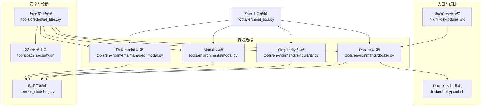
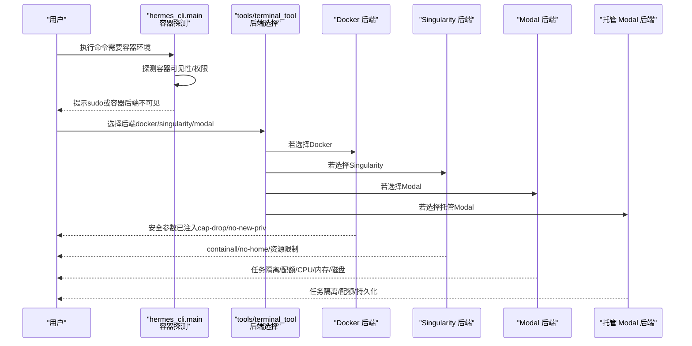
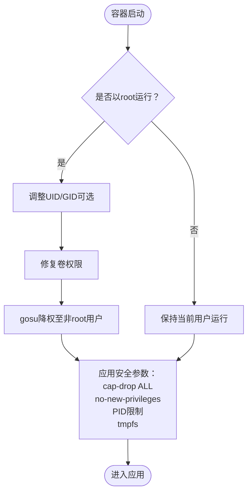
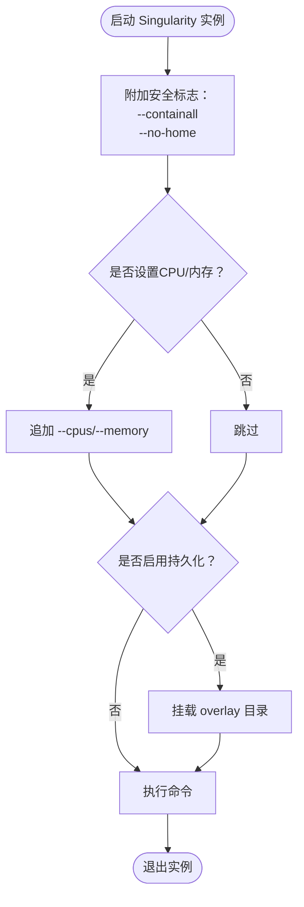
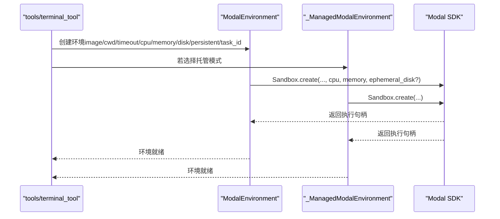
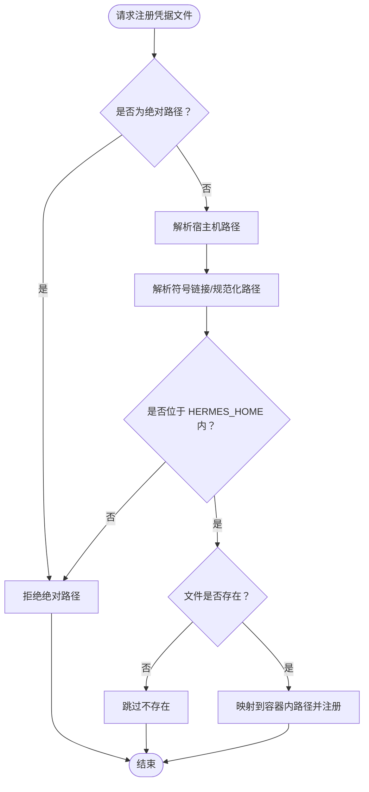
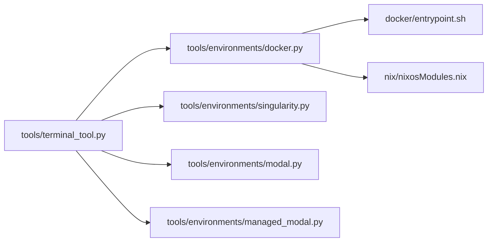
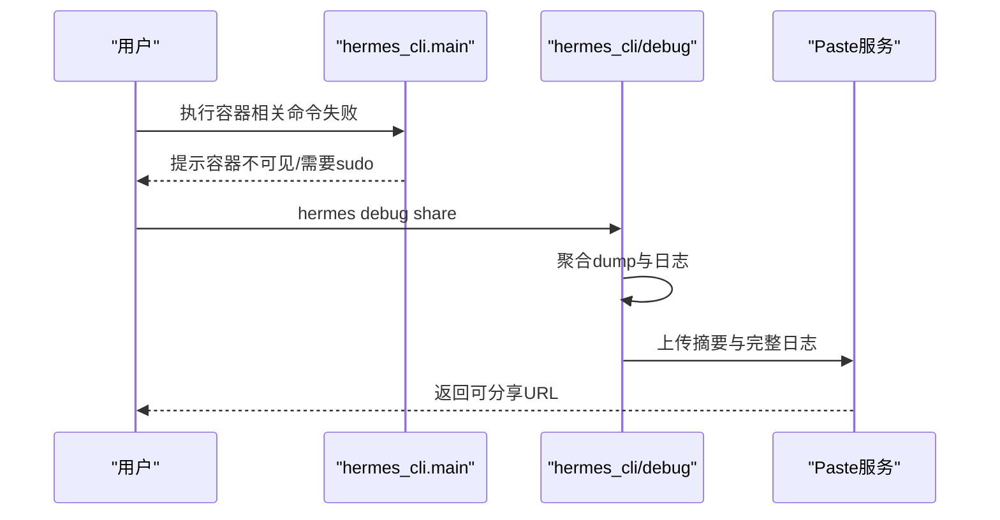

# 容器安全

<cite>
**本文引用的文件**
- [Dockerfile](file://Dockerfile)
- [.dockerignore](file://.dockerignore)
- [docker/entrypoint.sh](file://docker/entrypoint.sh)
- [tools/environments/docker.py](file://tools/environments/docker.py)
- [tools/environments/singularity.py](file://tools/environments/singularity.py)
- [tools/environments/modal.py](file://tools/environments/modal.py)
- [tools/environments/managed_modal.py](file://tools/environments/managed_modal.py)
- [tools/terminal_tool.py](file://tools/terminal_tool.py)
- [hermes_cli/main.py](file://hermes_cli/main.py)
- [tools/credential_files.py](file://tools/credential_files.py)
- [tools/path_security.py](file://tools/path_security.py)
- [hermes_cli/debug.py](file://hermes_cli/debug.py)
- [tests/integration/test_modal_terminal.py](file://tests/integration/test_modal_terminal.py)
- [tests/integration/test_daytona_terminal.py](file://tests/integration/test_daytona_terminal.py)
- [nix/nixosModules.nix](file://nix/nixosModules.nix)
</cite>

## 目录
1. [简介](#简介)
2. [项目结构](#项目结构)
3. [核心组件](#核心组件)
4. [架构总览](#架构总览)
5. [详细组件分析](#详细组件分析)
6. [依赖分析](#依赖分析)
7. [性能考虑](#性能考虑)
8. [故障排查指南](#故障排查指南)
9. [结论](#结论)
10. [附录](#附录)

## 简介
本指南面向在Hermes Agent中使用容器化执行环境的用户与运维人员，聚焦以下目标：
- Docker容器安全：能力降级、特权提升防护、PID限制、临时文件系统隔离等
- Modal云执行环境：资源配额（CPU/内存/磁盘）、任务隔离与持久化
- Singularity容器：用户命名空间、文件系统权限控制、资源限制
- 镜像安全扫描与漏洞检测流程
- 运行时安全最佳实践：用户权限最小化、网络访问控制、日志与取证
- 安全事件监控与取证方法

## 项目结构
围绕容器安全的关键代码分布在如下模块：
- 容器运行时后端：Docker、Singularity、Modal（含托管模式）
- 入口与权限降级：Docker入口脚本、NixOS容器编排
- 资源与隔离策略：各后端对CPU/内存/磁盘/PID的限制实现
- 文件系统与凭据：路径安全校验、凭据挂载白名单
- 诊断与取证：调试报告收集、日志上传与归档

图表来源
- [tools/environments/docker.py:128-145](file://tools/environments/docker.py#L128-L145)
- [tools/environments/singularity.py:195-246](file://tools/environments/singularity.py#L195-L246)
- [tools/environments/modal.py:147-167](file://tools/environments/modal.py#L147-L167)
- [tools/environments/managed_modal.py:46-76](file://tools/environments/managed_modal.py#L46-L76)
- [docker/entrypoint.sh:8-30](file://docker/entrypoint.sh#L8-L30)
- [nix/nixosModules.nix:797-821](file://nix/nixosModules.nix#L797-L821)
- [tools/terminal_tool.py:739-772](file://tools/terminal_tool.py#L739-L772)
- [tools/credential_files.py:66-101](file://tools/credential_files.py#L66-L101)
- [tools/path_security.py:15-44](file://tools/path_security.py#L15-L44)
- [hermes_cli/debug.py:206-241](file://hermes_cli/debug.py#L206-L241)

章节来源
- [tools/environments/docker.py:1-200](file://tools/environments/docker.py#L1-L200)
- [tools/environments/singularity.py:1-200](file://tools/environments/singularity.py#L1-L200)
- [tools/environments/modal.py:147-167](file://tools/environments/modal.py#L147-L167)
- [tools/environments/managed_modal.py:46-76](file://tools/environments/managed_modal.py#L46-L76)
- [docker/entrypoint.sh:1-65](file://docker/entrypoint.sh#L1-L65)
- [nix/nixosModules.nix:797-821](file://nix/nixosModules.nix#L797-L821)
- [tools/terminal_tool.py:739-772](file://tools/terminal_tool.py#L739-L772)
- [tools/credential_files.py:66-101](file://tools/credential_files.py#L66-L101)
- [tools/path_security.py:15-44](file://tools/path_security.py#L15-L44)
- [hermes_cli/debug.py:206-241](file://hermes_cli/debug.py#L206-L241)

## 核心组件
- Docker后端：默认启用能力降级、特权禁止、PID限制、受限tmpfs；支持CPU/内存/磁盘配额探测与设置
- Singularity后端：启用containall/no-home、能力降级、CPU/内存限制、可选overlay持久化
- Modal后端：按任务隔离、资源配额（CPU/内存/磁盘），支持托管模式与直接模式
- 入口脚本：容器启动时进行UID/GID映射、权限修复、以非root用户运行
- 路径与凭据安全：严格校验相对路径、防止越权访问宿主机目录；凭据文件注册时进行沙箱约束
- 诊断与取证：聚合系统状态、最近日志，上传到Paste服务便于问题定位

章节来源
- [tools/environments/docker.py:128-145](file://tools/environments/docker.py#L128-L145)
- [tools/environments/singularity.py:195-246](file://tools/environments/singularity.py#L195-L246)
- [tools/environments/modal.py:147-167](file://tools/environments/modal.py#L147-L167)
- [docker/entrypoint.sh:8-30](file://docker/entrypoint.sh#L8-L30)
- [tools/credential_files.py:66-101](file://tools/credential_files.py#L66-L101)
- [tools/path_security.py:15-44](file://tools/path_security.py#L15-L44)
- [hermes_cli/debug.py:206-241](file://hermes_cli/debug.py#L206-L241)

## 架构总览
下图展示容器后端如何在Hermes Agent中被选择与调用，并体现安全边界与隔离策略。

图表来源
- [hermes_cli/main.py:583-611](file://hermes_cli/main.py#L583-L611)
- [tools/terminal_tool.py:739-772](file://tools/terminal_tool.py#L739-L772)
- [tools/environments/docker.py:128-145](file://tools/environments/docker.py#L128-L145)
- [tools/environments/singularity.py:195-246](file://tools/environments/singularity.py#L195-L246)
- [tools/environments/modal.py:147-167](file://tools/environments/modal.py#L147-L167)
- [tools/environments/managed_modal.py:46-76](file://tools/environments/managed_modal.py#L46-L76)

## 详细组件分析

### Docker 容器安全
- 能力降级与特权禁止
  - 默认丢弃所有能力，仅添加必要能力（如DAC_OVERRIDE、CHOWN、FOWNER），并启用no-new-privileges
  - PID限制，防止进程爆炸
  - 临时文件系统：/tmp、/var/tmp、/run均采用tmpfs，限制大小且禁执行/禁suid
- 资源限制
  - 支持CPU/内存/磁盘配额探测与设置；当驱动不支持时给出明确提示
- 入口脚本安全
  - 容器以root启动时，根据HERMES_UID/HERMES_GID调整hermes用户ID，修复卷权限后通过gosu降权
- 可观测性
  - 通过调试子命令收集系统状态与日志，便于问题定位

图表来源
- [docker/entrypoint.sh:8-30](file://docker/entrypoint.sh#L8-L30)
- [tools/environments/docker.py:128-145](file://tools/environments/docker.py#L128-L145)

章节来源
- [tools/environments/docker.py:128-145](file://tools/environments/docker.py#L128-L145)
- [docker/entrypoint.sh:8-30](file://docker/entrypoint.sh#L8-L30)
- [hermes_cli/debug.py:206-241](file://hermes_cli/debug.py#L206-L241)

### Singularity 容器安全
- 安全参数
  - containall、no-home、能力降级，确保最小暴露面
- 资源限制
  - 支持CPU与内存限制传入
- 持久化
  - 可选overlay目录作为持久层，跨会话保留
- 命令执行
  - 通过apptainer/exec在实例内执行命令，支持登录shell与非登录shell

图表来源
- [tools/environments/singularity.py:195-246](file://tools/environments/singularity.py#L195-L246)

章节来源
- [tools/environments/singularity.py:156-246](file://tools/environments/singularity.py#L156-L246)

### Modal 云执行环境安全
- 任务隔离
  - 不同task_id对应不同沙箱，测试覆盖了任务间隔离与持久化验证
- 资源配额
  - 支持CPU/内存/磁盘（当SDK支持ephemeral_disk时）
- 后端模式
  - direct与managed两种模式，若托管模式未启用则回退或报错

图表来源
- [tools/terminal_tool.py:739-772](file://tools/terminal_tool.py#L739-L772)
- [tools/environments/modal.py:147-167](file://tools/environments/modal.py#L147-L167)
- [tools/environments/managed_modal.py:46-76](file://tools/environments/managed_modal.py#L46-L76)

章节来源
- [tools/terminal_tool.py:739-772](file://tools/terminal_tool.py#L739-L772)
- [tests/integration/test_modal_terminal.py:179-219](file://tests/integration/test_modal_terminal.py#L179-L219)

### 凭据与路径安全
- 凭据文件注册
  - 仅允许相对路径，拒绝绝对路径；对符号链接与“..”进行解析与校验，防止逃逸HERMES_HOME
- 路径安全工具
  - 统一的路径合法性检查与遍历组件检测，避免路径逃逸

图表来源
- [tools/credential_files.py:66-101](file://tools/credential_files.py#L66-L101)
- [tools/path_security.py:15-44](file://tools/path_security.py#L15-L44)

章节来源
- [tools/credential_files.py:66-101](file://tools/credential_files.py#L66-L101)
- [tools/path_security.py:15-44](file://tools/path_security.py#L15-L44)

### 容器运行时安全配置最佳实践
- 用户权限最小化
  - Docker：以非root用户运行，必要时通过gosu降权；避免特权容器
  - Singularity：containall/no-home，避免宿主机目录直通
  - Modal：按任务隔离，避免共享敏感上下文
- 网络访问控制
  - 默认不开放额外端口；如需访问外部服务，请在可信网络内进行
- 资源配额
  - 明确设置CPU/内存/磁盘上限，防止资源滥用
- 持久化与隔离
  - 使用独立task_id隔离不同任务；必要时启用持久化overlay（Singularity）
- 镜像与依赖安全
  - 使用受信基础镜像；定期更新系统包与依赖；启用镜像扫描

章节来源
- [tools/environments/docker.py:128-145](file://tools/environments/docker.py#L128-L145)
- [tools/environments/singularity.py:195-246](file://tools/environments/singularity.py#L195-L246)
- [tools/terminal_tool.py:739-772](file://tools/terminal_tool.py#L739-L772)

## 依赖分析
- 容器后端选择
  - tools/terminal_tool根据配置与环境变量选择Docker/Singularity/Modal/托管Modal
- Docker后端依赖
  - 安全参数集中定义于tools/environments/docker.py
  - 入口脚本负责权限降级与卷权限修复
- Singularity后端依赖
  - apptainer/singularity可执行文件存在性与版本探测
- Modal后端依赖
  - 通过Modal SDK创建沙箱，支持资源配额与持久化
- NixOS容器编排
  - nix/nixosModules.nix负责容器镜像、入口点、GC根与UID/GID传递

图表来源
- [tools/terminal_tool.py:739-772](file://tools/terminal_tool.py#L739-L772)
- [tools/environments/docker.py:128-145](file://tools/environments/docker.py#L128-L145)
- [tools/environments/singularity.py:195-246](file://tools/environments/singularity.py#L195-L246)
- [tools/environments/modal.py:147-167](file://tools/environments/modal.py#L147-L167)
- [tools/environments/managed_modal.py:46-76](file://tools/environments/managed_modal.py#L46-L76)
- [docker/entrypoint.sh:8-30](file://docker/entrypoint.sh#L8-L30)
- [nix/nixosModules.nix:797-821](file://nix/nixosModules.nix#L797-L821)

章节来源
- [tools/terminal_tool.py:739-772](file://tools/terminal_tool.py#L739-L772)
- [tools/environments/docker.py:128-145](file://tools/environments/docker.py#L128-L145)
- [tools/environments/singularity.py:195-246](file://tools/environments/singularity.py#L195-L246)
- [tools/environments/modal.py:147-167](file://tools/environments/modal.py#L147-L167)
- [tools/environments/managed_modal.py:46-76](file://tools/environments/managed_modal.py#L46-L76)
- [docker/entrypoint.sh:8-30](file://docker/entrypoint.sh#L8-L30)
- [nix/nixosModules.nix:797-821](file://nix/nixosModules.nix#L797-L821)

## 性能考虑
- Docker
  - overlay2驱动与XFS配额：仅在特定组合下支持per-container磁盘配额；否则回退或报错
  - tmpfs大小与noexec/nosuid策略降低I/O与安全风险
- Singularity
  - overlay持久化可减少重复构建开销；注意磁盘空间与缓存目录清理
- Modal
  - 冷启动时间较长，建议合理设置超时与快照策略

章节来源
- [tools/environments/docker.py:496-527](file://tools/environments/docker.py#L496-L527)
- [tools/environments/singularity.py:107-153](file://tools/environments/singularity.py#L107-L153)

## 故障排查指南
- 容器不可见或无法管理
  - 当容器以root运行时，普通用户可能因后端命名空间而看不到容器；可通过sudo或配置后端组访问
- 日志与诊断
  - 使用调试子命令收集系统状态与最近日志，必要时上传Paste服务以便支持
- 隔离与持久化验证
  - Modal与Daytona测试覆盖了任务隔离与持久化，可参考测试用例确认行为

图表来源
- [hermes_cli/main.py:583-611](file://hermes_cli/main.py#L583-L611)
- [hermes_cli/debug.py:206-241](file://hermes_cli/debug.py#L206-L241)
- [hermes_cli/debug.py:247-337](file://hermes_cli/debug.py#L247-L337)

章节来源
- [hermes_cli/main.py:583-611](file://hermes_cli/main.py#L583-L611)
- [hermes_cli/debug.py:206-241](file://hermes_cli/debug.py#L206-L241)
- [hermes_cli/debug.py:247-337](file://hermes_cli/debug.py#L247-L337)
- [tests/integration/test_modal_terminal.py:179-219](file://tests/integration/test_modal_terminal.py#L179-L219)
- [tests/integration/test_daytona_terminal.py:114-123](file://tests/integration/test_daytona_terminal.py#L114-L123)

## 结论
Hermes Agent在容器安全方面提供了多层保障：
- Docker后端默认启用能力降级、特权禁止、PID限制与受限tmpfs
- Singularity后端采用containall/no-home与资源限制
- Modal后端按任务隔离并支持资源配额
- 入口脚本与路径/凭据安全工具共同确保运行时最小暴露面
- 调试与取证能力便于快速定位问题

建议在生产环境中结合镜像扫描、最小权限原则与严格的资源配额策略，持续监控容器运行状态与异常行为。

## 附录
- Dockerfile与入口脚本
  - 基础镜像与非root用户创建、gosu安装、Playwright浏览器缓存路径、卷与入口点
- .dockerignore
  - 忽略Git、CI、文档与环境文件，减少镜像体积与泄露风险
- NixOS容器模块
  - 容器镜像、入口点、GC根、UID/GID传递与重建逻辑

章节来源
- [Dockerfile:1-47](file://Dockerfile#L1-L47)
- [.dockerignore:1-16](file://.dockerignore#L1-L16)
- [docker/entrypoint.sh:1-65](file://docker/entrypoint.sh#L1-L65)
- [nix/nixosModules.nix:797-821](file://nix/nixosModules.nix#L797-L821)