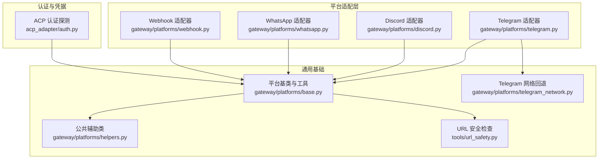
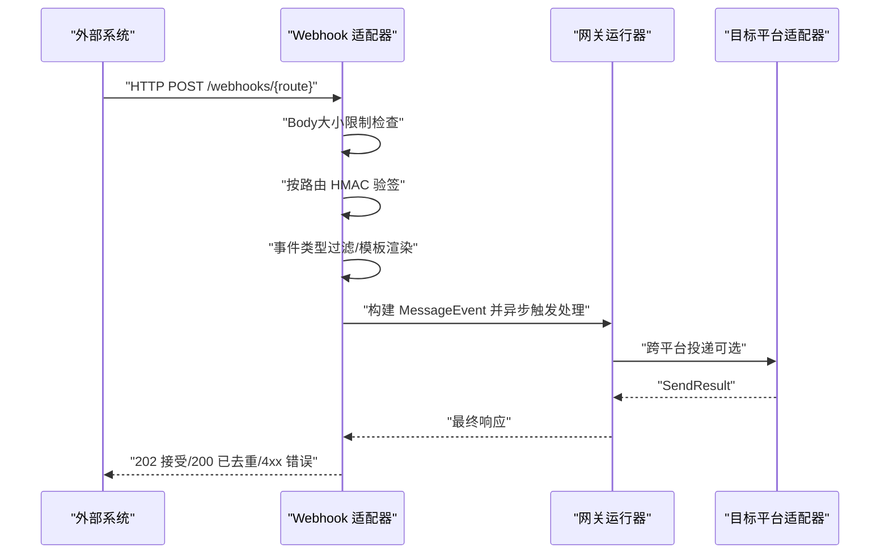
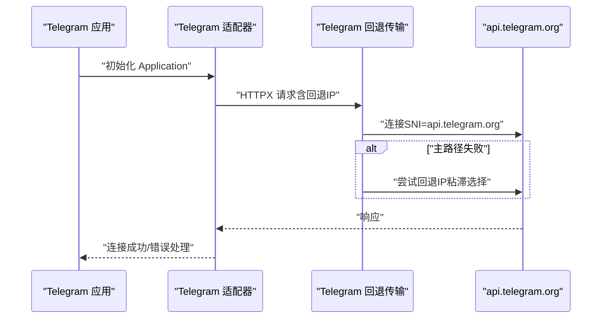
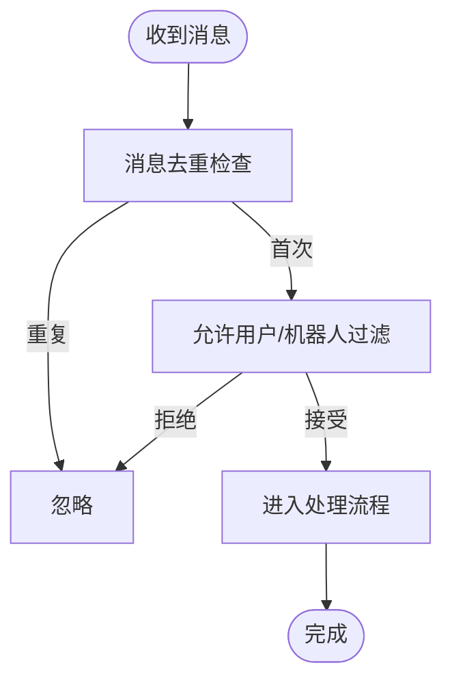
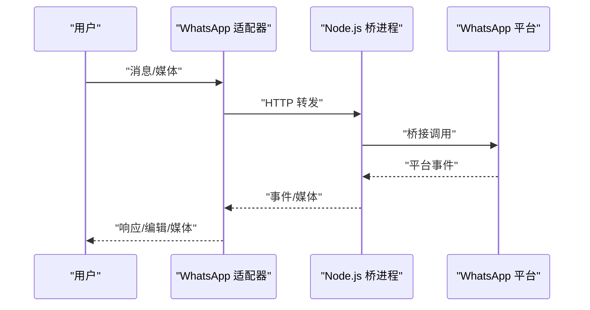
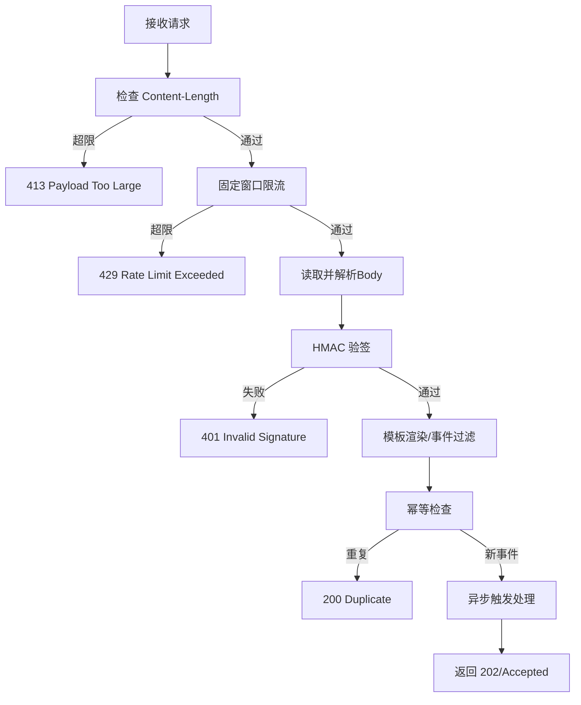
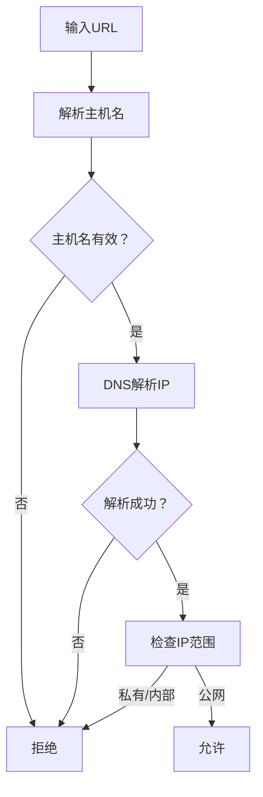
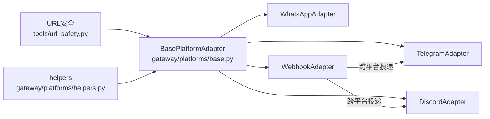

# 平台安全

<cite>
**本文引用的文件**
- [gateway/platforms/base.py](file://gateway/platforms/base.py)
- [gateway/platforms/telegram.py](file://gateway/platforms/telegram.py)
- [gateway/platforms/telegram_network.py](file://gateway/platforms/telegram_network.py)
- [gateway/platforms/discord.py](file://gateway/platforms/discord.py)
- [gateway/platforms/whatsapp.py](file://gateway/platforms/whatsapp.py)
- [gateway/platforms/webhook.py](file://gateway/platforms/webhook.py)
- [tools/url_safety.py](file://tools/url_safety.py)
- [gateway/platforms/helpers.py](file://gateway/platforms/helpers.py)
- [acp_adapter/auth.py](file://acp_adapter/auth.py)
</cite>

## 目录
1. [简介](#简介)
2. [项目结构](#项目结构)
3. [核心组件](#核心组件)
4. [架构总览](#架构总览)
5. [详细组件分析](#详细组件分析)
6. [依赖分析](#依赖分析)
7. [性能考虑](#性能考虑)
8. [故障排查指南](#故障排查指南)
9. [结论](#结论)
10. [附录](#附录)

## 简介
本指南面向在多平台上部署与运行 Hermes Agent 的安全团队与运维工程师，系统性梳理各消息平台（Telegram、Discord、WhatsApp 等）在认证、授权、输入校验、传输安全与事件处理方面的安全实现与最佳实践。重点覆盖：
- 认证机制：平台令牌、Webhook HMAC 验签、OAuth 流程与凭据池管理
- 权限控制：群组/频道白名单/黑名单、私聊与 DM 主题、机器人交互策略
- URL 安全：SSRF 防护、重定向二次验证、媒体下载缓存与路径安全
- 平台间通信：消息签名验证、数据完整性保护、跨平台投递一致性
- 安全事件监控与响应：致命错误上报、网络异常自动恢复、日志脱敏

## 项目结构
Hermes 将“平台适配器”抽象为统一接口，各平台通过独立模块实现连接、鉴权、消息收发与媒体处理，并共享通用工具（URL 安全、媒体缓存、去重与批处理等）。Webhook 作为外部系统入口，提供基于 HMAC 的签名验证与幂等、限流保障。

图示来源
- [gateway/platforms/base.py](file://gateway/platforms/base.py)
- [gateway/platforms/telegram.py](file://gateway/platforms/telegram.py)
- [gateway/platforms/telegram_network.py](file://gateway/platforms/telegram_network.py)
- [gateway/platforms/discord.py](file://gateway/platforms/discord.py)
- [gateway/platforms/whatsapp.py](file://gateway/platforms/whatsapp.py)
- [gateway/platforms/webhook.py](file://gateway/platforms/webhook.py)
- [tools/url_safety.py](file://tools/url_safety.py)
- [gateway/platforms/helpers.py](file://gateway/platforms/helpers.py)
- [acp_adapter/auth.py](file://acp_adapter/auth.py)

章节来源
- [gateway/platforms/base.py](file://gateway/platforms/base.py)
- [gateway/platforms/telegram.py](file://gateway/platforms/telegram.py)
- [gateway/platforms/telegram_network.py](file://gateway/platforms/telegram_network.py)
- [gateway/platforms/discord.py](file://gateway/platforms/discord.py)
- [gateway/platforms/whatsapp.py](file://gateway/platforms/whatsapp.py)
- [gateway/platforms/webhook.py](file://gateway/platforms/webhook.py)
- [tools/url_safety.py](file://tools/url_safety.py)
- [gateway/platforms/helpers.py](file://gateway/platforms/helpers.py)
- [acp_adapter/auth.py](file://acp_adapter/auth.py)

## 核心组件
- 平台基类与通用工具
  - 统一的消息事件模型、发送结果封装、文本批处理与去重、媒体缓存与清理、代理解析与网络可达性判断、URL 安全检查与重定向二次验证等。
- 平台适配器
  - Telegram：支持轮询与 Webhook，内置 Telegram 回退 IP 传输层以绕过不可达的官方域名解析；DM 主题持久化；网络错误指数回退重连。
  - Discord：支持语音接收与解码（DAVE/E2EE）、消息去重、线程参与跟踪、允许用户列表与机器人过滤策略。
  - WhatsApp：通过 Node.js 桥接进程转发消息，支持回复前缀、提及模式匹配、自由响应聊天白名单、会话锁避免重复登录。
  - Webhook：通用 HTTP 入口，按路由级 HMAC 验签、限流、幂等、动态订阅热加载、跨平台投递。
- URL 安全与 SSRF 防护
  - 基于主机名解析与 IP 范围判定，阻断私有/环回/保留地址与 CGNAT；对重定向进行二次校验，媒体下载缓存时同样应用安全策略。
- 认证与凭据
  - ACP 提供者探测；凭据池支持 API Key 与 OAuth；OAuth 客户端信息预注册与回调处理。

章节来源
- [gateway/platforms/base.py](file://gateway/platforms/base.py)
- [tools/url_safety.py](file://tools/url_safety.py)
- [gateway/platforms/helpers.py](file://gateway/platforms/helpers.py)
- [gateway/platforms/telegram.py](file://gateway/platforms/telegram.py)
- [gateway/platforms/telegram_network.py](file://gateway/platforms/telegram_network.py)
- [gateway/platforms/discord.py](file://gateway/platforms/discord.py)
- [gateway/platforms/whatsapp.py](file://gateway/platforms/whatsapp.py)
- [gateway/platforms/webhook.py](file://gateway/platforms/webhook.py)
- [acp_adapter/auth.py](file://acp_adapter/auth.py)

## 架构总览
下图展示平台适配器如何与通用工具协作，以及 Webhook 如何作为外部系统入口进行签名验证与跨平台投递。

图示来源
- [gateway/platforms/webhook.py](file://gateway/platforms/webhook.py)
- [gateway/platforms/base.py](file://gateway/platforms/base.py)

章节来源
- [gateway/platforms/webhook.py](file://gateway/platforms/webhook.py)
- [gateway/platforms/base.py](file://gateway/platforms/base.py)

## 详细组件分析

### Telegram 安全实现
- 认证与连接
  - 使用 Bot Token 进行身份认证；支持轮询与 Webhook 两种接入方式；Webhook 支持密钥校验。
  - 通过自定义 HTTPX 请求传输层启用 Telegram 回退 IP，保持 TLS SNI 与主机名不变，提升在受限网络下的可用性。
- 权限与交互
  - DM 主题支持与持久化；文本/相册批处理减少抖动；网络错误指数回退重连，冲突检测与致命错误上报。
- URL 安全
  - 媒体下载使用 URL 安全检查与重定向二次验证，防止 SSRF；图片/音频/文档缓存带清理策略。

图示来源
- [gateway/platforms/telegram.py](file://gateway/platforms/telegram.py)
- [gateway/platforms/telegram_network.py](file://gateway/platforms/telegram_network.py)

章节来源
- [gateway/platforms/telegram.py](file://gateway/platforms/telegram.py)
- [gateway/platforms/telegram_network.py](file://gateway/platforms/telegram_network.py)
- [gateway/platforms/base.py](file://gateway/platforms/base.py)
- [tools/url_safety.py](file://tools/url_safety.py)

### Discord 安全实现
- 认证与连接
  - 使用 Bot Token；根据允许用户列表动态决定是否请求成员意图；支持代理（HTTP/SOCKS）。
- 权限与交互
  - 消息去重（RESUME 重放防护）；线程参与跟踪持久化；反应反馈与处理生命周期钩子；机器人消息过滤策略。
- URL 安全
  - 文本批处理与 Markdown 清理；媒体下载同样遵循 URL 安全策略。

图示来源
- [gateway/platforms/discord.py](file://gateway/platforms/discord.py)
- [gateway/platforms/helpers.py](file://gateway/platforms/helpers.py)

章节来源
- [gateway/platforms/discord.py](file://gateway/platforms/discord.py)
- [gateway/platforms/helpers.py](file://gateway/platforms/helpers.py)
- [tools/url_safety.py](file://tools/url_safety.py)

### WhatsApp 安全实现
- 认证与连接
  - 通过 Node.js 桥接进程（whatsapp-web.js/Baileys/业务 API）与平台交互；本地健康检查与自动重启；会话锁避免并发登录。
- 权限与交互
  - 支持“提及机器人”“回复机器人”“命令前缀”“自由响应聊天白名单”“自定义提及正则”等策略；支持回复前缀与会话持久化。
- URL 安全
  - 通过 HTTP 客户端与媒体缓存工具链复用通用 URL 安全策略。

图示来源
- [gateway/platforms/whatsapp.py](file://gateway/platforms/whatsapp.py)

章节来源
- [gateway/platforms/whatsapp.py](file://gateway/platforms/whatsapp.py)
- [tools/url_safety.py](file://tools/url_safety.py)

### Webhook 安全实现
- 认证与限流
  - 路由级 HMAC-SHA256 验签（GitHub/GitLab/通用），全局或路由级密钥；Body 大小限制；固定窗口限流。
- 幂等与投递
  - 基于 delivery_id 的幂等缓存；动态订阅热加载；支持日志投递与跨平台投递（Telegram/Discord/Slack 等）。
- 安全最佳实践
  - 所有路由必须配置密钥；生产禁用“跳过验证”模式；严格限制最大 Body；对未知交付类型返回明确错误。

图示来源
- [gateway/platforms/webhook.py](file://gateway/platforms/webhook.py)

章节来源
- [gateway/platforms/webhook.py](file://gateway/platforms/webhook.py)

### URL 安全与 SSRF 防护
- 核心策略
  - 解析主机名并解析 IP，阻断私有/环回/链路本地/保留/多播/未指定/CGNAT 等范围；对重定向进行二次校验；媒体下载缓存时同样应用安全策略。
- 适用范围
  - 视觉工具、平台媒体缓存、Webhook 工具链均复用该策略。

图示来源
- [tools/url_safety.py](file://tools/url_safety.py)
- [gateway/platforms/base.py](file://gateway/platforms/base.py)

章节来源
- [tools/url_safety.py](file://tools/url_safety.py)
- [gateway/platforms/base.py](file://gateway/platforms/base.py)

### 平台间通信与数据完整性
- 消息签名验证
  - Webhook 采用 HMAC-SHA256 验签；Telegram/Webhook 可结合平台侧 Webhook 密钥共同保障。
- 数据完整性保护
  - 重定向二次验证；媒体下载缓存与路径安全；代理与网络回退增强可用性与稳定性。
- 跨平台投递一致性
  - Webhook 适配器维护 delivery 信息并在最终响应到达前不消费，确保状态消息与最终响应一致投递。

章节来源
- [gateway/platforms/webhook.py](file://gateway/platforms/webhook.py)
- [gateway/platforms/telegram.py](file://gateway/platforms/telegram.py)
- [gateway/platforms/telegram_network.py](file://gateway/platforms/telegram_network.py)
- [gateway/platforms/base.py](file://gateway/platforms/base.py)

### 平台特定安全最佳实践
- Telegram
  - 启用 Webhook 并配置密钥；开启 DM 主题；合理设置媒体/文本批处理延迟；在受限网络启用回退 IP。
- Discord
  - 明确允许用户列表；必要时请求成员意图；启用消息去重与线程参与跟踪；谨慎开启机器人消息接受策略。
- WhatsApp
  - 使用 Node.js 桥接并配置会话目录；启用提及/回复/命令前缀策略；配置自由响应聊天白名单。
- Webhook
  - 为每个路由配置密钥；限制最大 Body；启用限流；使用动态订阅文件；跨平台投递时指定 chat_id/thread_id。

章节来源
- [gateway/platforms/telegram.py](file://gateway/platforms/telegram.py)
- [gateway/platforms/discord.py](file://gateway/platforms/discord.py)
- [gateway/platforms/whatsapp.py](file://gateway/platforms/whatsapp.py)
- [gateway/platforms/webhook.py](file://gateway/platforms/webhook.py)

### 安全事件监控与响应
- 致命错误上报
  - 平台适配器在发生致命错误（如 Telegram 冲突/网络错误、WhatsApp 桥进程退出）时记录并通知网关。
- 自动恢复
  - Telegram 网络错误指数回退重连；Discord/Telegram 冲突重试；WhatsApp 桥进程健康检查与重启。
- 日志与脱敏
  - URL 安全日志输出时去除敏感信息；代理与网络参数按需记录；媒体缓存清理策略降低风险面。

章节来源
- [gateway/platforms/telegram.py](file://gateway/platforms/telegram.py)
- [gateway/platforms/whatsapp.py](file://gateway/platforms/whatsapp.py)
- [gateway/platforms/base.py](file://gateway/platforms/base.py)

## 依赖分析
- 组件耦合
  - 平台适配器均继承自统一基类，共享消息事件、发送结果、媒体缓存、代理与网络工具。
  - Webhook 适配器依赖网关运行器进行跨平台投递。
- 外部依赖
  - Telegram：python-telegram-bot；Discord：discord.py；WhatsApp：Node.js 桥；Webhook：aiohttp。
- 循环依赖
  - 未发现循环导入；工具模块为纯函数与辅助类，被适配器单向依赖。

图示来源
- [gateway/platforms/base.py](file://gateway/platforms/base.py)
- [gateway/platforms/telegram.py](file://gateway/platforms/telegram.py)
- [gateway/platforms/discord.py](file://gateway/platforms/discord.py)
- [gateway/platforms/whatsapp.py](file://gateway/platforms/whatsapp.py)
- [gateway/platforms/webhook.py](file://gateway/platforms/webhook.py)
- [tools/url_safety.py](file://tools/url_safety.py)
- [gateway/platforms/helpers.py](file://gateway/platforms/helpers.py)

章节来源
- [gateway/platforms/base.py](file://gateway/platforms/base.py)
- [gateway/platforms/telegram.py](file://gateway/platforms/telegram.py)
- [gateway/platforms/discord.py](file://gateway/platforms/discord.py)
- [gateway/platforms/whatsapp.py](file://gateway/platforms/whatsapp.py)
- [gateway/platforms/webhook.py](file://gateway/platforms/webhook.py)
- [tools/url_safety.py](file://tools/url_safety.py)
- [gateway/platforms/helpers.py](file://gateway/platforms/helpers.py)

## 性能考虑
- 连接与重试
  - Telegram 指数回退重连；Discord/Telegram 冲突重试；避免在非幂等操作上盲目重试。
- 媒体与缓存
  - 图片/音频/文档缓存带清理策略；媒体下载重试与超时控制；批处理减少平台压力。
- 代理与网络
  - 代理与网络回退提升可用性；DoH 发现回退 IP 降低人工配置成本。

## 故障排查指南
- Telegram
  - “另一个进程已在轮询”：停止其他实例后重启；网络错误：检查回退 IP 与代理；Webhook 密钥：确认路由密钥与路径。
- Discord
  - 成员意图缺失导致无法解析用户名：按需开启；消息重复：检查去重 TTL；语音解码失败：确认 Opus 加载与 DAVE 会话。
- WhatsApp
  - 桥进程退出：查看日志文件；会话目录权限：确保可写；提及/回复策略：核对配置与正则。
- Webhook
  - 413/429：调整 Body 限制与限流；401：核对路由密钥；404：确认路由名称；重复事件：幂等 TTL 与 delivery_id。

章节来源
- [gateway/platforms/telegram.py](file://gateway/platforms/telegram.py)
- [gateway/platforms/discord.py](file://gateway/platforms/discord.py)
- [gateway/platforms/whatsapp.py](file://gateway/platforms/whatsapp.py)
- [gateway/platforms/webhook.py](file://gateway/platforms/webhook.py)

## 结论
Hermes 在多平台消息安全方面提供了从认证、鉴权、输入校验到传输与事件处理的完整闭环：平台适配器遵循统一基类与工具集，Webhook 作为外部入口提供强健的签名与限流机制，URL 安全与媒体缓存策略有效降低 SSRF 风险。建议在生产环境强制启用密钥与限流、启用回退 IP 与代理、定期清理媒体缓存，并建立致命错误与网络异常的自动恢复与告警机制。

## 附录
- 认证与凭据
  - ACP 提供者探测用于识别当前运行时提供商；凭据池支持 API Key 与 OAuth，便于集中管理与轮换。
- 最佳实践清单
  - 为所有路由配置密钥；限制最大 Body；启用限流；启用 DM 主题/线程参与跟踪；启用媒体缓存清理；在受限网络启用回退 IP；对未知交付类型返回明确错误；记录致命错误并自动恢复。

章节来源
- [acp_adapter/auth.py](file://acp_adapter/auth.py)
- [gateway/platforms/base.py](file://gateway/platforms/base.py)
- [gateway/platforms/webhook.py](file://gateway/platforms/webhook.py)
- [gateway/platforms/telegram.py](file://gateway/platforms/telegram.py)
- [gateway/platforms/discord.py](file://gateway/platforms/discord.py)
- [gateway/platforms/whatsapp.py](file://gateway/platforms/whatsapp.py)