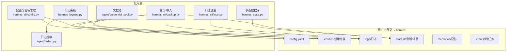
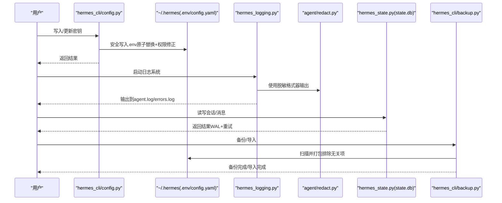
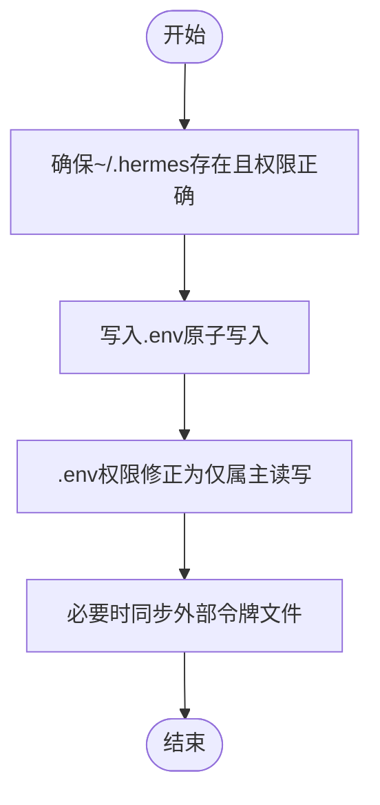
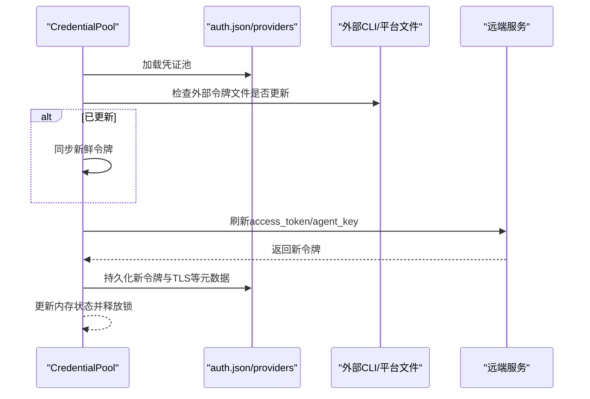
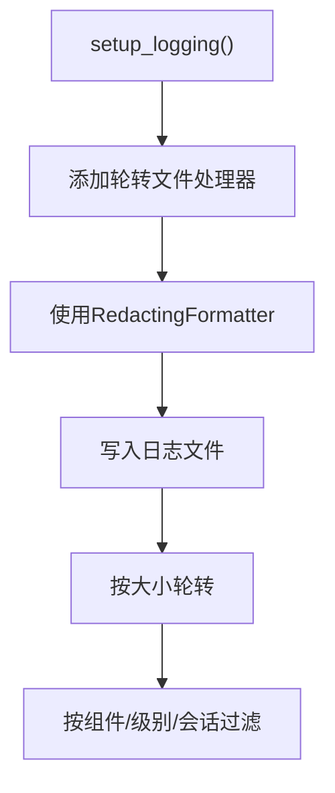
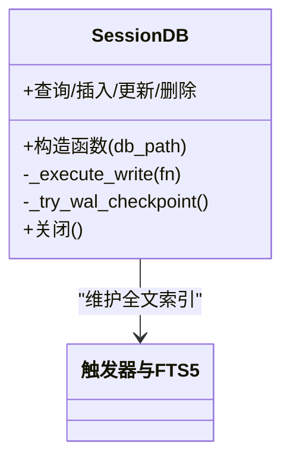
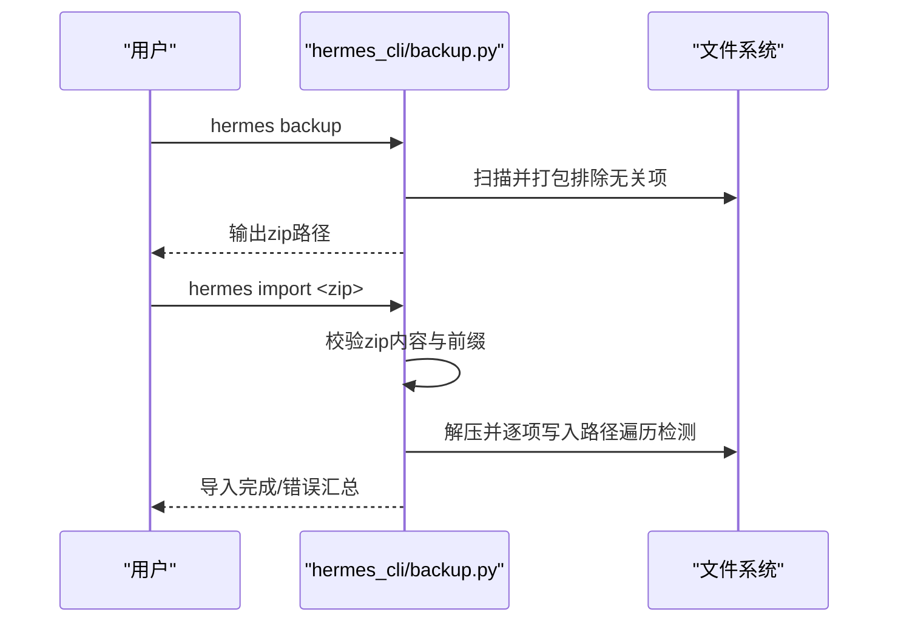
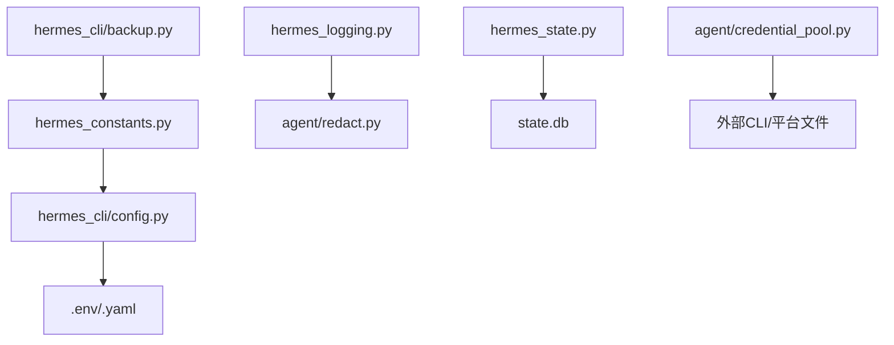

# 数据安全

<cite>
**本文引用的文件**
- [hermes_cli/config.py](file://hermes_cli/config.py)
- [hermes_constants.py](file://hermes_constants.py)
- [hermes_logging.py](file://hermes_logging.py)
- [agent/redact.py](file://agent/redact.py)
- [hermes_cli/backup.py](file://hermes_cli/backup.py)
- [hermes_state.py](file://hermes_state.py)
- [agent/credential_pool.py](file://agent/credential_pool.py)
- [hermes_cli/logs.py](file://hermes_cli/logs.py)
- [tests/cron/test_file_permissions.py](file://tests/cron/test_file_permissions.py)
- [tests/hermes_cli/test_config.py](file://tests/hermes_cli/test_config.py)
- [tests/hermes_cli/test_auth_commands.py](file://tests/hermes_cli/test_auth_commands.py)
- [tests/hermes_cli/test_auth_codex_provider.py](file://tests/hermes_cli/test_auth_codex_provider.py)
- [tests/tools/test_browser_secret_exfil.py](file://tests/tools/test_browser_secret_exfil.py)
- [tests/test_hermes_state.py](file://tests/test_hermes_state.py)
- [website/docs/user-guide/messaging/matrix.md](file://website/docs/user-guide/messaging/matrix.md)
</cite>

## 目录
1. [简介](#简介)
2. [项目结构](#项目结构)
3. [核心组件](#核心组件)
4. [架构总览](#架构总览)
5. [详细组件分析](#详细组件分析)
6. [依赖分析](#依赖分析)
7. [性能考虑](#性能考虑)
8. [故障排查指南](#故障排查指南)
9. [结论](#结论)
10. [附录](#附录)

## 简介
本指南面向Hermes Agent用户与运维人员，系统化阐述数据安全保护机制，覆盖以下关键领域：
- 敏感信息保护：API密钥、令牌等机密数据的存储与传输安全
- 配置与环境变量：~/.hermes/.env的权限与加密建议
- 会话与内存数据：SQLite数据库访问控制与潜在加密建议
- 日志系统：敏感信息过滤与日志脱敏
- 备份与恢复：备份数据的加密与存储位置选择
- 泄露防护与合规：实施要点与最佳实践

## 项目结构
Hermes Agent围绕“主目录~/.hermes”集中存放配置、密钥、日志与状态数据。核心安全相关模块分布如下：
- 配置与密钥管理：hermes_cli/config.py、hermes_constants.py
- 日志与脱敏：hermes_logging.py、agent/redact.py
- 备份与导入：hermes_cli/backup.py
- 会话与内存：hermes_state.py
- 凭据池与令牌刷新：agent/credential_pool.py
- 日志查看工具：hermes_cli/logs.py
- 安全测试与验证：tests/* 下多处单元测试

图示来源
- [hermes_cli/config.py:215-414](file://hermes_cli/config.py#L215-L414)
- [hermes_logging.py:161-265](file://hermes_logging.py#L161-L265)
- [agent/redact.py:113-182](file://agent/redact.py#L113-L182)
- [hermes_cli/backup.py:79-188](file://hermes_cli/backup.py#L79-L188)
- [hermes_state.py:115-240](file://hermes_state.py#L115-L240)
- [agent/credential_pool.py:358-761](file://agent/credential_pool.py#L358-L761)
- [hermes_cli/logs.py:138-247](file://hermes_cli/logs.py#L138-L247)

章节来源
- [hermes_cli/config.py:215-414](file://hermes_cli/config.py#L215-L414)
- [hermes_logging.py:161-265](file://hermes_logging.py#L161-L265)
- [agent/redact.py:113-182](file://agent/redact.py#L113-L182)
- [hermes_cli/backup.py:79-188](file://hermes_cli/backup.py#L79-L188)
- [hermes_state.py:115-240](file://hermes_state.py#L115-L240)
- [agent/credential_pool.py:358-761](file://agent/credential_pool.py#L358-L761)
- [hermes_cli/logs.py:138-247](file://hermes_cli/logs.py#L138-L247)

## 核心组件
- 配置与密钥管理：负责确保~/.hermes目录及子目录、文件的最小权限；提供安全写入.env的方法，并在写入后强制权限；支持从外部CLI或平台文件同步令牌。
- 日志与脱敏：统一的日志初始化，使用带脱敏格式器的轮转文件处理器，避免敏感信息落盘；支持按组件路由到不同日志文件。
- 备份与恢复：提供备份与导入命令，自动排除临时与运行时无关文件；导入时进行路径遍历检测与权限错误处理。
- 会话与内存：基于SQLite的会话数据库，启用WAL模式与外键约束；对并发写入采用应用层重试与随机抖动，降低锁竞争。
- 凭据池：集中管理同一提供商的多个凭证，支持OAuth刷新与单次使用令牌同步，减少泄露面。

章节来源
- [hermes_cli/config.py:215-414](file://hermes_cli/config.py#L215-L414)
- [hermes_logging.py:161-265](file://hermes_logging.py#L161-L265)
- [agent/redact.py:113-182](file://agent/redact.py#L113-L182)
- [hermes_cli/backup.py:79-188](file://hermes_cli/backup.py#L79-L188)
- [hermes_state.py:115-240](file://hermes_state.py#L115-L240)
- [agent/credential_pool.py:358-761](file://agent/credential_pool.py#L358-L761)

## 架构总览
下图展示数据在系统中的流向与安全控制点：

图示来源
- [hermes_cli/config.py:2550-2749](file://hermes_cli/config.py#L2550-L2749)
- [hermes_logging.py:161-265](file://hermes_logging.py#L161-L265)
- [agent/redact.py:113-182](file://agent/redact.py#L113-L182)
- [hermes_state.py:115-240](file://hermes_state.py#L115-L240)
- [hermes_cli/backup.py:79-188](file://hermes_cli/backup.py#L79-L188)

## 详细组件分析

### 配置与环境变量安全（~/.hermes/.env）
- 目录与文件权限
  - 初始化时确保~/.hermes及其子目录（cron、sessions、logs、memories）仅属主可读写；默认模式可通过环境变量覆盖。
  - .env与config.yaml等关键文件写入后强制权限为仅属主读写，避免被其他用户读取。
- 环境变量写入流程
  - 采用原子写入（临时文件+替换），写入后立即修正权限，防止竞态导致的短暂暴露。
  - 支持从外部CLI或平台文件（如Claude Code、Codex）同步令牌，避免重复消费单次使用令牌。
- 测试验证
  - 单测覆盖保存/移除.env条目后的权限变更与POSIX权限校验。

图示来源
- [hermes_cli/config.py:215-414](file://hermes_cli/config.py#L215-L414)
- [hermes_cli/config.py:2550-2749](file://hermes_cli/config.py#L2550-L2749)
- [tests/cron/test_file_permissions.py:78-102](file://tests/cron/test_file_permissions.py#L78-L102)
- [tests/hermes_cli/test_config.py:132-163](file://tests/hermes_cli/test_config.py#L132-L163)

章节来源
- [hermes_cli/config.py:215-414](file://hermes_cli/config.py#L215-L414)
- [hermes_cli/config.py:2550-2749](file://hermes_cli/config.py#L2550-L2749)
- [tests/cron/test_file_permissions.py:78-102](file://tests/cron/test_file_permissions.py#L78-L102)
- [tests/hermes_cli/test_config.py:132-163](file://tests/hermes_cli/test_config.py#L132-L163)

### 凭据池与令牌刷新（OAuth/Agent Key）
- 凭据池
  - 统一管理同一提供商的多个凭证，支持多种选择策略（优先级、轮询、随机、最少使用）。
  - 对于OAuth凭证，内置刷新逻辑与冷却时间，避免因配额/速率限制导致的连续失败。
- 刷新与同步
  - 与外部CLI/平台文件（如Codex、Claude Code）保持令牌同步，避免单次使用令牌被重复消费。
  - 刷新成功后回写至auth.json/providers以避免下次加载时重新注入已过期令牌。
- 测试验证
  - 单测覆盖从auth.json/providers读取、刷新失败重试、TLS配置持久化等场景。

图示来源
- [agent/credential_pool.py:358-761](file://agent/credential_pool.py#L358-L761)
- [tests/hermes_cli/test_auth_commands.py:107-146](file://tests/hermes_cli/test_auth_commands.py#L107-L146)
- [tests/hermes_cli/test_auth_codex_provider.py:45-82](file://tests/hermes_cli/test_auth_codex_provider.py#L45-L82)

章节来源
- [agent/credential_pool.py:358-761](file://agent/credential_pool.py#L358-L761)
- [tests/hermes_cli/test_auth_commands.py:107-146](file://tests/hermes_cli/test_auth_commands.py#L107-L146)
- [tests/hermes_cli/test_auth_codex_provider.py:45-82](file://tests/hermes_cli/test_auth_codex_provider.py#L45-L82)

### 日志系统与脱敏
- 日志文件
  - 默认生成agent.log（活动日志）、errors.log（告警/错误）、gateway.log（网关组件）。
  - 使用轮转文件处理器，配合脱敏格式器，确保敏感信息不落盘。
- 脱敏规则
  - 匹配常见API前缀、授权头、JSON字段、环境赋值、私钥块、数据库连接串、电话号码等。
  - 可通过环境变量禁用脱敏，但默认开启。
- 日志查看
  - 提供tail/follow能力，支持按级别、会话、组件、相对时间过滤。

图示来源
- [hermes_logging.py:161-265](file://hermes_logging.py#L161-L265)
- [agent/redact.py:113-182](file://agent/redact.py#L113-L182)
- [hermes_cli/logs.py:138-247](file://hermes_cli/logs.py#L138-L247)

章节来源
- [hermes_logging.py:161-265](file://hermes_logging.py#L161-L265)
- [agent/redact.py:113-182](file://agent/redact.py#L113-L182)
- [hermes_cli/logs.py:138-247](file://hermes_cli/logs.py#L138-L247)
- [tests/tools/test_browser_secret_exfil.py:156-186](file://tests/tools/test_browser_secret_exfil.py#L156-L186)

### 会话与内存数据（SQLite）
- 访问控制
  - 启用WAL模式与外键约束，提升并发与一致性。
  - 并发写入采用短超时+应用层重试+随机抖动，避免锁等待导致的界面冻结。
- 数据完整性
  - 建立FTS5虚拟表用于消息全文检索；触发器维护索引。
- 测试验证
  - 单测覆盖WAL模式、外键启用、标题唯一性、迁移兼容等。

图示来源
- [hermes_state.py:115-240](file://hermes_state.py#L115-L240)
- [tests/test_hermes_state.py:916-1056](file://tests/test_hermes_state.py#L916-L1056)

章节来源
- [hermes_state.py:115-240](file://hermes_state.py#L115-L240)
- [tests/test_hermes_state.py:916-1056](file://tests/test_hermes_state.py#L916-L1056)

### 备份与恢复（安全策略）
- 备份
  - 自动扫描~/.hermes，排除仓库、缓存、PID文件等；压缩输出并显示统计。
  - 自动识别归档前缀并剥离，便于跨工具兼容。
- 导入
  - 校验归档内容是否包含config.yaml/.env/state数据库等关键标记。
  - 路径遍历检测（禁止绝对路径与上溯），遇到权限错误逐项跳过并汇总。
  - 成功导入后尝试重建profile别名脚本（若可用）。
- 存储与加密
  - 建议将备份文件放置受控存储（本地加密磁盘/云加密桶），并限制访问权限。
  - 导入前确认目标目录已有配置时需交互确认，避免误覆盖。

图示来源
- [hermes_cli/backup.py:79-188](file://hermes_cli/backup.py#L79-L188)
- [hermes_cli/backup.py:194-399](file://hermes_cli/backup.py#L194-L399)

章节来源
- [hermes_cli/backup.py:79-188](file://hermes_cli/backup.py#L79-L188)
- [hermes_cli/backup.py:194-399](file://hermes_cli/backup.py#L194-L399)

### 环境变量与密钥管理最佳实践
- 权限
  - .env与config.yaml严格限制为仅属主读写；目录模式可通过环境变量调整。
- 写入
  - 使用原子写入与权限修正，避免竞态窗口。
- 同步
  - 与外部CLI/平台文件保持令牌同步，避免单次使用令牌被重复消费。
- 显示
  - 在配置查看中对密钥进行脱敏显示，仅保留前后缀以便识别。

章节来源
- [hermes_cli/config.py:215-414](file://hermes_cli/config.py#L215-L414)
- [hermes_cli/config.py:2550-2749](file://hermes_cli/config.py#L2550-L2749)
- [agent/credential_pool.py:453-546](file://agent/credential_pool.py#L453-L546)

### 日志脱敏与敏感信息过滤
- 脱敏范围
  - API密钥前缀、授权头、JSON字段、环境赋值、Telegram Bot令牌、私钥块、数据库连接串、E.164电话号码。
- 运行时控制
  - 可通过环境变量禁用脱敏；默认启用。
- 测试覆盖
  - 单测验证在注释树上下文、环境变量导出等场景下的脱敏效果。

章节来源
- [agent/redact.py:113-182](file://agent/redact.py#L113-L182)
- [tests/tools/test_browser_secret_exfil.py:156-186](file://tests/tools/test_browser_secret_exfil.py#L156-L186)

### 会话数据库并发与一致性
- WAL模式与外键
  - 提升并发写入性能与数据一致性。
- 应用层重试
  - 短超时+随机抖动降低锁竞争，避免长时间阻塞。
- FTS5全文检索
  - 自动生成并维护消息索引，支持高效检索。

章节来源
- [hermes_state.py:115-240](file://hermes_state.py#L115-L240)
- [tests/test_hermes_state.py:916-1056](file://tests/test_hermes_state.py#L916-L1056)

### 备份与恢复的安全建议
- 备份
  - 使用hermes backup生成压缩包，自动排除无关文件；建议在可信网络与受控存储中保存。
- 恢复
  - 导入前进行内容校验与路径遍历检测；遇到权限错误逐项记录并继续。
- 加密
  - 建议对备份文件进行端到端加密（例如使用GPG或系统级加密卷）；仅在需要时解密。
- 存储位置
  - 避免将备份保存在公共目录或未加密的共享存储；优先使用本地加密磁盘或企业加密云存储。

章节来源
- [hermes_cli/backup.py:79-188](file://hermes_cli/backup.py#L79-L188)
- [hermes_cli/backup.py:194-399](file://hermes_cli/backup.py#L194-L399)

### 数据泄露防护与合规
- 泄露防护
  - 使用脱敏格式器与权限控制，避免敏感信息落盘与越权访问。
  - 在日志查看中支持按组件/级别/会话过滤，缩小可见范围。
- 合规建议
  - 依据组织策略启用/禁用脱敏；定期审计~/.hermes目录权限与日志文件大小。
  - 对备份文件进行加密与访问控制，满足数据最小化与可追溯性要求。

章节来源
- [hermes_logging.py:161-265](file://hermes_logging.py#L161-L265)
- [hermes_cli/logs.py:138-247](file://hermes_cli/logs.py#L138-L247)

## 依赖分析
- 组件耦合
  - 日志系统依赖脱敏模块；配置模块负责密钥与文件权限；备份模块依赖常量模块解析路径。
- 外部集成
  - 凭据池与外部CLI/平台文件（Codex、Claude Code）存在双向同步关系，降低令牌泄露风险。
- 潜在循环依赖
  - 常量模块无依赖，作为导入安全的基石，避免循环依赖风险。

图示来源
- [hermes_constants.py:11-112](file://hermes_constants.py#L11-L112)
- [hermes_cli/config.py:215-414](file://hermes_cli/config.py#L215-L414)
- [hermes_logging.py:161-265](file://hermes_logging.py#L161-L265)
- [agent/redact.py:113-182](file://agent/redact.py#L113-L182)
- [hermes_state.py:115-240](file://hermes_state.py#L115-L240)
- [agent/credential_pool.py:453-546](file://agent/credential_pool.py#L453-L546)
- [hermes_cli/backup.py:79-188](file://hermes_cli/backup.py#L79-L188)

章节来源
- [hermes_constants.py:11-112](file://hermes_constants.py#L11-L112)
- [hermes_cli/config.py:215-414](file://hermes_cli/config.py#L215-L414)
- [hermes_logging.py:161-265](file://hermes_logging.py#L161-L265)
- [agent/redact.py:113-182](file://agent/redact.py#L113-L182)
- [hermes_state.py:115-240](file://hermes_state.py#L115-L240)
- [agent/credential_pool.py:453-546](file://agent/credential_pool.py#L453-L546)
- [hermes_cli/backup.py:79-188](file://hermes_cli/backup.py#L79-L188)

## 性能考虑
- 日志性能
  - 使用轮转文件处理器与脱敏格式器，避免大对象序列化带来的开销。
- 数据库并发
  - WAL模式与外键约束提升并发写入性能；应用层重试+随机抖动避免锁竞争。
- 备份效率
  - ZIP压缩与进度提示；对大量小文件导入时分批处理并记录警告。

## 故障排查指南
- 权限问题
  - 若出现PermissionError，请检查~/.hermes目录与文件权限是否被修改；使用配置模块提供的安全写入接口。
- 日志无法读取
  - 确认日志文件是否存在；使用日志查看工具按级别/组件过滤定位问题。
- 备份/恢复异常
  - 检查zip有效性与内容标记；关注路径遍历阻止与权限错误提示；必要时在安全环境下手动解压验证。
- Matrix加密设备迁移
  - 参考文档步骤生成新访问令牌、清理旧加密状态、设置恢复密钥并强制旋转会话。

章节来源
- [hermes_cli/config.py:2550-2749](file://hermes_cli/config.py#L2550-L2749)
- [hermes_cli/logs.py:138-247](file://hermes_cli/logs.py#L138-L247)
- [hermes_cli/backup.py:194-399](file://hermes_cli/backup.py#L194-L399)
- [website/docs/user-guide/messaging/matrix.md:379-423](file://website/docs/user-guide/messaging/matrix.md#L379-L423)

## 结论
Hermes Agent在设计层面已内置多项数据安全机制：严格的文件权限控制、统一的日志脱敏、安全的备份/恢复流程、以及针对OAuth令牌的同步与刷新策略。结合本文给出的配置与操作建议，可在实际部署中进一步强化敏感信息保护、降低泄露风险，并满足合规要求。

## 附录
- 常用路径
  - ~/.hermes/config.yaml：主配置
  - ~/.hermes/.env：API密钥与令牌
  - ~/.hermes/logs/：日志文件
  - ~/.hermes/state.db：会话与消息数据库
- 关键环境变量
  - HERMES_HOME：自定义主目录
  - HERMES_HOME_MODE：覆盖~/.hermes目录模式
  - HERMES_REDACT_SECRETS：控制脱敏开关