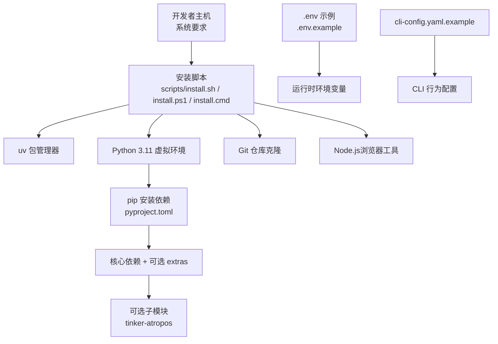
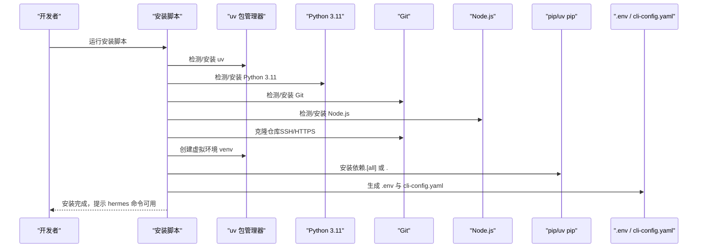
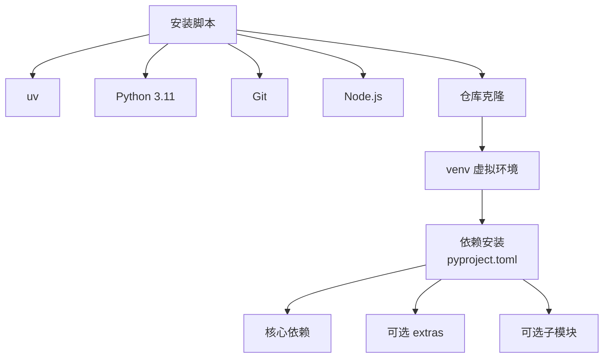

# 开发环境搭建

<cite>
**本文引用的文件**
- [README.md](file://README.md)
- [pyproject.toml](file://pyproject.toml)
- [requirements.txt](file://requirements.txt)
- [setup-hermes.sh](file://scripts/install.sh)
- [scripts/install.sh](file://scripts/install.sh)
- [scripts/install.cmd](file://scripts/install.cmd)
- [scripts/install.ps1](file://scripts/install.ps1)
- [cli-config.yaml.example](file://cli-config.yaml.example)
- [flake.nix](file://flake.nix)
- [flake.lock](file://flake.lock)
- [website/package.json](file://website/package.json)
- [website/docusaurus.config.ts](file://website/docusaurus.config.ts)
</cite>

## 目录
1. [简介](#简介)
2. [项目结构](#项目结构)
3. [核心组件](#核心组件)
4. [架构总览](#架构总览)
5. [详细组件分析](#详细组件分析)
6. [依赖关系分析](#依赖关系分析)
7. [性能考虑](#性能考虑)
8. [故障排除指南](#故障排除指南)
9. [结论](#结论)
10. [附录](#附录)

## 简介
本指南面向希望在本地进行 Hermes Agent 开发的工程师，提供从系统要求、工具链安装、虚拟环境与依赖安装到配置文件设置、跨平台兼容性与开发验证的完整流程。内容基于仓库中的安装脚本、构建配置与示例配置文件整理而成，确保不同平台（Linux、macOS、Windows、Android/Termux）均可顺利搭建。

## 项目结构
Hermes Agent 的开发环境涉及以下关键部分：
- 安装与初始化：提供多平台安装脚本（Linux/macOS/Windows/Android/Termux），自动检测并安装 uv、Python 3.11、Git、Node.js，并创建虚拟环境与依赖。
- 构建与打包：通过 pyproject.toml 定义核心与可选依赖，支持 extras（如 dev、all、messaging、voice 等）。
- 配置文件：提供 cli-config.yaml.example 作为 CLI 行为配置模板；.env.example 用于环境变量模板（安装脚本会生成 .env）。
- 可选子模块：tinker-atropos（RL 训练后端）等，按需安装。
- 开发工具链：Nix 支持（flake.nix/flake.lock）、网站文档（Docusaurus）的 Node.js 版本要求。

图表来源
- [scripts/install.sh](file://scripts/install.sh)
- [scripts/install.ps1](file://scripts/install.ps1)
- [pyproject.toml](file://pyproject.toml)

章节来源
- [README.md](file://README.md)
- [pyproject.toml](file://pyproject.toml)
- [scripts/install.sh](file://scripts/install.sh)
- [scripts/install.ps1](file://scripts/install.ps1)

## 核心组件
- 系统要求
  - Python 3.11+：安装脚本会优先使用 uv 自动查找或安装指定版本。
  - Git：用于克隆仓库与更新。
  - uv 包管理器：快速安装与同步依赖，支持 lockfile 校验。
  - Node.js（可选但推荐）：用于浏览器工具链（如快照、自动化等）。
- 依赖管理
  - 核心依赖集中在 pyproject.toml 的 [project.dependencies]。
  - 可选 extras：dev、all、messaging、voice、tts-premium、mcp、acp、honcho 等。
  - requirements.txt 提供便捷安装参考（以 pip 安装 .[all] 为主）。
- 配置文件
  - .env：运行时环境变量（安装脚本会从 .env.example 生成）。
  - cli-config.yaml：CLI 行为配置模板（复制为 ~/.hermes/config.yaml 使用）。
- 可选子模块
  - tinker-atropos：RL 训练相关，按需安装。

章节来源
- [pyproject.toml](file://pyproject.toml)
- [requirements.txt](file://requirements.txt)
- [cli-config.yaml.example](file://cli-config.yaml.example)

## 架构总览
下图展示开发环境搭建的关键流程与组件交互：

图表来源
- [scripts/install.sh](file://scripts/install.sh)
- [scripts/install.ps1](file://scripts/install.ps1)
- [pyproject.toml](file://pyproject.toml)

## 详细组件分析

### 系统要求与工具链
- Python 3.11+
  - 安装脚本会优先使用 uv 查找或安装 Python 3.11；Windows 脚本也支持通过 uv 安装。
- Git
  - 用于克隆仓库与更新；Windows 脚本对 Git 进行了兼容性处理（避免原子写入问题）。
- uv 包管理器
  - 快速安装与同步；优先使用 lockfile（uv.lock）进行哈希校验安装。
- Node.js（浏览器工具）
  - 安装脚本会检测并安装 Node.js LTS（v22），若系统已有则复用。

章节来源
- [scripts/install.sh](file://scripts/install.sh)
- [scripts/install.ps1](file://scripts/install.ps1)

### 项目克隆与初始化
- Linux/macOS/Android/Termux
  - 使用 curl 下载安装脚本，自动完成依赖检测、仓库克隆、虚拟环境与依赖安装。
- Windows
  - 提供 PowerShell 安装脚本与 CMD 包装器；支持 winget/choco/scoop 安装系统依赖。
  - 若 Git 克隆失败，会回退到下载 ZIP 并初始化本地 git 仓库。

章节来源
- [scripts/install.sh](file://scripts/install.sh)
- [scripts/install.ps1](file://scripts/install.ps1)
- [scripts/install.cmd](file://scripts/install.cmd)

### 虚拟环境与依赖安装
- 虚拟环境
  - 使用 uv venv 创建 Python 3.11 虚拟环境；Windows 使用 venv/Scripts 下的 hermes.exe。
- 依赖安装
  - 优先使用 uv pip install -e ".[all]"；若失败回退到基础安装。
  - 支持 extras：dev、all、messaging、voice、tts-premium、mcp、acp、honcho 等。
  - 可选子模块：tinker-atropos（RL 后端），按需安装。

章节来源
- [pyproject.toml](file://pyproject.toml)
- [scripts/install.sh](file://scripts/install.sh)
- [scripts/install.ps1](file://scripts/install.ps1)

### 配置文件设置
- 环境变量文件 .env
  - 安装脚本会从 .env.example 生成 ~/.hermes/.env；首次运行 hermes setup 后可交互配置。
- CLI 配置文件 cli-config.yaml
  - 复制 cli-config.yaml.example 为 ~/.hermes/config.yaml；
  - 支持模型提供商选择、终端后端（local/ssh/docker/modal/daytona）、安全扫描、浏览器工具、上下文压缩、记忆、会话重置策略、流式传输、技能、代理行为、工具集、MCP 服务器、语音转写、显示选项等。

章节来源
- [cli-config.yaml.example](file://cli-config.yaml.example)
- [scripts/install.sh](file://scripts/install.sh)
- [scripts/install.ps1](file://scripts/install.ps1)

### 跨平台兼容性
- Linux
  - 通过包管理器安装 ripgrep/ffmpeg；支持多种发行版（apt/dnf/pacman）。
- macOS
  - 优先使用 Homebrew 安装可选系统依赖；Node.js 二进制由安装脚本下载。
- Windows
  - 优先 winget 安装可选系统依赖；若失败尝试 choco/scoop；Git 克隆失败回退 ZIP。
- Android/Termux
  - 使用 Python stdlib venv + pip；安装受限于 Android 可用轮子；ripgrep/ffmpeg 通过 pkg 安装。

章节来源
- [scripts/install.sh](file://scripts/install.sh)
- [scripts/install.ps1](file://scripts/install.ps1)

### 开发工具链配置
- Nix 支持
  - flake.nix 定义系统与导入模块；支持 pyproject-nix/uv2nix 等工具链集成。
- 文档站点（Docusaurus）
  - Node.js 要求 >= 20；用于构建与发布文档网站。

章节来源
- [flake.nix](file://flake.nix)
- [flake.lock](file://flake.lock)
- [website/package.json](file://website/package.json)
- [website/docusaurus.config.ts](file://website/docusaurus.config.ts)

## 依赖关系分析
下图展示安装脚本与核心依赖的关系：

图表来源
- [scripts/install.sh](file://scripts/install.sh)
- [pyproject.toml](file://pyproject.toml)

章节来源
- [pyproject.toml](file://pyproject.toml)
- [scripts/install.sh](file://scripts/install.sh)

## 性能考虑
- 使用 uv 进行依赖安装与同步，具备更快的速度与哈希校验能力。
- 在容器后端（docker/modal/daytona）执行命令时，合理设置资源限制（CPU/内存/磁盘）与持久化策略，避免频繁重建。
- 对于长对话上下文，启用自动压缩（compression）可降低 token 使用量，提升响应速度。

## 故障排除指南
- uv 未找到或未在 PATH 中
  - 安装脚本会自动安装 uv；若失败，请手动添加 ~/.local/bin 到 PATH。
- Python 版本不满足要求
  - 使用 uv 自动安装 Python 3.11；Windows 可降级到 3.12/3.13。
- Git 克隆失败（Windows）
  - 安装脚本已针对 Git for Windows 的原子写入问题进行配置；若仍失败，回退到 ZIP 下载方式。
- Node.js 未安装或版本不匹配
  - 安装脚本会自动安装 Node.js LTS（v22）；Windows 优先 winget，否则下载二进制。
- 权限问题（Linux/macOS）
  - 安装脚本会尝试通过 sudo 安装可选系统依赖；若无密码权限，会提示手动安装。
- 可选子模块缺失（tinker-atropos）
  - 需要手动初始化子模块并安装；安装脚本会提示并尝试安装。

章节来源
- [scripts/install.sh](file://scripts/install.sh)
- [scripts/install.ps1](file://scripts/install.ps1)

## 结论
通过安装脚本与构建配置，Hermes Agent 在多平台上提供了统一且可重复的开发环境搭建体验。建议在开始开发前先完成系统要求与工具链安装，再根据需要启用可选 extras 与子模块，并正确配置 .env 与 cli-config.yaml。遇到问题时，可依据故障排除指南逐步定位与解决。

## 附录

### 快速开始（多平台）
- Linux/macOS/Android/Termux
  - 执行安装脚本，自动完成 uv、Python、Git、Node.js 检测与安装，创建 venv 并安装依赖。
- Windows
  - 使用 PowerShell 安装脚本，自动处理 Git、Node.js、系统依赖与 PATH 设置。

章节来源
- [scripts/install.sh](file://scripts/install.sh)
- [scripts/install.ps1](file://scripts/install.ps1)