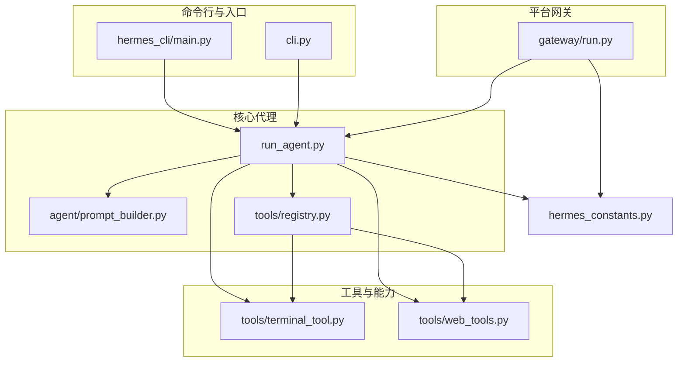
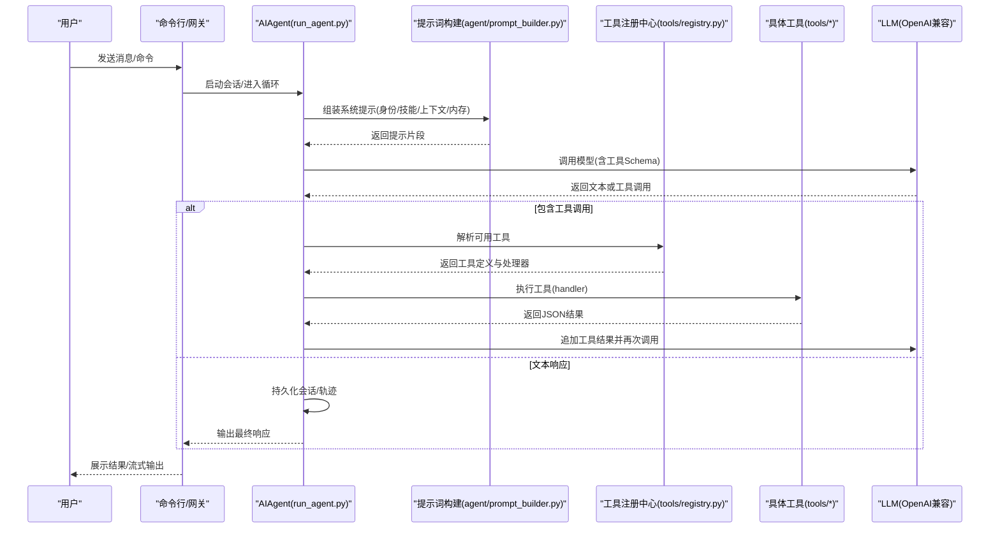
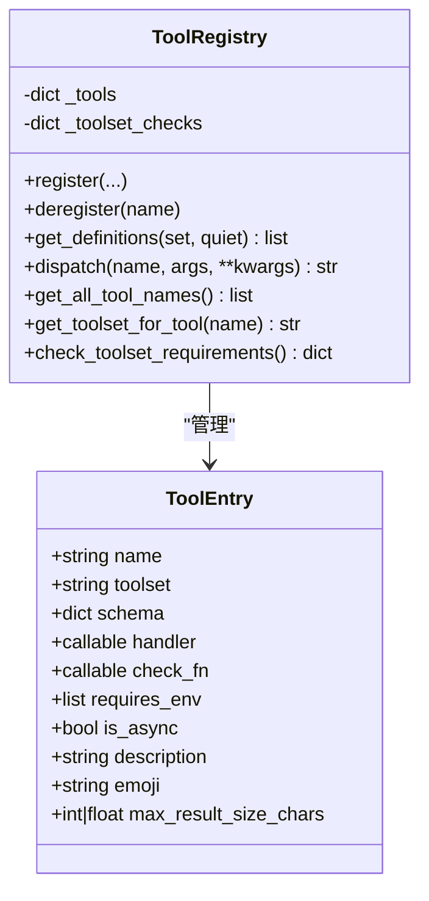
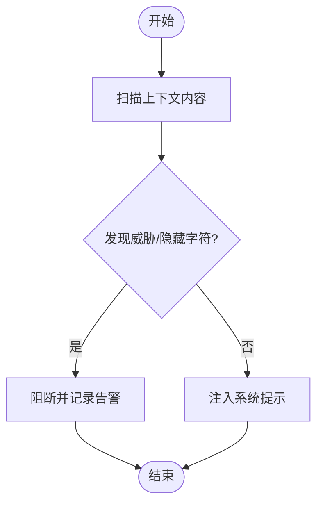
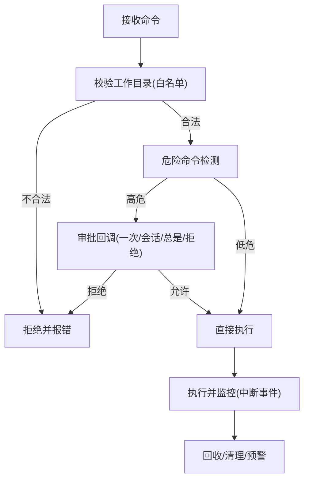
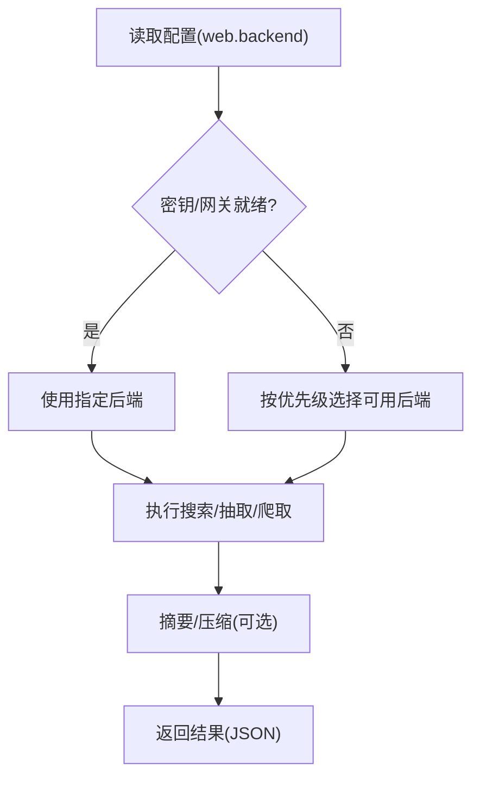
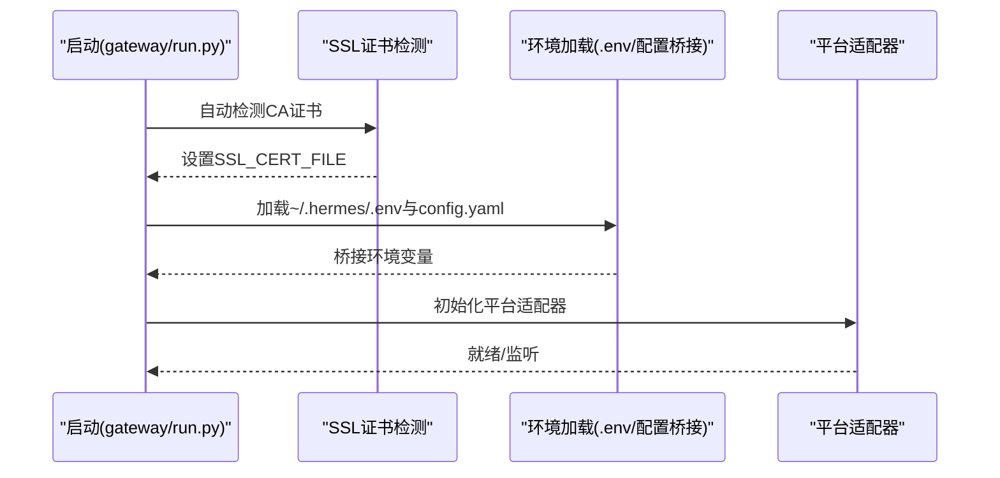
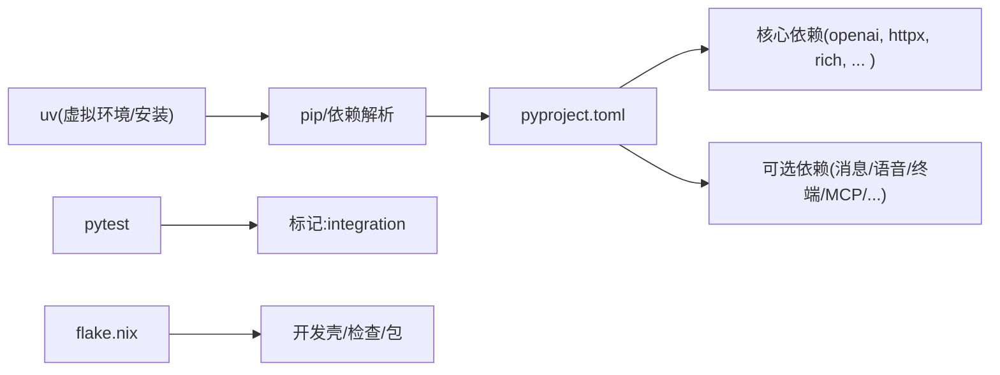

# 开发者指南

<cite>
**本文引用的文件**
- [CONTRIBUTING.md](file://CONTRIBUTING.md)
- [README.md](file://README.md)
- [pyproject.toml](file://pyproject.toml)
- [requirements.txt](file://requirements.txt)
- [flake.nix](file://flake.nix)
- [.github/PULL_REQUEST_TEMPLATE.md](file://.github/PULL_REQUEST_TEMPLATE.md)
- [cli.py](file://cli.py)
- [run_agent.py](file://run_agent.py)
- [hermes_cli/main.py](file://hermes_cli/main.py)
- [tools/registry.py](file://tools/registry.py)
- [agent/prompt_builder.py](file://agent/prompt_builder.py)
- [hermes_constants.py](file://hermes_constants.py)
- [tools/terminal_tool.py](file://tools/terminal_tool.py)
- [tools/web_tools.py](file://tools/web_tools.py)
- [gateway/run.py](file://gateway/run.py)
</cite>

## 目录
1. [简介](#简介)
2. [项目结构](#项目结构)
3. [核心组件](#核心组件)
4. [架构总览](#架构总览)
5. [详细组件分析](#详细组件分析)
6. [依赖关系分析](#依赖关系分析)
7. [性能考量](#性能考量)
8. [故障排查指南](#故障排查指南)
9. [结论](#结论)
10. [附录](#附录)

## 简介
本指南面向开源贡献者与内部开发者，提供Hermes Agent的开发环境搭建、代码结构理解、贡献流程、测试策略、代码质量标准、调试与性能分析方法，以及新功能开发、缺陷修复与文档维护的实践建议。内容基于仓库中的贡献指南、安装说明、依赖清单与核心源码进行系统化整理。

## 项目结构
Hermes Agent采用模块化分层组织：命令行入口、运行时代理、工具注册与调度、平台网关、技能与可选技能、测试套件等。关键模块职责如下：
- 命令行入口与交互界面：hermes_cli/main.py、cli.py
- 核心代理循环与工具调用：run_agent.py
- 工具注册中心与工具集：tools/registry.py、toolsets.py（由model_tools.py桥接）
- 提示词构建与上下文注入：agent/prompt_builder.py
- 平台网关与多端消息集成：gateway/run.py 及其子模块
- 终端执行与多后端环境：tools/terminal_tool.py
- 网页检索与内容抽取：tools/web_tools.py
- 全局常量与路径解析：hermes_constants.py
- 依赖与打包配置：pyproject.toml、requirements.txt、flake.nix

**图表来源**
- [hermes_cli/main.py:1-200](file://hermes_cli/main.py#L1-L200)
- [cli.py:1-200](file://cli.py#L1-L200)
- [run_agent.py:1-200](file://run_agent.py#L1-L200)
- [agent/prompt_builder.py:1-200](file://agent/prompt_builder.py#L1-L200)
- [tools/registry.py:1-336](file://tools/registry.py#L1-L336)
- [tools/terminal_tool.py:1-200](file://tools/terminal_tool.py#L1-L200)
- [tools/web_tools.py:1-200](file://tools/web_tools.py#L1-L200)
- [gateway/run.py:1-200](file://gateway/run.py#L1-L200)
- [hermes_constants.py:1-200](file://hermes_constants.py#L1-L200)

**章节来源**
- [CONTRIBUTING.md:114-198](file://CONTRIBUTING.md#L114-L198)
- [README.md:30-84](file://README.md#L30-L84)

## 核心组件
- 命令行与交互界面
  - hermes_cli/main.py：命令解析、参数处理、服务生命周期控制（启动/停止/状态/安装卸载）、日志初始化、IPv4偏好设置等。
  - cli.py：交互式终端界面，支持多行编辑、自动补全、会话历史、中断重定向、流式工具输出等。
- 核心代理与工具系统
  - run_agent.py：AIAgent主循环，负责提示词构建、模型调用、工具分发、上下文压缩、会话持久化与轨迹保存。
  - tools/registry.py：工具注册中心，集中管理工具Schema、处理器、可用性检查与动态分发。
  - agent/prompt_builder.py：系统提示组装器，注入身份、平台提示、技能索引、上下文文件与内存提示，内置威胁检测与内容净化。
- 平台网关
  - gateway/run.py：统一网关入口，加载配置、桥接环境变量、管理平台适配器生命周期、处理SSL证书与网络配置。
- 终端与网页工具
  - tools/terminal_tool.py：本地/容器/云沙箱多后端执行，支持后台任务、VM生命周期管理、磁盘使用预警、危险命令审批。
  - tools/web_tools.py：多后端网页搜索/抽取/爬取，支持Firecrawl/Parallel/Tavily/Exa，具备调试模式与摘要生成。
- 全局常量与路径
  - hermes_constants.py：统一HERMES_HOME解析、WSL/容器识别、推理努力级别解析、跨平台兼容辅助函数。

**章节来源**
- [hermes_cli/main.py:1-200](file://hermes_cli/main.py#L1-L200)
- [cli.py:1-200](file://cli.py#L1-L200)
- [run_agent.py:1-200](file://run_agent.py#L1-L200)
- [tools/registry.py:1-336](file://tools/registry.py#L1-L336)
- [agent/prompt_builder.py:1-200](file://agent/prompt_builder.py#L1-L200)
- [gateway/run.py:1-200](file://gateway/run.py#L1-L200)
- [tools/terminal_tool.py:1-200](file://tools/terminal_tool.py#L1-L200)
- [tools/web_tools.py:1-200](file://tools/web_tools.py#L1-L200)
- [hermes_constants.py:1-200](file://hermes_constants.py#L1-L200)

## 架构总览
Hermes Agent的核心运行时遵循“提示词构建—模型调用—工具分发—结果回传”的循环。工具通过自注册机制加入注册中心，代理在每次迭代中根据可用工具集合动态构建函数调用Schema，并将结果注入对话历史，必要时触发上下文压缩与会话持久化。

**图表来源**
- [run_agent.py:1-200](file://run_agent.py#L1-L200)
- [agent/prompt_builder.py:1-200](file://agent/prompt_builder.py#L1-L200)
- [tools/registry.py:1-336](file://tools/registry.py#L1-L336)
- [tools/terminal_tool.py:1-200](file://tools/terminal_tool.py#L1-L200)
- [tools/web_tools.py:1-200](file://tools/web_tools.py#L1-L200)

**章节来源**
- [CONTRIBUTING.md:200-227](file://CONTRIBUTING.md#L200-L227)

## 详细组件分析

### 工具注册中心（tools/registry.py）
- 设计要点
  - 自注册：每个工具文件在导入时调用register，声明Schema、处理器、工具集与可用性检查。
  - 单例注册表：集中存储工具元数据，提供按名称查询、按工具集过滤、可用性检查与动态分发。
  - 错误收敛：工具异常统一包装为JSON错误字符串，保证调用方一致性。
- 关键接口
  - register/deregister：注册/注销工具条目，清理工具集检查。
  - get_definitions：返回可用工具的OpenAI格式Schema列表。
  - dispatch：按名称分发到处理器，支持同步/异步。
  - 工具集查询：工具集可用性、要求环境变量、工具清单等。
- 复杂度与性能
  - Schema查询与过滤：O(N)遍历工具集；可用性检查缓存于字典以避免重复计算。
  - 分发路径：直接字典查找，O(1)命中。

**图表来源**
- [tools/registry.py:24-291](file://tools/registry.py#L24-L291)

**章节来源**
- [tools/registry.py:1-336](file://tools/registry.py#L1-L336)

### 提示词构建与安全扫描（agent/prompt_builder.py）
- 功能概览
  - 身份与角色：默认身份描述、记忆与会话检索引导、技能使用约束。
  - 上下文文件扫描：检测潜在提示注入与隐藏字符，阻断后返回安全提示。
  - 技能条件筛选：根据当前可用工具/工具集动态决定技能可见性。
- 安全扫描
  - 威胁模式匹配：忽略指令、系统覆盖、绕过限制、隐藏元素等。
  - 不可见字符过滤：屏蔽零宽空格、方向控制符等。
- 性能与复杂度
  - 正则扫描：对每段上下文文件执行线性扫描，整体O(M×K)，M为上下文数量，K为平均长度。
  - 建议：在上游缓存已验证内容，减少重复扫描。

**图表来源**
- [agent/prompt_builder.py:55-74](file://agent/prompt_builder.py#L55-L74)

**章节来源**
- [agent/prompt_builder.py:1-200](file://agent/prompt_builder.py#L1-L200)

### 终端工具与多后端执行（tools/terminal_tool.py）
- 支持后端
  - 本地、Docker、Modal、SSH、Singularity、Daytona等，通过环境变量选择。
- 关键特性
  - 危险命令检测与审批回调，支持网关场景下的交互式确认。
  - 磁盘使用预警阈值配置，定期扫描Hermes相关目录总大小。
  - 前台超时硬上限与环境变量覆盖，防止长时间阻塞。
- 安全与稳定性
  - 工作目录白名单字符集校验，拒绝包含shell元字符的路径。
  - 子进程生命周期管理与清理，避免僵尸进程与资源泄漏。

**图表来源**
- [tools/terminal_tool.py:160-200](file://tools/terminal_tool.py#L160-L200)

**章节来源**
- [tools/terminal_tool.py:1-200](file://tools/terminal_tool.py#L1-L200)

### 网页工具与多后端路由（tools/web_tools.py）
- 后端选择
  - 支持Exa、Firecrawl、Parallel、Tavily，优先级依据配置与密钥存在情况。
  - 支持受保护的工具网关（Nous订阅者），提升访问稳定性与合规性。
- 调试与可观测性
  - WEB_TOOLS_DEBUG开关开启时，写入调试日志文件，记录调用、结果与压缩指标。
- 复杂度与可靠性
  - 后端可用性检查与降级策略，避免单点故障影响整体功能。

**图表来源**
- [tools/web_tools.py:83-121](file://tools/web_tools.py#L83-L121)

**章节来源**
- [tools/web_tools.py:1-200](file://tools/web_tools.py#L1-L200)

### 网关生命周期与配置桥接（gateway/run.py）
- 生命周期
  - SSL证书自动检测（NixOS/非标准系统），确保HTTP客户端可用。
  - 加载~/.hermes/.env与项目根.env，桥接config.yaml到环境变量，覆盖默认行为。
- 配置桥接
  - 将terminal、agent、display、auxiliary等配置映射为环境变量，供子进程与第三方库读取。
- 并发与信号
  - 异步事件循环、信号处理、优雅停机与重启排空。

**图表来源**
- [gateway/run.py:35-72](file://gateway/run.py#L35-L72)
- [gateway/run.py:92-200](file://gateway/run.py#L92-L200)

**章节来源**
- [gateway/run.py:1-200](file://gateway/run.py#L1-L200)

## 依赖关系分析
- 语言与包管理
  - Python 3.11+，推荐使用uv进行虚拟环境与依赖安装。
  - 主要依赖集中在OpenAI、Anthropic、prompt_toolkit、rich、httpx、pyyaml、pydantic等。
  - 可选依赖覆盖消息平台(messaging)、定时任务(cron)、语音(tts-premium/voice)、终端后端(pty)、MCP、ACP、Home Assistant、短信、钉钉、飞书、RL训练等。
- 测试与CI
  - pytest配置包含标记integration（外部服务测试）与并行执行(-n auto)。
  - flake.nix提供Nix生态的开发壳、包定义与检查项，支持多平台构建。
- 安装与运行
  - 推荐使用uv venv创建Python 3.11虚拟环境，安装“.[all,dev]”以启用全部功能与开发工具。
  - 一键安装脚本支持Linux/macOS/WSL2/Android Termux，Windows需WSL2。

**图表来源**
- [pyproject.toml:13-129](file://pyproject.toml#L13-L129)
- [requirements.txt:1-37](file://requirements.txt#L1-L37)
- [flake.nix:1-36](file://flake.nix#L1-L36)

**章节来源**
- [pyproject.toml:1-129](file://pyproject.toml#L1-L129)
- [requirements.txt:1-37](file://requirements.txt#L1-L37)
- [flake.nix:1-36](file://flake.nix#L1-L36)
- [CONTRIBUTING.md:52-111](file://CONTRIBUTING.md#L52-L111)

## 性能考量
- 工具调用与上下文管理
  - 使用工具注册中心按需过滤Schema，避免不必要的工具暴露导致Token膨胀。
  - 在接近上下文上限时触发压缩（如摘要/截断），降低延迟与成本。
- I/O与并发
  - 网关侧使用异步事件循环与连接池，减少阻塞。
  - 终端工具设置前台超时上限，避免长尾任务占用资源。
- 缓存与预热
  - 提示词构建与工具Schema查询结果可在会话内复用，减少重复计算。
- 资源监控
  - 终端工具提供磁盘使用预警，建议结合系统监控与告警策略。

[本节为通用指导，无需特定文件引用]

## 故障排查指南
- 常见问题定位
  - 环境变量与配置：确认~/.hermes/.env与config.yaml是否正确加载，必要时使用“hermes doctor”诊断。
  - SSL证书：在NixOS或非标准系统上，确保SSL_CERT_FILE已设置。
  - 工具可用性：检查工具可用性检查函数与工具集要求，确认所需密钥/网关已配置。
- 日志与调试
  - CLI与网关均初始化集中式文件日志，便于跨模块追踪。
  - 网页工具支持WEB_TOOLS_DEBUG开关，生成调试日志文件。
- 安全与合规
  - 危险命令审批与路径白名单校验，避免意外破坏。
  - 提示词扫描阻断潜在注入，保障系统提示安全。

**章节来源**
- [gateway/run.py:35-72](file://gateway/run.py#L35-L72)
- [tools/web_tools.py:25-29](file://tools/web_tools.py#L25-L29)
- [tools/terminal_tool.py:160-179](file://tools/terminal_tool.py#L160-L179)
- [agent/prompt_builder.py:55-74](file://agent/prompt_builder.py#L55-L74)

## 结论
Hermes Agent通过清晰的模块边界、自注册工具体系与跨平台兼容设计，提供了可扩展、可维护且安全的智能体框架。开发者应遵循贡献指南中的优先级、风格与流程，结合本文档的结构与最佳实践，高效完成新功能开发、缺陷修复与文档维护。

[本节为总结，无需特定文件引用]

## 附录

### 开发环境搭建与运行
- 前置条件
  - Git（支持递归子模块）
  - Python 3.11+
  - uv（快速Python包管理器）
  - Node.js 18+（浏览器工具与WhatsApp桥）
- 安装步骤
  - 克隆并安装：使用uv创建虚拟环境，安装“.[all,dev]”，可选安装浏览器工具依赖。
  - 配置用户目录：创建~/.hermes并复制示例配置，添加至少一个LLM提供商密钥。
  - 运行验证：创建全局软链接，执行“hermes doctor”与“hermes chat -q 'Hello'”。

**章节来源**
- [CONTRIBUTING.md:52-111](file://CONTRIBUTING.md#L52-L111)

### 贡献流程与规范
- 优先级与范围
  - 优先级：缺陷修复、跨平台兼容、安全加固、性能与鲁棒性、新技能、新工具、文档。
- 分支命名与提交
  - 分支命名：fix/、feat/、docs/、test/、refactor/。
  - 提交信息：Conventional Commits风格，类型包含fix/feat/docs/test/refactor/chore等。
- PR模板与审查
  - PR模板涵盖变更说明、测试步骤、平台验证、相关issue链接、新技能检查项等。
  - 审查要点：单逻辑变更、跨平台影响评估、测试覆盖、安全与性能。

**章节来源**
- [CONTRIBUTING.md:584-637](file://CONTRIBUTING.md#L584-L637)
- [.github/PULL_REQUEST_TEMPLATE.md:1-76](file://.github/PULL_REQUEST_TEMPLATE.md#L1-L76)

### 新功能开发与工具扩展示例
- 新增工具
  - 遵循自注册模式，在工具文件中定义Schema与处理器，并在model_tools.py中引入模块。
  - 如需新工具集，更新toolsets.py并在平台预设中启用。
- 新增技能
  - 在skills/或optional-skills/下按类别组织，编写SKILL.md并提供必要脚本。
  - 使用平台限定与条件激活（fallback_for/requires）控制技能可见性。
- 代码风格
  - PEP 8实践，强调注释的必要性与错误处理的明确性，避免假设Unix平台。

**章节来源**
- [CONTRIBUTING.md:239-300](file://CONTRIBUTING.md#L239-L300)
- [CONTRIBUTING.md:302-463](file://CONTRIBUTING.md#L302-L463)
- [CONTRIBUTING.md:230-236](file://CONTRIBUTING.md#L230-L236)

### 测试策略与质量标准
- 测试运行
  - 使用pytest tests/ -v运行全部测试；默认排除integration标记的外部服务测试。
- 质量标准
  - 覆盖率与并行执行：pytest配置支持并行(-n auto)与标记过滤。
  - Nix生态：flake.nix提供统一的开发环境与检查项，便于CI与本地一致化。

**章节来源**
- [pyproject.toml:123-129](file://pyproject.toml#L123-L129)
- [flake.nix:24-35](file://flake.nix#L24-L35)

### 调试技巧与性能分析
- 调试入口
  - CLI与网关均初始化集中日志；网页工具开启WEB_TOOLS_DEBUG可生成详细日志。
- 性能分析
  - 关注工具调用链路、上下文长度与压缩触发频率；结合终端工具的前台超时与磁盘预警，定位瓶颈。
- 问题诊断
  - 使用“hermes doctor”检查配置与依赖；在网关侧检查SSL证书与环境变量桥接。

**章节来源**
- [tools/web_tools.py:25-29](file://tools/web_tools.py#L25-L29)
- [gateway/run.py:92-200](file://gateway/run.py#L92-L200)