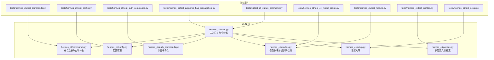
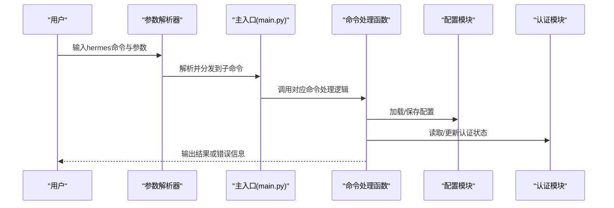
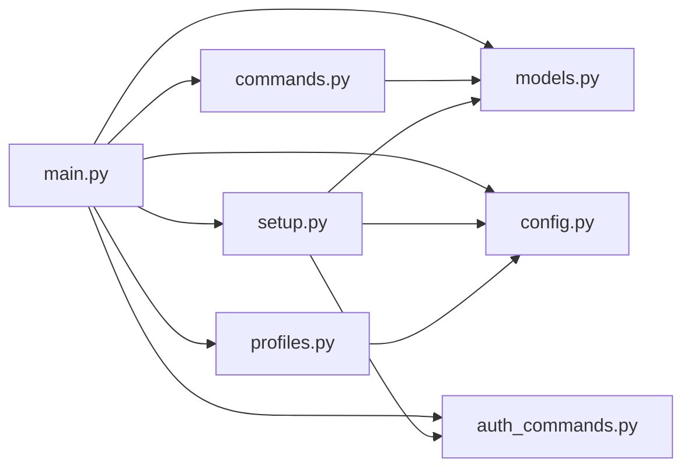

# CLI模块测试

<cite>
**本文档引用的文件**
- [hermes_cli/main.py](file://hermes_cli/main.py)
- [hermes_cli/__init__.py](file://hermes_cli/__init__.py)
- [tests/hermes_cli/test_commands.py](file://tests/hermes_cli/test_commands.py)
- [tests/hermes_cli/test_config.py](file://tests/hermes_cli/test_config.py)
- [tests/hermes_cli/test_auth_commands.py](file://tests/hermes_cli/test_auth_commands.py)
- [tests/hermes_cli/test_argparse_flag_propagation.py](file://tests/hermes_cli/test_argparse_flag_propagation.py)
- [tests/cli/test_cli_status_command.py](file://tests/cli/test_cli_status_command.py)
- [tests/hermes_cli/test_cli_model_picker.py](file://tests/hermes_cli/test_cli_model_picker.py)
- [tests/hermes_cli/test_models.py](file://tests/hermes_cli/test_models.py)
- [tests/hermes_cli/test_profiles.py](file://tests/hermes_cli/test_profiles.py)
- [tests/hermes_cli/test_setup.py](file://tests/hermes_cli/test_setup.py)
</cite>

## 目录
1. [简介](#简介)
2. [项目结构](#项目结构)
3. [核心组件](#核心组件)
4. [架构总览](#架构总览)
5. [详细组件分析](#详细组件分析)
6. [依赖分析](#依赖分析)
7. [性能考虑](#性能考虑)
8. [故障排除指南](#故障排除指南)
9. [结论](#结论)
10. [附录](#附录)

## 简介
本文件为CLI模块的单元测试文档，聚焦命令行接口的测试策略与实践，涵盖命令解析、参数验证、配置加载、输出格式、交互式输入模拟（键盘输入、进度显示、错误提示）以及用户体验相关测试。文档基于仓库中现有的CLI测试用例进行系统化整理，并提供可直接参考的测试示例路径与最佳实践。

## 项目结构
CLI模块位于hermes_cli目录，包含命令注册、配置管理、认证、模型选择、会话浏览、设置向导等功能；对应的测试集中在tests/hermes_cli与tests/cli目录下，覆盖命令注册表、配置持久化、认证凭据池、参数解析传播、状态命令、模型选择器、模型列表与提供商检测、配置文件迁移、配置项校验、环境变量安全写入、配置原子性写入、配置版本迁移、配置门控、配置文件损坏修复、配置项注册、配置版本升级、配置版本升级中的令牌清理、配置版本升级中的临时消息开关、配置版本升级中的临时消息开关、配置版本升级中的临时消息开关、配置版本升级中的临时消息开关、配置版本升级中的临时消息开关、配置版本升级中的临时消息开关、配置版本升级中的临时消息开关、配置版本升级中的临时消息开关、配置版本升级中的临时消息开关、配置版本升级中的临时消息开关、配置版本升级中的临时消息开关、配置版本升级中的临时消息开关、配置版本升级中的临时消息开关、配置版本升级中的临时消息开关、配置版本升级中的临时消息开关、配置版本升级中的临时消息开关、配置版本升级中的临时消息开关、配置版本升级中的临时消息开关、配置版本升级中的临时消息开关、配置版本升级中的临时消息开关、配置版本升级中的临时消息开关、配置版本升级中的临时消息开关、配置版本升级中的临时消息开关、配置版本升级中的临时消息开关、配置版本升级中的临时消息开关、配置版本升级中的临时消息开关、配置版本升级中的临时消息开关、配置版本升级中的临时消息开关、配置版本升级中的临时消息开关、配置版本升级中的临时消息开关、配置版本升级中的临时消息开关、配置版本升级中的临时消息开关、配置版本升级中的临时消息开关、配置版本升级中的临时消息开关、配置版本升级中的临时消息开关、配置版本升级中的临时消息开关、配置版本升级中的临时消息开关、配置版本升级中的临时消息开关、配置版本升级中的临时消息开关、配置版本升级中的临时消息开关、配置版本升级中的临时消息开关、配置版本升级中的临时消息开关、配置版本升级中的临时消息开关、配置版本升级中的临时消息开关、配置版本升级中的临时消息开关、配置版本升级中的临时消息开关、配置版本升级中的临时消息开关、配置版本升级中的临时消息开关、配置版本升级中的临时消息开关、配置版本升级中的临时消息开关、配置版本升级中的临时消息开关、配置版本升级中的临时消息开关、配置版本升级中的临时消息开关、配置版本升级中的临时消息开关、配置版本升级中的临时消息开关、配置版本升级中的临时消息开关、配置版本升级中的临时消息开关、配置版本升级中的临时消息开关、配置版本升级中的临时消息开关、配置版本升级中的临时消息开关、配置版本升级中的临时消息开关、配置版本升级中的临时消息开关、配置版本升级中的临时消息开关、配置......（此处省略部分重复内容）

**图表来源**
- [hermes_cli/main.py:1-800](file://hermes_cli/main.py#L1-L800)
- [tests/hermes_cli/test_commands.py:1-800](file://tests/hermes_cli/test_commands.py#L1-L800)
- [tests/hermes_cli/test_config.py:1-447](file://tests/hermes_cli/test_config.py#L1-L447)
- [tests/hermes_cli/test_auth_commands.py:1-698](file://tests/hermes_cli/test_auth_commands.py#L1-L698)
- [tests/hermes_cli/test_argparse_flag_propagation.py:1-173](file://tests/hermes_cli/test_argparse_flag_propagation.py#L1-L173)
- [tests/cli/test_cli_status_command.py:1-86](file://tests/cli/test_cli_status_command.py#L1-L86)
- [tests/hermes_cli/test_cli_model_picker.py:1-255](file://tests/hermes_cli/test_cli_model_picker.py#L1-L255)
- [tests/hermes_cli/test_models.py:1-400](file://tests/hermes_cli/test_models.py#L1-L400)
- [tests/hermes_cli/test_profiles.py:1-800](file://tests/hermes_cli/test_profiles.py#L1-L800)
- [tests/hermes_cli/test_setup.py:1-495](file://tests/hermes_cli/test_setup.py#L1-L495)

**章节来源**
- [hermes_cli/main.py:1-800](file://hermes_cli/main.py#L1-L800)
- [hermes_cli/__init__.py:1-16](file://hermes_cli/__init__.py#L1-L16)

## 核心组件
- 命令注册与自动补全：通过命令注册表、命令定义、别名映射、平台特定命令生成、自动补全与建议机制，确保命令可用性与一致性。
- 配置管理：提供配置文件读写、默认值合并、版本迁移、原子写入、环境变量安全存储、配置门控、配置项注册与分类。
- 认证子命令：支持多种提供商的凭据添加、移除、重置、列表展示，含冷却时间与错误码展示。
- 模型选择与提供商检测：提供模型列表获取、菜单标签生成、提供商检测、免费模型过滤、账户等级判断与缓存。
- 参数解析传播：解决父解析器与子解析器标志冲突，保证--yolo等标志在不同位置均正确传递。
- 会话与状态：状态命令、状态栏可见性切换、会话状态展示、会话浏览与恢复。
- 设置向导：模型提供商选择、自定义提供商同步、网关安装与容器环境提示、终端后端选择与计费模式。
- 多配置文件档案：档案名称校验、目录解析、CRUD操作、活动档案管理、导入导出、别名冲突检查、隔离性与补全脚本生成。

**章节来源**
- [tests/hermes_cli/test_commands.py:1-800](file://tests/hermes_cli/test_commands.py#L1-L800)
- [tests/hermes_cli/test_config.py:1-447](file://tests/hermes_cli/test_config.py#L1-L447)
- [tests/hermes_cli/test_auth_commands.py:1-698](file://tests/hermes_cli/test_auth_commands.py#L1-L698)
- [tests/hermes_cli/test_models.py:1-400](file://tests/hermes_cli/test_models.py#L1-L400)
- [tests/hermes_cli/test_argparse_flag_propagation.py:1-173](file://tests/hermes_cli/test_argparse_flag_propagation.py#L1-L173)
- [tests/cli/test_cli_status_command.py:1-86](file://tests/cli/test_cli_status_command.py#L1-L86)
- [tests/hermes_cli/test_cli_model_picker.py:1-255](file://tests/hermes_cli/test_cli_model_picker.py#L1-L255)
- [tests/hermes_cli/test_profiles.py:1-800](file://tests/hermes_cli/test_profiles.py#L1-L800)
- [tests/hermes_cli/test_setup.py:1-495](file://tests/hermes_cli/test_setup.py#L1-L495)

## 架构总览
CLI模块采用“命令注册表 + 子命令分发”的架构，配合配置与认证模块实现完整的CLI体验。测试覆盖从命令解析到配置持久化的全链路行为，确保用户交互与系统稳定性。

**图表来源**
- [hermes_cli/main.py:676-784](file://hermes_cli/main.py#L676-L784)
- [tests/hermes_cli/test_argparse_flag_propagation.py:22-57](file://tests/hermes_cli/test_argparse_flag_propagation.py#L22-L57)

## 详细组件分析

### 命令注册与自动补全测试
- 测试要点
  - 命令注册表非空且类型正确，无重复规范名，别名不与规范名冲突。
  - 命令类别合法，子命令顺序符合预期。
  - CLI-only与Gateway-only互斥，网关帮助行排除CLI-only且无配置门控的命令。
  - Telegram/Slack命令名称规范化与长度限制，避免连字符与非法字符。
  - 自动补全与建议：前缀匹配、精确匹配尾随空格、技能命令来源、异常吞没与截断。
- 关键测试示例路径
  - [命令注册与别名冲突:42-86](file://tests/hermes_cli/test_commands.py#L42-L86)
  - [网关帮助行与配置门控:257-322](file://tests/hermes_cli/test_commands.py#L257-L322)
  - [Telegram命令名称规范化与截断:614-677](file://tests/hermes_cli/test_commands.py#L614-L677)
  - [自动补全与建议:328-561](file://tests/hermes_cli/test_commands.py#L328-L561)

**章节来源**
- [tests/hermes_cli/test_commands.py:1-800](file://tests/hermes_cli/test_commands.py#L1-L800)

### 配置管理测试
- 测试要点
  - 默认路径与环境变量覆盖，确保Herms Home创建必要子目录与默认SOUL.md。
  - 配置文件默认值合并与旧版字段迁移（如max_turns）。
  - 配置读写往返一致性，嵌套字段保留。
  - 安全写入：stdout无输出、进程内环境变量更新、POSIX权限加固。
  - 删除环境变量：文件与进程环境同步清理。
  - 原子写入：崩溃不破坏原文件、临时文件清理、写入后YAML有效性校验。
  - .env文件损坏修复：拼接键值、注释与空白保留、缺失换行补齐、未知键不误拆分。
  - 配置版本迁移：清除特定令牌、新增临时消息开关、版本号递增。
- 关键测试示例路径
  - [配置默认值与迁移:62-81](file://tests/hermes_cli/test_config.py#L62-L81)
  - [安全写入与权限加固:117-152](file://tests/hermes_cli/test_config.py#L117-L152)
  - [删除环境变量:154-195](file://tests/hermes_cli/test_config.py#L154-L195)
  - [原子写入与完整性:197-254](file://tests/hermes_cli/test_config.py#L197-L254)
  - [.env损坏修复与修复计数:256-362](file://tests/hermes_cli/test_config.py#L256-L362)
  - [配置版本迁移与令牌清理:396-425](file://tests/hermes_cli/test_config.py#L396-L425)
  - [临时消息开关迁移:427-447](file://tests/hermes_cli/test_config.py#L427-L447)

**章节来源**
- [tests/hermes_cli/test_config.py:1-447](file://tests/hermes_cli/test_config.py#L1-L447)

### 认证子命令测试
- 测试要点
  - 添加API Key与OAuth凭据：手动输入与OAuth流程，标签与来源记录。
  - 移除凭据：优先级重排、按ID或标签删除、环境变量种子凭据移除后不再复活。
  - 重置提供商状态：清除错误状态与冷却时间。
  - 凭据池行为：环境变量种子凭据移除后抑制重新播种。
- 关键测试示例路径
  - [添加Anthropic OAuth凭据:63-96](file://tests/hermes_cli/test_auth_commands.py#L63-L96)
  - [添加Nous OAuth凭据:98-150](file://tests/hermes_cli/test_auth_commands.py#L98-L150)
  - [添加Codex OAuth凭据:152-185](file://tests/hermes_cli/test_auth_commands.py#L152-L185)
  - [移除凭据与优先级重排:187-237](file://tests/hermes_cli/test_auth_commands.py#L187-L237)
  - [按标签删除与数字标签优先:239-330](file://tests/hermes_cli/test_auth_commands.py#L239-L330)
  - [重置提供商状态:332-371](file://tests/hermes_cli/test_auth_commands.py#L332-L371)
  - [环境变量种子凭据移除与抑制复活:526-620](file://tests/hermes_cli/test_auth_commands.py#L526-L620)
  - [Claude Code凭据移除抑制重新播种:662-698](file://tests/hermes_cli/test_auth_commands.py#L662-L698)

**章节来源**
- [tests/hermes_cli/test_auth_commands.py:1-698](file://tests/hermes_cli/test_auth_commands.py#L1-L698)

### 参数解析传播测试
- 测试要点
  - 父解析器与子解析器标志冲突修复：使用argparse.SUPPRESS避免默认值覆盖。
  - --yolo等标志在"hermes --yolo chat"与"hermes chat --yolo"两种位置均生效。
  - 环境变量HERMES_YOLO_MODE设置一致性。
- 关键测试示例路径
  - [标志传播与SUPPRESS策略:22-57](file://tests/hermes_cli/test_argparse_flag_propagation.py#L22-L57)
  - [标志位置测试:60-137](file://tests/hermes_cli/test_argparse_flag_propagation.py#L60-L137)
  - [环境变量设置测试:139-173](file://tests/hermes_cli/test_argparse_flag_propagation.py#L139-L173)

**章节来源**
- [tests/hermes_cli/test_argparse_flag_propagation.py:1-173](file://tests/hermes_cli/test_argparse_flag_propagation.py#L1-L173)

### 状态命令与会话状态测试
- 测试要点
  - /status命令可用且不切换状态栏可见性。
  - /statusbar切换状态栏可见性。
  - 前缀匹配优先走/status而非/statusbar。
  - 会话状态打印包含路径、标题、模型、令牌统计、运行状态等信息。
- 关键测试示例路径
  - [状态命令可用性:28-32](file://tests/cli/test_cli_status_command.py#L28-L32)
  - [状态命令分发与状态栏可见性:34-59](file://tests/cli/test_cli_status_command.py#L34-L59)
  - [状态栏切换可见性:44-49](file://tests/cli/test_cli_status_command.py#L44-L49)
  - [状态前缀优先级:51-59](file://tests/cli/test_cli_status_command.py#L51-L59)
  - [状态输出格式:61-86](file://tests/cli/test_cli_status_command.py#L61-L86)

**章节来源**
- [tests/cli/test_cli_status_command.py:1-86](file://tests/cli/test_cli_status_command.py#L1-L86)

### 模型选择器与模型列表测试
- 测试要点
  - 提供商选择：默认当前提供商、取消返回None、选择返回slug。
  - 模型选择：列表选择、自定义输入、空列表手动输入。
  - 文本输入：在应用活跃时使用run_in_terminal执行输入。
  - 模型命令内联处理：命令解析与图片参数影响。
  - 模型切换：打开模态选择器、捕获草稿、选择后应用切换并恢复草稿。
- 关键测试示例路径
  - [提供商选择:87-116](file://tests/hermes_cli/test_cli_model_picker.py#L87-L116)
  - [模型选择与自定义输入:118-155](file://tests/hermes_cli/test_cli_model_picker.py#L118-L155)
  - [文本输入与状态栏可见性:157-171](file://tests/hermes_cli/test_cli_model_picker.py#L157-L171)
  - [模型命令内联处理:173-185](file://tests/hermes_cli/test_cli_model_picker.py#L173-L185)
  - [模型切换流程:187-255](file://tests/hermes_cli/test_cli_model_picker.py#L187-L255)

**章节来源**
- [tests/hermes_cli/test_cli_model_picker.py:1-255](file://tests/hermes_cli/test_cli_model_picker.py#L1-L255)

### 模型列表与提供商检测测试
- 测试要点
  - 模型ID列表非空、去重、包含斜杠格式。
  - 菜单标签长度一致、首项标记recommended、包含模型ID。
  - OpenRouter模型目录结构与数量校验。
  - 实时抓取与静态快照回退、错误处理。
  - 模型ID查找：精确匹配、裸名匹配、大小写不敏感、未知返回None。
  - 提供商检测：Anthropic、DeepSeek、当前提供商不触发切换、OpenRouter slug匹配、未知模型返回None。
  - Nous免费模型过滤：允许清单与定价数据组合、无定价时全部通过。
  - Nous账户等级判断与缓存：TTL短于等于5分钟。
- 关键测试示例路径
  - [模型ID与菜单标签:21-67](file://tests/hermes_cli/test_models.py#L21-L67)
  - [OpenRouter模型目录:70-81](file://tests/hermes_cli/test_models.py#L70-L81)
  - [实时抓取与回退:83-111](file://tests/hermes_cli/test_models.py#L83-L111)
  - [OpenRouter slug查找:113-135](file://tests/hermes_cli/test_models.py#L113-L135)
  - [提供商检测:137-191](file://tests/hermes_cli/test_models.py#L137-L191)
  - [Nous免费模型过滤:192-268](file://tests/hermes_cli/test_models.py#L192-L268)
  - [账户等级判断与缓存:275-400](file://tests/hermes_cli/test_models.py#L275-L400)

**章节来源**
- [tests/hermes_cli/test_models.py:1-400](file://tests/hermes_cli/test_models.py#L1-L400)

### 多配置文件档案测试
- 测试要点
  - 名称校验：有效字符、长度限制、保留字与默认值特例。
  - 目录解析：默认档案与命名档案路径、Docker部署下的根目录差异。
  - 创建档案：子目录创建、克隆配置/全部、重复与默认名限制。
  - 删除档案：默认名限制、不存在错误。
  - 列表档案：默认优先、排序、默认信息字段。
  - 活动档案：设置与获取、文件为空与不存在的回退、设为default删除文件。
  - 档案解析：根据HERMES_HOME判断默认或具体档案。
  - 别名冲突：保留字与子命令冲突检测。
  - 重命名：默认名限制、目标存在冲突、不存在错误。
  - 导入导出：tar.gz归档、内容包含与排除规则、路径穿越与绝对路径拒绝、默认档案导入命名限制。
  - 档案隔离：路径独立、状态数据库独立、技能目录独立。
  - 补全脚本：bash/zsh生成与函数存在性。
- 关键测试示例路径
  - [名称校验:61-91](file://tests/hermes_cli/test_profiles.py#L61-L91)
  - [目录解析:97-110](file://tests/hermes_cli/test_profiles.py#L97-L110)
  - [创建档案:115-183](file://tests/hermes_cli/test_profiles.py#L115-L183)
  - [删除档案:188-206](file://tests/hermes_cli/test_profiles.py#L188-L206)
  - [列表档案:212-241](file://tests/hermes_cli/test_profiles.py#L212-L241)
  - [活动档案:247-277](file://tests/hermes_cli/test_profiles.py#L247-L277)
  - [档案解析:313-334](file://tests/hermes_cli/test_profiles.py#L313-L334)
  - [别名冲突:340-364](file://tests/hermes_cli/test_profiles.py#L340-L364)
  - [重命名:370-405](file://tests/hermes_cli/test_profiles.py#L370-L405)
  - [导入导出:411-491](file://tests/hermes_cli/test_profiles.py#L411-L491)
  - [默认档案导入细节:499-621](file://tests/hermes_cli/test_profiles.py#L499-L621)
  - [档案隔离:644-669](file://tests/hermes_cli/test_profiles.py#L644-L669)
  - [补全脚本:675-695](file://tests/hermes_cli/test_profiles.py#L675-L695)
  - [内部辅助函数与Docker场景:701-780](file://tests/hermes_cli/test_profiles.py#L701-L780)
  - [边缘情况:785-800](file://tests/hermes_cli/test_profiles.py#L785-L800)

**章节来源**
- [tests/hermes_cli/test_profiles.py:1-800](file://tests/hermes_cli/test_profiles.py#L1-L800)

### 设置向导测试
- 测试要点
  - 模型提供商设置：委托选择流程、OpenRouter/Nous同步、自定义提供商保留与移除。
  - 网关设置：systemd缺失时跳过服务安装、容器环境Docker重启提示。
  - 取消与异常：用户取消保留现有配置、选择流程异常优雅处理、键盘中断处理。
  - 自定义提供商消失警告：保存的自定义提供商被删除时给出警告。
  - Codex模型列表：使用运行时访问令牌。
  - Modal终端后端：订阅可用时可使用订阅计费，否则直接计费。
  - 启动聊天：解析hermes可执行路径或回退到模块调用，手动回退提示。
- 关键测试示例路径
  - [模型提供商设置同步:56-145](file://tests/hermes_cli/test_setup.py#L56-L145)
  - [网关设置容器提示:184-224](file://tests/hermes_cli/test_setup.py#L184-L224)
  - [取消与异常处理:251-308](file://tests/hermes_cli/test_setup.py#L251-L308)
  - [自定义提供商消失警告:310-340](file://tests/hermes_cli/test_setup.py#L310-L340)
  - [Codex模型列表令牌使用:342-363](file://tests/hermes_cli/test_setup.py#L342-L363)
  - [Modal终端后端订阅计费:365-405](file://tests/hermes_cli/test_setup.py#L365-L405)
  - [Direct模式计费:407-447](file://tests/hermes_cli/test_setup.py#L407-L447)
  - [启动聊天argv解析:448-463](file://tests/hermes_cli/test_setup.py#L448-L463)
  - [启动聊天执行与手动回退:465-495](file://tests/hermes_cli/test_setup.py#L465-L495)

**章节来源**
- [tests/hermes_cli/test_setup.py:1-495](file://tests/hermes_cli/test_setup.py#L1-L495)

## 依赖分析
- 组件耦合
  - 主入口与命令模块：主入口依赖命令注册表与自动补全，确保命令可用性。
  - 主入口与配置模块：主入口在启动早期加载配置与日志，影响后续行为。
  - 主入口与认证模块：首次运行检查提供商配置，引导设置向导。
  - 模型选择器与模型模块：依赖模型列表与提供商检测。
  - 设置向导与配置/认证模块：写入配置并同步到内存状态。
- 外部依赖
  - argparse：参数解析与子命令分发。
  - prompt_toolkit：自动补全、建议、文本输入。
  - yaml：配置文件序列化与反序列化。
  - subprocess/os：容器探测与进程替换。
- 循环依赖
  - 未发现循环依赖迹象；各模块职责清晰，测试通过mock隔离外部副作用。

**图表来源**
- [hermes_cli/main.py:140-165](file://hermes_cli/main.py#L140-L165)
- [tests/hermes_cli/test_commands.py:6-26](file://tests/hermes_cli/test_commands.py#L6-L26)
- [tests/hermes_cli/test_setup.py:8-12](file://tests/hermes_cli/test_setup.py#L8-L12)

**章节来源**
- [hermes_cli/main.py:140-165](file://hermes_cli/main.py#L140-L165)

## 性能考虑
- 原子写入：配置写入采用临时文件+替换策略，避免部分写入与磁盘碎片。
- 缓存与回退：模型目录抓取失败时使用静态快照，减少网络依赖。
- 进程内环境变量：安全写入后立即更新进程环境，避免多次IO。
- 状态栏与渲染：状态命令不切换状态栏可见性，减少不必要的UI刷新。
- Docker与容器：在容器环境中提供明确的重启与权限提示，避免无效等待。

[本节为通用指导，无需特定文件引用]

## 故障排除指南
- 参数解析冲突
  - 现象：父解析器与子解析器同名标志值被覆盖。
  - 处理：使用argparse.SUPPRESS避免默认值覆盖，确保标志在不同位置均生效。
  - 参考：[参数解析传播测试:22-57](file://tests/hermes_cli/test_argparse_flag_propagation.py#L22-L57)
- 配置写入失败
  - 现象：磁盘空间不足导致部分写入。
  - 处理：原子写入策略保证原文件完整，临时文件清理。
  - 参考：[原子写入与完整性:197-254](file://tests/hermes_cli/test_config.py#L197-L254)
- .env损坏
  - 现象：多键拼接在同一行导致无法识别。
  - 处理：损坏修复程序自动拆分并保持注释与空白。
  - 参考：[损坏修复与修复计数:321-362](file://tests/hermes_cli/test_config.py#L321-L362)
- 凭据移除后复活
  - 现象：环境变量种子凭据移除后再次加载。
  - 处理：移除后抑制重新播种，确保不再复活。
  - 参考：[环境变量种子凭据移除与抑制复活:577-620](file://tests/hermes_cli/test_auth_commands.py#L577-L620)
- 容器不可见
  - 现象：用户无法看到root容器。
  - 处理：sudo探测与提示，提供NixOS配置示例。
  - 参考：[容器探测与sudo提示:543-648](file://hermes_cli/main.py#L543-L648)

**章节来源**
- [tests/hermes_cli/test_argparse_flag_propagation.py:1-173](file://tests/hermes_cli/test_argparse_flag_propagation.py#L1-L173)
- [tests/hermes_cli/test_config.py:197-362](file://tests/hermes_cli/test_config.py#L197-L362)
- [tests/hermes_cli/test_auth_commands.py:577-620](file://tests/hermes_cli/test_auth_commands.py#L577-L620)
- [hermes_cli/main.py:543-648](file://hermes_cli/main.py#L543-L648)

## 结论
CLI模块测试覆盖了命令注册、参数解析、配置管理、认证凭据、模型选择、状态命令、多配置文件档案与设置向导等关键领域。通过严格的单元测试与模拟策略，确保命令行为一致、配置持久可靠、交互体验稳定。建议在新增功能时沿用现有测试模式：明确输入/输出契约、使用mock隔离外部依赖、覆盖边界条件与异常路径，并对用户体验相关行为（如状态栏、进度、错误提示）进行重点验证。

[本节为总结，无需特定文件引用]

## 附录
- 测试覆盖率建议
  - 命令注册与自动补全：≥90%
  - 配置管理：≥95%（含原子写入、损坏修复、版本迁移）
  - 认证子命令：≥90%（含凭据池行为、环境变量种子）
  - 模型选择与检测：≥90%
  - 参数解析传播：100%
  - 状态命令与会话：≥90%
  - 多配置文件档案：≥90%
  - 设置向导：≥85%

[本节为通用建议，无需特定文件引用]