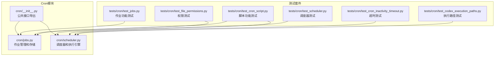
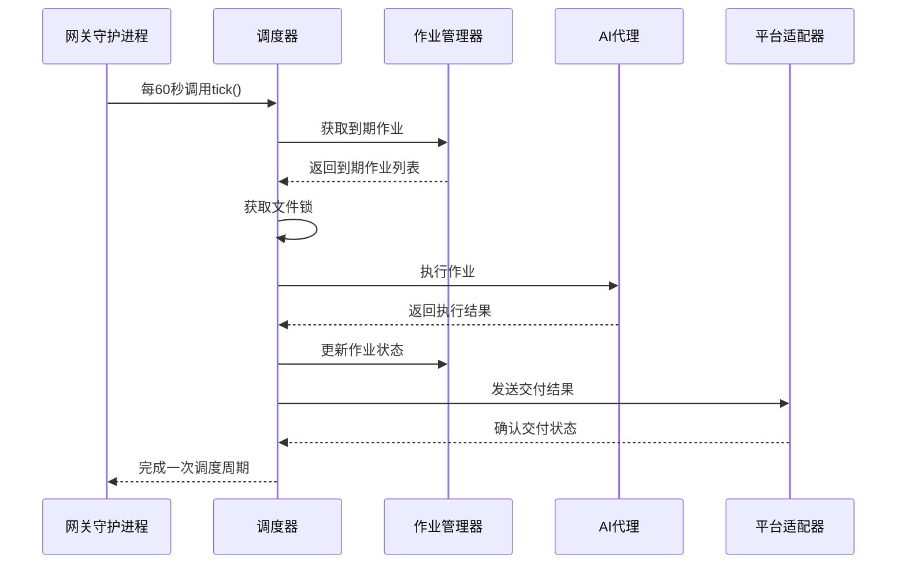
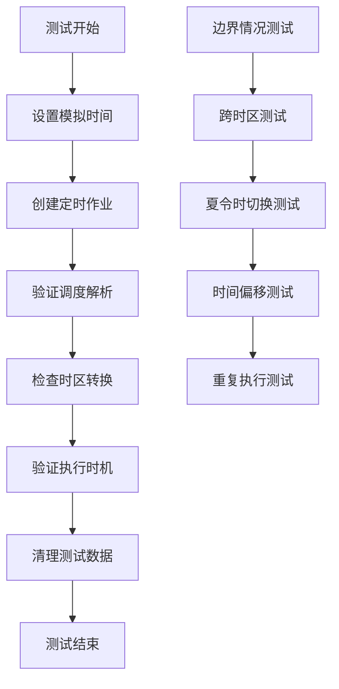
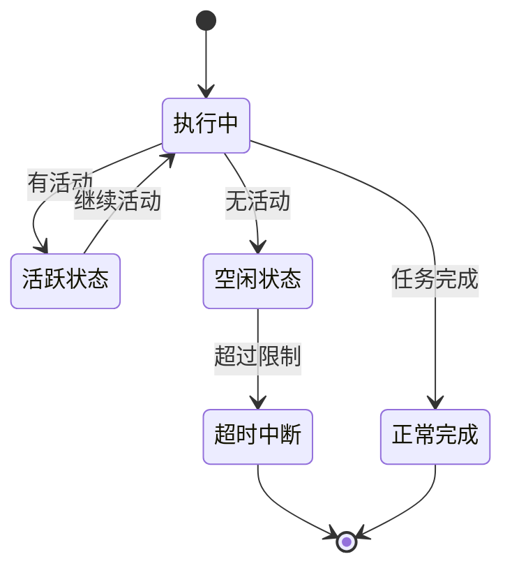
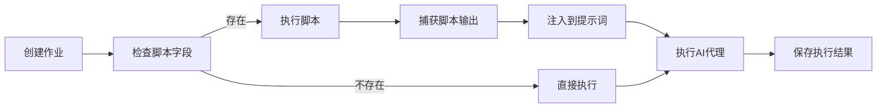
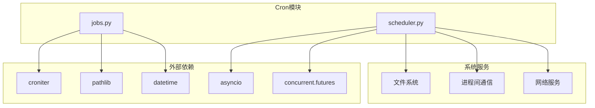

# Cron模块测试

<cite>
**本文档引用的文件**
- [cron/__init__.py](file://cron/__init__.py)
- [cron/jobs.py](file://cron/jobs.py)
- [cron/scheduler.py](file://cron/scheduler.py)
- [tests/cron/test_jobs.py](file://tests/cron/test_jobs.py)
- [tests/cron/test_scheduler.py](file://tests/cron/test_scheduler.py)
- [tests/cron/test_cron_script.py](file://tests/cron/test_cron_script.py)
- [tests/cron/test_cron_inactivity_timeout.py](file://tests/cron/test_cron_inactivity_timeout.py)
- [tests/cron/test_codex_execution_paths.py](file://tests/cron/test_codex_execution_paths.py)
- [tests/cron/test_file_permissions.py](file://tests/cron/test_file_permissions.py)
</cite>

## 目录
1. [简介](#简介)
2. [项目结构](#项目结构)
3. [核心组件](#核心组件)
4. [架构概览](#架构概览)
5. [详细组件分析](#详细组件分析)
6. [依赖关系分析](#依赖关系分析)
7. [性能考虑](#性能考虑)
8. [故障排除指南](#故障排除指南)
9. [结论](#结论)

## 简介

Cron模块是Hermes Agent中的定时任务系统，负责管理自动化任务的调度、执行和监控。该模块提供了完整的定时任务生命周期管理，包括任务创建、调度解析、执行监控、错误处理和输出管理等功能。

本测试指南专注于Cron模块的单元测试策略，涵盖任务调度、执行监控、错误处理、时间相关测试技巧、并发执行测试、资源清理测试和性能基准测试等方面。

## 项目结构

Cron模块采用分层架构设计，主要包含以下核心文件：

**图表来源**
- [cron/__init__.py:1-43](file://cron/__init__.py#L1-L43)
- [cron/jobs.py:1-763](file://cron/jobs.py#L1-L763)
- [cron/scheduler.py:1-991](file://cron/scheduler.py#L1-L991)

**章节来源**
- [cron/__init__.py:1-43](file://cron/__init__.py#L1-L43)
- [cron/jobs.py:1-763](file://cron/jobs.py#L1-L763)
- [cron/scheduler.py:1-991](file://cron/scheduler.py#L1-L991)

## 核心组件

### 作业管理系统 (Jobs)

作业管理系统负责定时任务的完整生命周期管理：

- **作业创建和存储**：支持多种调度类型（一次性、间隔、Cron表达式）
- **调度解析**：将用户输入转换为内部调度表示
- **状态管理**：跟踪作业的执行状态、错误信息和输出
- **持久化存储**：使用JSON文件存储作业配置和历史记录

### 调度器 (Scheduler)

调度器负责实际的任务执行和交付：

- **执行监控**：监控作业执行状态和超时
- **交付路由**：将结果发送到指定平台或本地
- **错误处理**：处理执行过程中的各种异常情况
- **资源管理**：管理会话数据库和临时文件

**章节来源**
- [cron/jobs.py:320-467](file://cron/jobs.py#L320-L467)
- [cron/scheduler.py:575-800](file://cron/scheduler.py#L575-L800)

## 架构概览

Cron模块采用事件驱动的架构模式，通过文件锁确保单实例运行：

**图表来源**
- [cron/scheduler.py:65-80](file://cron/scheduler.py#L65-L80)
- [cron/jobs.py:658-734](file://cron/jobs.py#L658-L734)

## 详细组件分析

### 作业调度测试策略

#### 时间敏感测试

作业调度系统对时间非常敏感，需要特别注意时区处理和时间偏移：

**图表来源**
- [tests/cron/test_jobs.py:126-147](file://tests/cron/test_jobs.py#L126-L147)
- [tests/cron/test_jobs.py:507-566](file://tests/cron/test_jobs.py#L507-L566)

#### 调度类型测试

针对不同调度类型的测试策略：

**一次性作业测试**：
- 验证一次性作业的创建和执行
- 测试宽限期机制（ONESHOT_GRACE_SECONDS）
- 验证作业完成后自动禁用

**间隔作业测试**：
- 验证固定间隔的执行
- 测试下次运行时间计算
- 验证崩溃安全机制

**Cron表达式测试**：
- 验证croniter库的集成
- 测试复杂表达式的解析
- 验证时区相关的表达式

**章节来源**
- [tests/cron/test_jobs.py:72-114](file://tests/cron/test_jobs.py#L72-L114)
- [tests/cron/test_jobs.py:120-176](file://tests/cron/test_jobs.py#L120-L176)
- [tests/cron/test_jobs.py:457-496](file://tests/cron/test_jobs.py#L457-L496)

### 执行监控测试

#### 超时机制测试

Cron模块实现了基于活动的超时机制，防止长时间挂起：

**图表来源**
- [tests/cron/test_cron_inactivity_timeout.py:85-275](file://tests/cron/test_cron_inactivity_timeout.py#L85-L275)

#### 错误处理测试

测试各种错误场景的处理：

- **网络超时**：模拟API调用超时
- **认证失败**：测试401错误的重试机制
- **资源不足**：内存不足等系统级错误
- **脚本执行失败**：外部脚本的错误处理

**章节来源**
- [tests/cron/test_cron_inactivity_timeout.py:118-177](file://tests/cron/test_cron_inactivity_timeout.py#L118-L177)
- [tests/cron/test_scheduler.py:545-627](file://tests/cron/test_scheduler.py#L545-L627)

### 脚本注入功能测试

Cron模块支持在执行前运行外部脚本，收集数据或执行预处理：

**图表来源**
- [tests/cron/test_cron_script.py:91-177](file://tests/cron/test_cron_script.py#L91-L177)

**章节来源**
- [tests/cron/test_cron_script.py:44-90](file://tests/cron/test_cron_script.py#L44-L90)
- [tests/cron/test_cron_script.py:303-410](file://tests/cron/test_cron_script.py#L303-L410)

### 并发执行测试

#### 文件锁机制测试

Cron模块使用文件锁防止多个实例同时执行：

- **锁获取测试**：验证文件锁的正确获取和释放
- **竞争条件测试**：模拟多个进程同时尝试获取锁
- **锁失效测试**：验证锁文件损坏时的恢复机制

#### 线程安全测试

- **作业状态并发访问**：多线程同时读写作业状态
- **文件I/O并发**：多个线程同时进行文件操作
- **内存数据结构并发**：共享数据结构的线程安全

**章节来源**
- [tests/cron/test_scheduler.py:13-46](file://tests/cron/test_scheduler.py#L13-L46)
- [tests/cron/test_file_permissions.py:24-76](file://tests/cron/test_file_permissions.py#L24-L76)

### 资源清理测试

#### 环境变量清理

Cron执行过程中会设置临时环境变量，需要确保在任何情况下都能正确清理：

- **正常完成清理**：成功执行后的清理
- **异常中断清理**：异常退出时的清理
- **超时清理**：超时中断时的清理

#### 临时文件清理

- **作业输出文件**：执行结果的临时文件管理
- **日志文件**：调试和审计日志的清理
- **缓存文件**：中间结果的清理

**章节来源**
- [tests/cron/test_cron_script.py:519-558](file://tests/cron/test_cron_script.py#L519-L558)
- [tests/cron/test_scheduler.py:629-767](file://tests/cron/test_scheduler.py#L629-L767)

## 依赖关系分析

Cron模块的依赖关系相对简单，主要依赖于外部库和系统服务：

**图表来源**
- [cron/jobs.py:24-28](file://cron/jobs.py#L24-L28)
- [cron/scheduler.py:11-29](file://cron/scheduler.py#L11-L29)

**章节来源**
- [cron/jobs.py:24-28](file://cron/jobs.py#L24-L28)
- [cron/scheduler.py:11-29](file://cron/scheduler.py#L11-L29)

## 性能考虑

### 内存使用优化

- **作业状态缓存**：避免频繁的文件I/O操作
- **批量操作**：减少文件系统调用次数
- **对象池**：复用临时对象减少GC压力

### I/O性能优化

- **异步I/O**：使用异步操作提高并发性能
- **文件锁定**：最小化锁持有时间
- **批处理写入**：合并多个小写入操作

### 网络性能优化

- **连接复用**：重用API连接减少建立开销
- **超时控制**：合理设置超时避免阻塞
- **重试策略**：智能重试避免过度请求

## 故障排除指南

### 常见问题诊断

#### 作业不执行

**可能原因**：
- 作业被禁用或暂停
- 下次运行时间在未来
- 系统时间不正确
- 权限问题

**诊断步骤**：
1. 检查作业状态：`get_job(job_id)`
2. 验证下次运行时间：`compute_next_run()`
3. 检查系统时间同步
4. 验证文件权限

#### 超时问题

**症状**：作业长时间无响应

**解决方案**：
- 检查HERMES_CRON_TIMEOUT环境变量
- 分析作业的活动状态
- 查看网络连接状况
- 监控系统资源使用

#### 权限问题

**症状**：无法创建文件或访问系统资源

**解决方案**：
- 检查HERMES_HOME目录权限
- 验证cron子目录权限（0700）
- 确认作业输出目录权限（0700/0600）

**章节来源**
- [tests/cron/test_file_permissions.py:12-76](file://tests/cron/test_file_permissions.py#L12-L76)
- [tests/cron/test_cron_inactivity_timeout.py:158-187](file://tests/cron/test_cron_inactivity_timeout.py#L158-L187)

### 调试技巧

#### 日志分析

- 启用详细日志级别
- 关注关键时间点的日志
- 分析错误堆栈信息
- 监控资源使用情况

#### 性能分析

- 使用性能分析工具
- 监控内存使用趋势
- 分析I/O等待时间
- 识别瓶颈环节

## 结论

Cron模块的测试策略应该重点关注以下几个方面：

1. **时间敏感性**：所有涉及时间的测试都需要使用时间模拟和时区处理
2. **并发安全性**：验证文件锁和并发访问的安全性
3. **错误恢复**：测试各种异常情况下的恢复能力
4. **资源管理**：确保资源正确清理和释放
5. **性能稳定性**：验证在高负载下的稳定性

通过实施这些测试策略，可以确保Cron模块在生产环境中稳定可靠地运行，为用户提供可靠的定时任务服务。