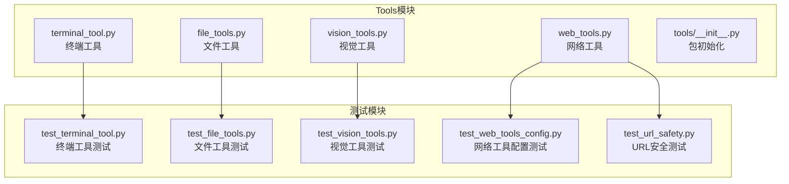
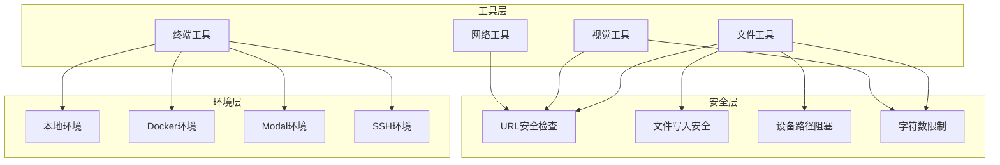
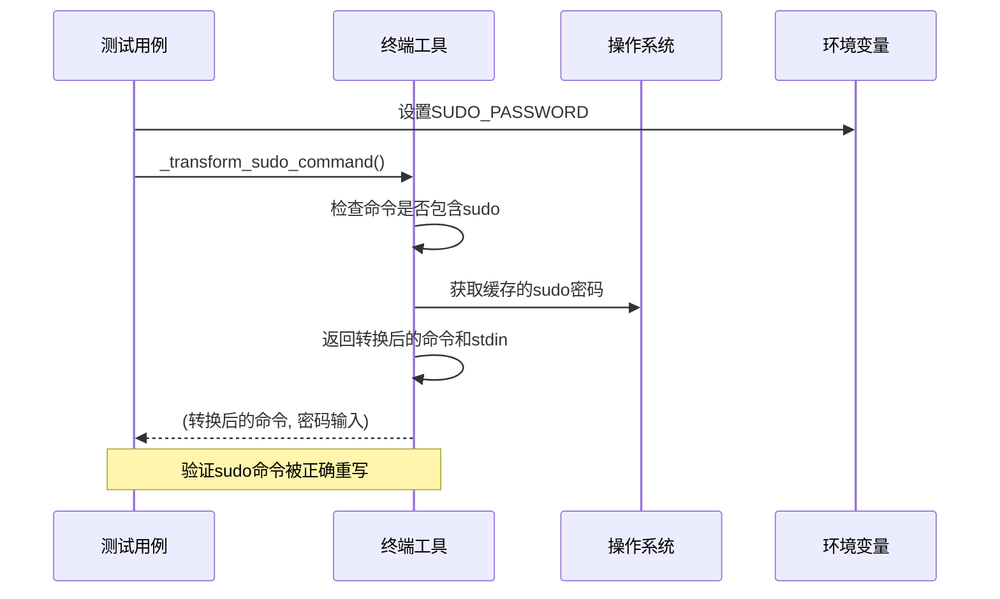
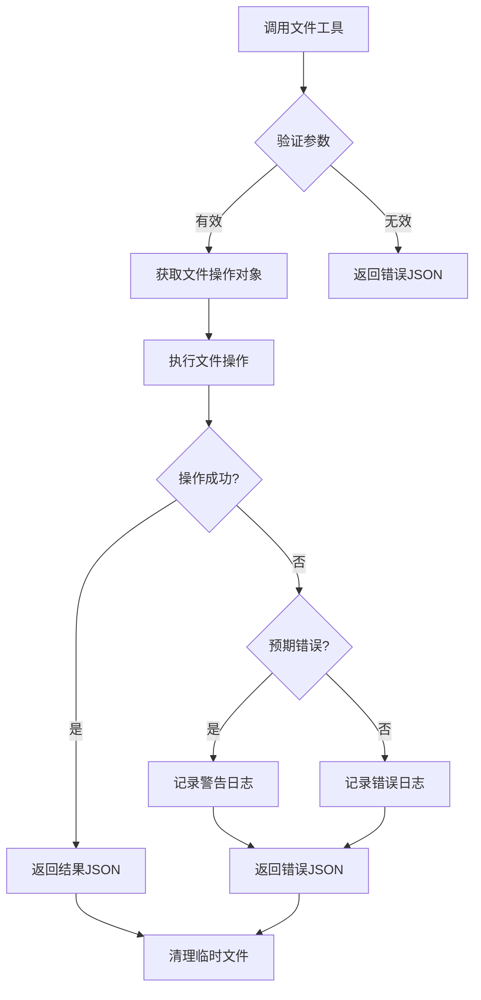
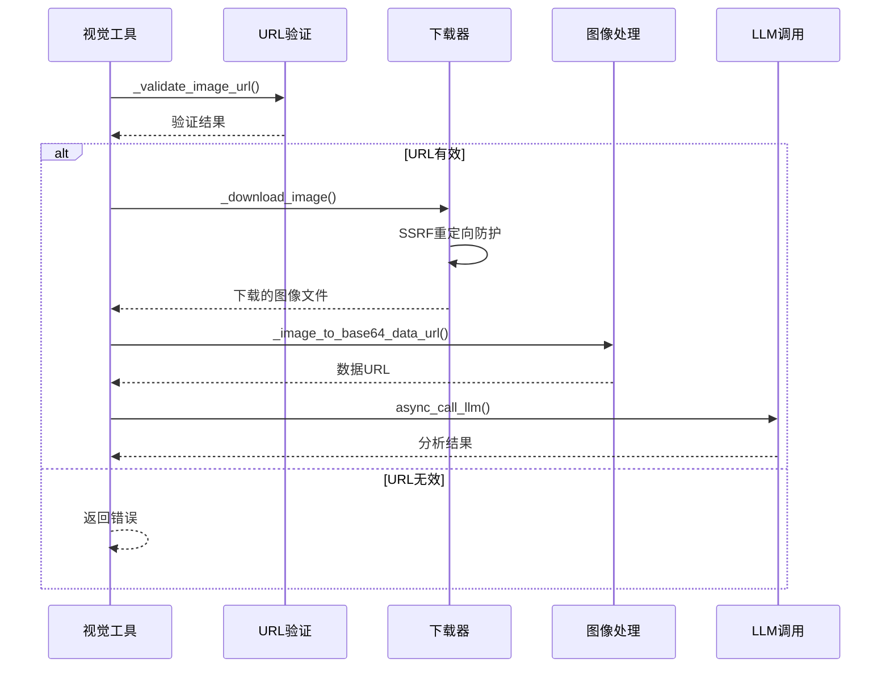
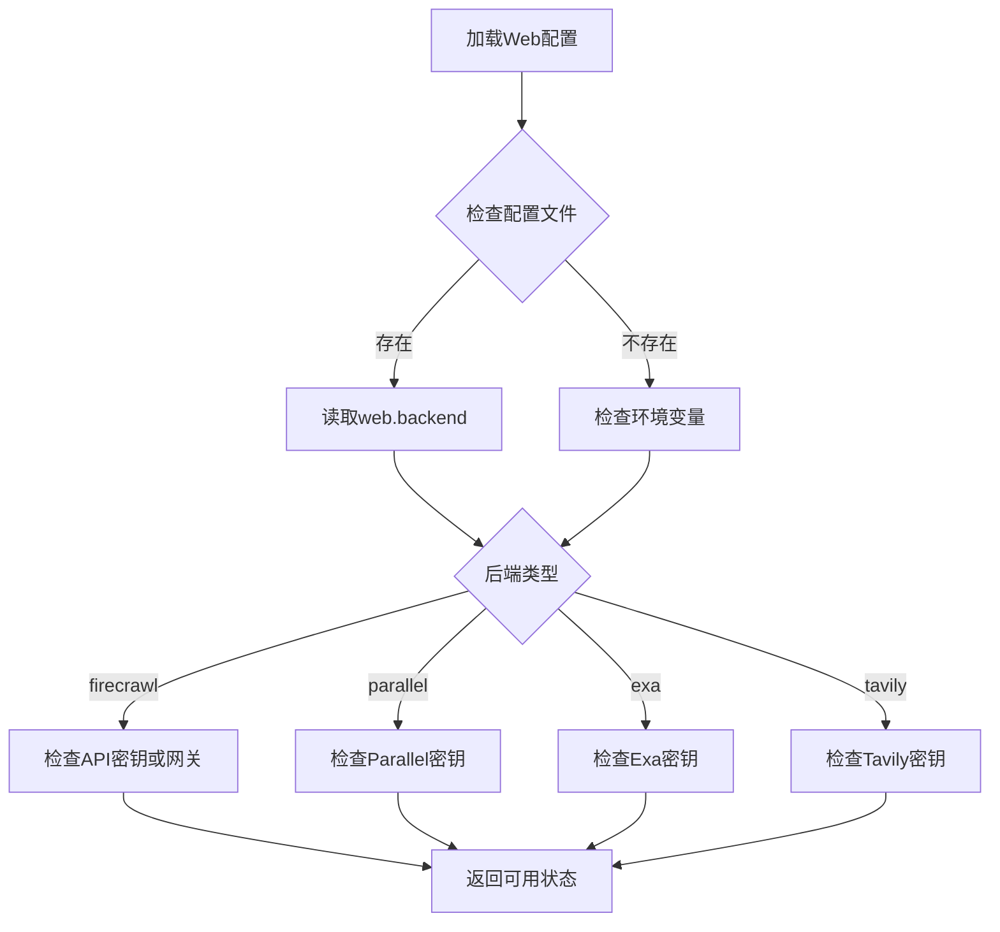
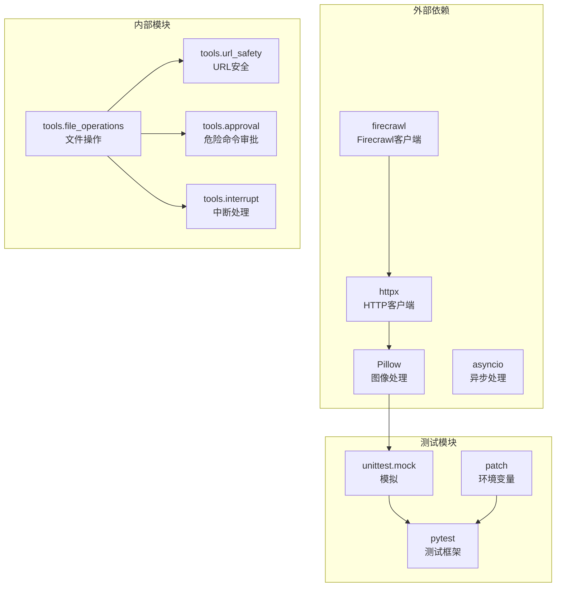

# Tools模块测试

<cite>
**本文档引用的文件**
- [tools/__init__.py](file://tools/__init__.py)
- [tools/terminal_tool.py](file://tools/terminal_tool.py)
- [tools/file_tools.py](file://tools/file_tools.py)
- [tools/vision_tools.py](file://tools/vision_tools.py)
- [tools/web_tools.py](file://tools/web_tools.py)
- [tests/tools/test_terminal_tool.py](file://tests/tools/test_terminal_tool.py)
- [tests/tools/test_file_tools.py](file://tests/tools/test_file_tools.py)
- [tests/tools/test_file_operations.py](file://tests/tools/test_file_operations.py)
- [tests/tools/test_file_write_safety.py](file://tests/tools/test_file_write_safety.py)
- [tests/tools/test_file_read_guards.py](file://tests/tools/test_file_read_guards.py)
- [tests/tools/test_url_safety.py](file://tests/tools/test_url_safety.py)
- [tests/tools/test_vision_tools.py](file://tests/tools/test_vision_tools.py)
- [tests/tools/test_web_tools_config.py](file://tests/tools/test_web_tools_config.py)
</cite>

## 目录
1. [简介](#简介)
2. [项目结构](#项目结构)
3. [核心组件](#核心组件)
4. [架构概览](#架构概览)
5. [详细组件分析](#详细组件分析)
6. [依赖关系分析](#依赖关系分析)
7. [性能考虑](#性能考虑)
8. [故障排除指南](#故障排除指南)
9. [结论](#结论)

## 简介

Tools模块是Hermes Agent的核心工具集，提供了多种类型的工具来执行终端命令、文件操作、网络请求和视觉分析等功能。本测试指南旨在为Tools模块创建全面的单元测试策略，涵盖各种工具类型的测试方法、安全测试、环境配置和边界条件测试。

## 项目结构

Tools模块采用模块化设计，每个工具类型都有独立的模块文件：

**图表来源**
- [tools/__init__.py:1-26](file://tools/__init__.py#L1-L26)
- [tools/terminal_tool.py:1-50](file://tools/terminal_tool.py#L1-L50)
- [tools/file_tools.py:1-50](file://tools/file_tools.py#L1-L50)
- [tools/vision_tools.py:1-50](file://tools/vision_tools.py#L1-L50)
- [tools/web_tools.py:1-50](file://tools/web_tools.py#L1-L50)

**章节来源**
- [tools/__init__.py:1-26](file://tools/__init__.py#L1-L26)

## 核心组件

### 终端工具 (Terminal Tool)
终端工具支持在本地、Docker、Modal、SSH、Singularity和Daytona环境中执行命令，具有背景任务支持和VM/容器生命周期管理功能。

### 文件工具 (File Tools)
文件工具提供LLM代理文件操作功能，包括读取、写入、补丁和搜索文件，具备字符数限制、设备路径阻塞和文件去重功能。

### 视觉工具 (Vision Tools)
视觉工具使用集中式辅助视觉路由器，支持图像URL分析、下载和描述生成，具备SSRF防护和大小限制。

### 网络工具 (Web Tools)
网络工具提供通用Web工具，支持多个后端提供商（Exa、Firecrawl、Parallel、Tavily），具备调试模式和错误处理。

**章节来源**
- [tools/terminal_tool.py:1-50](file://tools/terminal_tool.py#L1-L50)
- [tools/file_tools.py:1-50](file://tools/file_tools.py#L1-L50)
- [tools/vision_tools.py:1-50](file://tools/vision_tools.py#L1-L50)
- [tools/web_tools.py:1-50](file://tools/web_tools.py#L1-L50)

## 架构概览

**图表来源**
- [tools/terminal_tool.py:70-120](file://tools/terminal_tool.py#L70-L120)
- [tools/file_tools.py:60-120](file://tools/file_tools.py#L60-L120)
- [tools/vision_tools.py:70-120](file://tools/vision_tools.py#L70-L120)
- [tools/web_tools.py:60-120](file://tools/web_tools.py#L60-L120)

## 详细组件分析

### 终端工具测试策略

#### 测试重点
- Sudo密码检测和处理
- 危险命令审批系统
- 工作目录验证
- 背景任务支持

**图表来源**
- [tests/tools/test_terminal_tool.py:47-91](file://tests/tools/test_terminal_tool.py#L47-L91)
- [tools/terminal_tool.py:126-136](file://tools/terminal_tool.py#L126-L136)

**章节来源**
- [tests/tools/test_terminal_tool.py:1-91](file://tests/tools/test_terminal_tool.py#L1-L91)
- [tools/terminal_tool.py:140-200](file://tools/terminal_tool.py#L140-L200)

### 文件工具测试策略

#### 测试重点
- 工具Schema验证
- 错误路径处理
- 参数验证
- 结果返回格式

**图表来源**
- [tests/tools/test_file_tools.py:37-180](file://tests/tools/test_file_tools.py#L37-L180)
- [tools/file_tools.py:150-200](file://tools/file_tools.py#L150-L200)

**章节来源**
- [tests/tools/test_file_tools.py:1-315](file://tests/tools/test_file_tools.py#L1-L315)
- [tools/file_tools.py:1-200](file://tools/file_tools.py#L1-L200)

### 视觉工具测试策略

#### 测试重点
- URL验证和SSRF防护
- 图像类型检测
- 基础数据URL转换
- 大小限制和自动调整

**图表来源**
- [tests/tools/test_vision_tools.py:33-120](file://tests/tools/test_vision_tools.py#L33-L120)
- [tools/vision_tools.py:128-200](file://tools/vision_tools.py#L128-L200)

**章节来源**
- [tests/tools/test_vision_tools.py:1-800](file://tests/tools/test_vision_tools.py#L1-L800)
- [tools/vision_tools.py:1-200](file://tools/vision_tools.py#L1-L200)

### 网络工具测试策略

#### 测试重点
- 后端选择逻辑
- 客户端配置矩阵
- 单例缓存行为
- 错误处理和调试

**图表来源**
- [tests/tools/test_web_tools_config.py:292-441](file://tests/tools/test_web_tools_config.py#L292-L441)
- [tools/web_tools.py:75-120](file://tools/web_tools.py#L75-L120)

**章节来源**
- [tests/tools/test_web_tools_config.py:1-618](file://tests/tools/test_web_tools_config.py#L1-L618)
- [tools/web_tools.py:1-200](file://tools/web_tools.py#L1-L200)

## 依赖关系分析

**图表来源**
- [tools/vision_tools.py:35-45](file://tools/vision_tools.py#L35-L45)
- [tools/web_tools.py:43-65](file://tools/web_tools.py#L43-L65)
- [tools/file_tools.py:1-15](file://tools/file_tools.py#L1-L15)

**章节来源**
- [tools/vision_tools.py:1-50](file://tools/vision_tools.py#L1-L50)
- [tools/web_tools.py:1-50](file://tools/web_tools.py#L1-L50)
- [tools/file_tools.py:1-20](file://tools/file_tools.py#L1-L20)

## 性能考虑

### 测试环境配置

#### Mock策略
- 使用`unittest.mock.patch`模拟外部依赖
- 使用`pytest`的`monkeypatch`设置环境变量
- 使用`MagicMock`创建模拟对象

#### 边界条件测试
- 文件大小限制：100KB默认限制，可配置
- 设备路径阻塞：`/dev/zero`、`/dev/random`等
- URL安全检查：私有IP地址、元数据服务地址
- 进程超时：前台命令最大超时600秒

#### 安全测试重要性
- SSRF防护：阻止对私有网络的访问
- 文件写入安全：防止修改系统敏感文件
- URL验证：确保只访问公共可访问的资源
- 进程控制：防止恶意命令执行

## 故障排除指南

### 常见问题和解决方案

#### 终端工具问题
- **Sudo密码问题**：检查`SUDO_PASSWORD`环境变量设置
- **危险命令拒绝**：查看审批回调函数配置
- **工作目录验证失败**：确认路径字符集允许

#### 文件工具问题
- **文件读取限制**：使用`offset`和`limit`参数进行分段读取
- **设备文件访问**：避免读取`/dev/`下的特殊文件
- **文件写入拒绝**：检查写入权限和目标路径

#### 视觉工具问题
- **图像下载失败**：检查网络连接和URL有效性
- **SSRF防护触发**：验证URL不指向私有网络
- **图像大小限制**：使用较小尺寸或本地文件

#### 网络工具问题
- **后端配置错误**：检查API密钥和环境变量设置
- **客户端初始化失败**：查看错误消息中的配置指导
- **单例缓存问题**：重新启动进程或清除缓存

**章节来源**
- [tests/tools/test_terminal_tool.py:1-91](file://tests/tools/test_terminal_tool.py#L1-L91)
- [tests/tools/test_file_read_guards.py:1-379](file://tests/tools/test_file_read_guards.py#L1-L379)
- [tests/tools/test_url_safety.py:1-177](file://tests/tools/test_url_safety.py#L1-L177)

## 结论

Tools模块的测试策略应该重点关注以下几个方面：

1. **安全性优先**：所有测试都应该包含安全场景，特别是SSRF防护、文件写入安全和URL验证
2. **边界条件覆盖**：充分测试各种边界情况，如文件大小限制、设备路径阻塞、进程超时等
3. **异步处理测试**：视觉工具和网络工具都是异步实现，需要专门的异步测试策略
4. **环境隔离**：使用Mock和环境变量隔离确保测试的可重复性
5. **错误处理验证**：验证各种错误情况下的适当响应和日志记录

通过实施这些测试策略，可以确保Tools模块在各种环境下都能安全、可靠地运行，并为用户提供一致的工具体验。