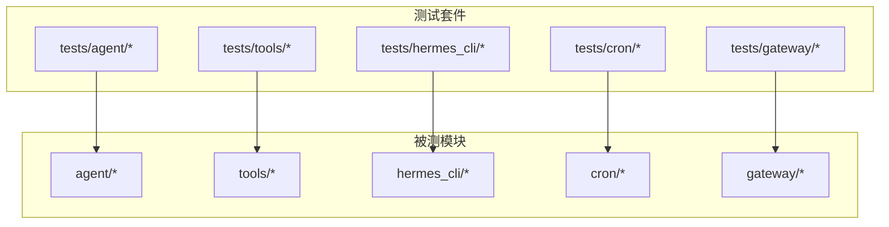
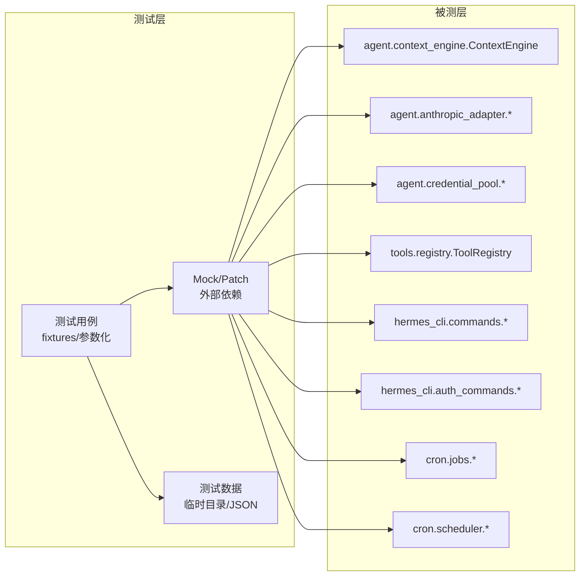
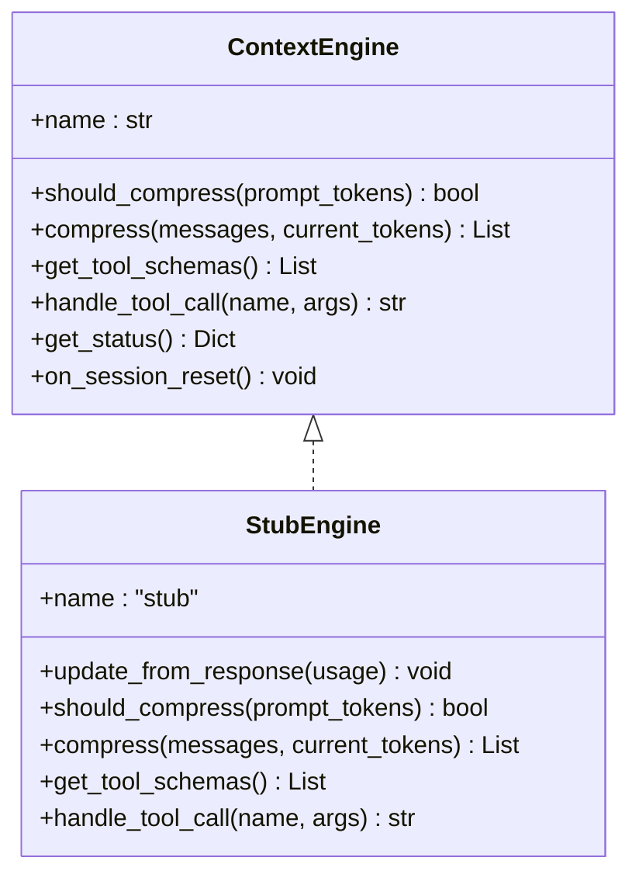
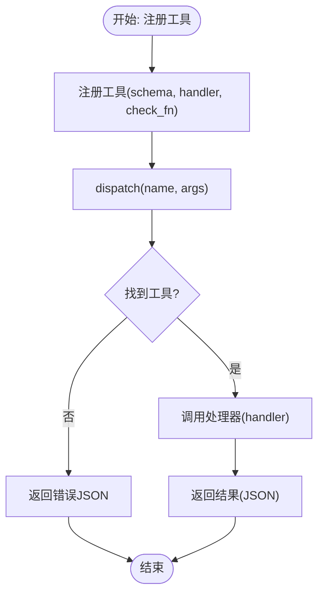
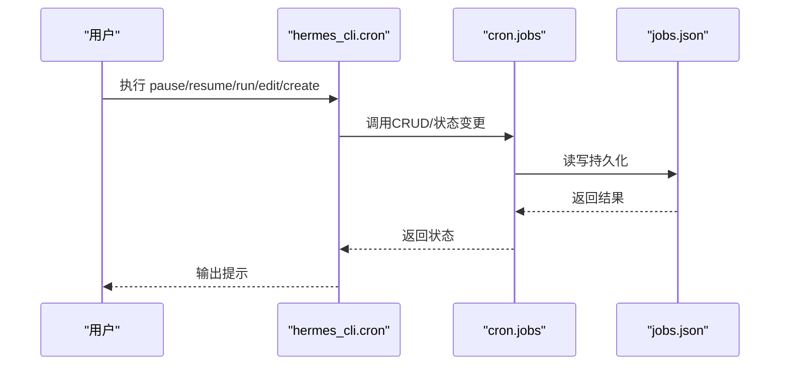
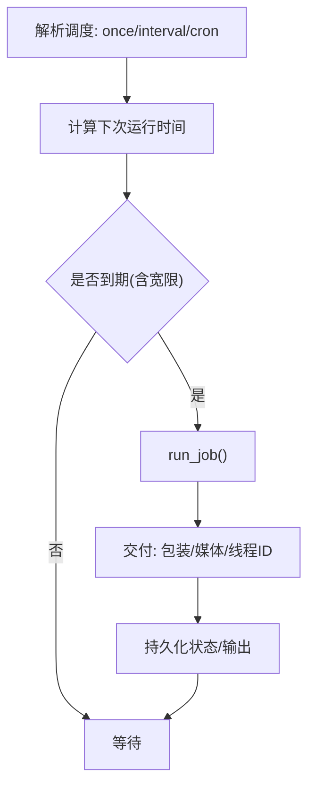
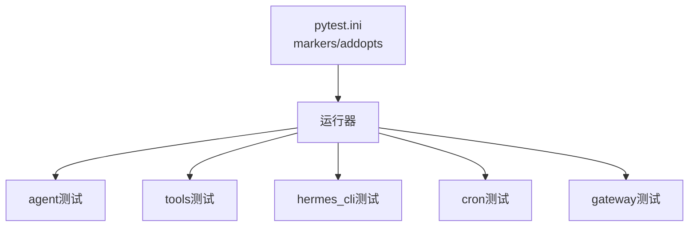

# 单元测试

<cite>
**本文引用的文件**
- [README.md](file://README.md)
- [pyproject.toml](file://pyproject.toml)
- [tests/conftest.py](file://tests/conftest.py)
- [tests/agent/test_context_engine.py](file://tests/agent/test_context_engine.py)
- [tests/agent/test_anthropic_adapter.py](file://tests/agent/test_anthropic_adapter.py)
- [tests/agent/test_credential_pool.py](file://tests/agent/test_credential_pool.py)
- [tests/hermes_cli/test_commands.py](file://tests/hermes_cli/test_commands.py)
- [tests/hermes_cli/test_auth_commands.py](file://tests/hermes_cli/test_auth_commands.py)
- [tests/hermes_cli/test_cron.py](file://tests/hermes_cli/test_cron.py)
- [tests/cron/test_jobs.py](file://tests/cron/test_jobs.py)
- [tests/cron/test_scheduler.py](file://tests/cron/test_scheduler.py)
- [tests/tools/test_registry.py](file://tests/tools/test_registry.py)
</cite>

## 目录
1. [简介](#简介)
2. [项目结构](#项目结构)
3. [核心组件](#核心组件)
4. [架构总览](#架构总览)
5. [详细组件分析](#详细组件分析)
6. [依赖关系分析](#依赖关系分析)
7. [性能考量](#性能考量)
8. [故障排查指南](#故障排查指南)
9. [结论](#结论)
10. [附录](#附录)

## 简介
本指南面向Hermes Agent项目的单元测试实践，系统阐述设计原则、测试用例编写规范、各模块测试策略（agent、tools、hermes_cli、cron），以及Mock与测试数据准备技巧，并给出测试覆盖率与代码质量标准建议。文档同时提供可操作的示例路径与可视化图示，帮助开发者快速落地高质量的单元测试。

## 项目结构
Hermes Agent采用分层模块化组织：agent负责推理与上下文管理；tools提供工具注册与执行；hermes_cli提供命令行入口与交互；cron提供计划任务调度与交付；gateway提供多平台消息网关能力。测试覆盖上述模块的关键子系统，确保核心流程稳定可靠。

图表来源
- [pyproject.toml:123-129](file://pyproject.toml#L123-L129)

章节来源
- [README.md:1-179](file://README.md#L1-L179)
- [pyproject.toml:123-129](file://pyproject.toml#L123-L129)

## 核心组件
- 测试夹具与环境隔离：通过全局夹具隔离HERMES_HOME、清理环境变量、统一事件循环与超时控制，避免跨用例污染与悬挂。
- 测试标记与并行：通过pytest标记过滤集成测试，支持自动并行运行，提升整体测试效率。
- 模块化测试策略：按模块划分测试文件，每个模块聚焦自身职责边界，保证高内聚低耦合。

章节来源
- [tests/conftest.py:19-122](file://tests/conftest.py#L19-L122)
- [pyproject.toml:123-129](file://pyproject.toml#L123-L129)

## 架构总览
下图展示了测试与被测模块之间的关系，以及关键的Mock点位与数据准备方式。

图表来源
- [tests/agent/test_context_engine.py:15-86](file://tests/agent/test_context_engine.py#L15-L86)
- [tests/agent/test_anthropic_adapter.py:11-26](file://tests/agent/test_anthropic_adapter.py#L11-L26)
- [tests/agent/test_credential_pool.py:11-15](file://tests/agent/test_credential_pool.py#L11-L15)
- [tests/tools/test_registry.py:5](file://tests/tools/test_registry.py#L5)
- [tests/hermes_cli/test_commands.py:6-26](file://tests/hermes_cli/test_commands.py#L6-L26)
- [tests/hermes_cli/test_auth_commands.py:12-24](file://tests/hermes_cli/test_auth_commands.py#L12-L24)
- [tests/cron/test_jobs.py:9-26](file://tests/cron/test_jobs.py#L9-L26)
- [tests/cron/test_scheduler.py:10](file://tests/cron/test_scheduler.py#L10)

## 详细组件分析

### agent 模块测试策略
- 上下文引擎契约与默认行为：通过“桩实现”验证抽象基类契约、默认方法行为、状态重置与插件槽注册。
- Anthropic适配器：覆盖认证令牌识别、客户端构建、模型名归一化、消息/工具格式转换、缓存控制与错误处理。
- 凭证池：覆盖轮转策略、过期冷却、环境与文件单例注入、刷新与持久化、并发安全等。

图表来源
- [tests/agent/test_context_engine.py:15-86](file://tests/agent/test_context_engine.py#L15-L86)

章节来源
- [tests/agent/test_context_engine.py:61-191](file://tests/agent/test_context_engine.py#L61-L191)
- [tests/agent/test_anthropic_adapter.py:34-454](file://tests/agent/test_anthropic_adapter.py#L34-L454)
- [tests/agent/test_credential_pool.py:17-800](file://tests/agent/test_credential_pool.py#L17-L800)

### tools 模块测试策略
- 工具注册与分发：验证注册、分发、参数透传、未知工具返回错误。
- 可用性检查：共享check_fn复用、异常捕获、工具集可用性判断。
- 元数据与安全：表情符号元数据读取、敏感信息结果脱敏。

图表来源
- [tests/tools/test_registry.py:20-182](file://tests/tools/test_registry.py#L20-L182)

章节来源
- [tests/tools/test_registry.py:20-312](file://tests/tools/test_registry.py#L20-L312)

### hermes_cli 模块测试策略
- 命令注册与补全：验证命令注册表完整性、别名解析、分类与描述、平台兼容性（Telegram/Slack）。
- 认证命令：覆盖凭据添加、OAuth登录、移除与重置、环境变量同步与抑制重种子。
- Cron命令：验证生命周期（暂停/恢复/触发）、编辑（替换/清空技能）、创建多技能任务。

图表来源
- [tests/hermes_cli/test_cron.py:19-108](file://tests/hermes_cli/test_cron.py#L19-L108)
- [tests/cron/test_jobs.py:191-351](file://tests/cron/test_jobs.py#L191-L351)

章节来源
- [tests/hermes_cli/test_commands.py:42-822](file://tests/hermes_cli/test_commands.py#L42-L822)
- [tests/hermes_cli/test_auth_commands.py:38-698](file://tests/hermes_cli/test_auth_commands.py#L38-L698)
- [tests/hermes_cli/test_cron.py:19-108](file://tests/hermes_cli/test_cron.py#L19-L108)

### cron 模块测试策略
- 作业解析与调度：覆盖一次性/间隔/Cron表达式解析、下次运行时间计算、动态宽限期与过期跳过。
- 作业CRUD与状态：创建、更新、暂停/恢复、完成计数与重复限制、错误跟踪与交付错误分离。
- 调度器：目标解析（origin/显式/通道目录）、包装与媒体附件路由、错误返回与日志记录、会话持久化。

图表来源
- [tests/cron/test_jobs.py:120-567](file://tests/cron/test_jobs.py#L120-L567)
- [tests/cron/test_scheduler.py:13-800](file://tests/cron/test_scheduler.py#L13-L800)

章节来源
- [tests/cron/test_jobs.py:1-575](file://tests/cron/test_jobs.py#L1-L575)
- [tests/cron/test_scheduler.py:1-800](file://tests/cron/test_scheduler.py#L1-L800)

## 依赖关系分析
- 外部依赖Mock：通过unittest.mock.patch替换第三方HTTP/SDK调用、文件系统路径、进程与网络接口，确保测试确定性。
- 环境隔离：通过conftest中的环境变量与HERMES_HOME隔离，避免真实配置对测试的影响。
- 并行与标记：pytest.ini中定义了集成测试标记与并行选项，便于在CI中高效运行。

图表来源
- [pyproject.toml:123-129](file://pyproject.toml#L123-L129)

章节来源
- [pyproject.toml:123-129](file://pyproject.toml#L123-L129)
- [tests/conftest.py:19-122](file://tests/conftest.py#L19-L122)

## 性能考量
- 超时保护：单测默认30秒超时，防止阻塞与悬挂导致的CI卡死。
- 并行执行：启用-xdist自动并行，缩短整体测试时间。
- Mock优先：对外部依赖进行Mock，避免网络/磁盘IO成为瓶颈。
- 事件循环：为同步测试提供默认事件循环，减少异步测试的setup复杂度。

章节来源
- [tests/conftest.py:74-122](file://tests/conftest.py#L74-L122)
- [pyproject.toml:123-129](file://pyproject.toml#L123-L129)

## 故障排查指南
- 配置与环境问题
  - 使用conftest中的HERMES_HOME隔离，确保测试不写入用户主目录。
  - 清理外部API密钥环境变量，避免真实请求。
- 超时与悬挂
  - 若出现超时，检查是否有未关闭的事件循环或阻塞I/O。
- 并发与竞态
  - 对于并发场景，确认Mock与共享状态正确隔离，避免竞态条件。
- 日志与断言
  - 利用pytest的caplog与capsys辅助定位失败原因。

章节来源
- [tests/conftest.py:19-122](file://tests/conftest.py#L19-L122)

## 结论
通过模块化测试策略、严格的环境隔离与Mock实践，Hermes Agent的单元测试能够稳定覆盖核心功能，保障对话管理、工具调用、CLI命令处理与计划任务等关键路径的质量。建议持续完善覆盖率与回归测试，结合CI并行加速，形成可持续的测试体系。

## 附录

### 单元测试设计原则与规范
- 原则
  - 单一职责：每个测试聚焦一个行为或边界。
  - 可重复性：依赖Mock与临时目录，避免外部状态影响。
  - 明确断言：关注输入输出与副作用，而非实现细节。
- 规范
  - 使用pytest参数化与fixture复用公共设置。
  - 对外部依赖进行最小化Mock，保持被测逻辑清晰。
  - 为异步代码提供合适的事件循环与协程Mock。

### 各模块测试重点
- agent
  - 上下文引擎：契约验证、默认行为、状态重置、插件槽。
  - Anthropic适配器：令牌识别/刷新、客户端构建、消息/工具转换、缓存控制。
  - 凭证池：轮转策略、过期冷却、环境/文件单例注入、并发安全。
- tools
  - 工具注册与分发、可用性检查、元数据与安全。
- hermes_cli
  - 命令注册与补全、认证命令（添加/移除/重置/OAuth）、cron命令生命周期与编辑。
- cron
  - 作业解析与调度、CRUD与状态、调度器目标解析与交付包装。

### 测试示例路径
- 上下文引擎契约与默认行为
  - [tests/agent/test_context_engine.py:61-191](file://tests/agent/test_context_engine.py#L61-L191)
- Anthropic适配器认证与转换
  - [tests/agent/test_anthropic_adapter.py:34-454](file://tests/agent/test_anthropic_adapter.py#L34-L454)
- 凭证池轮转与过期冷却
  - [tests/agent/test_credential_pool.py:17-251](file://tests/agent/test_credential_pool.py#L17-L251)
- 工具注册与分发
  - [tests/tools/test_registry.py:20-182](file://tests/tools/test_registry.py#L20-L182)
- CLI命令注册与补全
  - [tests/hermes_cli/test_commands.py:42-822](file://tests/hermes_cli/test_commands.py#L42-L822)
- CLI认证命令
  - [tests/hermes_cli/test_auth_commands.py:38-698](file://tests/hermes_cli/test_auth_commands.py#L38-L698)
- CLI cron命令
  - [tests/hermes_cli/test_cron.py:19-108](file://tests/hermes_cli/test_cron.py#L19-L108)
- 作业解析与调度
  - [tests/cron/test_jobs.py:120-567](file://tests/cron/test_jobs.py#L120-L567)
- 调度器交付与包装
  - [tests/cron/test_scheduler.py:13-800](file://tests/cron/test_scheduler.py#L13-L800)

### Mock对象与测试数据准备
- Mock常用模式
  - 替换SDK/HTTP调用：使用patch装饰器或上下文管理器。
  - 文件系统：通过临时目录与属性替换（如CRON_DIR/JOB_FILE）。
  - 环境变量：使用monkeypatch.setenv/delenv隔离真实环境。
- 测试数据
  - 使用临时JSON文件模拟持久化存储（如auth.json、jobs.json）。
  - 使用字典/命名元组构造消息与作业结构，确保字段完整且合法。

章节来源
- [tests/conftest.py:19-122](file://tests/conftest.py#L19-L122)
- [tests/cron/test_jobs.py:182-188](file://tests/cron/test_jobs.py#L182-L188)
- [tests/hermes_cli/test_auth_commands.py:12-24](file://tests/hermes_cli/test_auth_commands.py#L12-L24)

### 测试覆盖率与代码质量标准
- 覆盖率建议
  - 关键路径（对话管理、工具调用、认证与凭证池、调度与交付）达到高覆盖率。
  - 对外依赖全部Mock，避免真实网络/文件系统访问。
- 代码质量
  - 断言明确、可读性强；避免“黑盒”断言；优先断言行为而非实现。
  - 使用pytest标记区分集成测试，确保CI中可选择性运行。

章节来源
- [pyproject.toml:123-129](file://pyproject.toml#L123-L129)