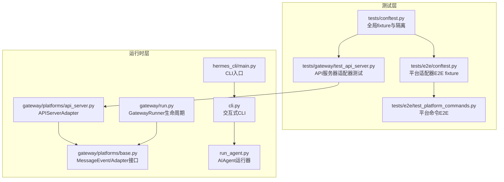
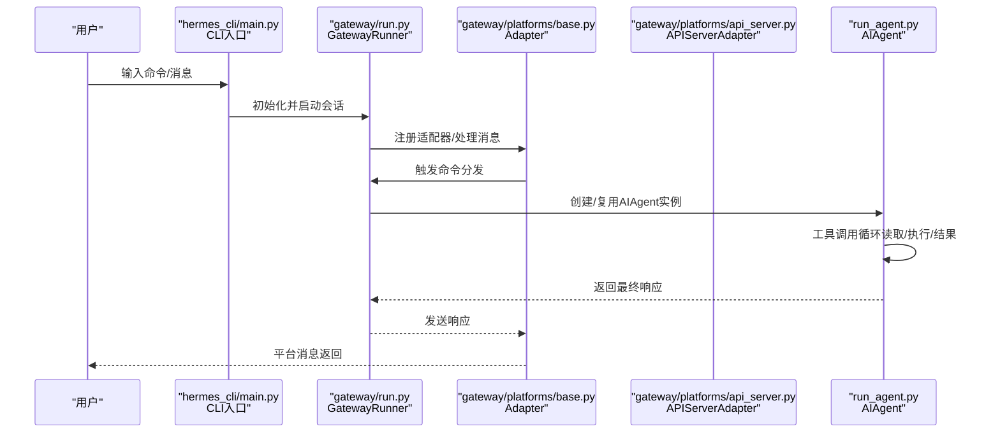
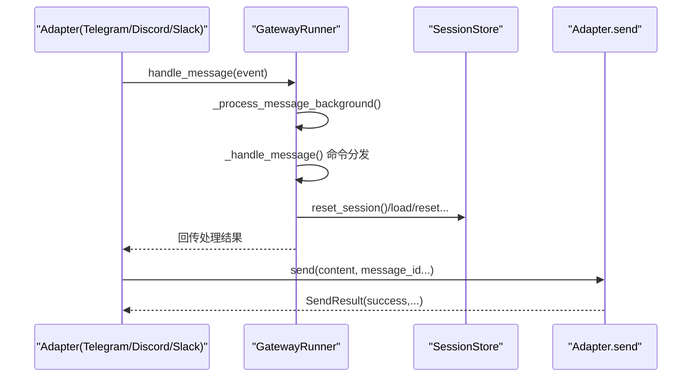
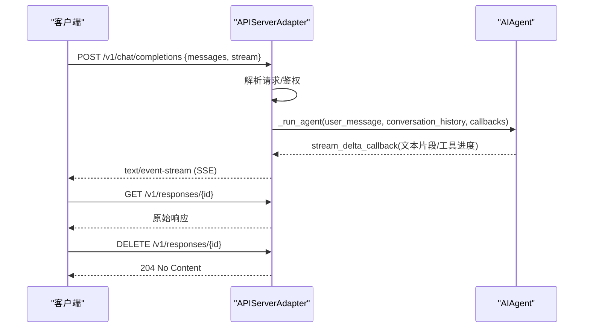
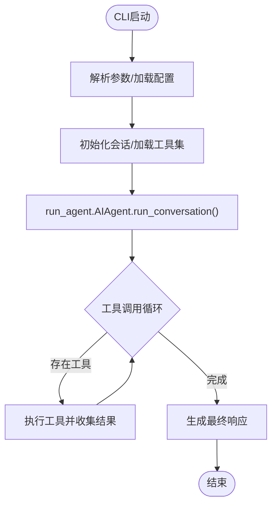
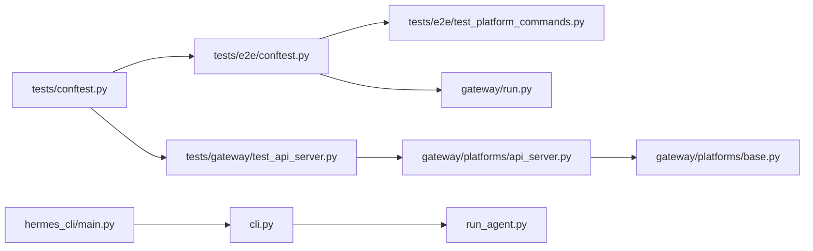

# 集成测试

<cite>
**本文引用的文件**
- [tests/conftest.py](file://tests/conftest.py)
- [tests/e2e/conftest.py](file://tests/e2e/conftest.py)
- [tests/e2e/test_platform_commands.py](file://tests/e2e/test_platform_commands.py)
- [tests/gateway/test_api_server.py](file://tests/gateway/test_api_server.py)
- [gateway/run.py](file://gateway/run.py)
- [gateway/platforms/base.py](file://gateway/platforms/base.py)
- [gateway/platforms/api_server.py](file://gateway/platforms/api_server.py)
- [hermes_cli/main.py](file://hermes_cli/main.py)
- [cli.py](file://cli.py)
- [run_agent.py](file://run_agent.py)
- [environments/benchmarks/terminalbench_2/terminalbench2_env.py](file://environments/benchmarks/terminalbench_2/terminalbench2_env.py)
- [environments/benchmarks/yc_bench/yc_bench_env.py](file://environments/benchmarks/yc_bench/yc_bench_env.py)
- [tests/tools/test_file_sync_perf.py](file://tests/tools/test_file_sync_perf.py)
</cite>

## 目录
1. [简介](#简介)
2. [项目结构](#项目结构)
3. [核心组件](#核心组件)
4. [架构总览](#架构总览)
5. [详细组件分析](#详细组件分析)
6. [依赖分析](#依赖分析)
7. [性能考虑](#性能考虑)
8. [故障排查指南](#故障排查指南)
9. [结论](#结论)
10. [附录](#附录)

## 简介
本指南面向Hermes Agent的集成测试设计与实施，覆盖端到端测试（E2E）的设计原则、平台交互测试、数据流测试与用户场景测试。文档提供可直接落地的测试策略与示例路径，涵盖：
- 测试环境搭建：依赖服务Mock与真实环境配置
- 用户工作流测试：从CLI输入到工具执行再到响应输出的完整链路
- 性能测试、压力测试与兼容性测试的实施方法

## 项目结构
Hermes Agent的测试体系以pytest为核心，按功能域划分：
- tests/conftest.py：全局共享fixture，隔离HERMES_HOME、事件循环、超时控制等
- tests/e2e：平台适配器端到端测试（Telegram/Discord/Slack）
- tests/gateway：网关适配器与API服务器测试
- tests/agent、tests/cli、tests/tools等：子系统单元/集成测试
- gateway/run.py：网关运行入口与生命周期管理
- hermes_cli/main.py、cli.py：CLI入口与交互式会话
- run_agent.py：智能体运行器与工具调用循环

图表来源
- [tests/conftest.py:1-122](file://tests/conftest.py#L1-L122)
- [tests/e2e/conftest.py:1-267](file://tests/e2e/conftest.py#L1-L267)
- [tests/e2e/test_platform_commands.py:1-191](file://tests/e2e/test_platform_commands.py#L1-L191)
- [tests/gateway/test_api_server.py:1-800](file://tests/gateway/test_api_server.py#L1-L800)
- [gateway/run.py:1-800](file://gateway/run.py#L1-L800)
- [gateway/platforms/base.py](file://gateway/platforms/base.py)
- [gateway/platforms/api_server.py](file://gateway/platforms/api_server.py)
- [hermes_cli/main.py:1-800](file://hermes_cli/main.py#L1-L800)
- [cli.py:1-800](file://cli.py#L1-L800)
- [run_agent.py:1-800](file://run_agent.py#L1-L800)

章节来源
- [tests/conftest.py:1-122](file://tests/conftest.py#L1-L122)
- [tests/e2e/conftest.py:1-267](file://tests/e2e/conftest.py#L1-L267)
- [tests/e2e/test_platform_commands.py:1-191](file://tests/e2e/test_platform_commands.py#L1-L191)
- [tests/gateway/test_api_server.py:1-800](file://tests/gateway/test_api_server.py#L1-L800)
- [gateway/run.py:1-800](file://gateway/run.py#L1-L800)
- [gateway/platforms/base.py](file://gateway/platforms/base.py)
- [gateway/platforms/api_server.py](file://gateway/platforms/api_server.py)
- [hermes_cli/main.py:1-800](file://hermes_cli/main.py#L1-L800)
- [cli.py:1-800](file://cli.py#L1-L800)
- [run_agent.py:1-800](file://run_agent.py#L1-L800)

## 核心组件
- 全局测试夹具（tests/conftest.py）
  - 隔离HERMES_HOME，避免写入用户目录
  - 提供临时目录、最小化配置、默认事件循环、统一超时
- 平台适配器E2E夹具（tests/e2e/conftest.py）
  - Mock Telegram/Discord/Slack模块，保证导入可用
  - 构造MessageEvent、SessionEntry、GatewayRunner与Adapter
  - 封装send_and_capture流程，便于断言
- 网关API服务器适配器（tests/gateway/test_api_server.py）
  - 覆盖健康检查、模型列表、聊天补全、响应流、鉴权、错误处理
  - 使用aiohttp TestClient进行HTTP级集成测试
- 运行时组件
  - GatewayRunner：消息路由、会话管理、平台适配器生命周期
  - APIServerAdapter：OpenAI兼容端点、SSE流、鉴权、响应存储
  - AIAgent：工具调用循环、上下文压缩、显示与回调
  - CLI：交互式REPL、工具集选择、单次查询模式

章节来源
- [tests/conftest.py:19-122](file://tests/conftest.py#L19-L122)
- [tests/e2e/conftest.py:26-267](file://tests/e2e/conftest.py#L26-L267)
- [tests/gateway/test_api_server.py:1-800](file://tests/gateway/test_api_server.py#L1-L800)
- [gateway/run.py:512-800](file://gateway/run.py#L512-L800)
- [gateway/platforms/api_server.py](file://gateway/platforms/api_server.py)
- [run_agent.py:492-800](file://run_agent.py#L492-L800)
- [cli.py:1-800](file://cli.py#L1-L800)
- [hermes_cli/main.py:1-800](file://hermes_cli/main.py#L1-L800)

## 架构总览
下图展示了从CLI或平台消息进入，经由网关适配器，最终到达AIAgent并执行工具调用的端到端路径。

图表来源
- [hermes_cli/main.py:676-784](file://hermes_cli/main.py#L676-L784)
- [gateway/run.py:512-800](file://gateway/run.py#L512-L800)
- [gateway/platforms/base.py](file://gateway/platforms/base.py)
- [gateway/platforms/api_server.py](file://gateway/platforms/api_server.py)
- [run_agent.py:492-800](file://run_agent.py#L492-L800)

## 详细组件分析

### 组件A：平台命令端到端测试（Telegram/Discord/Slack）
目标：验证平台命令在完整异步消息流中的行为，不涉及LLM调用。
- 关键流程
  - 构造MessageEvent
  - 通过Adapter.handle_message触发后台任务
  - GatewayRunner._handle_message进行命令分发
  - Adapter.send捕获响应并断言
- 断言要点
  - /help返回命令列表
  - /status显示会话信息
  - /new重置会话并调用session_store.reset_session
  - 未授权用户触发配对码而非命令响应
  - send失败不崩溃管道

图表来源
- [tests/e2e/test_platform_commands.py:22-191](file://tests/e2e/test_platform_commands.py#L22-L191)
- [tests/e2e/conftest.py:234-241](file://tests/e2e/conftest.py#L234-L241)
- [gateway/platforms/base.py](file://gateway/platforms/base.py)
- [gateway/run.py:512-800](file://gateway/run.py#L512-L800)

章节来源
- [tests/e2e/test_platform_commands.py:22-191](file://tests/e2e/test_platform_commands.py#L22-L191)
- [tests/e2e/conftest.py:124-267](file://tests/e2e/conftest.py#L124-L267)
- [gateway/platforms/base.py](file://gateway/platforms/base.py)
- [gateway/run.py:512-800](file://gateway/run.py#L512-L800)

### 组件B：API服务器适配器（OpenAI兼容端点）
目标：验证聊天补全、响应流、鉴权、健康检查、模型列表等HTTP级行为。
- 关键测试点
  - /health与/v1/health返回状态
  - /v1/models返回hermes-agent及自定义模型名
  - /v1/chat/completions支持SSE流，过滤工具进度标记，保持最终答案完整
  - /v1/responses支持GET/DELETE
  - 鉴权：无密钥放行；有密钥时校验Bearer头
- 数据流
  - 请求解析 → _run_agent回调（注入stream_delta_callback等）→ SSE响应 → 客户端消费

图表来源
- [tests/gateway/test_api_server.py:247-781](file://tests/gateway/test_api_server.py#L247-L781)
- [gateway/platforms/api_server.py](file://gateway/platforms/api_server.py)
- [run_agent.py:492-800](file://run_agent.py#L492-L800)

章节来源
- [tests/gateway/test_api_server.py:1-800](file://tests/gateway/test_api_server.py#L1-L800)
- [gateway/platforms/api_server.py](file://gateway/platforms/api_server.py)
- [run_agent.py:492-800](file://run_agent.py#L492-L800)

### 组件C：CLI到AIAgent工作流
目标：验证从CLI输入到工具执行再到输出的完整链路。
- 关键流程
  - hermes_cli/main.py解析参数与配置
  - cli.py构建交互式界面与会话
  - run_agent.py创建AIAgent并执行工具调用循环
- 断言建议
  - 单次查询模式返回预期内容
  - 工具调用回调被正确触发
  - 终端工具执行成功且返回码为0

图表来源
- [hermes_cli/main.py:676-784](file://hermes_cli/main.py#L676-L784)
- [cli.py:1-800](file://cli.py#L1-L800)
- [run_agent.py:492-800](file://run_agent.py#L492-L800)

章节来源
- [hermes_cli/main.py:676-784](file://hermes_cli/main.py#L676-L784)
- [cli.py:1-800](file://cli.py#L1-L800)
- [run_agent.py:492-800](file://run_agent.py#L492-L800)

## 依赖分析
- 测试耦合与内聚
  - tests/e2e依赖tests/e2e/conftest提供的Adapter工厂与Runner桩，确保平台无关的命令测试
  - tests/gateway依赖aiohttp TestClient与APIServerAdapter内部实现，关注HTTP契约
  - tests/conftest提供跨套件的环境隔离与事件循环保障
- 外部依赖与集成点
  - 平台库（telegram/discord/slack）通过Mock注入，避免真实网络依赖
  - 网关与API服务器通过适配器接口解耦，便于替换与测试

图表来源
- [tests/conftest.py:19-122](file://tests/conftest.py#L19-L122)
- [tests/e2e/conftest.py:124-267](file://tests/e2e/conftest.py#L124-L267)
- [tests/e2e/test_platform_commands.py:22-191](file://tests/e2e/test_platform_commands.py#L22-L191)
- [tests/gateway/test_api_server.py:1-800](file://tests/gateway/test_api_server.py#L1-800)
- [gateway/run.py:512-800](file://gateway/run.py#L512-L800)
- [gateway/platforms/api_server.py](file://gateway/platforms/api_server.py)
- [gateway/platforms/base.py](file://gateway/platforms/base.py)
- [hermes_cli/main.py:1-800](file://hermes_cli/main.py#L1-L800)
- [cli.py:1-800](file://cli.py#L1-L800)
- [run_agent.py:1-800](file://run_agent.py#L1-L800)

章节来源
- [tests/conftest.py:19-122](file://tests/conftest.py#L19-L122)
- [tests/e2e/conftest.py:124-267](file://tests/e2e/conftest.py#L124-L267)
- [tests/e2e/test_platform_commands.py:22-191](file://tests/e2e/test_platform_commands.py#L22-L191)
- [tests/gateway/test_api_server.py:1-800](file://tests/gateway/test_api_server.py#L1-L800)
- [gateway/run.py:512-800](file://gateway/run.py#L512-L800)
- [gateway/platforms/api_server.py](file://gateway/platforms/api_server.py)
- [gateway/platforms/base.py](file://gateway/platforms/base.py)
- [hermes_cli/main.py:1-800](file://hermes_cli/main.py#L1-L800)
- [cli.py:1-800](file://cli.py#L1-L800)
- [run_agent.py:1-800](file://run_agent.py#L1-L800)

## 性能考虑
- 基准与回归
  - 终端基准（Terminal-Bench 2.0）：评估任务通过率与耗时，作为整体性能基线
  - YC-Bench：生存率与复合评分，用于长期稳定性评估
  - 文件同步性能测试：统计命令执行时间的中位数/均值/P95，识别异常波动
- 压力与并发
  - API服务器SSE长连接与keepalive机制需在高并发下保持稳定
  - 工具调用并发安全：路径作用域工具避免冲突，只读工具可并行
- 可观测性
  - 记录会话ID、令牌用量、API调用次数，便于定位瓶颈
  - 日志级别与静默模式的平衡，避免噪声干扰性能指标

章节来源
- [environments/benchmarks/terminalbench_2/terminalbench2_env.py:903-934](file://environments/benchmarks/terminalbench_2/terminalbench2_env.py#L903-L934)
- [environments/benchmarks/yc_bench/yc_bench_env.py:361-772](file://environments/benchmarks/yc_bench/yc_bench_env.py#L361-L772)
- [tests/tools/test_file_sync_perf.py:43-78](file://tests/tools/test_file_sync_perf.py#L43-L78)
- [run_agent.py:214-337](file://run_agent.py#L214-L337)

## 故障排查指南
- 超时与挂起
  - 全局测试超时：30秒SIGALRM保护，避免长时间阻塞导致测试套件停滞
  - 事件循环：自动注入默认事件循环，兼容同步/异步混合测试
- 授权与鉴权
  - API服务器：无密钥放行；有密钥时严格校验Bearer头
  - 平台命令：未授权用户应触发配对流程而非命令响应
- 发送失败容错
  - Adapter.send返回失败不应导致管道崩溃，需内部处理并记录
- 环境隔离
  - HERMES_HOME指向临时目录，避免污染用户主目录
  - 删除平台相关环境变量，防止继承真实凭据

章节来源
- [tests/conftest.py:74-122](file://tests/conftest.py#L74-L122)
- [tests/e2e/test_platform_commands.py:176-191](file://tests/e2e/test_platform_commands.py#L176-L191)
- [tests/gateway/test_api_server.py:158-199](file://tests/gateway/test_api_server.py#L158-L199)

## 结论
通过平台无关的E2E夹具、HTTP级API服务器测试与CLI到AIAgent的完整链路验证，Hermes Agent的集成测试能够覆盖：
- 系统组件间的消息与命令分发
- 数据流（消息→适配器→网关→智能体→工具→响应）
- 用户场景（平台命令、API调用、CLI交互）
配合性能与压力测试，可形成从功能到质量的闭环保障。

## 附录
- 测试环境搭建建议
  - 使用tests/conftest.py提供的隔离与事件循环夹具
  - 平台库缺失时使用tests/e2e/conftest.py的Mock策略
  - API服务器测试使用aiohttp TestClient，确保端点契约一致
- 兼容性测试
  - 多平台命令一致性：Telegram/Discord/Slack
  - 多模型提供商与端点兼容：OpenAI兼容API、第三方Anthropic兼容端点
  - 终端后端兼容：本地/容器/SSH等不同终端配置