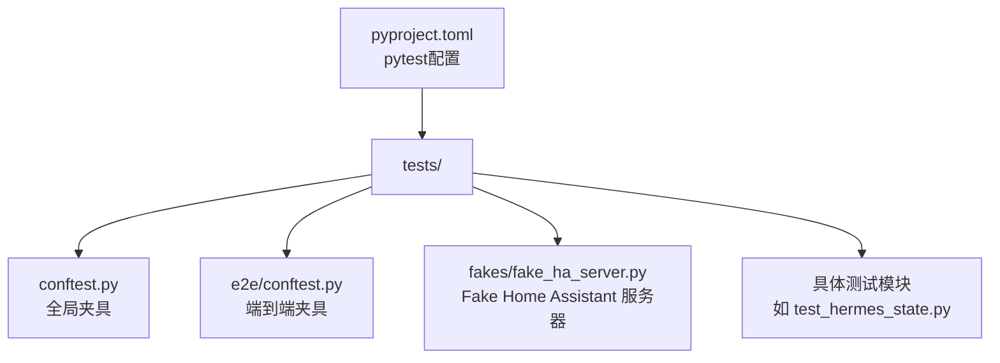
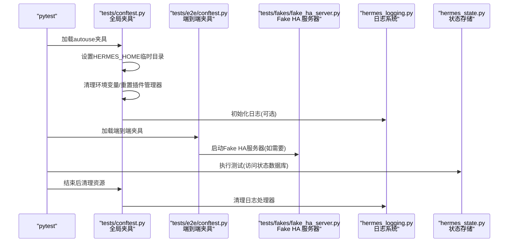
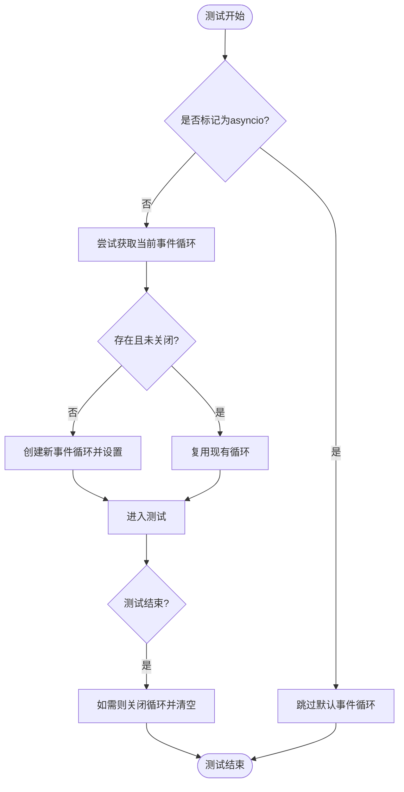
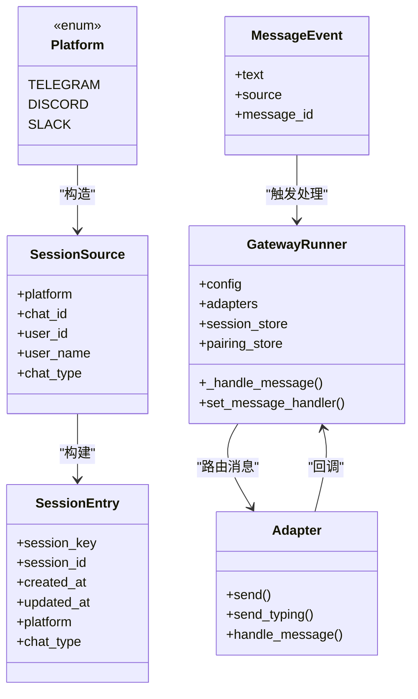
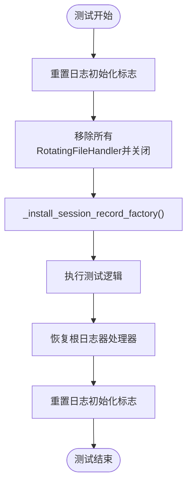
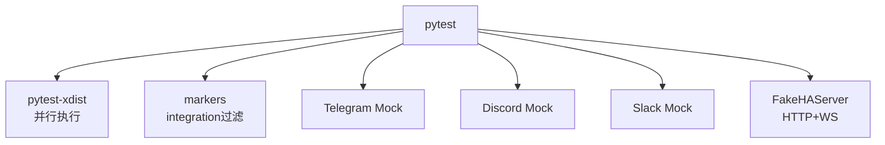

# 测试框架与环境配置

<cite>
**本文档引用的文件**
- [tests/conftest.py](file://tests/conftest.py)
- [tests/e2e/conftest.py](file://tests/e2e/conftest.py)
- [tests/fakes/fake_ha_server.py](file://tests/fakes/fake_ha_server.py)
- [tests/test_hermes_state.py](file://tests/test_hermes_state.py)
- [tests/test_hermes_logging.py](file://tests/test_hermes_logging.py)
- [tests/tools/test_terminal_tool.py](file://tests/tools/test_terminal_tool.py)
- [pyproject.toml](file://pyproject.toml)
- [hermes_logging.py](file://hermes_logging.py)
- [hermes_state.py](file://hermes_state.py)
</cite>

## 目录
1. [简介](#简介)
2. [项目结构](#项目结构)
3. [核心组件](#核心组件)
4. [架构总览](#架构总览)
5. [详细组件分析](#详细组件分析)
6. [依赖分析](#依赖分析)
7. [性能考虑](#性能考虑)
8. [故障排除指南](#故障排除指南)
9. [结论](#结论)
10. [附录](#附录)

## 简介
本文件面向Hermes Agent项目的测试框架与环境配置，系统性阐述以下主题：
- pytest测试框架的配置与使用，包括测试夹具(fixture)的设计与实现
- 测试环境隔离机制：HERMES_HOME临时目录、环境变量清理、插件管理器重置
- 全局超时机制与事件循环管理
- 测试配置最佳实践：测试数据准备、Mock对象使用、测试资源管理
- 测试运行器配置与并行测试支持

## 项目结构
Hermes Agent采用分层的测试组织方式：
- tests/：集中存放所有测试用例，按功能域划分子目录（agent、gateway、cli、integration等）
- tests/conftest.py：全局共享夹具与通用配置
- tests/e2e/conftest.py：端到端测试专用夹具，提供平台适配器与会话模拟
- tests/fakes/：集成测试辅助组件（如FakeHAServer）
- pyproject.toml：pytest运行参数与标记配置

**图表来源**
- [tests/conftest.py:1-122](file://tests/conftest.py#L1-L122)
- [tests/e2e/conftest.py:1-267](file://tests/e2e/conftest.py#L1-L267)
- [tests/fakes/fake_ha_server.py:1-302](file://tests/fakes/fake_ha_server.py#L1-L302)
- [pyproject.toml:123-129](file://pyproject.toml#L123-L129)

**章节来源**
- [tests/conftest.py:1-122](file://tests/conftest.py#L1-L122)
- [tests/e2e/conftest.py:1-267](file://tests/e2e/conftest.py#L1-L267)
- [pyproject.toml:123-129](file://pyproject.toml#L123-L129)

## 核心组件
本节聚焦测试框架的关键组件与配置要点。

- 全局HERMES_HOME隔离与环境变量清理
  - 使用临时目录作为HERMES_HOME，避免写入用户主目录
  - 清理平台会话相关环境变量，防止继承影响
  - 重置插件管理器单例，避免跨测试泄漏

- 事件循环与超时控制
  - 对同步测试提供默认事件循环，兼容旧有使用get_event_loop().run_until_complete()的测试
  - 在Unix环境下启用SIGALRM超时，统一30秒超时策略

- 并行测试支持
  - 通过pytest-xdist实现多进程并行执行
  - 配置自动检测CPU核数并行运行

- 日志与状态存储测试夹具
  - 自动清理RotatingFileHandler，避免xdist工作进程间状态泄漏
  - 提供隔离的HERMES_HOME用于日志输出验证

**章节来源**
- [tests/conftest.py:19-43](file://tests/conftest.py#L19-L43)
- [tests/conftest.py:74-121](file://tests/conftest.py#L74-L121)
- [tests/test_hermes_logging.py:16-47](file://tests/test_hermes_logging.py#L16-L47)
- [pyproject.toml:123-129](file://pyproject.toml#L123-L129)

## 架构总览
下图展示测试运行时的核心交互：pytest加载夹具、隔离环境、执行测试、清理资源。

**图表来源**
- [tests/conftest.py:19-43](file://tests/conftest.py#L19-L43)
- [tests/conftest.py:74-121](file://tests/conftest.py#L74-L121)
- [tests/e2e/conftest.py:124-267](file://tests/e2e/conftest.py#L124-L267)
- [tests/fakes/fake_ha_server.py:123-143](file://tests/fakes/fake_ha_server.py#L123-L143)
- [hermes_logging.py:161-200](file://hermes_logging.py#L161-L200)
- [hermes_state.py:138-161](file://hermes_state.py#L138-L161)

## 详细组件分析

### 组件A：全局测试夹具与环境隔离
- 功能概述
  - 自动化设置HERMES_HOME临时目录，确保测试不污染用户环境
  - 清理平台会话相关环境变量，避免测试间相互影响
  - 重置插件管理器单例，防止插件状态泄漏
  - 提供默认事件循环以兼容同步测试代码
  - 在Unix平台启用SIGALRM超时，统一测试超时行为

- 关键实现点
  - 临时目录创建与子目录初始化（sessions、cron、memories、skills）
  - 环境变量清理列表覆盖平台会话与外部服务密钥
  - 插件管理器重置通过monkeypatch替换模块属性
  - 事件循环夹具仅对非@asyncio标记的测试生效
  - 超时夹具在Windows跳过，其他平台安装SIGALRM处理器

**图表来源**
- [tests/conftest.py:77-107](file://tests/conftest.py#L77-L107)

**章节来源**
- [tests/conftest.py:19-43](file://tests/conftest.py#L19-L43)
- [tests/conftest.py:74-121](file://tests/conftest.py#L74-L121)

### 组件B：端到端测试夹具（平台适配器与会话模拟）
- 功能概述
  - 提供Telegram/Discord/Slack适配器的Mock模块，确保导入可用
  - 工厂函数生成会话源、会话条目、消息事件与GatewayRunner实例
  - 适配器发送方法Mock化，便于断言响应调用
  - 支持参数化平台测试，统一测试流程

- 关键实现点
  - 按需安装Mock模块，避免真实库缺失导致导入失败
  - 通过object.__new__绕过初始化副作用，直接注入必要属性
  - 会话存储Mock返回预设值，简化测试场景
  - 发送结果Mock返回成功标识与消息ID

**图表来源**
- [tests/e2e/conftest.py:124-267](file://tests/e2e/conftest.py#L124-L267)

**章节来源**
- [tests/e2e/conftest.py:26-121](file://tests/e2e/conftest.py#L26-L121)
- [tests/e2e/conftest.py:124-267](file://tests/e2e/conftest.py#L124-L267)

### 组件C：日志系统测试夹具与最佳实践
- 功能概述
  - 自动清理所有RotatingFileHandler，避免xdis自动复用worker进程导致的重复句柄
  - 重置日志模块内部状态，确保测试间无泄漏
  - 提供隔离的HERMES_HOME，验证日志文件创建与内容写入
  - 支持不同模式（cli/gateway）的日志文件分离

- 关键实现点
  - 在测试前清理根日志器上的所有RotatingFileHandler
  - 强制重新安装记录工厂，保证格式化字段可用
  - 通过fixture读取已隔离的HERMES_HOME路径
  - 支持从config.yaml读取日志级别与轮转参数

**图表来源**
- [tests/test_hermes_logging.py:16-47](file://tests/test_hermes_logging.py#L16-L47)

**章节来源**
- [tests/test_hermes_logging.py:16-47](file://tests/test_hermes_logging.py#L16-L47)
- [hermes_logging.py:161-200](file://hermes_logging.py#L161-L200)

### 组件D：状态存储测试与数据准备
- 功能概述
  - 使用临时数据库文件，每个测试独立创建与销毁
  - 覆盖会话生命周期、消息存储、全文搜索、导出与清理等核心功能
  - 验证工具调用计数、令牌统计、会话标题等扩展特性

- 关键实现点
  - 通过tmp_path生成唯一数据库路径，确保并发安全
  - SessionDB在构造时创建WAL模式连接，应用层重试机制缓解写锁争用
  - FTS5虚拟表自动维护，插入/删除/更新触发器同步索引

**章节来源**
- [tests/test_hermes_state.py:10-17](file://tests/test_hermes_state.py#L10-L17)
- [hermes_state.py:138-161](file://hermes_state.py#L138-L161)

### 组件E：集成测试辅助组件（Fake Home Assistant）
- 功能概述
  - 提供HTTP + WebSocket服务器，模拟Home Assistant API表面
  - 支持WebSocket认证握手、事件推送、REST端点（状态查询、服务调用、通知）
  - 可配置认证拒绝与服务器错误，便于边界条件测试

- 关键实现点
  - 使用aiohttp.web构建应用与TestServer，支持异步事件队列
  - WebSocket握手流程严格遵循HA协议步骤，支持订阅事件
  - REST端点优先级控制，确保特定服务路由优先于通用路由

**章节来源**
- [tests/fakes/fake_ha_server.py:77-143](file://tests/fakes/fake_ha_server.py#L77-L143)
- [tests/fakes/fake_ha_server.py:146-302](file://tests/fakes/fake_ha_server.py#L146-L302)

## 依赖分析
- 测试运行器与并行支持
  - pytest-xdist提供-n auto并行能力，基于CPU核数自动分配进程
  - 通过markers过滤集成测试（需要外部服务或API密钥）

- 第三方库与平台适配
  - Telegram/Discord/Slack适配器在测试中通过Mock模块替代，避免真实网络依赖
  - MCP与ACPI相关测试通过端到端夹具与工具链支持

**图表来源**
- [pyproject.toml:123-129](file://pyproject.toml#L123-L129)
- [tests/e2e/conftest.py:26-121](file://tests/e2e/conftest.py#L26-L121)
- [tests/fakes/fake_ha_server.py:123-143](file://tests/fakes/fake_ha_server.py#L123-L143)

**章节来源**
- [pyproject.toml:123-129](file://pyproject.toml#L123-L129)
- [tests/e2e/conftest.py:26-121](file://tests/e2e/conftest.py#L26-L121)

## 性能考虑
- 写锁争用与重试退避
  - SessionDB采用短超时（1秒）+随机抖动重试，避免SQLite内置忙等待导致的“车队效应”
  - 定期进行WAL检查点，平衡写入吞吐与延迟

- 日志轮转与权限管理
  - RotatingFileHandler按配置轮转，避免单文件过大
  - 管理模式下新建与轮转文件设置组可写权限，满足多用户协作场景

- 并行测试的资源竞争
  - 通过自动清理日志处理器与事件循环，降低跨测试进程干扰
  - 端到端测试中的Fake服务器按需启动，减少不必要的网络开销

**章节来源**
- [hermes_state.py:164-200](file://hermes_state.py#L164-L200)
- [tests/test_hermes_logging.py:649-701](file://tests/test_hermes_logging.py#L649-L701)

## 故障排除指南
- 测试超时
  - 症状：个别测试长时间挂起
  - 处理：确认Unix平台SIGALRM超时是否生效；检查是否存在阻塞I/O或未关闭的事件循环
  - 参考：[tests/conftest.py:110-121](file://tests/conftest.py#L110-L121)

- 日志句柄泄漏
  - 症状：并行测试中出现重复日志处理器或文件句柄异常
  - 处理：确保使用自动清理夹具；避免在测试中手动添加持久化处理器
  - 参考：[tests/test_hermes_logging.py:16-47](file://tests/test_hermes_logging.py#L16-L47)

- 平台适配器导入失败
  - 症状：导入Telegram/Discord/Slack适配器时报错
  - 处理：确认端到端夹具已安装Mock模块；检查sys.modules中对应包是否被替换
  - 参考：[tests/e2e/conftest.py:26-121](file://tests/e2e/conftest.py#L26-L121)

- 状态数据库锁定
  - 症状：测试间出现database is locked错误
  - 处理：检查是否在同一进程中频繁创建/销毁连接；利用SessionDB内置重试机制
  - 参考：[hermes_state.py:164-200](file://hermes_state.py#L164-L200)

**章节来源**
- [tests/conftest.py:110-121](file://tests/conftest.py#L110-L121)
- [tests/test_hermes_logging.py:16-47](file://tests/test_hermes_logging.py#L16-L47)
- [tests/e2e/conftest.py:26-121](file://tests/e2e/conftest.py#L26-L121)
- [hermes_state.py:164-200](file://hermes_state.py#L164-L200)

## 结论
Hermes Agent的测试框架通过严格的环境隔离、完善的夹具设计与并行执行支持，确保了测试的稳定性与可维护性。日志与状态存储的测试夹具进一步强化了核心组件的可靠性验证。建议在新增测试时遵循本文档的最佳实践，充分利用现有的夹具与工具，以提升整体测试效率与质量。

## 附录
- 测试运行建议
  - 使用pytest默认配置即可运行大部分测试；如需并行，确保本地具备足够CPU资源
  - 集成测试（带integration标记）需准备相应API密钥与外部服务，建议单独执行
  - 对涉及外部平台的测试，优先使用端到端夹具提供的Mock适配器

- 常用命令参考
  - 运行全部测试：pytest
  - 仅运行非集成测试：pytest -m "not integration"
  - 并行运行：pytest -n auto
  - 查看测试覆盖率：pytest --cov=.

**章节来源**
- [pyproject.toml:123-129](file://pyproject.toml#L123-L129)