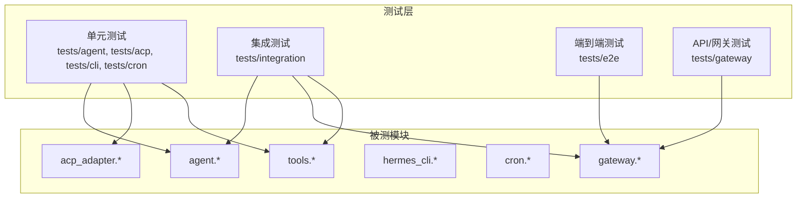
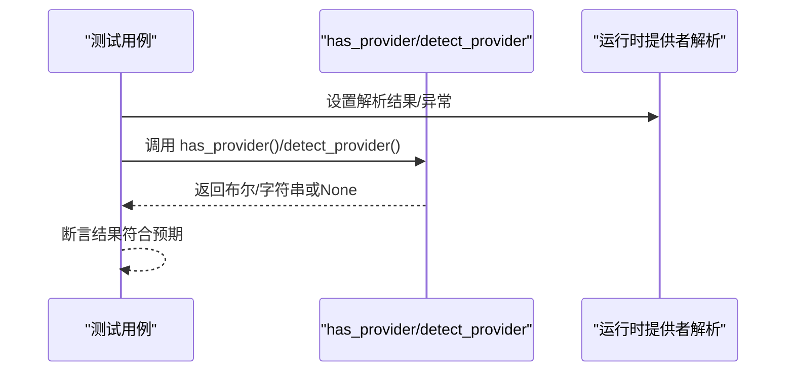
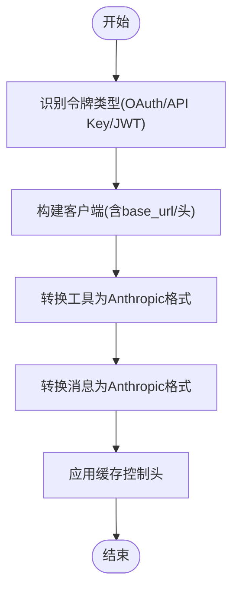
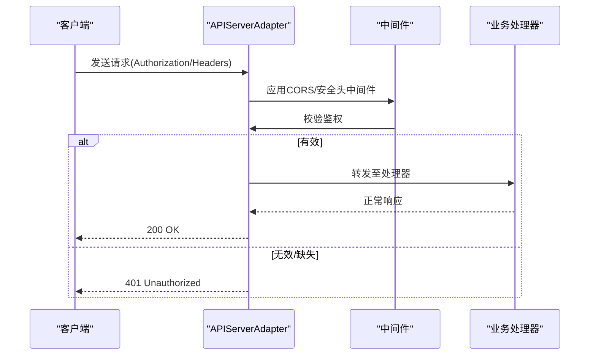
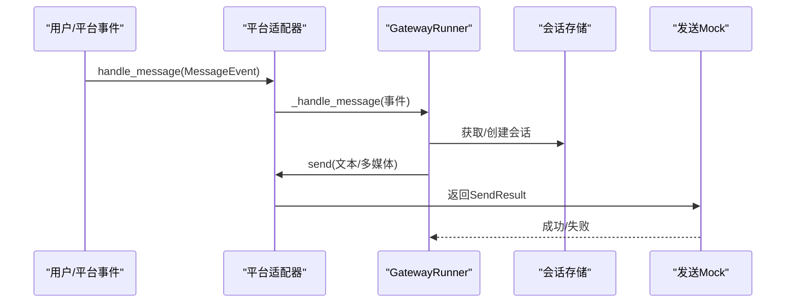
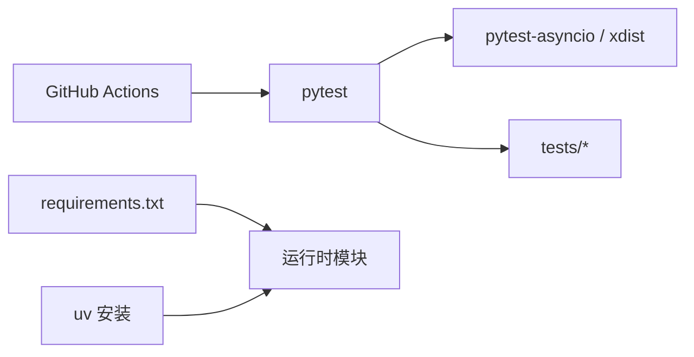
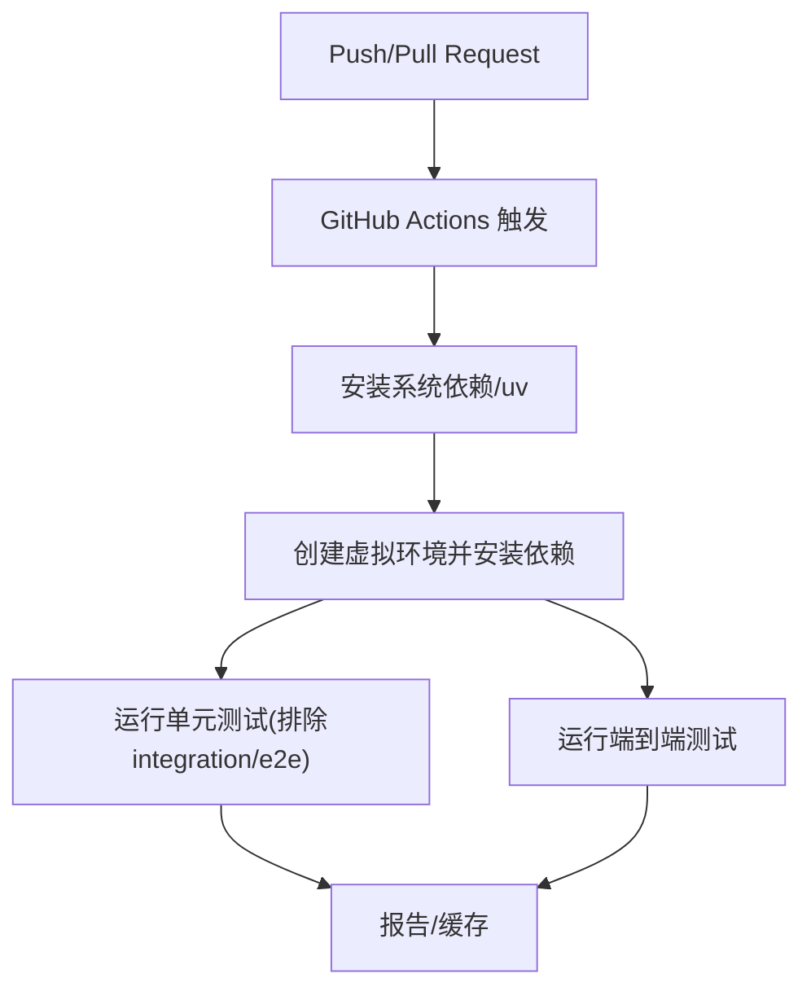

# 测试策略

<cite>
**本文引用的文件**
- [tests/conftest.py](file://tests/conftest.py)
- [pyproject.toml](file://pyproject.toml)
- [.github/workflows/tests.yml](file://.github/workflows/tests.yml)
- [tests/acp/test_auth.py](file://tests/acp/test_auth.py)
- [tests/agent/test_anthropic_adapter.py](file://tests/agent/test_anthropic_adapter.py)
- [tests/e2e/conftest.py](file://tests/e2e/conftest.py)
- [tests/integration/test_batch_runner.py](file://tests/integration/test_batch_runner.py)
- [tests/gateway/test_api_server.py](file://tests/gateway/test_api_server.py)
- [requirements.txt](file://requirements.txt)
</cite>

## 目录
1. [引言](#引言)
2. [项目结构与测试组织](#项目结构与测试组织)
3. [核心组件与测试分类](#核心组件与测试分类)
4. [架构总览](#架构总览)
5. [详细组件分析](#详细组件分析)
6. [依赖关系分析](#依赖关系分析)
7. [性能与安全测试](#性能与安全测试)
8. [自动化与持续集成](#自动化与持续集成)
9. [测试编写指南](#测试编写指南)
10. [故障排查与调试](#故障排查与调试)
11. [结论](#结论)

## 引言
本指南面向 Hermes Agent 的测试团队与贡献者，系统化阐述项目的测试架构、测试分类、工具与框架配置、测试编写规范、覆盖率与质量门禁、自动化与持续集成流程，以及性能与安全专项测试建议。目标是帮助读者在不深入源码的前提下，快速理解并高效落地测试工作。

## 项目结构与测试组织
- 测试目录按功能域划分：agent、gateway、cli、cron、integration、e2e、tools 等，便于按模块进行单元与集成测试。
- 全局共享夹具与隔离环境由 tests/conftest.py 提供，确保测试可重复性与隔离性（如 HERMES_HOME 隔离、事件循环注入、超时保护）。
- pytest 标记用于区分集成测试（需要外部服务或密钥），默认 CI 中通过标记过滤避免误触发真实调用。
- GitHub Actions 工作流将常规单元测试与端到端测试拆分为独立 job，分别运行不同测试集。

章节来源
- [tests/conftest.py:1-122](file://tests/conftest.py#L1-L122)
- [pyproject.toml:123-129](file://pyproject.toml#L123-L129)
- [.github/workflows/tests.yml:1-74](file://.github/workflows/tests.yml#L1-L74)

## 核心组件与测试分类
- 单元测试（Unit Tests）
  - 覆盖核心逻辑与函数级行为，如认证检测、适配器参数转换、消息格式化等。
  - 示例：ACP 认证检测、Anthropic 适配器构建与令牌解析。
- 集成测试（Integration Tests）
  - 涉及外部服务或真实密钥，使用 pytest 标记 integration 进行隔离。
  - 示例：批处理运行器输出校验脚本。
- 端到端测试（E2E Tests）
  - 模拟完整异步消息流，验证平台适配器与网关运行器的协作，不依赖真实平台连接。
  - 示例：Telegram/Discord/Slack 平台适配器的 e2e 夹具与消息处理链路。
- API/网关测试
  - 针对 OpenAI 兼容 API 服务器适配器的请求解析、响应格式、鉴权、CORS、健康检查等。
- CLI/工具测试
  - 覆盖命令行交互、配置加载、插件注册、模型选择等。

章节来源
- [tests/acp/test_auth.py:1-57](file://tests/acp/test_auth.py#L1-L57)
- [tests/agent/test_anthropic_adapter.py:1-200](file://tests/agent/test_anthropic_adapter.py#L1-L200)
- [tests/e2e/conftest.py:1-267](file://tests/e2e/conftest.py#L1-L267)
- [tests/integration/test_batch_runner.py:1-133](file://tests/integration/test_batch_runner.py#L1-L133)
- [tests/gateway/test_api_server.py:1-200](file://tests/gateway/test_api_server.py#L1-L200)

## 架构总览
下图展示测试层与被测模块的关系，以及测试运行的典型路径。

图表来源
- [tests/agent/test_anthropic_adapter.py:1-200](file://tests/agent/test_anthropic_adapter.py#L1-L200)
- [tests/acp/test_auth.py:1-57](file://tests/acp/test_auth.py#L1-L57)
- [tests/e2e/conftest.py:1-267](file://tests/e2e/conftest.py#L1-L267)
- [tests/gateway/test_api_server.py:1-200](file://tests/gateway/test_api_server.py#L1-L200)

## 详细组件分析

### ACP 认证与权限测试
- 关注点
  - 提供商存在性判断与提供商类型识别。
  - 在运行时提供者解析失败或密钥缺失时的行为。
- 测试要点
  - 使用 monkeypatch 注入解析结果或异常，验证 has_provider/detect_provider 的返回值。
  - 断言返回值与预期一致，覆盖空键、错误场景与第三方提供商场景。

图表来源
- [tests/acp/test_auth.py:6-57](file://tests/acp/test_auth.py#L6-L57)

章节来源
- [tests/acp/test_auth.py:1-57](file://tests/acp/test_auth.py#L1-L57)

### Anthropic 适配器测试
- 关注点
  - OAuth 令牌识别、客户端构建、工具与消息格式转换、缓存控制头设置。
- 测试要点
  - 分类覆盖 OAuth 令牌、API Key、自定义 base_url、Minimax 特殊端点等场景。
  - 使用 patch 替换 SDK 初始化，断言传参与默认头是否包含期望的 beta 标识。
  - 凭据读取与有效期校验，优先级与回退逻辑。

图表来源
- [tests/agent/test_anthropic_adapter.py:34-117](file://tests/agent/test_anthropic_adapter.py#L34-L117)

章节来源
- [tests/agent/test_anthropic_adapter.py:1-200](file://tests/agent/test_anthropic_adapter.py#L1-L200)

### 网关 API 服务器适配器测试
- 关注点
  - 依赖可用性检查、响应存储（LRU）、适配器初始化与配置来源（构造参数/环境变量）、鉴权（Bearer Key/缺失/错误）。
- 测试要点
  - 使用 AioHTTP TestCase 与 TestClient 模拟请求，验证路由行为与错误码。
  - 鉴权失败返回 401，无密钥则放行；CORS 与安全头中间件生效。

图表来源
- [tests/gateway/test_api_server.py:158-199](file://tests/gateway/test_api_server.py#L158-L199)

章节来源
- [tests/gateway/test_api_server.py:1-200](file://tests/gateway/test_api_server.py#L1-L200)

### 端到端测试（Telegram/Discord/Slack）
- 关注点
  - 完整异步消息流：adapter.handle_message → 后台任务 → GatewayRunner._handle_message → adapter.send（被 mock 捕获）。
  - 不依赖真实平台连接，通过夹具模拟平台库与运行器内部状态。
- 测试要点
  - 参数化平台 fixture，统一构造 MessageEvent、SessionEntry、GatewayRunner 与 Adapter。
  - 使用 AsyncMock 验证发送行为与会话状态更新。

图表来源
- [tests/e2e/conftest.py:1-267](file://tests/e2e/conftest.py#L1-L267)

章节来源
- [tests/e2e/conftest.py:1-267](file://tests/e2e/conftest.py#L1-L267)

### 批处理运行器（集成测试示例）
- 关注点
  - 创建小样本数据集，执行批处理，生成 checkpoint、statistics 与 batch 文件。
  - 输出目录清理与校验逻辑，便于回归与性能对比。
- 测试要点
  - 通过 pytest 标记 integration 隔离真实外部调用。
  - 提供手动运行与验证脚本，避免 CI 中误触发真实 API。

章节来源
- [tests/integration/test_batch_runner.py:1-133](file://tests/integration/test_batch_runner.py#L1-L133)

## 依赖关系分析
- 测试框架与插件
  - pytest、pytest-asyncio、pytest-xdist（并行执行）、dev 可选依赖。
- 运行时依赖
  - 项目核心依赖与可选 extras（如 messaging、mcp、voice 等）在安装时影响测试覆盖面。
- CI 依赖
  - GitHub Actions 使用 uv 安装 Python 与依赖，并通过环境变量屏蔽真实 API 密钥。

图表来源
- [pyproject.toml:39-110](file://pyproject.toml#L39-L110)
- [requirements.txt:1-37](file://requirements.txt#L1-L37)
- [.github/workflows/tests.yml:25-45](file://.github/workflows/tests.yml#L25-L45)

章节来源
- [pyproject.toml:39-110](file://pyproject.toml#L39-L110)
- [requirements.txt:1-37](file://requirements.txt#L1-L37)
- [.github/workflows/tests.yml:25-45](file://.github/workflows/tests.yml#L25-L45)

## 性能与安全测试
- 性能测试建议
  - 对长上下文压缩、多轮对话、工具调用链路进行基准测试，记录吞吐与延迟。
  - 使用批处理运行器（集成测试）在受控数据集上评估整体性能。
- 安全测试建议
  - 鉴权绕过与密钥泄露：确保所有测试均清空真实密钥环境变量，仅使用 mock。
  - CORS/安全头：验证 API 服务器中间件正确性。
  - 输入验证：针对平台输入、URL、文件上传等进行边界与恶意输入测试。

章节来源
- [tests/gateway/test_api_server.py:158-199](file://tests/gateway/test_api_server.py#L158-L199)
- [.github/workflows/tests.yml:41-46](file://.github/workflows/tests.yml#L41-L46)

## 自动化与持续集成
- 测试运行
  - 默认运行 tests/ 下除 integration 与 e2e 之外的测试，使用并行执行提升效率。
  - e2e 测试单独 job 运行，便于资源隔离与并发调度。
- 环境隔离
  - CI 中显式清空 OPENROUTER_API_KEY、OPENAI_API_KEY、NOUS_API_KEY，防止真实调用。
- 依赖安装
  - 使用 uv 创建虚拟环境并安装 -e ".[all,dev]"，保证测试所需依赖齐全。

图表来源
- [.github/workflows/tests.yml:14-74](file://.github/workflows/tests.yml#L14-L74)

章节来源
- [.github/workflows/tests.yml:14-74](file://.github/workflows/tests.yml#L14-L74)

## 测试编写指南
- 设计原则
  - 单一职责：每个测试聚焦一个行为或分支。
  - 可重复性：使用夹具与隔离环境（HERMES_HOME、事件循环、超时）。
  - 可维护性：参数化与工厂方法（如 e2e 夹具）减少重复代码。
- 断言方法
  - 行为断言：验证函数返回值、异常抛出、日志输出。
  - 状态断言：mock 调用次数与参数、对象属性变化。
  - 异步断言：使用 asyncio/pytest-asyncio，配合 AsyncMock。
- 测试数据准备
  - 使用临时目录与 JSON 文件模拟配置与数据集。
  - 对于外部依赖，使用 patch/monkeypatch 替换真实调用。
- 标记与分组
  - 使用 pytest.mark.integration 区分集成测试。
  - 使用 pytest.mark.asyncio 标注异步测试。

章节来源
- [tests/conftest.py:19-122](file://tests/conftest.py#L19-L122)
- [tests/e2e/conftest.py:244-267](file://tests/e2e/conftest.py#L244-L267)
- [pyproject.toml:123-129](file://pyproject.toml#L123-L129)

## 故障排查与调试
- 常见问题
  - 测试挂起：启用全局 30 秒超时保护，定位阻塞点（子进程、阻塞 I/O）。
  - 事件循环缺失：同步测试自动注入事件循环，异步测试使用 pytest-asyncio。
  - 平台库未安装：e2e 夹具中对 telegram/discord/slack 进行 mock，确保导入成功。
- 调试技巧
  - 使用 -v/-s 查看详细输出与打印信息。
  - 对关键路径添加断点（如 VS Code/IDE），结合 pytest-cov 生成覆盖率报告。
  - 针对 API 服务器：使用 aiohttp.TestClient 直接发起请求，逐步缩小范围。

章节来源
- [tests/conftest.py:74-122](file://tests/conftest.py#L74-L122)
- [tests/e2e/conftest.py:28-114](file://tests/e2e/conftest.py#L28-L114)

## 结论
本测试策略以 pytest 为核心，结合单元、集成与端到端测试，覆盖核心模块与网关 API，配合 GitHub Actions 实现自动化与隔离执行。建议在现有基础上完善覆盖率统计与质量门禁、扩展性能与安全专项测试，并持续优化测试夹具与断言策略，以保障 Hermes Agent 的稳定性与可维护性。