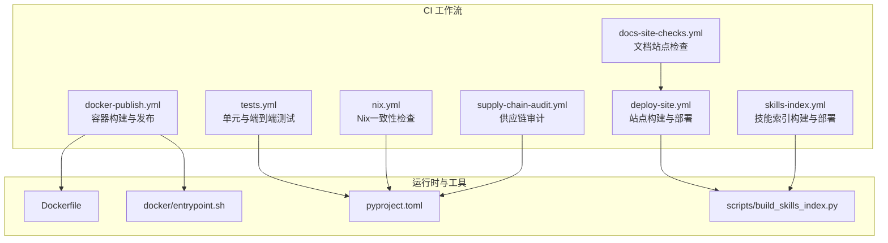
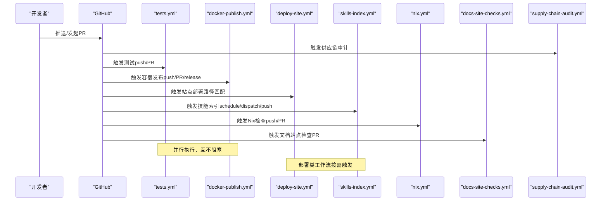
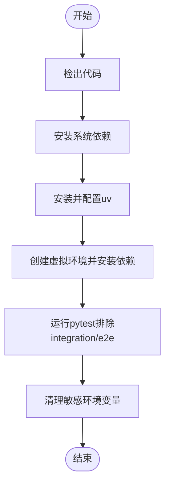
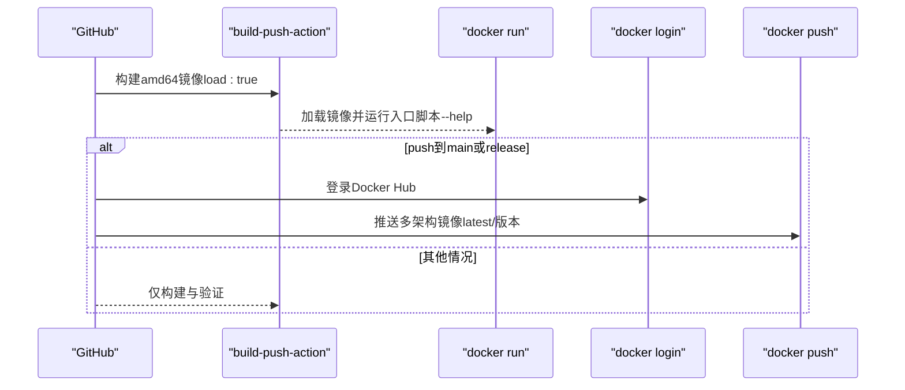
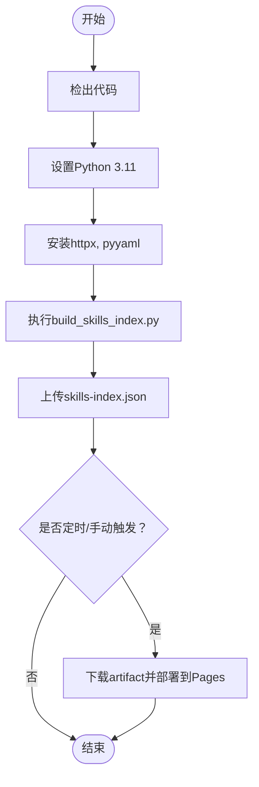
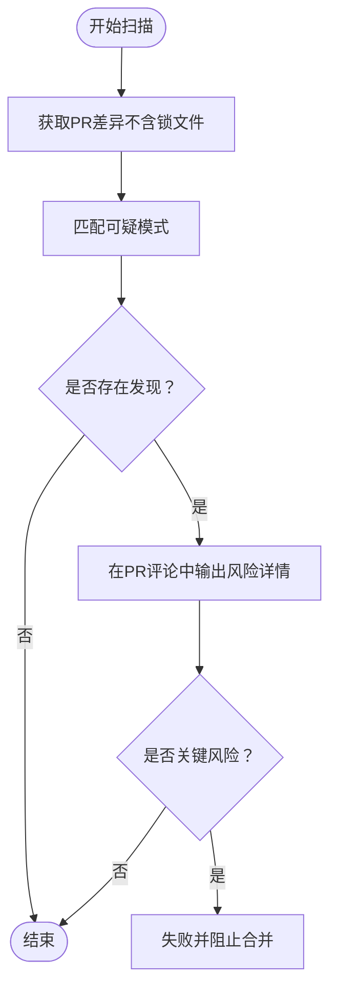
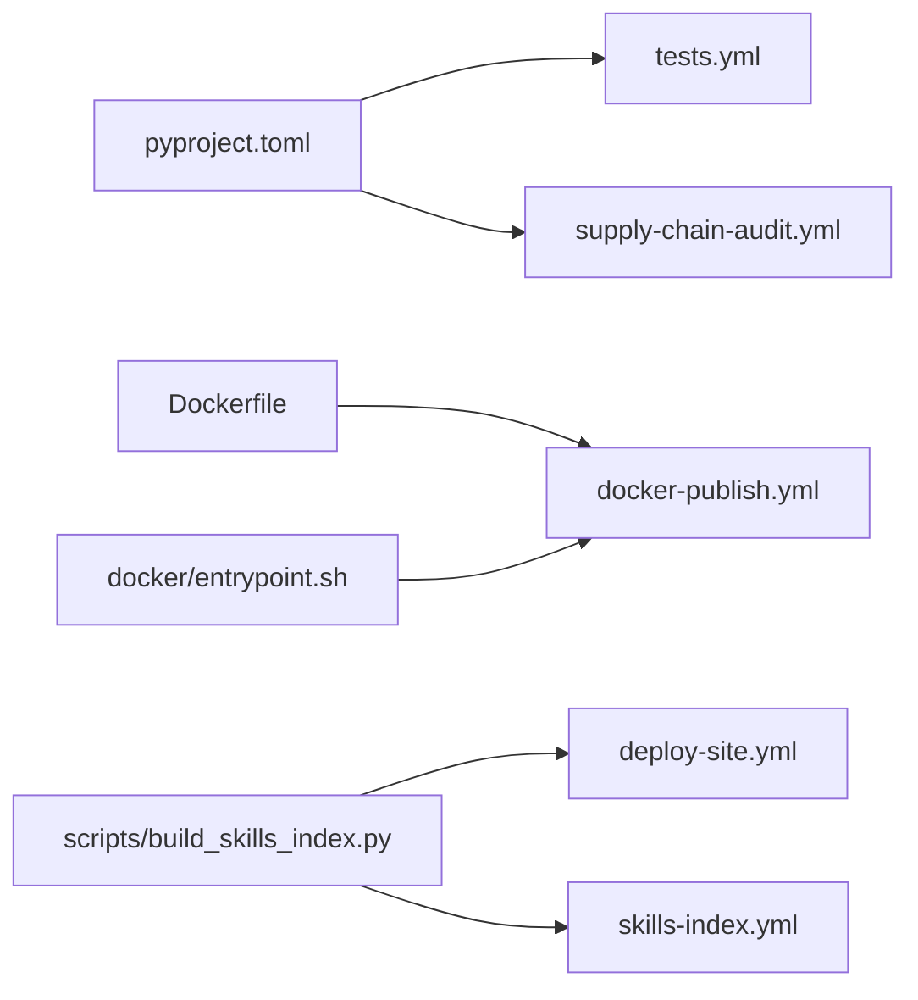

# 测试自动化与持续集成

<cite>
**本文引用的文件**
- [.github/workflows/tests.yml](file://.github/workflows/tests.yml)
- [.github/workflows/docker-publish.yml](file://.github/workflows/docker-publish.yml)
- [.github/workflows/deploy-site.yml](file://.github/workflows/deploy-site.yml)
- [.github/workflows/skills-index.yml](file://.github/workflows/skills-index.yml)
- [.github/workflows/nix.yml](file://.github/workflows/nix.yml)
- [.github/workflows/docs-site-checks.yml](file://.github/workflows/docs-site-checks.yml)
- [.github/workflows/supply-chain-audit.yml](file://.github/workflows/supply-chain-audit.yml)
- [pyproject.toml](file://pyproject.toml)
- [Dockerfile](file://Dockerfile)
- [docker/entrypoint.sh](file://docker/entrypoint.sh)
- [scripts/build_skills_index.py](file://scripts/build_skills_index.py)
</cite>

## 目录
1. [简介](#简介)
2. [项目结构](#项目结构)
3. [核心组件](#核心组件)
4. [架构总览](#架构总览)
5. [详细组件分析](#详细组件分析)
6. [依赖关系分析](#依赖关系分析)
7. [性能考量](#性能考量)
8. [故障排查指南](#故障排查指南)
9. [结论](#结论)
10. [附录](#附录)

## 简介
本文件面向Hermes Agent项目的测试自动化与持续集成（CI/CD），系统性阐述以下内容：
- CI/CD流水线设计与配置：基于GitHub Actions的工作流组织、触发策略与并发控制。
- 自动化测试流程：测试触发条件、测试矩阵与并行执行、测试报告与结果分析方法。
- 覆盖率与质量门禁：当前仓库未启用覆盖率统计与质量门禁，建议的落地方案与最佳实践。
- 发布流程中的测试验证与自动化部署：镜像构建、多架构推送、站点与技能索引发布。
- 测试环境管理与测试数据维护：隔离与安全、环境变量注入与清理。

## 项目结构
本项目采用“根目录 + .github/workflows”的标准CI布局，关键测试与发布工作流如下：
- 测试工作流：tests.yml，覆盖单元测试与端到端测试，并通过pytest-xdist实现并行执行。
- 容器发布：docker-publish.yml，负责镜像构建、多架构推送与基础可用性验证。
- 文档站点：deploy-site.yml与docs-site-checks.yml，分别用于站点构建与PR检查。
- 技能索引：skills-index.yml，定时与手动构建技能索引并部署到GitHub Pages。
- 包管理与构建：nix.yml，对Nix生态进行一致性校验。
- 供应链审计：supply-chain-audit.yml，扫描潜在供应链风险模式。

图表来源
- [.github/workflows/tests.yml:1-74](file://.github/workflows/tests.yml#L1-L74)
- [.github/workflows/docker-publish.yml:1-87](file://.github/workflows/docker-publish.yml#L1-L87)
- [.github/workflows/deploy-site.yml:1-83](file://.github/workflows/deploy-site.yml#L1-L83)
- [.github/workflows/skills-index.yml:1-102](file://.github/workflows/skills-index.yml#L1-L102)
- [.github/workflows/nix.yml:1-41](file://.github/workflows/nix.yml#L1-L41)
- [.github/workflows/docs-site-checks.yml:1-43](file://.github/workflows/docs-site-checks.yml#L1-L43)
- [.github/workflows/supply-chain-audit.yml:1-193](file://.github/workflows/supply-chain-audit.yml#L1-L193)
- [Dockerfile:1-47](file://Dockerfile#L1-L47)
- [docker/entrypoint.sh:1-65](file://docker/entrypoint.sh#L1-L65)
- [pyproject.toml:123-129](file://pyproject.toml#L123-L129)
- [scripts/build_skills_index.py:1-326](file://scripts/build_skills_index.py#L1-L326)

章节来源
- [.github/workflows/tests.yml:1-74](file://.github/workflows/tests.yml#L1-L74)
- [.github/workflows/docker-publish.yml:1-87](file://.github/workflows/docker-publish.yml#L1-L87)
- [.github/workflows/deploy-site.yml:1-83](file://.github/workflows/deploy-site.yml#L1-L83)
- [.github/workflows/skills-index.yml:1-102](file://.github/workflows/skills-index.yml#L1-L102)
- [.github/workflows/nix.yml:1-41](file://.github/workflows/nix.yml#L1-L41)
- [.github/workflows/docs-site-checks.yml:1-43](file://.github/workflows/docs-site-checks.yml#L1-L43)
- [.github/workflows/supply-chain-audit.yml:1-193](file://.github/workflows/supply-chain-audit.yml#L1-L193)
- [pyproject.toml:123-129](file://pyproject.toml#L123-L129)
- [Dockerfile:1-47](file://Dockerfile#L1-L47)
- [docker/entrypoint.sh:1-65](file://docker/entrypoint.sh#L1-L65)
- [scripts/build_skills_index.py:1-326](file://scripts/build_skills_index.py#L1-L326)

## 核心组件
- 测试工作流（tests.yml）
  - 触发：分支main上的push与pull_request；同一PR/分支内取消前序运行。
  - 并行：使用pytest-xdist的-n auto自动并行；忽略integration与e2e目录以保证快速反馈。
  - 环境：使用astral-sh/setup-uv安装uv，Python 3.11，虚拟环境安装“[all,dev]”可选依赖。
  - 安全：显式清空敏感环境变量，避免调用真实外部API。
- 端到端测试（e2e）
  - 单独作业，独立安装依赖，仅运行tests/e2e，便于资源与时间隔离。
- 容器发布（docker-publish.yml）
  - 多阶段构建：基于uv与gosu镜像，安装系统依赖、Node/Playwright、Python虚拟环境。
  - 构建与验证：先构建amd64镜像并加载到本地，执行入口脚本帮助信息验证。
  - 推送策略：main分支与release事件分别推送latest与版本标签，支持linux/amd64, linux/arm64。
- 文档站点（deploy-site.yml）
  - 仅在上游仓库触发；提取技能元数据、构建Docusaurus、上传GitHub Pages工件并部署。
- 技能索引（skills-index.yml）
  - 定时与手动触发；构建后上传artifact并在特定条件下部署到Pages。
- Nix生态（nix.yml）
  - 在ubuntu与macOS上分别执行flake检查与包构建（Linux）或展示（macOS）。
- 文档站点检查（docs-site-checks.yml）
  - PR中仅对website变更执行lint与构建，确保文档质量。
- 供应链审计（supply-chain-audit.yml）
  - 扫描新增代码中的可疑模式（如base64+exec/eval、subprocess编码命令、网络POST等），对关键发现阻断合并。

章节来源
- [.github/workflows/tests.yml:1-74](file://.github/workflows/tests.yml#L1-L74)
- [.github/workflows/docker-publish.yml:1-87](file://.github/workflows/docker-publish.yml#L1-L87)
- [.github/workflows/deploy-site.yml:1-83](file://.github/workflows/deploy-site.yml#L1-L83)
- [.github/workflows/skills-index.yml:1-102](file://.github/workflows/skills-index.yml#L1-L102)
- [.github/workflows/nix.yml:1-41](file://.github/workflows/nix.yml#L1-L41)
- [.github/workflows/docs-site-checks.yml:1-43](file://.github/workflows/docs-site-checks.yml#L1-L43)
- [.github/workflows/supply-chain-audit.yml:1-193](file://.github/workflows/supply-chain-audit.yml#L1-L193)

## 架构总览
下图展示了从代码提交到测试、构建与发布的整体流程，以及各工作流之间的依赖关系与触发条件。

图表来源
- [.github/workflows/tests.yml:1-74](file://.github/workflows/tests.yml#L1-L74)
- [.github/workflows/docker-publish.yml:1-87](file://.github/workflows/docker-publish.yml#L1-L87)
- [.github/workflows/deploy-site.yml:1-83](file://.github/workflows/deploy-site.yml#L1-L83)
- [.github/workflows/skills-index.yml:1-102](file://.github/workflows/skills-index.yml#L1-L102)
- [.github/workflows/nix.yml:1-41](file://.github/workflows/nix.yml#L1-L41)
- [.github/workflows/docs-site-checks.yml:1-43](file://.github/workflows/docs-site-checks.yml#L1-L43)
- [.github/workflows/supply-chain-audit.yml:1-193](file://.github/workflows/supply-chain-audit.yml#L1-L193)

## 详细组件分析

### 测试工作流（tests.yml）
- 触发与并发
  - 使用concurrency.group与cancel-in-progress在同一分支/PR内取消重复运行，缩短反馈周期。
- 测试矩阵与并行
  - 当前为单作业，但通过pytest-xdist的-n auto实现并行；若需跨Python版本或操作系统矩阵，可在作业层添加strategy.matrix。
- 测试范围与隔离
  - 默认排除integration与e2e，确保主干快速反馈；e2e单独作业，避免与常规测试争抢资源。
- 环境与依赖
  - 使用uv创建虚拟环境并安装“[all,dev]”，统一Python版本与依赖解析。
- 安全与隔离
  - 显式清空OPENROUTER_API_KEY、OPENAI_API_KEY、NOUS_API_KEY，防止误调用真实服务。

图表来源
- [.github/workflows/tests.yml:18-46](file://.github/workflows/tests.yml#L18-L46)

章节来源
- [.github/workflows/tests.yml:1-74](file://.github/workflows/tests.yml#L1-L74)
- [pyproject.toml:123-129](file://pyproject.toml#L123-L129)

### 端到端测试（e2e）
- 独立作业，独立安装依赖，仅运行tests/e2e，便于资源隔离与失败定位。
- 通过环境变量清空API密钥，确保e2e不依赖真实外部服务。

章节来源
- [.github/workflows/tests.yml:47-74](file://.github/workflows/tests.yml#L47-L74)

### 容器发布（docker-publish.yml）
- 构建与验证
  - 先构建amd64镜像并load到本地，使用自定义入口脚本执行--help验证基础可用性。
- 多架构与推送
  - main分支推送latest，release事件推送具体版本标签；同时支持linux/amd64与linux/arm64。
- 权限与条件
  - 仅在上游仓库触发；登录Docker Hub仅在push到main或release事件时执行。

图表来源
- [.github/workflows/docker-publish.yml:39-86](file://.github/workflows/docker-publish.yml#L39-L86)
- [Dockerfile:1-47](file://Dockerfile#L1-L47)
- [docker/entrypoint.sh:1-65](file://docker/entrypoint.sh#L1-L65)

章节来源
- [.github/workflows/docker-publish.yml:1-87](file://.github/workflows/docker-publish.yml#L1-L87)
- [Dockerfile:1-47](file://Dockerfile#L1-L47)
- [docker/entrypoint.sh:1-65](file://docker/entrypoint.sh#L1-L65)

### 文档站点与技能索引
- 文档站点（deploy-site.yml）
  - 仅在上游仓库触发；提取技能元数据、构建Docusaurus、上传并部署到GitHub Pages。
- 技能索引（skills-index.yml）
  - 定时（每日两次UTC）与手动触发；构建后上传artifact并在特定条件下部署到Pages。
  - 索引构建脚本支持多源爬取、批量解析GitHub路径、去重与排序。

图表来源
- [.github/workflows/skills-index.yml:18-54](file://.github/workflows/skills-index.yml#L18-L54)
- [.github/workflows/deploy-site.yml:46-55](file://.github/workflows/deploy-site.yml#L46-L55)
- [scripts/build_skills_index.py:245-325](file://scripts/build_skills_index.py#L245-L325)

章节来源
- [.github/workflows/deploy-site.yml:1-83](file://.github/workflows/deploy-site.yml#L1-L83)
- [.github/workflows/skills-index.yml:1-102](file://.github/workflows/skills-index.yml#L1-L102)
- [scripts/build_skills_index.py:1-326](file://scripts/build_skills_index.py#L1-L326)

### Nix生态检查（nix.yml）
- 在ubuntu与macOS上分别执行flake检查与包构建（Linux）或展示（macOS），确保跨平台一致性。

章节来源
- [.github/workflows/nix.yml:1-41](file://.github/workflows/nix.yml#L1-L41)

### 文档站点检查（docs-site-checks.yml）
- 仅在PR且路径匹配website变更时触发，执行lint与构建，保障文档质量。

章节来源
- [.github/workflows/docs-site-checks.yml:1-43](file://.github/workflows/docs-site-checks.yml#L1-L43)

### 供应链审计（supply-chain-audit.yml）
- 扫描新增代码中的可疑模式，包括但不限于：.pth文件、base64+exec/eval、subprocess编码命令、网络POST请求、安装钩子文件、marshal/pickle/compile等。
- 对关键发现直接失败并评论PR，要求人工审查。

图表来源
- [.github/workflows/supply-chain-audit.yml:21-192](file://.github/workflows/supply-chain-audit.yml#L21-L192)

章节来源
- [.github/workflows/supply-chain-audit.yml:1-193](file://.github/workflows/supply-chain-audit.yml#L1-L193)

## 依赖关系分析
- 测试与构建
  - tests.yml依赖pyproject.toml中的pytest配置与dev依赖；docker-publish.yml依赖Dockerfile与entrypoint脚本。
- 文档与技能
  - deploy-site.yml与skills-index.yml共同依赖scripts/build_skills_index.py生成的技能索引。
- 供应链安全
  - supply-chain-audit.yml扫描所有工作流与源码变更，形成前置质量门。

图表来源
- [pyproject.toml:123-129](file://pyproject.toml#L123-L129)
- [.github/workflows/tests.yml:31-40](file://.github/workflows/tests.yml#L31-L40)
- [Dockerfile:1-47](file://Dockerfile#L1-L47)
- [docker/entrypoint.sh:1-65](file://docker/entrypoint.sh#L1-L65)
- [scripts/build_skills_index.py:1-326](file://scripts/build_skills_index.py#L1-L326)
- [.github/workflows/deploy-site.yml:46-55](file://.github/workflows/deploy-site.yml#L46-L55)
- [.github/workflows/skills-index.yml:32-42](file://.github/workflows/skills-index.yml#L32-L42)
- [.github/workflows/supply-chain-audit.yml:16-19](file://.github/workflows/supply-chain-audit.yml#L16-L19)

章节来源
- [pyproject.toml:123-129](file://pyproject.toml#L123-L129)
- [.github/workflows/tests.yml:1-74](file://.github/workflows/tests.yml#L1-L74)
- [Dockerfile:1-47](file://Dockerfile#L1-L47)
- [docker/entrypoint.sh:1-65](file://docker/entrypoint.sh#L1-L65)
- [scripts/build_skills_index.py:1-326](file://scripts/build_skills_index.py#L1-L326)
- [.github/workflows/deploy-site.yml:1-83](file://.github/workflows/deploy-site.yml#L1-L83)
- [.github/workflows/skills-index.yml:1-102](file://.github/workflows/skills-index.yml#L1-L102)
- [.github/workflows/supply-chain-audit.yml:1-193](file://.github/workflows/supply-chain-audit.yml#L1-L193)

## 性能考量
- 测试并行
  - tests.yml已启用pytest-xdist的-n auto，建议在需要时扩展strategy.matrix以并行不同Python版本或操作系统。
- 缓存与复用
  - docker-publish.yml与tests.yml均使用GitHub Actions缓存（gha），提升构建速度。
- 资源隔离
  - e2e单独作业，避免与常规测试争用资源；concurrency.cancel-in-progress减少无效排队。
- 构建优化
  - Dockerfile分层安装系统依赖与Python虚拟环境，entrypoint预置必要目录，降低运行时初始化开销。

## 故障排查指南
- 测试失败
  - 检查tests.yml中pytest参数与排除规则，确认是否误排除了目标测试；核对环境变量是否被正确清空。
- 容器启动异常
  - 查看docker-publish.yml中镜像构建与入口脚本执行日志；确认Dockerfile与entrypoint.sh权限与用户映射。
- 文档站点构建失败
  - 检查deploy-site.yml与docs-site-checks.yml的依赖安装与构建步骤；确认技能元数据提取脚本是否成功。
- 技能索引构建失败
  - 检查GITHUB_TOKEN配置与网络访问；关注scripts/build_skills_index.py的并发与超时设置。
- 供应链审计阻断
  - 根据PR评论中的风险点逐项核查，必要时调整代码或补充注释说明。

章节来源
- [.github/workflows/tests.yml:37-46](file://.github/workflows/tests.yml#L37-L46)
- [.github/workflows/docker-publish.yml:50-56](file://.github/workflows/docker-publish.yml#L50-L56)
- [.github/workflows/deploy-site.yml:65-74](file://.github/workflows/deploy-site.yml#L65-L74)
- [.github/workflows/skills-index.yml:32-42](file://.github/workflows/skills-index.yml#L32-L42)
- [.github/workflows/supply-chain-audit.yml:167-192](file://.github/workflows/supply-chain-audit.yml#L167-L192)

## 结论
本项目已具备完善的CI/CD基础：快速的单元测试与端到端测试、可靠的容器构建与发布、稳定的文档站点与技能索引发布、严格的供应链审计与Nix一致性检查。建议后续引入覆盖率统计与质量门禁，以进一步提升发布质量与可追溯性。

## 附录

### 建议：引入覆盖率与质量门禁
- 覆盖率收集
  - 在tests.yml中增加pytest-cov插件与覆盖率阈值配置，将覆盖率结果上传为Artifact。
- 质量门禁
  - 在关键发布工作流（如docker-publish.yml）中增加覆盖率阈值检查步骤，未达标则阻断发布。
- 测试报告
  - 使用pytest-html或类似插件生成测试报告，结合GitHub Checks展示失败详情。

[本节为通用建议，不直接分析具体文件，故无章节来源]