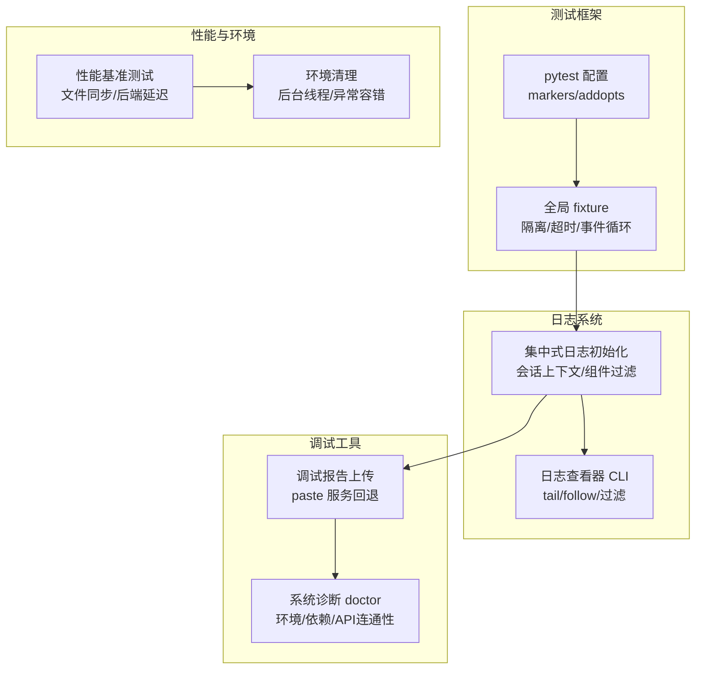
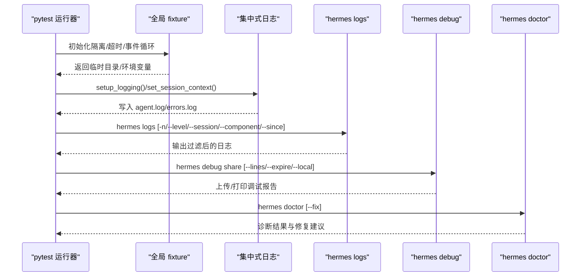
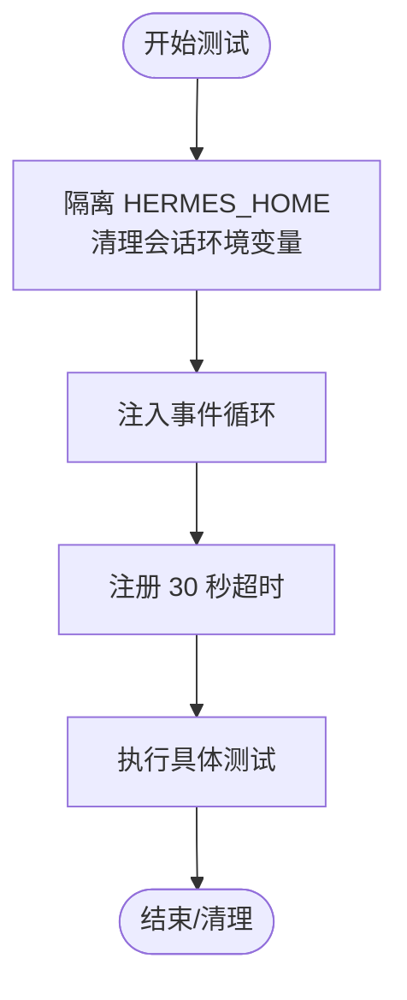
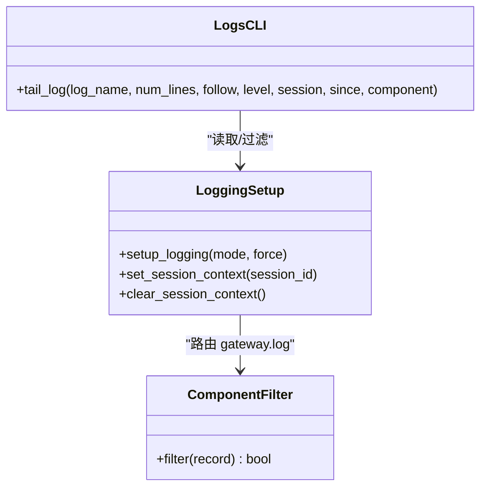
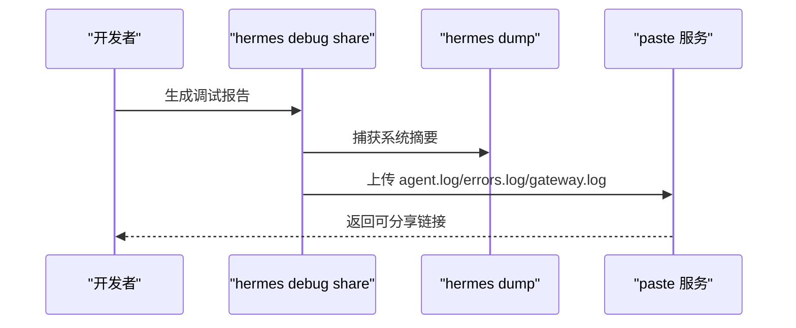
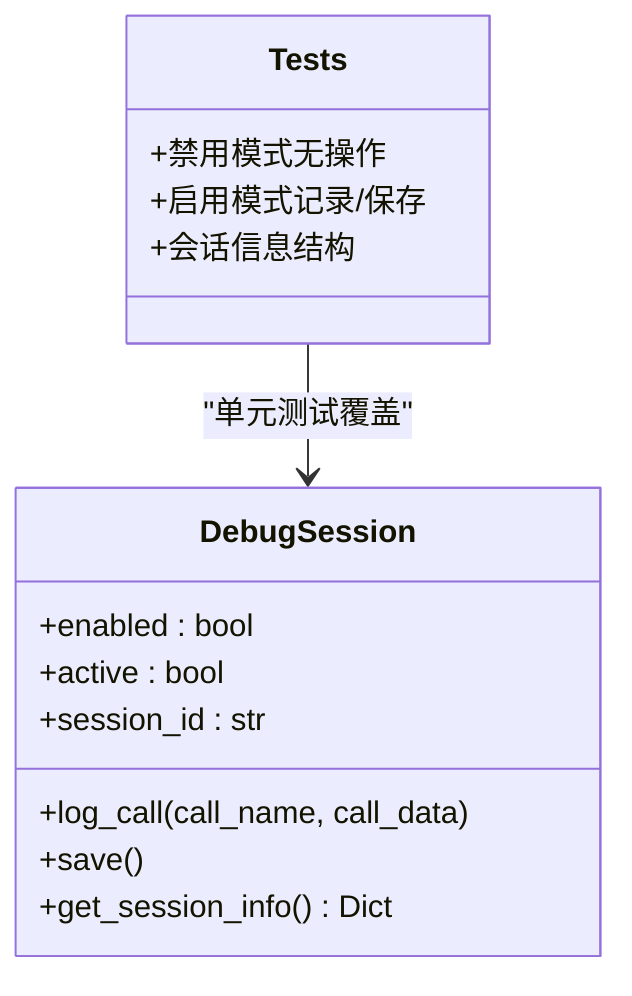
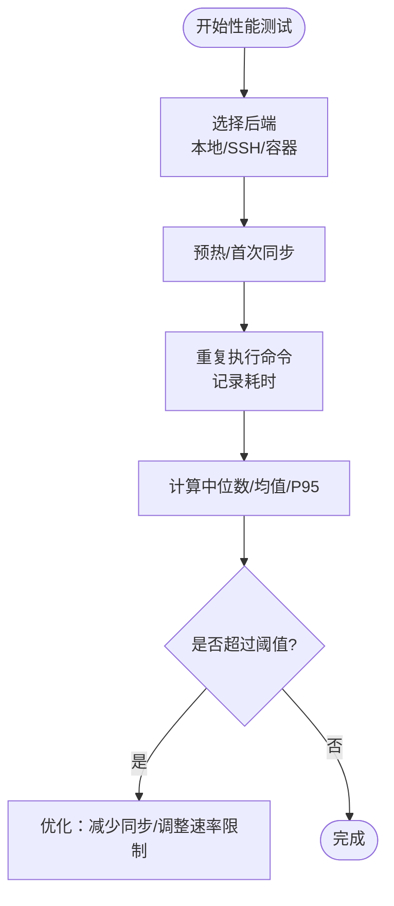
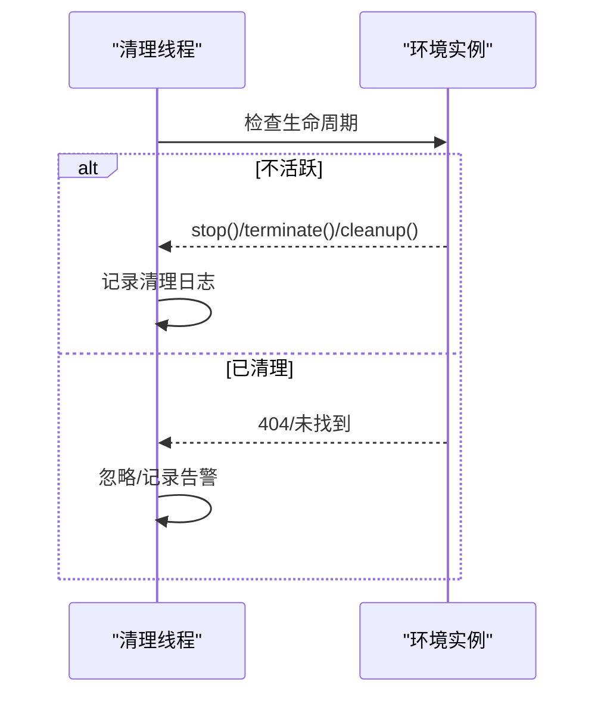
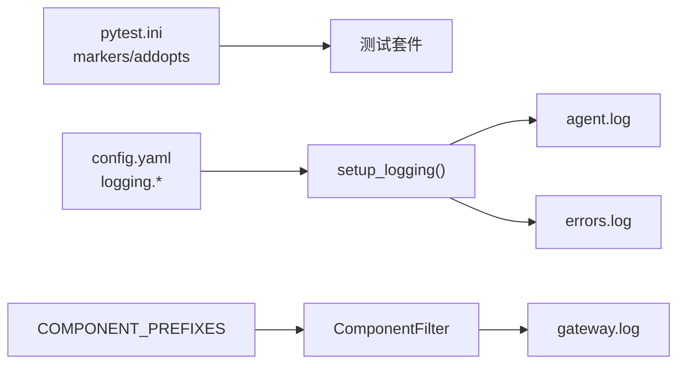
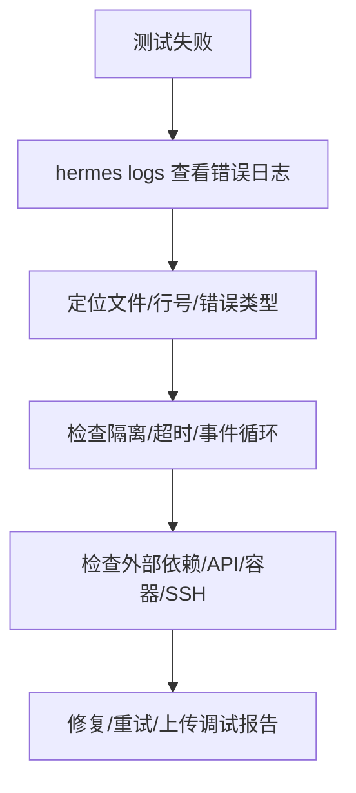

# 测试调试与故障排除

<cite>
**本文引用的文件**
- [tests/conftest.py](file://tests/conftest.py)
- [hermes_logging.py](file://hermes_logging.py)
- [hermes_cli/logs.py](file://hermes_cli/logs.py)
- [hermes_cli/debug.py](file://hermes_cli/debug.py)
- [hermes_cli/doctor.py](file://hermes_cli/doctor.py)
- [tools/debug_helpers.py](file://tools/debug_helpers.py)
- [tests/tools/test_debug_helpers.py](file://tests/tools/test_debug_helpers.py)
- [tests/test_hermes_logging.py](file://tests/test_hermes_logging.py)
- [tests/tools/test_file_sync_perf.py](file://tests/tools/test_file_sync_perf.py)
- [pyproject.toml](file://pyproject.toml)
- [skills/software-development/systematic-debugging/SKILL.md](file://skills/software-development/systematic-debugging/SKILL.md)
- [skills/github/github-pr-workflow/references/ci-troubleshooting.md](file://skills/github/github-pr-workflow/references/ci-troubleshooting.md)
- [environments/benchmarks/terminalbench_2/terminalbench2_env.py](file://environments/benchmarks/terminalbench_2/terminalbench2_env.py)
- [tests/integration/test_modal_terminal.py](file://tests/integration/test_modal_terminal.py)
- [tools/terminal_tool.py](file://tools/terminal_tool.py)
</cite>

## 目录
1. [简介](#简介)
2. [项目结构](#项目结构)
3. [核心组件](#核心组件)
4. [架构总览](#架构总览)
5. [详细组件分析](#详细组件分析)
6. [依赖分析](#依赖分析)
7. [性能考虑](#性能考虑)
8. [故障排除指南](#故障排除指南)
9. [结论](#结论)
10. [附录](#附录)

## 简介
本指南面向Hermes Agent的测试、调试与故障排除场景，覆盖以下关键主题：
- 测试流程中的常见问题与解决方案
- 测试失败的诊断方法（日志分析、堆栈跟踪解读、测试环境检查）
- 调试工具使用（pytest调试器、测试数据检查、环境隔离验证）
- 性能测试中的瓶颈识别与优化建议
- 测试稳定性提升与测试环境维护的最佳实践
- 预防性措施与最佳实践建议

## 项目结构
Hermes Agent的测试与调试能力由多模块协同实现：
- 测试基础：pytest配置、全局fixture、超时与事件循环管理
- 日志系统：集中式日志初始化、会话上下文、组件过滤、轮转与脱敏
- 调试工具：日志查看器、调试报告生成、系统诊断助手
- 性能基准：文件同步开销测量、后端执行时间统计
- 环境清理：终端工具后台清理线程、容器/沙箱资源回收

**图表来源**
- [pyproject.toml:123-129](file://pyproject.toml#L123-L129)
- [tests/conftest.py:19-122](file://tests/conftest.py#L19-L122)
- [hermes_logging.py:161-266](file://hermes_logging.py#L161-L266)
- [hermes_cli/logs.py:138-247](file://hermes_cli/logs.py#L138-L247)
- [hermes_cli/debug.py:206-337](file://hermes_cli/debug.py#L206-L337)
- [hermes_cli/doctor.py:162-800](file://hermes_cli/doctor.py#L162-L800)
- [tests/tools/test_file_sync_perf.py:43-128](file://tests/tools/test_file_sync_perf.py#L43-L128)
- [tools/terminal_tool.py:854-890](file://tools/terminal_tool.py#L854-L890)

**章节来源**
- [pyproject.toml:123-129](file://pyproject.toml#L123-L129)
- [tests/conftest.py:19-122](file://tests/conftest.py#L19-L122)

## 核心组件
- 测试运行与隔离
  - 全局fixture负责隔离HERMES_HOME、删除会话相关环境变量、统一事件循环、强制30秒单测超时
- 日志系统
  - setup_logging集中初始化agent.log、errors.log；可选gateway.log；支持会话标签、组件过滤、轮转与脱敏
  - hermes_cli/logs提供tail/follow/过滤功能，支持按级别、会话、组件、相对时间范围筛选
- 调试与诊断
  - hermes_cli/debug生成系统摘要+日志尾部，支持上传到paste服务或本地输出
  - hermes_cli/doctor进行环境/依赖/API连通性诊断，并给出修复建议
  - tools/debug_helpers提供工具级调试会话记录与保存
- 性能与环境
  - 性能基准测试测量后端执行延迟与文件同步开销
  - 终端工具后台清理线程定期回收不活跃环境，避免资源泄漏

**章节来源**
- [tests/conftest.py:19-122](file://tests/conftest.py#L19-L122)
- [hermes_logging.py:161-266](file://hermes_logging.py#L161-L266)
- [hermes_cli/logs.py:138-247](file://hermes_cli/logs.py#L138-L247)
- [hermes_cli/debug.py:206-337](file://hermes_cli/debug.py#L206-L337)
- [hermes_cli/doctor.py:162-800](file://hermes_cli/doctor.py#L162-L800)
- [tools/debug_helpers.py:36-106](file://tools/debug_helpers.py#L36-L106)
- [tests/tools/test_file_sync_perf.py:43-128](file://tests/tools/test_file_sync_perf.py#L43-L128)
- [tools/terminal_tool.py:854-890](file://tools/terminal_tool.py#L854-L890)

## 架构总览
下图展示测试、日志、调试与诊断在系统中的交互关系。

**图表来源**
- [tests/conftest.py:19-122](file://tests/conftest.py#L19-L122)
- [hermes_logging.py:161-266](file://hermes_logging.py#L161-L266)
- [hermes_cli/logs.py:138-247](file://hermes_cli/logs.py#L138-L247)
- [hermes_cli/debug.py:247-337](file://hermes_cli/debug.py#L247-L337)
- [hermes_cli/doctor.py:162-800](file://hermes_cli/doctor.py#L162-L800)

## 详细组件分析

### 测试运行与隔离（pytest + conftest）
- 隔离策略
  - 将HERMES_HOME重定向至临时目录，确保测试不写入用户主目录
  - 清理会话相关环境变量，避免继承上一次运行状态
  - 删除可能触发真实调用的敏感环境变量（如OPENROUTER_API_KEY）
- 超时与事件循环
  - 单测默认30秒SIGALRM超时，防止阻塞导致整个套件卡死
  - 自动注入事件循环，兼容同步/异步混合测试

**图表来源**
- [tests/conftest.py:19-122](file://tests/conftest.py#L19-L122)

**章节来源**
- [tests/conftest.py:19-122](file://tests/conftest.py#L19-L122)

### 日志系统（集中式初始化与CLI查看）
- 初始化与文件
  - 创建logs目录，分别写入agent.log（INFO+）、errors.log（WARNING+），可选gateway.log（仅gateway组件）
  - 使用轮转处理器，限制大小与备份数量，默认INFO级别，支持从config.yaml读取配置
- 会话上下文与组件过滤
  - 记录工厂自动注入session_tag，便于按会话聚合日志
  - 组件过滤器将gateway.*路由到gateway.log，其余进入agent.log
- CLI查看与过滤
  - 支持tail/follow、按级别、会话ID子串、组件前缀、相对时间范围过滤

**图表来源**
- [hermes_logging.py:161-266](file://hermes_logging.py#L161-L266)
- [hermes_cli/logs.py:138-247](file://hermes_cli/logs.py#L138-L247)

**章节来源**
- [hermes_logging.py:161-266](file://hermes_logging.py#L161-L266)
- [hermes_cli/logs.py:138-247](file://hermes_cli/logs.py#L138-L247)

### 调试报告与诊断（debug/share 与 doctor）
- 调试报告
  - 收集系统摘要（hermes dump）与最近若干行日志（agent.log、errors.log、gateway.log）
  - 上传到paste.rs（首选）或dpaste.com（回退），失败时可本地输出
- 系统诊断
  - 检查Python版本、虚拟环境、必要包、配置文件、配置版本与迁移、认证状态、目录结构、SQLite WAL、外部工具（git/docker/ssh/daytona/node/npm等）、API连通性
  - 可自动修复可自动修复的问题并汇总

**图表来源**
- [hermes_cli/debug.py:206-337](file://hermes_cli/debug.py#L206-L337)

**章节来源**
- [hermes_cli/debug.py:206-337](file://hermes_cli/debug.py#L206-L337)
- [hermes_cli/doctor.py:162-800](file://hermes_cli/doctor.py#L162-L800)

### 工具级调试会话（DebugSession）
- 功能
  - 基于环境变量开关，记录工具调用参数与时间戳，保存为JSON文件
  - 提供会话信息查询接口，便于外部调用者获取调试路径
- 测试
  - 验证禁用模式下的无操作行为、启用模式下的记录与保存、会话信息结构

**图表来源**
- [tools/debug_helpers.py:36-106](file://tools/debug_helpers.py#L36-L106)
- [tests/tools/test_debug_helpers.py:10-117](file://tests/tools/test_debug_helpers.py#L10-L117)

**章节来源**
- [tools/debug_helpers.py:36-106](file://tools/debug_helpers.py#L36-L106)
- [tests/tools/test_debug_helpers.py:10-117](file://tests/tools/test_debug_helpers.py#L10-L117)

### 性能测试与瓶颈识别
- 文件同步开销基准
  - 在本地、SSH等后端执行echo命令多次，统计中位数/均值/P95，断言在阈值内
  - 利用mtime跳过与速率限制减少同步成本
- 端到端集成测试
  - 模态终端集成测试统计通过率与活动环境数量，辅助定位资源泄漏或超时问题

**图表来源**
- [tests/tools/test_file_sync_perf.py:43-128](file://tests/tools/test_file_sync_perf.py#L43-L128)
- [tests/integration/test_modal_terminal.py:286-301](file://tests/integration/test_modal_terminal.py#L286-L301)

**章节来源**
- [tests/tools/test_file_sync_perf.py:43-128](file://tests/tools/test_file_sync_perf.py#L43-L128)
- [tests/integration/test_modal_terminal.py:286-301](file://tests/integration/test_modal_terminal.py#L286-L301)

### 环境清理与资源回收
- 后台清理线程
  - 定期扫描并清理不活跃环境，避免僵尸进程与磁盘占用
  - 对不存在的容器/实例进行容错处理，记录警告而非崩溃
- 终端工具清理
  - 在任务结束或异常时清理文件操作缓存，释放资源

**图表来源**
- [tools/terminal_tool.py:854-890](file://tools/terminal_tool.py#L854-L890)

**章节来源**
- [tools/terminal_tool.py:854-890](file://tools/terminal_tool.py#L854-L890)

## 依赖分析
- 测试标记与并发
  - pytest.ini定义integration标记与addopts=-n auto，便于并行执行非集成测试
- 日志配置优先级
  - setup_logging优先使用显式参数，其次读取config.yaml中的logging配置
- 组件过滤映射
  - COMPONENT_PREFIXES定义了gateway/agent/tools/cli/cron等组件前缀，用于CLI过滤与日志路由

**图表来源**
- [pyproject.toml:123-129](file://pyproject.toml#L123-L129)
- [hermes_logging.py:146-154](file://hermes_logging.py#L146-L154)
- [hermes_logging.py:161-266](file://hermes_logging.py#L161-L266)

**章节来源**
- [pyproject.toml:123-129](file://pyproject.toml#L123-L129)
- [hermes_logging.py:146-154](file://hermes_logging.py#L146-L154)
- [hermes_logging.py:161-266](file://hermes_logging.py#L161-L266)

## 性能考虑
- 日志轮转与脱敏
  - 控制文件大小与备份数，避免磁盘膨胀；格式化器对敏感信息脱敏
- 过滤与读取效率
  - CLI在有过滤条件时采用“读取更多再过滤”的策略，大文件采用从末尾分块读取
- 会话上下文注入
  - 记录工厂一次性注入session_tag，避免每个处理器添加过滤器带来的额外开销
- 性能基准
  - 通过重复执行命令测量延迟，结合速率限制与mtime跳过减少同步成本

**章节来源**
- [hermes_logging.py:224-266](file://hermes_logging.py#L224-L266)
- [hermes_cli/logs.py:249-332](file://hermes_cli/logs.py#L249-L332)
- [tests/tools/test_file_sync_perf.py:43-128](file://tests/tools/test_file_sync_perf.py#L43-L128)

## 故障排除指南

### 一、测试失败的诊断方法
- 日志分析
  - 使用hermes logs快速定位错误日志，按级别、会话、组件、时间段过滤
  - 对于CI失败，参考CI故障快速参考，先定位测试文件与行号，再检查依赖缺失或逻辑错误
- 堆栈跟踪解读
  - 关注错误类型、文件路径、行号；结合会话ID关联请求链路
- 测试环境检查
  - 确认隔离环境（HERMES_HOME、会话变量、事件循环）是否正确
  - 检查超时设置与外部依赖（API密钥、Docker/SSH/Modal等）

**图表来源**
- [hermes_cli/logs.py:138-247](file://hermes_cli/logs.py#L138-L247)
- [skills/github/github-pr-workflow/references/ci-troubleshooting.md:17-38](file://skills/github/github-pr-workflow/references/ci-troubleshooting.md#L17-L38)

**章节来源**
- [hermes_cli/logs.py:138-247](file://hermes_cli/logs.py#L138-L247)
- [skills/github/github-pr-workflow/references/ci-troubleshooting.md:17-38](file://skills/github/github-pr-workflow/references/ci-troubleshooting.md#L17-L38)

### 二、调试工具使用
- pytest调试器
  - 使用pytest的内置调试器（如pdb）在断点处检查变量与调用栈
- 测试数据检查
  - 使用工具级DebugSession记录工具调用参数，保存为JSON便于复现
- 环境隔离验证
  - 通过conftest隔离HERMES_HOME与会话变量，确保测试互不干扰

**章节来源**
- [tools/debug_helpers.py:36-106](file://tools/debug_helpers.py#L36-L106)
- [tests/tools/test_debug_helpers.py:10-117](file://tests/tools/test_debug_helpers.py#L10-L117)
- [tests/conftest.py:19-48](file://tests/conftest.py#L19-L48)

### 三、性能测试中的瓶颈识别与优化
- 瓶颈识别
  - 通过性能基准测试对比本地与远端后端的延迟，关注中位数与P95
  - 观察集成测试中的通过率与活动环境数量，判断资源泄漏或超时
- 优化建议
  - 减少不必要的文件同步：利用mtime跳过与速率限制
  - 优化容器/沙箱生命周期：缩短不活跃实例存活时间
  - 合理设置日志级别与轮转参数，避免I/O成为瓶颈

**章节来源**
- [tests/tools/test_file_sync_perf.py:43-128](file://tests/tools/test_file_sync_perf.py#L43-L128)
- [tests/integration/test_modal_terminal.py:286-301](file://tests/integration/test_modal_terminal.py#L286-L301)

### 四、测试稳定性提升与环境维护
- 稳定性技巧
  - 使用conftest统一事件循环与超时，避免随机挂起
  - 为外部依赖准备占位实现或跳过标记，减少不可控因素
- 环境维护
  - 定期运行hermes doctor检查配置、依赖与API连通性
  - 使用hermes debug share快速收集并分享调试信息

**章节来源**
- [tests/conftest.py:77-122](file://tests/conftest.py#L77-L122)
- [hermes_cli/doctor.py:162-800](file://hermes_cli/doctor.py#L162-L800)
- [hermes_cli/debug.py:247-337](file://hermes_cli/debug.py#L247-L337)

### 五、预防性措施与最佳实践
- 预防性措施
  - 在CI中启用严格日志与过滤，尽早暴露问题
  - 对易变外部依赖使用稳定镜像或本地模拟
- 最佳实践
  - 采用RED-GREEN-REFACTOR循环，先写失败测试再实现
  - 保持测试最小化与单一职责，避免过度耦合

**章节来源**
- [skills/software-development/systematic-debugging/SKILL.md:63-122](file://skills/software-development/systematic-debugging/SKILL.md#L63-L122)

## 结论
通过统一的日志系统、完善的调试工具与严格的测试隔离机制，Hermes Agent能够高效地定位与解决测试与运行中的问题。配合性能基准与环境清理策略，可以持续提升测试稳定性与系统可靠性。建议在日常开发中坚持使用上述工具与流程，形成标准化的调试与故障排除工作流。

## 附录
- 常用命令速查
  - hermes logs：查看/跟随日志，支持级别/会话/组件/时间过滤
  - hermes debug share：生成并上传调试报告
  - hermes doctor：系统诊断与修复建议
  - pytest：带标记与并行执行，结合conftest隔离与超时