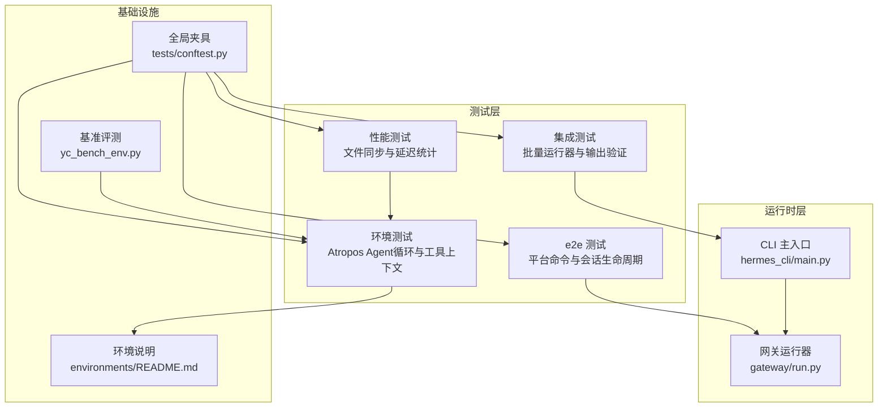
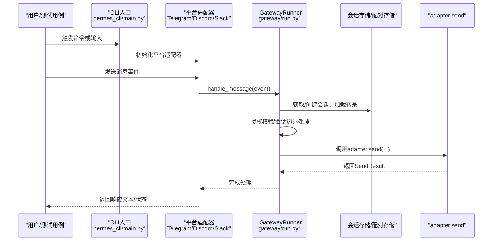
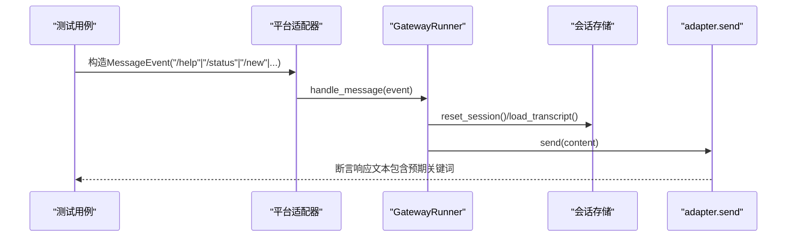
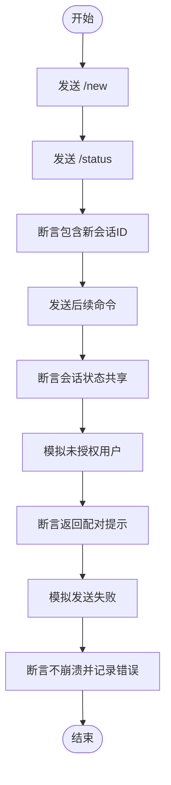
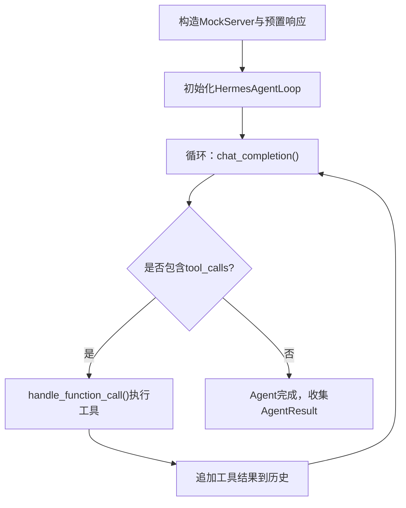
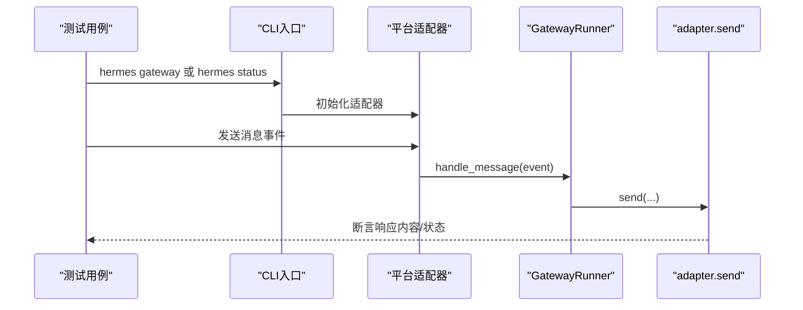
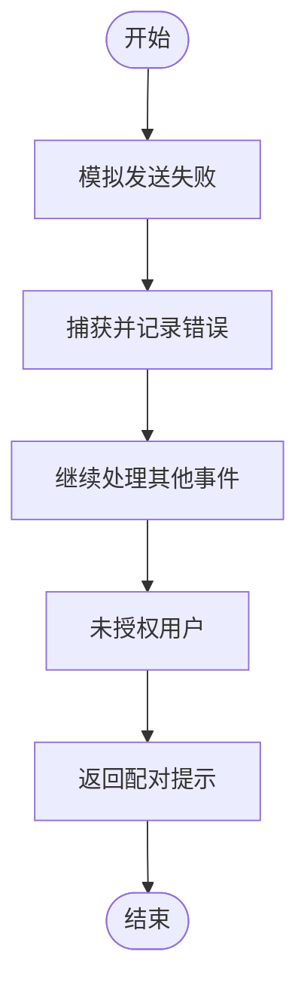
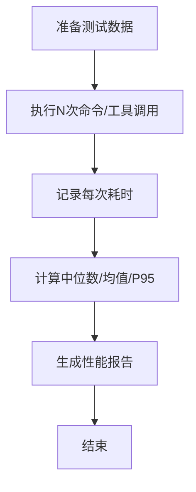
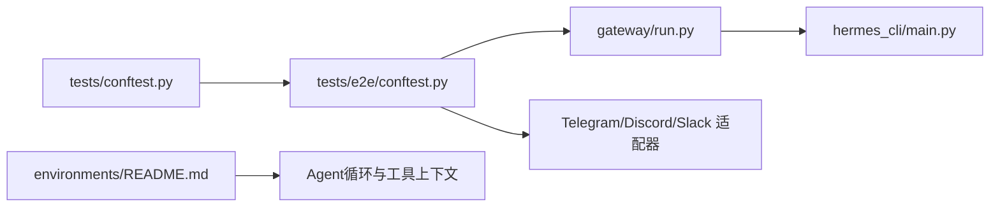

# 端到端测试

<cite>
**本文引用的文件**
- [tests/e2e/conftest.py](file://tests/e2e/conftest.py)
- [tests/e2e/test_platform_commands.py](file://tests/e2e/test_platform_commands.py)
- [tests/conftest.py](file://tests/conftest.py)
- [gateway/run.py](file://gateway/run.py)
- [hermes_cli/main.py](file://hermes_cli/main.py)
- [tests/integration/test_batch_runner.py](file://tests/integration/test_batch_runner.py)
- [environments/README.md](file://environments/README.md)
- [tests/run_agent/test_agent_loop.py](file://tests/run_agent/test_agent_loop.py)
- [tests/tools/test_file_sync_perf.py](file://tests/tools/test_file_sync_perf.py)
- [environments/benchmarks/yc_bench/yc_bench_env.py](file://environments/benchmarks/yc_bench/yc_bench_env.py)
</cite>

## 目录
1. [引言](#引言)
2. [项目结构](#项目结构)
3. [核心组件](#核心组件)
4. [架构总览](#架构总览)
5. [详细组件分析](#详细组件分析)
6. [依赖分析](#依赖分析)
7. [性能考虑](#性能考虑)
8. [故障排查指南](#故障排查指南)
9. [结论](#结论)
10. [附录](#附录)

## 引言
本指南面向Hermes Agent的端到端测试设计与实践，目标是帮助测试工程师与开发者系统性地构建覆盖“从CLI输入到最终响应”的完整用户工作流测试，并扩展到对话循环、工具调用链、错误处理、性能与压力测试。文档基于仓库中现有的e2e与集成测试框架，结合Gateway运行器、CLI入口、Atropos环境与基准评测能力，给出可操作的测试策略、场景设计与落地步骤。

## 项目结构
围绕端到端测试的关键目录与文件：
- 测试夹具与平台适配器：tests/e2e/conftest.py
- 平台命令端到端测试：tests/e2e/test_platform_commands.py
- 全局测试夹具（隔离HOME、超时等）：tests/conftest.py
- 网关运行器入口：gateway/run.py
- CLI主入口：hermes_cli/main.py
- 批量运行器集成测试脚本：tests/integration/test_batch_runner.py
- Atropos环境与工具上下文说明：environments/README.md
- Agent循环与工具调用链测试：tests/run_agent/test_agent_loop.py
- 性能测试示例（文件同步）：tests/tools/test_file_sync_perf.py
- 基准评测环境（长时程评估）：environments/benchmarks/yc_bench/yc_bench_env.py

**图表来源**
- [tests/e2e/conftest.py:1-267](file://tests/e2e/conftest.py#L1-L267)
- [tests/e2e/test_platform_commands.py:1-191](file://tests/e2e/test_platform_commands.py#L1-L191)
- [tests/conftest.py:1-122](file://tests/conftest.py#L1-L122)
- [gateway/run.py:1-200](file://gateway/run.py#L1-L200)
- [hermes_cli/main.py:1-200](file://hermes_cli/main.py#L1-L200)
- [environments/README.md:1-325](file://environments/README.md#L1-L325)
- [tests/integration/test_batch_runner.py:1-133](file://tests/integration/test_batch_runner.py#L1-L133)
- [tests/tools/test_file_sync_perf.py:43-78](file://tests/tools/test_file_sync_perf.py#L43-L78)
- [environments/benchmarks/yc_bench/yc_bench_env.py:397-772](file://environments/benchmarks/yc_bench/yc_bench_env.py#L397-L772)

**章节来源**
- [tests/e2e/conftest.py:1-267](file://tests/e2e/conftest.py#L1-L267)
- [tests/e2e/test_platform_commands.py:1-191](file://tests/e2e/test_platform_commands.py#L1-L191)
- [tests/conftest.py:1-122](file://tests/conftest.py#L1-L122)
- [gateway/run.py:1-200](file://gateway/run.py#L1-L200)
- [hermes_cli/main.py:1-200](file://hermes_cli/main.py#L1-L200)
- [environments/README.md:1-325](file://environments/README.md#L1-L325)
- [tests/integration/test_batch_runner.py:1-133](file://tests/integration/test_batch_runner.py#L1-L133)
- [tests/tools/test_file_sync_perf.py:43-78](file://tests/tools/test_file_sync_perf.py#L43-L78)
- [environments/benchmarks/yc_bench/yc_bench_env.py:397-772](file://environments/benchmarks/yc_bench/yc_bench_env.py#L397-L772)

## 核心组件
- 平台适配器与消息管道：通过e2e夹具创建适配器实例，注入GatewayRunner，驱动handle_message事件，最终断言adapter.send被调用且返回内容符合预期。
- Gateway运行器：负责平台适配器生命周期、会话存储、授权校验、发送失败容错等，是端到端测试的核心控制点。
- CLI入口：提供启动网关、状态查询、配置管理等命令，便于在端到端测试中以CLI方式触发行为。
- Atropos环境与Agent循环：提供工具调用链、终端执行、文件读写、浏览器交互等能力，支持复杂对话与工具调用的端到端验证。
- 集成测试与性能测试：批量运行器测试与文件同步性能测试分别覆盖大规模任务与单功能延迟指标。

**章节来源**
- [tests/e2e/conftest.py:124-267](file://tests/e2e/conftest.py#L124-L267)
- [tests/e2e/test_platform_commands.py:22-191](file://tests/e2e/test_platform_commands.py#L22-L191)
- [gateway/run.py:1-200](file://gateway/run.py#L1-L200)
- [hermes_cli/main.py:1-200](file://hermes_cli/main.py#L1-L200)
- [environments/README.md:56-101](file://environments/README.md#L56-L101)
- [tests/run_agent/test_agent_loop.py:33-129](file://tests/run_agent/test_agent_loop.py#L33-L129)
- [tests/tools/test_file_sync_perf.py:43-78](file://tests/tools/test_file_sync_perf.py#L43-L78)

## 架构总览
下图展示端到端测试从CLI到平台适配器再到GatewayRunner的消息流，以及关键断言点：

**图表来源**
- [tests/e2e/conftest.py:156-231](file://tests/e2e/conftest.py#L156-L231)
- [tests/e2e/test_platform_commands.py:25-116](file://tests/e2e/test_platform_commands.py#L25-L116)
- [gateway/run.py:1-200](file://gateway/run.py#L1-L200)
- [hermes_cli/main.py:1-200](file://hermes_cli/main.py#L1-L200)

## 详细组件分析

### 平台命令端到端测试（Gateway）
该测试套件覆盖slash命令在Telegram、Discord、Slack三条平台上的全链路行为，包括帮助、状态、新建会话、停止、提供者切换、压缩上下文等命令；同时验证会话生命周期、未授权用户配对响应、发送失败容错等。

**图表来源**
- [tests/e2e/test_platform_commands.py:25-116](file://tests/e2e/test_platform_commands.py#L25-L116)
- [tests/e2e/conftest.py:234-241](file://tests/e2e/conftest.py#L234-L241)

**章节来源**
- [tests/e2e/test_platform_commands.py:22-191](file://tests/e2e/test_platform_commands.py#L22-L191)
- [tests/e2e/conftest.py:124-267](file://tests/e2e/conftest.py#L124-L267)

### 会话生命周期与授权测试
- 新建会话后状态命令应反映新会话ID
- 连续命令在同一会话内共享状态
- 未授权用户应触发配对码而非命令响应
- 发送失败不应导致管道崩溃

**图表来源**
- [tests/e2e/test_platform_commands.py:121-191](file://tests/e2e/test_platform_commands.py#L121-L191)
- [tests/e2e/conftest.py:192-203](file://tests/e2e/conftest.py#L192-L203)

**章节来源**
- [tests/e2e/test_platform_commands.py:118-191](file://tests/e2e/test_platform_commands.py#L118-L191)

### 对话循环与工具调用链测试（Atropos环境）
Atropos环境提供HermesAgentLoop，支持多轮对话与工具调用链，测试通过Mock服务器与工具定义，验证推理字段提取、工具调用序列、终止条件等。

**图表来源**
- [tests/run_agent/test_agent_loop.py:73-129](file://tests/run_agent/test_agent_loop.py#L73-L129)
- [environments/README.md:58-69](file://environments/README.md#L58-L69)

**章节来源**
- [tests/run_agent/test_agent_loop.py:180-200](file://tests/run_agent/test_agent_loop.py#L180-L200)
- [environments/README.md:56-101](file://environments/README.md#L56-L101)

### CLI到最终响应的完整工作流测试
- 使用CLI入口启动网关或执行命令
- 通过适配器注入GatewayRunner，模拟真实平台消息
- 断言adapter.send返回的SendResult与响应文本
- 验证会话边界、授权、配对逻辑

**图表来源**
- [hermes_cli/main.py:1-200](file://hermes_cli/main.py#L1-L200)
- [tests/e2e/conftest.py:206-231](file://tests/e2e/conftest.py#L206-L231)

**章节来源**
- [hermes_cli/main.py:1-200](file://hermes_cli/main.py#L1-L200)
- [tests/e2e/conftest.py:156-231](file://tests/e2e/conftest.py#L156-L231)

### 错误处理测试
- 发送失败：adapter.send返回失败时，管道内部应捕获并避免崩溃
- 未授权用户：触发配对响应，不返回命令输出
- 会话边界：/new重复调用幂等，不会抛出异常

**图表来源**
- [tests/e2e/test_platform_commands.py:177-191](file://tests/e2e/test_platform_commands.py#L177-L191)
- [tests/e2e/test_platform_commands.py:141-174](file://tests/e2e/test_platform_commands.py#L141-L174)

**章节来源**
- [tests/e2e/test_platform_commands.py:141-191](file://tests/e2e/test_platform_commands.py#L141-L191)

### 测试环境模拟与测试数据准备
- 全局夹具确保HERMES_HOME隔离、删除外部API密钥环境变量、设置统一超时
- e2e夹具模拟第三方平台库（Telegram/Discord/Slack），保证导入与运行
- Atropos环境提供工具上下文（终端、文件、网络、浏览器），用于复杂场景验证

**章节来源**
- [tests/conftest.py:19-122](file://tests/conftest.py#L19-L122)
- [tests/e2e/conftest.py:26-122](file://tests/e2e/conftest.py#L26-L122)
- [environments/README.md:71-101](file://environments/README.md#L71-L101)

### 性能测试与压力测试
- 文件同步性能：通过多次执行命令测量中位数、均值、P95延迟，评估本地/容器后端开销
- 批量运行器：创建小样本数据集，验证输出目录、检查点、统计文件存在性与基本统计
- 基准评测：使用yc-bench等长时程评估，关注生存率、复合得分、评估耗时等指标

**图表来源**
- [tests/tools/test_file_sync_perf.py:43-78](file://tests/tools/test_file_sync_perf.py#L43-L78)
- [tests/integration/test_batch_runner.py:17-91](file://tests/integration/test_batch_runner.py#L17-L91)
- [environments/benchmarks/yc_bench/yc_bench_env.py:738-772](file://environments/benchmarks/yc_bench/yc_bench_env.py#L738-L772)

**章节来源**
- [tests/tools/test_file_sync_perf.py:43-78](file://tests/tools/test_file_sync_perf.py#L43-L78)
- [tests/integration/test_batch_runner.py:1-133](file://tests/integration/test_batch_runner.py#L1-L133)
- [environments/benchmarks/yc_bench/yc_bench_env.py:397-772](file://environments/benchmarks/yc_bench/yc_bench_env.py#L397-L772)

## 依赖分析
- 测试隔离与超时：全局夹具统一设置HERMES_HOME、清理环境变量、SIGALRM强制超时
- 平台适配器注入：e2e夹具为不同平台创建适配器并绑定GatewayRunner的消息处理器
- 网关运行器职责：会话管理、授权、发送失败容错、钩子与配对逻辑
- Atropos环境：提供Agent循环与工具上下文，支撑复杂工具调用链测试

**图表来源**
- [tests/conftest.py:19-122](file://tests/conftest.py#L19-L122)
- [tests/e2e/conftest.py:156-231](file://tests/e2e/conftest.py#L156-L231)
- [gateway/run.py:1-200](file://gateway/run.py#L1-L200)
- [hermes_cli/main.py:1-200](file://hermes_cli/main.py#L1-L200)
- [environments/README.md:56-101](file://environments/README.md#L56-L101)

**章节来源**
- [tests/conftest.py:19-122](file://tests/conftest.py#L19-L122)
- [tests/e2e/conftest.py:156-231](file://tests/e2e/conftest.py#L156-L231)
- [gateway/run.py:1-200](file://gateway/run.py#L1-L200)
- [hermes_cli/main.py:1-200](file://hermes_cli/main.py#L1-L200)
- [environments/README.md:56-101](file://environments/README.md#L56-L101)

## 性能考虑
- 单次调用延迟：通过多次执行同一命令测量中位数、均值、P95，识别异常波动
- 批量运行器：验证输出目录结构与统计文件完整性，避免大批次中的数据丢失
- 基准评测：关注长期运行下的生存率与平均复合得分，评估系统鲁棒性

[本节为通用指导，无需特定文件来源]

## 故障排查指南
- 发送失败不崩溃：确认adapter.send返回SendResult(success=False)时，上游未抛出异常
- 未授权用户：检查授权判定逻辑，确保返回配对提示而非命令输出
- 会话重置幂等：/new重复调用应不报错，会话存储reset_session调用次数正确
- CLI命令：核对hermes_cli/main.py中的命令解析与路由，确保与适配器期望一致

**章节来源**
- [tests/e2e/test_platform_commands.py:177-191](file://tests/e2e/test_platform_commands.py#L177-L191)
- [tests/e2e/test_platform_commands.py:141-174](file://tests/e2e/test_platform_commands.py#L141-L174)
- [hermes_cli/main.py:1-200](file://hermes_cli/main.py#L1-L200)

## 结论
通过e2e夹具与GatewayRunner的组合，Hermes Agent实现了从CLI输入到平台适配器再到最终响应的完整端到端验证。配合Atropos环境与基准评测，可以覆盖对话循环、工具调用链、错误处理、性能与压力等多个维度。建议在CI中分层执行：平台命令e2e、Agent循环与工具链、批量运行器与性能、基准评测，以确保质量与稳定性。

[本节为总结，无需特定文件来源]

## 附录
- 测试数据准备：批量运行器测试可自动生成JSONL数据集，完成后验证输出目录与统计文件
- 工具上下文方法：终端命令、文件读写、上传下载、网页搜索/抽取、浏览器导航/快照、通用工具调用、清理资源
- 基准评测矩阵：预设×种子组合，支持流式日志持久化与多指标汇总

**章节来源**
- [tests/integration/test_batch_runner.py:17-91](file://tests/integration/test_batch_runner.py#L17-L91)
- [environments/README.md:152-177](file://environments/README.md#L152-L177)
- [environments/benchmarks/yc_bench/yc_bench_env.py:409-427](file://environments/benchmarks/yc_bench/yc_bench_env.py#L409-L427)