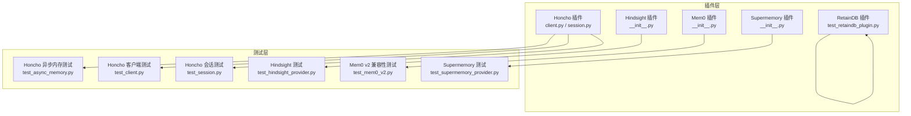
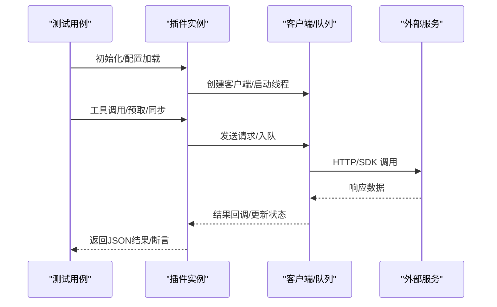
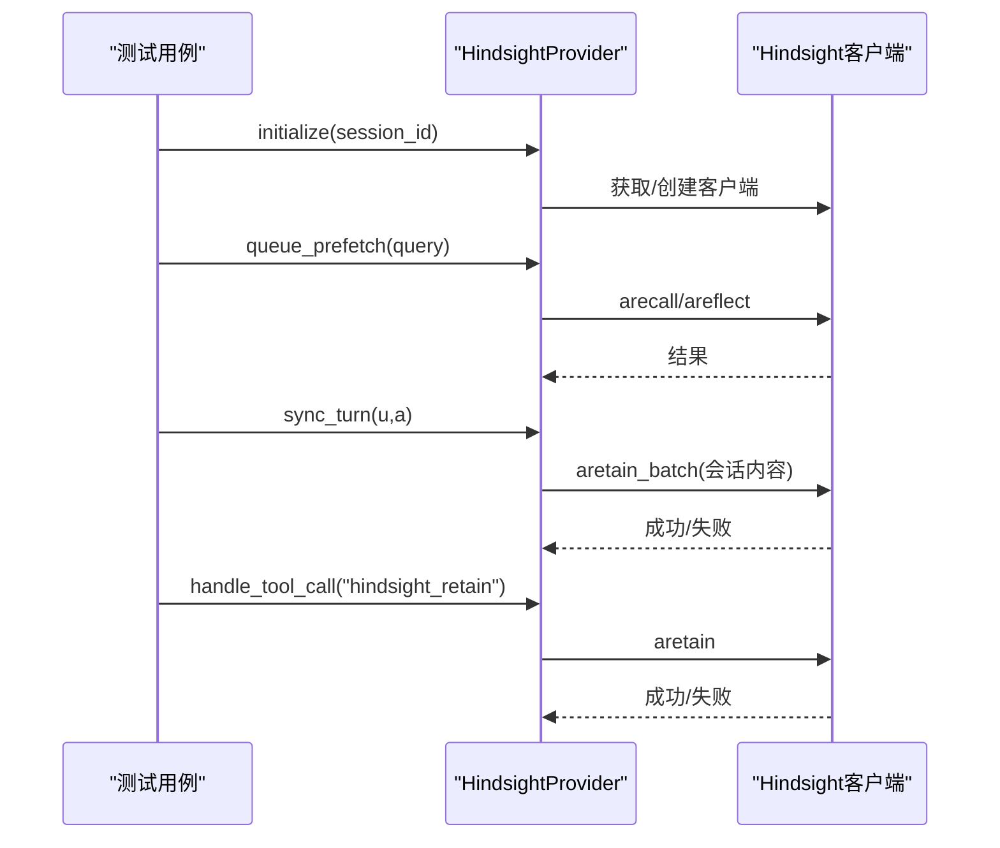
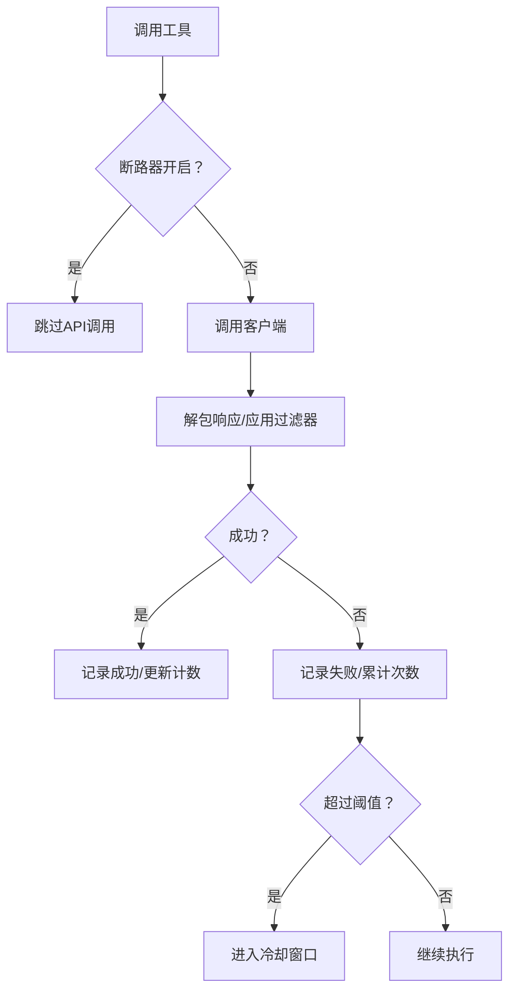
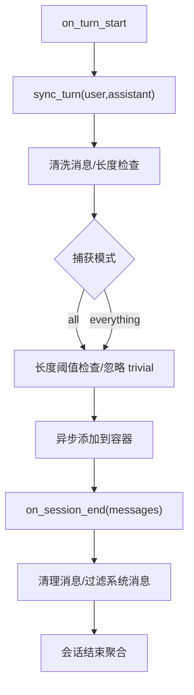
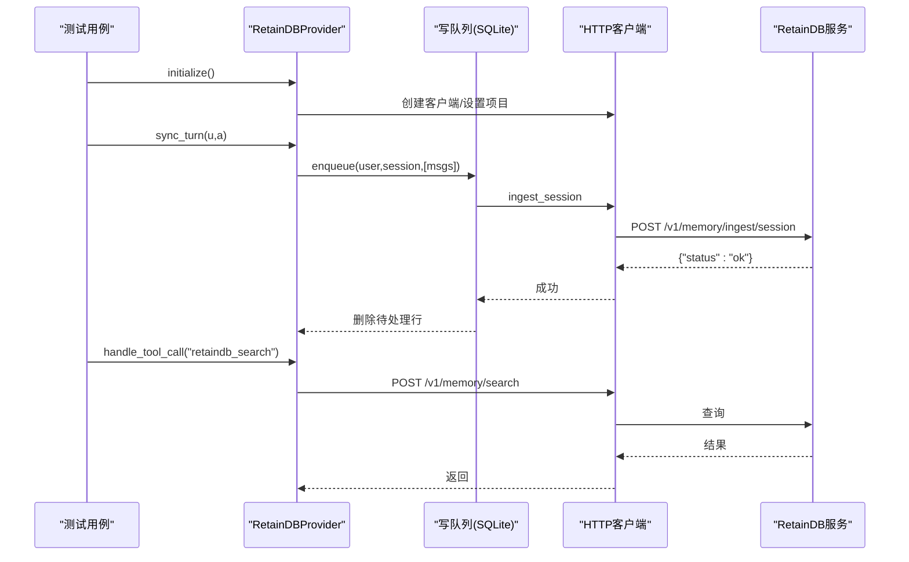
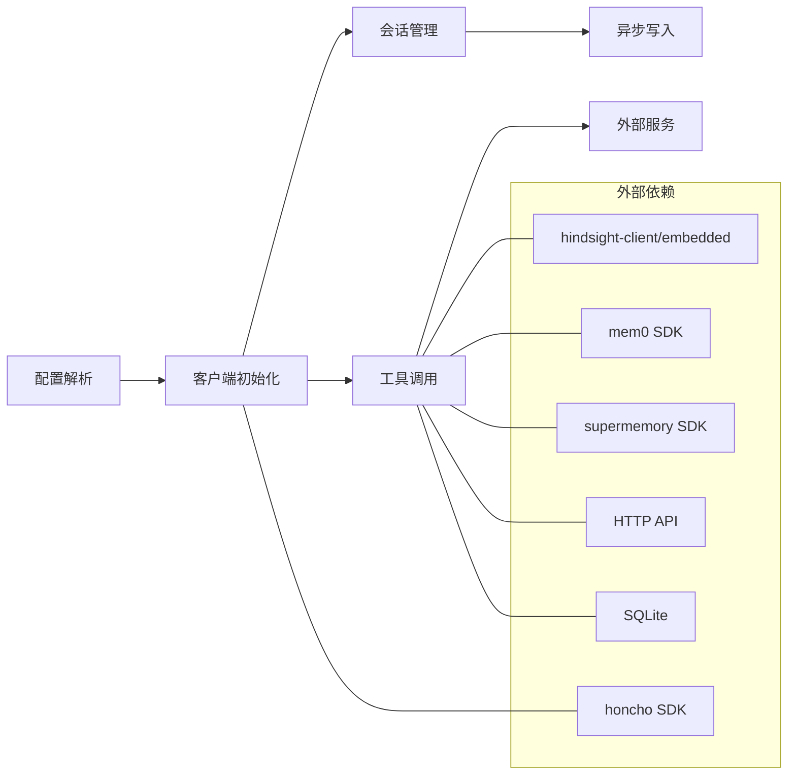

# 插件集成测试

<cite>
**本文档引用的文件**
- [tests/honcho_plugin/test_async_memory.py](file://tests/honcho_plugin/test_async_memory.py)
- [tests/honcho_plugin/test_client.py](file://tests/honcho_plugin/test_client.py)
- [tests/honcho_plugin/test_session.py](file://tests/honcho_plugin/test_session.py)
- [tests/plugins/memory/test_hindsight_provider.py](file://tests/plugins/memory/test_hindsight_provider.py)
- [tests/plugins/memory/test_mem0_v2.py](file://tests/plugins/memory/test_mem0_v2.py)
- [tests/plugins/memory/test_supermemory_provider.py](file://tests/plugins/memory/test_supermemory_provider.py)
- [tests/plugins/test_retaindb_plugin.py](file://tests/plugins/test_retaindb_plugin.py)
- [plugins/memory/honcho/client.py](file://plugins/memory/honcho/client.py)
- [plugins/memory/honcho/session.py](file://plugins/memory/honcho/session.py)
- [plugins/memory/hindsight/__init__.py](file://plugins/memory/hindsight/__init__.py)
- [plugins/memory/mem0/__init__.py](file://plugins/memory/mem0/__init__.py)
- [plugins/memory/supermemory/__init__.py](file://plugins/memory/supermemory/__init__.py)
</cite>

## 目录
1. [引言](#引言)
2. [项目结构](#项目结构)
3. [核心组件](#核心组件)
4. [架构概览](#架构概览)
5. [详细组件分析](#详细组件分析)
6. [依赖分析](#依赖分析)
7. [性能考虑](#性能考虑)
8. [故障排查指南](#故障排查指南)
9. [结论](#结论)

## 引言
本文件面向Hermes Agent插件系统的集成测试，聚焦以下目标：
- 记忆插件（Hindsight、Mem0、Supermemory）与上下文引擎插件（Honcho）的集成测试策略
- Honcho插件的异步内存写入、客户端配置与会话管理测试
- 记忆提供程序插件的生命周期、通信与配置测试
- 插件间通信、兼容性、性能与故障恢复的最佳实践

## 项目结构
插件系统位于plugins目录，测试位于tests目录，按功能模块组织：
- Honcho插件：客户端配置、会话管理、异步写入
- 记忆插件：Hindsight、Mem0、Supermemory
- RetainDB插件：本地SQLite队列与HTTP客户端



图表来源
- [tests/honcho_plugin/test_async_memory.py:1-470](file://tests/honcho_plugin/test_async_memory.py#L1-L470)
- [tests/honcho_plugin/test_client.py:1-552](file://tests/honcho_plugin/test_client.py#L1-L552)
- [tests/honcho_plugin/test_session.py:1-455](file://tests/honcho_plugin/test_session.py#L1-L455)
- [tests/plugins/memory/test_hindsight_provider.py:1-599](file://tests/plugins/memory/test_hindsight_provider.py#L1-L599)
- [tests/plugins/memory/test_mem0_v2.py:1-228](file://tests/plugins/memory/test_mem0_v2.py#L1-L228)
- [tests/plugins/memory/test_supermemory_provider.py:1-412](file://tests/plugins/memory/test_supermemory_provider.py#L1-L412)
- [tests/plugins/test_retaindb_plugin.py:1-777](file://tests/plugins/test_retaindb_plugin.py#L1-L777)

章节来源
- [tests/honcho_plugin/test_async_memory.py:1-470](file://tests/honcho_plugin/test_async_memory.py#L1-L470)
- [tests/honcho_plugin/test_client.py:1-552](file://tests/honcho_plugin/test_client.py#L1-L552)
- [tests/honcho_plugin/test_session.py:1-455](file://tests/honcho_plugin/test_session.py#L1-L455)
- [tests/plugins/memory/test_hindsight_provider.py:1-599](file://tests/plugins/memory/test_hindsight_provider.py#L1-L599)
- [tests/plugins/memory/test_mem0_v2.py:1-228](file://tests/plugins/memory/test_mem0_v2.py#L1-L228)
- [tests/plugins/memory/test_supermemory_provider.py:1-412](file://tests/plugins/memory/test_supermemory_provider.py#L1-L412)
- [tests/plugins/test_retaindb_plugin.py:1-777](file://tests/plugins/test_retaindb_plugin.py#L1-L777)

## 核心组件
- Honcho客户端与会话管理：负责配置解析、会话缓存、异步写入与观察模式
- Hindsight：云/本地模式的记忆保留、检索与反思工具
- Mem0：基于平台API的事实提取与语义搜索
- Supermemory：容器化长期记忆、显式存储与会话结束聚合
- RetainDB：SQLite写队列与HTTP客户端，支持回放与错误记录

章节来源
- [plugins/memory/honcho/client.py:1-566](file://plugins/memory/honcho/client.py#L1-L566)
- [plugins/memory/honcho/session.py:1-800](file://plugins/memory/honcho/session.py#L1-L800)
- [plugins/memory/hindsight/__init__.py:1-800](file://plugins/memory/hindsight/__init__.py#L1-L800)
- [plugins/memory/mem0/__init__.py:1-374](file://plugins/memory/mem0/__init__.py#L1-L374)
- [plugins/memory/supermemory/__init__.py:1-792](file://plugins/memory/supermemory/__init__.py#L1-L792)

## 架构概览
下图展示插件集成测试的关键交互路径：测试用例驱动插件初始化、配置加载、工具调用与后台线程处理。



图表来源
- [tests/honcho_plugin/test_async_memory.py:277-377](file://tests/honcho_plugin/test_async_memory.py#L277-L377)
- [tests/plugins/memory/test_hindsight_provider.py:213-313](file://tests/plugins/memory/test_hindsight_provider.py#L213-L313)
- [tests/plugins/memory/test_mem0_v2.py:39-120](file://tests/plugins/memory/test_mem0_v2.py#L39-L120)
- [tests/plugins/memory/test_supermemory_provider.py:112-177](file://tests/plugins/memory/test_supermemory_provider.py#L112-L177)
- [tests/plugins/test_retaindb_plugin.py:54-176](file://tests/plugins/test_retaindb_plugin.py#L54-L176)

## 详细组件分析

### Honcho插件集成测试
- 写频率解析与路由：测试字符串/整数/主机块覆盖优先级；turn/session/async模式的行为差异
- 会话命名解析：标题、工作区、peer前缀与策略（per-directory/per-repo/per-session/global）
- 异步写入：后台线程生命周期、重试机制、队列排空与关闭
- 客户端配置：环境变量、全局配置、主机块合并、默认值与向后兼容
- 观察模式与对话语义：用户/AI peer观察开关、动态推理级别、输入长度限制
- 会话管理：缓存、迁移历史、上下文预取、对话语义查询

```mermaid
flowchart TD
Start(["开始：保存会话"]) --> WF{"写频率模式？"}
WF --> |async| Enqueue["入队到异步队列"]
WF --> |turn| FlushNow["立即刷新"]
WF --> |session| Defer["延迟到结束"]
WF --> |N(整数)| CheckTurn{"轮次计数 % N == 0 ?"}
CheckTurn --> |是| FlushNow
CheckTurn --> |否| Defer
Enqueue --> AsyncLoop["异步写入循环<br/>重试一次后丢弃"]
FlushNow --> Done(["完成"])
Defer --> FlushAll["会话结束时刷新所有缓存"]
FlushAll --> Done
AsyncLoop --> Done
```

图表来源
- [tests/honcho_plugin/test_async_memory.py:183-234](file://tests/honcho_plugin/test_async_memory.py#L183-L234)
- [tests/honcho_plugin/test_async_memory.py:277-377](file://tests/honcho_plugin/test_async_memory.py#L277-L377)
- [tests/honcho_plugin/test_session.py:400-445](file://tests/honcho_plugin/test_session.py#L400-L445)

章节来源
- [tests/honcho_plugin/test_async_memory.py:58-104](file://tests/honcho_plugin/test_async_memory.py#L58-L104)
- [tests/honcho_plugin/test_async_memory.py:110-177](file://tests/honcho_plugin/test_async_memory.py#L110-L177)
- [tests/honcho_plugin/test_async_memory.py:277-377](file://tests/honcho_plugin/test_async_memory.py#L277-L377)
- [tests/honcho_plugin/test_client.py:21-55](file://tests/honcho_plugin/test_client.py#L21-L55)
- [tests/honcho_plugin/test_client.py:80-196](file://tests/honcho_plugin/test_client.py#L80-L196)
- [tests/honcho_plugin/test_client.py:236-438](file://tests/honcho_plugin/test_client.py#L236-L438)
- [tests/honcho_plugin/test_session.py:19-98](file://tests/honcho_plugin/test_session.py#L19-L98)
- [tests/honcho_plugin/test_session.py:283-367](file://tests/honcho_plugin/test_session.py#L283-L367)

### 记忆提供程序插件测试

#### Hindsight
- 配置加载：环境变量回退、银行ID/预算、模式切换（cloud/local）
- 工具接口：retain/recall/reflect参数校验与错误处理
- 预取与批处理：自动召回/反思、最大输入长度截断、批量保留
- 系统提示：不同模式下的注入策略
- 可用性检测：本地/云模式可用性判断



图表来源
- [tests/plugins/memory/test_hindsight_provider.py:148-190](file://tests/plugins/memory/test_hindsight_provider.py#L148-L190)
- [tests/plugins/memory/test_hindsight_provider.py:213-313](file://tests/plugins/memory/test_hindsight_provider.py#L213-L313)
- [tests/plugins/memory/test_hindsight_provider.py:319-384](file://tests/plugins/memory/test_hindsight_provider.py#L319-L384)
- [tests/plugins/memory/test_hindsight_provider.py:411-518](file://tests/plugins/memory/test_hindsight_provider.py#L411-L518)

章节来源
- [tests/plugins/memory/test_hindsight_provider.py:148-190](file://tests/plugins/memory/test_hindsight_provider.py#L148-L190)
- [tests/plugins/memory/test_hindsight_provider.py:213-313](file://tests/plugins/memory/test_hindsight_provider.py#L213-L313)
- [tests/plugins/memory/test_hindsight_provider.py:319-384](file://tests/plugins/memory/test_hindsight_provider.py#L319-L384)
- [tests/plugins/memory/test_hindsight_provider.py:411-518](file://tests/plugins/memory/test_hindsight_provider.py#L411-L518)

#### Mem0
- 过滤器迁移：从user_id参数迁移到filters字典，写入包含agent_id
- 响应解包：API v2返回{"results": [...]}/列表兼容
- 默认值：未设置时使用hermes-user/hermes
- 线路保护：连续失败触发断路器冷却



图表来源
- [tests/plugins/memory/test_mem0_v2.py:39-120](file://tests/plugins/memory/test_mem0_v2.py#L39-L120)
- [tests/plugins/memory/test_mem0_v2.py:127-185](file://tests/plugins/memory/test_mem0_v2.py#L127-L185)
- [tests/plugins/memory/test_mem0_v2.py:206-228](file://tests/plugins/memory/test_mem0_v2.py#L206-L228)
- [plugins/memory/mem0/__init__.py:180-202](file://plugins/memory/mem0/__init__.py#L180-L202)

章节来源
- [tests/plugins/memory/test_mem0_v2.py:39-120](file://tests/plugins/memory/test_mem0_v2.py#L39-L120)
- [tests/plugins/memory/test_mem0_v2.py:127-185](file://tests/plugins/memory/test_mem0_v2.py#L127-L185)
- [tests/plugins/memory/test_mem0_v2.py:206-228](file://tests/plugins/memory/test_mem0_v2.py#L206-L228)
- [plugins/memory/mem0/__init__.py:180-202](file://plugins/memory/mem0/__init__.py#L180-L202)

#### Supermemory
- 容器标签：支持模板变量{identity}与白名单容器
- 预取格式化：去重、相对时间、相似度标注
- 清洗规则：去除上下文标记与容器声明
- 多模式捕获：仅重要对话或全部对话
- 工具参数校验：container_tag白名单检查



图表来源
- [tests/plugins/memory/test_supermemory_provider.py:112-177](file://tests/plugins/memory/test_supermemory_provider.py#L112-L177)
- [tests/plugins/memory/test_supermemory_provider.py:142-170](file://tests/plugins/memory/test_supermemory_provider.py#L142-L170)
- [tests/plugins/memory/test_supermemory_provider.py:595-616](file://tests/plugins/memory/test_supermemory_provider.py#L595-L616)
- [plugins/memory/supermemory/__init__.py:253-261](file://plugins/memory/supermemory/__init__.py#L253-L261)
- [plugins/memory/supermemory/__init__.py:527-594](file://plugins/memory/supermemory/__init__.py#L527-L594)

章节来源
- [tests/plugins/memory/test_supermemory_provider.py:266-321](file://tests/plugins/memory/test_supermemory_provider.py#L266-L321)
- [tests/plugins/memory/test_supermemory_provider.py:323-386](file://tests/plugins/memory/test_supermemory_provider.py#L323-L386)
- [tests/plugins/memory/test_supermemory_provider.py:388-412](file://tests/plugins/memory/test_supermemory_provider.py#L388-L412)
- [plugins/memory/supermemory/__init__.py:253-261](file://plugins/memory/supermemory/__init__.py#L253-L261)
- [plugins/memory/supermemory/__init__.py:527-594](file://plugins/memory/supermemory/__init__.py#L527-L594)

#### RetainDB
- HTTP客户端：认证头、API键透传、路径参数构建
- 写队列：SQLite持久化、后台写线程、失败重试与错误记录
- 覆盖层格式化：去重、截断、本地条目过滤
- 工具分发：profile/search/context/remember/forget/文件操作
- 生命周期：初始化、系统提示、线程管理、镜像写入钩子



图表来源
- [tests/plugins/test_retaindb_plugin.py:54-176](file://tests/plugins/test_retaindb_plugin.py#L54-L176)
- [tests/plugins/test_retaindb_plugin.py:182-272](file://tests/plugins/test_retaindb_plugin.py#L182-L272)
- [tests/plugins/test_retaindb_plugin.py:278-331](file://tests/plugins/test_retaindb_plugin.py#L278-L331)
- [tests/plugins/test_retaindb_plugin.py:416-431](file://tests/plugins/test_retaindb_plugin.py#L416-L431)
- [tests/plugins/test_retaindb_plugin.py:673-693](file://tests/plugins/test_retaindb_plugin.py#L673-L693)

章节来源
- [tests/plugins/test_retaindb_plugin.py:54-176](file://tests/plugins/test_retaindb_plugin.py#L54-L176)
- [tests/plugins/test_retaindb_plugin.py:182-272](file://tests/plugins/test_retaindb_plugin.py#L182-L272)
- [tests/plugins/test_retaindb_plugin.py:278-331](file://tests/plugins/test_retaindb_plugin.py#L278-L331)
- [tests/plugins/test_retaindb_plugin.py:416-431](file://tests/plugins/test_retaindb_plugin.py#L416-L431)
- [tests/plugins/test_retaindb_plugin.py:673-693](file://tests/plugins/test_retaindb_plugin.py#L673-L693)

## 依赖分析
- 插件间耦合
  - Honcho与外部SDK：通过client.py中的单例客户端初始化，避免重复导入
  - 记忆插件与外部API：Hindsight/Mem0/Supermemory分别依赖对应SDK/HTTP接口
  - RetainDB：依赖SQLite与HTTP客户端，具备崩溃恢复与重放能力
- 关键依赖链
  - Honcho：配置解析 → 客户端初始化 → 会话获取/创建 → 异步写入
  - Hindsight：事件循环共享 → 客户端版本检查 → 批量保留/召回
  - Mem0：断路器 → 客户端锁 → 过滤器/响应解包
  - Supermemory：容器标签解析 → 预取格式化 → 清洗/捕获 → 工具调用
  - RetainDB：HTTP客户端 → 写队列 → 线程安全连接复用



图表来源
- [plugins/memory/honcho/client.py:481-565](file://plugins/memory/honcho/client.py#L481-L565)
- [plugins/memory/hindsight/__init__.py:63-84](file://plugins/memory/hindsight/__init__.py#L63-L84)
- [plugins/memory/mem0/__init__.py:168-178](file://plugins/memory/mem0/__init__.py#L168-L178)
- [plugins/memory/supermemory/__init__.py:263-272](file://plugins/memory/supermemory/__init__.py#L263-L272)
- [tests/plugins/test_retaindb_plugin.py:54-176](file://tests/plugins/test_retaindb_plugin.py#L54-L176)

章节来源
- [plugins/memory/honcho/client.py:481-565](file://plugins/memory/honcho/client.py#L481-L565)
- [plugins/memory/hindsight/__init__.py:63-84](file://plugins/memory/hindsight/__init__.py#L63-L84)
- [plugins/memory/mem0/__init__.py:168-178](file://plugins/memory/mem0/__init__.py#L168-L178)
- [plugins/memory/supermemory/__init__.py:263-272](file://plugins/memory/supermemory/__init__.py#L263-L272)
- [tests/plugins/test_retaindb_plugin.py:54-176](file://tests/plugins/test_retaindb_plugin.py#L54-L176)

## 性能考虑
- 异步写入与批处理
  - Honcho async模式降低阻塞，turn/session/N模式控制刷新时机
  - Hindsight批量保留减少网络往返，工具调用截断查询长度
  - Mem0/RetainDB后台线程与队列避免主线程阻塞
- 资源复用
  - Hindsight共享事件循环与线程，避免频繁创建
  - RetainDB线程本地连接复用，减少数据库开销
- 限流与降级
  - Mem0断路器在连续失败时冷却，避免雪崩
  - Supermemory容器化与去重减少冗余存储

## 故障排查指南
- Honcho
  - 异步写入失败：检查重试逻辑与线程存活，确认队列是否被正确排空
  - 配置冲突：核对主机块字段覆盖顺序与默认值
- Hindsight
  - 工具调用报错：检查必填参数、预算与标签匹配模式
  - 客户端版本：确保满足最低版本要求，必要时自动升级
- Mem0
  - 断路器触发：等待冷却时间或修复API密钥/网络问题
  - 过滤器不生效：确认filters迁移与写入过滤器包含agent_id
- Supermemory
  - 容器标签非法：检查白名单与模板变量解析
  - 预取为空：确认预取频率与profile频率设置
- RetainDB
  - 写队列堆积：检查写线程是否存活，数据库连接是否复用
  - 回放失败：验证崩溃恢复逻辑与错误记录

章节来源
- [tests/honcho_plugin/test_async_memory.py:329-377](file://tests/honcho_plugin/test_async_memory.py#L329-L377)
- [tests/plugins/memory/test_hindsight_provider.py:298-313](file://tests/plugins/memory/test_hindsight_provider.py#L298-L313)
- [tests/plugins/memory/test_mem0_v2.py:180-205](file://tests/plugins/memory/test_mem0_v2.py#L180-L205)
- [tests/plugins/memory/test_supermemory_provider.py:370-386](file://tests/plugins/memory/test_supermemory_provider.py#L370-L386)
- [tests/plugins/test_retaindb_plugin.py:227-241](file://tests/plugins/test_retaindb_plugin.py#L227-L241)

## 结论
本集成测试文档梳理了Honcho与三大记忆插件的测试策略与最佳实践，覆盖配置解析、生命周期、异步写入、工具调用与故障恢复。建议在CI中针对各插件的关键路径进行回归测试，并结合性能监控与断路器策略保障稳定性。