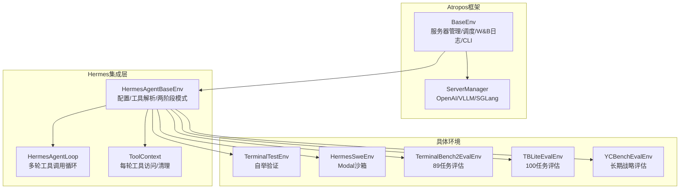
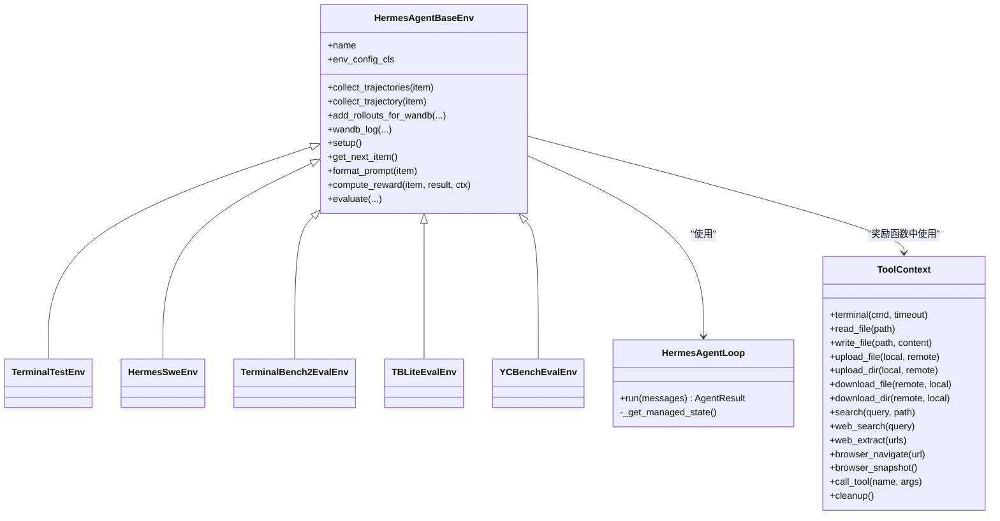
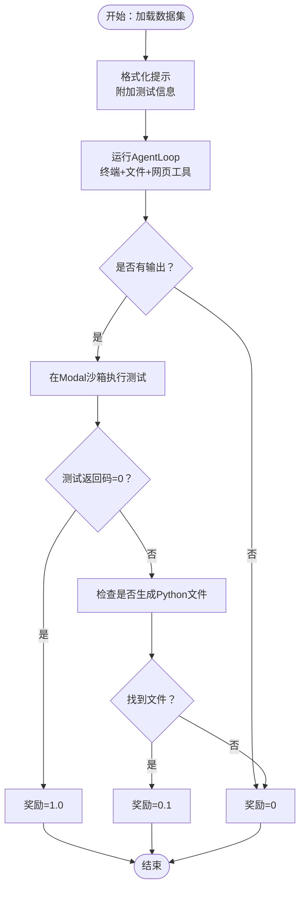
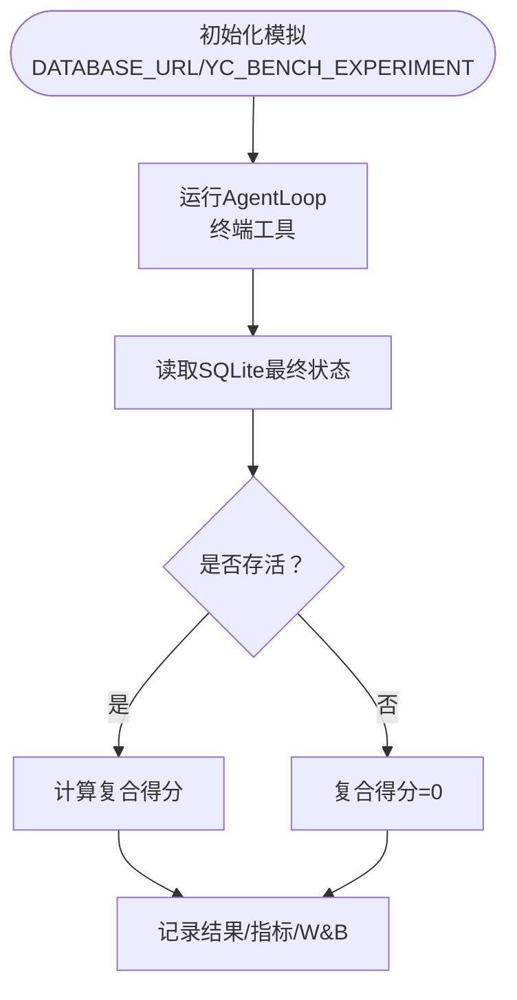
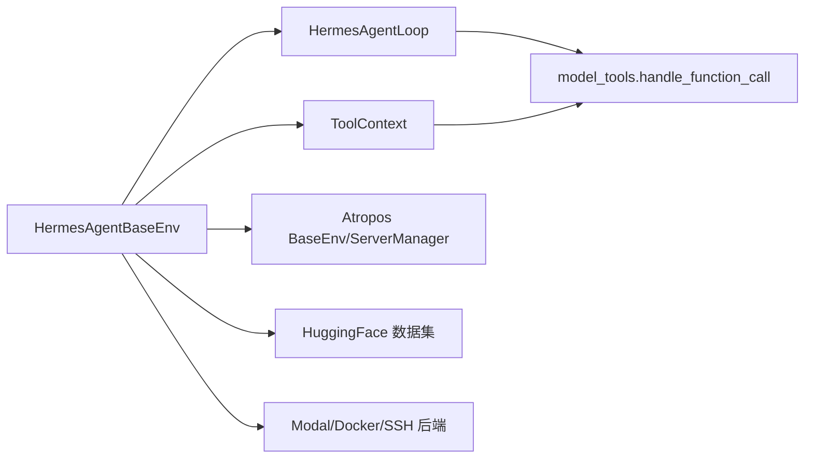

# 环境集成测试

<cite>
**本文档引用的文件**
- [README.md](file://README.md)
- [environments/README.md](file://environments/README.md)
- [environments/hermes_base_env.py](file://environments/hermes_base_env.py)
- [environments/agent_loop.py](file://environments/agent_loop.py)
- [environments/tool_context.py](file://environments/tool_context.py)
- [environments/terminal_test_env/terminal_test_env.py](file://environments/terminal_test_env/terminal_test_env.py)
- [environments/hermes_swe_env/hermes_swe_env.py](file://environments/hermes_swe_env/hermes_swe_env.py)
- [environments/benchmarks/terminalbench_2/terminalbench2_env.py](file://environments/benchmarks/terminalbench_2/terminalbench2_env.py)
- [environments/benchmarks/tblite/tblite_env.py](file://environments/benchmarks/tblite/tblite_env.py)
- [environments/benchmarks/yc_bench/yc_bench_env.py](file://environments/benchmarks/yc_bench/yc_bench_env.py)
</cite>

## 目录
1. [简介](#简介)
2. [项目结构](#项目结构)
3. [核心组件](#核心组件)
4. [架构总览](#架构总览)
5. [详细组件分析](#详细组件分析)
6. [依赖关系分析](#依赖关系分析)
7. [性能考虑](#性能考虑)
8. [故障排除指南](#故障排除指南)
9. [结论](#结论)

## 简介
本文件面向Hermes Agent环境系统的集成测试，系统性阐述在不同执行环境（本地、Docker、SSH、Modal等）下的集成测试策略；覆盖RL训练环境的集成测试方法（Atropos环境与AgentLoop测试场景）；提供基准测试环境的测试流程（TerminalBench2与YCBench的性能测试）；并给出容器化环境的集成测试策略（Docker容器测试与Modal云环境测试），以及环境隔离测试、资源管理测试和性能基准测试的实现方法。

## 项目结构
Hermes Agent通过Atropos框架提供统一的RL训练与评估接口，环境层负责工具集解析、终端后端选择、沙箱隔离与奖励计算。核心目录与文件如下：
- environments/README.md：Atropos环境集成概览与架构说明
- environments/hermes_base_env.py：HermesAgentBaseEnv抽象基类，定义配置、工具解析、两阶段运行模式（Phase 1/2）、轨迹收集与奖励计算
- environments/agent_loop.py：可复用的多轮Agent引擎，封装工具调用循环与线程池执行
- environments/tool_context.py：每轮回滚的工具上下文，提供终端、文件、浏览器、通用工具调用与清理
- environments/terminal_test_env/terminal_test_env.py：自举验证环境（无外部数据集）
- environments/hermes_swe_env/hermes_swe_env.py：软件工程任务环境（Modal沙箱）
- environments/benchmarks/terminalbench_2/terminalbench2_env.py：TerminalBench2评估环境（89个挑战性任务）
- environments/benchmarks/tblite/tblite_env.py：TBLite轻量级替代（100个校准任务）
- environments/benchmarks/yc_bench/yc_bench_env.py：YC-Bench长期战略基准（CEO模拟）



**图表来源**
- [environments/README.md:1-325](file://environments/README.md#L1-L325)
- [environments/hermes_base_env.py:1-715](file://environments/hermes_base_env.py#L1-L715)
- [environments/agent_loop.py:1-535](file://environments/agent_loop.py#L1-L535)
- [environments/tool_context.py:1-475](file://environments/tool_context.py#L1-L475)
- [environments/terminal_test_env/terminal_test_env.py:1-293](file://environments/terminal_test_env/terminal_test_env.py#L1-L293)
- [environments/hermes_swe_env/hermes_swe_env.py:1-230](file://environments/hermes_swe_env/hermes_swe_env.py#L1-L230)
- [environments/benchmarks/terminalbench_2/terminalbench2_env.py:1-800](file://environments/benchmarks/terminalbench_2/terminalbench2_env.py#L1-L800)
- [environments/benchmarks/tblite/tblite_env.py:1-120](file://environments/benchmarks/tblite/tblite_env.py#L1-L120)
- [environments/benchmarks/yc_bench/yc_bench_env.py:1-849](file://environments/benchmarks/yc_bench/yc_bench_env.py#L1-L849)

**章节来源**
- [README.md:1-179](file://README.md#L1-L179)
- [environments/README.md:1-325](file://environments/README.md#L1-L325)

## 核心组件
- HermesAgentBaseEnv：统一配置、工具集解析、两阶段运行模式（Phase 1：OpenAI服务器直连；Phase 2：VLLM/SGLang ManagedServer），并提供轨迹收集与奖励计算入口
- HermesAgentLoop：标准OpenAI规范的工具调用循环，支持线程池执行以避免Modal/Docker/Daytona后端的事件循环死锁
- ToolContext：每轮回滚的工具上下文，提供终端命令执行、文件读写/上传下载、网页搜索/提取、浏览器导航/快照、通用工具调用与资源清理

**章节来源**
- [environments/hermes_base_env.py:221-715](file://environments/hermes_base_env.py#L221-L715)
- [environments/agent_loop.py:119-535](file://environments/agent_loop.py#L119-L535)
- [environments/tool_context.py:67-475](file://environments/tool_context.py#L67-L475)

## 架构总览
Atropos环境集成采用“抽象基类 + 具体环境”的分层设计：
- 抽象基类提供统一的配置、工具解析、两阶段模式与奖励计算框架
- 具体环境实现数据集加载、提示格式化、奖励计算与周期性评估
- AgentLoop与ToolContext贯穿训练与评估，确保每轮回滚的沙箱隔离与资源回收



**图表来源**
- [environments/hermes_base_env.py:221-715](file://environments/hermes_base_env.py#L221-L715)
- [environments/agent_loop.py:119-535](file://environments/agent_loop.py#L119-L535)
- [environments/tool_context.py:67-475](file://environments/tool_context.py#L67-L475)
- [environments/terminal_test_env/terminal_test_env.py:91-293](file://environments/terminal_test_env/terminal_test_env.py#L91-L293)
- [environments/hermes_swe_env/hermes_swe_env.py:62-230](file://environments/hermes_swe_env/hermes_swe_env.py#L62-L230)
- [environments/benchmarks/terminalbench_2/terminalbench2_env.py:221-800](file://environments/benchmarks/terminalbench_2/terminalbench2_env.py#L221-L800)
- [environments/benchmarks/tblite/tblite_env.py:63-120](file://environments/benchmarks/tblite/tblite_env.py#L63-L120)
- [environments/benchmarks/yc_bench/yc_bench_env.py:329-849](file://environments/benchmarks/yc_bench/yc_bench_env.py#L329-L849)

## 详细组件分析

### 终端测试环境（TerminalTestEnv）
- 目标：验证全栈端到端功能，仅使用终端与文件工具集，Modal后端提供云隔离沙箱
- 测试策略：
  - 训练阶段：三道简单文件创建任务，奖励函数通过终端读取文件内容进行比对
  - 评估阶段：单个验证任务，快速完成推理路径验证
  - 配置要点：禁用消息平台工具集，启用终端/文件工具集，Modal后端，W&B记录准确率与平均奖励

```mermaid
sequenceDiagram
participant Env as "TerminalTestEnv"
participant Base as "HermesAgentBaseEnv"
participant Loop as "HermesAgentLoop"
participant TC as "ToolContext"
Env->>Base : config_init() 设置工具集/后端/模型
Env->>Base : setup() 初始化训练/评估任务列表
Base->>Base : collect_trajectories() 解析工具集
Base->>Loop : 创建Agent并运行
Loop->>Loop : 多轮对话 + 工具调用
Base->>TC : 创建ToolContext(task_id)
Base->>Env : compute_reward(item, result, ctx)
Env->>TC : terminal("cat 路径")
TC-->>Env : 返回文件内容
Env-->>Base : 返回奖励(0/0.5/1)
Base-->>Env : evaluate() 记录指标
```

**图表来源**
- [environments/terminal_test_env/terminal_test_env.py:159-293](file://environments/terminal_test_env/terminal_test_env.py#L159-L293)
- [environments/hermes_base_env.py:350-715](file://environments/hermes_base_env.py#L350-L715)
- [environments/agent_loop.py:175-535](file://environments/agent_loop.py#L175-L535)
- [environments/tool_context.py:83-108](file://environments/tool_context.py#L83-L108)

**章节来源**
- [environments/terminal_test_env/terminal_test_env.py:1-293](file://environments/terminal_test_env/terminal_test_env.py#L1-L293)

### 软件工程环境（HermesSweEnv）
- 目标：在Modal沙箱中完成代码编写并通过测试验证，奖励函数在相同沙箱内执行测试
- 测试策略：
  - 使用HuggingFace数据集（如HumanEvalPack），格式化提示并附加测试信息
  - 奖励逻辑：若测试返回码为0则高奖励，否则检查是否生成Python文件给予部分奖励
  - 指标：平均奖励与通过率，W&B可视化



**图表来源**
- [environments/hermes_swe_env/hermes_swe_env.py:124-230](file://environments/hermes_swe_env/hermes_swe_env.py#L124-L230)
- [environments/hermes_base_env.py:489-715](file://environments/hermes_base_env.py#L489-L715)
- [environments/tool_context.py:170-205](file://environments/tool_context.py#L170-L205)

**章节来源**
- [environments/hermes_swe_env/hermes_swe_env.py:1-230](file://environments/hermes_swe_env/hermes_swe_env.py#L1-L230)

### TerminalBench2评估环境（TerminalBench2EvalEnv）
- 目标：在89个挑战性任务上评估代理的终端操作能力，每个任务提供预构建镜像或Dockerfile，测试套件验证结果
- 测试策略：
  - 评估模式：STOP_TRAIN，steps_per_eval=1，total_steps=1，每任务昂贵且独立
  - 并发控制：通过信号量限制同时创建的沙箱数量，避免线程池死锁
  - 验证流程：上传测试套件至沙箱，执行test.sh，下载/logs/verifier/reward.txt读取奖励
  - 指标：每任务、每类别与总体通过率，W&B记录

```mermaid
sequenceDiagram
participant Env as "TerminalBench2EvalEnv"
participant TB2 as "Dataset(89任务)"
participant Loop as "HermesAgentLoop"
participant TC as "ToolContext"
participant Modal as "Modal沙箱"
Env->>TB2 : 加载数据集并应用过滤/跳过
loop 遍历每个任务
Env->>Env : _resolve_task_image() 解析镜像
Env->>Modal : register_task_env_overrides(task_id, image)
Env->>Loop : 运行AgentLoop(终端+文件工具)
Env->>TC : 创建ToolContext(task_id)
Env->>TC : upload_dir(/tests)/write_file(test.sh)
Env->>TC : terminal("bash /tests/test.sh")
TC-->>Env : 返回退出码/输出
Env->>TC : download_dir(/logs/verifier)
Env->>Env : 解析reward.txt得到二元奖励
Env->>Env : 清理overrides/VM/临时目录
end
Env-->>Env : 汇总指标并记录W&B
```

**图表来源**
- [environments/benchmarks/terminalbench_2/terminalbench2_env.py:315-800](file://environments/benchmarks/terminalbench_2/terminalbench2_env.py#L315-L800)
- [environments/hermes_base_env.py:350-715](file://environments/hermes_base_env.py#L350-L715)
- [environments/agent_loop.py:175-535](file://environments/agent_loop.py#L175-L535)
- [environments/tool_context.py:207-322](file://environments/tool_context.py#L207-L322)

**章节来源**
- [environments/benchmarks/terminalbench_2/terminalbench2_env.py:1-800](file://environments/benchmarks/terminalbench_2/terminalbench2_env.py#L1-L800)

### TBLite评估环境（TBLiteEvalEnv）
- 目标：作为TerminalBench2的轻量替代（100个校准任务），更快迭代
- 测试策略：继承TerminalBench2的评估逻辑，仅默认数据集与任务超时不同

**章节来源**
- [environments/benchmarks/tblite/tblite_env.py:1-120](file://environments/benchmarks/tblite/tblite_env.py#L1-L120)

### YC-Bench评估环境（YCBenchEvalEnv）
- 目标：在确定性长期模拟中评估代理的战略一致性与可持续性（CEO模拟）
- 测试策略：
  - 通过CLI子进程驱动yc-bench模拟，Agent仅使用终端工具
  - 每次运行隔离SQLite数据库，避免跨运行状态泄露
  - 评分：生存（0/1）+归一化资金复合得分，按预设与种子组合评估



**图表来源**
- [environments/benchmarks/yc_bench/yc_bench_env.py:391-849](file://environments/benchmarks/yc_bench/yc_bench_env.py#L391-L849)

**章节来源**
- [environments/benchmarks/yc_bench/yc_bench_env.py:1-849](file://environments/benchmarks/yc_bench/yc_bench_env.py#L1-L849)

## 依赖关系分析
- 组件耦合：
  - HermesAgentBaseEnv与HermesAgentLoop强耦合，前者负责配置与流程编排，后者负责工具调用循环
  - ToolContext与各工具后端解耦，通过handle_function_call统一调度
- 外部依赖：
  - Atropos框架（BaseEnv、ServerManager、W&B日志）
  - HuggingFace数据集（SWE、TB2、TBLite）
  - Modal/Docker/SSH等终端后端（通过环境变量TERMINAL_ENV切换）



**图表来源**
- [environments/hermes_base_env.py:221-715](file://environments/hermes_base_env.py#L221-L715)
- [environments/agent_loop.py:119-535](file://environments/agent_loop.py#L119-L535)
- [environments/tool_context.py:67-475](file://environments/tool_context.py#L67-L475)

**章节来源**
- [environments/hermes_base_env.py:1-715](file://environments/hermes_base_env.py#L1-L715)

## 性能考虑
- 线程池大小：根据并发评估任务数设置tool_pool_size，避免线程池饥饿
- 任务超时：为每任务/每运行设置wall-clock超时，防止长时间阻塞
- 沙箱生命周期：合理设置TERMINAL_LIFETIME_SECONDS，避免频繁创建销毁带来的开销
- 日志与I/O：TB2/YC-Bench采用流式JSONL持久化，保证中断后的结果不丢失

[本节为通用指导，无需特定文件引用]

## 故障排除指南
- Modal沙箱死锁：AgentLoop通过线程池执行工具调用，避免Modal/Docker后端内部使用asyncio.run()导致的死锁
- 工具错误追踪：AgentResult记录工具错误，HermesAgentBaseEnv.wandb_log汇总错误详情
- 清理与隔离：ToolContext.cleanup自动清理进程、VM与浏览器会话；TB2/YC-Bench在任务完成后清理overrides与临时目录
- 环境变量：确保TERMINAL_ENV、TERMINAL_TIMEOUT、TERMINAL_LIFETIME_SECONDS正确设置；Modal后端需配置相应凭据

**章节来源**
- [environments/agent_loop.py:36-47](file://environments/agent_loop.py#L36-L47)
- [environments/hermes_base_env.py:462-487](file://environments/hermes_base_env.py#L462-L487)
- [environments/tool_context.py:440-475](file://environments/tool_context.py#L440-L475)
- [environments/benchmarks/terminalbench_2/terminalbench2_env.py:622-631](file://environments/benchmarks/terminalbench_2/terminalbench2_env.py#L622-L631)

## 结论
本文档系统梳理了Hermes Agent在Atropos框架下的环境集成测试方法，覆盖从基础AgentLoop与ToolContext到具体训练与评估环境的全流程。通过TerminalTestEnv进行端到端验证，借助TerminalBench2/YC-Bench等基准进行性能评估，并针对Modal/Docker等容器化后端提供隔离与资源管理策略。建议在实际测试中结合线程池规模、任务超时与沙箱生命周期参数进行调优，确保稳定与高效。