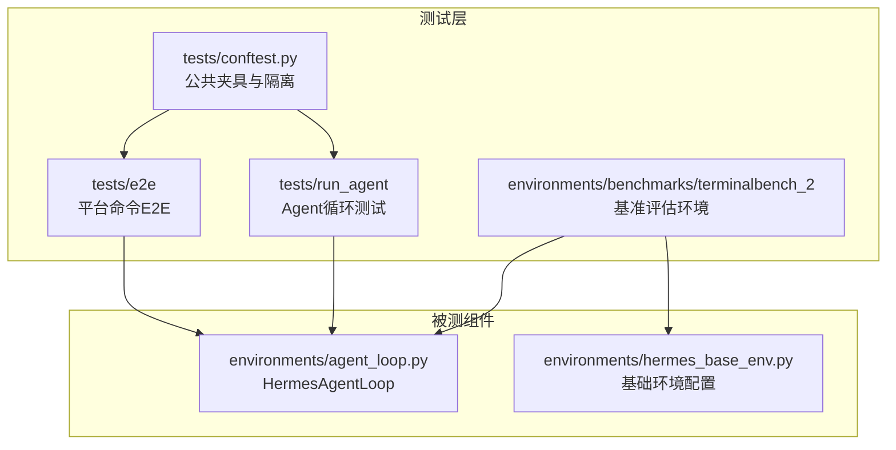
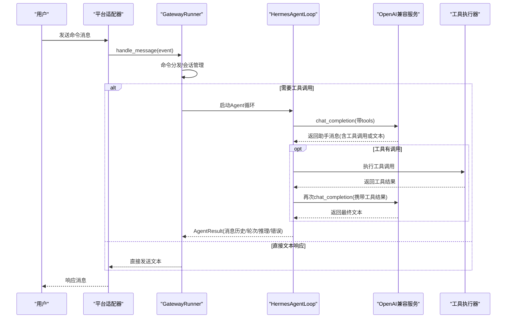
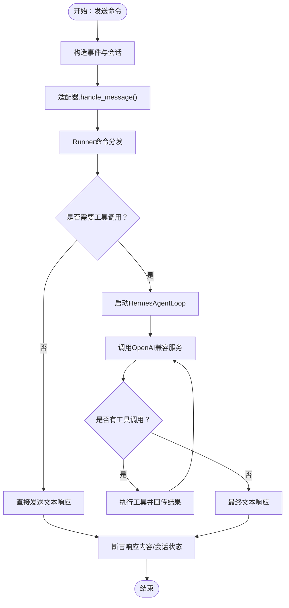
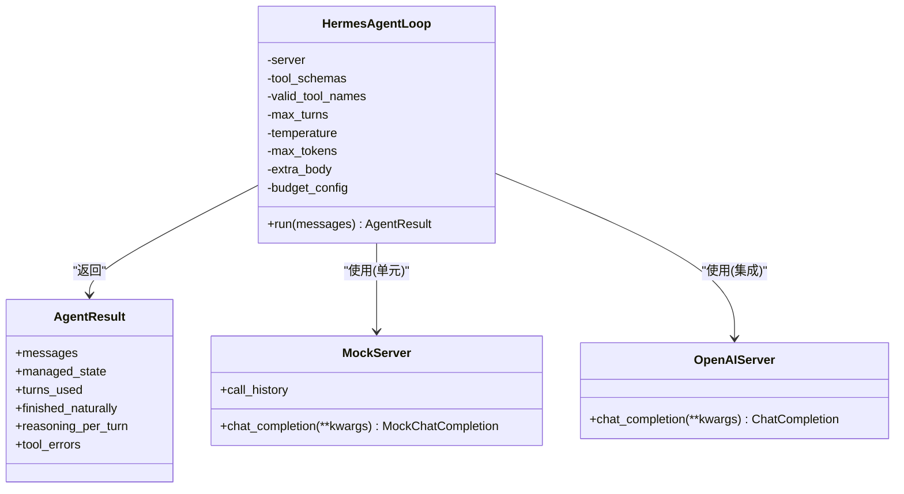
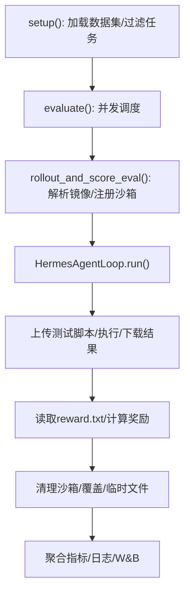
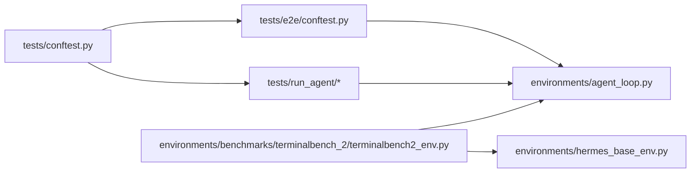

# 端到端测试

<cite>
**本文引用的文件**
- [tests/e2e/conftest.py](file://tests/e2e/conftest.py)
- [tests/e2e/test_platform_commands.py](file://tests/e2e/test_platform_commands.py)
- [environments/agent_loop.py](file://environments/agent_loop.py)
- [tests/run_agent/test_agent_loop.py](file://tests/run_agent/test_agent_loop.py)
- [tests/run_agent/test_agent_loop_tool_calling.py](file://tests/run_agent/test_agent_loop_tool_calling.py)
- [tests/conftest.py](file://tests/conftest.py)
- [environments/benchmarks/terminalbench_2/terminalbench2_env.py](file://environments/benchmarks/terminalbench_2/terminalbench2_env.py)
- [environments/hermes_base_env.py](file://environments/hermes_base_env.py)
- [tests/run_interrupt_test.py](file://tests/run_interrupt_test.py)
- [tests/integration/test_checkpoint_resumption.py](file://tests/integration/test_checkpoint_resumption.py)
- [tests/integration/test_modal_terminal.py](file://tests/integration/test_modal_terminal.py)
</cite>

## 目录
1. [简介](#简介)
2. [项目结构](#项目结构)
3. [核心组件](#核心组件)
4. [架构总览](#架构总览)
5. [详细组件分析](#详细组件分析)
6. [依赖分析](#依赖分析)
7. [性能考虑](#性能考虑)
8. [故障排查指南](#故障排查指南)
9. [结论](#结论)
10. [附录](#附录)

## 简介
本文件面向Hermes Agent的端到端（E2E）测试体系，系统化阐述设计理念与实践方法，覆盖以下方面：
- 完整用户工作流的测试场景：从消息平台命令触发到Agent循环执行再到响应生成的全链路验证
- 平台命令测试：对Telegram、Discord、Slack等消息平台的命令交互进行跨平台一致性验证
- Agent循环端到端测试策略：对话管理、工具调用、响应生成的完整流程验证
- 测试环境配置、测试数据准备与测试结果验证方法
- 性能基准测试、错误注入测试与边界条件测试的实施指南

## 项目结构
端到端测试主要分布在以下模块：
- 平台命令E2E：tests/e2e 下的共享夹具与平台命令测试
- Agent循环E2E：tests/run_agent 下的循环单元与工具调用集成测试
- 基准评估：environments/benchmarks/terminalbench_2 下的终端任务基准评估环境
- 公共夹具与隔离：tests/conftest.py 提供全局隔离与超时控制

图表来源
- [tests/e2e/conftest.py:1-267](file://tests/e2e/conftest.py#L1-L267)
- [tests/e2e/test_platform_commands.py:1-191](file://tests/e2e/test_platform_commands.py#L1-L191)
- [environments/agent_loop.py:1-535](file://environments/agent_loop.py#L1-L535)
- [environments/benchmarks/terminalbench_2/terminalbench2_env.py:1-800](file://environments/benchmarks/terminalbench_2/terminalbench2_env.py#L1-L800)
- [tests/conftest.py:1-122](file://tests/conftest.py#L1-L122)

章节来源
- [tests/e2e/conftest.py:1-267](file://tests/e2e/conftest.py#L1-L267)
- [tests/e2e/test_platform_commands.py:1-191](file://tests/e2e/test_platform_commands.py#L1-L191)
- [environments/agent_loop.py:1-535](file://environments/agent_loop.py#L1-L535)
- [environments/benchmarks/terminalbench_2/terminalbench2_env.py:1-800](file://environments/benchmarks/terminalbench_2/terminalbench2_env.py#L1-L800)
- [tests/conftest.py:1-122](file://tests/conftest.py#L1-L122)

## 核心组件
- 平台命令E2E测试：通过适配器驱动消息事件，经过网关运行器处理，最终断言响应内容与会话状态变化，覆盖帮助、状态、新建会话、停止、命令列表、详细模式、人格、YOLO压缩等命令
- Agent循环E2E测试：使用模拟服务器验证多轮对话、工具调用、未知工具拒绝、最大轮次限制、直接文本响应、工具错误处理、推理内容提取与保留等
- 基准评估环境：Terminal-Bench 2.0评估环境，提供并发控制、任务过滤、测试脚本执行与奖励计算，用于系统级性能与稳定性验证
- 公共夹具：统一的HERMES_HOME隔离、临时目录、事件循环与超时控制，确保测试可重复性与稳定性

章节来源
- [tests/e2e/test_platform_commands.py:22-191](file://tests/e2e/test_platform_commands.py#L22-L191)
- [tests/run_agent/test_agent_loop.py:180-506](file://tests/run_agent/test_agent_loop.py#L180-L506)
- [environments/benchmarks/terminalbench_2/terminalbench2_env.py:221-800](file://environments/benchmarks/terminalbench_2/terminalbench2_env.py#L221-L800)
- [tests/conftest.py:19-122](file://tests/conftest.py#L19-L122)

## 架构总览
下图展示端到端测试在系统中的位置与交互关系，以及关键路径上的断言点。

图表来源
- [tests/e2e/test_platform_commands.py:22-191](file://tests/e2e/test_platform_commands.py#L22-L191)
- [environments/agent_loop.py:175-523](file://environments/agent_loop.py#L175-L523)

## 详细组件分析

### 平台命令E2E测试
- 设计理念
  - 覆盖跨平台命令的一致性：/help、/status、/new、/stop、/commands、/provider、/verbose、/personality、/yolo、/compress
  - 会话生命周期验证：/new后/status应反映新会话；/new幂等性
  - 授权与失败恢复：未授权用户触发配对码而非命令输出；发送失败不崩溃
- 关键断言点
  - 响应文本包含预期关键词
  - 会话存储reset调用次数
  - SendResult返回值校验
- 测试数据与环境
  - 使用共享夹具构造MessageEvent、SessionEntry、GatewayRunner与适配器
  - 模拟平台库以避免真实网络依赖

图表来源
- [tests/e2e/conftest.py:156-231](file://tests/e2e/conftest.py#L156-L231)
- [tests/e2e/test_platform_commands.py:22-191](file://tests/e2e/test_platform_commands.py#L22-L191)

章节来源
- [tests/e2e/conftest.py:1-267](file://tests/e2e/conftest.py#L1-L267)
- [tests/e2e/test_platform_commands.py:1-191](file://tests/e2e/test_platform_commands.py#L1-L191)

### Agent循环端到端测试策略
- 单元测试（模拟服务器）
  - 验证多轮对话、工具调用序列、未知工具拒绝、最大轮次限制、空响应、API异常、推理内容提取、ManagedServer状态返回、RL环境下的工具限制等
  - 使用MockServer与MockChatCompletion模拟LLM响应，确保测试稳定且可重复
- 工具调用集成测试（真实模型）
  - 通过OpenRouter等真实服务验证单工具、多工具、多轮对话、未知工具拒绝、最大轮次限制、直接文本响应、工具错误处理、AgentResult结构与对话历史保留
  - 使用环境变量OPENROUTER_API_KEY启用真实测试，否则跳过
- 关键断言点
  - turns_used、finished_naturally、messages角色序列、tool_errors记录、reasoning_per_turn提取
  - 工具池大小调整与线程池关闭行为

图表来源
- [environments/agent_loop.py:119-535](file://environments/agent_loop.py#L119-L535)
- [tests/run_agent/test_agent_loop.py:73-130](file://tests/run_agent/test_agent_loop.py#L73-L130)
- [tests/run_agent/test_agent_loop_tool_calling.py:63-76](file://tests/run_agent/test_agent_loop_tool_calling.py#L63-L76)

章节来源
- [environments/agent_loop.py:1-535](file://environments/agent_loop.py#L1-L535)
- [tests/run_agent/test_agent_loop.py:1-506](file://tests/run_agent/test_agent_loop.py#L1-L506)
- [tests/run_agent/test_agent_loop_tool_calling.py:1-553](file://tests/run_agent/test_agent_loop_tool_calling.py#L1-L553)

### 基准评估与性能测试
- Terminal-Bench 2.0评估环境
  - 数据集加载、任务过滤、并发控制、每任务沙箱注册、Agent循环执行、测试脚本上传与执行、奖励计算与日志输出
  - 支持墙钟超时、任务超时、Modal沙箱隔离、线程池与异步安全
- 性能关注点
  - 并发度与线程池大小：tool_pool_size需满足并发任务需求
  - 任务超时与清理：task_timeout与terminal_lifetime协调
  - 测试超时：test_timeout控制测试脚本执行时间

图表来源
- [environments/benchmarks/terminalbench_2/terminalbench2_env.py:315-800](file://environments/benchmarks/terminalbench_2/terminalbench2_env.py#L315-L800)

章节来源
- [environments/benchmarks/terminalbench_2/terminalbench2_env.py:1-800](file://environments/benchmarks/terminalbench_2/terminalbench2_env.py#L1-L800)
- [environments/hermes_base_env.py:78-200](file://environments/hermes_base_env.py#L78-L200)

## 依赖分析
- 测试隔离与超时
  - tests/conftest.py统一设置HERMES_HOME到临时目录，删除可能影响测试的环境变量，并为同步测试提供默认事件循环，同时设置SIGALRM超时保护
- 平台命令E2E依赖
  - tests/e2e/conftest.py提供平台适配器、Runner、SessionEntry、MessageEvent工厂与发送失败模拟
- Agent循环测试依赖
  - environments/agent_loop.py提供HermesAgentLoop与AgentResult定义；tests/run_agent/test_agent_loop_tool_calling.py依赖OpenAIServer与工具处理器

图表来源
- [tests/conftest.py:19-122](file://tests/conftest.py#L19-L122)
- [tests/e2e/conftest.py:1-267](file://tests/e2e/conftest.py#L1-L267)
- [environments/agent_loop.py:1-535](file://environments/agent_loop.py#L1-L535)
- [environments/benchmarks/terminalbench_2/terminalbench2_env.py:1-800](file://environments/benchmarks/terminalbench_2/terminalbench2_env.py#L1-L800)
- [environments/hermes_base_env.py:1-200](file://environments/hermes_base_env.py#L1-L200)

章节来源
- [tests/conftest.py:1-122](file://tests/conftest.py#L1-L122)
- [tests/e2e/conftest.py:1-267](file://tests/e2e/conftest.py#L1-L267)
- [environments/agent_loop.py:1-535](file://environments/agent_loop.py#L1-L535)
- [environments/benchmarks/terminalbench_2/terminalbench2_env.py:1-800](file://environments/benchmarks/terminalbench_2/terminalbench2_env.py#L1-L800)
- [environments/hermes_base_env.py:1-200](file://environments/hermes_base_env.py#L1-L200)

## 性能考虑
- 并发与资源
  - 并发任务数与线程池大小：根据任务复杂度与工具调用频率调整tool_pool_size，避免线程池饥饿
  - 任务超时与沙箱生命周期：合理设置task_timeout与terminal_lifetime，防止长时间占用资源
- I/O与网络
  - 测试脚本执行超时test_timeout，避免阻塞整个评估流程
  - 基于OpenRouter的真实模型测试需考虑速率限制与可用性，采用多模型回退策略
- 断言与可观测性
  - 记录turns_used、finished_naturally、reasoning_per_turn等指标，便于定位性能瓶颈
  - 使用Streaming JSONL输出与W&B日志，便于离线分析

[本节为通用指导，无需特定文件引用]

## 故障排查指南
- 中断与恢复
  - 交互式中断测试：验证父进程中断后子线程快速退出，断言status与耗时
  - 检查点恢复：模拟中断与崩溃后的恢复流程，统计通过率
- 错误注入与边界条件
  - Agent循环：空响应、API异常、未知工具名、最大轮次限制、工具错误处理
  - 平台命令：发送失败内部处理、未授权用户配对码响应
- 环境问题
  - OPENROUTER_API_KEY缺失导致集成测试跳过
  - HERMES_HOME隔离导致的配置污染，使用tests/conftest.py提供的隔离夹具

章节来源
- [tests/run_interrupt_test.py:105-147](file://tests/run_interrupt_test.py#L105-L147)
- [tests/integration/test_checkpoint_resumption.py:405-440](file://tests/integration/test_checkpoint_resumption.py#L405-L440)
- [tests/run_agent/test_agent_loop.py:322-341](file://tests/run_agent/test_agent_loop.py#L322-L341)
- [tests/e2e/test_platform_commands.py:179-191](file://tests/e2e/test_platform_commands.py#L179-L191)
- [tests/conftest.py:19-43](file://tests/conftest.py#L19-L43)

## 结论
Hermes Agent的端到端测试体系通过“平台命令E2E + Agent循环E2E + 基准评估”的三层组合，实现了从用户交互到工具调用再到系统级性能的全面验证。借助共享夹具与隔离机制，测试具备高可重复性与稳定性；通过真实模型与基准环境，能够有效评估Agent在复杂任务中的表现。建议在持续集成中优先运行平台命令与Agent循环单元测试，在专用环境运行基准评估与长时任务测试。

[本节为总结性内容，无需特定文件引用]

## 附录
- 测试环境配置要点
  - 使用tests/conftest.py提供的HERMES_HOME隔离与事件循环夹具
  - 平台命令E2E使用tests/e2e/conftest.py中的适配器与Runner工厂
  - Agent循环集成测试需设置OPENROUTER_API_KEY
- 测试数据准备
  - 平台命令E2E：通过工厂函数构造事件与会话
  - 基准评估：Terminal-Bench 2.0数据集自动加载，支持任务过滤
- 结果验证方法
  - 平台命令：断言响应文本关键词与会话存储调用次数
  - Agent循环：断言AgentResult字段、消息角色序列、工具错误记录
  - 基准评估：断言passed/reward、turns_used、分类通过率与日志输出

[本节为补充说明，无需特定文件引用]