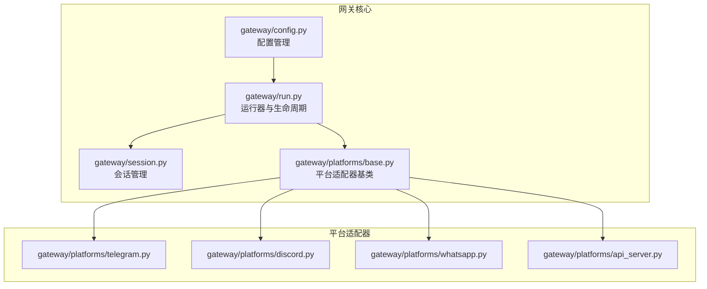
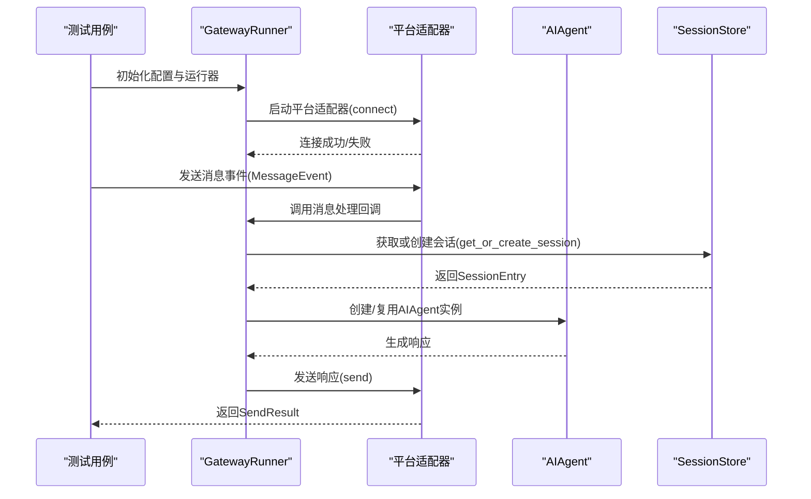
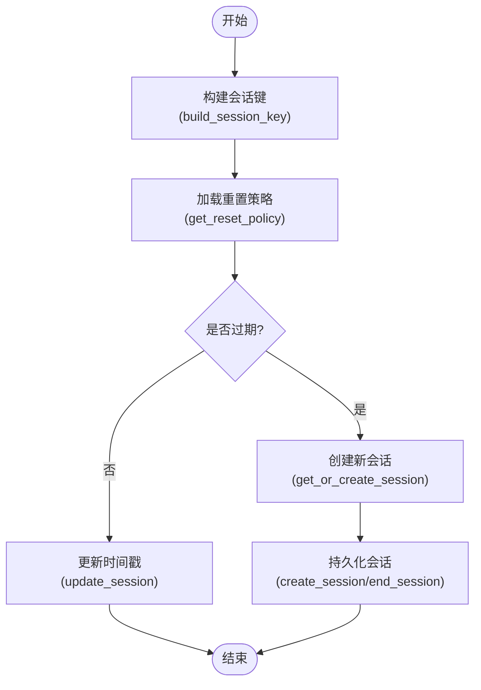
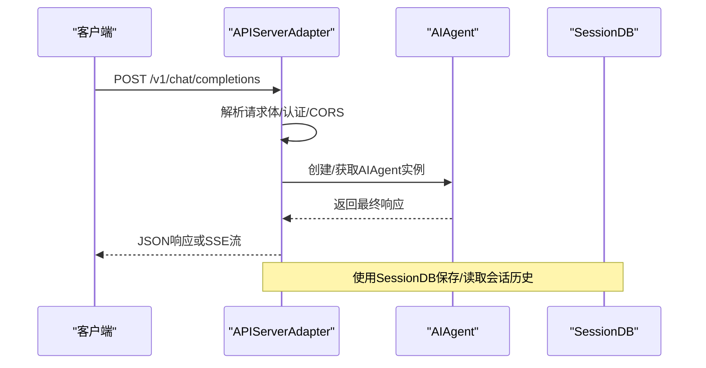
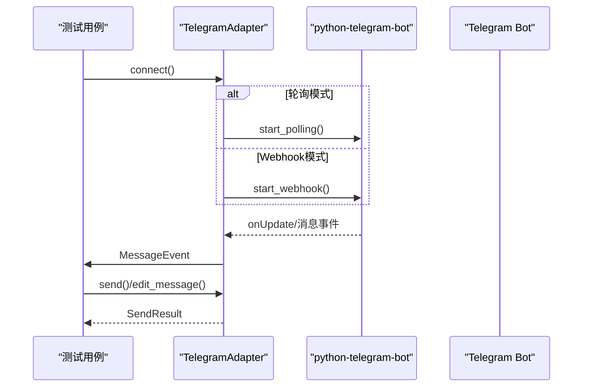
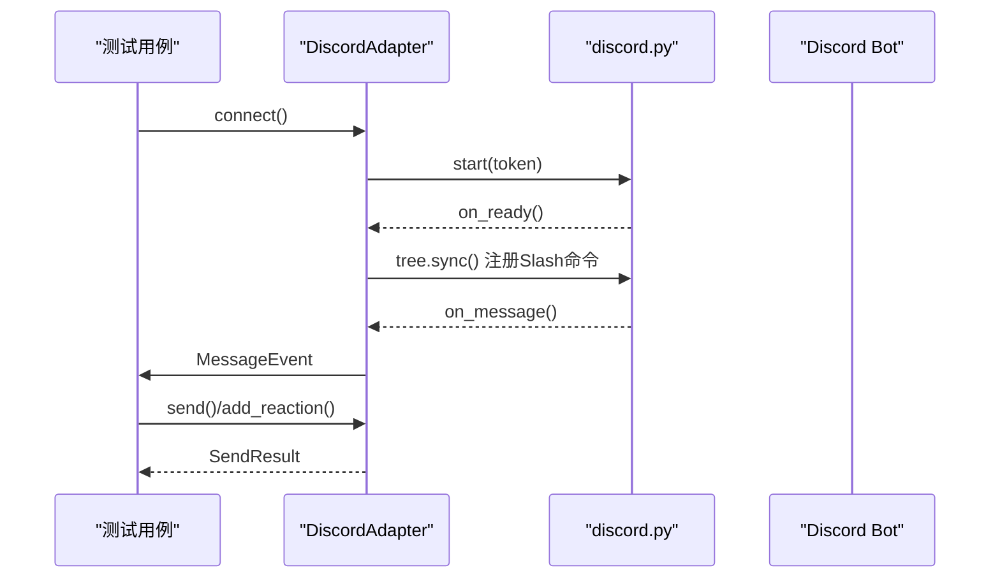
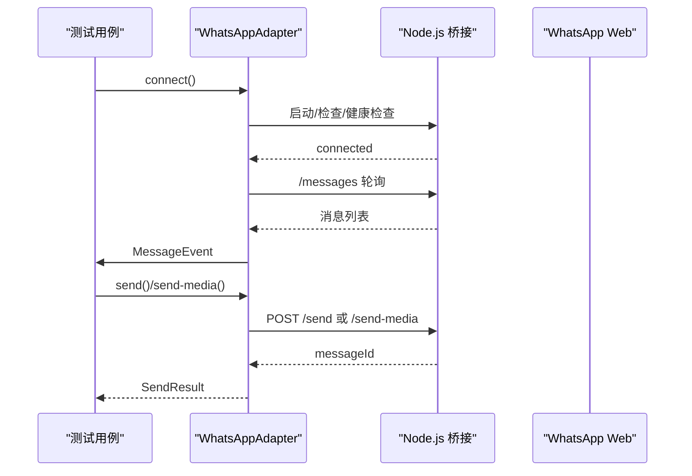
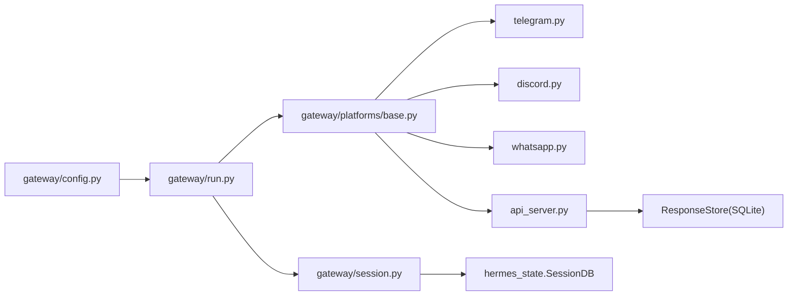

# 网关集成测试

<cite>
**本文档引用的文件**
- [gateway/__init__.py](file://gateway/__init__.py)
- [gateway/run.py](file://gateway/run.py)
- [gateway/config.py](file://gateway/config.py)
- [gateway/session.py](file://gateway/session.py)
- [gateway/platforms/__init__.py](file://gateway/platforms/__init__.py)
- [gateway/platforms/base.py](file://gateway/platforms/base.py)
- [gateway/platforms/api_server.py](file://gateway/platforms/api_server.py)
- [gateway/platforms/telegram.py](file://gateway/platforms/telegram.py)
- [gateway/platforms/discord.py](file://gateway/platforms/discord.py)
- [gateway/platforms/whatsapp.py](file://gateway/platforms/whatsapp.py)
- [tests/gateway/test_api_server.py](file://tests/gateway/test_api_server.py)
- [tests/gateway/test_telegram.py](file://tests/gateway/test_telegram.py)
- [tests/gateway/test_discord.py](file://tests/gateway/test_discord.py)
- [tests/gateway/test_whatsapp.py](file://tests/gateway/test_whatsapp.py)
- [tests/gateway/test_session.py](file://tests/gateway/test_session.py)
- [tests/gateway/test_platform_base.py](file://tests/gateway/test_platform_base.py)
</cite>

## 目录
1. [简介](#简介)
2. [项目结构](#项目结构)
3. [核心组件](#核心组件)
4. [架构总览](#架构总览)
5. [详细组件分析](#详细组件分析)
6. [依赖关系分析](#依赖关系分析)
7. [性能考虑](#性能考虑)
8. [故障排除指南](#故障排除指南)
9. [结论](#结论)
10. [附录](#附录)

## 简介
本文件为 Hermes Agent 网关系统的集成测试文档，聚焦于多平台消息平台的端到端测试、会话管理与消息路由测试。内容涵盖：
- 多平台适配器（Telegram、Discord、WhatsApp 等）的集成测试策略与测试场景
- API 服务器（OpenAI 兼容接口）的 HTTP 接口与 WebSocket 连接测试方法
- 会话边界测试、消息传递测试与错误处理测试的实现要点
- 测试环境搭建、模拟服务配置与测试数据准备的最佳实践

## 项目结构
Hermes 网关系统采用模块化设计，核心目录与文件如下：
- 网关核心：配置、会话、运行器、平台适配器
- 平台适配器：Telegram、Discord、WhatsApp、API Server 等
- 测试套件：针对各平台与核心功能的集成测试

**图表来源**
- [gateway/config.py:1-120](file://gateway/config.py#L1-L120)
- [gateway/run.py:512-635](file://gateway/run.py#L512-L635)
- [gateway/session.py:495-570](file://gateway/session.py#L495-L570)
- [gateway/platforms/base.py:779-800](file://gateway/platforms/base.py#L779-L800)
- [gateway/platforms/telegram.py:114-164](file://gateway/platforms/telegram.py#L114-L164)
- [gateway/platforms/discord.py:411-466](file://gateway/platforms/discord.py#L411-L466)
- [gateway/platforms/whatsapp.py:103-148](file://gateway/platforms/whatsapp.py#L103-L148)
- [gateway/platforms/api_server.py:368-406](file://gateway/platforms/api_server.py#L368-L406)

**章节来源**
- [gateway/__init__.py:1-36](file://gateway/__init__.py#L1-L36)
- [gateway/config.py:1-120](file://gateway/config.py#L1-L120)
- [gateway/run.py:512-635](file://gateway/run.py#L512-L635)
- [gateway/session.py:495-570](file://gateway/session.py#L495-L570)
- [gateway/platforms/base.py:779-800](file://gateway/platforms/base.py#L779-L800)

## 核心组件
- 配置管理（GatewayConfig/PlatformConfig/HomeChannel/SessionResetPolicy）
- 会话管理（SessionStore/SessionContext/SessionSource/build_session_key）
- 运行器（GatewayRunner 生命周期管理、平台适配器启动/停止、会话缓存）
- 平台适配器基类（统一的消息事件模型、发送结果、媒体缓存、代理支持）

关键职责与交互：
- 配置层负责解析用户配置、环境变量与默认值，并提供平台连接参数与会话重置策略
- 会话层负责会话键生成、过期检测、自动重置与历史记录持久化
- 运行器负责协调各平台适配器、内存中的 AIAgent 实例缓存、重启与恢复
- 平台适配器基类提供统一的事件模型、媒体下载缓存、代理与安全校验能力

**章节来源**
- [gateway/config.py:220-430](file://gateway/config.py#L220-L430)
- [gateway/session.py:436-493](file://gateway/session.py#L436-L493)
- [gateway/run.py:512-635](file://gateway/run.py#L512-L635)
- [gateway/platforms/base.py:634-777](file://gateway/platforms/base.py#L634-L777)

## 架构总览
下图展示网关集成测试的关键交互路径：从配置加载到平台适配器连接，再到消息路由与会话管理。

**图表来源**
- [gateway/run.py:512-635](file://gateway/run.py#L512-L635)
- [gateway/platforms/base.py:655-727](file://gateway/platforms/base.py#L655-L727)
- [gateway/session.py:683-768](file://gateway/session.py#L683-L768)

## 详细组件分析

### 会话管理测试
会话管理是网关集成测试的核心，涉及：
- 会话键构建规则（按平台/聊天类型/线程/用户隔离）
- 会话过期策略（空闲超时、每日重置、强制重置）
- 会话历史持久化与恢复
- 自动重置通知与上下文丢失保护

测试要点：
- 构建不同组合的 SessionSource，验证 build_session_key 的输出一致性
- 设置不同的 SessionResetPolicy，触发 idle/daily/suspended 重置路径
- 模拟长时间无活动与跨日场景，验证自动重置行为
- 验证 SessionStore 在 SQLite 不可用时回退至 JSONL 文件

**图表来源**
- [gateway/session.py:436-493](file://gateway/session.py#L436-L493)
- [gateway/session.py:579-660](file://gateway/session.py#L579-L660)
- [gateway/session.py:683-768](file://gateway/session.py#L683-L768)

**章节来源**
- [gateway/session.py:436-493](file://gateway/session.py#L436-L493)
- [gateway/session.py:579-660](file://gateway/session.py#L579-L660)
- [gateway/session.py:683-768](file://gateway/session.py#L683-L768)
- [tests/gateway/test_session.py](file://tests/gateway/test_session.py)

### API 服务器集成测试
API 服务器适配器提供 OpenAI 兼容接口，支持：
- /v1/chat/completions（流式与非流式）
- /v1/responses（状态保持的 Responses API）
- /v1/models、/health 健康检查
- SSE 事件流（/runs/{run_id}/events）

测试策略：
- HTTP 接口测试：构造符合 OpenAI 规范的请求体，验证响应结构与错误处理
- 认证测试：校验 Bearer Token 与 CORS 策略
- 流式响应测试：验证 SSE 事件序列与工具进度事件
- 会话连续性测试：通过 X-Hermes-Session-Id 维持对话历史
- 幂等性测试：Idempotency-Key 去重

**图表来源**
- [gateway/platforms/api_server.py:564-800](file://gateway/platforms/api_server.py#L564-L800)
- [gateway/platforms/api_server.py:368-406](file://gateway/platforms/api_server.py#L368-L406)

**章节来源**
- [gateway/platforms/api_server.py:564-800](file://gateway/platforms/api_server.py#L564-L800)
- [gateway/platforms/api_server.py:368-406](file://gateway/platforms/api_server.py#L368-L406)
- [tests/gateway/test_api_server.py](file://tests/gateway/test_api_server.py)

### Telegram 平台集成测试
Telegram 适配器特性：
- 支持轮询与 Webhook 两种模式
- 支持论坛主题（DM Topics）、回复线程控制
- 图片/音频/文档缓存、媒体批处理
- 代理与 Telegram 回退 IP 支持

测试策略：
- 连接模式测试：轮询 vs Webhook，验证错误重连与冲突处理
- 文本/媒体消息聚合测试：长文本分片合并、图片相册批处理
- DM 主题映射测试：创建/持久化主题 ID
- 错误处理测试：网络中断、409 冲突、致命错误上报

**图表来源**
- [gateway/platforms/telegram.py:477-731](file://gateway/platforms/telegram.py#L477-L731)
- [gateway/platforms/telegram.py:786-800](file://gateway/platforms/telegram.py#L786-L800)

**章节来源**
- [gateway/platforms/telegram.py:477-731](file://gateway/platforms/telegram.py#L477-L731)
- [gateway/platforms/telegram.py:786-800](file://gateway/platforms/telegram.py#L786-L800)
- [tests/gateway/test_telegram.py](file://tests/gateway/test_telegram.py)

### Discord 平台集成测试
Discord 适配器特性：
- 基于 discord.py 的事件驱动模型
- Slash 命令注册与处理
- 语音通道监听（DAVE/E2EE 解密、Opus 解码）
- 反应反馈与消息去重

测试策略：
- 连接与就绪事件测试：等待 on_ready，同步 Slash 命令
- 消息过滤测试：@提及要求、其他机器人过滤、人类提及忽略策略
- 语音输入测试：SSRC 映射、静音检测、PCM 转 WAV
- 反馈反应测试：处理中/完成/失败的反应

**图表来源**
- [gateway/platforms/discord.py:467-672](file://gateway/platforms/discord.py#L467-L672)
- [gateway/platforms/discord.py:765-800](file://gateway/platforms/discord.py#L765-L800)

**章节来源**
- [gateway/platforms/discord.py:467-672](file://gateway/platforms/discord.py#L467-L672)
- [gateway/platforms/discord.py:765-800](file://gateway/platforms/discord.py#L765-L800)
- [tests/gateway/test_discord.py](file://tests/gateway/test_discord.py)

### WhatsApp 平台集成测试
WhatsApp 适配器特性：
- 通过 Node.js 桥接（whatsapp-web.js/Baileys/Business API）
- HTTP 桥接通信（/health、/messages、/send、/send-media、/typing）
- 会话锁与进程管理、QR 扫描与重新配对提示
- 自由响应群组、@提及要求、前缀匹配等策略

测试策略：
- 桥接进程管理测试：启动/停止、端口占用清理、进程退出监控
- 消息过滤测试：自由响应群组、@提及、命令前缀、回复引用
- 媒体发送测试：图片/视频/文档直传桥接，本地缓存回退
- Typing 指示测试：桥接健康检查与异常处理

**图表来源**
- [gateway/platforms/whatsapp.py:273-457](file://gateway/platforms/whatsapp.py#L273-L457)
- [gateway/platforms/whatsapp.py:534-574](file://gateway/platforms/whatsapp.py#L534-L574)

**章节来源**
- [gateway/platforms/whatsapp.py:273-457](file://gateway/platforms/whatsapp.py#L273-L457)
- [gateway/platforms/whatsapp.py:534-574](file://gateway/platforms/whatsapp.py#L534-L574)
- [tests/gateway/test_whatsapp.py](file://tests/gateway/test_whatsapp.py)

### 平台适配器基类测试
平台适配器基类提供统一的基础设施：
- 消息事件模型（MessageEvent）、发送结果（SendResult）
- 媒体缓存（图片/音频/文档）、UTF-16 长度限制与截断
- 代理支持（HTTP/SOCKS）、SSRF 防护
- 重试模式与可重试错误识别

测试策略：
- 事件模型测试：命令解析、回复上下文注入、内部事件标记
- 媒体缓存测试：缓存命中/回退、过期清理、路径遍历防护
- 代理与安全测试：URL 安全性校验、SSRF 重定向拦截
- 错误模式测试：连接错误重试、致命错误上报

**章节来源**
- [gateway/platforms/base.py:634-777](file://gateway/platforms/base.py#L634-L777)
- [gateway/platforms/base.py:779-800](file://gateway/platforms/base.py#L779-L800)
- [tests/gateway/test_platform_base.py](file://tests/gateway/test_platform_base.py)

## 依赖关系分析
网关集成测试涉及的主要依赖关系：
- 配置层依赖 hermes_cli.config 与 hermes_constants 提供的环境变量与路径解析
- 会话层依赖 hermes_state.SessionDB（SQLite）与本地 JSONL 文件
- 平台适配器依赖第三方库（python-telegram-bot、discord.py、aiohttp 等）
- API 服务器依赖响应存储（SQLite）与会话数据库

**图表来源**
- [gateway/config.py:1-120](file://gateway/config.py#L1-L120)
- [gateway/run.py:512-635](file://gateway/run.py#L512-L635)
- [gateway/session.py:512-519](file://gateway/session.py#L512-L519)
- [gateway/platforms/api_server.py:124-229](file://gateway/platforms/api_server.py#L124-L229)

**章节来源**
- [gateway/config.py:1-120](file://gateway/config.py#L1-L120)
- [gateway/run.py:512-635](file://gateway/run.py#L512-L635)
- [gateway/session.py:512-519](file://gateway/session.py#L512-L519)
- [gateway/platforms/api_server.py:124-229](file://gateway/platforms/api_server.py#L124-L229)

## 性能考虑
- 会话缓存：运行器使用内存中的 AIAgent 实例缓存，避免重复构建系统提示，减少令牌消耗
- 媒体缓存：图片/音频/文档本地缓存，避免平台 URL 过期导致的重复下载
- 代理与回退：Telegram 回退 IP 与通用代理支持，提升网络稳定性
- SSE 流式：API 服务器使用 SSE 流式传输，降低前端等待时间

[本节为通用指导，无需具体文件引用]

## 故障排除指南
常见问题与排查步骤：
- 平台连接失败
  - 检查令牌/密钥配置与环境变量
  - 查看平台日志（Telegram/Webhook、Discord 事件、WhatsApp 桥接日志）
- 会话未重置或重置异常
  - 核对 SessionResetPolicy 配置与实际触发条件
  - 检查 SQLite 会话数据库状态
- API 服务器认证失败
  - 确认 Bearer Token 与 CORS 配置
  - 检查请求体大小限制与幂等性键
- 媒体发送失败
  - 检查本地缓存目录权限与磁盘空间
  - 确认 URL 安全性与 SSRF 防护设置

**章节来源**
- [gateway/platforms/telegram.py:195-261](file://gateway/platforms/telegram.py#L195-L261)
- [gateway/platforms/discord.py:467-501](file://gateway/platforms/discord.py#L467-L501)
- [gateway/platforms/whatsapp.py:345-457](file://gateway/platforms/whatsapp.py#L345-L457)
- [gateway/platforms/api_server.py:467-488](file://gateway/platforms/api_server.py#L467-L488)

## 结论
本文档提供了 Hermes Agent 网关系统的集成测试方法论与实施建议，覆盖多平台消息平台、API 服务器、会话管理与消息路由等核心领域。通过统一的测试策略与最佳实践，可以有效保障网关在复杂网络环境下的稳定性与可靠性。

[本节为总结性内容，无需具体文件引用]

## 附录

### 测试环境搭建与模拟服务配置
- 环境变量
  - 平台令牌/密钥：TELEGRAM_BOT_TOKEN、DISCORD_BOT_TOKEN、API_SERVER_KEY 等
  - 代理配置：HTTPS_PROXY/HTTP_PROXY/ALL_PROXY 或平台专用变量
  - 特定平台行为：如 TELEGRAM_REPLY_TO_MODE、DISCORD_REACTIONS、WHATSAPP_REQUIRE_MENTION
- 模拟服务
  - Telegram：使用 Webhook 模式或本地代理以绕过网络限制
  - Discord：启用最小权限意图（message_content、dm_messages、guild_messages），必要时开启 members
  - WhatsApp：确保 Node.js 环境与 npm 依赖安装，准备会话目录与日志文件
- 测试数据准备
  - 准备不同类型的媒体文件（图片/音频/文档）用于缓存与发送测试
  - 准备长文本与分片消息，验证聚合与截断逻辑
  - 准备跨日与空闲超时场景，验证会话重置策略

[本节为通用指导，无需具体文件引用]