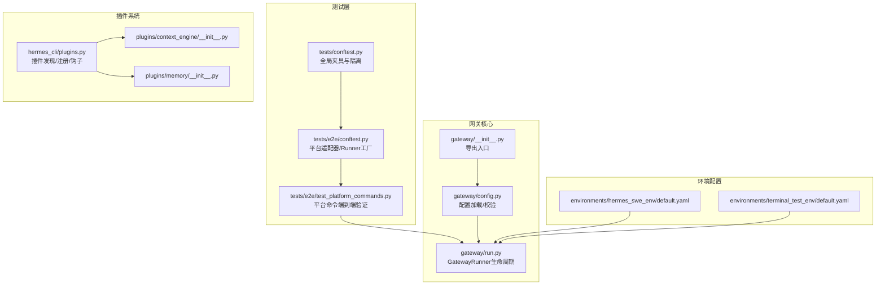
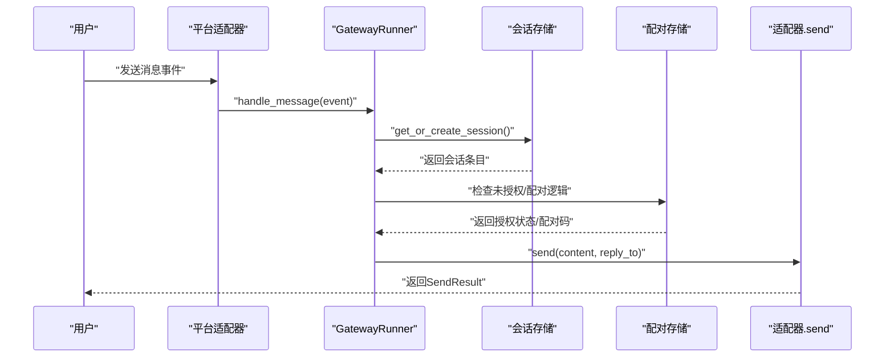
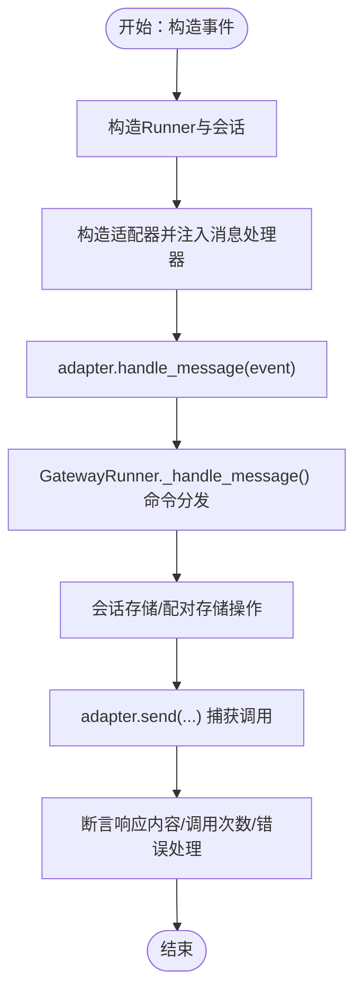
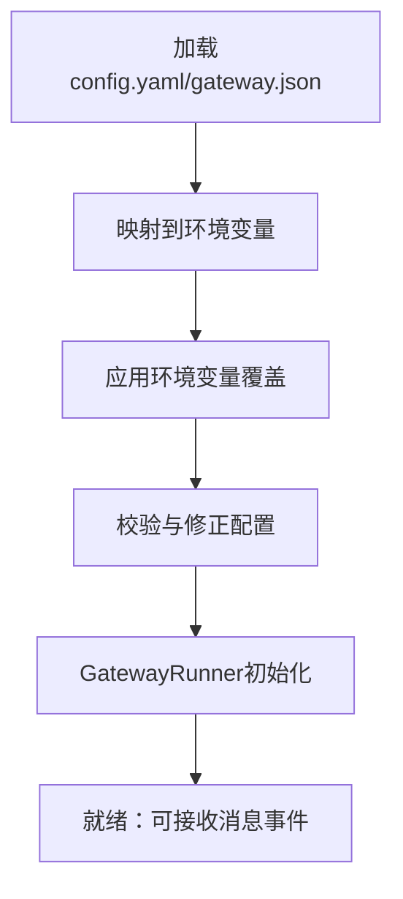
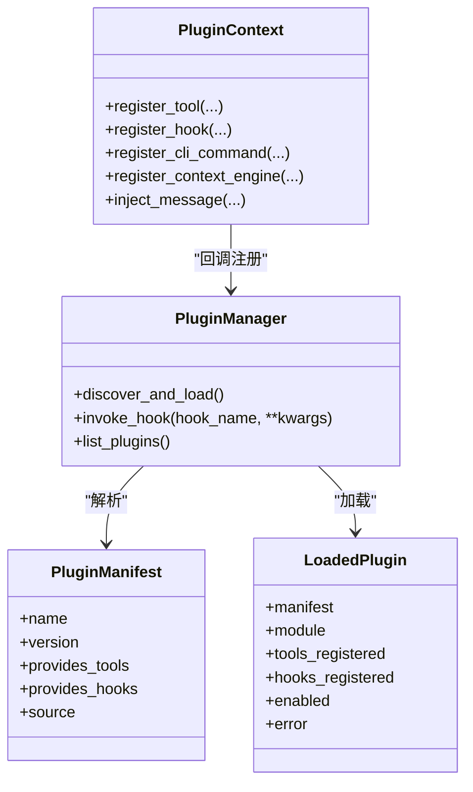
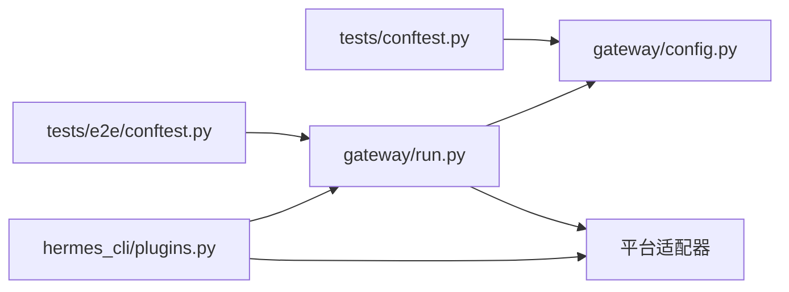

# 集成测试

<cite>
**本文引用的文件**
- [tests/conftest.py](file://tests/conftest.py)
- [tests/e2e/conftest.py](file://tests/e2e/conftest.py)
- [tests/e2e/test_platform_commands.py](file://tests/e2e/test_platform_commands.py)
- [gateway/__init__.py](file://gateway/__init__.py)
- [gateway/config.py](file://gateway/config.py)
- [gateway/run.py](file://gateway/run.py)
- [hermes_cli/plugins.py](file://hermes_cli/plugins.py)
- [plugins/context_engine/__init__.py](file://plugins/context_engine/__init__.py)
- [plugins/memory/__init__.py](file://plugins/memory/__init__.py)
- [environments/hermes_swe_env/default.yaml](file://environments/hermes_swe_env/default.yaml)
- [environments/terminal_test_env/default.yaml](file://environments/terminal_test_env/default.yaml)
</cite>

## 目录
1. [引言](#引言)
2. [项目结构](#项目结构)
3. [核心组件](#核心组件)
4. [架构总览](#架构总览)
5. [详细组件分析](#详细组件分析)
6. [依赖分析](#依赖分析)
7. [性能考虑](#性能考虑)
8. [故障排查指南](#故障排查指南)
9. [结论](#结论)
10. [附录](#附录)

## 引言
本文件面向Hermes Agent的集成测试，目标是建立覆盖“组件间交互测试、网关系统测试、插件系统测试”的完整策略，并给出环境集成测试与跨执行环境（本地、容器、云沙箱）的测试方法建议。文档同时提供网关平台集成测试指导（Telegram、Discord、Slack等）与插件系统测试方法及测试数据管理最佳实践。

## 项目结构
Hermes Agent的集成测试主要集中在tests目录中，其中：
- tests/conftest.py：全局共享夹具，隔离HERMES_HOME、清理环境变量、统一事件循环与超时控制。
- tests/e2e/conftest.py：端到端（E2E）测试夹具，提供平台适配器、会话、Runner的模拟与工厂函数，支持Telegram/Discord/Slack三平台参数化。
- tests/e2e/test_platform_commands.py：对网关命令在多平台上的端到端行为进行验证，不涉及LLM调用，仅验证命令分发与响应路径。

**图表来源**
- [tests/conftest.py:1-122](file://tests/conftest.py#L1-L122)
- [tests/e2e/conftest.py:1-267](file://tests/e2e/conftest.py#L1-L267)
- [tests/e2e/test_platform_commands.py:1-191](file://tests/e2e/test_platform_commands.py#L1-L191)
- [gateway/config.py:1-800](file://gateway/config.py#L1-L800)
- [gateway/run.py:1-800](file://gateway/run.py#L1-L800)
- [gateway/__init__.py:1-36](file://gateway/__init__.py#L1-L36)
- [hermes_cli/plugins.py:1-649](file://hermes_cli/plugins.py#L1-L649)
- [environments/hermes_swe_env/default.yaml:1-35](file://environments/hermes_swe_env/default.yaml#L1-L35)
- [environments/terminal_test_env/default.yaml:1-35](file://environments/terminal_test_env/default.yaml#L1-L35)

**章节来源**
- [tests/conftest.py:1-122](file://tests/conftest.py#L1-L122)
- [tests/e2e/conftest.py:1-267](file://tests/e2e/conftest.py#L1-L267)
- [tests/e2e/test_platform_commands.py:1-191](file://tests/e2e/test_platform_commands.py#L1-L191)
- [gateway/config.py:1-800](file://gateway/config.py#L1-L800)
- [gateway/run.py:1-800](file://gateway/run.py#L1-L800)
- [gateway/__init__.py:1-36](file://gateway/__init__.py#L1-L36)
- [hermes_cli/plugins.py:1-649](file://hermes_cli/plugins.py#L1-L649)
- [environments/hermes_swe_env/default.yaml:1-35](file://environments/hermes_swe_env/default.yaml#L1-L35)
- [environments/terminal_test_env/default.yaml:1-35](file://environments/terminal_test_env/default.yaml#L1-L35)

## 核心组件
- 测试夹具与隔离
  - tests/conftest.py通过设置HERMES_HOME到临时目录、清理会话相关环境变量、确保事件循环存在、统一30秒超时，避免真实网络调用与状态泄漏。
- 网关配置与运行
  - gateway/config.py负责平台配置加载、默认值合并、环境变量覆盖与校验；gateway/run.py提供GatewayRunner生命周期管理、会话存储、适配器初始化、重启与退出流程。
- 插件系统
  - hermes_cli/plugins.py实现插件发现（用户/项目/Pip）、加载、注册工具/钩子/上下文引擎，以及生命周期钩子调用。
- 平台适配器与端到端
  - tests/e2e/conftest.py提供Telegram/Discord/Slack适配器工厂、Runner模拟、消息事件构造与发送捕获，支撑tests/e2e/test_platform_commands.py对命令流的验证。

**章节来源**
- [tests/conftest.py:19-122](file://tests/conftest.py#L19-L122)
- [gateway/config.py:431-740](file://gateway/config.py#L431-L740)
- [gateway/run.py:512-800](file://gateway/run.py#L512-L800)
- [hermes_cli/plugins.py:271-649](file://hermes_cli/plugins.py#L271-L649)
- [tests/e2e/conftest.py:124-267](file://tests/e2e/conftest.py#L124-L267)

## 架构总览
下图展示从消息事件进入平台适配器，经由GatewayRunner处理命令、访问会话存储与配对存储，再到适配器发送响应的端到端流程。该流程在E2E测试中被完整覆盖，且不涉及LLM调用。

**图表来源**
- [tests/e2e/conftest.py:156-203](file://tests/e2e/conftest.py#L156-L203)
- [tests/e2e/conftest.py:206-231](file://tests/e2e/conftest.py#L206-L231)
- [tests/e2e/test_platform_commands.py:22-191](file://tests/e2e/test_platform_commands.py#L22-L191)

## 详细组件分析

### 组件A：网关平台集成测试（Telegram/Discord/Slack）
- 测试目标
  - 验证命令分发（/help、/status、/new、/stop、/commands等）在多平台的一致性。
  - 验证会话生命周期（重置、状态查询）与未授权用户的配对响应。
  - 验证发送失败的韧性（不崩溃）。
- 关键夹具与工厂
  - make_runner：构造GatewayRunner实例，注入会话存储、配对存储、钩子等依赖，屏蔽真实初始化副作用。
  - make_adapter：按平台创建适配器并注入消息处理器，统一使用AsyncMock作为send。
  - send_and_capture：驱动消息事件进入完整异步流水线并断言send调用。
- 测试要点
  - 参数化平台（Telegram/Discord/Slack），确保命令列表与行为一致。
  - 未授权用户路径应触发配对而非命令输出。
  - 多次调用/idempotent命令不应崩溃。

**图表来源**
- [tests/e2e/conftest.py:156-231](file://tests/e2e/conftest.py#L156-L231)
- [tests/e2e/test_platform_commands.py:22-191](file://tests/e2e/test_platform_commands.py#L22-L191)

**章节来源**
- [tests/e2e/conftest.py:124-267](file://tests/e2e/conftest.py#L124-L267)
- [tests/e2e/test_platform_commands.py:22-191](file://tests/e2e/test_platform_commands.py#L22-L191)

### 组件B：网关配置与运行（配置加载、校验与环境桥接）
- 配置加载优先级与桥接
  - 优先级：环境变量 > ~/.hermes/config.yaml > ~/.hermes/gateway.json > 内置默认。
  - config.yaml中的键映射到环境变量，供运行期读取（如终端、辅助模型、显示、时区、安全等）。
- 校验与保护
  - 对无效字段（如at_hour/idle_minutes）进行警告与回退。
  - 对弱占位符令牌进行拒绝启用，避免启动后出现“认证失败”类误导。
- 运行期行为
  - GatewayRunner在初始化时加载会话存储、交付路由、配对存储、钩子系统等，保证命令处理链路完整。

**图表来源**
- [gateway/config.py:431-740](file://gateway/config.py#L431-L740)
- [gateway/run.py:82-240](file://gateway/run.py#L82-L240)

**章节来源**
- [gateway/config.py:431-740](file://gateway/config.py#L431-L740)
- [gateway/run.py:82-240](file://gateway/run.py#L82-L240)

### 组件C：插件系统集成测试
- 插件发现与加载
  - 用户插件（~/.hermes/plugins/<name>/）、项目插件（./.hermes/plugins/，需开启开关）、Pip入口点插件。
  - 每个目录插件需包含plugin.yaml与__init__.py，并提供register(ctx)函数。
- 生命周期钩子与工具注册
  - 支持pre/post工具调用、LLM请求、会话开始/结束/最终化/重置等钩子。
  - 插件可通过PluginContext.register_tool注册工具，或register_context_engine替换内置上下文引擎。
- 测试关注点
  - 插件禁用列表生效、未知钩子名警告、重复注册上下文引擎的防护。
  - 插件工具集在工具注册表中的可见性与分组呈现。

**图表来源**
- [hermes_cli/plugins.py:271-649](file://hermes_cli/plugins.py#L271-L649)

**章节来源**
- [hermes_cli/plugins.py:271-649](file://hermes_cli/plugins.py#L271-L649)

### 组件D：环境集成测试策略
- 目标
  - 在不同执行环境中（本地、容器、云沙箱）验证Agent与工具链的可用性与一致性。
- 方法
  - 使用环境配置文件（如environments/hermes_swe_env/default.yaml、environments/terminal_test_env/default.yaml）定义工具集、后端类型、模型与提示词。
  - 在容器/沙箱环境中以最小化依赖运行，确保HOME/工作目录隔离与环境变量注入正确。
- 数据与配置
  - 将敏感配置放入~/.hermes/.env并在启动前加载，避免硬编码。
  - 通过config.yaml桥接终端、压缩、显示、时区、安全等配置项到环境变量。

**章节来源**
- [environments/hermes_swe_env/default.yaml:1-35](file://environments/hermes_swe_env/default.yaml#L1-L35)
- [environments/terminal_test_env/default.yaml:1-35](file://environments/terminal_test_env/default.yaml#L1-L35)
- [gateway/run.py:82-240](file://gateway/run.py#L82-L240)

## 依赖分析
- 测试夹具对运行时的影响
  - tests/conftest.py通过修改HERMES_HOME与删除会话相关环境变量，确保测试不会污染用户主目录或继承现有会话表面。
  - tests/e2e/conftest.py在导入平台库前安装Mock模块，保证即使未安装真实SDK也能完成适配器导入与测试。
- 组件耦合
  - GatewayRunner依赖会话存储、配对存储、钩子系统与平台适配器；适配器依赖Runner的消息处理回调；插件系统通过钩子与工具注册影响Agent行为。
- 循环依赖与外部依赖
  - 插件系统与Agent核心通过钩子接口解耦；平台适配器通过统一基类与Runner解耦。

**图表来源**
- [tests/conftest.py:19-43](file://tests/conftest.py#L19-L43)
- [tests/e2e/conftest.py:26-121](file://tests/e2e/conftest.py#L26-L121)
- [gateway/run.py:512-635](file://gateway/run.py#L512-L635)
- [hermes_cli/plugins.py:271-324](file://hermes_cli/plugins.py#L271-L324)

**章节来源**
- [tests/conftest.py:19-43](file://tests/conftest.py#L19-L43)
- [tests/e2e/conftest.py:26-121](file://tests/e2e/conftest.py#L26-L121)
- [gateway/run.py:512-635](file://gateway/run.py#L512-L635)
- [hermes_cli/plugins.py:271-324](file://hermes_cli/plugins.py#L271-L324)

## 性能考虑
- 事件循环与并发
  - tests/conftest.py确保同步测试具备当前事件循环，避免因Python 3.11+默认策略导致的阻塞问题。
- 超时与稳定性
  - 全局30秒SIGALRM超时，防止挂起测试拖垮整个套件。
- 发送失败韧性
  - E2E测试验证发送失败不崩溃，保障网关在平台不稳定时的鲁棒性。

**章节来源**
- [tests/conftest.py:74-122](file://tests/conftest.py#L74-L122)
- [tests/e2e/test_platform_commands.py:176-191](file://tests/e2e/test_platform_commands.py#L176-L191)

## 故障排查指南
- 配置问题
  - 若平台未连接，检查config.yaml中的令牌与平台启用标志；确认环境变量覆盖顺序与弱令牌占位符检测。
- 会话与配对
  - 未授权DM应触发配对码而非命令输出；若出现异常行为，检查Runner._is_user_authorized与配对存储。
- 发送失败
  - 发送返回失败时，端到端流水线不应抛出异常；如出现崩溃，检查SendResult处理与异常捕获。
- 插件加载
  - 无register()函数或未知钩子名会记录警告；确认插件目录结构与plugin.yaml格式。

**章节来源**
- [gateway/config.py:673-740](file://gateway/config.py#L673-L740)
- [tests/e2e/test_platform_commands.py:141-191](file://tests/e2e/test_platform_commands.py#L141-L191)
- [hermes_cli/plugins.py:400-447](file://hermes_cli/plugins.py#L400-L447)

## 结论
通过以tests/e2e/test_platform_commands.py为代表的端到端测试，结合tests/conftest.py与tests/e2e/conftest.py提供的稳定夹具与Mock机制，Hermes Agent实现了对网关命令分发、会话生命周期与未授权用户处理的可靠验证。配合gateway/config.py与gateway/run.py的配置加载与运行期行为，以及hermes_cli/plugins.py的插件发现与钩子系统，形成了覆盖组件交互、网关系统与插件系统的集成测试框架。建议在CI中固定超时、隔离HERMES_HOME，并针对不同执行环境（本地/容器/沙箱）使用对应环境配置文件进行回归验证。

## 附录
- 网关平台集成测试清单
  - 命令：/help、/status、/new、/stop、/commands、/provider、/verbose、/personality、/yolo、/compress
  - 行为：多命令序列共享会话、/new幂等、未授权用户配对响应、发送失败不崩溃
- 插件系统测试清单
  - 插件发现：用户/项目/Pip三种来源
  - 工具注册：工具集可见性与分组
  - 钩子注册：已知/未知钩子名处理
  - 上下文引擎：唯一性约束与类型校验
- 环境配置与数据管理
  - 使用~/.hermes/.env与config.yaml桥接环境变量
  - 使用environments/*.yaml定义工具集与后端
  - 通过tests/conftest.py隔离HERMES_HOME，避免状态泄漏