# 性能监控与分析

<cite>
**本文引用的文件**
- [agent/rate_limit_tracker.py](file://agent/rate_limit_tracker.py)
- [agent/usage_pricing.py](file://agent/usage_pricing.py)
- [agent/smart_model_routing.py](file://agent/smart_model_routing.py)
- [agent/memory_manager.py](file://agent/memory_manager.py)
- [agent/model_metadata.py](file://agent/model_metadata.py)
- [agent/retry_utils.py](file://agent/retry_utils.py)
- [hermes_time.py](file://hermes_time.py)
- [hermes_logging.py](file://hermes_logging.py)
- [trajectory_compressor.py](file://trajectory_compressor.py)
- [environments/benchmarks/terminalbench_2/terminalbench2_env.py](file://environments/benchmarks/terminalbench_2/terminalbench2_env.py)
- [tests/tools/test_file_sync_perf.py](file://tests/tools/test_file_sync_perf.py)
</cite>

## 目录
1. [简介](#简介)
2. [项目结构](#项目结构)
3. [核心组件](#核心组件)
4. [架构总览](#架构总览)
5. [详细组件分析](#详细组件分析)
6. [依赖关系分析](#依赖关系分析)
7. [性能考量](#性能考量)
8. [故障排查指南](#故障排查指南)
9. [结论](#结论)
10. [附录](#附录)

## 简介
本指南面向Hermes Agent的性能监控与分析，聚焦以下目标：
- 响应时间、吞吐量与资源使用率的采集与分析
- 速率限制跟踪与使用计费的实现机制
- 内存、CPU与网络延迟的监控方法与工具
- 模型路由优化与性能调优技术要点
- 性能基准测试的实施与结果分析
- 性能问题的诊断流程与解决方案

## 项目结构
围绕性能监控与分析的关键模块分布如下：
- 速率限制与计费：agent/rate_limit_tracker.py、agent/usage_pricing.py
- 智能路由与重试：agent/smart_model_routing.py、agent/retry_utils.py
- 上下文与内存：agent/model_metadata.py、agent/memory_manager.py
- 时间与时序：hermes_time.py
- 日志与可观测性：hermes_logging.py
- 压缩与轨迹度量：trajectory_compressor.py
- 基准测试环境：environments/benchmarks/terminalbench_2/terminalbench2_env.py
- 性能测试用例：tests/tools/test_file_sync_perf.py

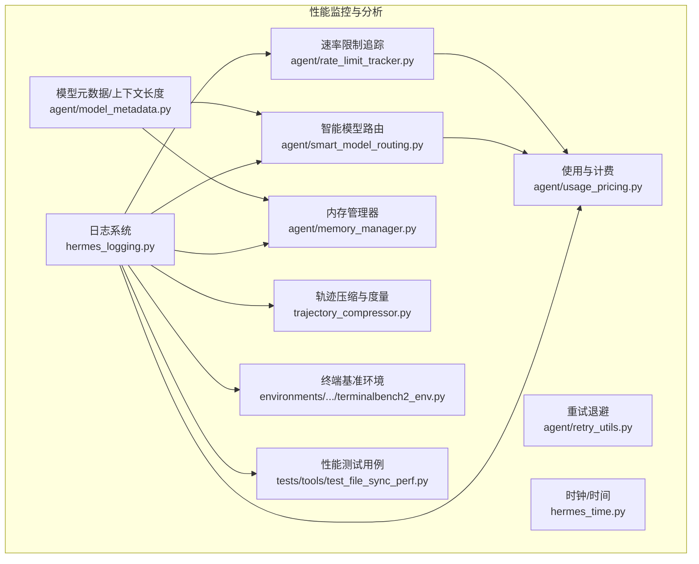

图表来源
- [agent/rate_limit_tracker.py:1-247](file://agent/rate_limit_tracker.py#L1-L247)
- [agent/usage_pricing.py:1-633](file://agent/usage_pricing.py#L1-L633)
- [agent/smart_model_routing.py:1-196](file://agent/smart_model_routing.py#L1-L196)
- [agent/memory_manager.py:1-363](file://agent/memory_manager.py#L1-L363)
- [agent/model_metadata.py:1-800](file://agent/model_metadata.py#L1-L800)
- [agent/retry_utils.py:1-58](file://agent/retry_utils.py#L1-L58)
- [hermes_time.py:1-105](file://hermes_time.py#L1-L105)
- [hermes_logging.py:1-395](file://hermes_logging.py#L1-L395)
- [trajectory_compressor.py:220-1225](file://trajectory_compressor.py#L220-L1225)
- [environments/benchmarks/terminalbench_2/terminalbench2_env.py:1-200](file://environments/benchmarks/terminalbench_2/terminalbench2_env.py#L1-L200)
- [tests/tools/test_file_sync_perf.py:43-78](file://tests/tools/test_file_sync_perf.py#L43-L78)

章节来源
- [agent/rate_limit_tracker.py:1-247](file://agent/rate_limit_tracker.py#L1-L247)
- [agent/usage_pricing.py:1-633](file://agent/usage_pricing.py#L1-L633)
- [agent/smart_model_routing.py:1-196](file://agent/smart_model_routing.py#L1-L196)
- [agent/memory_manager.py:1-363](file://agent/memory_manager.py#L1-L363)
- [agent/model_metadata.py:1-800](file://agent/model_metadata.py#L1-L800)
- [agent/retry_utils.py:1-58](file://agent/retry_utils.py#L1-L58)
- [hermes_time.py:1-105](file://hermes_time.py#L1-L105)
- [hermes_logging.py:1-395](file://hermes_logging.py#L1-L395)
- [trajectory_compressor.py:220-1225](file://trajectory_compressor.py#L220-L1225)
- [environments/benchmarks/terminalbench_2/terminalbench2_env.py:1-200](file://environments/benchmarks/terminalbench_2/terminalbench2_env.py#L1-L200)
- [tests/tools/test_file_sync_perf.py:43-78](file://tests/tools/test_file_sync_perf.py#L43-L78)

## 核心组件
- 速率限制追踪：解析并格式化x-ratelimit-*头，提供分钟/小时窗口的请求与令牌配额、剩余量、重置倒计时等信息，并生成人类可读的展示文本与紧凑摘要。
- 使用与计费：标准化不同供应商API的usage字段，计算输入/输出/缓存读写/请求的费用，支持官方文档快照、OpenRouter模型API、自定义端点等多源定价。
- 智能模型路由：基于消息复杂度启发式规则选择“便宜模型”路由，避免在简单对话中消耗更强模型资源；失败回退到主模型配置。
- 模型元数据与上下文长度：从OpenRouter、自定义端点、本地服务器探测模型上下文长度，提供缓存与错误解析能力，支撑上下文压力评估与预检。
- 内存管理器：统一编排内置与外部插件记忆提供者，负责预取、同步、工具路由与生命周期钩子，降低跨提供者的耦合与失败传播。
- 重试退避：采用带抖动的去相关退避策略，防止并发会话同时重试导致的“惊群效应”，提升整体稳定性。
- 日志系统：集中化日志、按组件分流、轮转与脱敏，支持会话级上下文标记，便于定位性能瓶颈与异常。
- 轨迹压缩与度量：统计压缩前后token数、移除回合数、汇总API调用次数与错误、处理时长与吞吐，形成可复现的性能报告。

章节来源
- [agent/rate_limit_tracker.py:92-247](file://agent/rate_limit_tracker.py#L92-L247)
- [agent/usage_pricing.py:27-557](file://agent/usage_pricing.py#L27-L557)
- [agent/smart_model_routing.py:62-196](file://agent/smart_model_routing.py#L62-L196)
- [agent/model_metadata.py:427-679](file://agent/model_metadata.py#L427-L679)
- [agent/memory_manager.py:72-363](file://agent/memory_manager.py#L72-L363)
- [agent/retry_utils.py:19-58](file://agent/retry_utils.py#L19-L58)
- [hermes_logging.py:161-266](file://hermes_logging.py#L161-L266)
- [trajectory_compressor.py:220-1225](file://trajectory_compressor.py#L220-L1225)

## 架构总览
下图展示了性能相关模块之间的交互关系与数据流：

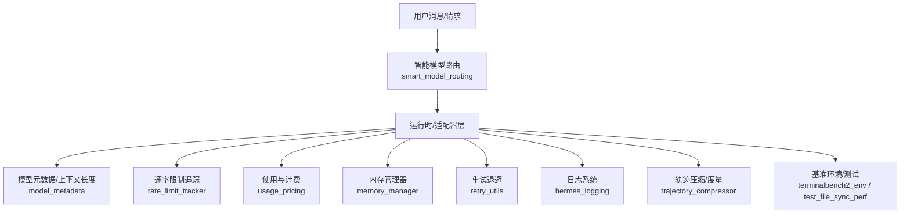

图表来源
- [agent/smart_model_routing.py:110-196](file://agent/smart_model_routing.py#L110-L196)
- [agent/model_metadata.py:427-679](file://agent/model_metadata.py#L427-L679)
- [agent/rate_limit_tracker.py:92-247](file://agent/rate_limit_tracker.py#L92-L247)
- [agent/usage_pricing.py:390-557](file://agent/usage_pricing.py#L390-L557)
- [agent/memory_manager.py:167-210](file://agent/memory_manager.py#L167-L210)
- [agent/retry_utils.py:19-58](file://agent/retry_utils.py#L19-L58)
- [hermes_logging.py:161-266](file://hermes_logging.py#L161-L266)
- [trajectory_compressor.py:220-1225](file://trajectory_compressor.py#L220-L1225)
- [environments/benchmarks/terminalbench_2/terminalbench2_env.py:1-200](file://environments/benchmarks/terminalbench_2/terminalbench2_env.py#L1-L200)
- [tests/tools/test_file_sync_perf.py:43-78](file://tests/tools/test_file_sync_perf.py#L43-L78)

## 详细组件分析

### 速率限制追踪（Rate Limit Tracking）
- 数据来源：HTTP响应头x-ratelimit-*系列字段，覆盖每分钟/每小时请求与令牌限额、剩余量、重置倒计时。
- 关键能力：
  - 解析与归一化：大小写无关解析、缺失字段安全回退。
  - 状态建模：RateLimitBucket与RateLimitState，提供已用/占比、剩余秒数等派生属性。
  - 可读展示：人类友好格式化、紧凑摘要、警告阈值提示。
- 应用场景：在网关或CLI中显示/记录当前配额状态，辅助路由决策与节流策略。

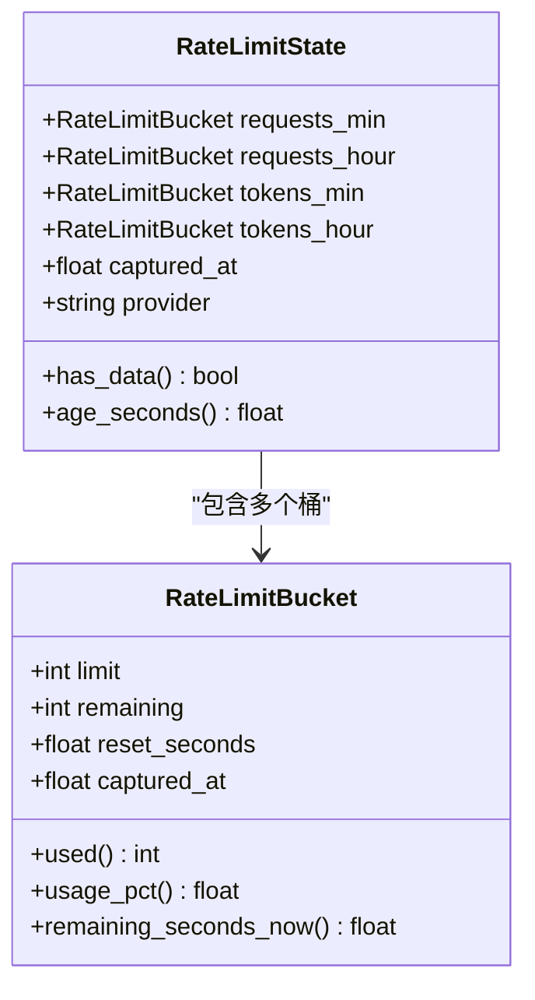

图表来源
- [agent/rate_limit_tracker.py:30-129](file://agent/rate_limit_tracker.py#L30-L129)

章节来源
- [agent/rate_limit_tracker.py:92-247](file://agent/rate_limit_tracker.py#L92-L247)

### 使用与计费（Usage & Pricing）
- 使用标准化：统一Anthropic/Codex/OpenAI等不同API的usage结构，分离缓存读写与输入/输出token，提取推理token。
- 计费计算：按模型+路由解析定价条目，支持官方文档快照、OpenRouter模型API、自定义端点模型API与订阅包含模式，计算费用并标注状态与来源。
- 输出：CostResult对象，包含金额、状态、标签、版本与备注，便于UI展示与审计。

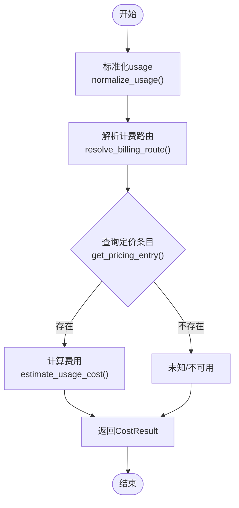

图表来源
- [agent/usage_pricing.py:306-557](file://agent/usage_pricing.py#L306-L557)

章节来源
- [agent/usage_pricing.py:27-557](file://agent/usage_pricing.py#L27-L557)

### 智能模型路由（Smart Model Routing）
- 规则引擎：基于字符数、词数、换行数、代码块标记、URL、关键词集合等启发式判断是否走“便宜模型”。
- 回退策略：若不满足简单条件，回退到主模型配置；路由失败时同样回退。
- 运行时解析：根据路由配置解析实际运行时参数（API密钥、基础URL等），失败时回退。

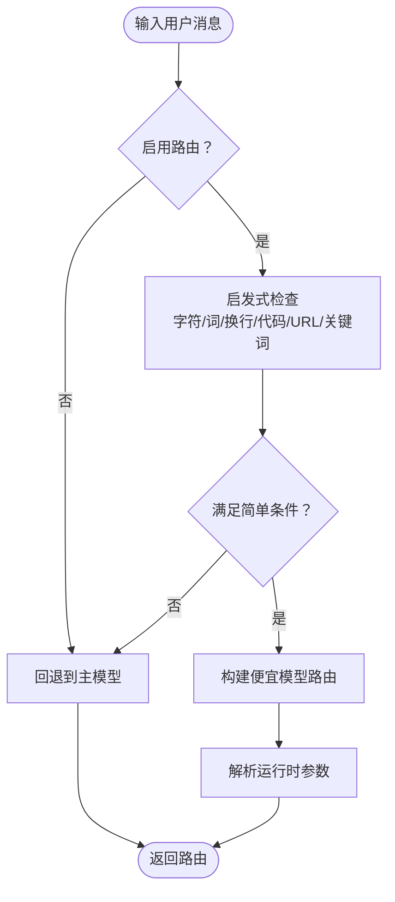

图表来源
- [agent/smart_model_routing.py:62-196](file://agent/smart_model_routing.py#L62-L196)

章节来源
- [agent/smart_model_routing.py:62-196](file://agent/smart_model_routing.py#L62-L196)

### 模型元数据与上下文长度（Model Metadata）
- 多源获取：OpenRouter模型列表、自定义端点的/models接口、本地服务器探测（Ollama/LM Studio/llama.cpp/vLLM）。
- 缓存与持久化：内存缓存与磁盘持久化，减少重复探测成本。
- 错误解析：从API错误中提取上下文上限与可用输出token，指导调参与降级。

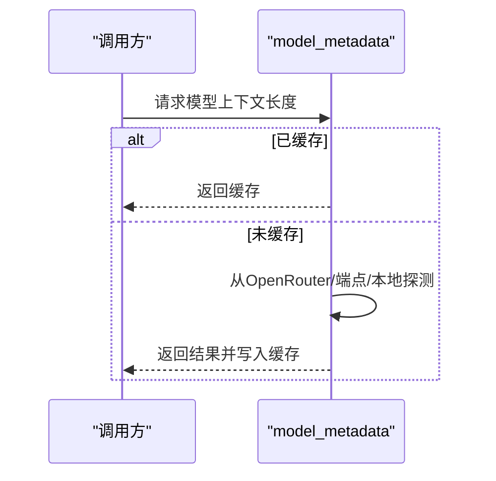

图表来源
- [agent/model_metadata.py:427-679](file://agent/model_metadata.py#L427-L679)

章节来源
- [agent/model_metadata.py:427-679](file://agent/model_metadata.py#L427-L679)

### 内存管理器（Memory Manager）
- 统一编排：内置提供者优先注册，最多允许一个外部提供者；失败不阻断其他提供者。
- 生命周期：初始化、预取、同步、工具路由、委托完成通知、关闭等钩子。
- 安全与隔离：工具schema冲突检测与告警，失败日志记录。

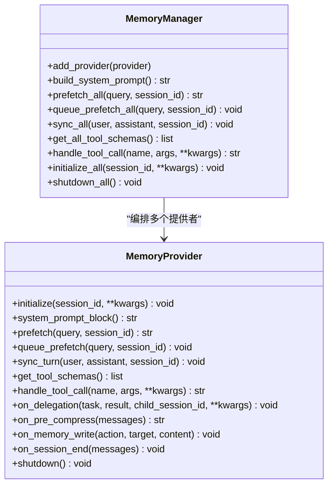

图表来源
- [agent/memory_manager.py:72-363](file://agent/memory_manager.py#L72-L363)

章节来源
- [agent/memory_manager.py:72-363](file://agent/memory_manager.py#L72-L363)

### 重试退避（Jittered Backoff）
- 策略：指数退避叠加随机抖动，使用单调计数器与时间戳混合种子确保并发去相关。
- 参数：基础延迟、最大延迟、抖动比例，避免重试风暴。

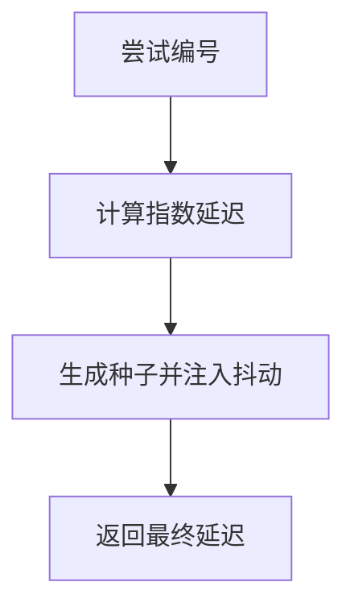

图表来源
- [agent/retry_utils.py:19-58](file://agent/retry_utils.py#L19-L58)

章节来源
- [agent/retry_utils.py:19-58](file://agent/retry_utils.py#L19-L58)

### 日志系统（Centralized Logging）
- 组件分流：gateway.log仅接收gateway前缀记录，agent.log为主通道，errors.log仅WARNING+。
- 会话上下文：线程本地存储注入session_tag，便于关联同一会话的性能事件。
- 轮转与脱敏：RotatingFileHandler + RedactingFormatter，支持受控的DEBUG输出。

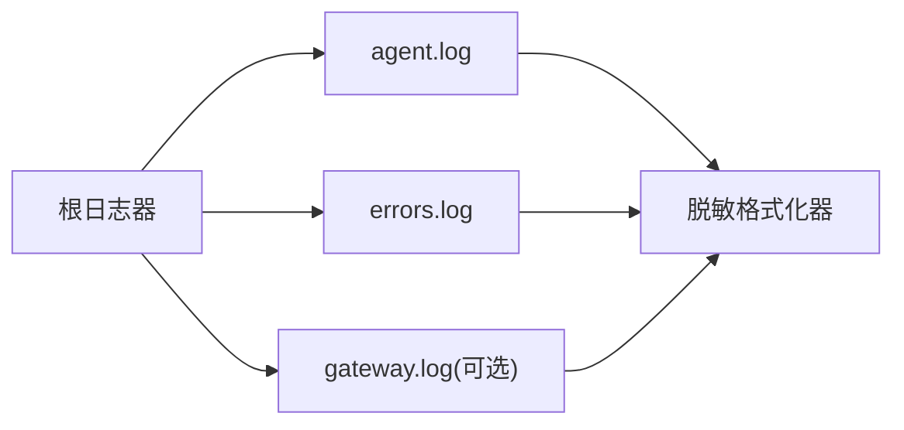

图表来源
- [hermes_logging.py:161-266](file://hermes_logging.py#L161-L266)

章节来源
- [hermes_logging.py:161-266](file://hermes_logging.py#L161-L266)

### 轨迹压缩与度量（Trajectory Compression Metrics）
- 指标聚合：累计轨迹数、压缩前后token数、移除回合数、汇总API调用与错误、处理时长与吞吐。
- 报告输出：控制台格式化打印，包含开始/结束时间、持续时间、成功率等。

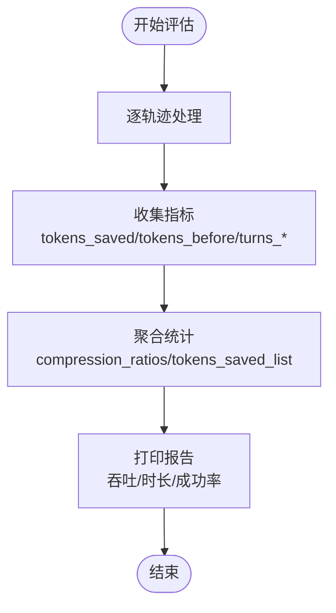

图表来源
- [trajectory_compressor.py:220-1225](file://trajectory_compressor.py#L220-L1225)

章节来源
- [trajectory_compressor.py:220-1225](file://trajectory_compressor.py#L220-L1225)

## 依赖关系分析
- 模块内聚与耦合：
  - 速率限制与计费：低耦合，前者提供状态，后者消费状态并进行费用计算。
  - 智能路由：依赖utils与运行时解析，失败即回退，保持高可用。
  - 元数据与内存：元数据用于上下文预检与路由决策，内存管理器作为上下文承载层。
  - 日志：贯穿所有模块，提供统一观测入口。
- 外部依赖：
  - HTTP客户端（requests/httpx）用于模型元数据与端点探测。
  - 文件系统与轮转日志器用于日志持久化。
  - SQLite（在网关响应存储中使用）用于短期缓存与LRU淘汰。

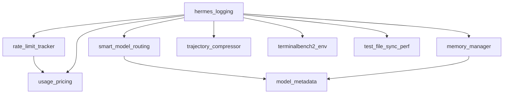

图表来源
- [agent/rate_limit_tracker.py:92-247](file://agent/rate_limit_tracker.py#L92-L247)
- [agent/usage_pricing.py:306-557](file://agent/usage_pricing.py#L306-L557)
- [agent/smart_model_routing.py:139-196](file://agent/smart_model_routing.py#L139-L196)
- [agent/model_metadata.py:427-679](file://agent/model_metadata.py#L427-L679)
- [agent/memory_manager.py:72-363](file://agent/memory_manager.py#L72-L363)
- [hermes_logging.py:161-266](file://hermes_logging.py#L161-L266)
- [trajectory_compressor.py:220-1225](file://trajectory_compressor.py#L220-L1225)
- [environments/benchmarks/terminalbench_2/terminalbench2_env.py:1-200](file://environments/benchmarks/terminalbench_2/terminalbench2_env.py#L1-L200)
- [tests/tools/test_file_sync_perf.py:43-78](file://tests/tools/test_file_sync_perf.py#L43-L78)

章节来源
- [agent/rate_limit_tracker.py:92-247](file://agent/rate_limit_tracker.py#L92-L247)
- [agent/usage_pricing.py:306-557](file://agent/usage_pricing.py#L306-L557)
- [agent/smart_model_routing.py:139-196](file://agent/smart_model_routing.py#L139-L196)
- [agent/model_metadata.py:427-679](file://agent/model_metadata.py#L427-L679)
- [agent/memory_manager.py:72-363](file://agent/memory_manager.py#L72-L363)
- [hermes_logging.py:161-266](file://hermes_logging.py#L161-L266)
- [trajectory_compressor.py:220-1225](file://trajectory_compressor.py#L220-L1225)
- [environments/benchmarks/terminalbench_2/terminalbench2_env.py:1-200](file://environments/benchmarks/terminalbench_2/terminalbench2_env.py#L1-L200)
- [tests/tools/test_file_sync_perf.py:43-78](file://tests/tools/test_file_sync_perf.py#L43-L78)

## 性能考量
- 响应时间
  - 通过速率限制追踪与计费模块结合，识别慢API与高费用路径，配合日志中的会话上下文快速定位。
  - 在智能路由中对简单任务走低成本模型，降低平均响应时间。
- 吞吐量
  - 使用轨迹压缩统计吞吐（轨迹/秒），结合重试退避减少失败重试对并发的影响。
  - 在基准环境中控制并发（如TerminalBench2的max_concurrent_tasks），避免资源争用导致吞吐下降。
- 资源使用率
  - 模型元数据探测与上下文长度缓存减少重复探测开销；内存管理器的异步预取与队列化降低主线程阻塞。
  - 日志系统采用轮转与脱敏，避免I/O成为瓶颈。

## 故障排查指南
- 速率限制告警
  - 使用速率限制展示函数查看各桶的使用百分比与剩余重置时间，当接近阈值（≥80%）时触发预警。
  - 若出现频繁重置，考虑降低并发或切换到更高配额的供应商。
- 计费异常
  - 检查路由解析与定价条目是否存在；若返回“未知/不可用”，确认模型名称、供应商与基础URL是否正确。
- 上下文超限
  - 利用错误解析函数提取可用输出token，动态调整max_tokens；必要时降低上下文长度或启用压缩。
- 并发重试风暴
  - 启用去相关抖动退避，避免多个会话在同一时刻重试；适当提高基础延迟与抖动比例。
- 日志定位
  - 设置会话上下文，过滤agent.log与errors.log；在gateway模式下使用gateway.log区分平台事件。

章节来源
- [agent/rate_limit_tracker.py:182-247](file://agent/rate_limit_tracker.py#L182-L247)
- [agent/usage_pricing.py:481-557](file://agent/usage_pricing.py#L481-L557)
- [agent/model_metadata.py:610-679](file://agent/model_metadata.py#L610-L679)
- [agent/retry_utils.py:19-58](file://agent/retry_utils.py#L19-L58)
- [hermes_logging.py:161-266](file://hermes_logging.py#L161-L266)

## 结论
通过将速率限制、计费、智能路由、上下文长度探测、内存管理与日志系统有机结合，Hermes Agent实现了对性能的全链路可观测与可控优化。建议在生产中：
- 开启会话上下文日志与组件分流
- 配置智能路由与合理的重试退避
- 建立元数据缓存与错误解析机制
- 使用轨迹压缩与基准测试持续评估吞吐与延迟

## 附录
- 性能基准测试实施要点
  - 使用TerminalBench2环境进行端到端评估，关注整体通过率、类别分解与评估时长。
  - 使用文件同步性能测试用例测量本地命令执行的延迟分布（中位数/均值/P95）。
  - 将轨迹压缩度量纳入回归基线，观察token节省与吞吐变化。

章节来源
- [environments/benchmarks/terminalbench_2/terminalbench2_env.py:903-934](file://environments/benchmarks/terminalbench_2/terminalbench2_env.py#L903-L934)
- [tests/tools/test_file_sync_perf.py:43-78](file://tests/tools/test_file_sync_perf.py#L43-L78)
- [trajectory_compressor.py:220-1225](file://trajectory_compressor.py#L220-L1225)