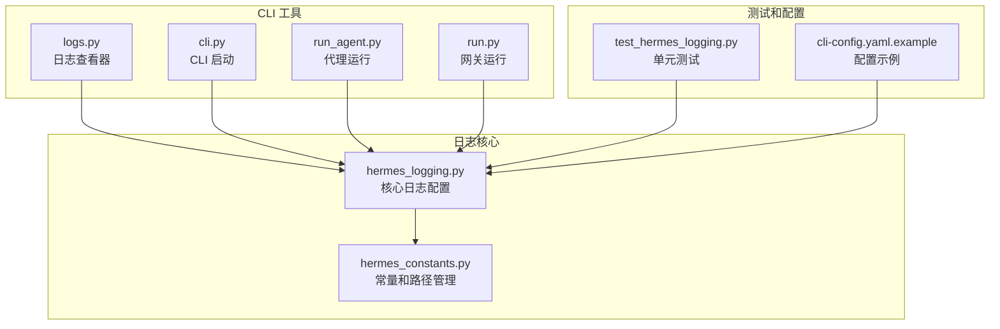
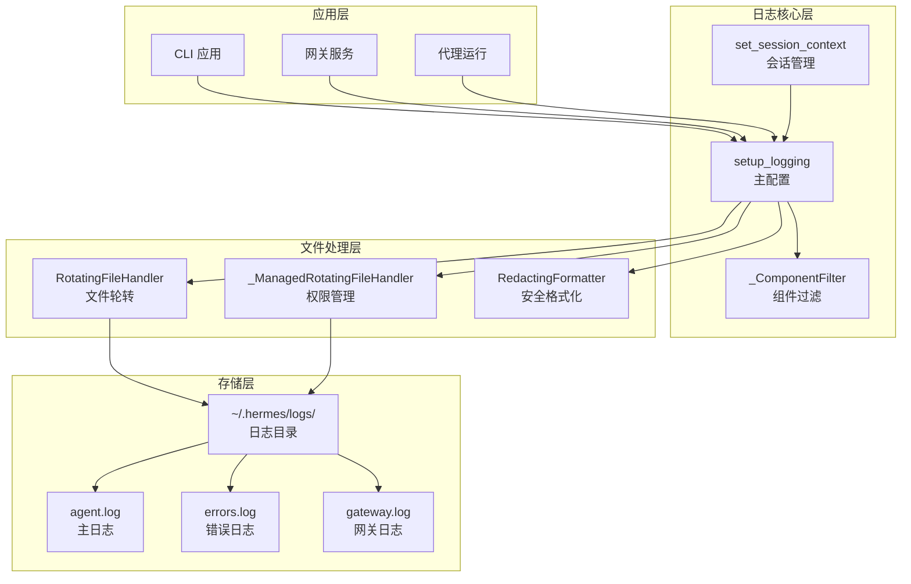
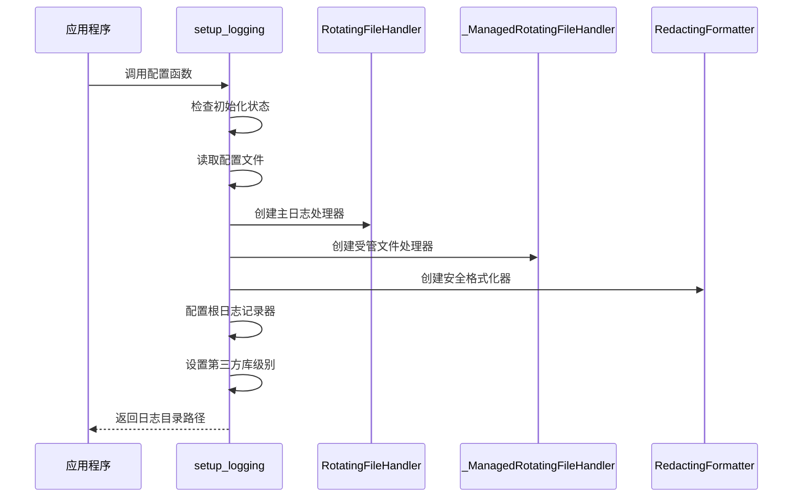
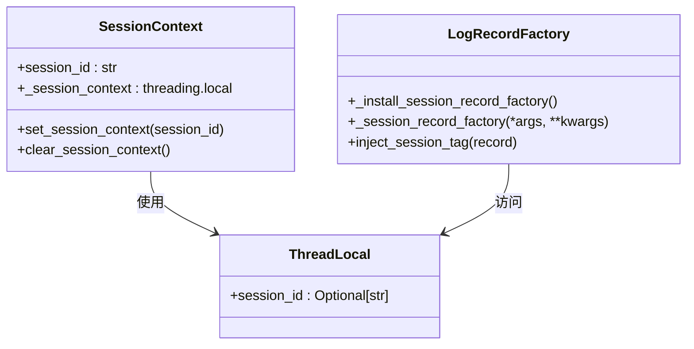
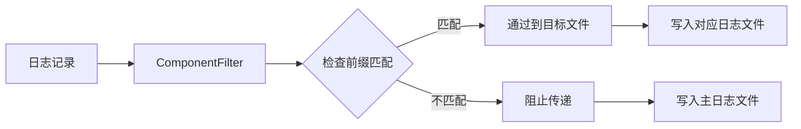
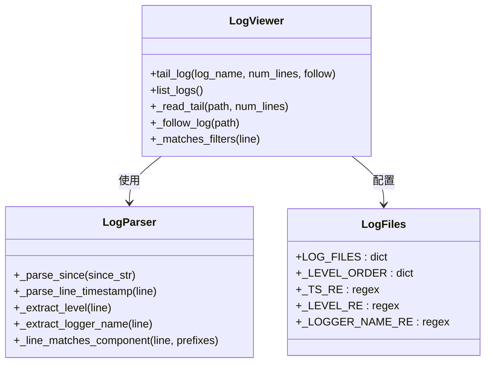
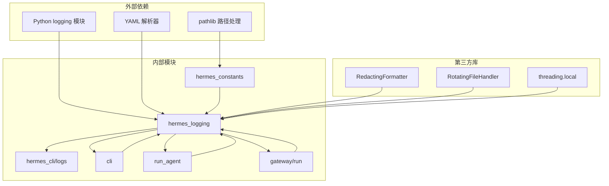
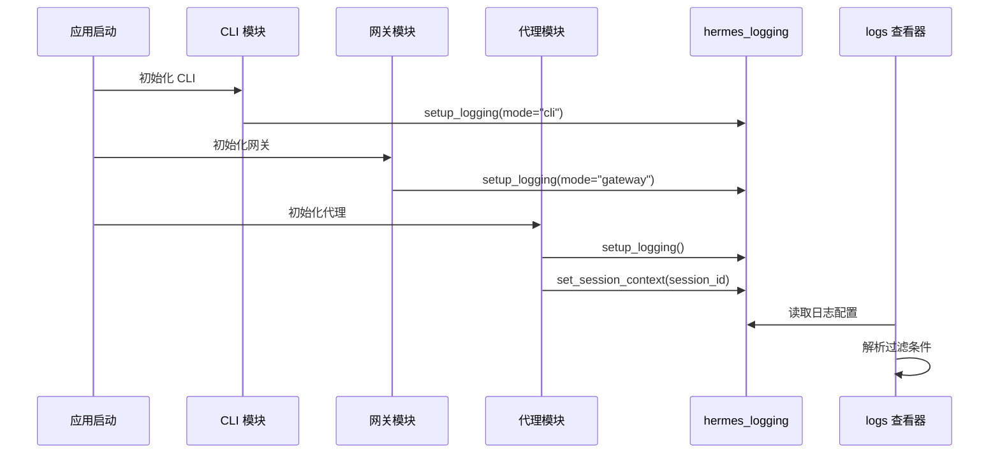
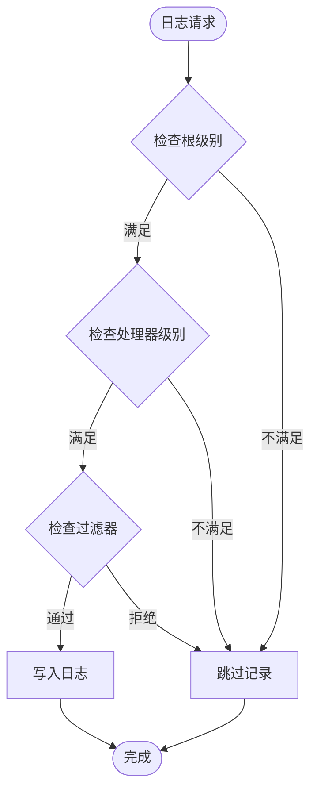

# 日志系统配置

<cite>
**本文档引用的文件**
- [hermes_logging.py](file://hermes_logging.py)
- [logs.py](file://hermes_cli/logs.py)
- [hermes_constants.py](file://hermes_constants.py)
- [cli.py](file://cli.py)
- [run_agent.py](file://run_agent.py)
- [run.py](file://gateway/run.py)
- [test_hermes_logging.py](file://tests/test_hermes_logging.py)
- [cli-config.yaml.example](file://cli-config.yaml.example)
</cite>

## 目录
1. [简介](#简介)
2. [项目结构](#项目结构)
3. [核心组件](#核心组件)
4. [架构概览](#架构概览)
5. [详细组件分析](#详细组件分析)
6. [依赖关系分析](#依赖关系分析)
7. [性能考虑](#性能考虑)
8. [故障排除指南](#故障排除指南)
9. [结论](#结论)
10. [附录](#附录)

## 简介

Hermes Agent 的日志系统是一个集中化的、模块化的日志管理解决方案，专为大型 AI 代理系统设计。该系统提供了多级别的日志记录、智能的文件轮转、会话上下文追踪以及强大的日志分析功能。

日志系统的核心特点包括：
- **集中化配置**：通过单一入口点 `setup_logging()` 进行全局配置
- **多文件管理**：自动创建和管理多个专用日志文件
- **智能轮转**：基于大小的自动文件轮转机制
- **会话追踪**：支持按会话 ID 过滤和关联日志
- **组件分离**：不同模块的日志独立管理
- **安全过滤**：自动过滤敏感信息，防止明文泄露

## 项目结构

Hermes Agent 的日志系统分布在以下关键文件中：



**图表来源**
- [hermes_logging.py:1-395](file://hermes_logging.py#L1-L395)
- [logs.py:1-391](file://hermes_cli/logs.py#L1-L391)
- [cli.py:525-535](file://cli.py#L525-L535)

**章节来源**
- [hermes_logging.py:1-395](file://hermes_logging.py#L1-L395)
- [hermes_constants.py:1-301](file://hermes_constants.py#L1-L301)

## 核心组件

### 日志配置核心

日志系统的核心是 `hermes_logging.py` 文件，它提供了完整的日志配置和管理功能：

#### 主要功能模块

1. **集中式日志设置** (`setup_logging()`)
   - 创建并配置所有日志处理器
   - 设置日志级别和格式
   - 管理文件轮转和备份

2. **会话上下文管理**
   - 支持按会话 ID 过滤日志
   - 线程本地存储确保上下文隔离
   - 自动注入会话标签到日志记录

3. **组件分离机制**
   - 不同模块的日志独立处理
   - 基于前缀的路由过滤
   - 专用的网关日志文件

**章节来源**
- [hermes_logging.py:161-265](file://hermes_logging.py#L161-L265)
- [hermes_logging.py:72-88](file://hermes_logging.py#L72-L88)
- [hermes_logging.py:131-154](file://hermes_logging.py#L131-L154)

### 日志文件管理

系统自动生成以下核心日志文件：

| 文件名 | 用途 | 默认级别 | 备份数量 |
|--------|------|----------|----------|
| `agent.log` | 主要活动日志 | INFO | 3 |
| `errors.log` | 错误和警告日志 | WARNING | 2 |
| `gateway.log` | 网关特定事件 | INFO | 3（仅网关模式） |

**章节来源**
- [hermes_logging.py:224-254](file://hermes_logging.py#L224-L254)

## 架构概览



**图表来源**
- [hermes_logging.py:161-265](file://hermes_logging.py#L161-L265)
- [hermes_logging.py:304-372](file://hermes_logging.py#L304-L372)

## 详细组件分析

### 日志配置组件

#### setup_logging() 函数详解



**图表来源**
- [hermes_logging.py:161-265](file://hermes_logging.py#L161-L265)

#### 关键配置参数

| 参数 | 类型 | 默认值 | 描述 |
|------|------|--------|------|
| `hermes_home` | Path | `get_hermes_home()` | 日志目录根路径 |
| `log_level` | str | "INFO" | 主日志文件的最小级别 |
| `max_size_mb` | int | 5 | 单个文件最大大小(MB) |
| `backup_count` | int | 3 | 保留的备份文件数量 |
| `mode` | str | None | 运行模式(cli/gateway/cron) |
| `force` | bool | False | 强制重新初始化 |

**章节来源**
- [hermes_logging.py:161-201](file://hermes_logging.py#L161-L201)

### 会话上下文管理

#### 线程本地存储机制



**图表来源**
- [hermes_logging.py:72-124](file://hermes_logging.py#L72-L124)

#### 会话标签注入流程

```mermaid
flowchart TD
Start([开始日志记录]) --> CheckContext{检查会话上下文}
CheckContext --> |有上下文| GetSessionId[获取 session_id]
CheckContext --> |无上下文| NoTag[无会话标签]
GetSessionId --> InjectTag[注入 [session_id] 标签]
NoTag --> Continue[继续处理]
InjectTag --> Continue
Continue --> End([完成记录])
```

**图表来源**
- [hermes_logging.py:95-124](file://hermes_logging.py#L95-L124)

**章节来源**
- [hermes_logging.py:72-124](file://hermes_logging.py#L72-L124)

### 组件过滤机制

#### 组件前缀映射

| 组件 | 前缀列表 |
|------|----------|
| `gateway` | `("gateway",)` |
| `agent` | `("agent", "run_agent", "model_tools", "batch_runner")` |
| `tools` | `("tools",)` |
| `cli` | `("hermes_cli", "cli")` |
| `cron` | `("cron",)` |

#### 过滤器工作原理



**图表来源**
- [hermes_logging.py:131-154](file://hermes_logging.py#L131-L154)

**章节来源**
- [hermes_logging.py:131-154](file://hermes_logging.py#L131-L154)

### 日志查看器组件

#### hermes logs 命令功能



**图表来源**
- [logs.py:138-391](file://hermes_cli/logs.py#L138-L391)

#### 支持的过滤选项

| 过滤类型 | 参数 | 描述 |
|----------|------|------|
| 级别过滤 | `--level` | 按日志级别过滤(DEBUG/INFO/WARNING/ERROR/CRITICAL) |
| 时间范围 | `--since` | 按相对时间过滤(如 "1h", "30m", "2d") |
| 会话过滤 | `--session` | 按会话 ID 子串过滤 |
| 组件过滤 | `--component` | 按组件名称过滤(gateway/tools/cli等) |
| 实时跟踪 | `-f` | 实时跟随日志文件 |

**章节来源**
- [logs.py:138-247](file://hermes_cli/logs.py#L138-L247)

## 依赖关系分析

### 核心依赖图



**图表来源**
- [hermes_logging.py:26-33](file://hermes_logging.py#L26-L33)
- [cli.py:528-530](file://cli.py#L528-L530)

### 模块间交互



**图表来源**
- [cli.py:528-530](file://cli.py#L528-L530)
- [run.py:8792-8793](file://gateway/run.py#L8792-L8793)
- [run_agent.py:7577-7578](file://run_agent.py#L7577-L7578)

**章节来源**
- [cli.py:528-530](file://cli.py#L528-L530)
- [run.py:8792-8793](file://gateway/run.py#L8792-L8793)
- [run_agent.py:7577-7578](file://run_agent.py#L7577-L7578)

## 性能考虑

### 文件轮转优化

日志系统采用智能的文件轮转策略来平衡存储空间和性能：

1. **内存效率**
   - 大文件采用分块读取策略
   - 最后 N 行读取优化，避免全文件扫描
   - 内存使用与文件大小成对数关系

2. **磁盘 I/O 优化**
   - 批量写入减少系统调用次数
   - 权限管理在文件创建和轮转时进行
   - 智能缓存避免重复的文件系统查询

3. **并发安全性**
   - 线程本地存储确保会话上下文隔离
   - 受管文件处理器保证组可写权限
   - 幂等性设计避免重复初始化

### 日志级别优化



**图表来源**
- [hermes_logging.py:256-262](file://hermes_logging.py#L256-L262)

## 故障排除指南

### 常见问题诊断

#### 日志文件未生成

**可能原因**：
1. 日志系统未正确初始化
2. 权限问题导致文件创建失败
3. HERMES_HOME 环境变量配置错误

**解决步骤**：
1. 检查日志初始化是否成功
2. 验证 `~/.hermes/logs/` 目录权限
3. 确认 `HERMES_HOME` 环境变量设置

#### 日志级别不生效

**可能原因**：
1. 根日志记录器级别设置过高
2. 处理器级别覆盖了预期行为
3. 配置文件加载失败

**解决步骤**：
1. 检查根日志记录器级别
2. 验证处理器级别设置
3. 确认配置文件格式正确

#### 会话过滤无效

**可能原因**：
1. 会话上下文未正确设置
2. 线程本地存储冲突
3. 格式化器未正确注入标签

**解决步骤**：
1. 确保在会话开始时调用 `set_session_context()`
2. 验证线程隔离机制
3. 检查格式化器配置

**章节来源**
- [test_hermes_logging.py:61-226](file://tests/test_hermes_logging.py#L61-L226)
- [test_hermes_logging.py:313-404](file://tests/test_hermes_logging.py#L313-L404)

### 性能监控指标

| 指标类型 | 正常范围 | 监控方法 |
|----------|----------|----------|
| 日志文件大小 | < 500MB | `hermes logs list` |
| 处理器数量 | 1-3 个 | 检查根记录器处理器 |
| 会话标签完整性 | 100% | 分析 agent.log 内容 |
| 第三方库级别 | WARNING+ | 检查噪声抑制效果 |

## 结论

Hermes Agent 的日志系统提供了一个完整、高效且安全的日志管理解决方案。其设计特点包括：

1. **模块化架构**：清晰的职责分离和组件边界
2. **安全性优先**：自动敏感信息过滤和权限管理
3. **性能优化**：智能轮转和内存效率设计
4. **易用性**：直观的命令行工具和配置选项
5. **可扩展性**：支持多种运行模式和组件分离

该系统能够有效支持从开发调试到生产监控的全生命周期需求，为大型 AI 代理系统的可观测性和维护性提供了坚实基础。

## 附录

### 配置参数参考

#### 日志配置文件 (config.yaml)

```yaml
logging:
  level: INFO          # 日志级别 (DEBUG/INFO/WARNING/ERROR/CRITICAL)
  max_size_mb: 5       # 单文件最大大小(MB)
  backup_count: 3      # 备份数量
```

#### 环境变量

| 变量名 | 默认值 | 描述 |
|--------|--------|------|
| `HERMES_HOME` | `~/.hermes` | 日志目录根路径 |
| `OPENROUTER_API_KEY` | 无 | OpenRouter API 密钥 |
| `ANTHROPIC_API_KEY` | 无 | Anthropic API 密钥 |

#### 命令行选项

```bash
# 基本使用
hermes logs                    # 查看最近 50 行 agent.log
hermes logs -f                 # 实时跟踪日志
hermes logs errors             # 查看错误日志
hermes logs gateway -n 100     # 查看网关日志的最后 100 行

# 过滤选项
hermes logs --level WARNING    # 只显示 WARNING 及以上级别
hermes logs --session abc123   # 按会话 ID 过滤
hermes logs --component tools  # 只显示工具相关日志
hermes logs --since 1h         # 显示最近 1 小时的日志
hermes logs --since 30m -f     # 实时跟踪最近 30 分钟的日志
```