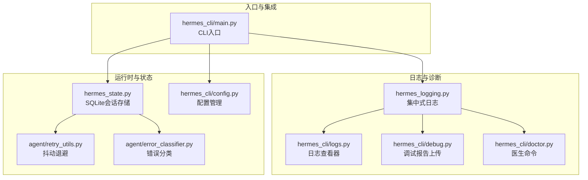
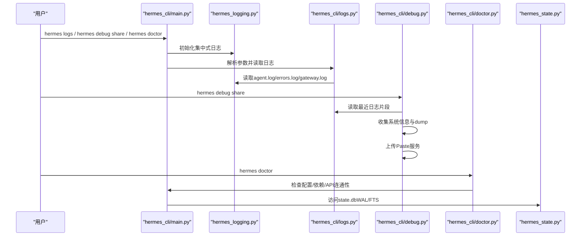
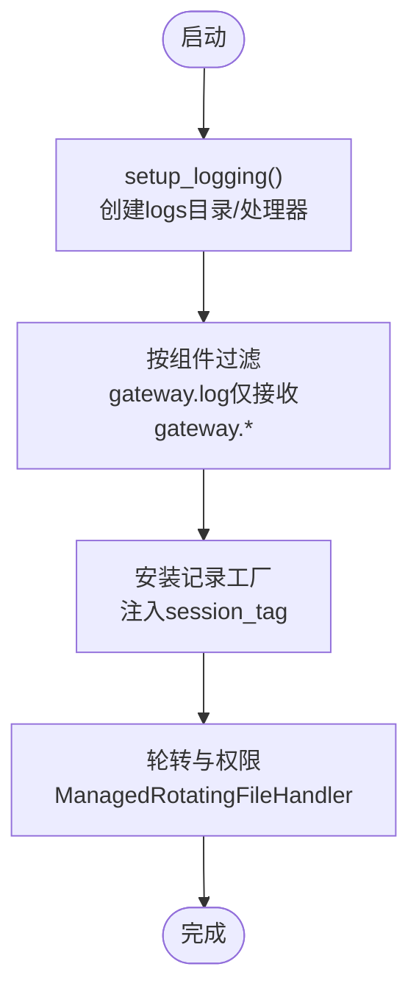
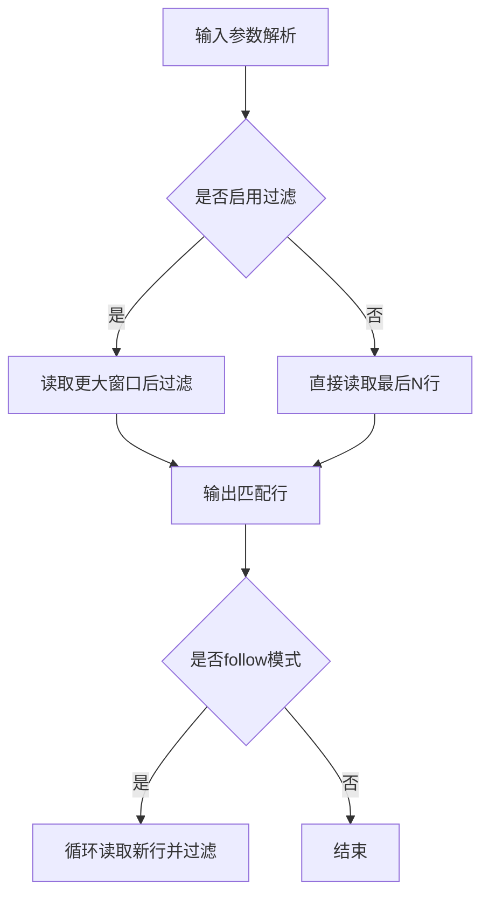
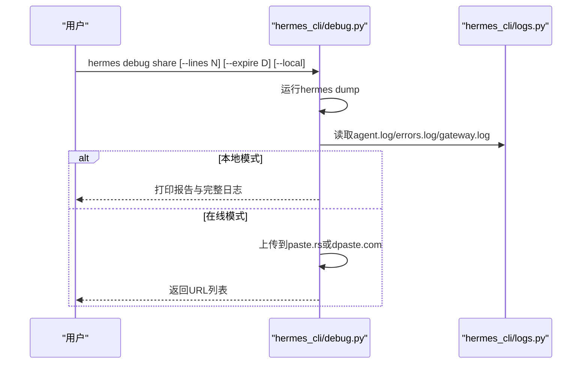
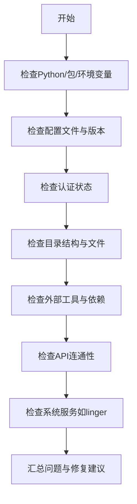
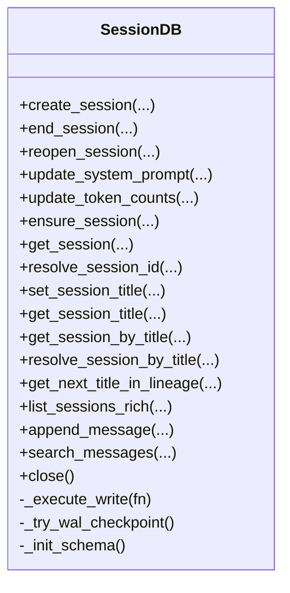
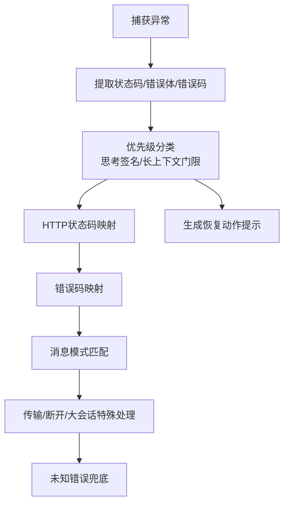
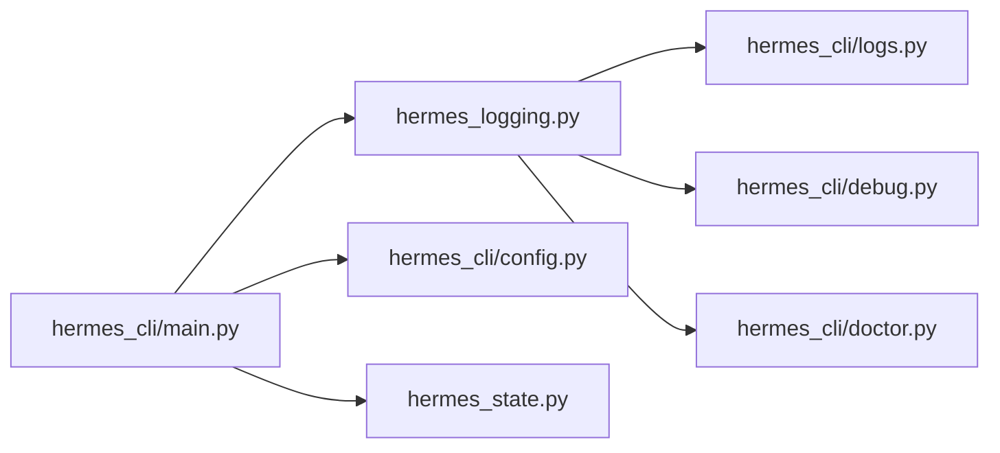

# 调试与性能分析

<cite>
**本文引用的文件**
- [hermes_logging.py](file://hermes_logging.py)
- [hermes_cli/logs.py](file://hermes_cli/logs.py)
- [hermes_cli/debug.py](file://hermes_cli/debug.py)
- [hermes_cli/doctor.py](file://hermes_cli/doctor.py)
- [hermes_state.py](file://hermes_state.py)
- [agent/retry_utils.py](file://agent/retry_utils.py)
- [agent/error_classifier.py](file://agent/error_classifier.py)
- [hermes_cli/main.py](file://hermes_cli/main.py)
- [hermes_cli/config.py](file://hermes_cli/config.py)
</cite>

## 目录
1. [简介](#简介)
2. [项目结构](#项目结构)
3. [核心组件](#核心组件)
4. [架构总览](#架构总览)
5. [详细组件分析](#详细组件分析)
6. [依赖分析](#依赖分析)
7. [性能考虑](#性能考虑)
8. [故障排查指南](#故障排查指南)
9. [结论](#结论)
10. [附录](#附录)

## 简介
本指南面向Hermes Agent开发者与运维人员，系统化讲解调试与性能分析方法，覆盖以下主题：
- 日志系统配置与使用（集中式日志、会话上下文、组件路由）
- 常见问题诊断与解决步骤（环境、配置、网络、API连通性）
- 性能瓶颈识别与分析（内存、CPU、网络延迟）
- 代码级性能优化最佳实践与案例
- 错误追踪与异常处理调试
- 生产环境问题排查流程与工具
- 性能基准测试与压力测试实施建议

## 项目结构
围绕调试与性能分析的关键模块如下：
- 日志子系统：集中式日志初始化、文件轮转、组件过滤、会话上下文注入
- CLI日志查看器：tail/follow、级别过滤、会话过滤、组件过滤、时间范围过滤
- 调试报告：自动收集系统信息、日志摘要、上传到Paste服务
- 医生命令：自动化诊断环境、配置、依赖、API连通性、外部工具状态
- 状态存储：SQLite会话数据库、WAL并发写入、触发器与FTS全文检索
- 重试与错误分类：抖动退避、错误类型化解析与恢复策略
- CLI入口：统一初始化日志、IPv4偏好、容器模式、会话解析等

图表来源
- [hermes_logging.py:161-265](file://hermes_logging.py#L161-L265)
- [hermes_cli/logs.py:138-247](file://hermes_cli/logs.py#L138-L247)
- [hermes_cli/debug.py:247-337](file://hermes_cli/debug.py#L247-L337)
- [hermes_cli/doctor.py:162-800](file://hermes_cli/doctor.py#L162-L800)
- [hermes_state.py:115-350](file://hermes_state.py#L115-L350)
- [agent/retry_utils.py:19-58](file://agent/retry_utils.py#L19-L58)
- [agent/error_classifier.py:222-396](file://agent/error_classifier.py#L222-L396)
- [hermes_cli/main.py:146-165](file://hermes_cli/main.py#L146-L165)
- [hermes_cli/config.py:203-214](file://hermes_cli/config.py#L203-L214)

章节来源
- [hermes_logging.py:161-265](file://hermes_logging.py#L161-L265)
- [hermes_cli/logs.py:138-247](file://hermes_cli/logs.py#L138-L247)
- [hermes_cli/debug.py:247-337](file://hermes_cli/debug.py#L247-L337)
- [hermes_cli/doctor.py:162-800](file://hermes_cli/doctor.py#L162-L800)
- [hermes_state.py:115-350](file://hermes_state.py#L115-L350)
- [agent/retry_utils.py:19-58](file://agent/retry_utils.py#L19-L58)
- [agent/error_classifier.py:222-396](file://agent/error_classifier.py#L222-L396)
- [hermes_cli/main.py:146-165](file://hermes_cli/main.py#L146-L165)
- [hermes_cli/config.py:203-214](file://hermes_cli/config.py#L203-L214)

## 核心组件
- 集中式日志系统：支持多处理器（agent.log/info、errors.log/warning+、gateway.log按组件路由）、会话上下文注入、安全格式化、轮转与权限控制
- 日志查看器：支持tail/follow、级别/会话/组件/时间过滤、高效读取大文件
- 调试报告：收集系统信息、hermes dump输出、截取关键日志、上传Paste服务
- 医生命令：检查Python版本、包依赖、配置文件、认证状态、目录结构、外部工具、API连通性、WAL大小与checkpoint
- 会话数据库：WAL模式、FTS5全文检索、触发器同步、写锁抖动重试、定期checkpoint
- 重试与错误分类：抖动指数退避、错误类型化解析（鉴权、配额、限流、过载、超时、上下文溢出、负载均衡等）

章节来源
- [hermes_logging.py:161-265](file://hermes_logging.py#L161-L265)
- [hermes_cli/logs.py:138-247](file://hermes_cli/logs.py#L138-L247)
- [hermes_cli/debug.py:247-337](file://hermes_cli/debug.py#L247-L337)
- [hermes_cli/doctor.py:162-800](file://hermes_cli/doctor.py#L162-L800)
- [hermes_state.py:115-350](file://hermes_state.py#L115-L350)
- [agent/retry_utils.py:19-58](file://agent/retry_utils.py#L19-L58)
- [agent/error_classifier.py:222-396](file://agent/error_classifier.py#L222-L396)

## 架构总览
下图展示调试与性能分析相关模块之间的交互关系。

图表来源
- [hermes_cli/main.py:146-165](file://hermes_cli/main.py#L146-L165)
- [hermes_logging.py:161-265](file://hermes_logging.py#L161-L265)
- [hermes_cli/logs.py:138-247](file://hermes_cli/logs.py#L138-L247)
- [hermes_cli/debug.py:247-337](file://hermes_cli/debug.py#L247-L337)
- [hermes_cli/doctor.py:162-800](file://hermes_cli/doctor.py#L162-L800)
- [hermes_state.py:115-350](file://hermes_state.py#L115-L350)

## 详细组件分析

### 日志系统（集中式）
- 多处理器：agent.log（INFO+）、errors.log（WARNING+）、gateway.log（INFO+，按组件过滤）
- 会话上下文：线程本地存储注入session_tag，便于按会话聚合日志
- 安全格式化：RedactingFormatter避免敏感信息落盘
- 轮转与权限：RotatingFileHandler + ManagedRotatingFileHandler（NixOS setgid场景）
- 组件路由：_ComponentFilter按logger前缀将记录分流至不同文件
- 可配置项：日志级别、单文件最大大小、备份数量，来自config.yaml或参数

图表来源
- [hermes_logging.py:161-265](file://hermes_logging.py#L161-L265)
- [hermes_logging.py:336-372](file://hermes_logging.py#L336-L372)

章节来源
- [hermes_logging.py:161-265](file://hermes_logging.py#L161-L265)
- [hermes_logging.py:336-372](file://hermes_logging.py#L336-L372)

### 日志查看器（hermes logs）
- 功能：tail/follow、级别过滤（DEBUG/INFO/WARNING/ERROR/CRITICAL）、会话过滤（字符串匹配）、组件过滤（gateway/tools/cli等）、相对时间范围（如1h/30m/2d）
- 实现要点：正则解析时间戳/级别/logger名；按需读取尾部行；大文件高效读取（从末尾分块读取）；实时follow模式

图表来源
- [hermes_cli/logs.py:138-247](file://hermes_cli/logs.py#L138-L247)
- [hermes_cli/logs.py:249-332](file://hermes_cli/logs.py#L249-L332)

章节来源
- [hermes_cli/logs.py:138-247](file://hermes_cli/logs.py#L138-L247)
- [hermes_cli/logs.py:249-332](file://hermes_cli/logs.py#L249-L332)

### 调试报告（hermes debug share）
- 自动收集：执行hermes dump生成系统信息；截取agent.log/errors.log/gateway.log最近若干行
- 上传：优先paste.rs，失败回退dpaste.com；可选择本地打印而非上传
- 输出：汇总报告URL与完整日志URL，便于社区支持

图表来源
- [hermes_cli/debug.py:247-337](file://hermes_cli/debug.py#L247-L337)
- [hermes_cli/logs.py:138-247](file://hermes_cli/logs.py#L138-L247)

章节来源
- [hermes_cli/debug.py:247-337](file://hermes_cli/debug.py#L247-L337)
- [hermes_cli/logs.py:138-247](file://hermes_cli/logs.py#L138-L247)

### 医生命令（hermes doctor）
- 环境检查：Python版本、虚拟环境、必要/可选包
- 配置检查：.env/config.yaml存在性、版本迁移、根级键值迁移、结构校验
- 认证检查：Nous Portal、OpenAI Codex登录状态
- 目录结构：~/.hermes各子目录、SOUL.md、state.db、WAL大小与checkpoint
- 外部工具：git、ripgrep、Docker、SSH、Daytona、Node.js/agent-browser、npm audit
- API连通性：OpenRouter、Anthropic、多家第三方提供商健康检查
- 系统服务：Linux systemd linger检查

图表来源
- [hermes_cli/doctor.py:162-800](file://hermes_cli/doctor.py#L162-L800)

章节来源
- [hermes_cli/doctor.py:162-800](file://hermes_cli/doctor.py#L162-L800)

### 会话数据库（SQLite + WAL + FTS）
- 设计目标：替换JSONL，支持全文检索、压缩触发的会话拆分、多进程并发读写
- 并发写入：短超时+应用层抖动重试，避免SQLite内置忙等待导致的“车队效应”
- 定期checkpoint：降低WAL无限增长风险
- FTS5触发器：消息内容变更自动同步到FTS表
- Schema版本化：按版本迁移添加列与索引

图表来源
- [hermes_state.py:115-350](file://hermes_state.py#L115-L350)

章节来源
- [hermes_state.py:115-350](file://hermes_state.py#L115-L350)

### 重试与错误分类
- 抖动退避：decorrelated jitter指数退避，避免多个会话同时重试引发尖峰
- 错误分类：HTTP状态码、错误码、消息模式、传输错误、服务器断开、上下文溢出等
- 恢复策略：重试/凭证轮换/降级/上下文压缩/中止

图表来源
- [agent/error_classifier.py:222-396](file://agent/error_classifier.py#L222-L396)
- [agent/retry_utils.py:19-58](file://agent/retry_utils.py#L19-L58)

章节来源
- [agent/error_classifier.py:222-396](file://agent/error_classifier.py#L222-L396)
- [agent/retry_utils.py:19-58](file://agent/retry_utils.py#L19-L58)

## 依赖分析
- 入口初始化：CLI在启动早期调用setup_logging设置集中式日志，并尽早加载配置以应用IPv4偏好
- 日志查看器与调试报告：均依赖hermes_home/logs路径下的日志文件，支持agent/errors/gateway三类日志
- 医生命令：依赖配置加载、环境变量、外部工具探测、HTTP客户端进行API连通性检查
- 会话数据库：被CLI入口与状态查询使用，WAL与FTS触发器确保并发与检索能力

图表来源
- [hermes_cli/main.py:146-165](file://hermes_cli/main.py#L146-L165)
- [hermes_cli/config.py:203-214](file://hermes_cli/config.py#L203-L214)
- [hermes_logging.py:161-265](file://hermes_logging.py#L161-L265)
- [hermes_cli/logs.py:138-247](file://hermes_cli/logs.py#L138-L247)
- [hermes_cli/debug.py:247-337](file://hermes_cli/debug.py#L247-L337)
- [hermes_cli/doctor.py:162-800](file://hermes_cli/doctor.py#L162-L800)
- [hermes_state.py:115-350](file://hermes_state.py#L115-L350)

章节来源
- [hermes_cli/main.py:146-165](file://hermes_cli/main.py#L146-L165)
- [hermes_cli/config.py:203-214](file://hermes_cli/config.py#L203-L214)
- [hermes_logging.py:161-265](file://hermes_logging.py#L161-L265)
- [hermes_cli/logs.py:138-247](file://hermes_cli/logs.py#L138-L247)
- [hermes_cli/debug.py:247-337](file://hermes_cli/debug.py#L247-L337)
- [hermes_cli/doctor.py:162-800](file://hermes_cli/doctor.py#L162-L800)
- [hermes_state.py:115-350](file://hermes_state.py#L115-L350)

## 性能考虑
- 写入竞争与抖动重试：通过短SQLite超时+随机抖动重试打破“车队效应”，减少高并发写入阻塞
- WAL checkpoint：定期被动checkpoint，避免WAL无限增长影响磁盘与后续写入
- 日志轮转与权限：在NixOS托管模式下确保组内共享日志文件权限
- 日志读取优化：大文件从末尾分块读取，减少内存占用
- 重试退避：抖动退避降低突发重试对上游API的压力
- 错误分类：针对上下文溢出、配额/限流、过载等采取不同策略，避免无效重试

章节来源
- [hermes_state.py:115-350](file://hermes_state.py#L115-L350)
- [hermes_logging.py:304-334](file://hermes_logging.py#L304-L334)
- [hermes_cli/logs.py:278-332](file://hermes_cli/logs.py#L278-L332)
- [agent/retry_utils.py:19-58](file://agent/retry_utils.py#L19-L58)
- [agent/error_classifier.py:222-396](file://agent/error_classifier.py#L222-L396)

## 故障排查指南
- 快速定位问题
  - 使用hermes logs快速查看最近日志，结合--level/--session/--component/--since筛选
  - 使用hermes debug share一键上传调试报告，包含系统信息与关键日志
- 环境与配置
  - 运行hermes doctor检查Python版本、包依赖、配置文件、认证状态、目录结构、外部工具、API连通性
  - 关注WAL文件大小与checkpoint状态，过大可能意味着未定期checkpoint
- API与网络
  - 检查OpenRouter/Anthropic/第三方提供商的健康状态
  - 如遇IPv6不可达，可在配置中开启force_ipv4
- 数据库与状态
  - 若state.db异常，尝试执行PASSIVE WAL checkpoint
  - 使用SessionDB接口确认会话元数据与消息历史

章节来源
- [hermes_cli/logs.py:138-247](file://hermes_cli/logs.py#L138-L247)
- [hermes_cli/debug.py:247-337](file://hermes_cli/debug.py#L247-L337)
- [hermes_cli/doctor.py:162-800](file://hermes_cli/doctor.py#L162-L800)
- [hermes_state.py:216-236](file://hermes_state.py#L216-L236)
- [hermes_cli/config.py:696-702](file://hermes_cli/config.py#L696-L702)

## 结论
通过集中式日志、强大的日志查看与调试报告工具、自动化医生命令以及稳健的会话数据库设计，Hermes Agent提供了完善的调试与性能分析能力。配合抖动退避与错误分类机制，系统能在复杂外部环境中保持稳定与高效。建议在日常开发与生产运维中持续使用上述工具与流程，以快速定位问题并优化性能。

## 附录
- 常用命令参考
  - hermes logs [-f] [--level LEVEL] [--session ID] [--component NAME] [--since RANGE]
  - hermes debug share [--lines N] [--expire D] [--local]
  - hermes doctor [--fix]
  - hermes config set logging.level/INFO
  - hermes config set network.force_ipv4/true
- 最佳实践
  - 开启集中式日志并设置合适的日志级别与轮转参数
  - 定期检查WAL大小并执行checkpoint
  - 使用会话上下文标签关联多平台/多会话日志
  - 对上游API采用抖动退避与智能错误分类，避免无效重试
  - 生产环境使用doctor命令进行周期性健康检查