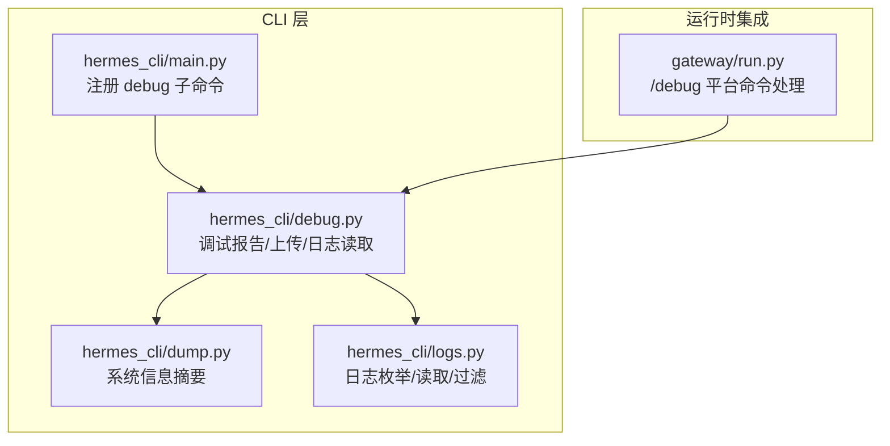
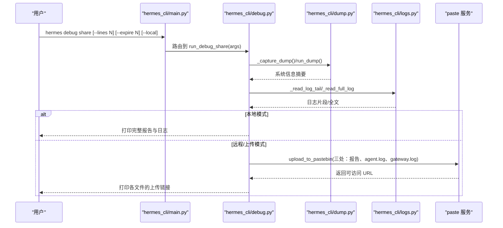
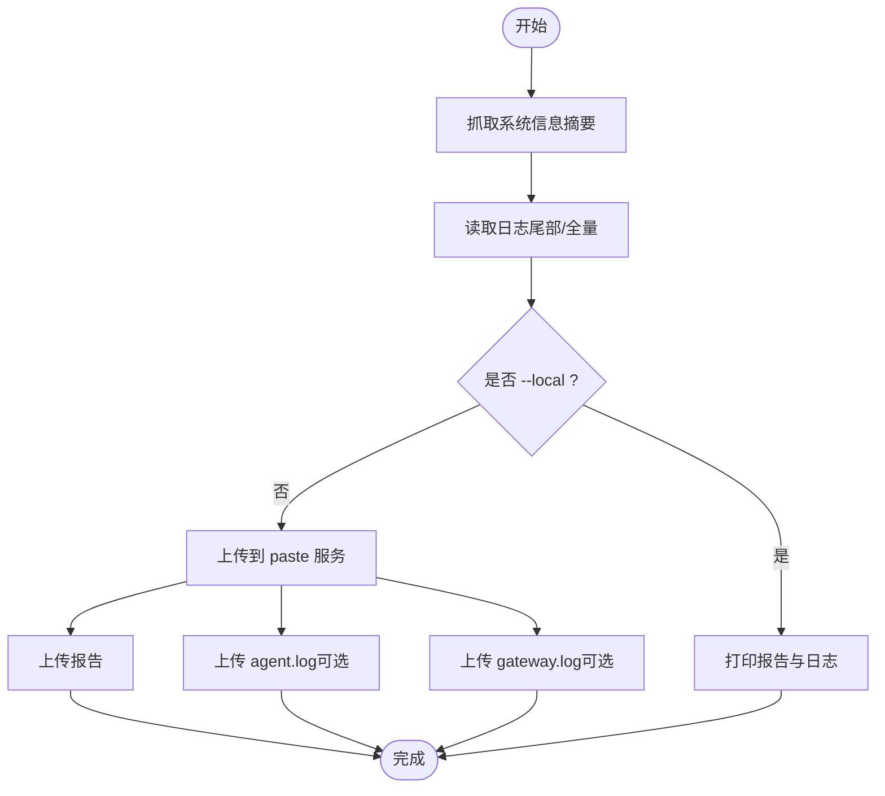
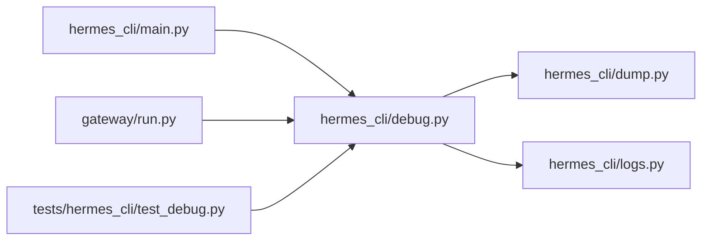

# 调试工具与命令

<cite>
**本文引用的文件列表**
- [hermes_cli/debug.py](file://hermes_cli/debug.py)
- [hermes_cli/main.py](file://hermes_cli/main.py)
- [hermes_cli/dump.py](file://hermes_cli/dump.py)
- [hermes_cli/logs.py](file://hermes_cli/logs.py)
- [gateway/run.py](file://gateway/run.py)
- [tests/hermes_cli/test_debug.py](file://tests/hermes_cli/test_debug.py)
</cite>

## 目录
1. [简介](#简介)
2. [项目结构](#项目结构)
3. [核心组件](#核心组件)
4. [架构总览](#架构总览)
5. [详细组件分析](#详细组件分析)
6. [依赖关系分析](#依赖关系分析)
7. [性能考量](#性能考量)
8. [故障排查指南](#故障排查指南)
9. [结论](#结论)
10. [附录](#附录)

## 简介
本指南面向使用 Hermes Agent 的用户与维护者，系统讲解 hermes 调试工具与命令，重点覆盖：
- hermes debug 命令的使用方法与参数
- debug share 子命令的功能与行为
- 调试报告收集机制：系统信息抓取、日志文件读取与上传流程
- 本地调试与远程调试（通过消息平台）的使用场景与最佳实践
- 调试输出格式与结果解读
- 常见调试场景的操作步骤与故障排除建议
- 高级用法与自定义配置选项

## 项目结构
调试能力由 CLI 模块与网关模块共同支撑：
- hermes_cli/debug.py：提供调试报告构建、日志读取、上传到 paste 服务等核心逻辑
- hermes_cli/dump.py：生成系统信息摘要（版本、环境、配置、密钥状态等）
- hermes_cli/logs.py：日志文件枚举、尾部读取、过滤与跟随
- hermes_cli/main.py：注册 hermes debug 子命令及其参数
- gateway/run.py：在消息平台中响应 /debug 命令，复用调试工具进行远程上传
- tests/hermes_cli/test_debug.py：对调试工具的单元测试与行为验证

图表来源
- [hermes_cli/main.py:4975-5011](file://hermes_cli/main.py#L4975-L5011)
- [hermes_cli/debug.py:1-336](file://hermes_cli/debug.py#L1-L336)
- [hermes_cli/dump.py:1-345](file://hermes_cli/dump.py#L1-L345)
- [hermes_cli/logs.py:1-391](file://hermes_cli/logs.py#L1-L391)
- [gateway/run.py:6434-6487](file://gateway/run.py#L6434-L6487)

章节来源
- [hermes_cli/main.py:4975-5011](file://hermes_cli/main.py#L4975-L5011)
- [hermes_cli/debug.py:1-336](file://hermes_cli/debug.py#L1-L336)
- [hermes_cli/dump.py:1-345](file://hermes_cli/dump.py#L1-L345)
- [hermes_cli/logs.py:1-391](file://hermes_cli/logs.py#L1-L391)
- [gateway/run.py:6434-6487](file://gateway/run.py#L6434-L6487)

## 核心组件
- hermes debug share：将系统信息与日志打包上传至 paste 服务，并打印可分享链接；支持本地打印模式
- hermes debug（无子命令）：显示帮助与可用子命令
- 日志读取器：按名称解析日志文件路径，优先主文件，回退到旋转文件；支持截断读取与错误兜底
- 系统信息抓取器：调用 hermes dump 输出结构化摘要，包含版本、环境、模型、终端后端、密钥状态、功能概要、配置覆盖项等
- 上传器：优先 paste.rs，失败则回退 dpaste.com；支持过期天数设置

章节来源
- [hermes_cli/debug.py:206-240](file://hermes_cli/debug.py#L206-L240)
- [hermes_cli/debug.py:247-318](file://hermes_cli/debug.py#L247-L318)
- [hermes_cli/dump.py:212-345](file://hermes_cli/dump.py#L212-L345)
- [hermes_cli/logs.py:115-181](file://hermes_cli/logs.py#L115-L181)

## 架构总览
hermes debug 的工作流分为“本地”和“远程”两种形态：
- 本地：hermes debug share 在终端执行，收集系统信息与日志，上传到 paste 服务，返回可分享链接
- 远程：在消息平台（如 Telegram/Discord 等）中输入 /debug，网关内部调用相同调试工具，异步上传并返回链接

图表来源
- [hermes_cli/main.py:4975-5011](file://hermes_cli/main.py#L4975-L5011)
- [hermes_cli/debug.py:247-318](file://hermes_cli/debug.py#L247-L318)
- [hermes_cli/dump.py:212-345](file://hermes_cli/dump.py#L212-L345)
- [hermes_cli/logs.py:115-181](file://hermes_cli/logs.py#L115-L181)

## 详细组件分析

### hermes debug share 子命令
- 功能概述
  - 收集系统信息摘要（来自 hermes dump）
  - 读取最近若干行日志（默认每类日志 200 行，errors/gateway 最多 100 行）
  - 可选上传到 paste 服务或仅本地打印
  - 支持设置粘贴过期天数（默认 7 天）
- 关键参数
  - --lines N：每类日志包含的最近行数，默认 200
  - --expire N：粘贴过期天数，默认 7
  - --local：不上传，直接打印报告与日志内容
- 行为细节
  - 先抓取一次系统信息摘要，作为每个上传内容的头部，确保独立可读
  - 对于 agent.log 与 gateway.log，若存在则单独上传，且在每份上传内容前添加摘要与标题
  - 若主日志文件不存在或为空，则尝试读取旋转文件（.1），仍不存在则标记“未找到”
  - 报告上传失败会直接退出；单个日志上传失败不会阻止其他上传，但会在最终输出中标注失败项
- 使用示例
  - hermes debug share
  - hermes debug share --lines 500
  - hermes debug share --expire 30
  - hermes debug share --local

章节来源
- [hermes_cli/main.py:4975-5011](file://hermes_cli/main.py#L4975-L5011)
- [hermes_cli/debug.py:247-318](file://hermes_cli/debug.py#L247-L318)
- [tests/hermes_cli/test_debug.py:283-414](file://tests/hermes_cli/test_debug.py#L283-L414)

### 调试报告收集机制
- 系统信息抓取
  - 调用 hermes dump，输出版本、操作系统、Python/OpenAI SDK 版本、活动配置文件、HERMES_HOME、模型与提供方、终端后端、API 密钥存在性、功能概要、配置覆盖项等
  - 可选显示密钥前缀（--show-keys），默认隐藏
- 日志文件读取
  - 已知日志文件名映射：agent、errors、gateway
  - 解析路径：$HERMES_HOME/logs/<name>.log，若不存在则尝试 .1 旋转文件
  - 尾部读取：默认读取最近 N 行，支持按级别、会话、时间范围、组件过滤
  - 大文件截断：单次上传最大字节限制，超过则从尾部截断并提示
- 上传流程
  - 优先 paste.rs；失败回退 dpaste.com（支持过期天数）
  - 报告、agent.log、gateway.log 各自独立上传，分别返回 URL
  - 上传失败记录并继续，最终汇总输出

图表来源
- [hermes_cli/debug.py:187-240](file://hermes_cli/debug.py#L187-L240)
- [hermes_cli/debug.py:115-181](file://hermes_cli/debug.py#L115-L181)
- [hermes_cli/debug.py:247-318](file://hermes_cli/debug.py#L247-L318)

章节来源
- [hermes_cli/debug.py:187-240](file://hermes_cli/debug.py#L187-L240)
- [hermes_cli/debug.py:115-181](file://hermes_cli/debug.py#L115-L181)
- [hermes_cli/dump.py:212-345](file://hermes_cli/dump.py#L212-L345)
- [hermes_cli/logs.py:115-181](file://hermes_cli/logs.py#L115-L181)

### 远程调试（消息平台）
- 触发方式：在已连接的消息平台中发送 /debug
- 执行流程：网关内部异步执行调试工具，阻塞 I/O 在线程池中执行，完成后返回各文件的上传链接
- 适用平台：Telegram、Discord、Slack、WhatsApp、Signal、Matrix、Mattermost、HomeAssistant、Email、SMS、钉钉、飞书、企业微信、微信、蓝耳朵、本地等
- 注意事项：/debug 仅在允许更新的平台上可用，且需要网关具备可访问的网络以上传到 paste 服务

章节来源
- [gateway/run.py:6434-6487](file://gateway/run.py#L6434-L6487)

### 调试输出格式与结果解读
- 输出结构
  - 系统信息摘要头部：包含版本、环境、模型、终端后端、密钥状态、功能概要、配置覆盖项
  - 日志片段：按文件分段，标题包含“最近 N 行”或“全量日志”
  - 上传链接：每类上传（报告、agent.log、gateway.log）对应一个 URL
  - 失败项：若有日志上传失败，将在输出末尾列出
- 结果解读
  - 若出现“未找到”或“空文件”，通常表示该日志尚未产生或被清理
  - 若粘贴服务返回非预期响应，会触发回退策略；若两次均失败，将终止并打印完整报告以便手动分享
  - 过期天数影响链接有效期，可根据支持团队要求调整

章节来源
- [hermes_cli/debug.py:247-318](file://hermes_cli/debug.py#L247-L318)
- [hermes_cli/debug.py:158-205](file://hermes_cli/debug.py#L158-L205)

### 常见调试场景与操作步骤
- 场景一：首次安装后定位配置问题
  - 步骤：hermes debug share --local，复制完整报告与日志，提交给支持团队
  - 说明：--local 可避免网络问题导致的上传失败
- 场景二：长时间运行后出现异常
  - 步骤：hermes debug share，等待返回多个链接；若部分上传失败，关注失败项并重试
  - 说明：agent.log 与 gateway.log 分别上传，便于定位不同组件的问题
- 场景三：消息平台中无法联网
  - 步骤：先在本地运行 hermes debug share --local，再将报告与日志粘贴到平台
  - 说明：/debug 依赖网络访问 paste 服务，若平台不可达，可先本地导出
- 场景四：需要更长的日志上下文
  - 步骤：hermes debug share --lines 500
  - 说明：增大日志行数有助于定位复杂问题

章节来源
- [hermes_cli/main.py:4985-4991](file://hermes_cli/main.py#L4985-L4991)
- [tests/hermes_cli/test_debug.py:303-342](file://tests/hermes_cli/test_debug.py#L303-L342)

### 高级用法与自定义配置
- 自定义日志行数：--lines N（默认 200）
- 设置粘贴过期：--expire N（默认 7 天）
- 本地打印：--local（不上传，适合离线或网络受限环境）
- 系统信息增强：hermes dump --show-keys（显示密钥前缀，谨慎使用）
- 日志过滤与查看：hermes logs（支持级别、会话、时间范围、组件过滤）

章节来源
- [hermes_cli/main.py:4998-5009](file://hermes_cli/main.py#L4998-L5009)
- [hermes_cli/dump.py:212-345](file://hermes_cli/dump.py#L212-L345)
- [hermes_cli/logs.py:138-247](file://hermes_cli/logs.py#L138-L247)

## 依赖关系分析
- hermes_cli/main.py 注册 debug 子命令与参数
- hermes_cli/debug.py 依赖 hermes_cli/dump.py 与 hermes_cli/logs.py
- gateway/run.py 在消息平台中复用 hermes_cli/debug.py 的上传与日志读取能力
- 测试模块 tests/hermes_cli/test_debug.py 覆盖上传、日志读取、报告拼装与 CLI 路由

图表来源
- [hermes_cli/main.py:4975-5011](file://hermes_cli/main.py#L4975-L5011)
- [hermes_cli/debug.py:1-336](file://hermes_cli/debug.py#L1-L336)
- [gateway/run.py:6434-6487](file://gateway/run.py#L6434-L6487)
- [tests/hermes_cli/test_debug.py:1-462](file://tests/hermes_cli/test_debug.py#L1-L462)

章节来源
- [hermes_cli/main.py:4975-5011](file://hermes_cli/main.py#L4975-L5011)
- [hermes_cli/debug.py:1-336](file://hermes_cli/debug.py#L1-L336)
- [gateway/run.py:6434-6487](file://gateway/run.py#L6434-L6487)
- [tests/hermes_cli/test_debug.py:1-462](file://tests/hermes_cli/test_debug.py#L1-L462)

## 性能考量
- 日志读取优化
  - 小文件直接读取，大文件采用从尾部反向读取策略，减少内存占用
  - 默认上传大小限制，避免超大文件拖慢上传
- 上传策略
  - 优先 paste.rs，失败回退 dpaste.com，降低整体失败概率
  - 异步上传，避免阻塞主线程（网关中通过线程池执行）
- 内存与 CPU
  - 日志过滤与截断在内存中完成，建议合理设置 --lines 与 --expire，避免不必要的资源消耗

[本节为通用指导，无需特定文件引用]

## 故障排查指南
- 上传失败
  - paste.rs 失败：检查网络连通性；若持续失败，回退到 dpaste.com
  - 报告上传失败：程序会直接退出并打印完整报告，可手动复制分享
  - 单个日志上传失败：不影响其他上传，输出会列出失败项
- 日志缺失或为空
  - 检查 $HERMES_HOME/logs 下是否存在对应文件；若无，可能是首次运行或日志轮转
  - 若主文件为空，尝试读取 .1 旋转文件
- 权限问题
  - 日志文件权限不足会导致读取失败；请确认运行用户对日志目录有读取权限
- 网络受限环境
  - 使用 --local 生成报告与日志，离线分享
- 远程平台不可达
  - 在本地运行 hermes debug share --local，将输出复制到平台

章节来源
- [hermes_cli/debug.py:247-318](file://hermes_cli/debug.py#L247-L318)
- [hermes_cli/logs.py:115-181](file://hermes_cli/logs.py#L115-L181)
- [tests/hermes_cli/test_debug.py:371-414](file://tests/hermes_cli/test_debug.py#L371-L414)

## 结论
hermes debug 提供了统一、可靠的调试报告生成与分享能力，既适用于本地快速诊断，也适用于远程平台的即时反馈。通过系统信息摘要、日志片段与全量日志的组合，以及灵活的上传与本地打印选项，用户可以高效地定位问题并配合支持团队进行协作。

[本节为总结性内容，无需特定文件引用]

## 附录
- 常用命令速查
  - hermes debug share：上传调试报告与日志
  - hermes debug share --lines N：指定日志行数
  - hermes debug share --expire N：设置粘贴过期天数
  - hermes debug share --local：仅本地打印，不上传
  - hermes dump --show-keys：显示密钥前缀（谨慎使用）
  - hermes logs：查看与过滤日志

[本节为参考性内容，无需特定文件引用]