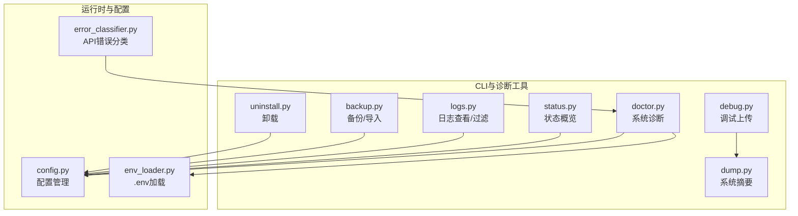
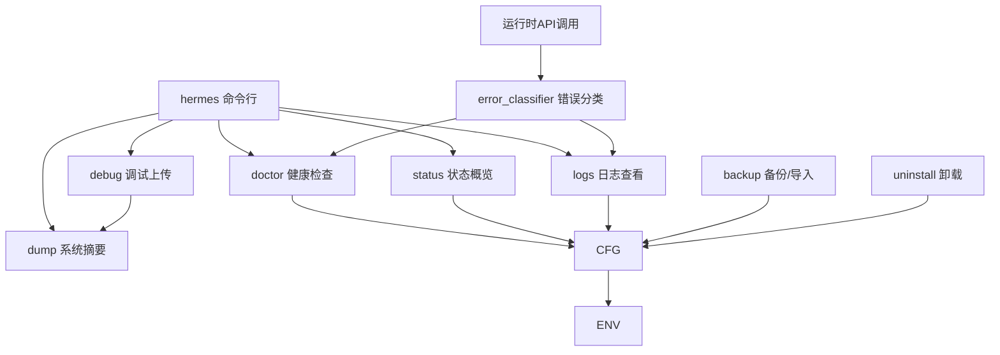
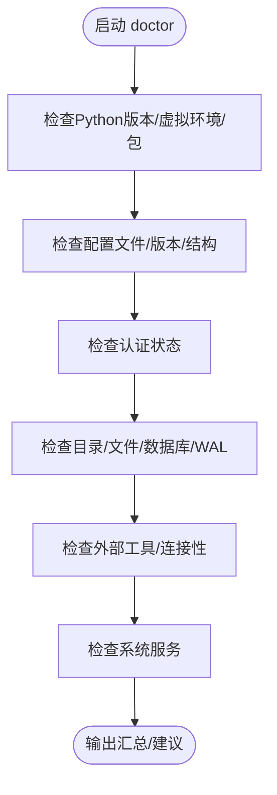
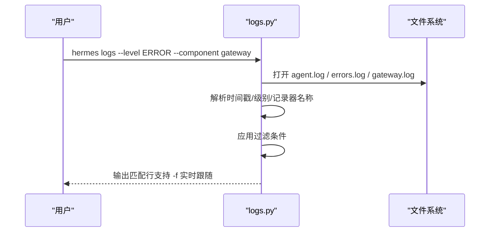
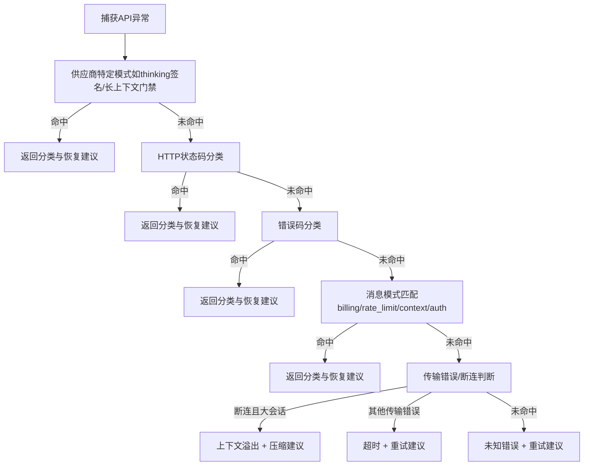
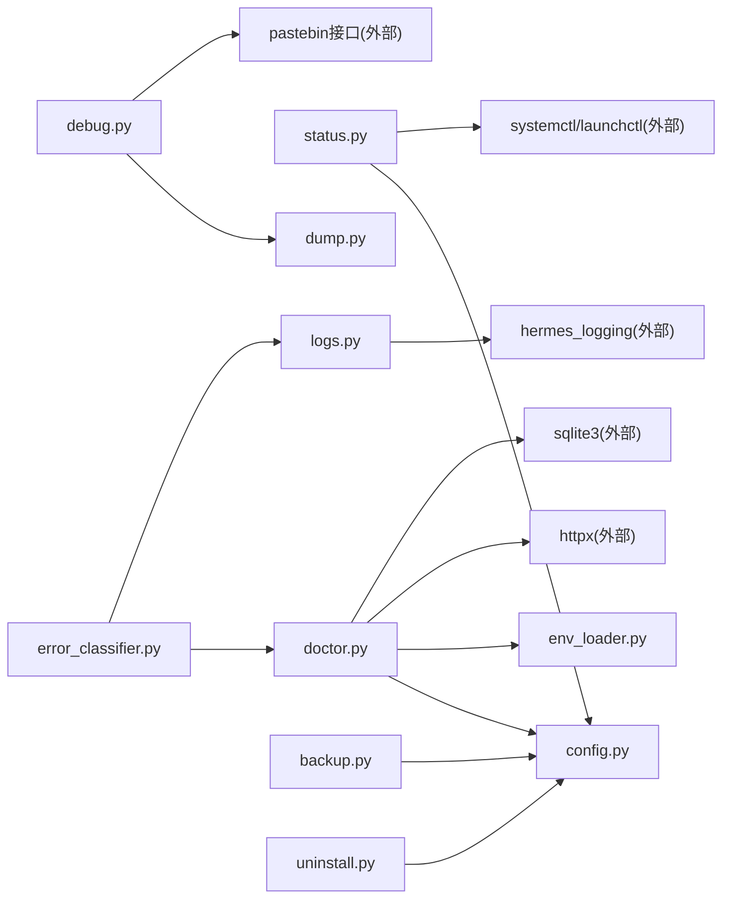

# 问题诊断与排除

<cite>
**本文引用的文件**
- [README.md](file://README.md)
- [doctor.py](file://hermes_cli/doctor.py)
- [logs.py](file://hermes_cli/logs.py)
- [debug.py](file://hermes_cli/debug.py)
- [dump.py](file://hermes_cli/dump.py)
- [status.py](file://hermes_cli/status.py)
- [error_classifier.py](file://agent/error_classifier.py)
- [config.py](file://hermes_cli/config.py)
- [env_loader.py](file://hermes_cli/env_loader.py)
- [backup.py](file://hermes_cli/backup.py)
- [uninstall.py](file://hermes_cli/uninstall.py)
</cite>

## 目录
1. [简介](#简介)
2. [项目结构](#项目结构)
3. [核心组件](#核心组件)
4. [架构总览](#架构总览)
5. [详细组件分析](#详细组件分析)
6. [依赖关系分析](#依赖关系分析)
7. [性能考量](#性能考量)
8. [故障排除指南](#故障排除指南)
9. [结论](#结论)
10. [附录](#附录)

## 简介
本指南面向Hermes Agent用户与运维人员，提供系统化的问题诊断与排除方法。内容覆盖连接问题、认证失败、功能异常的识别与处理；系统健康检查与工具使用；错误日志分析技巧与关键信息提取；跨组件问题定位与交叉验证；环境配置问题的诊断与修复；以及紧急情况下的故障恢复与降级策略。读者可按“快速上手”到“深入排查”的顺序阅读，也可直接跳转至对应章节。

## 项目结构
Hermes Agent围绕CLI命令与子系统（网关、平台适配器、工具集、内存与会话）构建。与诊断排障密切相关的模块集中在hermes_cli目录（doctor/status/logs/debug/dump/backup/uninstall等），以及agent目录中的错误分类器。README提供了安装与基础命令入口，便于快速定位问题来源。

图示来源
- [doctor.py](file://hermes_cli/doctor.py)
- [status.py](file://hermes_cli/status.py)
- [logs.py](file://hermes_cli/logs.py)
- [debug.py](file://hermes_cli/debug.py)
- [dump.py](file://hermes_cli/dump.py)
- [backup.py](file://hermes_cli/backup.py)
- [uninstall.py](file://hermes_cli/uninstall.py)
- [error_classifier.py](file://agent/error_classifier.py)
- [config.py](file://hermes_cli/config.py)
- [env_loader.py](file://hermes_cli/env_loader.py)

章节来源
- [README.md](file://README.md)

## 核心组件
- 诊断与健康检查：doctor/status/dump用于系统性检查与摘要输出，便于快速定位配置、权限、服务状态等问题。
- 日志与调试：logs支持按级别、组件、会话、时间范围过滤；debug提供一键上传调试报告，便于社区支持。
- 错误分类与恢复：error_classifier对API错误进行结构化分类，指导重试、轮换凭证、回退或压缩上下文等恢复动作。
- 配置与环境：config/env_loader负责配置路径、默认值、迁移与安全权限设置，确保环境一致性。
- 备份与恢复：backup提供数据级保护，uninstall提供可控卸载，保障紧急恢复与环境清理。

章节来源
- [doctor.py](file://hermes_cli/doctor.py)
- [status.py](file://hermes_cli/status.py)
- [logs.py](file://hermes_cli/logs.py)
- [debug.py](file://hermes_cli/debug.py)
- [dump.py](file://hermes_cli/dump.py)
- [error_classifier.py](file://agent/error_classifier.py)
- [config.py](file://hermes_cli/config.py)
- [env_loader.py](file://hermes_cli/env_loader.py)
- [backup.py](file://hermes_cli/backup.py)
- [uninstall.py](file://hermes_cli/uninstall.py)

## 架构总览
下图展示诊断与排障在系统中的位置与交互：CLI命令作为入口，doctor/status/dump负责静态检查与摘要；logs提供动态日志；error_classifier贯穿运行时API调用链路，指导错误恢复；config/env_loader保证配置与环境的一致性；backup/uninstall提供数据与环境的最终保障。

图示来源
- [doctor.py](file://hermes_cli/doctor.py)
- [status.py](file://hermes_cli/status.py)
- [logs.py](file://hermes_cli/logs.py)
- [debug.py](file://hermes_cli/debug.py)
- [dump.py](file://hermes_cli/dump.py)
- [error_classifier.py](file://agent/error_classifier.py)
- [config.py](file://hermes_cli/config.py)
- [env_loader.py](file://hermes_cli/env_loader.py)
- [backup.py](file://hermes_cli/backup.py)
- [uninstall.py](file://hermes_cli/uninstall.py)

## 详细组件分析

### 诊断工具 doctor
- 功能要点
  - 检查Python版本、虚拟环境、必要包与可选包。
  - 校验配置文件（config.yaml）、.env、配置版本与结构。
  - 检查认证状态（Nous Portal、OpenAI Codex、OAuth提供商）。
  - 校验目录结构（~/.hermes子目录）、SOUL.md、SQLite会话库与WAL大小。
  - 检查外部工具（git、ripgrep、Docker、SSH、Daytona、Node.js/agent-browser、npm审计）。
  - 连接性测试（OpenRouter、Anthropic、多家API Key提供商）。
  - 系统服务（Linux systemd用户服务linger）。
- 适用场景
  - 安装后首次健康检查。
  - 配置变更后的回归验证。
  - 连接失败、认证异常、功能不可用的初步筛查。
- 自动修复
  - 支持--fix参数自动创建缺失文件/目录、迁移配置、执行WAL检查点、安装缺失包等。

图示来源
- [doctor.py](file://hermes_cli/doctor.py)

章节来源
- [doctor.py](file://hermes_cli/doctor.py)

### 状态概览 status
- 功能要点
  - 展示环境、模型与提供商、API密钥、OAuth提供商状态。
  - 终端后端（local/ssh/docker/daytona）与相关变量。
  - 平台配置（Telegram/Discord/WhatsApp/Signal/Slack/Email/SMS等）。
  - 网关服务状态（Linux systemd、macOS launchd、Termux手动进程）。
  - 计划任务数量、活动会话数。
  - 深度检查（OpenRouter连通性、本地端口占用）。
- 适用场景
  - 快速确认当前运行态与关键开关是否正确。
  - 对比不同环境（开发机/服务器/容器）的差异。
- 输出特性
  - 可选择显示完整密钥或脱敏显示；支持深度检查模式。

章节来源
- [status.py](file://hermes_cli/status.py)

### 日志查看 logs
- 功能要点
  - 支持按级别（DEBUG/INFO/WARNING/ERROR/CRITICAL）、组件（gateway/tools等）、会话ID、相对时间范围过滤。
  - 支持尾读与实时跟随（-f）。
  - 支持列出日志文件与大小、年龄。
- 适用场景
  - 定位API错误、工具执行异常、网关通信问题。
  - 结合错误分类器结果，快速缩小问题范围。
- 关键正则
  - 时间戳匹配、日志级别提取、记录器名称提取、组件前缀匹配。

图示来源
- [logs.py](file://hermes_cli/logs.py)

章节来源
- [logs.py](file://hermes_cli/logs.py)

### 调试上传 debug/share
- 功能要点
  - 收集系统摘要（dump）与最近日志片段。
  - 尝试上传到paste.rs或dpaste.com，失败时打印本地报告供手动提交。
  - 支持过期天数与本地仅打印选项。
- 适用场景
  - 需要社区支持时，标准化提供上下文信息。
- 注意事项
  - 上传前请确认敏感信息已脱敏或通过--local仅本地查看。

章节来源
- [debug.py](file://hermes_cli/debug.py)
- [dump.py](file://hermes_cli/dump.py)

### 错误分类与恢复 error_classifier
- 功能要点
  - 结构化错误分类（认证/授权、计费/配额、服务器错误、传输超时、上下文溢出、负载过大、模型不存在、请求格式错误、供应商特定错误等）。
  - 提供恢复建议（可重试、是否压缩上下文、是否轮换凭证、是否回退、是否中止）。
  - 优先级分类管线：供应商特定模式 → HTTP状态码 → 错误码 → 消息模式 → 传输错误 → 服务器断连+大会话 → 未知。
- 适用场景
  - 运行时API调用失败的自动恢复决策。
  - 日志分析时快速映射错误类型与建议动作。
- 关键模式
  - 计费/配额、速率限制、上下文溢出、模型不存在、认证失败、传输错误类型、服务器断连等。

图示来源
- [error_classifier.py](file://agent/error_classifier.py)

章节来源
- [error_classifier.py](file://agent/error_classifier.py)

### 配置与环境 config/env_loader
- 功能要点
  - 统一配置路径与默认值，提供配置版本检查与迁移。
  - .env加载策略：优先用户配置，其次项目回退，编码兼容UTF-8与Latin-1。
  - 安全权限：确保~/.hermes及其子目录与文件的安全访问权限。
  - 管理模式（NixOS/Homebrew）提示与更新命令。
- 适用场景
  - 配置不生效、权限不足、迁移后残留字段导致的异常。
  - 多环境一致性校验与修复。

章节来源
- [config.py](file://hermes_cli/config.py)
- [env_loader.py](file://hermes_cli/env_loader.py)

### 备份与恢复 backup/import
- 功能要点
  - 备份：扫描~/.hermes，排除代码库与临时文件，生成压缩包。
  - 导入：校验备份有效性，检测前缀，安全解压覆盖目标，重建profile别名脚本。
- 适用场景
  - 紧急回滚、环境迁移、灾难恢复。
- 注意事项
  - 导入前确认目标环境无冲突；注意路径穿越防护。

章节来源
- [backup.py](file://hermes_cli/backup.py)

### 卸载 uninstall
- 功能要点
  - 选项：仅移除代码保留数据、完全卸载（含配置/数据）。
  - 清理：停止网关服务、从shell配置移除PATH、删除包装脚本、移除安装目录。
- 适用场景
  - 环境清理、重新安装、彻底移除。

章节来源
- [uninstall.py](file://hermes_cli/uninstall.py)

## 依赖关系分析
- doctor依赖config与env_loader进行配置与环境检查；依赖httpx进行API连通性测试；依赖sqlite3检查数据库健康。
- status依赖config与env_loader读取配置与环境变量；调用systemctl/launchctl查询服务状态。
- logs依赖hermes_logging的组件前缀映射进行组件过滤。
- debug依赖dump生成系统摘要，并调用pastebin接口上传。
- error_classifier被运行时API调用链复用，指导恢复策略。
- backup/uninstall依赖系统命令与文件系统操作，注意权限与路径安全。

图示来源
- [doctor.py](file://hermes_cli/doctor.py)
- [status.py](file://hermes_cli/status.py)
- [logs.py](file://hermes_cli/logs.py)
- [debug.py](file://hermes_cli/debug.py)
- [dump.py](file://hermes_cli/dump.py)
- [error_classifier.py](file://agent/error_classifier.py)
- [config.py](file://hermes_cli/config.py)
- [env_loader.py](file://hermes_cli/env_loader.py)
- [backup.py](file://hermes_cli/backup.py)
- [uninstall.py](file://hermes_cli/uninstall.py)

章节来源
- [doctor.py](file://hermes_cli/doctor.py)
- [status.py](file://hermes_cli/status.py)
- [logs.py](file://hermes_cli/logs.py)
- [debug.py](file://hermes_cli/debug.py)
- [dump.py](file://hermes_cli/dump.py)
- [error_classifier.py](file://agent/error_classifier.py)
- [config.py](file://hermes_cli/config.py)
- [env_loader.py](file://hermes_cli/env_loader.py)
- [backup.py](file://hermes_cli/backup.py)
- [uninstall.py](file://hermes_cli/uninstall.py)

## 性能考量
- 日志滚动与大小控制：通过配置项限制单文件大小与备份数量，避免磁盘膨胀。
- 大型日志文件读取：logs采用分块读取策略，兼顾准确性与效率。
- WAL检查点：doctor对大型WAL给出检查点建议，降低数据库锁竞争与恢复时间。
- 传输超时与重试：error_classifier区分超时与业务错误，指导合理的退避与重试策略。
- 外部工具：ripgrep提升文件搜索性能；Docker/SSH/Daytona等后端需关注资源限制与网络延迟。

[本节为通用指导，无需特定文件引用]

## 故障排除指南

### 一、连接问题
- 快速自检
  - 使用doctor检查网络连通性（OpenRouter、Anthropic、多家API Key提供商）。
  - 使用status查看终端后端与平台令牌配置。
  - 使用logs按级别与组件过滤，定位具体失败阶段。
- 常见原因与处理
  - DNS/IPv6问题：启用force_ipv4配置项，或调整DNS解析。
  - 代理/防火墙：检查系统代理设置与出站规则。
  - 速率限制/配额耗尽：根据error_classifier分类采取回退或等待。
  - 传输超时：增大客户端超时或优化网络路径。
- 交叉验证
  - doctor连通性测试与status平台配置相互印证；logs中定位到具体组件后，结合error_classifier的超时/断连建议进行针对性优化。

章节来源
- [doctor.py](file://hermes_cli/doctor.py)
- [status.py](file://hermes_cli/status.py)
- [logs.py](file://hermes_cli/logs.py)
- [error_classifier.py](file://agent/error_classifier.py)

### 二、认证失败
- 快速自检
  - doctor检查Nous Portal、OpenAI Codex、OAuth提供商登录状态。
  - status显示各提供商登录状态与过期时间。
  - logs过滤“auth”相关日志，结合error_classifier的认证类原因定位。
- 常见原因与处理
  - API密钥无效/过期：在.env中更新有效密钥；对于OAuth提供商，按其流程刷新令牌。
  - 凭证轮换：根据error_classifier建议进行轮换或回退。
  - 权限不足：检查平台令牌权限范围与白名单设置。
- 交叉验证
  - doctor与status的认证状态应一致；若存在差异，优先以doctor为准并结合logs逐条核对。

章节来源
- [doctor.py](file://hermes_cli/doctor.py)
- [status.py](file://hermes_cli/status.py)
- [logs.py](file://hermes_cli/logs.py)
- [error_classifier.py](file://agent/error_classifier.py)

### 三、功能异常
- 快速自检
  - doctor检查目录结构、数据库与WAL、外部工具可用性。
  - logs按组件过滤（如gateway、tools），定位异常模块。
  - error_classifier对API错误进行分类，指导压缩上下文或回退。
- 常见原因与处理
  - 上下文溢出：触发压缩策略，减少历史消息；必要时调整模型上下文窗口。
  - 负载过大：拆分任务、降低并发、启用回退提供商。
  - 工具执行失败：检查工具依赖（Node.js/agent-browser、Docker、SSH）与权限。
- 交叉验证
  - doctor的外部工具检查与logs的组件过滤互为补充；error_classifier的分类结果与日志中的错误码/消息形成闭环。

章节来源
- [doctor.py](file://hermes_cli/doctor.py)
- [logs.py](file://hermes_cli/logs.py)
- [error_classifier.py](file://agent/error_classifier.py)

### 四、系统健康检查与工具使用
- 建议流程
  - 先运行doctor --fix，自动修复可处理的问题。
  - 再运行status，确认服务与配置状态。
  - 使用logs按需过滤，收集近因证据。
  - 最后运行dump，生成标准化摘要，配合debug share提交社区支持。
- 工具组合
  - doctor + status：静态检查与状态核对。
  - logs + error_classifier：动态定位与分类指导。
  - dump + debug：标准化上下文与远程支持。

章节来源
- [doctor.py](file://hermes_cli/doctor.py)
- [status.py](file://hermes_cli/status.py)
- [logs.py](file://hermes_cli/logs.py)
- [debug.py](file://hermes_cli/debug.py)
- [dump.py](file://hermes_cli/dump.py)

### 五、错误日志分析技巧与关键信息提取
- 技巧
  - 使用--level/--component/--session/--since组合过滤，缩小范围。
  - 关注时间戳、日志级别、记录器名称、会话ID。
  - 结合error_classifier的错误码/消息模式，快速映射到恢复建议。
- 关键信息
  - HTTP状态码与错误体；传输错误类型（超时、断连等）。
  - 认证失败信号（invalid api key、unauthorized等）。
  - 上下文溢出/负载过大提示（context length、payload too large等）。

章节来源
- [logs.py](file://hermes_cli/logs.py)
- [error_classifier.py](file://agent/error_classifier.py)

### 六、不同组件间的问题定位流程与交叉验证
- 流程
  - doctor：全局健康检查与自动修复。
  - status：服务与配置状态核对。
  - logs：按组件/级别/时间过滤，定位异常。
  - error_classifier：对API错误进行分类与恢复建议。
  - dump/debug：标准化上下文与远程支持。
- 交叉验证
  - doctor与status的配置/认证状态应一致；logs的异常时间线与error_classifier的分类应吻合；dump提供统一上下文，便于社区复现。

章节来源
- [doctor.py](file://hermes_cli/doctor.py)
- [status.py](file://hermes_cli/status.py)
- [logs.py](file://hermes_cli/logs.py)
- [error_classifier.py](file://agent/error_classifier.py)
- [dump.py](file://hermes_cli/dump.py)
- [debug.py](file://hermes_cli/debug.py)

### 七、环境配置问题的诊断与修复
- 常见问题
  - .env缺失或编码错误：使用doctor创建空文件并引导setup；env_loader支持UTF-8/Latin-1回退。
  - 配置版本过旧：doctor提示并可自动迁移；必要时手动迁移。
  - 目录权限不当：config确保安全权限；doctor可创建缺失目录。
  - 管理模式限制：config提供管理系统的友好提示与更新命令。
- 修复步骤
  - doctor --fix自动修复可处理项。
  - 手动修正后，status核对关键配置项。
  - logs观察修复后的行为变化。

章节来源
- [doctor.py](file://hermes_cli/doctor.py)
- [config.py](file://hermes_cli/config.py)
- [env_loader.py](file://hermes_cli/env_loader.py)

### 八、紧急情况下的故障恢复与降级策略
- 策略
  - 备份优先：使用backup导出当前配置与数据，确保可回滚。
  - 降级与隔离：启用回退提供商、关闭高负载功能、限制并发。
  - 数据恢复：使用backup导入，或uninstall清理后重装。
  - 服务治理：doctor检查系统服务；status确认服务状态；必要时手动重启。
- 步骤
  - 立即备份（backup）。
  - 评估影响范围（logs + error_classifier）。
  - 降级策略（调整配置/回退提供商）。
  - 如需重装，使用uninstall清理并重新安装。

章节来源
- [backup.py](file://hermes_cli/backup.py)
- [uninstall.py](file://hermes_cli/uninstall.py)
- [doctor.py](file://hermes_cli/doctor.py)
- [status.py](file://hermes_cli/status.py)
- [logs.py](file://hermes_cli/logs.py)
- [error_classifier.py](file://agent/error_classifier.py)

## 结论
通过doctor/status/dump/logs/debug等工具的系统化使用，结合error_classifier的错误分类与恢复建议，可以高效地完成Hermes Agent的问题诊断与排除。建议建立“先静态检查、再动态定位、最后修复验证”的标准流程，并在紧急情况下优先进行备份与降级，确保业务连续性与数据安全。

[本节为总结性内容，无需特定文件引用]

## 附录
- 常用命令参考
  - hermes doctor [--fix]
  - hermes status [--deep]
  - hermes logs [-n 100] [--level WARNING] [--component gateway] [--since 1h]
  - hermes debug share [--lines 200] [--expire 7]
  - hermes dump
  - hermes backup
  - hermes -p <profile> gateway install
- 建议工作流
  - 新环境：doctor --fix → status → logs（INFO）→ dump
  - 异常发生：logs（ERROR/WARNING）→ error_classifier → doctor/status交叉验证 → 修复/降级 → backup
  - 社区求助：debug share → 提交链接与dump摘要

[本节为通用参考，无需特定文件引用]