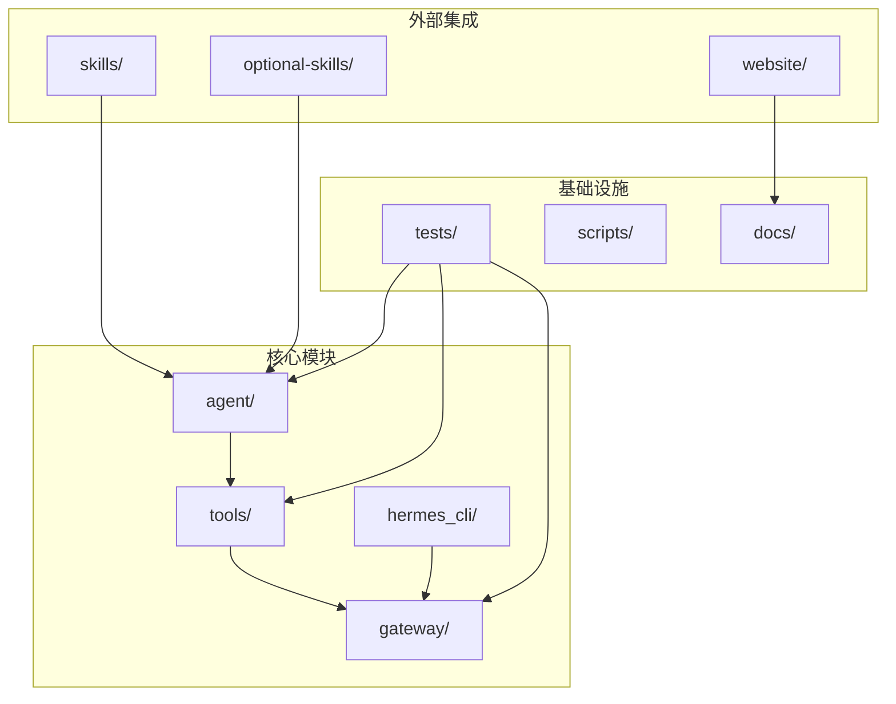
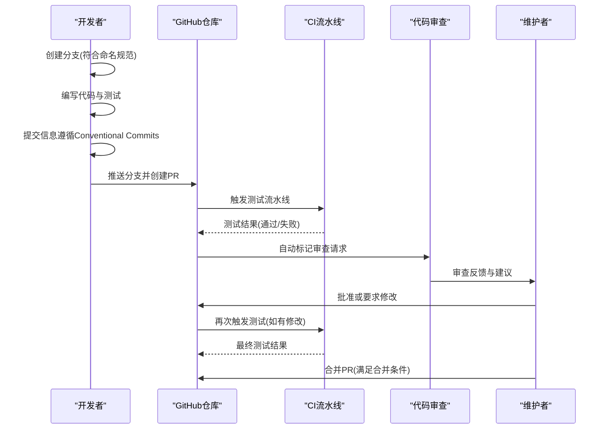
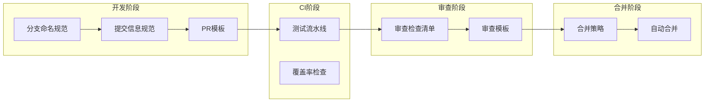

# Pull Request流程

<cite>
**本文档引用的文件**
- [.github/PULL_REQUEST_TEMPLATE.md](file://.github/PULL_REQUEST_TEMPLATE.md)
- [CONTRIBUTING.md](file://CONTRIBUTING.md)
- [.github/workflows/tests.yml](file://.github/workflows/tests.yml)
- [README.md](file://README.md)
- [skills/github/github-pr-workflow/SKILL.md](file://skills/github/github-pr-workflow/SKILL.md)
- [skills/github/github-code-review/SKILL.md](file://skills/github/github-code-review/SKILL.md)
- [skills/github/github-code-review/references/review-output-template.md](file://skills/github/github-code-review/references/review-output-template.md)
</cite>

## 目录
1. [简介](#简介)
2. [项目结构](#项目结构)
3. [核心组件](#核心组件)
4. [架构概览](#架构概览)
5. [详细组件分析](#详细组件分析)
6. [依赖关系分析](#依赖关系分析)
7. [性能考虑](#性能考虑)
8. [故障排除指南](#故障排除指南)
9. [结论](#结论)
10. [附录](#附录)

## 简介
本指南为Hermes Agent项目的Pull Request提交与审查流程提供了完整的操作手册。内容涵盖分支命名规范、提交信息规范（Conventional Commits格式）、PR描述要求、提交前检查清单、PR审查流程与合并标准等关键要素。同时结合项目现有的模板与技能，帮助贡献者高效、规范地完成从开发到合并的全流程。

## 项目结构
Hermes Agent采用模块化架构，包含核心代理、工具系统、网关平台、技能系统、测试套件等多个子系统。PR流程贯穿整个项目生命周期，从本地开发、CI测试到最终合并。

**图表来源**
- [README.md:114-182](file://README.md#L114-L182)

**章节来源**
- [README.md:114-182](file://README.md#L114-L182)

## 核心组件
本节概述PR流程中的关键组件及其职责：
- 分支管理：遵循统一的分支命名规范，确保变更类型清晰可辨
- 提交信息：采用Conventional Commits格式，便于自动化处理与版本发布
- PR模板：标准化PR描述结构，包含变更内容、测试方法、平台验证等关键信息
- CI流水线：自动执行单元测试与端到端测试，确保代码质量
- 审查工具：提供代码审查技能与模板，规范审查流程与输出格式

**章节来源**
- [CONTRIBUTING.md:584-638](file://CONTRIBUTING.md#L584-L638)
- [.github/PULL_REQUEST_TEMPLATE.md:1-76](file://.github/PULL_REQUEST_TEMPLATE.md#L1-L76)
- [.github/workflows/tests.yml:1-74](file://.github/workflows/tests.yml#L1-L74)

## 架构概览
PR流程在项目中的整体架构如下：

**图表来源**
- [CONTRIBUTING.md:584-638](file://CONTRIBUTING.md#L584-L638)
- [.github/workflows/tests.yml:1-74](file://.github/workflows/tests.yml#L1-L74)

## 详细组件分析

### 分支命名规范
Hermes Agent采用明确的分支命名约定，确保每个分支的用途一目了然：
- fix/：用于修复缺陷或错误
- feat/：用于新增功能
- docs/：仅涉及文档更新
- test/：仅涉及测试用例
- refactor/：仅涉及重构（不改变行为）

这些约定有助于自动化工具识别变更类型，并在CI中进行针对性处理。

**章节来源**
- [CONTRIBUTING.md:586-594](file://CONTRIBUTING.md#L586-L594)

### 提交信息规范（Conventional Commits）
项目采用Conventional Commits格式，确保提交信息的结构化与可读性：
- 格式：type(scope): description
- 类型包括：fix、feat、docs、test、refactor、chore等
- 范围：如cli、gateway、tools、skills、agent、install、whatsapp、security等
- 示例：fix(cli): 防止在save_config_value中字符串模型导致崩溃

该规范支持自动化工具解析提交信息，用于生成变更日志、版本发布等。

**章节来源**
- [CONTRIBUTING.md:611-637](file://CONTRIBUTING.md#L611-L637)

### PR描述要求
PR模板定义了必须填写的关键信息，确保审查者能够快速理解变更内容：
- 变更内容与原因：清晰描述做了什么以及为什么做
- 如何测试：提供复现步骤（针对缺陷）或使用示例（针对新功能）
- 平台验证：声明已在哪些平台上进行了测试
- 相关问题引用：链接到相关Issue

此外，PR模板还包含多项检查清单，要求贡献者在请求审查前完成：
- 已阅读贡献指南
- 提交信息遵循Conventional Commits
- 搜索过现有PR避免重复
- PR内容聚焦于单一逻辑变更
- 运行pytest并通过所有测试
- 添加了相应测试（缺陷修复强烈推荐）
- 在指定平台上进行了测试

**章节来源**
- [.github/PULL_REQUEST_TEMPLATE.md:1-76](file://.github/PULL_REQUEST_TEMPLATE.md#L1-L76)

### 提交前检查清单
为确保PR质量，建议在提交前完成以下检查：
1. 运行测试：pytest tests/ -v
2. 手动测试：启动hermes并验证变更路径
3. 跨平台影响评估：若涉及文件I/O、进程管理或终端处理，需考虑Windows和macOS的影响
4. 保持PR专注：一次只包含一个逻辑变更，避免混杂不同类型的改动

**章节来源**
- [CONTRIBUTING.md:596-601](file://CONTRIBUTING.md#L596-L601)

### PR审查流程
审查流程分为两个阶段：
1. 自动化审查：基于PR模板的检查清单，确保基本质量要求
2. 人工审查：根据代码审查技能提供的检查清单，对代码质量、安全性、性能、测试覆盖等方面进行全面评估

代码审查检查清单包括：
- 正确性：逻辑是否正确，边界条件是否考虑
- 安全性：是否存在安全漏洞或风险
- 代码质量：命名是否清晰、函数是否单一职责
- 测试：新增代码路径是否被测试覆盖
- 性能：是否存在性能问题或潜在瓶颈
- 文档：公共API是否文档化，复杂逻辑是否有注释说明

审查结果应以结构化模板输出，包含严重级别（Critical、Warning、Suggestion、Looks Good）与决策建议（Approve、Request Changes、Comment）。

**章节来源**
- [skills/github/github-code-review/SKILL.md:294-481](file://skills/github/github-code-review/SKILL.md#L294-L481)
- [skills/github/github-code-review/references/review-output-template.md:1-49](file://skills/github/github-code-review/references/review-output-template.md#L1-L49)

### 合并标准
PR合并需要满足以下条件：
- 无阻塞性问题：无Critical或Warning级别的问题
- 测试通过：所有自动化测试通过，且新增功能有相应的测试覆盖
- 审查批准：至少一名维护者批准
- CI状态：所有CI检查通过
- 代码质量：符合项目代码风格与最佳实践

合并方式支持多种策略：
- Squash合并：将多个提交压缩为单个提交，保持历史简洁
- Rebase合并：将分支变基到目标分支上，保持线性历史
- Merge提交：创建合并提交，保留完整的分支历史

**章节来源**
- [skills/github/github-pr-workflow/SKILL.md:276-312](file://skills/github/github-pr-workflow/SKILL.md#L276-L312)

## 依赖关系分析
PR流程涉及多个组件之间的协作关系：

**图表来源**
- [CONTRIBUTING.md:584-638](file://CONTRIBUTING.md#L584-L638)
- [.github/workflows/tests.yml:1-74](file://.github/workflows/tests.yml#L1-L74)

**章节来源**
- [CONTRIBUTING.md:584-638](file://CONTRIBUTING.md#L584-L638)
- [.github/workflows/tests.yml:1-74](file://.github/workflows/tests.yml#L1-L74)

## 性能考虑
- CI性能优化：合理组织测试套件，避免不必要的端到端测试在每次PR中运行
- 代码审查效率：使用结构化模板减少审查时间，提高反馈质量
- 合并策略选择：根据项目需求选择合适的合并方式，平衡历史完整性与简洁性

## 故障排除指南
常见问题与解决方案：
- CI测试失败：根据审查技能提供的诊断流程，定位失败原因并修复
- 审查反馈冲突：根据审查模板的严重级别分类，优先解决Critical和Warning问题
- 合并延迟：确保所有检查通过后再请求合并，避免反复修改导致的延迟

**章节来源**
- [skills/github/github-pr-workflow/SKILL.md:211-275](file://skills/github/github-pr-workflow/SKILL.md#L211-L275)

## 结论
通过遵循本指南中的分支命名规范、提交信息规范、PR描述要求、提交前检查清单、审查流程与合并标准，贡献者可以高效、规范地完成Hermes Agent项目的PR流程。这不仅提升了代码质量，也加速了项目的迭代与发布周期。

## 附录

### PR模板字段说明
- 变更类型：选择适用的变更类型（缺陷修复、新功能、文档更新、测试、重构等）
- 变更内容：列出具体更改，包含相关文件路径
- 测试方法：提供复现步骤或使用示例
- 平台验证：声明测试的平台环境
- 检查清单：确认已完成的准备工作

**章节来源**
- [.github/PULL_REQUEST_TEMPLATE.md:13-76](file://.github/PULL_REQUEST_TEMPLATE.md#L13-L76)

### CI测试配置
项目使用GitHub Actions执行测试，包括：
- 单元测试：pytest tests/ -q（忽略集成与端到端测试）
- 端到端测试：pytest tests/e2e/ -v
- 环境隔离：通过环境变量确保测试不调用真实API

**章节来源**
- [.github/workflows/tests.yml:1-74](file://.github/workflows/tests.yml#L1-L74)