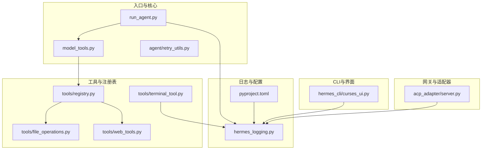
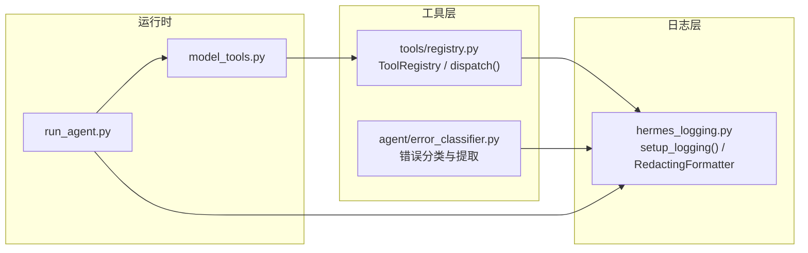
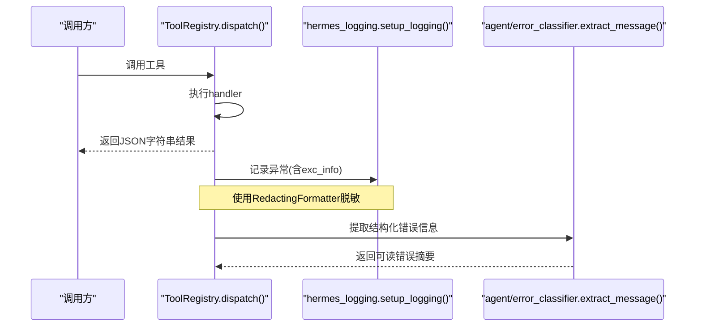
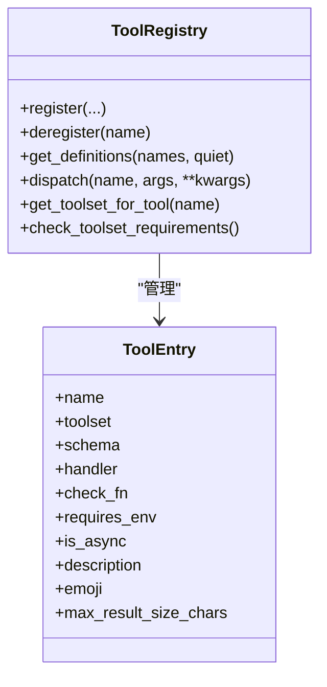
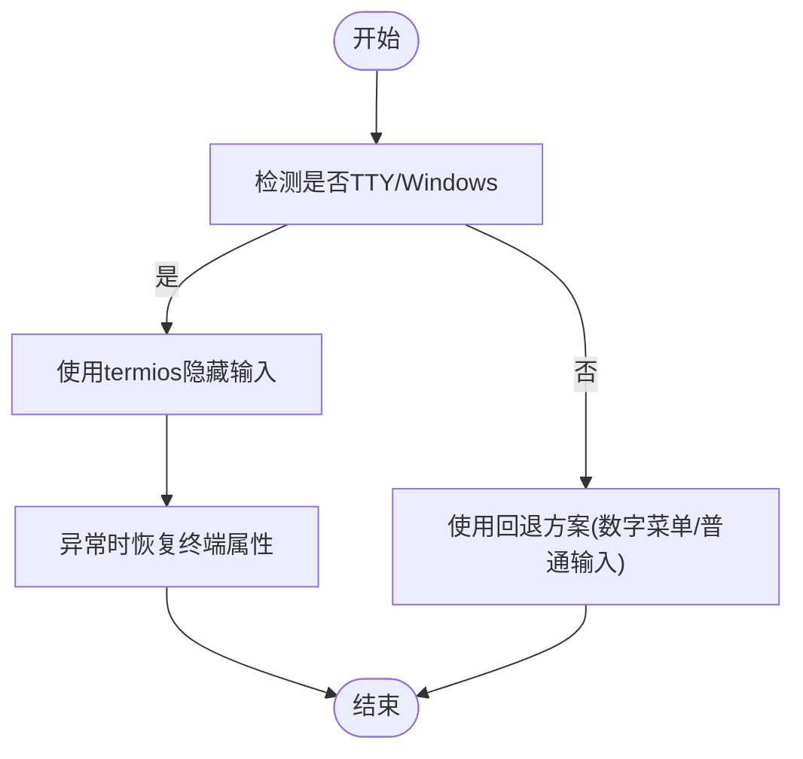
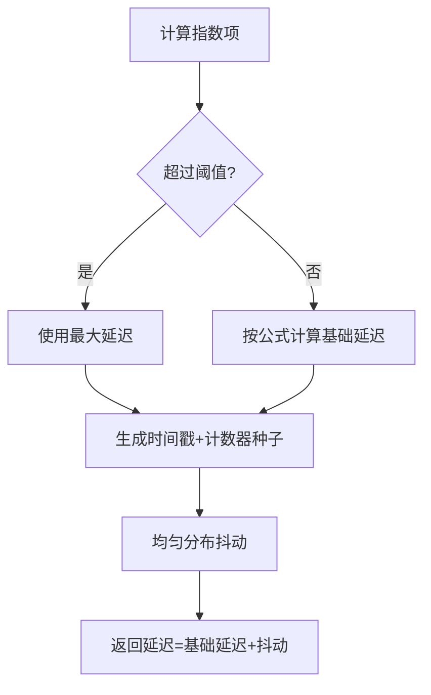
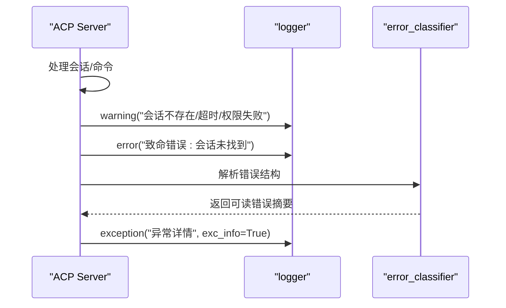
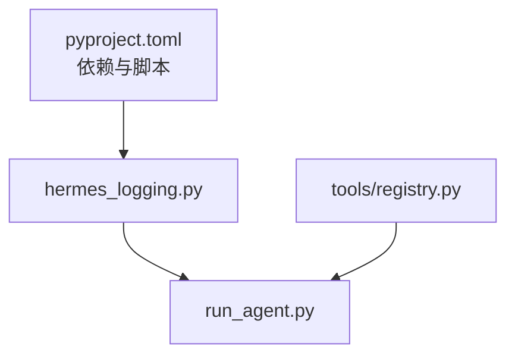

# 代码风格规范

<cite>
**本文引用的文件**
- [CONTRIBUTING.md](file://CONTRIBUTING.md)
- [README.md](file://README.md)
- [pyproject.toml](file://pyproject.toml)
- [hermes_logging.py](file://hermes_logging.py)
- [agent/retry_utils.py](file://agent/retry_utils.py)
- [tools/registry.py](file://tools/registry.py)
- [tools/terminal_tool.py](file://tools/terminal_tool.py)
- [hermes_cli/curses_ui.py](file://hermes_cli/curses_ui.py)
- [tools/file_operations.py](file://tools/file_operations.py)
- [tools/web_tools.py](file://tools/web_tools.py)
- [acp_adapter/server.py](file://acp_adapter/server.py)
- [agent/error_classifier.py](file://agent/error_classifier.py)
</cite>

## 目录
1. [简介](#简介)
2. [项目结构](#项目结构)
3. [核心组件](#核心组件)
4. [架构总览](#架构总览)
5. [详细组件分析](#详细组件分析)
6. [依赖关系分析](#依赖关系分析)
7. [性能考量](#性能考量)
8. [故障排查指南](#故障排查指南)
9. [结论](#结论)
10. [附录](#附录)

## 简介
本指南面向Hermes Agent贡献者与维护者，系统化阐述代码风格规范与最佳实践，涵盖：
- PEP 8编码标准及项目中的实用例外
- 注释与文档编写原则（仅在解释非显而易见意图、权衡或API怪癖时添加）
- 错误处理规范（捕获特定异常、使用logger.warning()/logger.error()记录、意外错误时使用exc_info=True）
- 跨平台编程注意事项（不要假设Unix系统）
- 常见代码审查问题与改进建议

本规范以仓库现有实现为依据，结合测试与工具模块的实际用法，确保一致性与可维护性。

## 项目结构
Hermes Agent采用模块化分层组织：核心运行时（run_agent、model_tools）、CLI入口（hermes_cli）、工具体系（tools）、网关（gateway）、ACPI适配器（acp_adapter）等。代码风格要求统一遵循PEP 8，并在跨平台兼容、错误处理与注释策略上形成明确约束。

图表来源
- [pyproject.toml:112-118](file://pyproject.toml#L112-L118)
- [hermes_logging.py:161-265](file://hermes_logging.py#L161-L265)
- [tools/registry.py:1-336](file://tools/registry.py#L1-L336)
- [tools/file_operations.py:1-200](file://tools/file_operations.py#L1-L200)
- [tools/web_tools.py:1-200](file://tools/web_tools.py#L1-L200)
- [tools/terminal_tool.py:240-439](file://tools/terminal_tool.py#L240-L439)
- [hermes_cli/curses_ui.py:20-219](file://hermes_cli/curses_ui.py#L20-L219)
- [acp_adapter/server.py:140-320](file://acp_adapter/server.py#L140-L320)

章节来源
- [pyproject.toml:112-118](file://pyproject.toml#L112-L118)
- [README.md:114-182](file://README.md#L114-L182)

## 核心组件
- 日志子系统：集中式日志初始化、会话上下文注入、组件路由与脱敏格式化。
- 工具注册表：自注册工具模式、可用性检查、异步桥接与统一错误返回。
- 重试工具：去相关抖动退避算法，避免并发风暴。
- 终端与UI：跨平台终端交互、安全密码输入、TTY清理与回退机制。
- 网关与适配器：多平台消息网关、会话管理与错误分类。

章节来源
- [hermes_logging.py:161-265](file://hermes_logging.py#L161-L265)
- [tools/registry.py:48-291](file://tools/registry.py#L48-L291)
- [agent/retry_utils.py:19-58](file://agent/retry_utils.py#L19-L58)
- [tools/terminal_tool.py:240-439](file://tools/terminal_tool.py#L240-L439)
- [hermes_cli/curses_ui.py:20-219](file://hermes_cli/curses_ui.py#L20-L219)
- [acp_adapter/server.py:140-320](file://acp_adapter/server.py#L140-L320)

## 架构总览
下图展示日志、工具注册与错误处理在系统中的协作关系，体现“集中化日志、统一工具调度、稳健错误处理”的设计取向。

图表来源
- [hermes_logging.py:161-265](file://hermes_logging.py#L161-L265)
- [tools/registry.py:149-167](file://tools/registry.py#L149-L167)
- [agent/error_classifier.py:266-809](file://agent/error_classifier.py#L266-L809)

## 详细组件分析

### 日志与错误处理规范
- 集中式日志初始化：支持多文件处理器、按组件过滤、轮转与脱敏。
- 会话上下文：线程本地存储注入session_tag，便于关联对话与定位问题。
- 错误记录：统一使用logger.warning()/logger.error()；对未预期异常使用exc_info=True输出堆栈。
- 第三方噪声抑制：对常见高噪声库设置级别上限，降低干扰。

图表来源
- [tools/registry.py:149-167](file://tools/registry.py#L149-L167)
- [hermes_logging.py:161-265](file://hermes_logging.py#L161-L265)
- [agent/error_classifier.py:797-809](file://agent/error_classifier.py#L797-L809)

章节来源
- [hermes_logging.py:161-265](file://hermes_logging.py#L161-L265)
- [tools/registry.py:149-167](file://tools/registry.py#L149-L167)
- [agent/error_classifier.py:266-809](file://agent/error_classifier.py#L266-L809)

### 工具注册与调度
- 自注册模式：工具文件在导入时通过registry.register()登记，model_tools查询注册表而非维护冗余数据结构。
- 可用性检查：check_fn失败时记录调试日志并跳过该工具，避免崩溃。
- 异步桥接：异步handler自动桥接到同步执行，统一返回JSON字符串。
- 统一错误格式：异常被捕获并转换为{"error": "..."}，便于上层一致处理。

图表来源
- [tools/registry.py:24-94](file://tools/registry.py#L24-L94)
- [tools/registry.py:48-291](file://tools/registry.py#L48-L291)

章节来源
- [tools/registry.py:1-336](file://tools/registry.py#L1-L336)

### 跨平台与终端交互
- TTY与termios：在非Windows平台使用termios隐藏输入、恢复属性；Windows路径使用msvcrt替代。
- 终端清理：stdin缓冲区清空，避免残留键入污染后续输入。
- 回退机制：termios/ncurses不可用时降级为数字菜单或普通输入。
- 写操作保护：写路径白名单与前缀限制，结合安全根目录约束，防止越权写入。

图表来源
- [tools/terminal_tool.py:240-439](file://tools/terminal_tool.py#L240-L439)
- [hermes_cli/curses_ui.py:20-219](file://hermes_cli/curses_ui.py#L20-L219)
- [tools/file_operations.py:99-117](file://tools/file_operations.py#L99-L117)

章节来源
- [tools/terminal_tool.py:240-439](file://tools/terminal_tool.py#L240-L439)
- [hermes_cli/curses_ui.py:20-219](file://hermes_cli/curses_ui.py#L20-L219)
- [tools/file_operations.py:43-117](file://tools/file_operations.py#L43-L117)

### 重试与退避策略
- 去相关抖动退避：基于指数退避叠加随机抖动，避免多个会话同时重试导致的“惊群”。
- 并发安全：使用锁与单调计数器保证抖动种子唯一性，提升解耦效果。

图表来源
- [agent/retry_utils.py:19-58](file://agent/retry_utils.py#L19-L58)

章节来源
- [agent/retry_utils.py:19-58](file://agent/retry_utils.py#L19-L58)

### 网关与适配器的错误处理
- 明确区分warning/error级别：会话缺失、超时、权限请求失败等使用warning；致命错误使用error。
- 捕获通用异常并记录exc_info，便于定位根因。
- 对外部服务异常进行结构化解析与摘要提取，提升可观测性。

图表来源
- [acp_adapter/server.py:179-208](file://acp_adapter/server.py#L179-L208)
- [acp_adapter/server.py:366-366](file://acp_adapter/server.py#L366-L366)
- [acp_adapter/server.py:541-541](file://acp_adapter/server.py#L541-L541)
- [agent/error_classifier.py:266-809](file://agent/error_classifier.py#L266-L809)

章节来源
- [acp_adapter/server.py:140-320](file://acp_adapter/server.py#L140-L320)
- [agent/error_classifier.py:266-809](file://agent/error_classifier.py#L266-L809)

## 依赖关系分析
- 运行时依赖：pyproject.toml定义核心库与可选功能，确保最小供应链攻击面。
- 日志与配置：hermes_logging依赖配置读取与脱敏格式化，统一输出。
- 工具链路：model_tools通过注册表获取工具定义与可用性，避免硬编码。

图表来源
- [pyproject.toml:13-37](file://pyproject.toml#L13-L37)
- [hermes_logging.py:161-265](file://hermes_logging.py#L161-L265)
- [tools/registry.py:1-336](file://tools/registry.py#L1-L336)

章节来源
- [pyproject.toml:1-129](file://pyproject.toml#L1-L129)
- [hermes_logging.py:161-265](file://hermes_logging.py#L161-L265)
- [tools/registry.py:1-336](file://tools/registry.py#L1-L336)

## 性能考量
- 退避抖动：减少并发重试峰值，提升整体稳定性。
- 日志轮转与脱敏：控制磁盘占用与敏感信息泄露风险。
- 工具可用性检查：避免无效调用，减少网络与I/O开销。
- 终端交互优化：TTY属性恢复与stdin清空，避免阻塞与资源泄漏。

## 故障排查指南
- 日志定位：使用会话ID过滤，结合errors.log快速定位警告与错误。
- 错误分类：优先从结构化响应中提取消息，必要时解析嵌套metadata。
- 异常记录：对未预期异常使用exc_info=True，保留完整堆栈。
- 跨平台差异：确认termios/ncurses可用性，必要时启用回退逻辑。

章节来源
- [hermes_logging.py:161-265](file://hermes_logging.py#L161-L265)
- [agent/error_classifier.py:266-809](file://agent/error_classifier.py#L266-L809)
- [tools/terminal_tool.py:240-439](file://tools/terminal_tool.py#L240-L439)

## 结论
本规范以PEP 8为基础，结合项目实际需求，在跨平台兼容、错误处理与注释策略上形成统一标准。通过集中式日志、工具注册表与稳健的错误分类，Hermes Agent在多平台与多后端环境下保持一致的可靠性与可维护性。

## 附录

### PEP 8与实用例外
- 代码风格遵循PEP 8，但不强制严格行长度。
- 注释仅用于解释非显而易见的意图、权衡或API怪癖，避免“叙述性注释”。

章节来源
- [CONTRIBUTING.md:230-236](file://CONTRIBUTING.md#L230-L236)

### 错误处理规范清单
- 捕获具体异常类型，避免裸except。
- 使用logger.warning()/logger.error()记录常规与严重错误。
- 未预期异常使用exc_info=True输出堆栈。
- 对外部服务错误进行结构化解析与摘要提取。

章节来源
- [tools/registry.py:149-167](file://tools/registry.py#L149-L167)
- [acp_adapter/server.py:179-208](file://acp_adapter/server.py#L179-L208)
- [agent/error_classifier.py:266-809](file://agent/error_classifier.py#L266-L809)

### 跨平台编程注意事项
- 不要假设Unix系统：termios/ncurses在Windows不可用，需提供回退方案。
- 文件编码：Windows可能以不同编码保存环境文件，需处理UnicodeDecodeError。
- 进程管理：Windows不支持某些信号与进程组操作，需条件分支处理。
- 路径分隔符：统一使用pathlib.Path，避免字符串拼接。

章节来源
- [CONTRIBUTING.md:516-554](file://CONTRIBUTING.md#L516-L554)
- [hermes_cli/curses_ui.py:20-219](file://hermes_cli/curses_ui.py#L20-L219)
- [tools/terminal_tool.py:240-439](file://tools/terminal_tool.py#L240-L439)

### 常见代码审查问题与建议
- 注释冗余：删除重复描述代码行为的注释，保留解释性内容。
- 异常处理：避免裸except，优先捕获具体异常并记录上下文。
- 跨平台：在导入或使用平台特定模块前进行条件判断与回退。
- 日志：统一使用RedactingFormatter，避免敏感信息落盘。

章节来源
- [CONTRIBUTING.md:230-236](file://CONTRIBUTING.md#L230-L236)
- [hermes_logging.py:161-265](file://hermes_logging.py#L161-L265)
- [tools/terminal_tool.py:240-439](file://tools/terminal_tool.py#L240-L439)