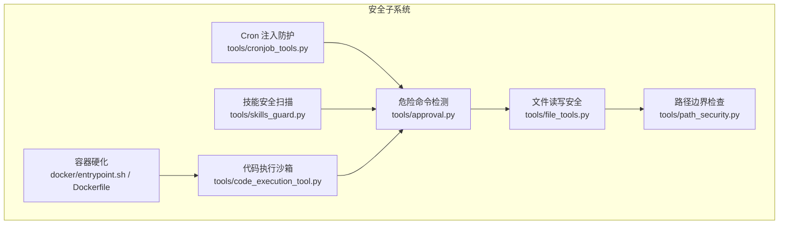
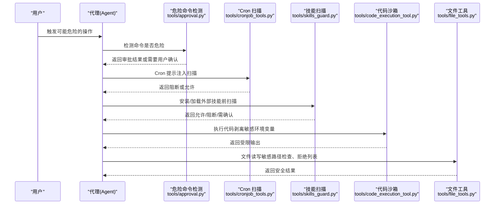
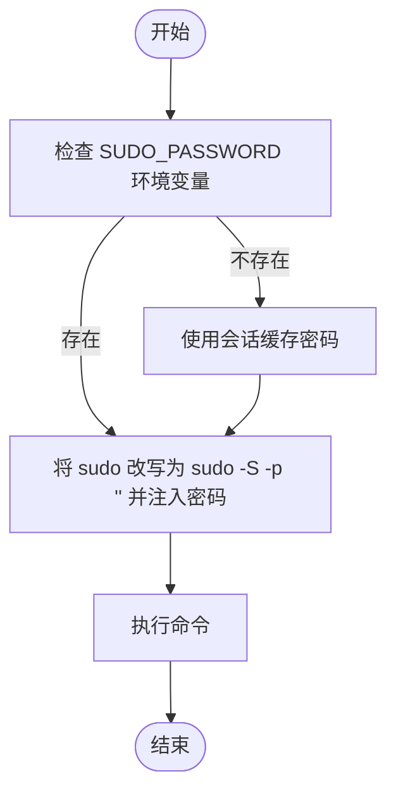
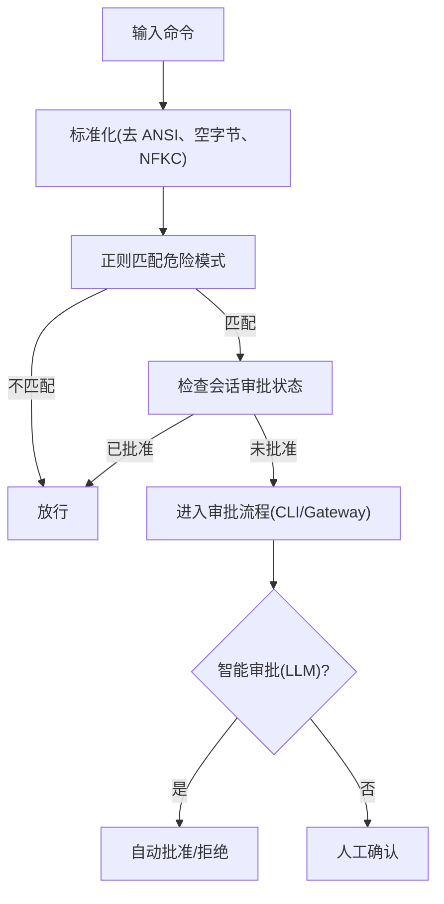
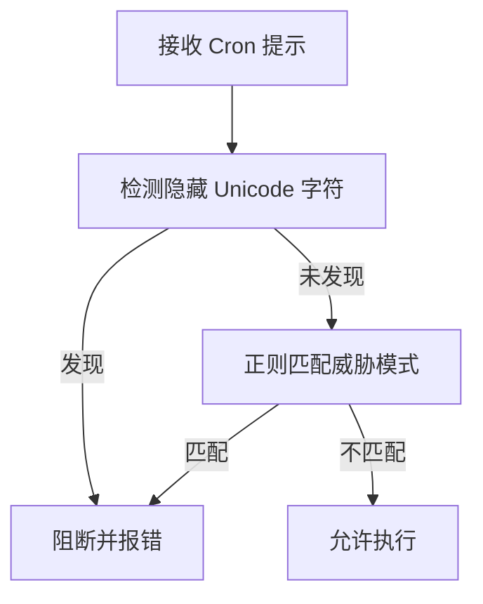
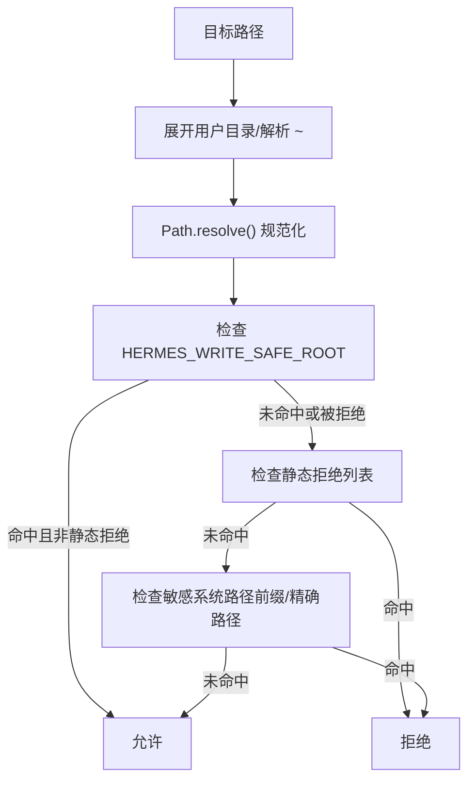
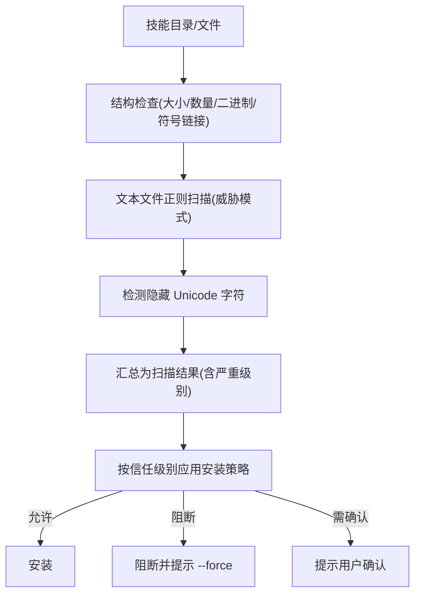
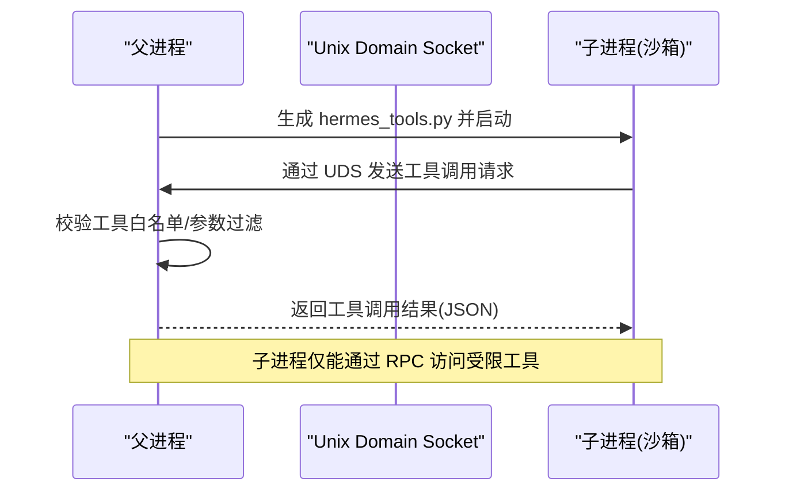
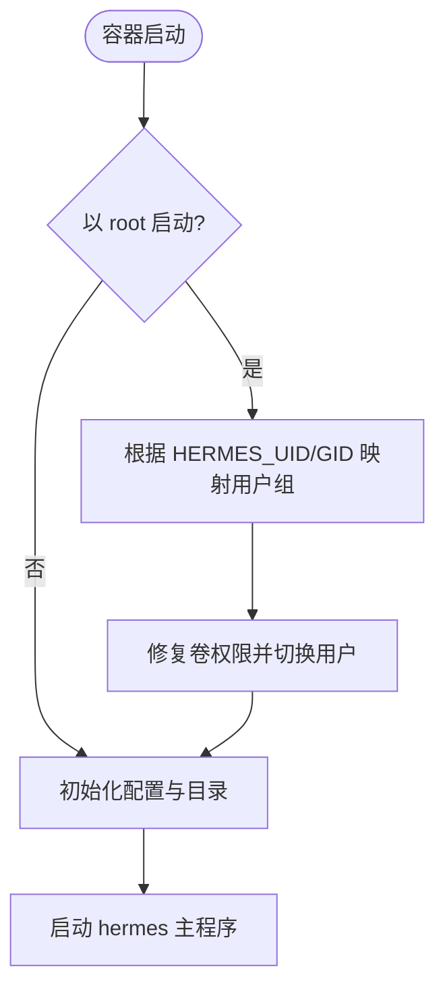
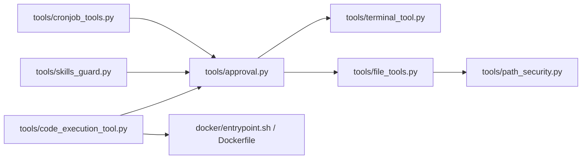

# 安全考虑

<cite>
**本文引用的文件**
- [CONTRIBUTING.md](file://CONTRIBUTING.md)
- [tools/approval.py](file://tools/approval.py)
- [tools/cronjob_tools.py](file://tools/cronjob_tools.py)
- [tools/skills_guard.py](file://tools/skills_guard.py)
- [tools/code_execution_tool.py](file://tools/code_execution_tool.py)
- [tools/file_tools.py](file://tools/file_tools.py)
- [tools/path_security.py](file://tools/path_security.py)
- [docker/entrypoint.sh](file://docker/entrypoint.sh)
- [Dockerfile](file://Dockerfile)
- [tests/tools/test_approval.py](file://tests/tools/test_approval.py)
- [tests/tools/test_cronjob_tools.py](file://tests/tools/test_cronjob_tools.py)
- [tests/tools/test_write_deny.py](file://tests/tools/test_write_deny.py)
- [tests/tools/test_file_write_safety.py](file://tests/tools/test_file_write_safety.py)
- [tests/tools/test_terminal_tool.py](file://tests/tools/test_terminal_tool.py)
</cite>

## 目录
1. [简介](#简介)
2. [项目结构](#项目结构)
3. [核心组件](#核心组件)
4. [架构总览](#架构总览)
5. [详细组件分析](#详细组件分析)
6. [依赖关系分析](#依赖关系分析)
7. [性能考量](#性能考量)
8. [故障排查指南](#故障排查指南)
9. [结论](#结论)

## 简介
本指南面向为 Hermes Agent 贡献安全相关改动的开发者，系统梳理现有安全保护机制，并给出安全敏感代码的贡献规范与 PR 特殊要求。Hermes 具备终端访问能力，因此安全至关重要。现有保护覆盖：sudo 密码管道、危险命令检测、Cron 提示注入防护、写入拒绝列表、技能保护、代码执行沙箱、容器硬化等。

## 项目结构
与安全相关的关键模块分布如下：
- 危险命令检测与审批流：tools/approval.py
- Cron 提示注入扫描：tools/cronjob_tools.py
- 技能安装安全扫描：tools/skills_guard.py
- 代码执行沙箱：tools/code_execution_tool.py
- 文件读写安全与路径边界：tools/file_tools.py、tools/path_security.py
- 容器运行时硬化：docker/entrypoint.sh、Dockerfile
- 测试用例：tests/tools 下多文件

**图表来源**
- [tools/approval.py:1-200](file://tools/approval.py#L1-L200)
- [tools/cronjob_tools.py:43-71](file://tools/cronjob_tools.py#L43-L71)
- [tools/skills_guard.py:1-120](file://tools/skills_guard.py#L1-L120)
- [tools/code_execution_tool.py:1-120](file://tools/code_execution_tool.py#L1-L120)
- [tools/file_tools.py:93-117](file://tools/file_tools.py#L93-L117)
- [tools/path_security.py:15-44](file://tools/path_security.py#L15-L44)
- [docker/entrypoint.sh:1-65](file://docker/entrypoint.sh#L1-L65)
- [Dockerfile:1-47](file://Dockerfile#L1-L47)

**章节来源**
- [CONTRIBUTING.md:556-581](file://CONTRIBUTING.md#L556-L581)

## 核心组件
- sudo 密码管道：通过将 sudo 改写为从标准输入读取密码，避免明文参数泄露与交互式提示，提升安全性与可审计性。
- 危险命令检测：基于正则模式匹配与会话级审批状态，对高危操作进行拦截与用户确认。
- Cron 提示注入防护：扫描 Cron 提示中的隐藏字符与威胁模式，阻断注入与数据外泄意图。
- 写入拒绝列表：静态拒绝敏感路径（如 /etc/shadow、~/.ssh/authorized_keys），并结合 realpath 防止符号链接绕过。
- 技能保护：对从外部源安装的技能进行静态扫描，识别 exfiltration、injection、destructive 等威胁类别。
- 代码执行沙箱：子进程执行时剥离敏感环境变量，限制可用工具集，远程后端通过文件 RPC 与请求/响应隔离。
- 容器硬化：非 root 运行、丢弃多余能力、限制 PID、限制 tmpfs 大小等。

**章节来源**
- [CONTRIBUTING.md:556-581](file://CONTRIBUTING.md#L556-L581)
- [tools/approval.py:75-133](file://tools/approval.py#L75-L133)
- [tools/cronjob_tools.py:58-66](file://tools/cronjob_tools.py#L58-L66)
- [tools/skills_guard.py:82-484](file://tools/skills_guard.py#L82-L484)
- [tools/code_execution_tool.py:54-71](file://tools/code_execution_tool.py#L54-L71)
- [docker/entrypoint.sh:8-30](file://docker/entrypoint.sh#L8-L30)
- [Dockerfile:18-22](file://Dockerfile#L18-L22)

## 架构总览
下图展示关键安全流程在系统中的交互位置：

**图表来源**
- [tools/approval.py:181-193](file://tools/approval.py#L181-L193)
- [tools/cronjob_tools.py:58-66](file://tools/cronjob_tools.py#L58-L66)
- [tools/skills_guard.py:595-640](file://tools/skills_guard.py#L595-L640)
- [tools/code_execution_tool.py:307-426](file://tools/code_execution_tool.py#L307-L426)
- [tools/file_tools.py:99-116](file://tools/file_tools.py#L99-L116)

## 详细组件分析

### sudo 密码管道
- 变换策略：将裸 sudo 替换为带 -S 选项并清空提示符的调用，密码从标准输入传入，避免命令行暴露。
- 缓存与回退：若未设置环境变量，保留上次会话缓存的密码；交互式场景下支持超时与取消。
- 测试验证：覆盖搜索 sudo、printf 输出 sudo、环境变量前缀等边界情况。

**图表来源**
- [tools/terminal_tool.py:448-446](file://tools/terminal_tool.py#L448-L446)
- [tests/tools/test_terminal_tool.py:47-90](file://tests/tools/test_terminal_tool.py#L47-L90)

**章节来源**
- [tools/terminal_tool.py:448-446](file://tools/terminal_tool.py#L448-L446)
- [tests/tools/test_terminal_tool.py:14-90](file://tests/tools/test_terminal_tool.py#L14-L90)

### 危险命令检测与审批
- 模式匹配：涵盖 rm -rf、chmod 权限修改、系统服务控制、脚本执行、管道到 shell、heredoc、git 破坏性操作等。
- 会话状态：支持一次性、会话级、永久允许与拒绝；支持智能审批（辅助 LLM 风险评估）。
- 组合防护：与 Tirith 安全扫描合并，统一审批入口，避免绕过。

**图表来源**
- [tools/approval.py:163-193](file://tools/approval.py#L163-L193)
- [tools/approval.py:583-657](file://tools/approval.py#L583-L657)

**章节来源**
- [tools/approval.py:75-133](file://tools/approval.py#L75-L133)
- [tools/approval.py:583-657](file://tools/approval.py#L583-L657)
- [tests/tools/test_approval.py:43-822](file://tests/tools/test_approval.py#L43-L822)

### Cron 提示注入防护
- 隐藏字符检测：对多种零宽/方向控制字符进行扫描，阻断隐藏指令。
- 威胁模式：覆盖 curl/wget 泄密、cat 凭证文件、authorized_keys、/etc/sudoers、rm -rf / 等。
- 行为约束：无需系统 crontab，内部 JSON 调度器实现，降低注入面。

**图表来源**
- [tools/cronjob_tools.py:52-66](file://tools/cronjob_tools.py#L52-L66)
- [tests/tools/test_cronjob_tools.py:36-62](file://tests/tools/test_cronjob_tools.py#L36-L62)

**章节来源**
- [tools/cronjob_tools.py:58-66](file://tools/cronjob_tools.py#L58-L66)
- [tests/tools/test_cronjob_tools.py:36-62](file://tests/tools/test_cronjob_tools.py#L36-L62)

### 写入拒绝列表与路径边界
- 静态拒绝：/etc/shadow、~/.ssh/authorized_keys、~/.hermes/.env 等。
- 路径解析：使用 realpath 解决符号链接与相对路径逃逸问题。
- 安全根目录：HERMES_WRITE_SAFE_ROOT 可限定写入范围，但不会覆盖静态拒绝项。
- 敏感系统路径：拒绝写入 /etc、/usr/lib/systemd 等敏感前缀与特定设备套接字。

**图表来源**
- [tools/file_tools.py:99-116](file://tools/file_tools.py#L99-L116)
- [tools/file_tools.py:102-106](file://tools/file_tools.py#L102-L106)
- [tests/tools/test_write_deny.py:10-83](file://tests/tools/test_write_deny.py#L10-L83)
- [tests/tools/test_file_write_safety.py:28-80](file://tests/tools/test_file_write_safety.py#L28-L80)

**章节来源**
- [tools/file_tools.py:93-117](file://tools/file_tools.py#L93-L117)
- [tools/path_security.py:15-44](file://tools/path_security.py#L15-L44)
- [tests/tools/test_write_deny.py:10-83](file://tests/tools/test_write_deny.py#L10-L83)
- [tests/tools/test_file_write_safety.py:28-80](file://tests/tools/test_file_write_safety.py#L28-L80)

### 技能保护（Hub 安装）
- 静态扫描：正则识别 exfiltration、injection、destructive、persistence、network、obfuscation 等威胁类别。
- 信任策略：builtin/trusted/community/agent-created 不同信任级别对应允许/阻断/需确认策略。
- 结构检查：文件数量/大小、二进制扩展名、符号链接合法性、过大文件等。
- 可见性字符：检测隐藏 Unicode，辅助发现隐蔽注入。

**图表来源**
- [tools/skills_guard.py:595-640](file://tools/skills_guard.py#L595-L640)
- [tools/skills_guard.py:642-677](file://tools/skills_guard.py#L642-L677)
- [tools/skills_guard.py:734-800](file://tools/skills_guard.py#L734-L800)

**章节来源**
- [tools/skills_guard.py:82-484](file://tools/skills_guard.py#L82-L484)
- [tools/skills_guard.py:642-677](file://tools/skills_guard.py#L642-L677)

### 代码执行沙箱
- 工具白名单：仅允许 web_search、web_extract、read_file、write_file、search_files、patch、terminal。
- 远程后端：文件 RPC（请求/响应文件），避免直接网络通道泄露。
- 环境隔离：剥离敏感环境变量（如 API Keys），限制资源与工具调用次数。
- 本地 UDS：Unix 域套接字传输，远程文件传输采用 base64 编解码。

**图表来源**
- [tools/code_execution_tool.py:130-163](file://tools/code_execution_tool.py#L130-L163)
- [tools/code_execution_tool.py:307-426](file://tools/code_execution_tool.py#L307-L426)
- [tools/code_execution_tool.py:564-704](file://tools/code_execution_tool.py#L564-L704)

**章节来源**
- [tools/code_execution_tool.py:54-71](file://tools/code_execution_tool.py#L54-L71)
- [tools/code_execution_tool.py:130-163](file://tools/code_execution_tool.py#L130-L163)
- [tools/code_execution_tool.py:307-426](file://tools/code_execution_tool.py#L307-L426)
- [tools/code_execution_tool.py:564-704](file://tools/code_execution_tool.py#L564-L704)

### 容器硬化
- 非 root 运行：默认以非 root 用户启动，支持通过环境变量映射 UID/GID。
- 权限最小化：丢弃多余能力、限制 PID、限制 tmpfs 大小。
- 启动引导：首次运行初始化配置文件与目录结构，同步内置技能。

**图表来源**
- [docker/entrypoint.sh:8-30](file://docker/entrypoint.sh#L8-L30)
- [docker/entrypoint.sh:32-65](file://docker/entrypoint.sh#L32-L65)
- [Dockerfile:18-22](file://Dockerfile#L18-L22)

**章节来源**
- [docker/entrypoint.sh:8-30](file://docker/entrypoint.sh#L8-L30)
- [docker/entrypoint.sh:32-65](file://docker/entrypoint.sh#L32-L65)
- [Dockerfile:18-22](file://Dockerfile#L18-L22)

## 依赖关系分析
- approval.py 是危险命令检测与审批的核心，被 terminal_tool、file_tools 等调用前置检查。
- cronjob_tools.py 在 Cron 提示阶段独立扫描，与 approval 的组合防护避免单一检查被绕过。
- skills_guard.py 在技能安装前执行，作为外部源的“防火墙”。
- code_execution_tool.py 通过白名单与环境剥离实现沙箱，减少任意代码执行风险。
- file_tools.py 与 path_security.py 共同保证路径边界与敏感路径写入控制。
- 容器层提供系统级隔离与最小权限。

**图表来源**
- [tools/approval.py:583-657](file://tools/approval.py#L583-L657)
- [tools/cronjob_tools.py:58-66](file://tools/cronjob_tools.py#L58-L66)
- [tools/skills_guard.py:595-640](file://tools/skills_guard.py#L595-L640)
- [tools/code_execution_tool.py:307-426](file://tools/code_execution_tool.py#L307-L426)
- [tools/file_tools.py:99-116](file://tools/file_tools.py#L99-L116)
- [tools/path_security.py:15-44](file://tools/path_security.py#L15-L44)
- [docker/entrypoint.sh:8-30](file://docker/entrypoint.sh#L8-L30)
- [Dockerfile:18-22](file://Dockerfile#L18-L22)

**章节来源**
- [tools/approval.py:583-657](file://tools/approval.py#L583-L657)
- [tools/file_tools.py:99-116](file://tools/file_tools.py#L99-L116)

## 性能考量
- 正则扫描与文件扫描的成本：正则匹配与多文件扫描可能带来开销，建议在策略上限制并发与结果数量。
- 资源限制：沙箱内设置超时、最大工具调用次数与输出大小上限，避免资源耗尽。
- I/O 优化：文件读写采用分页与去重策略，减少上下文窗口压力与重复传输。

[本节为通用指导，无需具体文件引用]

## 故障排查指南
- sudo 密码交互失败：检查 SUDO_PASSWORD 是否正确设置，或查看会话缓存是否生效；交互式超时/取消会优雅降级。
- 危险命令误报：可通过会话级/永久允许键放行，或调整审批模式（smart/off）；必要时使用 --force（谨慎）。
- Cron 提示被阻断：检查是否包含隐藏字符或威胁模式；确保提示内容不含敏感变量与破坏性指令。
- 写入被拒：确认路径是否命中静态拒绝列表或敏感系统路径；如需在受限范围内写入，使用 HERMES_WRITE_SAFE_ROOT。
- 技能安装失败：查看扫描报告中的严重级别与发现项，按信任级别选择 --force 或修正内容。
- 沙箱执行异常：检查工具白名单、远程后端 Python 可用性、RPC 目录权限与磁盘空间。

**章节来源**
- [tests/tools/test_terminal_tool.py:47-90](file://tests/tools/test_terminal_tool.py#L47-L90)
- [tests/tools/test_cronjob_tools.py:36-62](file://tests/tools/test_cronjob_tools.py#L36-L62)
- [tests/tools/test_write_deny.py:10-83](file://tests/tools/test_write_deny.py#L10-L83)
- [tests/tools/test_file_write_safety.py:28-80](file://tests/tools/test_file_write_safety.py#L28-L80)
- [tools/skills_guard.py:642-677](file://tools/skills_guard.py#L642-L677)

## 结论
Hermes 的安全体系通过“命令检测 + 审批 + Cron 注入防护 + 写入拒绝 + 技能扫描 + 沙箱 + 容器硬化”的多层协同，有效降低了终端访问带来的风险。贡献者在编写安全敏感代码时，应遵循本文的指导原则与 PR 要求，确保变更在所有平台得到充分测试，并明确标注安全影响。