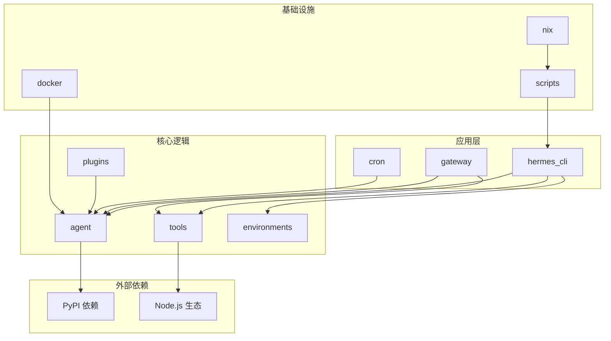
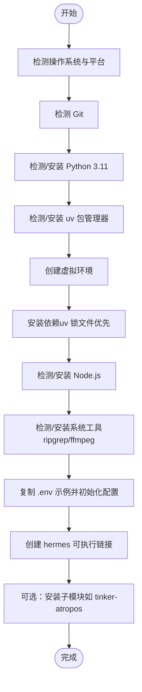
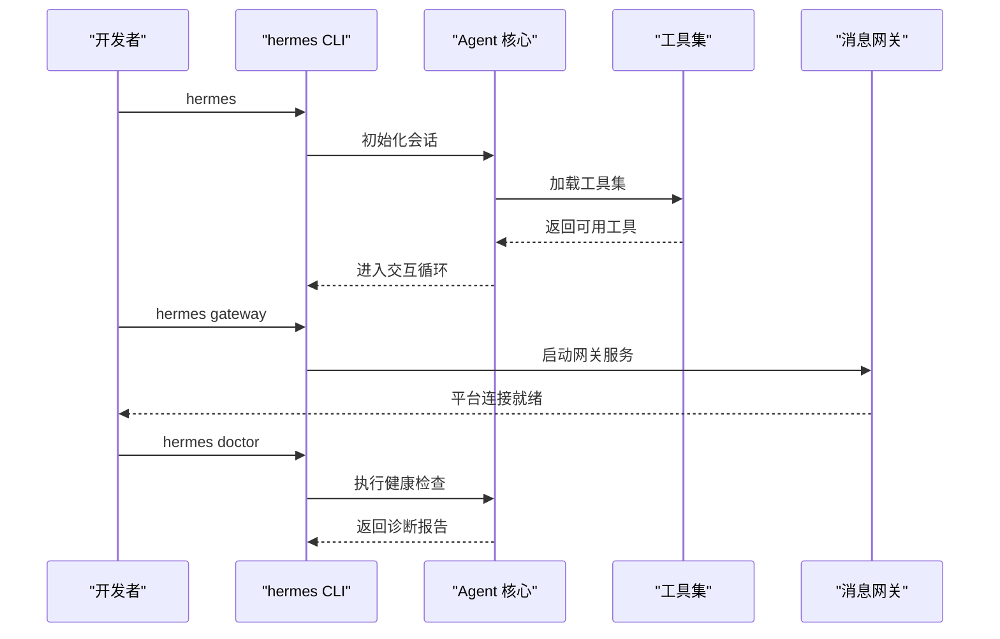
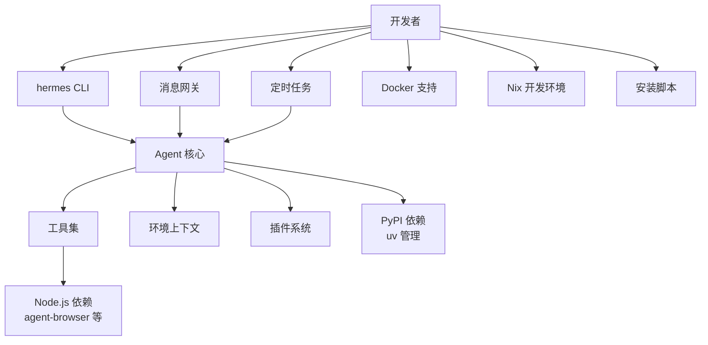
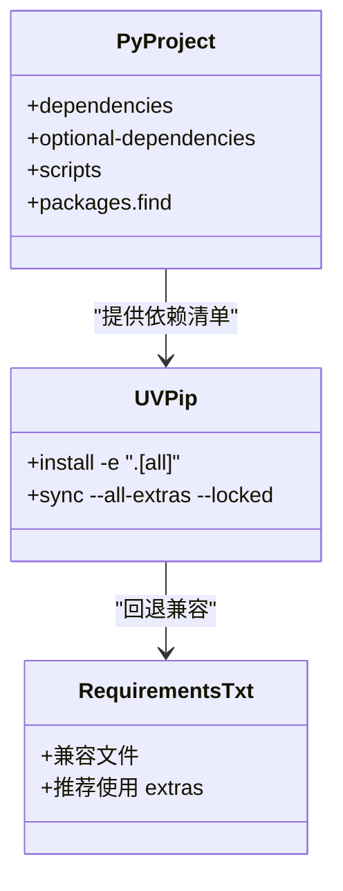
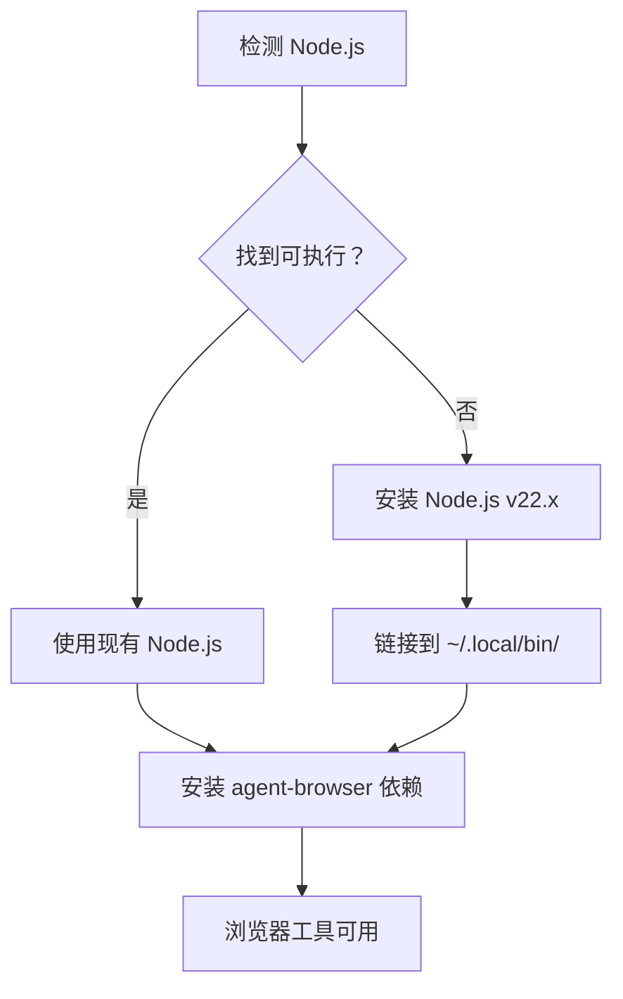
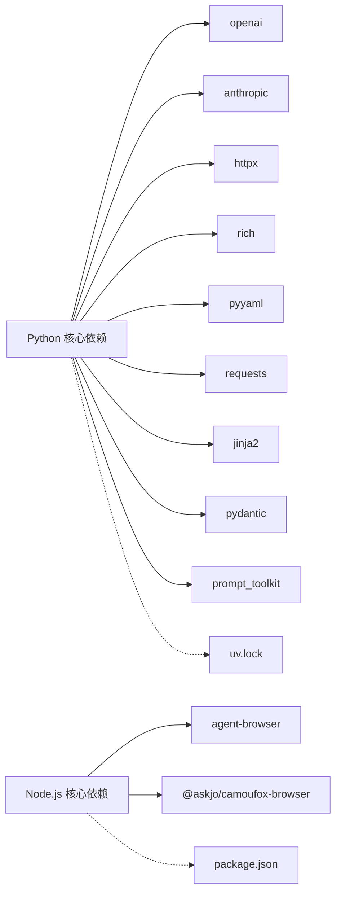

# 开发环境搭建

<cite>
**本文引用的文件**
- [README.md](file://README.md)
- [pyproject.toml](file://pyproject.toml)
- [requirements.txt](file://requirements.txt)
- [setup-hermes.sh](file://setup-hermes.sh)
- [scripts/install.sh](file://scripts/install.sh)
- [cli-config.yaml.example](file://cli-config.yaml.example)
- [.env.example](file://.env.example)
- [package.json](file://package.json)
- [flake.nix](file://flake.nix)
- [uv.lock](file://uv.lock)
- [tools/browser_tool.py](file://tools/browser_tool.py)
- [tests/tools/test_browser_homebrew_paths.py](file://tests/tools/test_browser_homebrew_paths.py)
</cite>

## 目录
1. [简介](#简介)
2. [项目结构](#项目结构)
3. [前置条件与系统要求](#前置条件与系统要求)
4. [安装步骤](#安装步骤)
5. [开发配置](#开发配置)
6. [运行验证与测试](#运行验证与测试)
7. [架构概览](#架构概览)
8. [详细组件分析](#详细组件分析)
9. [依赖关系分析](#依赖关系分析)
10. [性能考虑](#性能考虑)
11. [故障排除指南](#故障排除指南)
12. [结论](#结论)

## 简介
本指南面向希望在本地进行 Hermes Agent 开发的工程师，提供从零开始的完整开发环境搭建流程。内容覆盖前置条件检查、Python 虚拟环境与依赖安装、可选组件配置、用户配置文件创建、运行验证与测试执行，以及常见问题的排查与调试技巧。

## 项目结构
Hermes Agent 采用多模块组织方式，核心目录与职责如下：
- agent：智能体核心逻辑与适配器
- tools：工具集与浏览器、终端、文件等能力封装
- hermes_cli：命令行入口与交互界面
- gateway：消息网关平台集成（Telegram、Discord、Slack 等）
- cron：定时任务调度
- acp_adapter / acp_registry：ACp 协议适配与注册
- environments：环境与工具上下文
- optional-skills / skills：技能系统与示例技能
- plugins：内存、上下文引擎等插件扩展
- docker / nix：容器与 Nix 开发环境支持
- scripts：安装脚本与辅助工具
- tests：全面的单元与集成测试套件

图示来源
- [pyproject.toml:112-121](file://pyproject.toml#L112-L121)
- [README.md:14-179](file://README.md#L14-L179)

章节来源
- [README.md:14-179](file://README.md#L14-L179)
- [pyproject.toml:112-121](file://pyproject.toml#L112-L121)

## 前置条件与系统要求
- 操作系统
  - Linux、macOS、WSL2 支持；Android 通过 Termux 支持；Windows 原生不支持，需使用 WSL2。
- Python
  - 版本要求：Python 3.11 及以上。项目在 pyproject.toml 中明确声明 requires-python = ">=3.11"。
- 包管理器
  - 推荐使用 uv（快速 Python 包管理器）；若未安装，安装脚本会自动下载安装。
- Node.js
  - 浏览器工具链需要 Node.js 运行时。package.json 明确声明 engines.node >= 18.0.0。
  - 安装脚本会检测并按需安装 Node.js（默认 LTS 版本 22）。
- Git
  - 用于克隆仓库与更新；安装脚本会检测并提示安装。
- 可选系统工具
  - ripgrep（加速文件搜索）、ffmpeg（语音消息处理）等；安装脚本会尝试自动安装或给出手动安装指引。

章节来源
- [pyproject.toml:10](file://pyproject.toml#L10)
- [scripts/install.sh:34](file://scripts/install.sh#L34)
- [package.json:22-24](file://package.json#L22-L24)
- [scripts/install.sh:348-482](file://scripts/install.sh#L348-L482)
- [setup-hermes.sh:32](file://setup-hermes.sh#L32)
- [setup-hermes.sh:62-100](file://setup-hermes.sh#L62-L100)

## 安装步骤
以下步骤基于官方安装脚本与项目配置，确保一次性完成环境准备、虚拟环境与依赖安装、可选组件配置与初始化。

- 步骤 1：克隆仓库
  - 使用 Git 克隆仓库到本地目录。
  - 安装脚本支持 SSH 优先克隆，失败后回退到 HTTPS。
- 步骤 2：创建 Python 虚拟环境
  - 若使用 uv，将自动创建并锁定 Python 3.11 环境。
  - 在 Termux 上使用标准库 venv 创建虚拟环境。
- 步骤 3：安装依赖
  - 优先使用 uv 的锁文件进行哈希校验安装；若锁文件不可用则回退到 pip 安装。
  - 支持安装所有可选功能（如消息网关、语音、浏览器工具等）。
- 步骤 4：可选组件安装
  - 自动检测并安装 ripgrep、ffmpeg 等系统工具（Termux 下会安装构建依赖）。
  - Node.js（默认 v22.x）会在缺失时自动安装到 ~/.hermes/node/ 并加入 PATH。
- 步骤 5：子模块与可选功能
  - 可选安装 tinker-atropos（强化学习训练相关）。
- 步骤 6：环境变量与配置文件
  - 复制 .env.example 到 .env，并按需填写 API 密钥。
  - 初始化 CLI 配置文件（首次运行 hermes setup 生成）。
- 步骤 7：创建可执行链接
  - 将 venv 中的 hermes 命令软链到 ~/.local/bin/，确保全局可用。
- 步骤 8：可选：运行安装脚本内置的设置向导
  - 可选择立即运行 hermes setup 完成模型、工具、平台等配置。

图示来源
- [scripts/install.sh:296-346](file://scripts/install.sh#L296-L346)
- [scripts/install.sh:567-674](file://scripts/install.sh#L567-L674)
- [setup-hermes.sh:106-136](file://setup-hermes.sh#L106-L136)
- [setup-hermes.sh:180-194](file://setup-hermes.sh#L180-L194)
- [setup-hermes.sh:217-266](file://setup-hermes.sh#L217-L266)
- [setup-hermes.sh:268-279](file://setup-hermes.sh#L268-L279)
- [setup-hermes.sh:285-333](file://setup-hermes.sh#L285-L333)
- [setup-hermes.sh:200-211](file://setup-hermes.sh#L200-L211)

章节来源
- [scripts/install.sh:680-760](file://scripts/install.sh#L680-L760)
- [scripts/install.sh:762-792](file://scripts/install.sh#L762-L792)
- [scripts/install.sh:794-886](file://scripts/install.sh#L794-L886)
- [setup-hermes.sh:142-155](file://setup-hermes.sh#L142-L155)
- [setup-hermes.sh:164-194](file://setup-hermes.sh#L164-L194)

## 开发配置
- 用户配置文件
  - .env：放置各类 API 密钥与平台配置，优先级高于 CLI 配置文件。
  - cli-config.yaml：CLI 行为配置，如模型提供商、终端后端、工具集、压缩策略等。
- 最小化配置建议
  - 至少配置一个推理提供商（如 OpenRouter 或直接 Anthropic API Key）。
  - 设置 terminal.backend 为 local，以便在本地直接执行命令。
  - 启用必要的工具集（如 web、terminal、file），根据需要逐步开启。
- 配置项参考
  - 模型与提供商：参见 cli-config.yaml.example 中 model 与 providerRouting 配置段。
  - 终端后端：参见 terminal 配置段，支持 local、docker、ssh、modal、singularity 等。
  - 工具集与平台：参见 platformToolsets 配置段，可按平台定制工具集。
  - 浏览器工具：参见 browser 配置段，结合 Node.js 与 agent-browser 使用。

章节来源
- [.env.example:1-379](file://.env.example#L1-L379)
- [cli-config.yaml.example:8-120](file://cli-config.yaml.example#L8-L120)
- [cli-config.yaml.example:124-251](file://cli-config.yaml.example#L124-L251)
- [cli-config.yaml.example:562-570](file://cli-config.yaml.example#L562-L570)
- [cli-config.yaml.example:269-273](file://cli-config.yaml.example#L269-L273)

## 运行验证与测试
- 运行验证
  - 启动 CLI：hermes，进入交互式对话界面。
  - 查看状态：hermes status，确认配置与依赖加载正常。
  - 启动网关：hermes gateway，连接消息平台（如 Telegram、Discord）。
  - 查看定时任务：hermes cron list，确认计划任务已加载。
  - 诊断问题：hermes doctor，自动检测常见配置与依赖问题。
- 测试执行
  - 单元测试：使用 pytest 执行 tests/ 目录下的测试套件，默认标记为非集成测试。
  - 集成测试：可通过添加标记 -m "integration" 运行需要外部服务（API 密钥、Modal 等）的测试。
  - 浏览器工具测试：针对浏览器工具的特定测试位于 tests/tools/，可单独运行以验证浏览器依赖与权限。

图示来源
- [README.md:51-63](file://README.md#L51-L63)
- [pyproject.toml:123-129](file://pyproject.toml#L123-L129)

章节来源
- [README.md:51-63](file://README.md#L51-L63)
- [pyproject.toml:123-129](file://pyproject.toml#L123-L129)
- [tests/tools/test_browser_homebrew_paths.py:139-170](file://tests/tools/test_browser_homebrew_paths.py#L139-L170)

## 架构概览
Hermes Agent 的开发环境围绕 Python 与 Node.js 生态构建，通过 uv 管理 Python 依赖，通过 npm 管理浏览器工具链。整体架构分为三层：
- 应用层：CLI、网关、定时任务
- 核心逻辑：Agent、工具集、环境与插件
- 基础设施：Docker、Nix、安装脚本

图示来源
- [pyproject.toml:112-121](file://pyproject.toml#L112-L121)
- [package.json:18-25](file://package.json#L18-L25)
- [flake.nix:24-34](file://flake.nix#L24-L34)

章节来源
- [pyproject.toml:112-121](file://pyproject.toml#L112-L121)
- [package.json:18-25](file://package.json#L18-L25)
- [flake.nix:24-34](file://flake.nix#L24-L34)

## 详细组件分析

### Python 依赖与包管理
- 依赖来源
  - 主要依赖集中在 pyproject.toml 的 dependencies 字段，涵盖 HTTP 客户端、LLM SDK、工具库等。
  - 可选依赖通过 extras 提供，如 dev、messaging、cron、voice、mcp、acp 等。
- uv 锁定与一致性
  - 项目提供 uv.lock，确保依赖解析与版本锁定的一致性，便于 CI 与本地复现。
- 安装策略
  - 安装脚本优先使用 uv sync --all-extras --locked，失败时回退到 pip 安装。

图示来源
- [pyproject.toml:13-129](file://pyproject.toml#L13-L129)
- [requirements.txt:1-37](file://requirements.txt#L1-L37)
- [uv.lock:1-10](file://uv.lock#L1-L10)

章节来源
- [pyproject.toml:13-129](file://pyproject.toml#L13-L129)
- [requirements.txt:1-37](file://requirements.txt#L1-L37)
- [uv.lock:1-10](file://uv.lock#L1-L10)

### Node.js 与浏览器工具链
- Node.js 版本要求
  - package.json 明确 engines.node >= 18.0.0。
- 浏览器工具
  - 依赖 agent-browser 与 @askjo/camoufox-browser，用于浏览器自动化与截图分析。
  - 安装脚本会自动检测并安装 Node.js（默认 v22.x），并将二进制链接到 ~/.local/bin/。
- 权限与路径
  - 在某些平台上（如 macOS Homebrew），需要额外发现 Node.js 安装路径；测试用例覆盖了该场景。

图示来源
- [package.json:22-24](file://package.json#L22-L24)
- [scripts/install.sh:348-482](file://scripts/install.sh#L348-L482)
- [tools/browser_tool.py:2219-2254](file://tools/browser_tool.py#L2219-L2254)
- [tests/tools/test_browser_homebrew_paths.py:139-170](file://tests/tools/test_browser_homebrew_paths.py#L139-L170)

章节来源
- [package.json:22-24](file://package.json#L22-L24)
- [scripts/install.sh:348-482](file://scripts/install.sh#L348-L482)
- [tools/browser_tool.py:2219-2254](file://tools/browser_tool.py#L2219-L2254)
- [tests/tools/test_browser_homebrew_paths.py:139-170](file://tests/tools/test_browser_homebrew_paths.py#L139-L170)

### Nix 开发环境
- flake.nix 提供跨平台开发环境定义，包含系统列表与导入的包、模块与检查项。
- 适合在 NixOS 或其他支持 flakes 的环境中快速搭建一致的开发环境。

章节来源
- [flake.nix:1-36](file://flake.nix#L1-L36)

## 依赖关系分析
- Python 依赖树
  - 核心依赖包括 openai、anthropic、httpx、rich、pyyaml、requests、jinja2、pydantic、prompt_toolkit 等。
  - 可选依赖覆盖消息网关（Telegram、Discord、Slack）、语音（ElevenLabs、Edge TTS）、浏览器工具、ACp、MCP、Home Assistant、SMS、钉钉、飞书、Mistral 等。
- Node.js 依赖树
  - agent-browser 与 @askjo/camoufox-browser 是浏览器工具链的核心。
- 锁定与一致性
  - uv.lock 提供稳定的依赖解析结果，减少环境差异导致的问题。

图示来源
- [pyproject.toml:13-37](file://pyproject.toml#L13-L37)
- [pyproject.toml:39-110](file://pyproject.toml#L39-L110)
- [package.json:18-25](file://package.json#L18-L25)
- [uv.lock:1-10](file://uv.lock#L1-L10)

章节来源
- [pyproject.toml:13-110](file://pyproject.toml#L13-L110)
- [package.json:18-25](file://package.json#L18-L25)
- [uv.lock:1-10](file://uv.lock#L1-L10)

## 性能考虑
- 依赖安装性能
  - 优先使用 uv 的锁文件安装，可显著提升安装速度与一致性。
  - 在网络受限环境下，建议离线缓存依赖或使用镜像源。
- 浏览器工具性能
  - Node.js 版本与 agent-browser 的版本匹配对性能影响较大，建议使用安装脚本提供的默认版本。
- 日志与调试
  - 使用 hermes doctor 快速定位依赖与配置问题，避免在开发过程中浪费时间。

## 故障排除指南
- Python 版本不满足要求
  - 症状：安装脚本报错或虚拟环境无法创建。
  - 解决：确保系统中存在 Python 3.11+；若使用 uv，脚本会自动安装所需版本。
- uv 未找到或不可执行
  - 症状：安装脚本无法使用 uv。
  - 解决：按照脚本提示安装 uv，并将其加入 PATH；或在 Termux 环境下改用标准库 venv。
- Node.js 版本过低
  - 症状：浏览器工具不可用或报错。
  - 解决：安装 Node.js 18+；安装脚本会自动安装默认 v22.x。
- 缺少系统工具（ripgrep/ffmpeg）
  - 症状：文件搜索较慢或语音消息受限。
  - 解决：安装脚本会尝试自动安装；若失败，按提示手动安装。
- 浏览器工具权限问题
  - 症状：浏览器工具报找不到 agent-browser CLI。
  - 解决：在 Termux 下需要真实安装而非仅 npx 回退；检查 Node.js 路径发现逻辑。
- 网络与代理
  - 症状：pip/uv 安装缓慢或失败。
  - 解决：配置镜像源或代理；必要时离线缓存依赖。

章节来源
- [scripts/install.sh:195-250](file://scripts/install.sh#L195-L250)
- [scripts/install.sh:348-482](file://scripts/install.sh#L348-L482)
- [tools/browser_tool.py:2219-2254](file://tools/browser_tool.py#L2219-L2254)
- [tests/tools/test_browser_homebrew_paths.py:139-170](file://tests/tools/test_browser_homebrew_paths.py#L139-L170)

## 结论
通过本指南，您可以在本地快速搭建 Hermes Agent 的开发环境，完成 Python 与 Node.js 的依赖准备、uv 管理的依赖安装、可选组件的配置与初始化，并通过 CLI 与网关进行运行验证。配合 uv.lock 与安装脚本，可有效降低环境差异带来的问题，提升开发效率与稳定性。