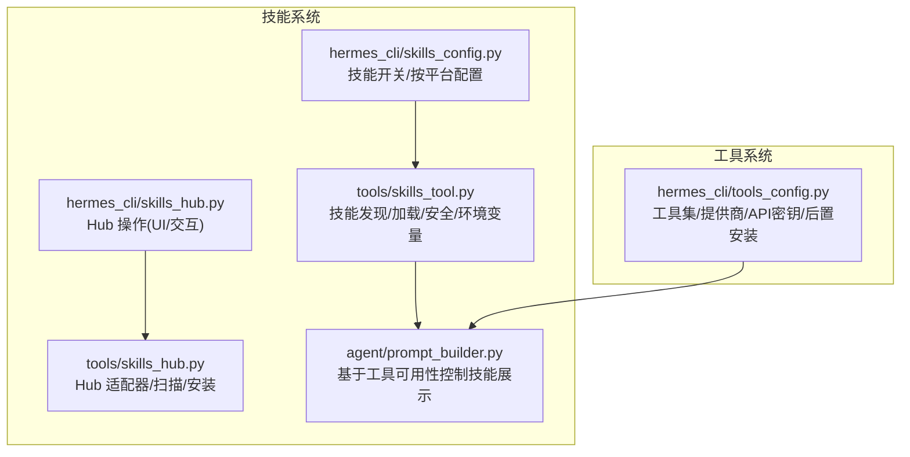
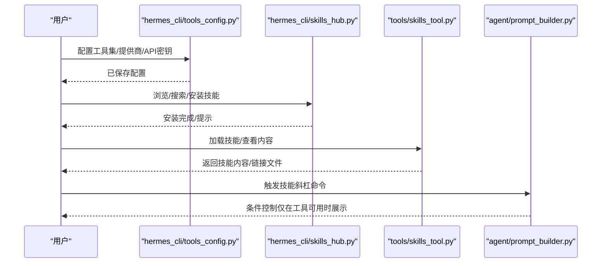
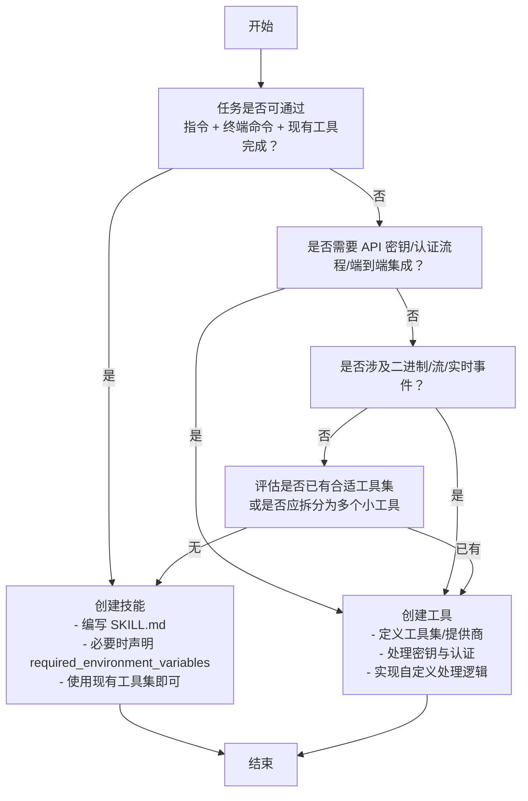
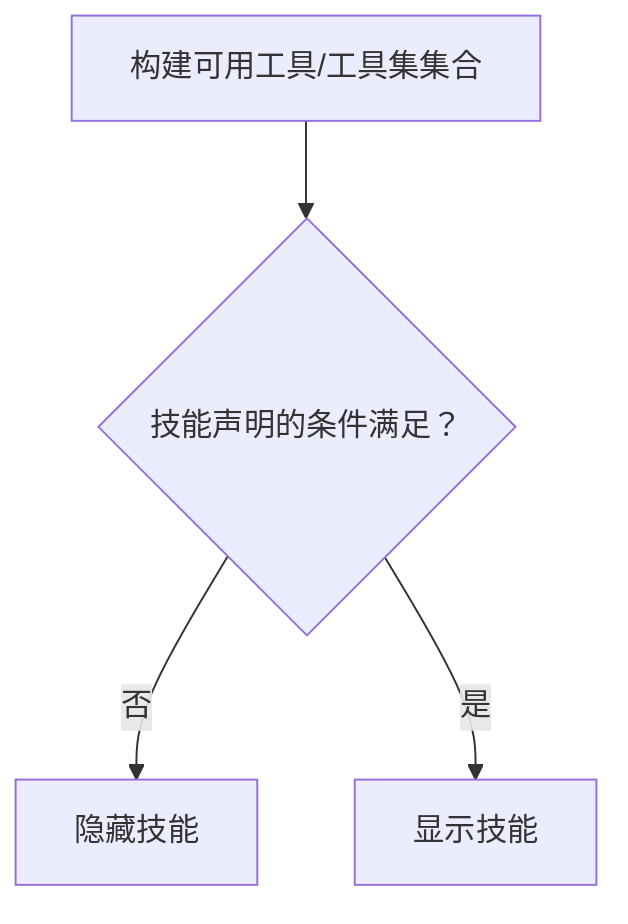
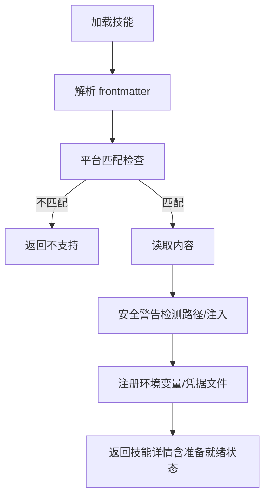
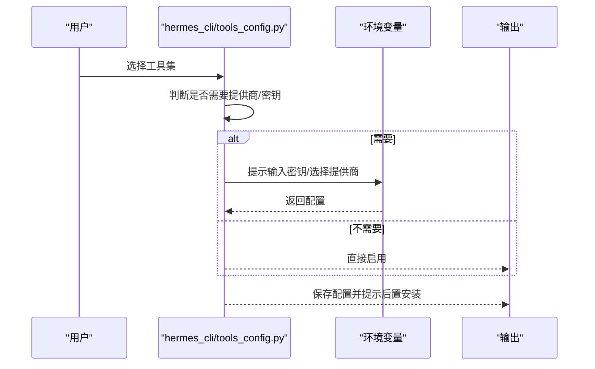
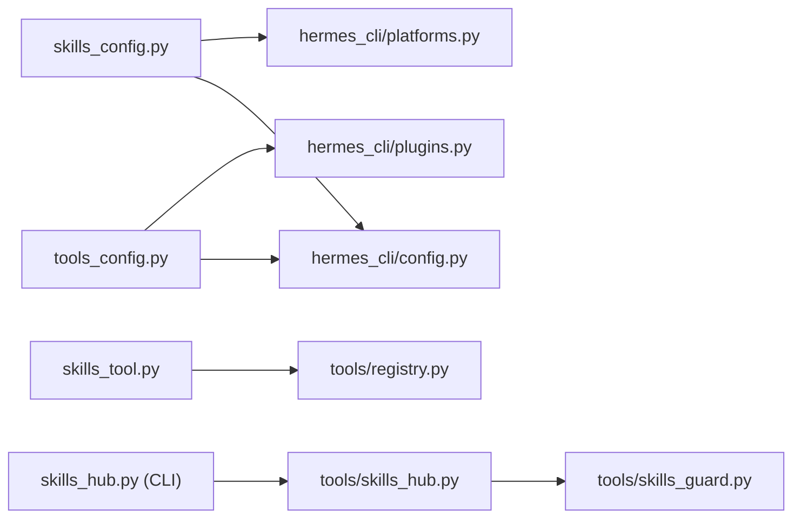

# 技能与工具的选择

<cite>
**本文引用的文件**
- [skills_config.py](file://hermes_cli/skills_config.py)
- [tools_config.py](file://hermes_cli/tools_config.py)
- [skills_tool.py](file://tools/skills_tool.py)
- [skills_hub.py](file://hermes_cli/skills_hub.py)
- [skills_hub.py](file://tools/skills_hub.py)
- [prompt_builder.py](file://agent/prompt_builder.py)
- [README.md](file://README.md)
- [DESCRIPTION.md](file://optional-skills/DESCRIPTION.md)
- [DESCRIPTION.md](file://skills/domain/DESCRIPTION.md)
- [creating-skills.md](file://website/docs/developer-guide/creating-skills.md)
- [work-with-skills.md](file://website/docs/guides/work-with-skills.md)
- [cli.md](file://website/docs/user-guide/cli.md)
- [slash-commands.md](file://website/docs/reference/slash-commands.md)
- [claude_marketplace_anthropics_skills.json](file://skills/index-cache/claude_marketplace_anthropics_skills.json)
</cite>

## 目录
1. [引言](#引言)
2. [项目结构](#项目结构)
3. [核心组件](#核心组件)
4. [架构总览](#架构总览)
5. [详细组件分析](#详细组件分析)
6. [依赖分析](#依赖分析)
7. [性能考虑](#性能考虑)
8. [故障排查指南](#故障排查指南)
9. [结论](#结论)
10. [附录](#附录)

## 引言
本指南面向在 Hermes Agent 中选择“技能”还是“工具”的实践者，帮助你在以下两类知识与能力之间做出正确取舍：
- 技能：以“指令 + 终端命令 + 现有工具”的组合方式，无需自定义 Python 集成或 API 密钥管理。
- 工具：需要与 API 密钥、认证流程或由代理处理的多组件配置进行端到端集成；需要必须精确执行的自定义处理逻辑；需要处理无法通过终端传递的二进制数据、流或实时事件。

同时，本指南解释“捆绑技能”“可选技能”“社区技能 Hub”的区别与适用场景，并提供可操作的决策树与判断标准。

## 项目结构
围绕“技能与工具”的关键模块与文件如下：
- 技能侧
  - hermes_cli/skills_config.py：技能开关与按平台配置
  - tools/skills_tool.py：技能发现、加载、安全校验与环境变量注册
  - hermes_cli/skills_hub.py：技能 Hub 的浏览、搜索、安装、卸载等
  - tools/skills_hub.py：技能 Hub 的具体适配器与扫描、安装流程
  - agent/prompt_builder.py：根据可用工具/工具集条件控制技能展示
  - optional-skills/DESCRIPTION.md：可选技能说明
  - skills/domain/DESCRIPTION.md：示例技能说明
  - website/docs/developer-guide/creating-skills.md：技能开发参考
  - website/docs/guides/work-with-skills.md：技能使用参考
  - website/docs/user-guide/cli.md：技能作为斜杠命令使用
  - website/docs/reference/slash-commands.md：斜杠命令与技能映射
  - skills/index-cache/claude_marketplace_anthropics_skills.json：技能索引缓存
- 工具侧
  - hermes_cli/tools_config.py：工具集与工具的统一配置入口，含工具类别、提供商、API 密钥提示、后置安装步骤等

图表来源
- [skills_config.py:125-178](file://hermes_cli/skills_config.py#L125-L178)
- [skills_tool.py:512-586](file://tools/skills_tool.py#L512-L586)
- [skills_hub.py:144-182](file://hermes_cli/skills_hub.py#L144-L182)
- [skills_hub.py:1435-1509](file://tools/skills_hub.py#L1435-L1509)
- [prompt_builder.py:532-561](file://agent/prompt_builder.py#L532-L561)
- [tools_config.py:49-68](file://hermes_cli/tools_config.py#L49-L68)

章节来源
- [skills_config.py:1-178](file://hermes_cli/skills_config.py#L1-L178)
- [tools_config.py:1-1699](file://hermes_cli/tools_config.py#L1-L1699)

## 核心组件
- 技能配置与发现
  - hermes_cli/skills_config.py 提供“按平台/全局”切换技能的能力，支持按分类批量启用/禁用。
  - tools/skills_tool.py 提供 skills_list/skill_view，支持目录式技能文档的渐进披露（metadata → full content → linked files）。
- 技能 Hub
  - hermes_cli/skills_hub.py 提供 Hub 的浏览、搜索、安装、卸载、更新、审计等 CLI 能力。
  - tools/skills_hub.py 提供具体源适配器（如 GitHub、ClawHub 等）、扫描与安装流程。
- 工具配置
  - hermes_cli/tools_config.py 定义工具集（web、browser、terminal、file、code_execution、vision、image_gen、moa、tts、skills、todo、memory、session_search、clarify、delegation、cronjob、rl、homeassistant 等），并针对每个工具集提供提供商列表与 API 密钥配置流程。
- 展示与条件控制
  - agent/prompt_builder.py 基于可用工具/工具集条件决定技能是否展示，避免在工具不可用时污染上下文。

章节来源
- [skills_config.py:125-178](file://hermes_cli/skills_config.py#L125-L178)
- [skills_tool.py:512-586](file://tools/skills_tool.py#L512-L586)
- [skills_hub.py:144-182](file://hermes_cli/skills_hub.py#L144-L182)
- [skills_hub.py:1435-1509](file://tools/skills_hub.py#L1435-L1509)
- [tools_config.py:49-68](file://hermes_cli/tools_config.py#L49-L68)
- [prompt_builder.py:532-561](file://agent/prompt_builder.py#L532-L561)

## 架构总览
下图展示了“技能”与“工具”的选择与运行路径：用户通过 CLI 或聊天界面触发技能或工具，系统根据当前可用工具/工具集与配置决定是否加载技能内容或调用工具。

图表来源
- [tools_config.py:49-68](file://hermes_cli/tools_config.py#L49-L68)
- [skills_hub.py:310-466](file://hermes_cli/skills_hub.py#L310-L466)
- [skills_tool.py:779-1237](file://tools/skills_tool.py#L779-L1237)
- [prompt_builder.py:563-566](file://agent/prompt_builder.py#L563-L566)

## 详细组件分析

### 决策树：何时创建技能 vs 工具
- 创建“技能”的典型场景
  - 任务可通过“指令 + 终端命令 + 现有工具”完成，无需自定义 Python 集成或 API 密钥管理
  - 示例：被动域名情报（仅系统库与公开数据源，零 API 密钥）
- 创建“工具”的典型场景
  - 需要与 API 密钥、认证流程或由代理处理的多组件配置进行端到端集成
  - 需要必须精确执行的自定义处理逻辑
  - 需要处理无法通过终端传递的二进制数据、流或实时事件
  - 示例：浏览器自动化、语音合成、图像生成、RL 训练平台等

图表来源
- [tools_config.py:117-332](file://hermes_cli/tools_config.py#L117-L332)
- [skills_tool.py:134-206](file://tools/skills_tool.py#L134-L206)
- [creating-skills.md:130-171](file://website/docs/developer-guide/creating-skills.md#L130-L171)

章节来源
- [tools_config.py:117-332](file://hermes_cli/tools_config.py#L117-L332)
- [skills_tool.py:134-206](file://tools/skills_tool.py#L134-L206)
- [creating-skills.md:130-171](file://website/docs/developer-guide/creating-skills.md#L130-L171)

### 技能与工具的差异对比
- 技能
  - 以“知识文档 + 渐进披露”组织，便于在不同平台与会话中复用
  - 可声明所需环境变量，系统在加载时自动注册到沙箱执行环境
  - 支持 Hub 分发与安全扫描
- 工具
  - 以“工具集 + 提供商 + API 密钥”为核心，强调端到端集成
  - 针对复杂场景提供后置安装步骤与订阅/认证状态感知
  - 对令牌估算与上下文开销进行统计，辅助权衡

章节来源
- [skills_tool.py:1184-1237](file://tools/skills_tool.py#L1184-L1237)
- [tools_config.py:659-700](file://hermes_cli/tools_config.py#L659-L700)

### 技能 Hub 的三类来源与适用场景
- 捆绑技能（builtin）
  - 随安装包自带，无需额外安装，直接可用
- 可选技能（official optional）
  - 不默认激活，但官方维护，适合“小而重”或“小众”的功能
  - 通过 Hub 浏览/搜索/安装，保持默认集合精简
- 社区技能（community）
  - 第三方贡献，安装前进行安全扫描与风险提示
  - 适合探索性功能或特定生态

章节来源
- [skills_hub.py:518-574](file://hermes_cli/skills_hub.py#L518-L574)
- [DESCRIPTION.md:1-25](file://optional-skills/DESCRIPTION.md#L1-L25)

### 技能的条件展示与工具可用性
- 当工具集/工具不可用时，技能可被隐藏，避免污染上下文
- 当工具可用时，技能可被显示并参与对话

图表来源
- [prompt_builder.py:532-561](file://agent/prompt_builder.py#L532-L561)

章节来源
- [prompt_builder.py:532-561](file://agent/prompt_builder.py#L532-L561)

### 技能加载与安全校验
- 技能加载时进行路径安全检查与注入模式检测
- 支持声明 required_environment_variables，系统在加载时注册到沙箱执行环境
- 支持声明 required_credential_files，缺失时纳入“准备就绪”状态

图表来源
- [skills_tool.py:900-938](file://tools/skills_tool.py#L900-L938)
- [skills_tool.py:1111-1237](file://tools/skills_tool.py#L1111-L1237)

章节来源
- [skills_tool.py:900-938](file://tools/skills_tool.py#L900-L938)
- [skills_tool.py:1111-1237](file://tools/skills_tool.py#L1111-L1237)

### 工具配置与提供商选择
- 工具集按类别分组，每个类别提供多个提供商选项
- 对于需要 API 密钥的工具集，系统提供统一的配置流程与后置安装步骤
- 支持“重新配置现有工具的提供商或密钥”

图表来源
- [tools_config.py:117-332](file://hermes_cli/tools_config.py#L117-L332)
- [tools_config.py:1053-1084](file://hermes_cli/tools_config.py#L1053-L1084)

章节来源
- [tools_config.py:117-332](file://hermes_cli/tools_config.py#L117-L332)
- [tools_config.py:1053-1084](file://hermes_cli/tools_config.py#L1053-L1084)

## 依赖分析
- 技能系统
  - hermes_cli/skills_config.py 依赖 hermes_cli/config 与 hermes_cli/platforms，用于读取/保存配置与平台映射
  - tools/skills_tool.py 依赖 agent/skill_utils 与 tools/registry，用于平台匹配、前端解析与工具注册
  - hermes_cli/skills_hub.py 依赖 tools/skills_hub 与 tools/skills_guard，用于 Hub 源路由、扫描与安装
- 工具系统
  - hermes_cli/tools_config.py 依赖 hermes_cli/config 与 hermes_cli/plugins，用于读取/保存配置与插件工具集发现

图表来源
- [skills_config.py:16-23](file://hermes_cli/skills_config.py#L16-L23)
- [skills_tool.py:79-81](file://tools/skills_tool.py#L79-L81)
- [skills_hub.py:22-26](file://hermes_cli/skills_hub.py#L22-L26)
- [tools_config.py:19-29](file://hermes_cli/tools_config.py#L19-L29)

章节来源
- [skills_config.py:16-23](file://hermes_cli/skills_config.py#L16-L23)
- [skills_tool.py:79-81](file://tools/skills_tool.py#L79-L81)
- [skills_hub.py:22-26](file://hermes_cli/skills_hub.py#L22-L26)
- [tools_config.py:19-29](file://hermes_cli/tools_config.py#L19-L29)

## 性能考虑
- 技能
  - 渐进披露：先返回最小元数据，按需加载完整内容，降低上下文开销
  - 基于工具可用性的条件展示，避免无关技能进入上下文
- 工具
  - 对工具 schema 进行令牌估算，帮助控制上下文大小
  - 工具集/提供商选择影响实际调用成本与稳定性

章节来源
- [skills_tool.py:711-777](file://tools/skills_tool.py#L711-L777)
- [prompt_builder.py:563-566](file://agent/prompt_builder.py#L563-L566)
- [tools_config.py:659-700](file://hermes_cli/tools_config.py#L659-L700)

## 故障排查指南
- 技能未显示
  - 检查技能是否被禁用（hermes skills）
  - 检查技能是否声明了 requires_toolsets/工具集不可用
- 技能加载失败
  - 检查是否为外部目录或包含注入模式
  - 检查 required_environment_variables 是否缺失
- 工具未生效
  - 检查工具集是否已启用（hermes tools）
  - 检查提供商与 API 密钥是否配置正确
  - 如存在后置安装步骤，确认已执行

章节来源
- [skills_config.py:27-47](file://hermes_cli/skills_config.py#L27-L47)
- [skills_tool.py:900-938](file://tools/skills_tool.py#L900-L938)
- [tools_config.py:1053-1084](file://hermes_cli/tools_config.py#L1053-L1084)

## 结论
- 若任务可通过“指令 + 终端命令 + 现有工具”完成，优先创建“技能”，以获得更好的复用性与安全性
- 若任务涉及 API 密钥、认证流程、端到端集成、复杂自定义逻辑或二进制/流/实时事件，优先创建“工具”
- 通过 Hub 管理“可选技能”，在默认集合之外扩展能力
- 借助条件展示与令牌估算，优化上下文与性能

## 附录
- 技能 Hub 源与信任等级
  - builtin：内置
  - trusted：受信任
  - community：社区
- 斜杠命令与技能映射
  - 每个已安装技能自动成为斜杠命令，例如 /gif-search、/github-pr-workflow、/excalidraw
- 示例技能
  - passive domain intel：零 API 密钥，零依赖，仅系统库与公开数据源

章节来源
- [skills_hub.py:224-237](file://hermes_cli/skills_hub.py#L224-L237)
- [slash-commands.md:85-107](file://website/docs/reference/slash-commands.md#L85-L107)
- [cli.md:155-166](file://website/docs/user-guide/cli.md#L155-L166)
- [DESCRIPTION.md:1-25](file://skills/domain/DESCRIPTION.md#L1-L25)