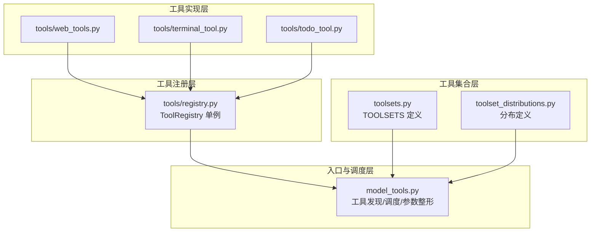
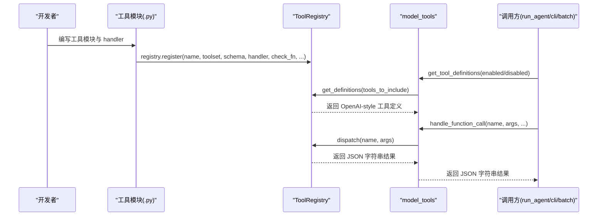
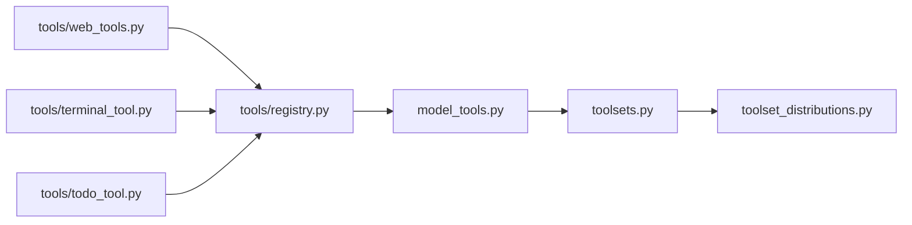

# 新增工具开发

<cite>
**本文引用的文件**
- [model_tools.py](file://model_tools.py)
- [tools/registry.py](file://tools/registry.py)
- [toolsets.py](file://toolsets.py)
- [toolset_distributions.py](file://toolset_distributions.py)
- [tools/web_tools.py](file://tools/web_tools.py)
- [tools/terminal_tool.py](file://tools/terminal_tool.py)
- [tools/todo_tool.py](file://tools/todo_tool.py)
- [tests/test_model_tools.py](file://tests/test_model_tools.py)
- [tests/tools/test_registry.py](file://tests/tools/test_registry.py)
- [tests/tools/test_model_tools.py](file://tests/tools/test_model_tools.py)
- [tests/test_toolset_distributions.py](file://tests/test_toolset_distributions.py)
- [tools/mcp_tool.py](file://tools/mcp_tool.py)
</cite>

## 目录
1. [简介](#简介)
2. [项目结构](#项目结构)
3. [核心组件](#核心组件)
4. [架构总览](#架构总览)
5. [详细组件分析](#详细组件分析)
6. [依赖分析](#依赖分析)
7. [性能考量](#性能考量)
8. [故障排查指南](#故障排查指南)
9. [结论](#结论)
10. [附录：完整开发模板与最佳实践](#附录完整开发模板与最佳实践)

## 简介
本指南面向希望在 Hermes Agent 中新增“工具”的开发者，系统讲解工具自注册机制、schema 定义规范、handler 实现要求、registry.register 调用参数、工具模块导入流程、工具集分组与平台预设配置、以及测试与调试方法。目标是帮助你在最短时间内正确、安全地完成一个可被模型调用的新工具。

## 项目结构
Hermes 的工具体系由三层组成：
- 工具注册中心：集中管理所有工具的 schema、处理器、可用性检查与元数据。
- 工具集合（toolsets）：对工具进行分组，支持组合与平台预设。
- 工具发现与调度：通过 model_tools 模块触发工具模块导入，并对外提供统一的工具定义与执行接口。

图表来源
- [model_tools.py:132-184](file://model_tools.py#L132-L184)
- [tools/registry.py:24-110](file://tools/registry.py#L24-L110)
- [toolsets.py:68-391](file://toolsets.py#L68-L391)
- [toolset_distributions.py:29-200](file://toolset_distributions.py#L29-L200)

章节来源
- [model_tools.py:132-184](file://model_tools.py#L132-L184)
- [toolsets.py:68-391](file://toolsets.py#L68-L391)

## 核心组件
- 工具注册中心（ToolRegistry）
  - 提供 register/deregister/get_definitions/dispatch 等能力，统一管理工具元数据与可用性检查。
  - 通过工具模块在导入时调用 registry.register 完成自注册。
- 工具集合（toolsets）
  - 定义工具集（toolset）及其包含的工具或其它工具集，支持平台预设与组合。
- 工具发现与调度（model_tools）
  - 在启动时导入工具模块以触发自注册；对外提供 get_tool_definitions 与 handle_function_call。
  - 内置参数类型整形、异步桥接、插件钩子等。

章节来源
- [tools/registry.py:48-290](file://tools/registry.py#L48-L290)
- [toolsets.py:68-391](file://toolsets.py#L68-L391)
- [model_tools.py:132-184](file://model_tools.py#L132-L184)

## 架构总览
工具从“自注册”到“被模型调用”的端到端流程如下：

图表来源
- [tools/registry.py:59-94](file://tools/registry.py#L59-L94)
- [tools/registry.py:116-143](file://tools/registry.py#L116-L143)
- [tools/registry.py:149-167](file://tools/registry.py#L149-L167)
- [model_tools.py:234-353](file://model_tools.py#L234-L353)
- [model_tools.py:459-549](file://model_tools.py#L459-L549)

## 详细组件分析

### 工具自注册机制与 schema 规范
- 注册入口
  - 工具模块在导入时调用 registry.register(...) 完成自注册。
  - registry.register 参数：
    - name: 工具唯一名称（字符串）
    - toolset: 所属工具集（字符串）
    - schema: OpenAI function schema（字典），必须包含 name、description、parameters.properties 等
    - handler: 处理函数（可同步或异步）
    - check_fn: 可选，用于判断工具集是否可用（返回布尔）
    - requires_env: 可选，环境变量名列表
    - is_async: 是否异步
    - description/emoji/max_result_size_chars: 元数据字段
- schema 格式要点
  - 必须为 OpenAI function schema 结构，包含 type="function" 与 function 子对象。
  - function.name 应与 name 一致，便于模型识别。
  - parameters.properties 定义参数类型与描述，支持 "type": ["integer","string"] 等联合类型。
  - description 应明确用途、输入输出与边界条件，避免模糊描述。
- handler 返回值
  - 必须返回 JSON 字符串（UTF-8），使用 registry.tool_result 或 registry.tool_error 辅助函数。
  - 错误统一包装为 {"error": "..."}，避免抛出异常导致调用方解析失败。
- 可用性检查
  - 若 check_fn 抛出异常或返回 False，则该工具不会出现在最终工具定义中。
  - 工具集级 check_fn 仅需一个工具存在即可生效，且会缓存结果以减少重复调用。

章节来源
- [tools/registry.py:59-94](file://tools/registry.py#L59-L94)
- [tools/registry.py:116-143](file://tools/registry.py#L116-L143)
- [tools/registry.py:293-335](file://tools/registry.py#L293-L335)
- [tools/todo_tool.py:209-237](file://tools/todo_tool.py#L209-L237)

### handler 函数实现要求
- 同步 vs 异步
  - 若 is_async=True，handler 接收 args 并返回协程；registry.dispatch 会自动桥接到持久事件循环。
  - 若 is_async=False，handler 直接返回字符串。
- 错误处理
  - 使用 registry.tool_error/tool_result 统一返回 JSON 字符串。
  - 不要抛出未捕获异常；若内部异常，应转换为错误 JSON。
- JSON 序列化
  - 返回值必须是合法 JSON 字符串；确保非 ASCII 字符使用 ensure_ascii=False。
- 参数校验
  - 建议在 handler 内部对参数进行显式校验，必要时返回错误 JSON。

章节来源
- [tools/registry.py:149-167](file://tools/registry.py#L149-L167)
- [tools/registry.py:309-335](file://tools/registry.py#L309-L335)

### registry.register 调用参数详解
- name: 工具名（全局唯一）
- toolset: 工具集名（与 toolsets.py 中定义对应）
- schema: OpenAI function schema（含 name、description、parameters）
- handler: 处理函数（Callable）
- check_fn: 可选，工具可用性检查函数
- requires_env: 可选，环境变量列表
- is_async: 是否异步
- description/emoji/max_result_size_chars: 元数据

章节来源
- [tools/registry.py:59-94](file://tools/registry.py#L59-L94)

### 工具模块导入流程（model_tools._discover_tools）
- model_tools 在启动时导入 tools/* 模块，触发各工具模块的自注册。
- 当前已注册的工具模块列表位于 model_tools._modules 中，新增工具需在此处添加模块路径。
- 导入失败会被记录为警告，不影响其他工具加载。

章节来源
- [model_tools.py:138-170](file://model_tools.py#L138-L170)

### 工具集分组与平台预设配置
- 工具集定义
  - toolsets.py 定义了大量工具集（如 web、terminal、browser、file、vision、image_gen、moa、skills、tts、todo、memory、session_search、clarify、code_execution、delegation、cronjob、messaging、rl、homeassistant 等）。
  - 支持组合：某些工具集通过 includes 引用其他工具集，形成复合工具集。
- 平台预设
  - 针对不同消息平台（Telegram、Discord、Slack、Signal、WeChat 等）提供预设工具集（如 hermes-telegram、hermes-discord 等），这些预设通常包含核心工具集并按平台特性调整。
- 分布式采样（数据生成）
  - toolset_distributions.py 定义了多种分布（如 default、research、science、development、safe、balanced、minimal、terminal_only、terminal_web、creative、reasoning、browser_use、browser_only、browser_tasks、terminal_tasks 等），用于批量任务采样。

章节来源
- [toolsets.py:68-391](file://toolsets.py#L68-L391)
- [toolset_distributions.py:29-200](file://toolset_distributions.py#L29-L200)

### 工具测试与调试方法
- 单元测试
  - 测试 registry 行为：注册、查询、可用性检查、dispatch 错误处理等。
  - 测试 model_tools 行为：handle_function_call、agent-loop 工具拦截、参数整形、插件钩子等。
  - 测试 toolset 分布：分布有效性、采样行为等。
- 调试建议
  - 使用 registry.get_definitions 获取当前可用工具定义，确认 schema 正确。
  - 使用 registry.dispatch 直接调用工具 handler，验证返回 JSON。
  - 在 handler 内部加入日志，观察参数与返回值。
  - 对于异步工具，确保 is_async=True 并使用持久事件循环桥接。

章节来源
- [tests/tools/test_registry.py:50-289](file://tests/tools/test_registry.py#L50-L289)
- [tests/test_model_tools.py:1-140](file://tests/test_model_tools.py#L1-140)
- [tests/tools/test_model_tools.py:22-76](file://tests/tools/test_model_tools.py#L22-L76)
- [tests/test_toolset_distributions.py:1-78](file://tests/test_toolset_distributions.py#L1-L78)

## 依赖分析
- 模块耦合
  - 工具模块仅依赖 tools/registry 进行自注册，不直接依赖 model_tools。
  - model_tools 依赖 tools/registry 与 toolsets，负责工具发现与调度。
  - toolsets 与 toolset_distributions 互相独立，分别负责静态定义与采样。
- 循环依赖规避
  - registry 无反向依赖工具模块；工具模块导入 registry，再由 model_tools 导入工具模块，形成单向依赖链。

图表来源
- [tools/registry.py:1-22](file://tools/registry.py#L1-L22)
- [model_tools.py:29-31](file://model_tools.py#L29-L31)
- [toolsets.py:26-27](file://toolsets.py#L26-L27)
- [toolset_distributions.py:24-24](file://toolset_distributions.py#L24-L24)

## 性能考量
- 事件循环复用
  - model_tools 提供持久事件循环桥接，避免频繁创建/销毁导致的“事件循环已关闭”问题，提升异步工具稳定性。
- 参数整形
  - 自动将字符串类型的数字/布尔转换为期望类型，减少模型输出错误导致的重试。
- 工具集检查缓存
  - registry 对 check_fn 的结果进行缓存，避免重复调用。

章节来源
- [model_tools.py:44-126](file://model_tools.py#L44-L126)
- [model_tools.py:372-457](file://model_tools.py#L372-L457)
- [tools/registry.py:122-139](file://tools/registry.py#L122-L139)

## 故障排查指南
- 工具未出现在工具定义中
  - 检查 check_fn 是否返回 False 或抛出异常；确认 requires_env 是否满足。
  - 确认工具模块已在 model_tools._modules 中导入。
- handle_function_call 返回错误 JSON
  - 确保 handler 返回 JSON 字符串；不要抛出异常。
  - 使用 registry.tool_error/tool_result 统一返回。
- 异步工具报错
  - 确保 is_async=True；registry.dispatch 会自动桥接至持久事件循环。
- 插件钩子未触发
  - 确认插件系统已启用；model_tools 会在调用前后注入 pre_tool_call/post_tool_call 钩子。

章节来源
- [tools/registry.py:149-167](file://tools/registry.py#L149-L167)
- [model_tools.py:500-542](file://model_tools.py#L500-L542)

## 结论
通过遵循本指南，你可以快速、安全地在 Hermes Agent 中新增一个工具：编写符合 OpenAI function schema 的工具模块，实现 handler 并返回 JSON 字符串，使用 registry.register 完成自注册，将模块加入 model_tools._modules，最后在 toolsets 中将其归类到合适的工具集，并通过测试验证其可用性与稳定性。

## 附录：完整开发模板与最佳实践

### 开发步骤清单
- 在 tools/ 下创建你的工具模块（例如 tools/my_tool.py）。
- 在模块内定义：
  - schema：OpenAI function schema（含 name、description、parameters）
  - handler：接收 args 并返回 JSON 字符串
  - check_fn：可选，返回布尔值表示可用性
  - 可选：requires_env、is_async、description、emoji、max_result_size_chars
- 在 tools/my_tool.py 中调用 registry.register(...) 完成自注册。
- 在 model_tools._modules 列表中添加你的模块路径。
- 在 toolsets.py 中将工具加入合适的工具集（或创建新的工具集）。
- 编写单元测试，覆盖：
  - schema 正确性
  - handler 返回 JSON
  - check_fn 行为
  - handle_function_call 行为
- 如需平台预设，参考 hermes-* 工具集命名约定扩展。

### 依赖检查函数与错误处理模式
- 依赖检查
  - 使用 check_fn 返回布尔值；registry 会根据 check_fn 的结果决定工具是否可用。
  - requires_env 用于声明环境变量，registry 会汇总工具集所需环境变量。
- 错误处理
  - handler 内部捕获异常并返回错误 JSON。
  - 使用 registry.tool_error/tool_result 统一格式。
- JSON 序列化
  - 使用 ensure_ascii=False 支持非 ASCII 字符。
  - 返回字符串，避免返回 dict 导致调用方解析失败。

章节来源
- [tools/registry.py:59-94](file://tools/registry.py#L59-L94)
- [tools/registry.py:293-335](file://tools/registry.py#L293-L335)

### 跨平台兼容性考虑
- 平台预设工具集
  - hermes-telegram、hermes-discord、hermes-slack、hermes-signal、hermes-weixin、hermes-wecom 等，均基于核心工具集并按平台特性调整。
- MCP 工具动态发现
  - 通过 tools/mcp_tool.py 的 discover_mcp_tools 动态注册外部 MCP 服务器提供的工具，支持 include/exclude 过滤与命名冲突保护。

章节来源
- [toolsets.py:226-390](file://toolsets.py#L226-L390)
- [tools/mcp_tool.py:1746-1775](file://tools/mcp_tool.py#L1746-L1775)

### 工具开发模板（步骤化）
- 创建模块：tools/my_tool.py
- 定义 schema：包含 name、description、parameters.properties
- 实现 handler：接收 args，返回 JSON 字符串
- 注册：registry.register(name, toolset, schema, handler, check_fn, is_async, description, emoji, max_result_size_chars)
- 导入：在 model_tools._modules 中添加模块路径
- 归类：在 toolsets.py 中加入工具集
- 测试：编写单元测试，验证 get_definitions、dispatch、错误处理
- 调试：使用 registry.get_definitions 与 registry.dispatch 验证

章节来源
- [tools/registry.py:59-94](file://tools/registry.py#L59-L94)
- [model_tools.py:138-170](file://model_tools.py#L138-L170)
- [toolsets.py:68-391](file://toolsets.py#L68-L391)