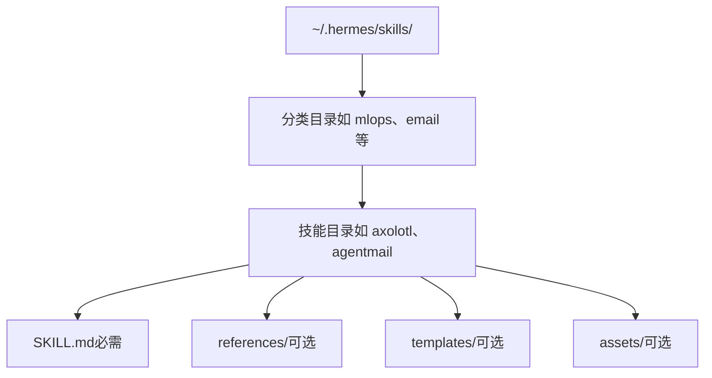
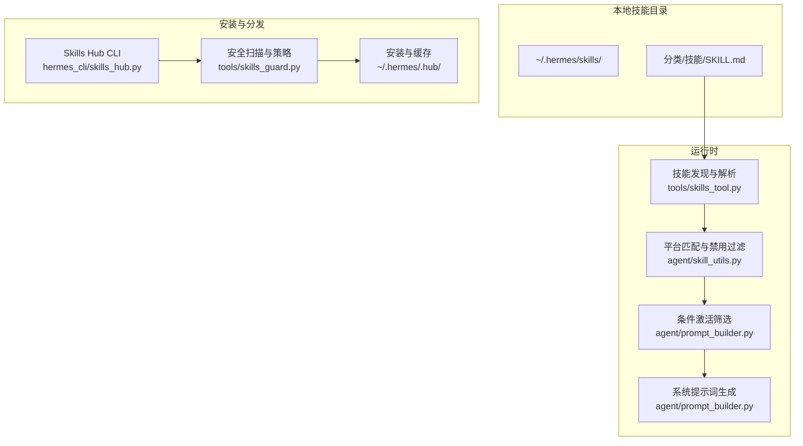
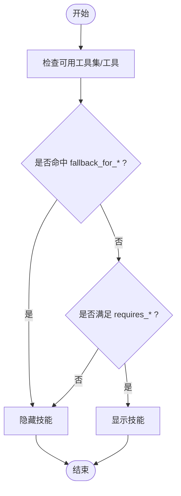
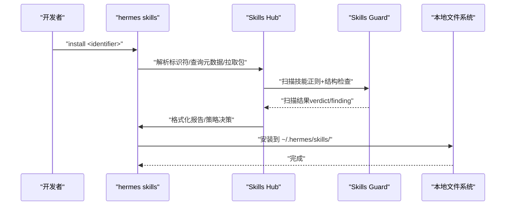
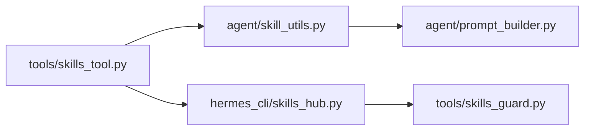

# 新增技能开发

<cite>
**本文引用的文件**
- [skills_tool.py](file://tools/skills_tool.py)
- [skills_guard.py](file://tools/skills_guard.py)
- [skills_config.py](file://hermes_cli/skills_config.py)
- [skills_hub.py](file://hermes_cli/skills_hub.py)
- [skill_utils.py](file://agent/skill_utils.py)
- [prompt_builder.py](file://agent/prompt_builder.py)
- [agentmail SKILL.md](file://optional-skills/email/agentmail/SKILL.md)
- [webhook-subscriptions SKILL.md](file://skills/devops/webhook-subscriptions/SKILL.md)
- [godmode SKILL.md](file://skills/red-teaming/godmode/SKILL.md)
- [dogfood SKILL.md](file://skills/dogfood/SKILL.md)
- [tools_config.py](file://hermes_cli/tools_config.py)
- [CONTRIBUTING.md](file://CONTRIBUTING.md)
</cite>

## 目录
1. [简介](#简介)
2. [项目结构](#项目结构)
3. [核心组件](#核心组件)
4. [架构总览](#架构总览)
5. [详细组件分析](#详细组件分析)
6. [依赖关系分析](#依赖关系分析)
7. [性能考量](#性能考量)
8. [故障排查指南](#故障排查指南)
9. [结论](#结论)
10. [附录](#附录)

## 简介
本指南面向希望为 Hermes Agent 创建新技能的开发者，覆盖从目录结构、元数据规范、激活条件、平台适配、安全扫描，到测试与发布的完整流程。内容基于仓库中已实现的技能发现、条件筛选、安全扫描与分发机制，帮助你以渐进式披露的方式构建高质量、可维护、可复用的技能。

## 项目结构
技能在本地以目录形式组织，统一入口位于用户配置目录下的 skills 子目录。技能目录内必须包含 SKILL.md；可选地包含 references、templates、assets 等子目录用于文档、模板与资源。

- 技能根目录：~/.hermes/skills/
- 目录结构示意
  - skills/
    - 分类目录/
      - 技能名/
        - SKILL.md（必需）
        - references/（可选）
        - templates/（可选）
        - assets/（可选）

图示来源
- [skills_tool.py:14-27](file://tools/skills_tool.py#L14-L27)

章节来源
- [skills_tool.py:14-27](file://tools/skills_tool.py#L14-L27)

## 核心组件
- 技能发现与列表
  - 工具模块负责扫描 SKILL.md、解析 YAML 前言元数据、提取名称、描述、分类，并按平台过滤与禁用列表过滤。
- 条件激活与平台匹配
  - 通过 frontmatter 的 hermes 标签系统（如 fallback_for_toolsets、requires_toolsets 等）控制技能在不同工具集/工具可用性下的显示与启用。
- 安全扫描与安装策略
  - Skills Hub 在安装外部技能前执行静态扫描与信任策略评估，决定是否允许安装或需要强制确认。
- 配置与开关
  - hermes skills 命令支持按平台或全局禁用技能集合，支持按类别或单项切换。

章节来源
- [skills_tool.py:512-586](file://tools/skills_tool.py#L512-L586)
- [skill_utils.py:241-255](file://agent/skill_utils.py#L241-L255)
- [skills_guard.py:595-640](file://tools/skills_guard.py#L595-L640)
- [skills_config.py:27-47](file://hermes_cli/skills_config.py#L27-L47)

## 架构总览
下图展示了从“技能目录”到“模型提示词构建”的端到端流程，以及安装与安全扫描的关键节点。

图示来源
- [skills_tool.py:512-586](file://tools/skills_tool.py#L512-L586)
- [skill_utils.py:92-116](file://agent/skill_utils.py#L92-L116)
- [prompt_builder.py:532-561](file://agent/prompt_builder.py#L532-L561)
- [skills_hub.py:310-466](file://hermes_cli/skills_hub.py#L310-L466)
- [skills_guard.py:595-640](file://tools/skills_guard.py#L595-L640)

## 详细组件分析

### 技能目录与文件组织
- 必需文件
  - SKILL.md：技能主文档，包含 YAML 前言元数据与正文说明。
- 可选目录
  - references：参考文档、API 文档、示例等。
  - templates：输出模板、报告模板等。
  - assets：图标、截图等补充资源。
- 外部技能目录
  - 支持在配置中声明 skills.external_dirs，扫描顺序为：本地目录优先，再遍历外部目录。

章节来源
- [skills_tool.py:14-27](file://tools/skills_tool.py#L14-L27)
- [skills_tool.py:647-706](file://tools/skills_tool.py#L647-L706)
- [skill_utils.py:174-224](file://agent/skill_utils.py#L174-L224)

### SKILL.md 元数据规范
- YAML 前言字段
  - name：技能名称（必填，长度有限制）
  - description：简要描述（必填，长度有限制）
  - version、license：版本与许可证
  - platforms：平台限制（macos/linux/windows）
  - prerequisites：遗留前置条件（环境变量、命令）
  - metadata.hermes：Hermes 特定元数据
    - tags：标签数组
    - related_skills：关联技能名数组
    - fallback_for_toolsets / requires_toolsets
    - fallback_for_tools / requires_tools
    - config：技能所需配置项声明
- 示例参考
  - email/agentmail：展示 hermes.tags、category、version、license 等
  - devops/webhook-subscriptions：展示 platforms、prerequisites、metadata.hermes.tags
  - red-teaming/godmode：展示 author、license、metadata.hermes.tags、related_skills
  - dogfood：展示 metadata.hermes.tags、related_skills

章节来源
- [skills_tool.py:28-47](file://tools/skills_tool.py#L28-L47)
- [agent/skill_utils.py:241-255](file://agent/skill_utils.py#L241-L255)
- [agent/skill_utils.py:261-317](file://agent/skill_utils.py#L261-L317)
- [agent/skill_utils.py:418-426](file://agent/skill_utils.py#L418-L426)
- [agent/skill_utils.py:92-116](file://agent/skill_utils.py#L92-L116)
- [agent/skill_utils.py:121-169](file://agent/skill_utils.py#L121-L169)
- [agent/skill_utils.py:174-224](file://agent/skill_utils.py#L174-L224)
- [agent/skill_utils.py:320-356](file://agent/skill_utils.py#L320-L356)
- [agent/skill_utils.py:377-412](file://agent/skill_utils.py#L377-L412)
- [agent/skill_utils.py:432-444](file://agent/skill_utils.py#L432-L444)
- [agent/skill_utils.py:52-86](file://agent/skill_utils.py#L52-L86)
- [agent/skill_utils.py:34-46](file://agent/skill_utils.py#L34-L46)
- [agent/skill_utils.py:21-25](file://agent/skill_utils.py#L21-L25)
- [agent/skill_utils.py:92-116](file://agent/skill_utils.py#L92-L116)
- [agent/skill_utils.py:121-169](file://agent/skill_utils.py#L121-L169)
- [agent/skill_utils.py:174-224](file://agent/skill_utils.py#L174-L224)
- [agent/skill_utils.py:241-255](file://agent/skill_utils.py#L241-L255)
- [agent/skill_utils.py:261-317](file://agent/skill_utils.py#L261-L317)
- [agent/skill_utils.py:320-356](file://agent/skill_utils.py#L320-L356)
- [agent/skill_utils.py:377-412](file://agent/skill_utils.py#L377-L412)
- [agent/skill_utils.py:418-426](file://agent/skill_utils.py#L418-L426)
- [agent/skill_utils.py:432-444](file://agent/skill_utils.py#L432-L444)
- [agent/skill_utils.py:52-86](file://agent/skill_utils.py#L52-L86)
- [agent/skill_utils.py:34-46](file://agent/skill_utils.py#L34-L46)
- [agent/skill_utils.py:21-25](file://agent/skill_utils.py#L21-L25)
- [agent/skill_utils.py:92-116](file://agent/skill_utils.py#L92-L116)
- [agent/skill_utils.py:121-169](file://agent/skill_utils.py#L121-L169)
- [agent/skill_utils.py:174-224](file://agent/skill_utils.py#L174-L224)
- [agent/skill_utils.py:241-255](file://agent/skill_utils.py#L241-L255)
- [agent/skill_utils.py:261-317](file://agent/skill_utils.py#L261-L317)
- [agent/skill_utils.py:320-356](file://agent/skill_utils.py#L320-L356)
- [agent/skill_utils.py:377-412](file://agent/skill_utils.py#L377-L412)
- [agent/skill_utils.py:418-426](file://agent/skill_utils.py#L418-L426)
- [agent/skill_utils.py:432-444](file://agent/skill_utils.py#L432-L444)
- [agent/skill_utils.py:52-86](file://agent/skill_utils.py#L52-L86)
- [agent/skill_utils.py:34-46](file://agent/skill_utils.py#L34-L46)
- [agent/skill_utils.py:21-25](file://agent/skill_utils.py#L21-L25)
- [agent/skill_utils.py:92-116](file://agent/skill_utils.py#L92-L116)
- [agent/skill_utils.py:121-169](file://agent/skill_utils.py#L121-L169)
- [agent/skill_utils.py:174-224](file://agent/skill_utils.py#L174-L224)
- [agent/skill_utils.py:241-255](file://agent/skill_utils.py#L241-L255)
- [agent/skill_utils.py:261-317](file://agent/skill_utils.py#L261-L317)
- [agent/skill_utils.py:320-356](file://agent/skill_utils.py#L320-L356)
- [agent/skill_utils.py:377-412](file://agent/skill_utils.py#L377-L412)
- [agent/skill_utils.py:418-426](file://agent/skill_utils.py#L418-L426)
- [agent/skill_utils.py:432-444](file://agent/skill_utils.py#L432-L444)
- [agent/skill_utils.py:52-86](file://agent/skill_utils.py#L52-L86)
- [agent/skill_utils.py:34-46](file://agent/skill_utils.py#L34-L46)
- [agent/skill_utils.py:21-25](file://agent/skill_utils.py#L21-L25)
- [agent/skill_utils.py:92-116](file://agent/skill_utils.py#L92-L116)
- [agent/skill_utils.py:121-169](file://agent/skill_utils.py#L121-L169)
- [agent/skill_utils.py:174-224](file://agent/skill_utils.py#L174-L224)
- [agent/skill_utils.py:241-255](file://agent/skill_utils.py#L241-L255)
- [agent/skill_utils.py:261-317](file://agent/skill_utils.py#L261-L317)
- [agent/skill_utils.py:320-356](file://agent/skill_utils.py#L320-L356)
- [agent/skill_utils.py:377-412](file://agent/skill_utils.py#L377-L412)
- [agent/skill_utils.py:418-426](file://agent/skill_utils.py#L418-L426)
- [agent/skill_utils.py:432-444](file://agent/skill_utils.py#L432-L444)
- [agent/skill_utils.py:52-86](file://agent/skill_utils.py#L52-L86)
- [agent/skill_utils.py:34-46](file://agent/skill_utils.py#L34-L46)
- [agent/skill_utils.py:21-25](file://agent/skill_utils.py#L21-L25)
- [agent/skill_utils.py:92-116](file://agent/skill_utils.py#L92-L116)
- [agent/skill_utils.py:121-169](file://agent/skill_utils.py#L121-L169)
- [agent/skill_utils.py:174-224](file://agent/skill_utils.py#L174-L224)
- [agent/skill_utils.py:241-255](file://agent/skill_utils.py#L241-L255)
- [agent/skill_utils.py:261-317](file://agent/skill_utils.py#L261-L317)
- [agent/skill_utils.py:320-356](file://agent/skill_utils.py#L320-L356)
- [agent/skill_utils.py:377-412](file://agent/skill_utils.py#L377-L412)
- [agent/skill_utils.py:418-426](file://agent/skill_utils.py#L418-L426)
- [agent/skill_utils.py:432-444](file://agent/skill_utils.py#L432-L444)
- [agent/skill_utils.py:52-86](file://agent/skill_utils.py#L52-L86)
- [agent/skill_utils.py:34-46](file://agent/skill_utils.py#L34-L46)
- [agent/skill_utils.py:21-25](file://agent/skill_utils.py#L21-L25)
- [agent/skill_utils.py:92-116](file://agent/skill_utils.py#L92-L116)
- [agent/skill_utils.py:121-169](file://agent/skill_utils.py#L121-L169)
- [agent/skill_utils.py:174-224](file://agent/skill_utils.py#L174-L224)
- [agent/skill_utils.py:241-255](file://agent/skill_utils.py#L241-L255)
- [agent/skill_utils.py:261-317](file://agent/skill_utils.py#L261-L317)
- [agent/skill_utils.py:320-356](file://agent/skill_utils.py#L320-L356)
- [agent/skill_utils.py:377-412](file://agent/skill_utils.py#L377-L412)
- [agent/skill_utils.py:418-426](file://agent/skill_utils.py#L418-L426)
- [agent/skill_utils.py:432-444](file......)

### 平台特定技能开发
- 平台声明
  - 使用 frontmatter 的 platforms 字段声明支持的平台（macos、linux、windows），未声明则默认兼容所有平台。
- 运行时匹配
  - 解析当前 sys.platform，与映射后的平台值进行前缀匹配，仅在兼容时加载。
- 禁用与覆盖
  - 支持按平台禁用技能（skills.platform_disabled），优先级高于全局禁用列表。

章节来源
- [skills_tool.py:134-142](file://tools/skills_tool.py#L134-L142)
- [skill_utils.py:92-116](file://agent/skill_utils.py#L92-L116)
- [skills_config.py:27-47](file://hermes_cli/skills_config.py#L27-L47)

### 技能激活条件配置
- hermes 条件字段
  - fallback_for_toolsets / requires_toolsets：针对工具集
  - fallback_for_tools / requires_tools：针对具体工具
- 显示规则
  - 当某工具/工具集可用时，标记为 fallback_for 的技能不显示；当某工具/工具集缺失时，标记为 requires 的技能不显示。
- 实现位置
  - 条件提取：agent/skill_utils.py
  - 显示判定：agent/prompt_builder.py

图示来源
- [prompt_builder.py:532-561](file://agent/prompt_builder.py#L532-L561)
- [skill_utils.py:241-255](file://agent/skill_utils.py#L241-L255)

章节来源
- [prompt_builder.py:532-561](file://agent/prompt_builder.py#L532-L561)
- [skill_utils.py:241-255](file://agent/skill_utils.py#L241-L255)

### 安全设置与前置条件
- required_environment_variables
  - 声明加载时需要的安全环境变量，缺失不会隐藏技能，但会在加载时触发安全提示与收集流程。
- prerequisites.env_vars（遗留）
  - 仍被支持并归一化为新的 required_environment_variables。
- 前置命令检查
  - commands 列表作为建议性检查，不参与发现期隐藏。

章节来源
- [CONTRIBUTING.md:423-455](file://CONTRIBUTING.md#L423-L455)
- [skills_tool.py:209-273](file://tools/skills_tool.py#L209-L273)
- [skills_tool.py:144-162](file://tools/skills_tool.py#L144-L162)

### 渐进式披露与元数据管理
- 渐进式披露
  - 列表阶段仅返回 name、description、category 等最小元数据，避免大文本开销。
  - 查看阶段才加载完整内容与链接文件。
- 元数据提取
  - 提供 extract_skill_config_vars/discover_all_skill_config_vars 等函数，统一管理技能配置声明与解析。

章节来源
- [skills_tool.py:711-777](file://tools/skills_tool.py#L711-L777)
- [skills_tool.py:779-800](file://tools/skills_tool.py#L779-L800)
- [skills_tool.py:320-356](file://tools/skills_tool.py#L320-L356)
- [skills_tool.py:377-412](file://tools/skills_tool.py#L377-L412)

### helper scripts 编写与测试
- helper scripts
  - 建议将复杂逻辑拆分为独立脚本（如 Python/Shell），并在 SKILL.md 中提供调用方式与参数说明。
- 测试验证
  - 使用 hermes 命令行工具结合工具集进行端到端验证（例如 webhook-subscriptions 中的 curl 健康检查）。
  - 对于 MCP 类技能，确保命令与环境变量正确配置。

章节来源
- [webhook-subscriptions SKILL.md:56-59](file://skills/devops/webhook-subscriptions/SKILL.md#L56-L59)
- [webhook-subscriptions SKILL.md:171-181](file://skills/devops/webhook-subscriptions/SKILL.md#L171-L181)

### 技能打包与发布流程
- bundled skills（内置技能）
  - 位于 skills/ 目录，随安装包自带，默认不激活，可通过 hermes skills 启用。
- optional-skills（可选技能）
  - 位于 optional-skills/ 目录，同样以目录结构组织，可由用户选择安装。
- Skills Hub（第三方分发）
  - hermes skills install：从注册源下载、隔离、扫描、确认后安装至 ~/.hermes/skills/。
  - hermes skills publish：对本地技能进行自检并通过 PR 提交至目标仓库。
  - hermes skills tap：添加自定义源（GitHub 仓库）以扩展技能来源。

图示来源
- [skills_hub.py:310-466](file://hermes_cli/skills_hub.py#L310-L466)
- [skills_guard.py:595-640](file://tools/skills_guard.py#L595-L640)

章节来源
- [skills_hub.py:310-466](file://hermes_cli/skills_hub.py#L310-L466)
- [skills_hub.py:730-797](file://hermes_cli/skills_hub.py#L730-L797)
- [skills_guard.py:41-47](file://tools/skills_guard.py#L41-L47)
- [skills_guard.py:642-677](file://tools/skills_guard.py#L642-L677)

## 依赖关系分析
- 组件耦合
  - tools/skills_tool.py 与 agent/skill_utils.py 协作完成技能发现、平台匹配与条件提取。
  - agent/prompt_builder.py 基于条件与可用工具集/工具决定技能可见性。
  - hermes_cli/skills_hub.py 与 tools/skills_guard.py 联动实现安装前的安全扫描与策略判断。
- 外部依赖
  - YAML 解析、正则匹配、文件系统访问、网络请求（GitHub API）等。

图示来源
- [skills_tool.py:512-586](file://tools/skills_tool.py#L512-L586)
- [skill_utils.py:241-255](file://agent/skill_utils.py#L241-L255)
- [prompt_builder.py:532-561](file://agent/prompt_builder.py#L532-L561)
- [skills_hub.py:310-466](file://hermes_cli/skills_hub.py#L310-L466)
- [skills_guard.py:595-640](file://tools/skills_guard.py#L595-L640)

章节来源
- [skills_tool.py:512-586](file://tools/skills_tool.py#L512-L586)
- [skill_utils.py:241-255](file://agent/skill_utils.py#L241-L255)
- [prompt_builder.py:532-561](file://agent/prompt_builder.py#L532-L561)
- [skills_hub.py:310-466](file://hermes_cli/skills_hub.py#L310-L466)
- [skills_guard.py:595-640](file://tools/skills_guard.py#L595-L640)

## 性能考量
- 渐进式披露
  - 列表阶段仅解析最小元数据，避免加载完整文档带来的 token 与 IO 开销。
- 结构限制
  - 扫描阶段对文件数量、总大小、单文件大小与二进制扩展名进行限制，防止异常膨胀。
- 平台与禁用过滤
  - 在早期阶段过滤不兼容与禁用技能，减少后续处理成本。

章节来源
- [skills_tool.py:90-93](file://tools/skills_tool.py#L90-L93)
- [skills_guard.py:486-503](file://tools/skills_guard.py#L486-L503)
- [skills_tool.py:548-549](file://tools/skills_tool.py#L548-L549)
- [skills_config.py:27-47](file://hermes_cli/skills_config.py#L27-L47)

## 故障排查指南
- 技能未出现在列表
  - 检查 platforms 是否与当前平台匹配；检查是否被全局或平台禁用；检查 SKILL.md 是否存在且可读。
- 安装被阻止
  - 查看扫描报告中的 findings 与严重级别；根据信任级别与策略决定是否使用 --force 或修复问题。
- 环境变量缺失导致功能降级
  - required_environment_variables 未就绪时会提示安全收集流程；可在 ~/.hermes/.env 中配置或通过 hermes setup 设置。

章节来源
- [skills_tool.py:548-549](file://tools/skills_tool.py#L548-L549)
- [skills_config.py:27-47](file://hermes_cli/skills_config.py#L27-L47)
- [skills_guard.py:642-677](file://tools/skills_guard.py#L642-L677)
- [skills_tool.py:275-344](file://tools/skills_tool.py#L275-L344)

## 结论
通过遵循本指南的目录结构、元数据规范与激活条件设计，配合平台匹配、安全扫描与分发机制，你可以高效地创建高质量的 Hermes 技能。建议在开发过程中坚持渐进式披露、最小权限与可审计原则，并在发布前完成充分测试与安全扫描。

## 附录
- 最佳实践清单
  - 使用 platforms 明确声明支持平台
  - 使用 metadata.hermes.tags/related_skills 提升可发现性
  - 使用 fallback_for/requires 控制在不同工具集下的显示
  - 将敏感配置放入 required_environment_variables 并提供帮助链接
  - 将复杂逻辑拆分为 helper scripts 并在 SKILL.md 中清晰说明调用方式
  - 发布前先自检，确保无高危模式与硬编码凭据