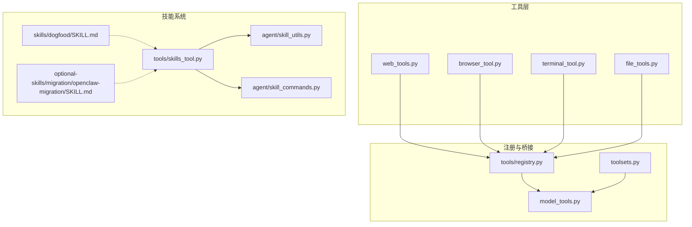
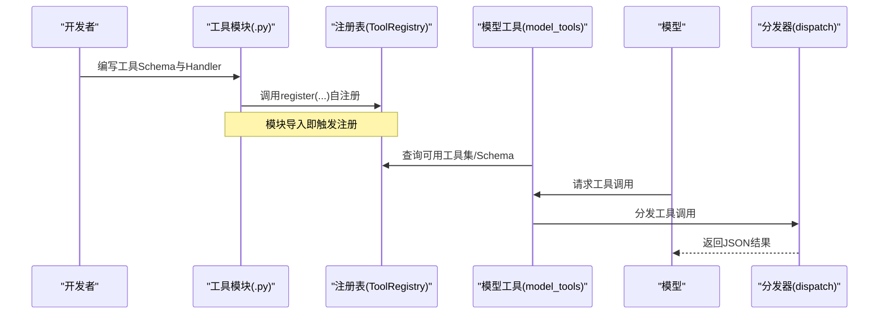
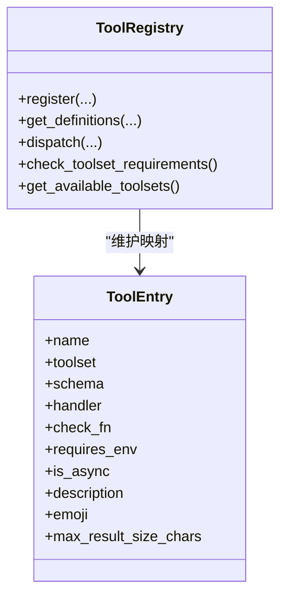
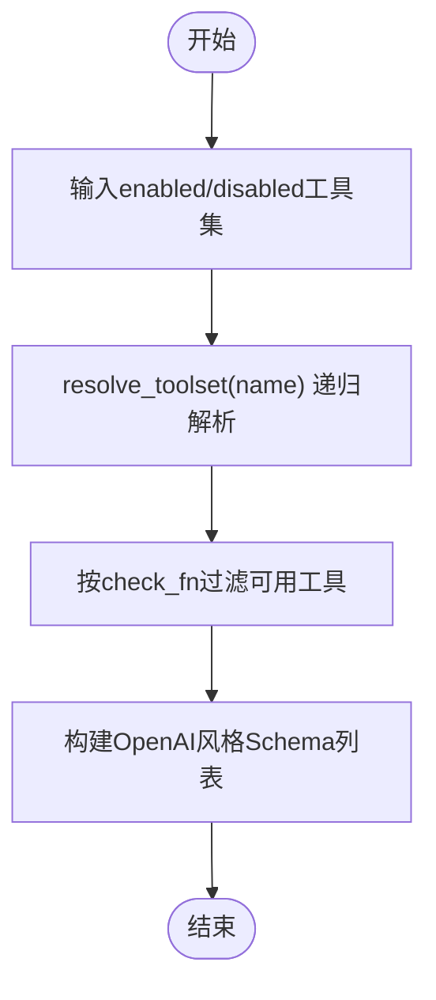
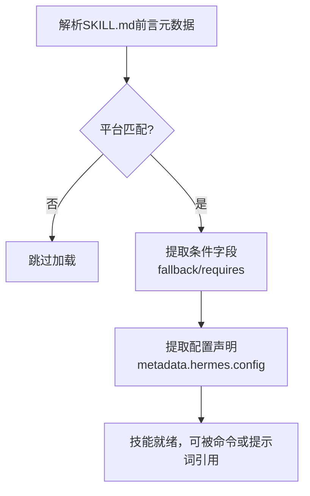
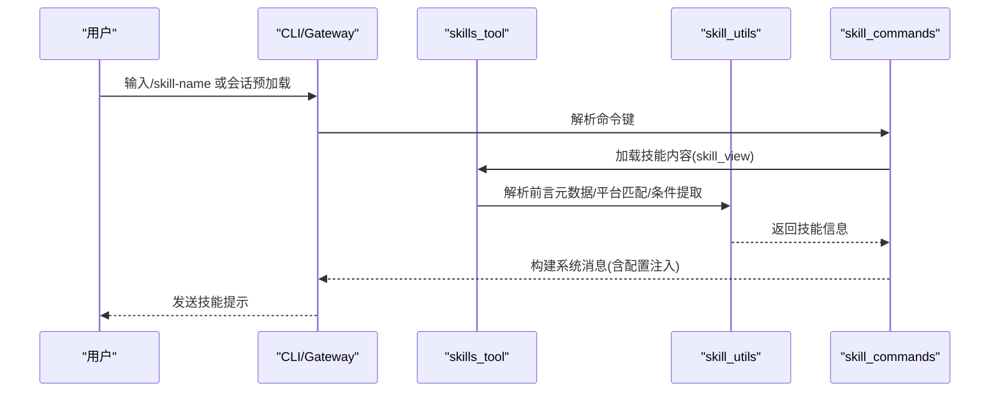
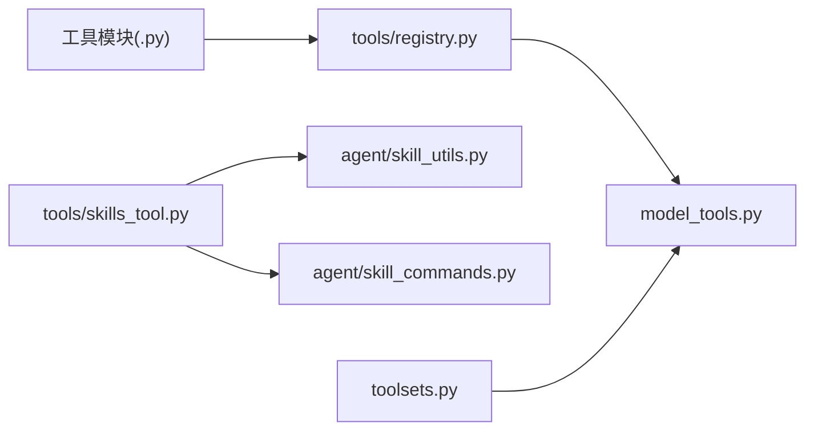

# 新增组件开发

<cite>
**本文档引用的文件**
- [model_tools.py](file://model_tools.py)
- [registry.py](file://tools/registry.py)
- [toolsets.py](file://toolsets.py)
- [skills_tool.py](file://tools/skills_tool.py)
- [skill_utils.py](file://agent/skill_utils.py)
- [skill_commands.py](file://agent/skill_commands.py)
- [web_tools.py](file://tools/web_tools.py)
- [browser_tool.py](file://tools/browser_tool.py)
- [terminal_tool.py](file://tools/terminal_tool.py)
- [file_tools.py](file://tools/file_tools.py)
- [SKILL.md](file://skills/dogfood/SKILL.md)
- [openclaw-migration/SKILL.md](file://optional-skills/migration/openclaw-migration/SKILL.md)
</cite>

## 目录
1. [简介](#简介)
2. [项目结构](#项目结构)
3. [核心组件](#核心组件)
4. [架构总览](#架构总览)
5. [详细组件分析](#详细组件分析)
6. [依赖分析](#依赖分析)
7. [性能考虑](#性能考虑)
8. [故障排查指南](#故障排查指南)
9. [结论](#结论)
10. [附录](#附录)

## 简介
本指南面向希望为 Hermes Agent 扩展“工具”和“技能”的开发者，系统讲解组件自注册机制、Schema 定义、Handler 实现、注册流程、工具集分组与平台预设、条件激活与元数据设置、测试方法以及组件生命周期管理与系统集成方式。文档以仓库现有实现为依据，提供可直接落地的开发步骤、模板路径与最佳实践。

## 项目结构
Hermes Agent 的组件开发围绕以下关键模块展开：
- 工具层：位于 tools/，每个工具通过模块级注册函数向中央注册表注册自身 Schema、处理器与可用性检查。
- 注册表：tools/registry.py 提供统一的 ToolRegistry，负责收集、查询与调度工具。
- 工具集：toolsets.py 定义工具集合与平台预设，支持组合与动态解析。
- 技能系统：skills/ 下的 SKILL.md 文档作为技能元数据与内容载体；tools/skills_tool.py 提供技能列表与查看能力；agent/skill_utils.py 与 agent/skill_commands.py 负责平台匹配、条件提取与命令构建。
- 模型工具桥接：model_tools.py 在运行时发现工具、生成模型可用的工具 Schema，并分发工具调用。

**图表来源**
- [model_tools.py:132-170](file://model_tools.py#L132-L170)
- [registry.py:48-111](file://tools/registry.py#L48-L111)
- [toolsets.py:68-391](file://toolsets.py#L68-L391)
- [skills_tool.py:1-200](file://tools/skills_tool.py#L1-L200)
- [skill_utils.py:19-444](file://agent/skill_utils.py#L19-L444)
- [skill_commands.py:1-369](file://agent/skill_commands.py#L1-L369)

**章节来源**
- [model_tools.py:132-170](file://model_tools.py#L132-L170)
- [registry.py:48-111](file://tools/registry.py#L48-L111)
- [toolsets.py:68-391](file://toolsets.py#L68-L391)

## 核心组件
- 工具注册表（ToolRegistry）
  - 维护工具名称到 ToolEntry 的映射，提供查询、分发与可用性检查。
  - 支持异步处理器自动桥接与错误规范化返回。
- 工具发现与桥接（model_tools）
  - 在启动时导入各工具模块触发注册；对外暴露 get_tool_definitions 与 handle_function_call。
  - 内置参数类型强制转换与结果大小限制等辅助能力。
- 工具集（toolsets）
  - 静态定义工具集合与平台预设，支持组合与动态解析；同时兼容插件注册的工具集。
- 技能系统
  - SKILL.md 前言元数据驱动技能加载、平台匹配、条件激活与配置变量声明。
  - 技能命令扫描与消息构建，支持会话内预加载与交互式调用。

**章节来源**
- [registry.py:48-286](file://tools/registry.py#L48-L286)
- [model_tools.py:234-548](file://model_tools.py#L234-L548)
- [toolsets.py:395-564](file://toolsets.py#L395-L564)
- [skills_tool.py:1-200](file://tools/skills_tool.py#L1-L200)
- [skill_utils.py:19-444](file://agent/skill_utils.py#L19-L444)
- [skill_commands.py:1-369](file://agent/skill_commands.py#L1-L369)

## 架构总览
下图展示了从工具模块注册到模型调用分发的完整链路，以及技能系统与平台命令的集成点。

**图表来源**
- [registry.py:59-94](file://tools/registry.py#L59-L94)
- [model_tools.py:234-548](file://model_tools.py#L234-L548)

## 详细组件分析

### 工具开发流程（自注册机制与Schema）
- 自注册步骤
  - 在工具模块顶部调用注册表的 register(...)，传入工具名、所属工具集、Schema、处理器、可用性检查、环境变量需求、是否异步、描述、表情符号与最大结果字符数等。
  - 注册后，model_tools 在启动时导入该模块，触发其自注册逻辑。
- Schema 定义
  - 使用 OpenAI 风格的 function schema，包含 name、description、parameters（含属性类型）。
  - 可选字段如 max_result_size_chars 用于控制输出截断。
- Handler 实现
  - 处理器需返回 JSON 字符串；推荐使用注册表提供的 tool_error/tool_result 辅助函数。
  - 异步处理器由 model_tools 的 _run_async 自动桥接。
- 可用性检查
  - 通过 check_fn 判断工具是否可用；未满足条件的工具不会出现在最终 Schema 列表中。
- 导入与发现
  - model_tools._discover_tools 中显式导入工具模块，确保所有工具完成自注册。

**图表来源**
- [registry.py:24-94](file://tools/registry.py#L24-L94)

**章节来源**
- [registry.py:59-94](file://tools/registry.py#L59-L94)
- [model_tools.py:132-170](file://model_tools.py#L132-L170)

### 工具集分组与平台预设
- 工具集定义
  - toolsets.py 中的 TOOLSETS 字典定义了基础工具集（如 web、terminal、file、browser、skills 等）与场景化工具集（如 hermes-cli、hermes-telegram 等）。
  - 支持 includes 组合，resolve_toolset 递归解析，支持插件动态注册的工具集。
- 平台预设
  - 各平台工具集共享核心工具集（如 hermes-core），并通过 check_fn 控制某些工具（如跨平台消息）的可用性。
- 动态解析
  - get_tool_definitions 接受 enabled_toolsets/disabled_toolsets 参数，按工具集过滤最终 Schema 列表。

**图表来源**
- [toolsets.py:410-467](file://toolsets.py#L410-L467)
- [model_tools.py:234-353](file://model_tools.py#L234-L353)

**章节来源**
- [toolsets.py:68-391](file://toolsets.py#L68-L391)
- [model_tools.py:234-353](file://model_tools.py#L234-L353)

### 技能开发（目录结构、SKILL.md格式、平台特定技能、条件激活、设置元数据）
- 目录结构
  - 技能目录位于 ~/.hermes/skills/ 下，每个技能以 SKILL.md 为主文件，可包含 references/、templates/、assets/ 等子目录。
- SKILL.md 元数据
  - 必填字段：name、description；可选字段：version、license、platforms、metadata.hermes.tags、metadata.hermes.related_skills 等。
  - 支持前置条件 prerequisites（环境变量与命令）与 setup.collect_secrets 等高级元数据。
- 平台匹配
  - 通过 skill_utils.skill_matches_platform 根据 platforms 字段与当前系统平台进行匹配。
- 条件激活
  - metadata.hermes 下的 hermes.fallback_for_toolsets、hermes.requires_toolsets、hermes.fallback_for_tools、hermes.requires_tools 等字段用于条件激活。
- 配置变量声明
  - metadata.hermes.config 声明技能所需的配置项（key、description、default、prompt），运行时从 config.yaml 中解析并注入到提示词中。
- 技能命令
  - agent/skill_commands.py 提供扫描与构建 /slash 命令的能力，支持会话内预加载与用户指令拼接。

**图表来源**
- [skill_utils.py:92-115](file://agent/skill_utils.py#L92-L115)
- [skill_utils.py:241-255](file://agent/skill_utils.py#L241-L255)
- [skill_utils.py:261-317](file://agent/skill_utils.py#L261-L317)
- [skill_commands.py:200-262](file://agent/skill_commands.py#L200-L262)

**章节来源**
- [skills_tool.py:14-67](file://tools/skills_tool.py#L14-L67)
- [skill_utils.py:92-115](file://agent/skill_utils.py#L92-L115)
- [skill_utils.py:241-317](file://agent/skill_utils.py#L241-L317)
- [skill_commands.py:200-369](file://agent/skill_commands.py#L200-L369)
- [SKILL.md:1-162](file://skills/dogfood/SKILL.md#L1-L162)
- [openclaw-migration/SKILL.md:1-298](file://optional-skills/migration/openclaw-migration/SKILL.md#L1-L298)

### 工具实现示例与最佳实践
- 浏览器工具（browser_tool）
  - 支持本地 Chromium 与云后端（Browserbase/Browser Use），统一的 agent-browser 行为。
  - 通过配置与环境变量选择后端，提供会话隔离与清理。
- 终端工具（terminal_tool）
  - 支持 local/docker/modal 等多种执行后端，具备危险命令审批、磁盘用量告警与工作目录安全校验。
- 文件工具（file_tools）
  - 提供读取上限、设备路径阻断、敏感路径保护与重复读取去重等安全与性能特性。
- 网页工具（web_tools）
  - 支持多后端（Exa/Firecrawl/Parallel/Tavily），具备调试模式与内容摘要能力。

**图表来源**
- [skill_commands.py:291-369](file://agent/skill_commands.py#L291-L369)
- [skills_tool.py:1-200](file://tools/skills_tool.py#L1-L200)
- [skill_utils.py:1-200](file://agent/skill_utils.py#L1-L200)

**章节来源**
- [browser_tool.py:1-200](file://tools/browser_tool.py#L1-L200)
- [terminal_tool.py:1-200](file://tools/terminal_tool.py#L1-L200)
- [file_tools.py:1-200](file://tools/file_tools.py#L1-L200)
- [web_tools.py:1-200](file://tools/web_tools.py#L1-L200)

### 组件生命周期管理与系统集成
- 生命周期
  - 注册阶段：模块导入时完成注册（register）。
  - 发现阶段：model_tools._discover_tools 导入工具模块，完成工具集解析与可用性检查。
  - 运行阶段：handle_function_call 根据工具名分发至注册表，异步处理器通过 _run_async 桥接。
  - 清理阶段：部分工具（如浏览器）提供清理接口，避免资源泄露。
- 系统集成
  - 技能系统通过 agent/skill_utils 与 agent/skill_commands 与 CLI/Gateway 对接，支持命令扫描、配置注入与消息构建。
  - 工具集与平台预设通过 toolsets 与 model_tools 的过滤机制，确保不同平台只呈现可用工具。

**章节来源**
- [model_tools.py:132-170](file://model_tools.py#L132-L170)
- [model_tools.py:459-548](file://model_tools.py#L459-L548)
- [registry.py:149-166](file://tools/registry.py#L149-L166)
- [skill_commands.py:1-369](file://agent/skill_commands.py#L1-L369)

## 依赖分析
- 工具模块对注册表的依赖是单向的：工具模块导入 tools/registry，在模块级别完成注册。
- model_tools 依赖工具模块与注册表，负责工具发现、Schema 过滤与分发。
- 技能系统依赖 tools/skills_tool 与 agent 层工具，实现元数据解析、平台匹配与命令构建。

**图表来源**
- [model_tools.py:132-170](file://model_tools.py#L132-L170)
- [registry.py:48-111](file://tools/registry.py#L48-L111)
- [toolsets.py:68-391](file://toolsets.py#L68-L391)
- [skills_tool.py:1-200](file://tools/skills_tool.py#L1-L200)
- [skill_utils.py:1-200](file://agent/skill_utils.py#L1-L200)
- [skill_commands.py:1-200](file://agent/skill_commands.py#L1-L200)

**章节来源**
- [model_tools.py:132-170](file://model_tools.py#L132-L170)
- [registry.py:48-111](file://tools/registry.py#L48-L111)
- [toolsets.py:68-391](file://toolsets.py#L68-L391)
- [skills_tool.py:1-200](file://tools/skills_tool.py#L1-L200)
- [skill_utils.py:1-200](file://agent/skill_utils.py#L1-L200)
- [skill_commands.py:1-200](file://agent/skill_commands.py#L1-L200)

## 性能考虑
- 工具 Schema 生成与过滤
  - 通过 check_fn 与工具集解析减少不必要的工具暴露，降低模型上下文压力。
- 结果大小控制
  - 注册表支持 per-tool 最大结果字符数，model_tools 提供默认预算配置，避免超长输出。
- 异步桥接
  - model_tools._run_async 为异步处理器提供持久事件循环，避免“事件循环已关闭”问题，提升缓存客户端稳定性。
- 文件读取上限
  - file_tools 对单次读取字符数进行限制，建议使用 offset+limit 进行定向读取，避免上下文膨胀。

**章节来源**
- [registry.py:172-180](file://tools/registry.py#L172-L180)
- [model_tools.py:39-125](file://model_tools.py#L39-L125)
- [file_tools.py:28-56](file://tools/file_tools.py#L28-L56)

## 故障排查指南
- 工具不可用
  - 检查工具的 check_fn 是否抛出异常或返回 False；确认所需环境变量是否满足。
  - 使用 model_tools.check_toolset_requirements 与 check_tool_availability 获取可用性报告。
- 工具调用失败
  - 查看 model_tools.handle_function_call 的错误返回，确认工具名是否存在、参数类型是否正确（内置参数类型强制转换）。
- 技能不显示或无法加载
  - 确认 SKILL.md 前言元数据完整且平台匹配；检查 disabled 列表与外部目录配置。
  - 使用 agent/skill_commands.scan_skill_commands 重新扫描命令映射。
- 浏览器工具问题
  - 检查后端配置（BROWSERBASE/BROWSER_USE/Camofox）与网络连通性；必要时启用调试模式。
- 终端工具问题
  - 关注危险命令审批与磁盘用量告警；确保工作目录安全字符集校验通过。

**章节来源**
- [registry.py:214-286](file://tools/registry.py#L214-L286)
- [model_tools.py:545-548](file://model_tools.py#L545-L548)
- [skill_commands.py:200-262](file://agent/skill_commands.py#L200-L262)
- [browser_tool.py:1-200](file://tools/browser_tool.py#L1-L200)
- [terminal_tool.py:1-200](file://tools/terminal_tool.py#L1-L200)

## 结论
Hermes Agent 的组件开发遵循“模块自注册 + 中央注册表 + 工具集过滤 + 技能元数据驱动”的清晰架构。开发者只需在工具模块中完成注册与实现，即可无缝接入模型工具桥接与平台工具集体系；技能系统则通过 SKILL.md 元数据实现条件激活、平台适配与配置注入。配合完善的可用性检查、异步桥接与性能控制，能够稳定扩展复杂能力。

## 附录
- 开发模板路径（仅提供路径，不展示具体代码）
  - 工具自注册模板：[tools/web_tools.py:1-200](file://tools/web_tools.py#L1-L200)
  - 工具处理器返回规范：[tools/registry.py:309-335](file://tools/registry.py#L309-L335)
  - 工具集定义与组合：[toolsets.py:68-391](file://toolsets.py#L68-L391)
  - 技能目录结构与元数据：[tools/skills_tool.py:14-67](file://tools/skills_tool.py#L14-L67)
  - 技能命令扫描与注入：[agent/skill_commands.py:200-369](file://agent/skill_commands.py#L200-L369)
  - 示例技能文档（参考格式）：[skills/dogfood/SKILL.md:1-162](file://skills/dogfood/SKILL.md#L1-L162)、[optional-skills/migration/openclaw-migration/SKILL.md:1-298](file://optional-skills/migration/openclaw-migration/SKILL.md#L1-L298)