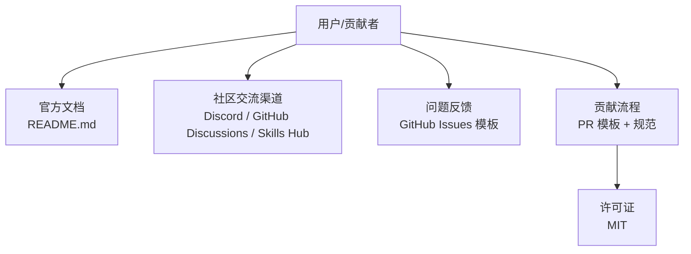
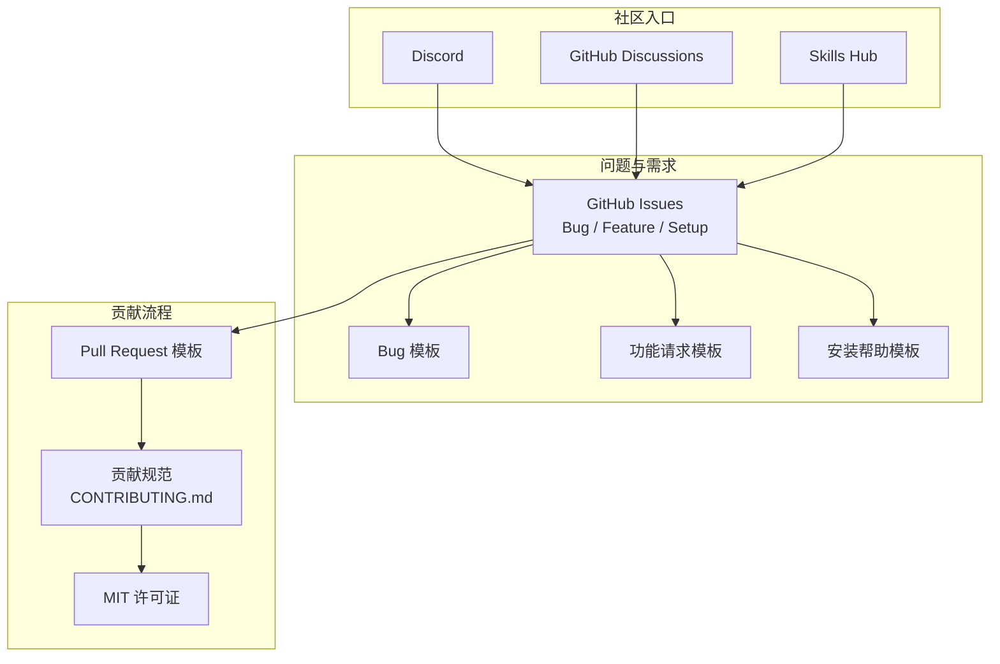
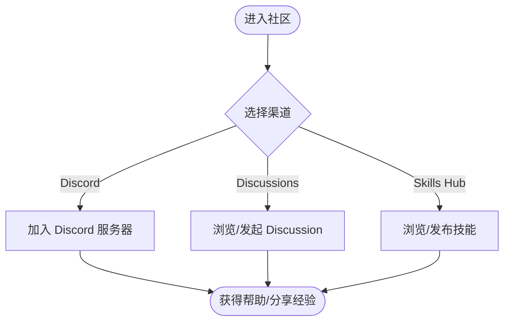
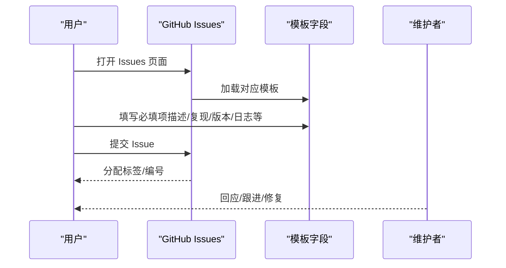
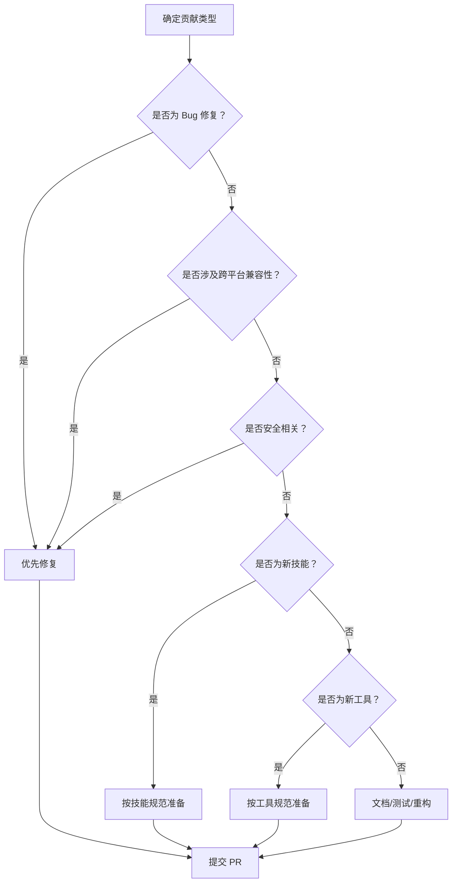
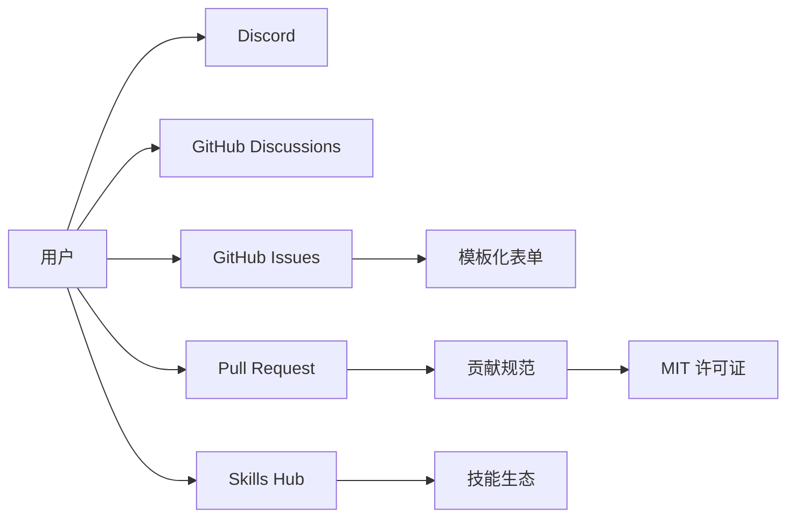

# 社区参与

<cite>
**本文引用的文件**
- [README.md](file://README.md)
- [CONTRIBUTING.md](file://CONTRIBUTING.md)
- [LICENSE](file://LICENSE)
- [bug_report.yml](file://.github/ISSUE_TEMPLATE/bug_report.yml)
- [feature_request.yml](file://.github/ISSUE_TEMPLATE/feature_request.yml)
- [setup_help.yml](file://.github/ISSUE_TEMPLATE/setup_help.yml)
- [PULL_REQUEST_TEMPLATE.md](file://.github/PULL_REQUEST_TEMPLATE.md)
- [skills_hub.py](file://hermes_cli/skills_hub.py)
- [DESCRIPTION.md](file://optional-skills/DESCRIPTION.md)
</cite>

## 目录
1. [简介](#简介)
2. [项目结构](#项目结构)
3. [核心组件](#核心组件)
4. [架构总览](#架构总览)
5. [详细组件分析](#详细组件分析)
6. [依赖关系分析](#依赖关系分析)
7. [性能考量](#性能考量)
8. [故障排查指南](#故障排查指南)
9. [结论](#结论)
10. [附录](#附录)

## 简介
本指南面向所有希望参与 Hermes Agent 社区的用户与贡献者，帮助你快速了解如何通过不同渠道进行交流、报告问题、贡献内容，并在协作中遵循行为准则与最佳实践。Hermes Agent 是一个由 Nous Research 开发的“自学习”AI 助手，支持多平台消息网关、可插拔技能系统、工具集与记忆能力，适合个人使用与团队协作。

## 项目结构
Hermes Agent 的社区参与主要围绕以下几类入口展开：
- 官方文档与安装说明：用于快速上手与问题定位
- 社区交流渠道：Discord、GitHub Discussions、Skills Hub
- 问题反馈与需求建议：GitHub Issues 模板化表单
- 贡献流程：Pull Request 模板、开发规范与测试要求
- 许可证与贡献者协议：MIT 许可证条款

章节来源
- [README.md:1-179](file://README.md#L1-L179)
- [CONTRIBUTING.md:650-661](file://CONTRIBUTING.md#L650-L661)

## 核心组件
- 社区交流渠道
  - Discord：用于提问、展示项目与分享技能
  - GitHub Discussions：用于设计提案与架构讨论
  - Skills Hub：上传专业技能到注册表并与社区共享
- 问题反馈
  - 使用 GitHub Issues 提交 Bug、功能请求或安装帮助
  - 通过模板自动填充关键信息，提升修复效率
- 贡献方式
  - 报告问题、提交修复、新增技能、改进文档、完善测试
- 许可与协议
  - 采用 MIT 许可证，贡献即默认同意以该许可证发布

章节来源
- [README.md:164-171](file://README.md#L164-L171)
- [CONTRIBUTING.md:640-661](file://CONTRIBUTING.md#L640-L661)

## 架构总览
下图展示了社区参与的关键交互路径：从用户在 Discord 或 GitHub Discussions 中发起讨论，到通过 Issues 模板精准反馈问题，再到通过 PR 模板与规范完成贡献闭环。

图表来源
- [README.md:164-171](file://README.md#L164-L171)
- [bug_report.yml:1-145](file://.github/ISSUE_TEMPLATE/bug_report.yml#L1-L145)
- [feature_request.yml:1-74](file://.github/ISSUE_TEMPLATE/feature_request.yml#L1-L74)
- [setup_help.yml:1-101](file://.github/ISSUE_TEMPLATE/setup_help.yml#L1-L101)
- [PULL_REQUEST_TEMPLATE.md:1-76](file://.github/PULL_REQUEST_TEMPLATE.md#L1-L76)
- [CONTRIBUTING.md:640-661](file://CONTRIBUTING.md#L640-L661)

## 详细组件分析

### 组件一：社区交流渠道
- Discord（Nous Research）
  - 用途：提问、展示项目、分享技能
  - 链接：见 README 中的徽章与链接
- GitHub Discussions
  - 用途：设计提案、架构讨论
- Skills Hub
  - 用途：上传专业技能到注册表并与社区共享
  - CLI 命令：`hermes skills browse/search/inspect/install`
  - 官方可选技能：位于 optional-skills 目录，可通过 Hub 发现与安装

章节来源
- [README.md:164-171](file://README.md#L164-L171)
- [skills_hub.py:144-182](file://hermes_cli/skills_hub.py#L144-L182)
- [skills_hub.py:184-308](file://hermes_cli/skills_hub.py#L184-L308)
- [skills_hub.py:468-516](file://hermes_cli/skills_hub.py#L468-L516)
- [DESCRIPTION.md:1-25](file://optional-skills/DESCRIPTION.md#L1-L25)

### 组件二：问题报告（GitHub Issues）
- 适用场景
  - Bug：崩溃、异常行为、数据丢失
  - 功能请求：新特性、改进点
  - 安装/配置帮助：环境诊断、安装失败
- 模板字段与要求
  - Bug 模板：描述、复现步骤、期望/实际行为、受影响组件、平台、操作系统、Python 版本、Hermes 版本、日志/回溯、根因分析（可选）、建议修复（可选）
  - 功能请求模板：问题/用例、解决方案、替代方案、特性类型、范围、是否愿意提交 PR
  - 安装帮助模板：问题描述、已执行步骤、安装方式、操作系统、Python/Hermes 版本、doctor 输出、错误输出、已尝试方法
- 报告前建议
  - 搜索现有 Issue，避免重复
  - 更新到最新版本并确认问题依旧存在
  - 运行 `hermes doctor` 并附带输出

图表来源
- [bug_report.yml:15-145](file://.github/ISSUE_TEMPLATE/bug_report.yml#L15-L145)
- [feature_request.yml:14-74](file://.github/ISSUE_TEMPLATE/feature_request.yml#L14-L74)
- [setup_help.yml:17-101](file://.github/ISSUE_TEMPLATE/setup_help.yml#L17-L101)

章节来源
- [bug_report.yml:11-145](file://.github/ISSUE_TEMPLATE/bug_report.yml#L11-L145)
- [feature_request.yml:9-74](file://.github/ISSUE_TEMPLATE/feature_request.yml#L9-L74)
- [setup_help.yml:11-101](file://.github/ISSUE_TEMPLATE/setup_help.yml#L11-L101)

### 组件三：贡献流程（Pull Request）
- PR 模板要点
  - 变更说明、解决的问题、测试方法、平台验证、相关 Issue 链接
- 贡献优先级与规范
  - 优先级：Bug 修复 > 跨平台兼容性 > 安全加固 > 性能与健壮性 > 新技能 > 新工具 > 文档
  - 代码风格：PEP 8，注释简洁明确，错误处理具体化
  - 测试：pytest 全量测试，手动验证关键路径
  - 提交信息：Conventional Commits 规范
- 新技能/工具判定
  - 大多数能力应作为“技能”，而非“工具”
  - 技能：指令 + shell/API 调用 + 现有工具；工具：需要端到端集成、自定义逻辑或实时事件处理
  - 官方可选技能：位于 optional-skills，可通过 Hub 发现与安装

章节来源
- [CONTRIBUTING.md:7-18](file://CONTRIBUTING.md#L7-L18)
- [CONTRIBUTING.md:21-49](file://CONTRIBUTING.md#L21-L49)
- [CONTRIBUTING.md:584-637](file://CONTRIBUTING.md#L584-L637)
- [PULL_REQUEST_TEMPLATE.md:1-76](file://.github/PULL_REQUEST_TEMPLATE.md#L1-L76)

### 组件四：许可证与贡献者协议
- 许可证
  - 项目采用 MIT 许可证，允许自由使用、复制、修改、分发与再许可，需保留版权与许可声明
- 贡献者协议
  - 提交贡献即表示同意以 MIT 许可证发布

章节来源
- [LICENSE:1-22](file://LICENSE#L1-L22)
- [CONTRIBUTING.md:658-661](file://CONTRIBUTING.md#L658-L661)

## 依赖关系分析
社区参与的依赖关系体现在：用户通过多种入口进入社区，借助模板标准化问题与需求，最终通过 PR 模板与规范完成贡献闭环。Skills Hub 作为技能生态的核心枢纽，连接了“发现—安装—使用—审计—更新”的完整链路。

图表来源
- [README.md:164-171](file://README.md#L164-L171)
- [skills_hub.py:144-182](file://hermes_cli/skills_hub.py#L144-L182)
- [CONTRIBUTING.md:640-661](file://CONTRIBUTING.md#L640-L661)

## 性能考量
- 在 Issues 中提供完整且可复现的步骤，有助于维护者快速定位问题，减少反复沟通成本
- 在 PR 中附带测试结果与平台验证，可降低回归风险，提高合并效率
- 使用 Skills Hub 的“检查更新/审计”功能，保持已安装技能的安全性与可用性

## 故障排查指南
- 安装/配置问题
  - 运行 `hermes doctor` 并附带输出
  - 尝试 `hermes update` 升级到最新版本
  - 参考 README 的“疑难解答”部分
  - 在 Discord 获取更快的帮助
- Bug 报告
  - 使用 Bug 模板，务必包含：操作系统、Python 版本、Hermes 版本、完整错误回溯、最小复现步骤
  - 如已定位根因或有修复思路，可在模板中补充
- 功能请求
  - 明确问题场景与期望行为，评估是否更适合作为“技能”而非“工具”
  - 说明实现方案、替代方案与影响范围

章节来源
- [setup_help.yml:11-16](file://.github/ISSUE_TEMPLATE/setup_help.yml#L11-L16)
- [bug_report.yml:15-53](file://.github/ISSUE_TEMPLATE/bug_report.yml#L15-L53)
- [feature_request.yml:9-13](file://.github/ISSUE_TEMPLATE/feature_request.yml#L9-L13)

## 结论
Hermes Agent 的社区参与体系以“清晰的入口、标准化的模板、完善的贡献流程与开放的许可证”为核心，既便于用户快速获得帮助，也鼓励贡献者高效协作。建议在参与时：
- 优先使用 Discord 与 GitHub Discussions 进行非正式交流与设计讨论
- 使用 Issues 模板精准描述问题与需求
- 严格遵循 PR 模板与贡献规范，确保质量与一致性
- 通过 Skills Hub 分享与获取技能，共建开放生态

## 附录
- 快速链接
  - 官方文档：https://hermes-agent.nousresearch.com/docs/
  - Discord：https://discord.gg/NousResearch
  - GitHub Issues：https://github.com/NousResearch/hermes-agent/issues
  - GitHub Discussions：https://github.com/NousResearch/hermes-agent/discussions
  - Skills Hub：https://agentskills.io
- 常用命令
  - `hermes skills browse/search/inspect/install`：浏览/搜索/预览/安装技能
  - `hermes doctor`：诊断安装与运行环境
  - `hermes update`：升级到最新版本