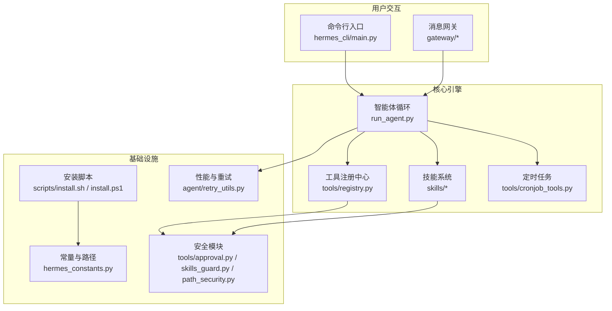
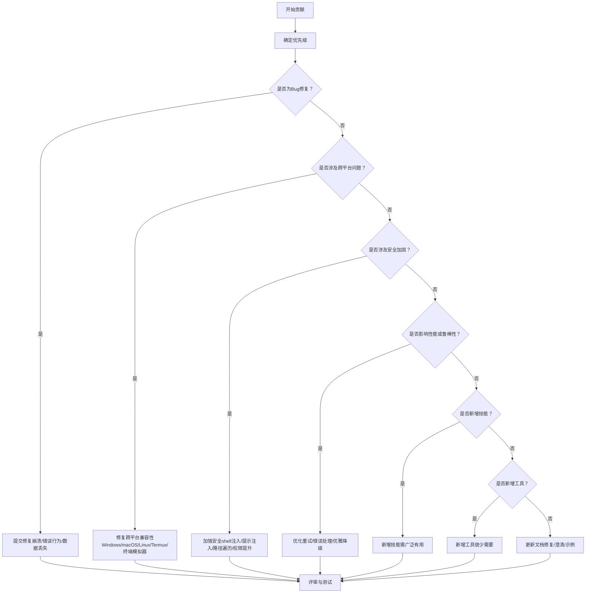
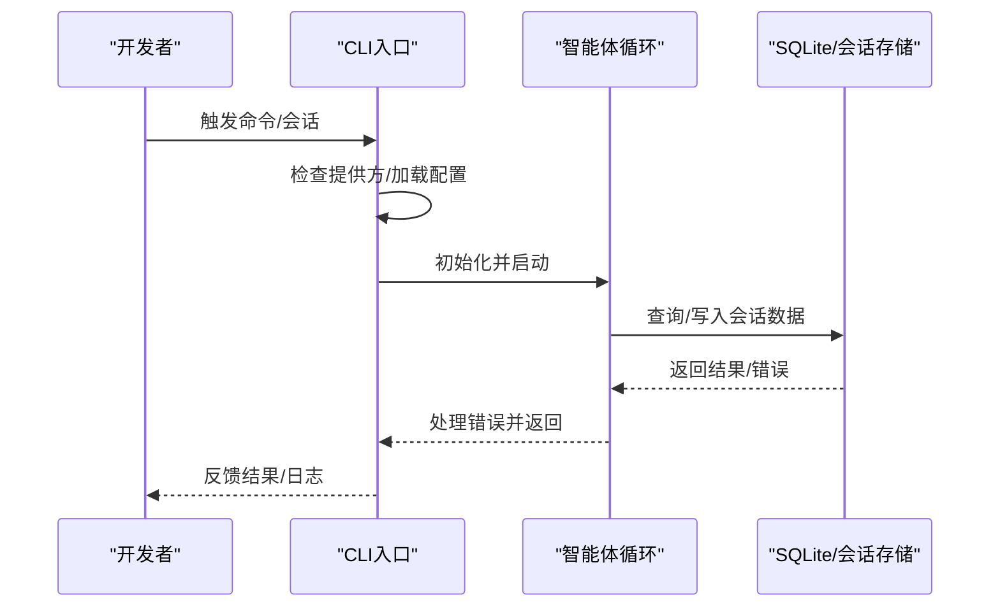
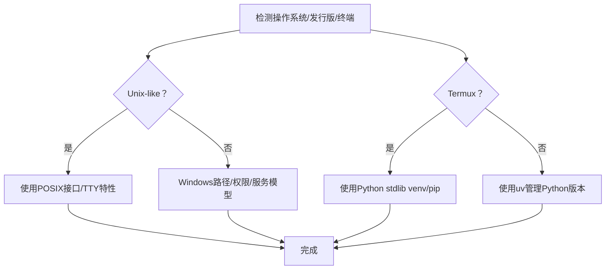
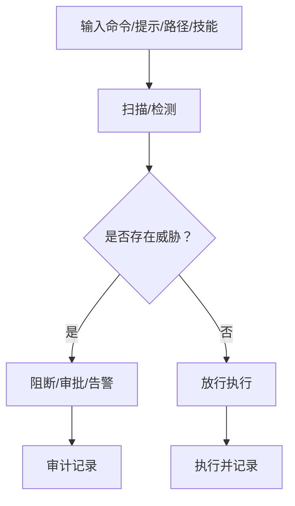
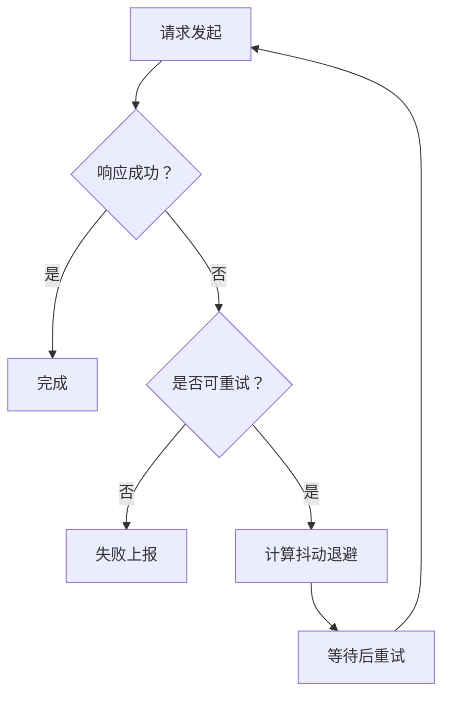
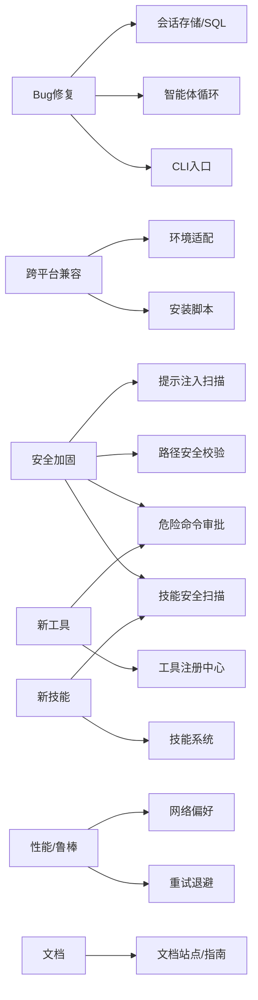

# 贡献优先级

<cite>
**本文引用的文件**
- [CONTRIBUTING.md](file://CONTRIBUTING.md)
- [README.md](file://README.md)
- [hermes_constants.py](file://hermes_constants.py)
- [hermes_cli/main.py](file://hermes_cli/main.py)
- [tools/approval.py](file://tools/approval.py)
- [tools/path_security.py](file://tools/path_security.py)
- [agent/retry_utils.py](file://agent/retry_utils.py)
- [scripts/install.sh](file://scripts/install.sh)
- [scripts/install.ps1](file://scripts/install.ps1)
- [tools/cronjob_tools.py](file://tools/cronjob_tools.py)
- [tools/skills_guard.py](file://tools/skills_guard.py)
- [tests/test_sql_injection.py](file://tests/test_sql_injection.py)
- [tests/test_subprocess_home_isolation.py](file://tests/test_subprocess_home_isolation.py)
</cite>

## 目录
1. [简介](#简介)
2. [项目结构](#项目结构)
3. [核心组件](#核心组件)
4. [架构总览](#架构总览)
5. [详细组件分析](#详细组件分析)
6. [依赖关系分析](#依赖关系分析)
7. [性能考虑](#性能考虑)
8. [故障排查指南](#故障排查指南)
9. [结论](#结论)

## 简介
本指南面向所有希望为 Hermes Agent 做出贡献的开发者，明确七个级别的贡献优先级与判定标准，帮助你快速定位自己的改动应归类到哪一级别，从而提升评审效率与合并速度。

七个优先级从高到低如下：
1) Bug修复（崩溃、错误行为、数据丢失）
2) 跨平台兼容性（Windows、macOS、Linux发行版、不同终端模拟器）
3) 安全加固（shell注入、提示注入、路径遍历、权限提升）
4) 性能与鲁棒性（重试逻辑、错误处理、优雅降级）
5) 新技能（但必须广泛有用）
6) 新工具（很少需要）
7) 文档（修复、澄清、新示例）

## 项目结构
Hermes Agent 是一个多模块、多入口的系统，包含命令行界面、消息网关、工具注册中心、技能系统、定时任务、安装脚本等。贡献时需关注以下关键点：
- CLI入口与会话管理：确保首次运行引导、环境变量加载、网络偏好（如强制IPv4）尽早应用
- 工具与技能：工具通过自注册机制加入系统；技能通过统一的技能系统加载与安全扫描
- 平台与安装：支持Linux、macOS、Windows（WSL2）、Termux；安装脚本负责依赖检测与环境准备
- 安全与合规：危险命令审批、路径安全校验、提示注入扫描、凭据隔离

图表来源
- [hermes_cli/main.py](file://hermes_cli/main.py)
- [tools/cronjob_tools.py](file://tools/cronjob_tools.py)
- [hermes_constants.py](file://hermes_constants.py)
- [tools/approval.py](file://tools/approval.py)
- [tools/skills_guard.py](file://tools/skills_guard.py)
- [tools/path_security.py](file://tools/path_security.py)
- [agent/retry_utils.py](file://agent/retry_utils.py)
- [scripts/install.sh](file://scripts/install.sh)
- [scripts/install.ps1](file://scripts/install.ps1)

章节来源
- [README.md](file://README.md)
- [CONTRIBUTING.md](file://CONTRIBUTING.md)

## 核心组件
- CLI入口与初始化：负责解析参数、加载配置、设置网络偏好、检查提供方可用性、同步技能等
- 危险命令审批：基于正则模式匹配与会话状态，结合智能审批与永久允许列表
- 路径安全校验：防止路径遍历与越界访问
- 提示注入扫描：对cron提示与外部技能进行威胁模式检测
- 重试与退避：抖动化指数退避，避免“惊群效应”
- 安装与跨平台：Linux/macOS/Windows/Android（Termux）的差异处理

章节来源
- [hermes_cli/main.py](file://hermes_cli/main.py)
- [tools/approval.py](file://tools/approval.py)
- [tools/path_security.py](file://tools/path_security.py)
- [tools/cronjob_tools.py](file://tools/cronjob_tools.py)
- [agent/retry_utils.py](file://agent/retry_utils.py)
- [scripts/install.sh](file://scripts/install.sh)
- [scripts/install.ps1](file://scripts/install.ps1)

## 架构总览
下图展示贡献优先级在系统中的落地位置与影响范围：

## 详细组件分析

### 优先级1：Bug修复（崩溃、错误行为、数据丢失）
适用场景
- 运行时崩溃、异常退出
- 明确的错误行为（如结果不正确、流程中断）
- 数据丢失或持久化失败

判定标准
- 有明确复现步骤与日志
- 影响用户体验或系统稳定性
- 修复方案清晰且无副作用

相关实现要点
- CLI入口中对首次运行、提供方可用性、会话恢复等的健壮性处理
- SQLite查询参数化与标识符安全，避免SQL注入
- 子进程HOME隔离，避免凭据泄漏

图表来源
- [hermes_cli/main.py](file://hermes_cli/main.py)
- [tests/test_sql_injection.py](file://tests/test_sql_injection.py)

章节来源
- [hermes_cli/main.py](file://hermes_cli/main.py)
- [tests/test_sql_injection.py](file://tests/test_sql_injection.py)
- [tests/test_subprocess_home_isolation.py](file://tests/test_subprocess_home_isolation.py)

### 优先级2：跨平台兼容性（Windows、macOS、Linux发行版、不同终端模拟器）
适用场景
- 在Windows（WSL2/PowerShell）、macOS、Linux（Ubuntu/Fedora/Arch等）、Termux上出现差异
- 终端模拟器或TTY行为不一致导致的功能异常
- 文件路径分隔符、编码、进程管理差异

判定标准
- 在多个目标平台/终端上验证失败
- 代码中存在平台分支或硬编码路径
- 需要条件编译或运行时检测

相关实现要点
- 安装脚本对不同平台的依赖检测与自动安装
- Windows（PowerShell）与Unix风格脚本的差异
- 终端菜单回退、编码处理、进程会话隔离

图表来源
- [scripts/install.sh](file://scripts/install.sh)
- [scripts/install.ps1](file://scripts/install.ps1)

章节来源
- [scripts/install.sh](file://scripts/install.sh)
- [scripts/install.ps1](file://scripts/install.ps1)

### 优先级3：安全加固（shell注入、提示注入、路径遍历、权限提升）
适用场景
- shell命令拼接存在注入风险
- 提示词被篡改以绕过限制
- 路径遍历导致越权访问
- 权限提升或持久化攻击

判定标准
- 使用正则/静态分析/运行时扫描识别潜在威胁
- 修复后通过单元测试覆盖

相关实现要点
- 危险命令检测与审批流
- 提示注入扫描（cron提示、技能内容）
- 路径安全校验（相对路径、禁止..逃逸）
- 技能内容安全扫描（exfil、注入、破坏性、网络、obfuscation等）

图表来源
- [tools/approval.py](file://tools/approval.py)
- [tools/cronjob_tools.py](file://tools/cronjob_tools.py)
- [tools/skills_guard.py](file://tools/skills_guard.py)
- [tools/path_security.py](file://tools/path_security.py)

章节来源
- [tools/approval.py](file://tools/approval.py)
- [tools/cronjob_tools.py](file://tools/cronjob_tools.py)
- [tools/skills_guard.py](file://tools/skills_guard.py)
- [tools/path_security.py](file://tools/path_security.py)

### 优先级4：性能与鲁棒性（重试逻辑、错误处理、优雅降级）
适用场景
- API限流导致频繁失败
- 网络波动或上游不稳定
- 多会话并发重试引发“惊群”

判定标准
- 明确的退避策略与抖动
- 错误分类与分级处理
- 优雅降级与可恢复性

相关实现要点
- 抖动化指数退避，避免同时重试
- 网络层IPv4偏好设置
- 会话/任务状态的幂等与回滚

图表来源
- [agent/retry_utils.py](file://agent/retry_utils.py)
- [hermes_constants.py](file://hermes_constants.py)

章节来源
- [agent/retry_utils.py](file://agent/retry_utils.py)
- [hermes_constants.py](file://hermes_constants.py)

### 优先级5：新技能（但必须广泛有用）
适用场景
- 解决常见工作流（搜索、开发、运维、办公）
- 对大多数用户有价值，而非小众需求
- 可通过现有工具与指令组合实现

判定标准
- 广泛实用性与可复用性
- 不引入新的第三方依赖
- 与现有技能生态互补

相关实现要点
- 技能目录结构与元信息（SKILL.md）
- 平台声明与条件激活
- 安全扫描与安装策略

章节来源
- [CONTRIBUTING.md](file://CONTRIBUTING.md)

### 优先级6：新工具（很少需要）
适用场景
- 需要端到端集成、认证、多组件配置
- 需要定制处理逻辑或实时事件
- 无法通过现有工具表达

判定标准
- 必须通过工具集暴露，而非仅内部使用
- 与现有工具职责不重复
- 有明确的schema与注册

章节来源
- [CONTRIBUTING.md](file://CONTRIBUTING.md)

### 优先级7：文档（修复、澄清、新示例）
适用场景
- 修复错别字、过时信息
- 澄清模糊表述
- 补充真实使用示例

判定标准
- 保持一致性与准确性
- 面向使用者，避免过度技术细节

章节来源
- [CONTRIBUTING.md](file://CONTRIBUTING.md)

## 依赖关系分析
贡献优先级与系统模块的耦合关系如下：

图表来源
- [hermes_cli/main.py](file://hermes_cli/main.py)
- [tools/approval.py](file://tools/approval.py)
- [tools/skills_guard.py](file://tools/skills_guard.py)
- [tools/path_security.py](file://tools/path_security.py)
- [tools/cronjob_tools.py](file://tools/cronjob_tools.py)
- [agent/retry_utils.py](file://agent/retry_utils.py)
- [hermes_constants.py](file://hermes_constants.py)
- [scripts/install.sh](file://scripts/install.sh)
- [scripts/install.ps1](file://scripts/install.ps1)

章节来源
- [CONTRIBUTING.md](file://CONTRIBUTING.md)

## 性能考虑
- 退避策略：采用抖动化指数退避，降低并发重试的集中性
- 网络偏好：在IPv6不可达环境下强制IPv4，减少超时
- I/O与会话：避免不必要的磁盘写入，使用内存缓存与增量更新

## 故障排查指南
- 安装失败：检查平台依赖（Python/uv/Git/Node），按脚本提示安装缺失组件
- 跨平台问题：确认路径分隔符、编码、TTY特性差异
- 安全告警：查看危险命令审批与技能扫描报告，必要时调整正则或策略
- 性能问题：启用IPv4偏好、优化重试参数、减少上下文长度

章节来源
- [scripts/install.sh](file://scripts/install.sh)
- [scripts/install.ps1](file://scripts/install.ps1)
- [tools/approval.py](file://tools/approval.py)
- [tools/skills_guard.py](file://tools/skills_guard.py)
- [hermes_constants.py](file://hermes_constants.py)

## 结论
- 请优先处理高优先级问题，确保系统稳定与安全
- 跨平台兼容性与安全加固是长期质量保障的关键
- 新功能应尽量以技能形式提供，避免过度引入工具
- 文档与示例有助于社区协作与知识沉淀