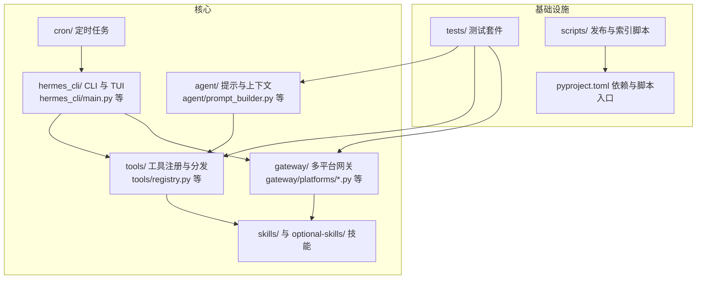
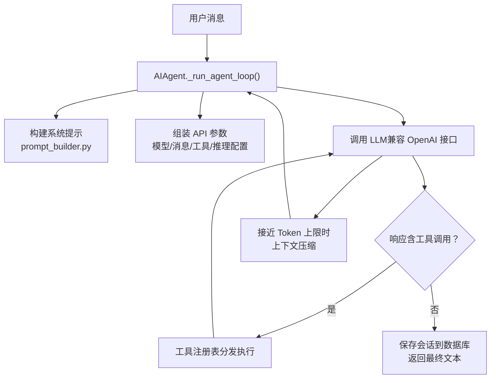
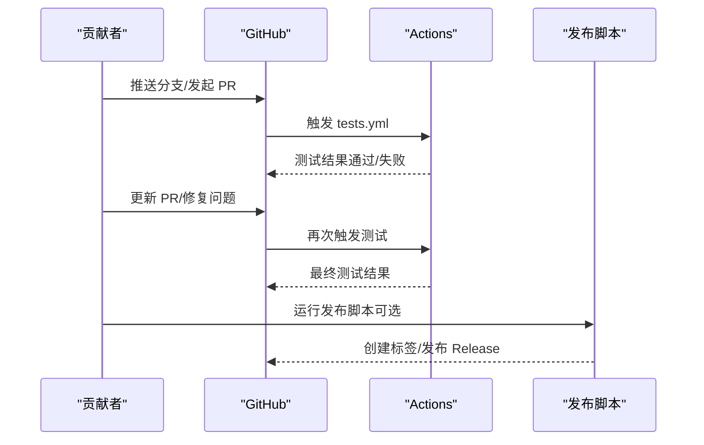
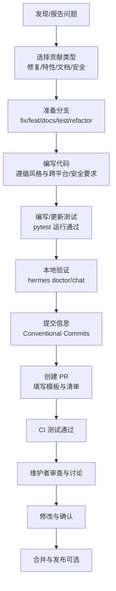

# 贡献流程

<cite>
**本文引用的文件**
- [CONTRIBUTING.md](file://CONTRIBUTING.md)
- [.github/PULL_REQUEST_TEMPLATE.md](file://.github/PULL_REQUEST_TEMPLATE.md)
- [.github/ISSUE_TEMPLATE/bug_report.yml](file://.github/ISSUE_TEMPLATE/bug_report.yml)
- [.github/ISSUE_TEMPLATE/feature_request.yml](file://.github/ISSUE_TEMPLATE/feature_request.yml)
- [.github/ISSUE_TEMPLATE/setup_help.yml](file://.github/ISSUE_TEMPLATE/setup_help.yml)
- [.github/workflows/tests.yml](file://.github/workflows/tests.yml)
- [.github/workflows/skills-index.yml](file://.github/workflows/skills-index.yml)
- [pyproject.toml](file://pyproject.toml)
- [scripts/release.py](file://scripts/release.py)
- [README.md](file://README.md)
</cite>

## 目录
1. [简介](#简介)
2. [项目结构](#项目结构)
3. [核心组件](#核心组件)
4. [架构总览](#架构总览)
5. [详细组件分析](#详细组件分析)
6. [依赖分析](#依赖分析)
7. [性能考虑](#性能考虑)
8. [故障排查指南](#故障排查指南)
9. [结论](#结论)
10. [附录](#附录)

## 简介
本指南面向所有希望为 Hermes Agent 做出贡献的开发者，覆盖从问题报告、设计决策（优先级与“技能 vs 工具”选择）、开发环境搭建、编码规范、分支与提交信息规范、PR 审查流程，到测试与发布流程的完整路径。我们鼓励贡献者遵循统一的流程与标准，确保代码质量、安全性与可维护性。

## 项目结构
Hermes Agent 的核心模块围绕“对话代理 + 工具系统 + 技能系统 + 网关通道 + CLI/配置”展开。贡献者在提交改动时，应关注以下关键目录与职责边界：
- agent/：代理内核（提示构建、上下文压缩、会话持久化等）
- hermes_cli/：命令行入口与交互式 TUI
- tools/：工具注册与分发、终端/文件/网络/Vision/子进程等能力
- gateway/：多平台消息网关（Telegram/Discord/Slack/WhatsApp 等）
- skills/ 与 optional-skills/：内置与官方可选技能
- cron/：定时任务调度
- tests/：单元/集成/端到端测试
- scripts/：安装脚本、技能索引构建、发布工具等

**图表来源**
- [CONTRIBUTING.md:114-197](file://CONTRIBUTING.md#L114-L197)
- [pyproject.toml:112-118](file://pyproject.toml#L112-L118)

**章节来源**
- [CONTRIBUTING.md:114-197](file://CONTRIBUTING.md#L114-L197)
- [pyproject.toml:112-118](file://pyproject.toml#L112-L118)

## 核心组件
- 代理核心循环与提示构建：负责系统提示拼装、工具调用、上下文压缩与会话持久化
- 工具系统：自注册机制、工具集分组、按平台启用/禁用
- 技能系统：声明式技能描述、条件展示、平台限定、安全设置元数据
- 网关通道：多平台适配器、会话存储、消息路由
- CLI/配置：命令解析、配置管理、OAuth/密钥注入、皮肤主题

**章节来源**
- [CONTRIBUTING.md:200-227](file://CONTRIBUTING.md#L200-L227)

## 架构总览
下图展示了用户消息进入后，代理如何通过工具系统执行任务，并在接近上下文上限时进行压缩：

**图表来源**
- [CONTRIBUTING.md:204-217](file://CONTRIBUTING.md#L204-L217)

**章节来源**
- [CONTRIBUTING.md:200-227](file://CONTRIBUTING.md#L200-L227)

## 详细组件分析

### 贡献优先级与决策标准
贡献的优先顺序如下（越靠前越优先）：
1) Bug 修复（崩溃、行为异常、数据丢失）
2) 跨平台兼容性（Windows/macOS/Linux 终端模拟器）
3) 安全加固（命令注入、提示注入、路径遍历、提权）
4) 性能与鲁棒性（重试逻辑、错误处理、优雅降级）
5) 新技能（仅限广泛有用）
6) 新工具（极少需要；多数能力应以技能形式提供）
7) 文档（修复、澄清、示例）

“技能 vs 工具”的选择原则：
- 技能：由指令 + 现有工具组合完成，无需在代理中嵌入自定义 Python 集成或密钥管理；适合 CLI/API 包装
- 工具：需要代理侧的认证流程、密钥管理、二进制/流式实时事件处理，或必须精确执行的定制逻辑

是否打包为内置技能：
- 内置技能（skills/）：对大多数用户广泛有用的通用能力
- 可选官方技能（optional-skills/）：官方但非普适，需用户显式安装
- 社区技能：上传至 Skills Hub，通过注册表分享

**章节来源**
- [CONTRIBUTING.md:7-18](file://CONTRIBUTING.md#L7-L18)
- [CONTRIBUTING.md:21-49](file://CONTRIBUTING.md#L21-L49)

### 分支命名规范与提交信息规范
- 分支命名
  - 修复类：fix/description
  - 功能类：feat/description
  - 文档类：docs/description
  - 测试类：test/description
  - 重构类：refactor/description
- 提交信息采用 Conventional Commits：
  - 类型：fix、feat、docs、test、refactor、chore
  - 作用域：cli、gateway、tools、skills、agent、install、whatsapp、security 等
  - 示例：fix(cli)、feat(gateway)、fix(security)、test(tools)

**章节来源**
- [CONTRIBUTING.md:586-637](file://CONTRIBUTING.md#L586-L637)

### PR 审查流程与模板要点
- PR 模板包含：
  - 变更说明与动机
  - 相关 Issue 链接
  - 变更类型勾选（Bug 修复、新功能、安全修复、文档更新、测试、重构、新增技能）
  - 具体变更清单（建议列出文件路径）
  - 测试方法（复现步骤 + 证明修复有效）
  - 代码检查清单（已阅读贡献指南、提交信息符合 Conventional Commits、仅包含相关变更、已运行测试、已在目标平台验证、已更新文档/配置/工具描述等）
  - 新技能额外要求（广泛有用、遵循标准格式、无外部依赖、端到端测试）

**章节来源**
- [.github/PULL_REQUEST_TEMPLATE.md:1-76](file://.github/PULL_REQUEST_TEMPLATE.md#L1-L76)

### 问题报告（Issue）模板与流程
- Bug 报告模板：包含组件影响范围、平台、版本、重现步骤、期望/实际行为、日志/回溯、根因分析、建议修复
- 功能请求模板：问题场景、解决方案、替代方案、功能类型（新工具/新技能/CLI 改进/网关改进/配置项/性能/可靠性/开发者体验/其他）、规模评估、是否愿意提交 PR
- 安装/配置求助模板：安装方式、操作系统、Python 版本、Hermes 版本、doctor 输出、错误输出、已尝试的解决办法

**章节来源**
- [.github/ISSUE_TEMPLATE/bug_report.yml:1-145](file://.github/ISSUE_TEMPLATE/bug_report.yml#L1-L145)
- [.github/ISSUE_TEMPLATE/feature_request.yml:1-74](file://.github/ISSUE_TEMPLATE/feature_request.yml#L1-L74)
- [.github/ISSUE_TEMPLATE/setup_help.yml:1-101](file://.github/ISSUE_TEMPLATE/setup_help.yml#L1-L101)

### 开发环境与测试
- 开发环境
  - Git、Python 3.11+、uv、Node.js 18+（浏览器工具/WhatsApp 桥）
  - 克隆仓库 + uv 虚拟环境 + 安装带 all/dev 选项
  - 配置 ~/.hermes/ 下的 config.yaml、.env、auth.json 等
  - 可选：RL 子模块、浏览器工具 npm install
- 运行与测试
  - hermes doctor 与 hermes chat 快速验证
  - pytest tests/ -v 运行测试套件
  - CI 中默认忽略集成/端到端测试，使用 -m 'not integration' 运行

**章节来源**
- [CONTRIBUTING.md:52-111](file://CONTRIBUTING.md#L52-L111)
- [pyproject.toml:123-129](file://pyproject.toml#L123-L129)
- [.github/workflows/tests.yml:37-46](file://.github/workflows/tests.yml#L37-L46)

### 代码风格与质量标准
- 风格：PEP 8，不强制严格行长
- 注释：仅在解释非显而易见意图、权衡或 API 特性
- 错误处理：捕获具体异常；使用 logger.warning/error 并在意外错误时开启 exc_info
- 跨平台：避免假设 Unix；注意 termios/fcntl、编码、进程管理差异、路径分隔符、安装脚本一致性

**章节来源**
- [CONTRIBUTING.md:230-236](file://CONTRIBUTING.md#L230-L236)
- [CONTRIBUTING.md:516-553](file://CONTRIBUTING.md#L516-L553)

### 技能与工具的添加规范
- 添加工具
  - 自注册：每个工具文件在导入时调用 registry.register
  - 在 model_tools 的 _modules 列表中引入模块
  - 如需新工具集，更新 toolsets.py 与平台预设
- 添加技能
  - 结构：SKILL.md（必填），可选 scripts/ 与 references/
  - SKILL.md 前言字段：名称、描述、版本、作者、许可证、平台限制、所需环境变量、前置条件、元数据标签与关联技能等
  - 条件激活：基于可用工具/工具集的显示控制（requires_* / fallback_*）
  - 安全设置元数据：required_environment_variables 在加载时安全提示
  - 指南：尽量使用标准库与现有工具；渐进披露；提供辅助脚本；自行测试

**章节来源**
- [CONTRIBUTING.md:239-299](file://CONTRIBUTING.md#L239-L299)
- [CONTRIBUTING.md:302-463](file://CONTRIBUTING.md#L302-L463)

### 跨平台兼容性与安全注意事项
- 跨平台规则：Unix-only 模块需捕获 ImportError/NotImplementedError；Windows 可能以不同编码读取 .env；进程管理与信号在 Windows 不同；路径使用 pathlib；安装脚本需同步 Windows 等价修改
- 安全保护：sudo 密码管道使用 shlex.quote；危险命令检测与审批；Cron 提示注入扫描；写操作黑名单；Hub 技能安全扫描；代码执行沙箱剥离密钥；容器硬核（丢弃权限、PID 限制、tmpfs 限制）

**章节来源**
- [CONTRIBUTING.md:516-581](file://CONTRIBUTING.md#L516-L581)

### PR 合并与发布流程（CI/CD 与发布脚本）
- CI 测试
  - tests.yml：推送/PR 触发，ubuntu-latest，取消重复任务；安装 uv、Python 3.11、依赖；运行 pytest（忽略集成/端到端）
  - skills-index.yml：定时/手动触发，构建技能索引并部署到 GitHub Pages
- 发布脚本
  - scripts/release.py：支持语义化版本 bump、CalVer 标签生成、提交分类（features/fixes/improvements/tests/chore 等）、生成变更日志、构建 Python 资产、创建标签与 GitHub Release（若 gh 存在）

**图表来源**
- [.github/workflows/tests.yml:1-74](file://.github/workflows/tests.yml#L1-L74)
- [.github/workflows/skills-index.yml:1-102](file://.github/workflows/skills-index.yml#L1-L102)
- [scripts/release.py:140-630](file://scripts/release.py#L140-L630)

**章节来源**
- [.github/workflows/tests.yml:1-74](file://.github/workflows/tests.yml#L1-L74)
- [.github/workflows/skills-index.yml:1-102](file://.github/workflows/skills-index.yml#L1-L102)
- [scripts/release.py:140-630](file://scripts/release.py#L140-L630)

### 社区参与与沟通渠道
- Discord：用于提问、展示项目、分享技能
- GitHub Discussions：用于设计提案与架构讨论
- Skills Hub：上传专业技能到注册表并与社区共享

**章节来源**
- [CONTRIBUTING.md:650-655](file://CONTRIBUTING.md#L650-L655)
- [README.md:164-170](file://README.md#L164-L170)

## 依赖分析
- 项目脚本入口：hermes、hermes-agent、hermes-acp
- 包发现与导出：agent、tools、hermes_cli、gateway、cron、acp_adapter、plugins
- 测试标记：integration（需要外部服务的测试）
- 可选依赖：messaging、cron、cli、dev、voice、pty、mcp、acp、honcho、homeassistant、sms、dingtalk、feishu、mistral、termux、rl 等

**章节来源**
- [pyproject.toml:112-129](file://pyproject.toml#L112-L129)

## 性能考虑
- 重试与容错：在工具与平台适配器中实现合理的重试策略与降级路径
- 上下文压缩：在接近上下文上限时自动摘要压缩，减少重复计算
- 并行批处理：批量轨迹生成与并行处理以提升吞吐
- 跨平台一致性：避免在 Windows/macOS/Linux 上出现性能差异导致的行为偏差

[本节为通用指导，无需特定文件引用]

## 故障排查指南
- 使用 hermes doctor 获取诊断信息
- 在 Issue 模板中提供 OS、Python 版本、Hermes 版本、完整回溯、重现步骤
- 对于安全漏洞，请私下报告
- CI 中的超时与忽略策略：默认跳过集成/端到端测试，如需本地验证请单独运行对应测试集

**章节来源**
- [CONTRIBUTING.md:640-647](file://CONTRIBUTING.md#L640-L647)
- [.github/ISSUE_TEMPLATE/bug_report.yml:11-14](file://.github/ISSUE_TEMPLATE/bug_report.yml#L11-L14)
- [.github/workflows/tests.yml:37-46](file://.github/workflows/tests.yml#L37-L46)

## 结论
遵循本文档的优先级与规范，贡献者可以高效地定位问题、做出正确设计（技能/工具）、编写高质量代码并通过 CI/CD 顺利合入主干。请始终将安全、跨平台兼容性与可维护性放在首位，并在 PR 描述中清晰说明变更动机与验证方法。

## 附录

### 贡献流程图（从问题到合并）

[本图为概念流程示意，无需图表来源]