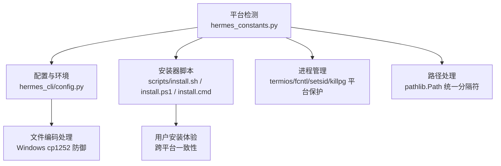
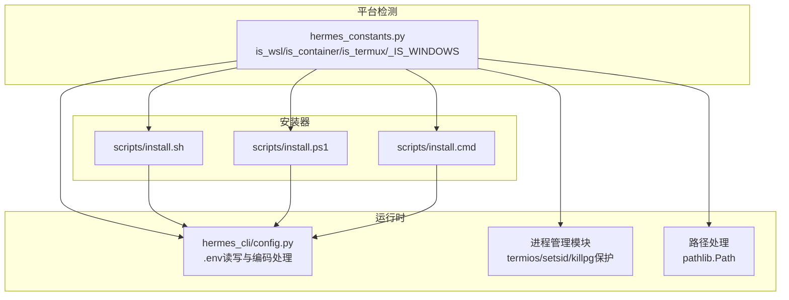
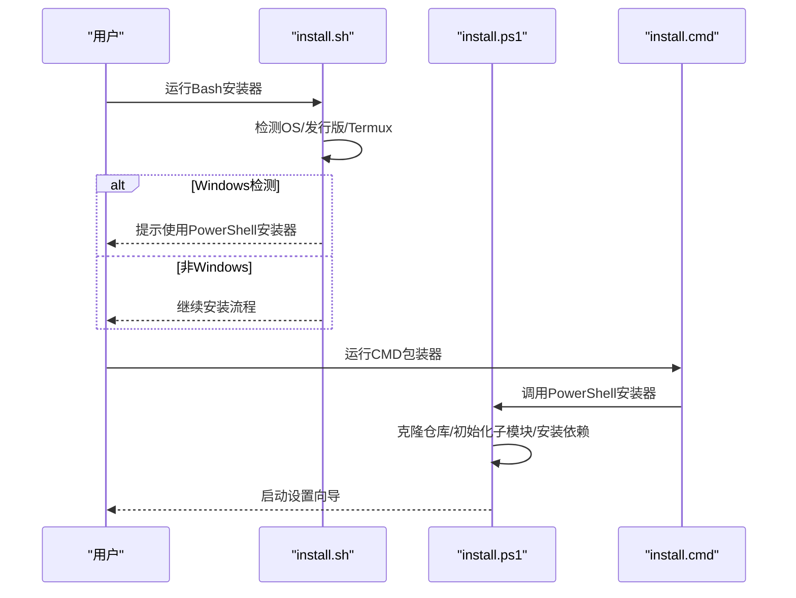
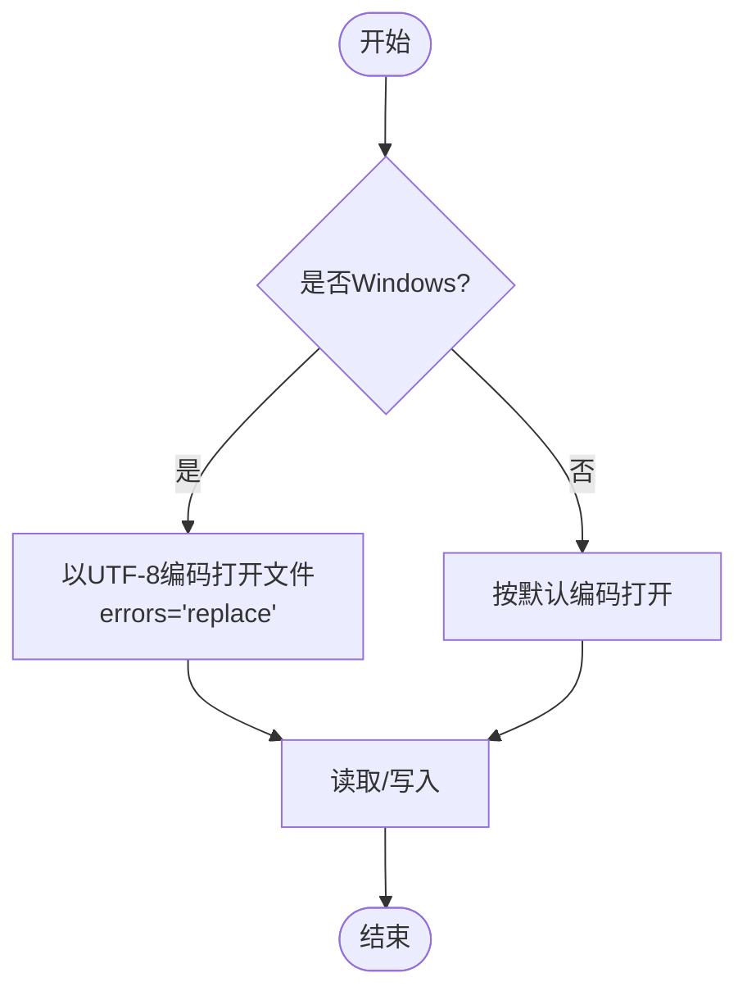
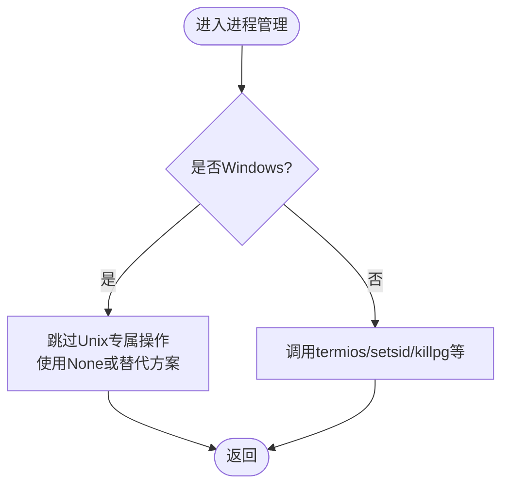
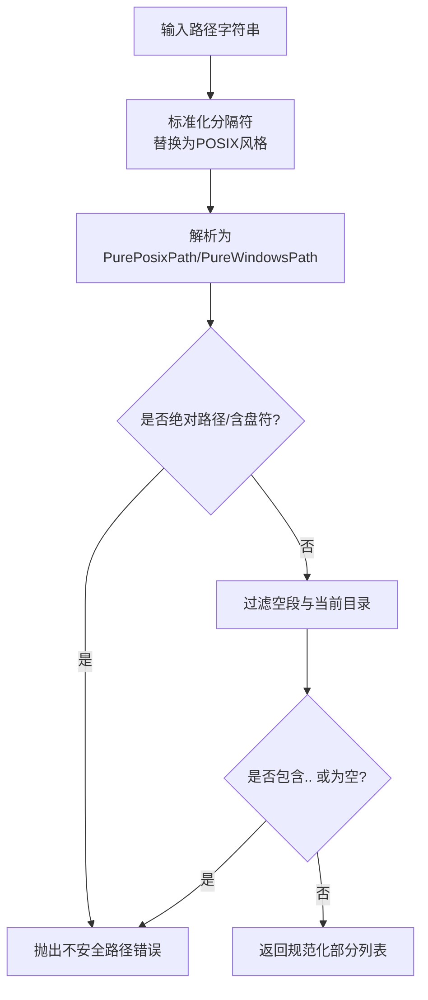
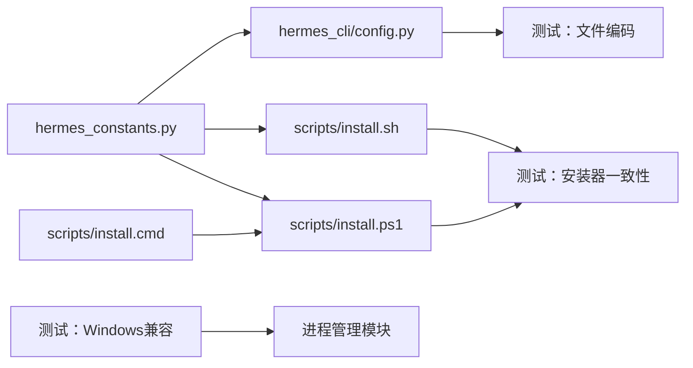

# 跨平台兼容性

<cite>
**本文引用的文件**
- [CONTRIBUTING.md](file://CONTRIBUTING.md)
- [website/docs/developer-guide/contributing.md](file://website/docs/developer-guide/contributing.md)
- [hermes_cli/config.py](file://hermes_cli/config.py)
- [hermes_constants.py](file://hermes_constants.py)
- [scripts/install.sh](file://scripts/install.sh)
- [scripts/install.ps1](file://scripts/install.ps1)
- [scripts/install.cmd](file://scripts/install.cmd)
- [tests/tools/test_windows_compat.py](file://tests/tools/test_windows_compat.py)
- [tests/tools/test_skill_view_path_check.py](file://tests/tools/test_skill_view_path_check.py)
- [tests/tools/test_skills_guard.py](file://tests/tools/test_skills_guard.py)
- [hermes_cli/commands.py](file://hermes_cli/commands.py)
- [hermes_cli/profiles.py](file://hermes_cli/profiles.py)
- [hermes_cli/clipboard.py](file://hermes_cli/clipboard.py)
- [cli.py](file://cli.py)
- [gateway/platforms/whatsapp.py](file://gateway/platforms/whatsapp.py)
- [tools/code_execution_tool.py](file://tools/code_execution_tool.py)
- [tools/environments/local.py](file://tools/environments/local.py)
- [tools/process_registry.py](file://tools/process_registry.py)
- [hermes_cli/curses_ui.py](file://hermes_cli/curses_ui.py)
- [hermes_cli/auth.py](file://hermes_cli/auth.py)
- [tools/memory_tool.py](file://tools/memory_tool.py)
- [tools/terminal_tool.py](file://tools/terminal_tool.py)
- [cron/scheduler.py](file://cron/scheduler.py)
</cite>

## 目录
1. [简介](#简介)
2. [项目结构](#项目结构)
3. [核心组件](#核心组件)
4. [架构总览](#架构总览)
5. [详细组件分析](#详细组件分析)
6. [依赖关系分析](#依赖关系分析)
7. [性能考量](#性能考量)
8. [故障排查指南](#故障排查指南)
9. [结论](#结论)
10. [附录](#附录)

## 简介
本指南面向Hermes Agent的跨平台开发，聚焦Linux、macOS与Windows（含WSL2）的兼容性规则与最佳实践。内容基于仓库中的平台检测、安装器脚本、文件编码处理、进程管理差异、路径分隔符使用等实际实现，提供可操作的规则、错误处理模式与图示化流程，帮助开发者在多平台上稳定运行。

## 项目结构
围绕跨平台兼容性，项目中与之直接相关的关键位置如下：
- 平台检测与常量：统一通过常量或函数判断平台环境（如是否Windows、WSL、容器、Termux）
- 安装器脚本：针对不同平台提供一致的安装体验（Bash/PowerShell/CMD）
- 文件编码处理：对Windows默认编码cp1252进行防御式处理
- 进程管理：对Unix专属的termios/fcntl与进程组操作进行平台保护
- 路径处理：统一使用pathlib.Path避免硬编码分隔符

**图表来源**
- [hermes_constants.py:161-220](file://hermes_constants.py#L161-L220)
- [hermes_cli/config.py:27-28](file://hermes_cli/config.py#L27-L28)
- [scripts/install.sh:154-189](file://scripts/install.sh#L154-L189)
- [scripts/install.ps1:1-919](file://scripts/install.ps1#L1-L919)
- [scripts/install.cmd:1-28](file://scripts/install.cmd#L1-L28)

**章节来源**
- [hermes_constants.py:161-220](file://hermes_constants.py#L161-L220)
- [hermes_cli/config.py:27-28](file://hermes_cli/config.py#L27-L28)
- [scripts/install.sh:154-189](file://scripts/install.sh#L154-L189)
- [scripts/install.ps1:1-919](file://scripts/install.ps1#L1-L919)
- [scripts/install.cmd:1-28](file://scripts/install.cmd#L1-L28)

## 核心组件
- 平台检测与常量
  - 使用常量或函数识别Windows、WSL、容器、Termux等环境，作为后续平台分支的基础
  - 示例：Windows检测常量、WSL检测、容器检测等
- 安装器脚本
  - Bash脚本用于Linux/macOS/Android/Termux；PowerShell脚本用于Windows；CMD包装器用于兼容
  - 安装流程包含依赖检查、仓库克隆/更新、子模块初始化、系统包安装、环境变量设置等
- 文件编码处理
  - 在Windows上显式指定UTF-8编码并使用“替换”策略，避免cp1252导致的Unicode解码错误
- 进程管理
  - 对termios/fcntl进行异常捕获；对Unix专属的os.setsid、os.killpg、信号处理进行平台保护
- 路径处理
  - 使用pathlib.Path替代字符串拼接，确保在Windows上的反斜杠与Unix风格路径的一致性

**章节来源**
- [hermes_constants.py:161-220](file://hermes_constants.py#L161-L220)
- [hermes_cli/config.py:2385-2584](file://hermes_cli/config.py#L2385-L2584)
- [scripts/install.sh:1-200](file://scripts/install.sh#L1-L200)
- [scripts/install.ps1:1-919](file://scripts/install.ps1#L1-L919)
- [scripts/install.cmd:1-28](file://scripts/install.cmd#L1-L28)
- [tests/tools/test_windows_compat.py:1-80](file://tests/tools/test_windows_compat.py#L1-L80)

## 架构总览
下图展示跨平台兼容性在系统中的关键交互点：平台检测驱动安装器与运行时行为，安装器负责环境准备，运行时通过配置模块处理文件编码与权限，进程管理模块对Unix特性进行保护，路径模块统一路径处理。

**图表来源**
- [hermes_constants.py:161-220](file://hermes_constants.py#L161-L220)
- [scripts/install.sh:154-189](file://scripts/install.sh#L154-L189)
- [scripts/install.ps1:1-919](file://scripts/install.ps1#L1-L919)
- [scripts/install.cmd:1-28](file://scripts/install.cmd#L1-L28)
- [hermes_cli/config.py:2385-2584](file://hermes_cli/config.py#L2385-L2584)

## 详细组件分析

### 平台检测与常量
- 关键点
  - 常量与函数用于区分Windows、WSL、容器、Termux等环境
  - 该信息用于决定后续行为（如是否启用某些Unix特性、如何处理文件权限等）
- 实践建议
  - 在新功能中优先使用统一的平台检测接口，避免直接依赖sys.platform或os.name
  - 将平台差异封装在常量或函数中，便于集中维护

**章节来源**
- [hermes_constants.py:161-220](file://hermes_constants.py#L161-L220)

### 安装器脚本的平台一致性
- 关键点
  - Bash脚本支持Linux、macOS与Android/Termux，自动检测系统类型并提示使用PowerShell安装器于Windows
  - PowerShell脚本负责仓库克隆、子模块初始化、系统包安装、环境变量设置、启动向导等
  - CMD包装器用于从命令行直接调用PowerShell安装器
- 最佳实践
  - 修改Bash脚本时，同步检查PowerShell脚本是否需要等价变更
  - 在PowerShell脚本中对Windows特有的行为（如git配置、权限、剪贴板）进行适配

**图表来源**
- [scripts/install.sh:154-189](file://scripts/install.sh#L154-L189)
- [scripts/install.ps1:1-919](file://scripts/install.ps1#L1-L919)
- [scripts/install.cmd:1-28](file://scripts/install.cmd#L1-L28)

**章节来源**
- [scripts/install.sh:154-189](file://scripts/install.sh#L154-L189)
- [scripts/install.ps1:1-919](file://scripts/install.ps1#L1-L919)
- [scripts/install.cmd:1-28](file://scripts/install.cmd#L1-L28)

### 文件编码问题（Windows的cp1252）
- 关键点
  - 在Windows上显式以UTF-8打开.env文件，并使用“替换”策略避免cp1252导致的Unicode解码错误
  - 写入时同样采用UTF-8编码，保证跨平台一致性
- 最佳实践
  - 所有文本文件读写均考虑平台默认编码差异，必要时显式指定编码
  - 对可能被外部工具修改的配置文件，增加容错与回退逻辑

**图表来源**
- [hermes_cli/config.py:2385-2584](file://hermes_cli/config.py#L2385-L2584)

**章节来源**
- [hermes_cli/config.py:2385-2584](file://hermes_cli/config.py#L2385-L2584)

### 进程管理差异（termios、fcntl、setsid、killpg、信号处理）
- 关键点
  - termios与fcntl为Unix专属，需捕获ImportError与NotImplementedError
  - os.setsid与os.killpg仅在非Windows平台可用，应通过平台检测进行保护
  - 测试用例验证了禁止无条件调用setsid与killpg，并要求每个受保护文件定义_IS_WINDOWS
- 最佳实践
  - 在调用Unix专属功能前，先进行平台检测或异常捕获
  - 对进程组操作（如setsid、killpg）使用条件分支，避免在Windows上执行

**图表来源**
- [hermes_cli/curses_ui.py:28-28](file://hermes_cli/curses_ui.py#L28-L28)
- [hermes_cli/auth.py:45-45](file://hermes_cli/auth.py#L45-L45)
- [tools/memory_tool.py:25-25](file://tools/memory_tool.py#L25-L25)
- [tools/terminal_tool.py:250-250](file://tools/terminal_tool.py#L250-L250)
- [tools/terminal_tool.py:270-270](file://tools/terminal_tool.py#L270-L270)
- [tests/tools/test_windows_compat.py:1-80](file://tests/tools/test_windows_compat.py#L1-L80)

**章节来源**
- [CONTRIBUTING.md:516-555](file://CONTRIBUTING.md#L516-L555)
- [website/docs/developer-guide/contributing.md:95-142](file://website/docs/developer-guide/contributing.md#L95-L142)
- [tests/tools/test_windows_compat.py:1-80](file://tests/tools/test_windows_compat.py#L1-L80)
- [hermes_cli/curses_ui.py:28-28](file://hermes_cli/curses_ui.py#L28-L28)
- [hermes_cli/auth.py:45-45](file://hermes_cli/auth.py#L45-L45)
- [tools/memory_tool.py:25-25](file://tools/memory_tool.py#L25-L25)
- [tools/terminal_tool.py:250-270](file://tools/terminal_tool.py#L250-L270)
- [cron/scheduler.py:20-20](file://cron/scheduler.py#L20-L20)

### 路径分隔符使用（推荐使用pathlib.Path）
- 关键点
  - 使用pathlib.Path替代字符串拼接与硬编码分隔符，避免在Windows上出现反斜杠问题
  - 测试用例强调使用Path.is_relative_to()而非startwith()，防止路径前缀混淆
- 最佳实践
  - 新增路径处理逻辑时，优先使用pathlib.Path.parts、joinpath等方法
  - 对归档提取等场景，先规范化路径并校验相对性，拒绝绝对路径与穿越

**图表来源**
- [hermes_cli/profiles.py:823-840](file://hermes_cli/profiles.py#L823-L840)
- [tests/tools/test_skill_view_path_check.py:13-18](file://tests/tools/test_skill_view_path_check.py#L13-L18)
- [tests/tools/test_skills_guard.py:462-486](file://tests/tools/test_skills_guard.py#L462-L486)

**章节来源**
- [hermes_cli/profiles.py:823-840](file://hermes_cli/profiles.py#L823-L840)
- [tests/tools/test_skill_view_path_check.py:1-38](file://tests/tools/test_skill_view_path_check.py#L1-L38)
- [tests/tools/test_skills_guard.py:454-486](file://tests/tools/test_skills_guard.py#L454-L486)

### 剪贴板与平台差异（Windows PowerShell）
- 关键点
  - Windows平台通过查找可用的PowerShell可执行文件来执行剪贴板相关命令
  - 对不可用或超时等情况进行降级处理
- 最佳实践
  - 在跨平台功能中，对平台特定工具进行探测与降级，避免阻塞主流程

**章节来源**
- [hermes_cli/clipboard.py:143-188](file://hermes_cli/clipboard.py#L143-L188)

### CLI与路径补全的平台差异
- 关键点
  - CLI路径补全逻辑对Windows路径进行兼容处理（例如反斜杠与正斜杠的混合）
  - 使用os.path.expanduser与os.path.dirname等标准库函数，避免硬编码分隔符
- 最佳实践
  - 在CLI层面对用户输入进行平台友好的展开与解析

**章节来源**
- [hermes_cli/commands.py:684-717](file://hermes_cli/commands.py#L684-L717)
- [cli.py:1109-1153](file://cli.py#L1109-L1153)

### 平台常量与进程管理的集成
- 关键点
  - 多个模块在创建子进程时根据平台常量选择是否启用setsid
  - 测试用例确保这些调用始终受平台保护
- 最佳实践
  - 在所有涉及进程组的操作中，统一通过平台常量进行条件控制

**章节来源**
- [gateway/platforms/whatsapp.py:25-25](file://gateway/platforms/whatsapp.py#L25-L25)
- [gateway/platforms/whatsapp.py:373-373](file://gateway/platforms/whatsapp.py#L373-L373)
- [tools/code_execution_tool.py:1036-1036](file://tools/code_execution_tool.py#L1036-L1036)
- [tools/environments/local.py:269-269](file://tools/environments/local.py#L269-L269)
- [tools/process_registry.py:374-374](file://tools/process_registry.py#L374-L374)
- [tests/tools/test_windows_compat.py:1-80](file://tests/tools/test_windows_compat.py#L1-L80)

## 依赖关系分析
- 平台检测依赖
  - hermes_constants.py提供统一的平台检测能力，被安装器与运行时模块广泛使用
- 安装器依赖
  - install.sh与install.ps1分别面向类Unix与Windows环境，install.cmd作为PowerShell安装器的入口包装
- 运行时依赖
  - hermes_cli/config.py依赖平台常量与系统环境，负责配置文件的读写与编码处理
- 测试依赖
  - test_windows_compat.py确保进程管理相关模块的平台保护生效
  - test_skill_view_path_check.py与test_skills_guard.py确保路径边界检查在多平台下正确

**图表来源**
- [hermes_constants.py:161-220](file://hermes_constants.py#L161-L220)
- [hermes_cli/config.py:2385-2584](file://hermes_cli/config.py#L2385-L2584)
- [scripts/install.sh:154-189](file://scripts/install.sh#L154-L189)
- [scripts/install.ps1:1-919](file://scripts/install.ps1#L1-L919)
- [scripts/install.cmd:1-28](file://scripts/install.cmd#L1-L28)
- [tests/tools/test_windows_compat.py:1-80](file://tests/tools/test_windows_compat.py#L1-L80)

**章节来源**
- [hermes_constants.py:161-220](file://hermes_constants.py#L161-L220)
- [hermes_cli/config.py:2385-2584](file://hermes_cli/config.py#L2385-L2584)
- [scripts/install.sh:154-189](file://scripts/install.sh#L154-L189)
- [scripts/install.ps1:1-919](file://scripts/install.ps1#L1-L919)
- [scripts/install.cmd:1-28](file://scripts/install.cmd#L1-L28)
- [tests/tools/test_windows_compat.py:1-80](file://tests/tools/test_windows_compat.py#L1-L80)

## 性能考量
- 平台检测开销极低，且多数为一次性判断，对整体性能影响可忽略
- 文件编码处理在Windows上增加一次编码尝试与回退，通常影响较小
- 进程管理的平台保护通过常量判断，避免不必要的导入与初始化
- 路径处理使用pathlib.Path，其性能与可读性在多平台下更优

## 故障排查指南
- 安装失败（Windows）
  - 现象：Bash安装器检测到Windows并提示使用PowerShell安装器
  - 排查：确认使用PowerShell安装器；检查网络与git配置（Windows原子写入参数）
  - 参考：[scripts/install.sh:174-180](file://scripts/install.sh#L174-L180)、[scripts/install.ps1:412-515](file://scripts/install.ps1#L412-L515)
- .env读取失败（Windows）
  - 现象：Unicode解码错误或OSError
  - 排查：确认使用UTF-8编码读写；检查文件是否被外部工具以cp1252保存
  - 参考：[hermes_cli/config.py:2385-2584](file://hermes_cli/config.py#L2385-L2584)
- 进程管理报错（Windows）
  - 现象：ImportError/NotImplementedError或无法找到setsid/killpg
  - 排查：确认已通过平台常量进行保护；避免无条件调用Unix专属函数
  - 参考：[tests/tools/test_windows_compat.py:1-80](file://tests/tools/test_windows_compat.py#L1-L80)
- 路径错误（Windows）
  - 现象：路径解析异常或路径穿越
  - 排查：使用pathlib.Path与is_relative_to；确保路径规范化与安全校验
  - 参考：[hermes_cli/profiles.py:823-840](file://hermes_cli/profiles.py#L823-L840)、[tests/tools/test_skill_view_path_check.py:1-38](file://tests/tools/test_skill_view_path_check.py#L1-L38)

**章节来源**
- [scripts/install.sh:174-180](file://scripts/install.sh#L174-L180)
- [scripts/install.ps1:412-515](file://scripts/install.ps1#L412-L515)
- [hermes_cli/config.py:2385-2584](file://hermes_cli/config.py#L2385-L2584)
- [tests/tools/test_windows_compat.py:1-80](file://tests/tools/test_windows_compat.py#L1-L80)
- [hermes_cli/profiles.py:823-840](file://hermes_cli/profiles.py#L823-L840)
- [tests/tools/test_skill_view_path_check.py:1-38](file://tests/tools/test_skill_view_path_check.py#L1-L38)

## 结论
Hermes Agent在跨平台兼容性方面采用了统一的平台检测、安装器一致性、文件编码防御、进程管理保护与路径抽象等策略。遵循本文提供的规则与最佳实践，可在Linux、macOS与Windows（含WSL2）上获得一致且稳定的开发与运行体验。

## 附录
- 快速清单
  - 使用hermes_constants.py提供的平台检测接口
  - 安装器脚本保持Bash与PowerShell同步更新
  - .env文件在Windows上使用UTF-8编码并启用错误替换
  - 进程管理对termios/setsid/killpg进行平台保护
  - 路径处理统一使用pathlib.Path并进行安全校验