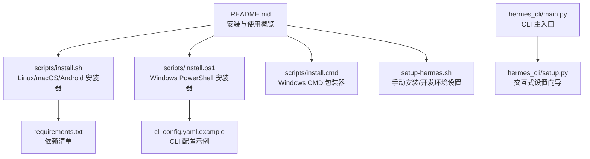
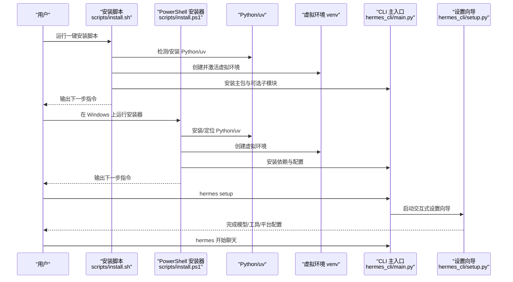
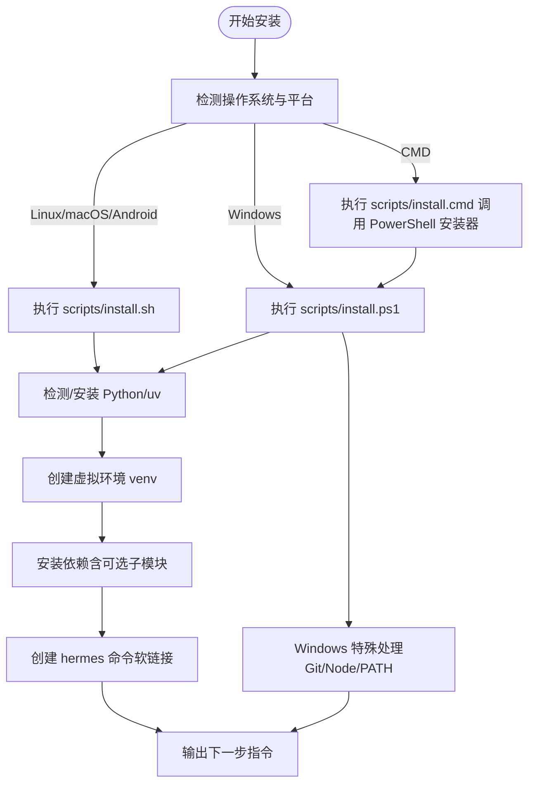
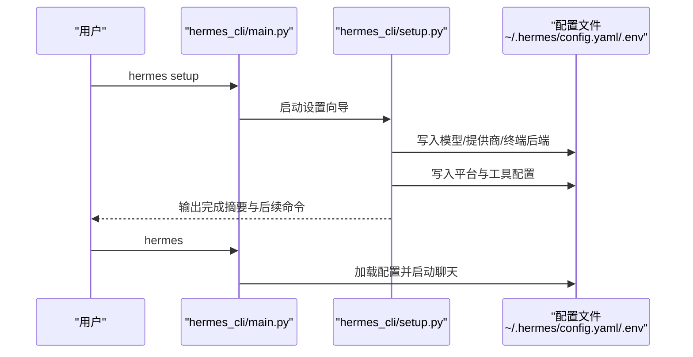
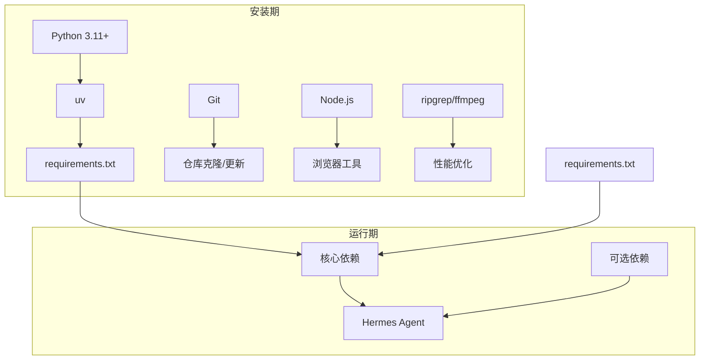

# 快速开始

<cite>
**本文引用的文件**
- [README.md](file://README.md)
- [scripts/install.sh](file://scripts/install.sh)
- [scripts/install.cmd](file://scripts/install.cmd)
- [scripts/install.ps1](file://scripts/install.ps1)
- [setup-hermes.sh](file://setup-hermes.sh)
- [requirements.txt](file://requirements.txt)
- [cli-config.yaml.example](file://cli-config.yaml.example)
- [hermes_cli/main.py](file://hermes_cli/main.py)
- [hermes_cli/setup.py](file://hermes_cli/setup.py)
</cite>

## 目录
1. [简介](#简介)
2. [项目结构](#项目结构)
3. [核心组件](#核心组件)
4. [架构总览](#架构总览)
5. [详细组件分析](#详细组件分析)
6. [依赖关系分析](#依赖关系分析)
7. [性能考虑](#性能考虑)
8. [故障排除指南](#故障排除指南)
9. [结论](#结论)
10. [附录](#附录)

## 简介
本指南面向首次接触 Hermes Agent 的用户，帮助你在 Linux、macOS、WSL2（Windows）与 Android Termux 平台上完成安装与首次运行，涵盖系统要求、前置条件检查、常见安装问题与解决方案，并提供完整的首次配置流程（模型选择、工具启用、网关启动等），以及基础 CLI 使用与常用交互技巧。

## 项目结构
Hermes Agent 提供统一的安装入口与 CLI 入口，支持多平台一键安装与交互式设置向导。核心安装脚本与文档位于仓库根目录，CLI 入口与交互逻辑集中在 hermes_cli 子模块中。

图示来源
- [README.md:1-179](file://README.md#L1-L179)
- [scripts/install.sh:1-800](file://scripts/install.sh#L1-L800)
- [scripts/install.ps1:1-800](file://scripts/install.ps1#L1-L800)
- [scripts/install.cmd:1-29](file://scripts/install.cmd#L1-L29)
- [setup-hermes.sh:1-400](file://setup-hermes.sh#L1-L400)
- [requirements.txt:1-37](file://requirements.txt#L1-L37)
- [cli-config.yaml.example:1-800](file://cli-config.yaml.example#L1-L800)
- [hermes_cli/main.py:1-800](file://hermes_cli/main.py#L1-L800)
- [hermes_cli/setup.py:1-800](file://hermes_cli/setup.py#L1-L800)

章节来源
- [README.md:30-63](file://README.md#L30-L63)
- [scripts/install.sh:1-800](file://scripts/install.sh#L1-L800)
- [scripts/install.ps1:1-800](file://scripts/install.ps1#L1-L800)
- [scripts/install.cmd:1-29](file://scripts/install.cmd#L1-L29)
- [setup-hermes.sh:1-400](file://setup-hermes.sh#L1-L400)
- [requirements.txt:1-37](file://requirements.txt#L1-L37)
- [cli-config.yaml.example:1-800](file://cli-config.yaml.example#L1-L800)
- [hermes_cli/main.py:1-800](file://hermes_cli/main.py#L1-L800)
- [hermes_cli/setup.py:1-800](file://hermes_cli/setup.py#L1-L800)

## 核心组件
- 安装器与平台适配
  - Linux/macOS/Android：使用统一安装脚本自动检测平台、安装依赖、创建虚拟环境并生成 hermes 命令软链接。
  - Windows：提供 PowerShell 安装器与 CMD 包装器，自动处理 uv、Python、Git、Node.js 与可选系统包。
- 交互式设置向导
  - 通过 hermes setup 引导完成模型/提供商选择、终端后端、代理设置、消息平台、工具配置等。
- CLI 主入口
  - hermes 命令进入交互式聊天界面；hermes gateway 启动消息网关；hermes doctor 检查配置与依赖。
- 配置系统
  - 使用 ~/.hermes/config.yaml 与 ~/.hermes/.env 管理模型、工具、平台与凭据；提供示例配置文件便于快速上手。

章节来源
- [README.md:30-63](file://README.md#L30-L63)
- [hermes_cli/main.py:1-800](file://hermes_cli/main.py#L1-L800)
- [hermes_cli/setup.py:1-800](file://hermes_cli/setup.py#L1-L800)
- [cli-config.yaml.example:1-800](file://cli-config.yaml.example#L1-L800)

## 架构总览
下图展示了从安装到首次运行的关键流程与组件交互。

图示来源
- [scripts/install.sh:1-800](file://scripts/install.sh#L1-L800)
- [scripts/install.ps1:1-800](file://scripts/install.ps1#L1-L800)
- [hermes_cli/main.py:1-800](file://hermes_cli/main.py#L1-L800)
- [hermes_cli/setup.py:1-800](file://hermes_cli/setup.py#L1-L800)

## 详细组件分析

### 安装与平台支持
- Linux/macOS/Android（Termux）
  - 使用 curl 一键安装脚本，自动检测平台、安装 uv/Python/Git/Node.js，创建虚拟环境，安装依赖，生成 hermes 命令软链接。
  - Android/Termux 使用 Python 标准库 venv 与 pip 替代 uv，按需安装约束依赖集。
- Windows（WSL2/Windows）
  - PowerShell 安装器负责 uv、Python、Git、Node.js 检测与安装，Windows 特别处理 Git 兼容性与 ZIP 下载回退。
  - CMD 包装器用于在 CMD 中调用 PowerShell 安装器。
- 手动安装（开发者/离线）
  - setup-hermes.sh 支持手动克隆仓库后的本地安装，自动探测 Termux 并选择合适的安装路径与依赖集。

图示来源
- [scripts/install.sh:1-800](file://scripts/install.sh#L1-L800)
- [scripts/install.ps1:1-800](file://scripts/install.ps1#L1-L800)
- [scripts/install.cmd:1-29](file://scripts/install.cmd#L1-L29)
- [setup-hermes.sh:1-400](file://setup-hermes.sh#L1-L400)

章节来源
- [README.md:30-47](file://README.md#L30-L47)
- [scripts/install.sh:1-800](file://scripts/install.sh#L1-L800)
- [scripts/install.ps1:1-800](file://scripts/install.ps1#L1-L800)
- [scripts/install.cmd:1-29](file://scripts/install.cmd#L1-L29)
- [setup-hermes.sh:1-400](file://setup-hermes.sh#L1-L400)

### 首次运行与设置向导
- 首次运行前的前置条件
  - 已安装 Python 3.11+、Git、可选 ripgrep/ffmpeg（搜索与语音）、Node.js（浏览器工具）。
  - 安装器会尝试自动安装缺失的系统包或提示手动安装。
- 交互式设置向导（hermes setup）
  - 模型与提供商：选择主推理提供商与默认模型，支持自定义端点。
  - 终端后端：选择本地/SSH/Docker/Singularity/Modal/Daytona 等执行后端。
  - 代理与网络：可配置 IPv4 优先等网络选项。
  - 消息平台：连接 Telegram、Discord、Slack、WhatsApp、Signal 等。
  - 工具：启用/禁用网络搜索、浏览器自动化、图像生成、TTS、任务计划等工具。
- 首次运行
  - 若未配置任何提供商，CLI 将引导你运行 hermes setup。
  - 完成设置后，直接运行 hermes 即可进入交互式聊天。

图示来源
- [hermes_cli/main.py:1-800](file://hermes_cli/main.py#L1-L800)
- [hermes_cli/setup.py:1-800](file://hermes_cli/setup.py#L1-L800)
- [cli-config.yaml.example:1-800](file://cli-config.yaml.example#L1-L800)

章节来源
- [hermes_cli/main.py:676-784](file://hermes_cli/main.py#L676-L784)
- [hermes_cli/setup.py:1-800](file://hermes_cli/setup.py#L1-L800)
- [cli-config.yaml.example:1-800](file://cli-config.yaml.example#L1-L800)

### CLI 使用与常用交互
- 基础命令
  - hermes：交互式聊天（默认）。
  - hermes model：选择推理提供商与模型。
  - hermes tools：配置可用工具集合。
  - hermes config set：设置单个配置项。
  - hermes gateway：前台运行消息网关。
  - hermes setup：完整设置向导。
  - hermes update：更新到最新版本。
  - hermes doctor：诊断配置与依赖问题。
- 常用快捷操作
  - /new 或 /reset：开始全新会话。
  - /model [provider:model]：切换模型。
  - /personality [name]：应用预设个性。
  - /retry、/undo：重试或撤销上一轮。
  - /compress、/usage、/insights [--days N]：压缩上下文、查看用量与洞察。
  - /skills 或 /<技能名>：浏览与调用技能。
  - Ctrl+C 或发送新消息：中断当前工作。
  - /platforms 或 /status、/sethome：平台状态与设置。

章节来源
- [README.md:51-83](file://README.md#L51-L83)
- [hermes_cli/main.py:1-800](file://hermes_cli/main.py#L1-L800)

### 配置系统与示例
- 配置位置
  - 用户配置：~/.hermes/config.yaml（CLI 行为、模型、工具、平台等）。
  - 凭据与密钥：~/.hermes/.env（API Key、令牌等）。
- 示例配置
  - cli-config.yaml.example 提供了模型、终端后端、工具集、平台工具集、MCP、STT、显示等完整示例，可复制为 config.yaml 并按需修改。
- 关键配置要点
  - 模型与提供商：支持 OpenRouter、Nous Portal、Anthropic、OpenAI、Gemini、z.ai、Kimi、MiniMax、Hugging Face、自定义端点等。
  - 终端后端：本地、SSH、Docker、Singularity、Modal、Daytona 等，可配置资源限制与持久化。
  - 工具集：按平台组合 web、terminal、file、browser、vision、image_gen、skills、moa、todo、tts、cronjob 等。
  - MCP：连接外部 MCP 服务器以扩展工具生态。
  - STT：语音转文字，支持本地、Groq、OpenAI、Mistral。

章节来源
- [cli-config.yaml.example:1-800](file://cli-config.yaml.example#L1-L800)
- [requirements.txt:1-37](file://requirements.txt#L1-L37)

## 依赖关系分析
- 安装期依赖
  - Python 3.11+：由 uv 或系统 Python 提供。
  - uv：加速 Python 包管理与虚拟环境创建。
  - Git：仓库克隆与更新。
  - Node.js：浏览器工具链（可选）。
  - 可选系统包：ripgrep（更快文件搜索）、ffmpeg（TTS 语音）。
- 运行期依赖
  - 核心：openai、httpx、rich、tenacity、prompt_toolkit、pyyaml、requests、jinja2、pydantic、PyJWT、debugpy 等。
  - 可选：python-telegram-bot、discord.py、aiohttp、croniter、edge-tts、fal-client 等。

图示来源
- [requirements.txt:1-37](file://requirements.txt#L1-L37)
- [scripts/install.sh:1-800](file://scripts/install.sh#L1-L800)
- [scripts/install.ps1:1-800](file://scripts/install.ps1#L1-L800)

章节来源
- [requirements.txt:1-37](file://requirements.txt#L1-L37)
- [scripts/install.sh:1-800](file://scripts/install.sh#L1-L800)
- [scripts/install.ps1:1-800](file://scripts/install.ps1#L1-L800)

## 性能考虑
- 文件搜索与索引
  - 推荐安装 ripgrep 以提升文件搜索性能；若不可用，系统将回退到 grep。
- 语音与媒体
  - ffmpeg 对 TTS 语音消息功能至关重要；若缺失，相关功能受限。
- 模型与上下文
  - 合理配置模型上下文长度与输出上限，避免过长历史导致超限与压缩开销。
  - 使用自动上下文压缩策略，在接近阈值时对中间轮次进行摘要压缩，保留最近尾部上下文。

章节来源
- [scripts/install.sh:484-655](file://scripts/install.sh#L484-L655)
- [cli-config.yaml.example:275-321](file://cli-config.yaml.example#L275-L321)

## 故障排除指南
- 无法找到 hermes 命令
  - Linux/macOS：确认 ~/.local/bin 已加入 PATH；重新加载 shell 配置后重试。
  - Windows：确保安装器已将 venv Scripts 目录加入用户 PATH，并重启终端。
  - Android/Termux：确认已创建软链接并添加到 PATH。
- Python 版本不匹配
  - 安装器会自动安装/定位 Python 3.11；若失败，请手动安装 Python 3.11 并重试。
- Git 克隆失败（Windows）
  - 安装器已内置 Git 兼容性修复与 ZIP 回退方案；若仍失败，请检查网络与防火墙。
- Node.js 缺失（浏览器工具）
  - 安装器会尝试自动安装 Node.js；若失败，请参考安装器提示手动安装。
- 权限与容器后端
  - Docker/Podman/Singularity 等容器后端可能需要 sudo 或用户组权限；安装器会提示如何授予免密 sudo。
- 无交互终端
  - 首次运行若检测到非交互终端，CLI 会提示使用 hermes setup 在交互式终端中运行。

章节来源
- [scripts/install.sh:194-346](file://scripts/install.sh#L194-L346)
- [scripts/install.ps1:194-287](file://scripts/install.ps1#L194-L287)
- [hermes_cli/main.py:543-648](file://hermes_cli/main.py#L543-L648)

## 结论
通过本快速开始指南，你可以在 Linux、macOS、WSL2 与 Android Termux 上完成 Hermes Agent 的安装与首次运行。建议先运行安装器并完成 hermes setup 设置向导，随后即可使用 hermes 进行交互式聊天，并根据需要启用工具、配置消息平台与网关。遇到问题时，可使用 hermes doctor 进行诊断，或参考本指南的故障排除部分。

## 附录
- 常用命令速查
  - hermes：交互式聊天
  - hermes model：选择模型与提供商
  - hermes tools：配置工具集合
  - hermes config set：设置配置项
  - hermes gateway：启动消息网关
  - hermes setup：完整设置向导
  - hermes update：更新版本
  - hermes doctor：诊断问题
- 配置文件位置
  - ~/.hermes/config.yaml：CLI 行为与功能配置
  - ~/.hermes/.env：API Key 与敏感信息
  - 可参考 cli-config.yaml.example 获取配置项示例

章节来源
- [README.md:51-63](file://README.md#L51-L63)
- [cli-config.yaml.example:1-800](file://cli-config.yaml.example#L1-L800)