# 性能优化

<cite>
**本文引用的文件**
- [agent/context_compressor.py](file://agent/context_compressor.py)
- [agent/context_engine.py](file://agent/context_engine.py)
- [agent/smart_model_routing.py](file://agent/smart_model_routing.py)
- [agent/rate_limit_tracker.py](file://agent/rate_limit_tracker.py)
- [agent/prompt_caching.py](file://agent/prompt_caching.py)
- [agent/usage_pricing.py](file://agent/usage_pricing.py)
- [agent/memory_manager.py](file://agent/memory_manager.py)
- [agent/model_metadata.py](file://agent/model_metadata.py)
- [agent/retry_utils.py](file://agent/retry_utils.py)
- [agent/auxiliary_client.py](file://agent/auxiliary_client.py)
- [run_agent.py](file://run_agent.py)
- [hermes_constants.py](file://hermes_constants.py)
- [pyproject.toml](file://pyproject.toml)
- [requirements.txt](file://requirements.txt)
</cite>

## 目录
1. [简介](#简介)
2. [项目结构](#项目结构)
3. [核心组件](#核心组件)
4. [架构总览](#架构总览)
5. [详细组件分析](#详细组件分析)
6. [依赖分析](#依赖分析)
7. [性能考量与优化建议](#性能考量与优化建议)
8. [故障排查指南](#故障排查指南)
9. [结论](#结论)
10. [附录：测试与容量规划](#附录测试与容量规划)

## 简介
本指南面向系统管理员与性能工程师，围绕 Hermes Agent 的性能优化进行深入解析，覆盖上下文优化（压缩与保护）、工具执行优化、内存管理、网络优化、智能模型路由、速率限制跟踪、提示缓存、用量统计与计费追踪、成本控制、性能监控与瓶颈分析、以及大规模部署的扩展策略。文档以代码为依据，提供可操作的优化建议与实践路径。

## 项目结构
Hermes Agent 将性能相关能力模块化到 agent/ 子包中，并在 run_agent.py 中统一编排。关键模块包括：
- 上下文引擎与压缩：context_engine、context_compressor
- 模型元数据与探测：model_metadata
- 智能路由：smart_model_routing
- 速率限制跟踪：rate_limit_tracker
- 提示缓存：prompt_caching
- 计费与用量：usage_pricing
- 内存管理：memory_manager
- 辅助客户端与重试：auxiliary_client、retry_utils
- 运行时常量与网络偏好：hermes_constants

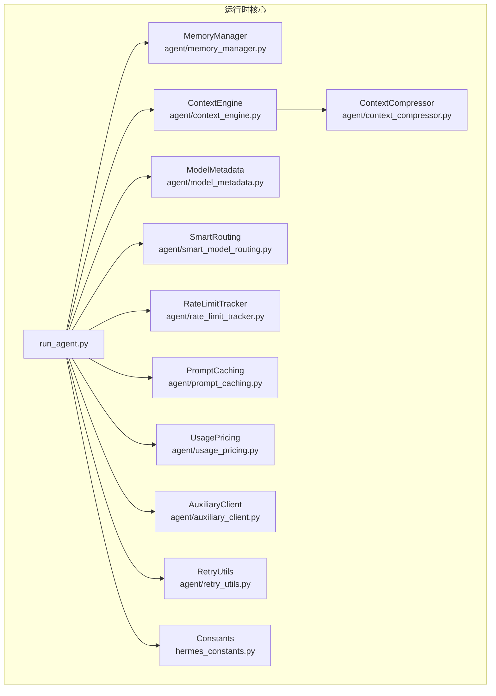

图示来源
- [run_agent.py:1-200](file://run_agent.py#L1-L200)
- [agent/context_engine.py:1-185](file://agent/context_engine.py#L1-L185)
- [agent/context_compressor.py:1-821](file://agent/context_compressor.py#L1-L821)
- [agent/model_metadata.py:1-1086](file://agent/model_metadata.py#L1-L1086)
- [agent/smart_model_routing.py:1-196](file://agent/smart_model_routing.py#L1-L196)
- [agent/rate_limit_tracker.py:1-247](file://agent/rate_limit_tracker.py#L1-L247)
- [agent/prompt_caching.py:1-73](file://agent/prompt_caching.py#L1-L73)
- [agent/usage_pricing.py:1-633](file://agent/usage_pricing.py#L1-L633)
- [agent/memory_manager.py:1-363](file://agent/memory_manager.py#L1-L363)
- [agent/auxiliary_client.py:1-2614](file://agent/auxiliary_client.py#L1-L2614)
- [agent/retry_utils.py:1-58](file://agent/retry_utils.py#L1-L58)
- [hermes_constants.py:1-301](file://hermes_constants.py#L1-L301)

章节来源
- [run_agent.py:1-200](file://run_agent.py#L1-L200)

## 核心组件
- 上下文引擎与压缩：通过 ContextEngine 抽象与 ContextCompressor 实现“昂贵摘要 + 尾部保护 + 工具结果预裁剪”的多阶段压缩，降低长上下文带来的 token 压力。
- 模型元数据与探测：提供模型上下文长度探测、默认回退、本地服务器识别与缓存，避免反复探测造成的延迟。
- 智能模型路由：基于消息特征选择“便宜模型”作为辅助路由，减少主模型负载。
- 速率限制跟踪：解析 x-ratelimit-* 头，格式化显示与紧凑状态，便于实时监控。
- 提示缓存：针对 Anthropic 的 system_and_3 策略注入 cache_control 断点，显著降低输入 token 成本。
- 计费与用量：标准化不同提供商的 usage 形态，计算成本与请求次数，支持订阅包含场景。
- 内存管理：统一注册与调度多个记忆提供者，异步预取与同步写入，避免单点阻塞。
- 辅助客户端与重试：自动链路解析与支付耗尽回退；抖动退避防止并发风暴。

章节来源
- [agent/context_engine.py:1-185](file://agent/context_engine.py#L1-L185)
- [agent/context_compressor.py:1-821](file://agent/context_compressor.py#L1-L821)
- [agent/model_metadata.py:1-1086](file://agent/model_metadata.py#L1-L1086)
- [agent/smart_model_routing.py:1-196](file://agent/smart_model_routing.py#L1-L196)
- [agent/rate_limit_tracker.py:1-247](file://agent/rate_limit_tracker.py#L1-L247)
- [agent/prompt_caching.py:1-73](file://agent/prompt_caching.py#L1-L73)
- [agent/usage_pricing.py:1-633](file://agent/usage_pricing.py#L1-L633)
- [agent/memory_manager.py:1-363](file://agent/memory_manager.py#L1-L363)
- [agent/auxiliary_client.py:1-2614](file://agent/auxiliary_client.py#L1-L2614)
- [agent/retry_utils.py:1-58](file://agent/retry_utils.py#L1-L58)

## 架构总览
Hermes Agent 的性能优化围绕“预处理（路由/缓存）—推理（主模型/辅助模型）—后处理（压缩/计费）”闭环展开。运行时通过 run_agent.py 统一调度，各子系统解耦协作。

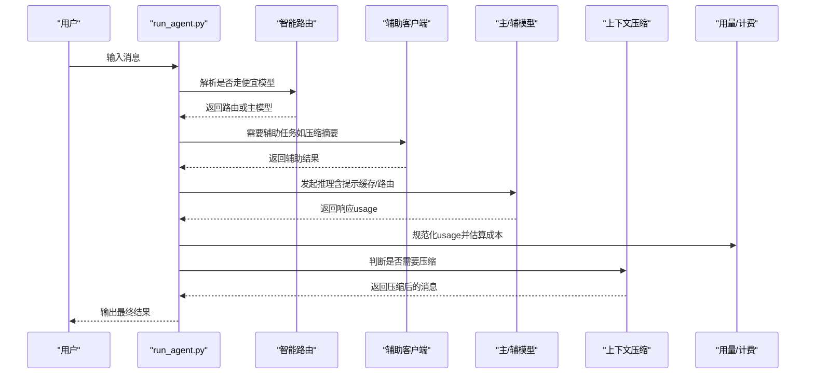

图示来源
- [run_agent.py:1-200](file://run_agent.py#L1-L200)
- [agent/smart_model_routing.py:110-196](file://agent/smart_model_routing.py#L110-L196)
- [agent/auxiliary_client.py:1-2614](file://agent/auxiliary_client.py#L1-L2614)
- [agent/context_compressor.py:666-821](file://agent/context_compressor.py#L666-L821)
- [agent/usage_pricing.py:420-558](file://agent/usage_pricing.py#L420-L558)

## 详细组件分析

### 上下文优化：压缩、保护与预裁剪
- 预裁剪旧工具结果：在不触发 LLM 的前提下，移除过旧工具输出，节省 token。
- 头尾保护：保留系统提示与最近若干条消息，确保关键上下文不丢失。
- 结构化摘要：采用模板化结构（目标、进展、决策、已解决/待解决问题、文件、剩余工作等），并支持迭代更新。
- 工具对齐与消毒：修复压缩后残留的孤儿工具调用/结果配对，保证 API 合法性。
- 动态尾部预算：按阈值比例动态分配尾部预算，避免固定消息数导致的不灵活。

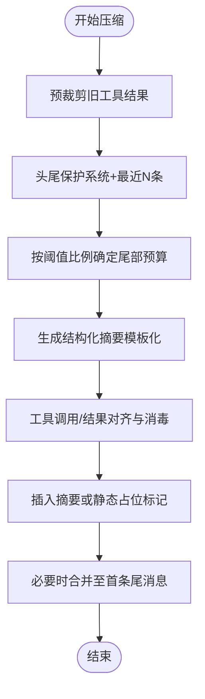

图示来源
- [agent/context_compressor.py:186-800](file://agent/context_compressor.py#L186-L800)
- [agent/context_engine.py:32-185](file://agent/context_engine.py#L32-L185)

章节来源
- [agent/context_compressor.py:1-821](file://agent/context_compressor.py#L1-L821)
- [agent/context_engine.py:1-185](file://agent/context_engine.py#L1-L185)

### 智能模型路由：简单任务走便宜模型
- 路由判定：基于字符数、词数、换行数、代码块、URL、复杂关键词集合等保守规则，仅在“简单对话”时切换到便宜模型。
- 运行时解析：从凭证池解析目标 provider 的运行时参数，失败则回退到主模型。
- 标签与签名：返回带标签与签名的路由信息，便于可观测与一致性校验。

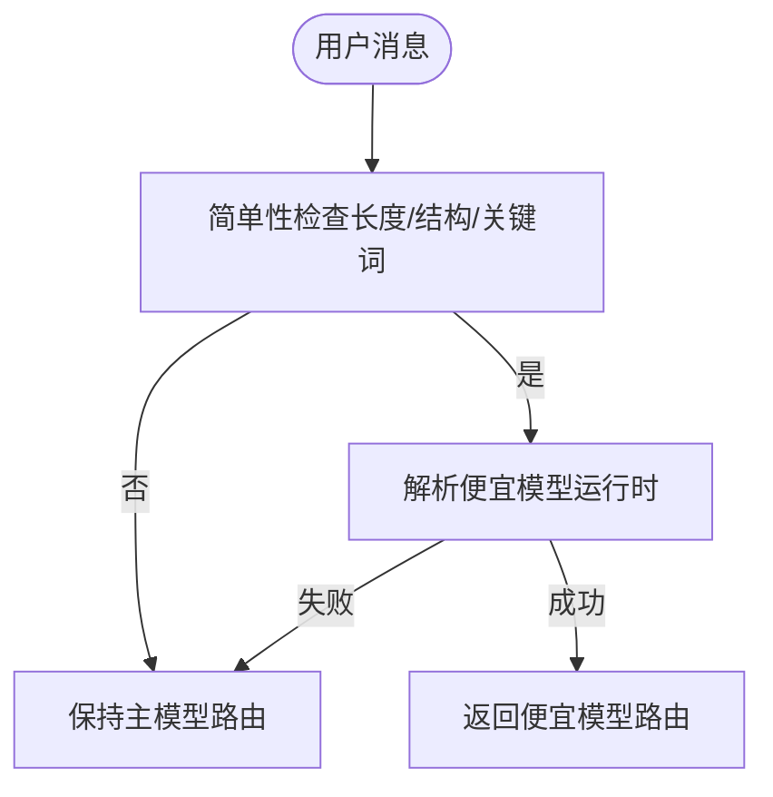

图示来源
- [agent/smart_model_routing.py:62-196](file://agent/smart_model_routing.py#L62-L196)

章节来源
- [agent/smart_model_routing.py:1-196](file://agent/smart_model_routing.py#L1-L196)

### 速率限制跟踪：x-ratelimit-* 头解析与展示
- 解析：从响应头提取请求/令牌的分钟/小时窗口限额、剩余量与重置时间。
- 展示：提供终端友好与紧凑两种格式，标注使用百分比与剩余时间，超过阈值给出警告。
- 年龄与新鲜度：记录捕获时间，用于评估数据时效。

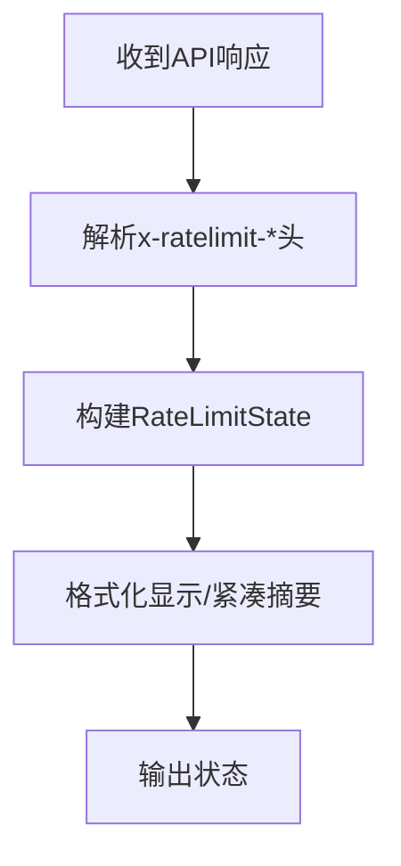

图示来源
- [agent/rate_limit_tracker.py:92-247](file://agent/rate_limit_tracker.py#L92-L247)

章节来源
- [agent/rate_limit_tracker.py:1-247](file://agent/rate_limit_tracker.py#L1-L247)

### 提示缓存：Anthropic system_and_3 策略
- 断点注入：在系统提示与最近三条非系统消息处注入 cache_control 标记，最大化复用。
- TTL 支持：支持短 TTL（默认 5 分钟）与 1 小时 TTL。
- 兼容性：适配工具消息与内容数组/字符串的不同形态。

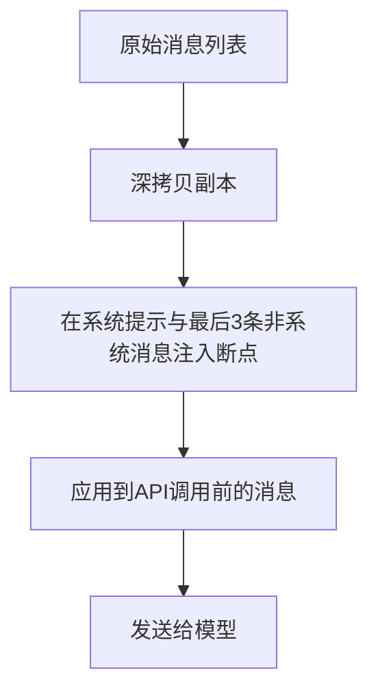

图示来源
- [agent/prompt_caching.py:41-73](file://agent/prompt_caching.py#L41-L73)

章节来源
- [agent/prompt_caching.py:1-73](file://agent/prompt_caching.py#L1-L73)

### 用量统计与计费追踪：跨提供商归一化
- 归一化：兼容 Anthropic、Codex Responses、OpenAI Chat Completions 的 usage 形态，分离缓存 token。
- 成本估算：按输入/输出/缓存读写/写入/请求计费项计算 USD 成本，支持订阅包含场景。
- 已知定价查询：内置官方文档快照与动态拉取，支持未知路由降级。

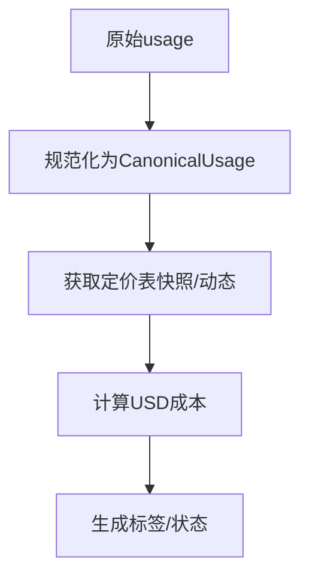

图示来源
- [agent/usage_pricing.py:420-558](file://agent/usage_pricing.py#L420-L558)

章节来源
- [agent/usage_pricing.py:1-633](file://agent/usage_pricing.py#L1-L633)

### 内存管理：多提供者协调与异步预取
- 注册约束：内置提供者优先，最多允许一个外部提供者，冲突时告警。
- 异步预取：在当前轮次结束后队列下一轮的预取，避免阻塞主流程。
- 同步写入：回合结束后同步写入，保障一致性。
- 工具路由：按工具名路由到对应提供者，失败时统一错误包装。

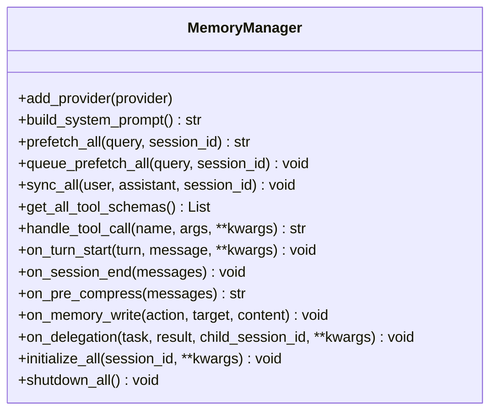

图示来源
- [agent/memory_manager.py:72-363](file://agent/memory_manager.py#L72-L363)

章节来源
- [agent/memory_manager.py:1-363](file://agent/memory_manager.py#L1-L363)

### 模型元数据与探测：上下文长度与本地服务器识别
- 探测层级：从已知默认到 OpenRouter 拉取，再到本地服务器探测，最后回退到安全默认。
- 缓存与持久化：内存缓存与磁盘缓存结合，减少重复探测。
- 本地识别：通过端点探测识别 Ollama/LM Studio/llama.cpp/vLLM，提升本地体验。
- 错误解析：从错误文本中提取上下文上限与可用输出 token，辅助自适应调参。

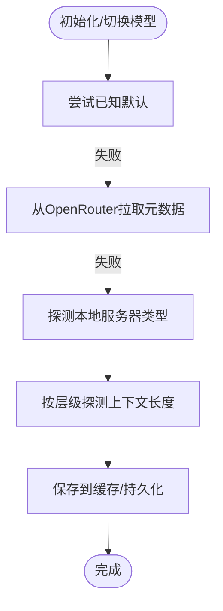

图示来源
- [agent/model_metadata.py:427-679](file://agent/model_metadata.py#L427-L679)

章节来源
- [agent/model_metadata.py:1-1086](file://agent/model_metadata.py#L1-L1086)

### 辅助客户端与重试：自动链路与抖动退避
- 自动链路：OpenRouter → Nous Portal → 自定义端点 → Codex OAuth → 原生 Anthropic → 直连 API Key → 回退。
- 支付耗尽回退：当返回 HTTP 402 或信用相关错误时，自动切换到下一个可用提供者。
- 抖动退避：指数退避 + 随机抖动，避免并发重试风暴。

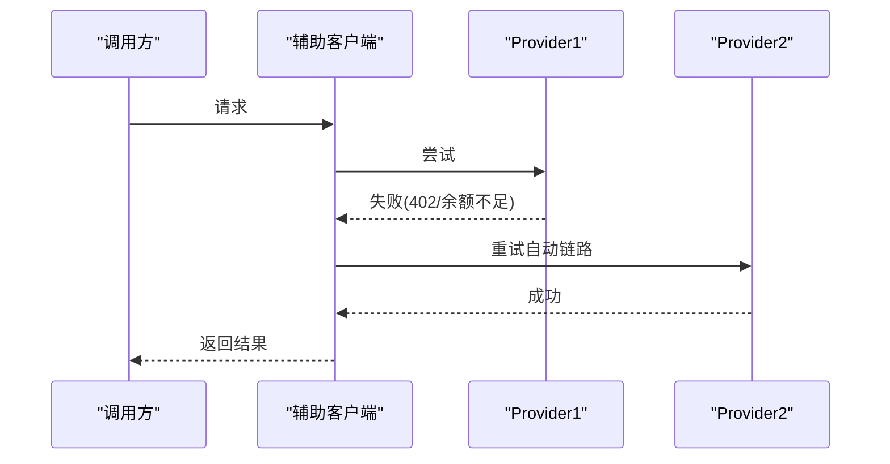

图示来源
- [agent/auxiliary_client.py:782-800](file://agent/auxiliary_client.py#L782-L800)
- [agent/retry_utils.py:19-58](file://agent/retry_utils.py#L19-L58)

章节来源
- [agent/auxiliary_client.py:1-2614](file://agent/auxiliary_client.py#L1-L2614)
- [agent/retry_utils.py:1-58](file://agent/retry_utils.py#L1-L58)

## 依赖分析
- 运行时依赖：OpenAI、Anthropic、httpx、requests、pydantic、rich、tenacity 等，均在 pyproject.toml 中明确版本范围，降低供应链风险。
- 可选依赖：消息平台、语音、矩阵、Mistral 等，按需安装，避免不必要的体积与依赖冲突。
- 网络与容器感知：提供 IPv4 优先策略，容器/WSL 环境检测，便于在受限网络与容器中稳定运行。

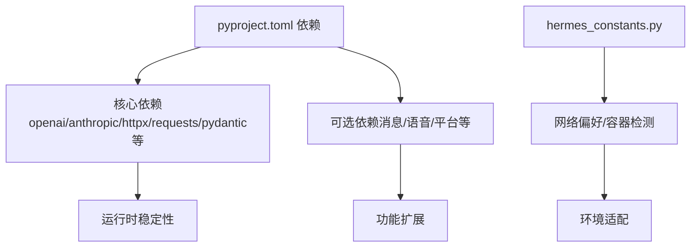

图示来源
- [pyproject.toml:13-129](file://pyproject.toml#L13-L129)
- [requirements.txt:1-37](file://requirements.txt#L1-37)
- [hermes_constants.py:250-301](file://hermes_constants.py#L250-L301)

章节来源
- [pyproject.toml:1-129](file://pyproject.toml#L1-L129)
- [requirements.txt:1-37](file://requirements.txt#L1-L37)
- [hermes_constants.py:1-301](file://hermes_constants.py#L1-L301)

## 性能考量与优化建议

### 上下文优化
- 合理设置阈值与尾部预算：根据模型上下文长度与业务对话节奏调整阈值百分比与尾部预算，避免过度压缩或保护不足。
- 预裁剪策略：确保工具输出体量大且历史较久时启用预裁剪，减少摘要负担。
- 结构化摘要模板：保持模板稳定，避免频繁变更导致摘要质量波动。
- 工具对齐：定期检查工具调用/结果配对完整性，避免压缩后 API 报错。

### 工具执行优化
- 使用智能路由：对简单问题走便宜模型，降低主模型压力与成本。
- 异步预取：利用 MemoryManager 的队列预取，减少下一轮等待。
- 工具批量化：在可行场景合并工具调用，减少往返次数。

### 内存管理
- 控制外部提供者数量：仅保留一个外部提供者，避免冲突与额外开销。
- 合理的同步频率：在回合结束时同步，避免过于频繁的 IO。
- 工具路由去重：确保工具名唯一，避免重复注册导致的调度开销。

### 网络优化
- IPv4 优先：在网络环境不稳定时启用 force_ipv4，减少 AAAA 查询延迟。
- 容器/WSL 适配：在容器内使用合适的 DNS 与网络配置，避免连接超时。
- 代理与 SOCKS：httpx 的 socks 支持可用于特定网络环境下的加速与隐私。

### 智能模型路由
- 路由开关与阈值：谨慎开启 cheap-model 路由，合理设置字符/词数/行数阈值，避免误判。
- 凭证池解析：确保便宜模型的运行时参数正确解析，失败时快速回退。

### 速率限制跟踪
- 监控策略：将速率限制状态集成到仪表盘或日志，设置阈值告警。
- 自适应退避：结合 jittered_backoff 与速率限制状态，动态调整重试策略。

### 提示缓存
- Anthropic 策略：在多轮对话中启用 system_and_3，显著降低输入 token 成本。
- TTL 策略：根据会话活跃度选择 5 分钟或 1 小时 TTL，平衡成本与新鲜度。

### 用量统计与计费追踪
- 规范化 usage：确保所有提供商的 usage 形态被正确规范化，避免漏计。
- 成本估算：定期核对估算成本与实际账单，修正定价表与模型映射。
- 订阅包含：对订阅包含场景（如某些 provider）直接标记为 included，减少计算。

### 性能监控与瓶颈分析
- 关键指标：prompt_tokens、completion_tokens、cost、压缩次数、预取命中率、工具执行时延。
- 观测手段：结合速率限制状态、成本标签、压缩前后对比、工具执行日志。
- 瓶颈定位：若压缩频繁触发，检查阈值与尾部预算；若成本偏高，检查路由与缓存策略。

### 大规模部署的扩展策略
- 连接池与并发：合理配置 httpx/requests 的连接池大小，避免连接耗尽。
- 负载均衡：对 OpenRouter/Nous 等外部服务进行多入口与健康检查。
- 缓存与持久化：充分利用模型元数据缓存与上下文长度缓存，减少重复探测。
- 容器化与资源限制：在容器中设置 CPU/内存限制与探针，确保稳定性。

## 故障排查指南
- 上下文压缩失败：检查摘要冷却时间、模型可用性与摘要模板稳定性；必要时启用静态占位标记。
- 速率限制告警：查看紧凑状态中的剩余量与重置时间，调整请求节流或升级配额。
- 计费异常：确认 usage 归一化逻辑与定价表是否匹配；对未知路由进行降级处理。
- 辅助客户端回退：确认链路顺序与凭证有效性；检查支付耗尽回退逻辑是否生效。
- 网络超时：启用 force_ipv4，检查代理与 DNS 设置；在容器中验证网络可达性。

章节来源
- [agent/context_compressor.py:336-484](file://agent/context_compressor.py#L336-L484)
- [agent/rate_limit_tracker.py:182-247](file://agent/rate_limit_tracker.py#L182-L247)
- [agent/usage_pricing.py:481-558](file://agent/usage_pricing.py#L481-L558)
- [agent/auxiliary_client.py:782-800](file://agent/auxiliary_client.py#L782-L800)
- [hermes_constants.py:250-301](file://hermes_constants.py#L250-L301)

## 结论
Hermes Agent 在上下文压缩、智能路由、提示缓存、用量与计费、速率限制跟踪、内存管理与网络优化等方面提供了系统性的性能优化方案。通过合理的阈值设定、异步预取、自动链路与抖动退避、以及可观测的状态展示，可在保证质量的前提下显著降低成本与延迟。大规模部署时，应结合连接池、负载均衡、缓存与容器化策略，持续监控关键指标并迭代优化。

## 附录：测试与容量规划
- 单元测试与集成测试：利用 pytest 与 xdist 并发执行，覆盖上下文压缩、路由、计费、速率限制等模块。
- 基准测试：在不同模型与上下文长度下测量吞吐与延迟，评估阈值与预算参数的影响。
- 容量规划：基于成本估算与速率限制状态，推导最大并发与预算上限，预留安全余量。

章节来源
- [pyproject.toml:123-129](file://pyproject.toml#L123-L129)