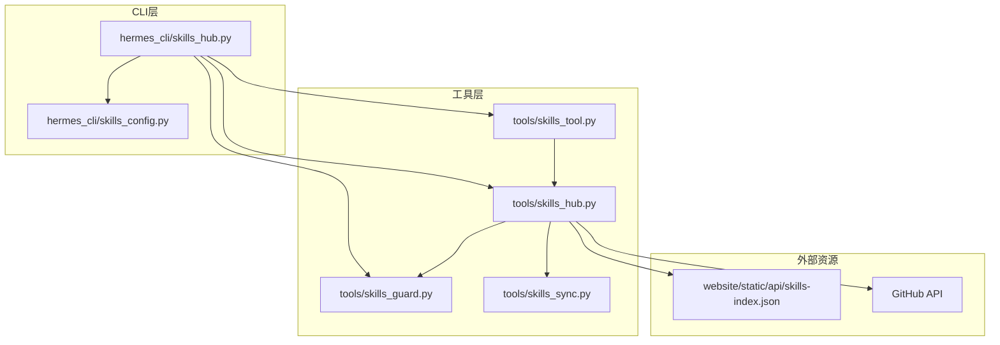
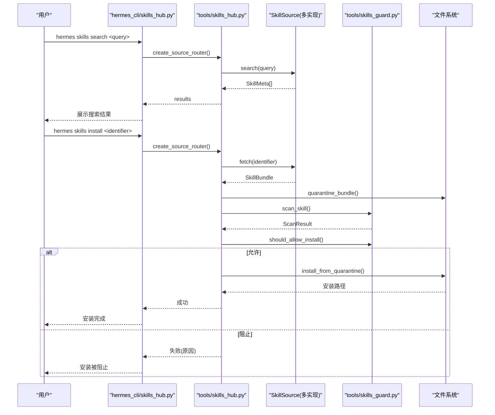
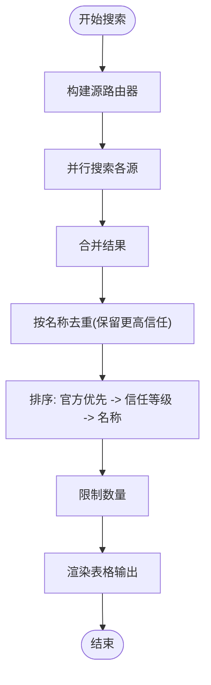
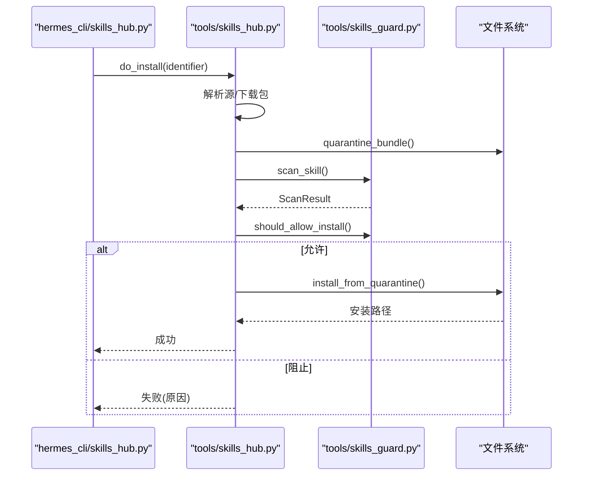
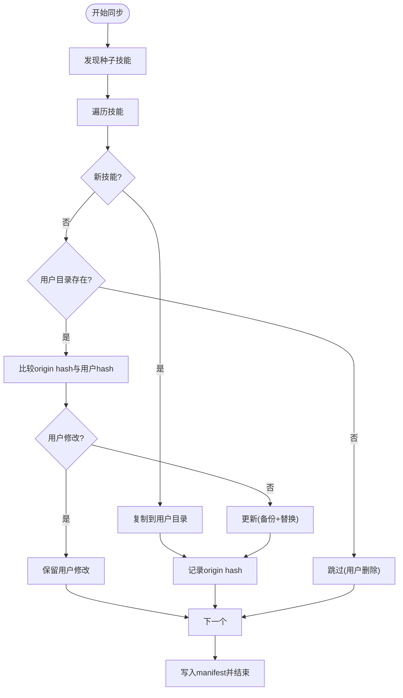
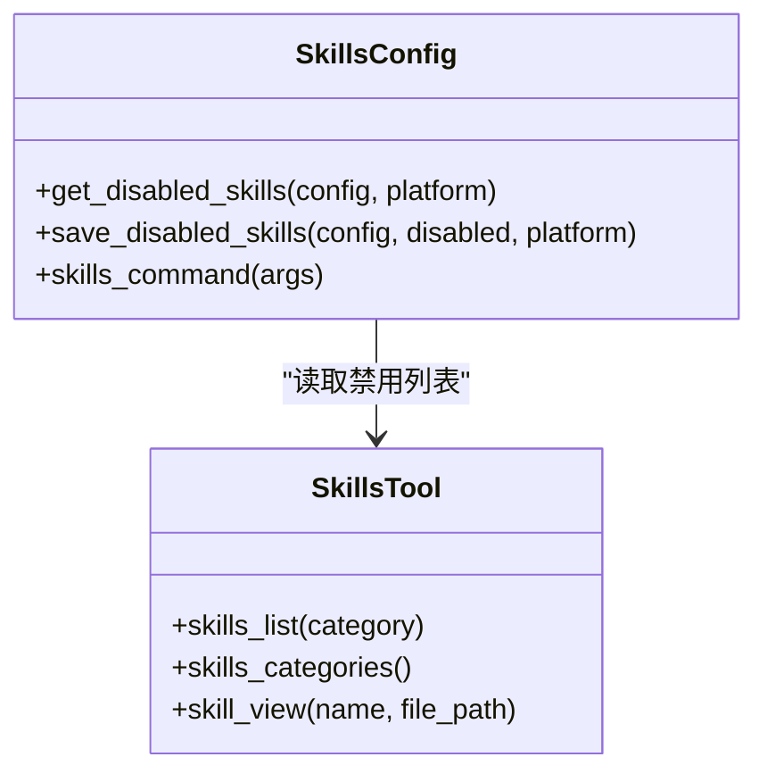
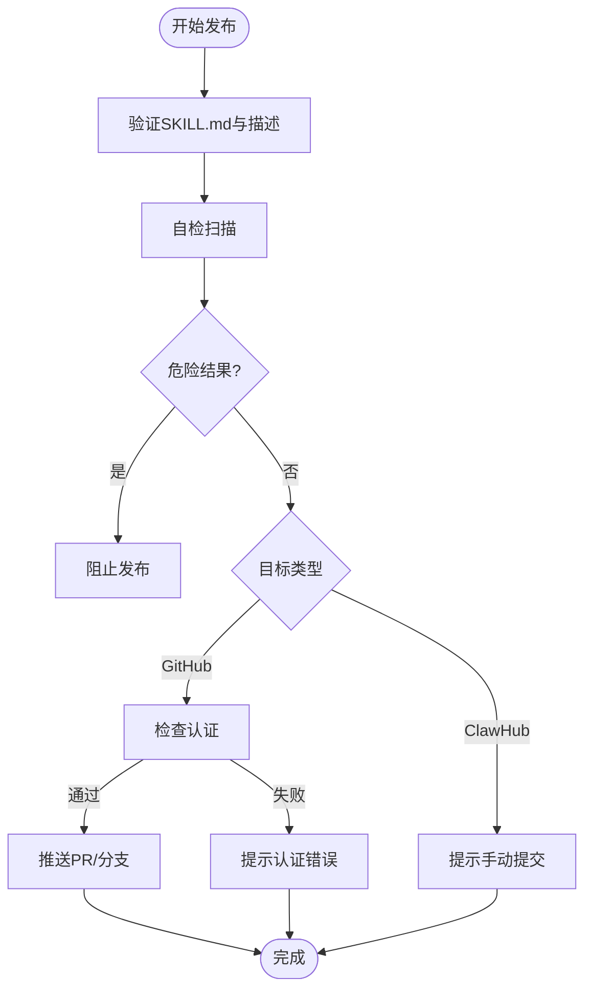
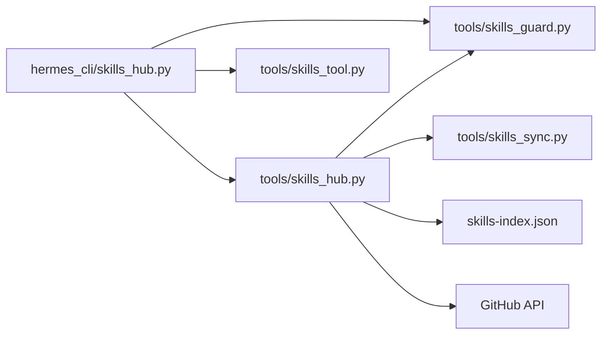

# 技能Hub与分发

<cite>
**本文引用的文件**
- [skills_hub.py](file://hermes_cli/skills_hub.py)
- [skills_hub.py](file://tools/skills_hub.py)
- [skills_guard.py](file://tools/skills_guard.py)
- [skills_sync.py](file://tools/skills_sync.py)
- [skills_tool.py](file://tools/skills_tool.py)
- [skills_config.py](file://hermes_cli/skills_config.py)
- [build_skills_index.py](file://scripts/build_skills_index.py)
- [README.md](file://README.md)
- [optional-skills/DESCRIPTION.md](file://optional-skills/DESCRIPTION.md)
- [optional-skills/autonomous-ai-agents/blackbox/SKILL.md](file://optional-skills/autonomous-ai-agents/blackbox/SKILL.md)
- [optional-skills/autonomous-ai-agents/honcho/SKILL.md](file://optional-skills/autonomous-ai-agents/honcho/SKILL.md)
- [optional-skills/mlops/accelerate/SKILL.md](file://optional-skills/mlops/accelerate/SKILL.md)
- [skills/autonomous-ai-agents/claude-code/SKILL.md](file://skills/autonomous-ai-agents/claude-code/SKILL.md)
</cite>

## 目录
1. [简介](#简介)
2. [项目结构](#项目结构)
3. [核心组件](#核心组件)
4. [架构总览](#架构总览)
5. [详细组件分析](#详细组件分析)
6. [依赖分析](#依赖分析)
7. [性能考虑](#性能考虑)
8. [故障排查指南](#故障排查指南)
9. [结论](#结论)
10. [附录](#附录)

## 简介
本文件面向Hermes Agent技能Hub与分发系统，提供从功能特性到实现细节的完整说明。内容涵盖：
- 技能Hub功能：搜索、浏览、安装、卸载、更新、审计、发布等
- 搜索机制：多源聚合、索引缓存、去重与排序
- 分类浏览与信任等级：官方、可信、社区三档信任体系
- 推荐与发现：基于标签、目录结构与索引的发现路径
- 安全与合规：扫描、安装策略、审计日志
- 同步与缓存：内置技能同步、索引缓存、提示词缓存失效
- 离线与本地化：本地技能目录、离线可用性
- 社区协作：自定义源、发布流程、贡献指南
- 使用技巧与个性化：按平台/类别禁用启用、交互式配置

## 项目结构
技能Hub围绕以下模块协同工作：
- hermes_cli/skills_hub.py：CLI命令入口与交互逻辑（搜索、浏览、安装、卸载、检查更新、审计、发布等）
- tools/skills_hub.py：Hub核心库（源适配器、锁文件、状态目录、认证、索引缓存等）
- tools/skills_guard.py：安全扫描与安装策略（威胁模式匹配、信任策略、报告格式化）
- tools/skills_sync.py：内置技能同步（种子技能复制、哈希校验、迁移与清理）
- tools/skills_tool.py：技能清单与视图（分级披露、平台过滤、环境变量收集）
- hermes_cli/skills_config.py：技能全局与平台级开关配置
- scripts/build_skills_index.py：构建集中式技能索引（供文档站点与离线使用）

**图表来源**
- [skills_hub.py:144-617](file://hermes_cli/skills_hub.py#L144-L617)
- [skills_hub.py:1-120](file://tools/skills_hub.py#L1-L120)
- [skills_guard.py:1-120](file://tools/skills_guard.py#L1-L120)
- [skills_sync.py:1-120](file://tools/skills_sync.py#L1-L120)
- [skills_tool.py:1-120](file://tools/skills_tool.py#L1-L120)
- [build_skills_index.py:1-120](file://scripts/build_skills_index.py#L1-L120)

**章节来源**
- [skills_hub.py:1-120](file://hermes_cli/skills_hub.py#L1-L120)
- [skills_hub.py:1-120](file://tools/skills_hub.py#L1-L120)
- [skills_guard.py:1-120](file://tools/skills_guard.py#L1-L120)
- [skills_sync.py:1-120](file://tools/skills_sync.py#L1-L120)
- [skills_tool.py:1-120](file://tools/skills_tool.py#L1-L120)
- [build_skills_index.py:1-120](file://scripts/build_skills_index.py#L1-L120)

## 核心组件
- 源适配器与路由
  - GitHubSource：从GitHub仓库抓取技能，支持树缓存、速率限制检测、信任等级判定
  - WellKnownSkillSource：读取“/.well-known/skills”端点索引
  - OptionalSkillSource：内置官方可选技能（非默认激活）
  - 其他源：skills.sh、ClawHub、Claude Marketplace、LobeHub
- Hub状态管理
  - HubLockFile：记录已安装技能来源与信任级别
  - 状态目录：隔离区(quarantine)、审计日志、自定义源(taps)、索引缓存
- 安全扫描与安装策略
  - 威胁模式库：凭据泄露、注入、破坏性操作、持久化、网络隧道、编码混淆等
  - 信任策略：builtin/trusted/community三档，结合扫描结果决定是否允许安装
- 内置技能同步
  - 种子技能复制、哈希对比、用户修改保护、manifest迁移与清理
- 技能发现与视图
  - 渐进披露：仅元数据列表，按需加载全文与关联文件
  - 平台过滤、环境变量收集、类别描述

**章节来源**
- [skills_hub.py:284-701](file://tools/skills_hub.py#L284-L701)
- [skills_guard.py:39-80](file://tools/skills_guard.py#L39-L80)
- [skills_sync.py:52-120](file://tools/skills_sync.py#L52-L120)
- [skills_tool.py:511-587](file://tools/skills_tool.py#L511-L587)

## 架构总览
技能Hub采用“CLI命令入口 + 工具库 + 多源适配 + 安全扫描 + 同步与缓存”的分层设计。CLI负责用户交互与流程编排；工具库提供通用能力；多源适配统一抽象；安全扫描在安装前执行；内置技能通过manifest进行版本与变更跟踪。

**图表来源**
- [skills_hub.py:144-466](file://hermes_cli/skills_hub.py#L144-L466)
- [skills_hub.py:350-376](file://tools/skills_hub.py#L350-L376)
- [skills_guard.py:595-677](file://tools/skills_guard.py#L595-L677)

**章节来源**
- [skills_hub.py:144-466](file://hermes_cli/skills_hub.py#L144-L466)
- [skills_hub.py:350-376](file://tools/skills_hub.py#L350-L376)
- [skills_guard.py:595-677](file://tools/skills_guard.py#L595-L677)

## 详细组件分析

### 组件A：技能搜索与浏览
- 搜索
  - 支持多源并行搜索，统一去重与排序（优先官方、再按信任等级、最后名称）
  - 支持按源过滤与限制数量
- 浏览
  - 分页展示，支持慢源跳过与剩余加载提示
  - 官方技能优先显示，统计各源数量
- 短名解析
  - 将简短名称解析为唯一标识，避免歧义

**图表来源**
- [skills_hub.py:184-308](file://hermes_cli/skills_hub.py#L184-L308)
- [skills_hub.py:322-349](file://tools/skills_hub.py#L322-L349)

**章节来源**
- [skills_hub.py:144-308](file://hermes_cli/skills_hub.py#L144-L308)
- [skills_hub.py:322-349](file://tools/skills_hub.py#L322-L349)

### 组件B：技能安装与安全扫描
- 安装流程
  - 解析标识符（短名解析）、定位源、下载包、隔离区(quarantine)、扫描、策略判断、确认、安装
  - 安装后可选择立即生效或下次会话生效
- 安全扫描
  - 结构检查（文件数、大小、二进制、符号链接）
  - 正则威胁模式匹配（凭据、注入、破坏、持久化、网络、混淆等）
  - 不可见Unicode字符检测
  - 信任策略：builtin允许、trusted谨慎、community严格
- 审计与日志
  - 审计日志记录阻断原因与扫描结果摘要

**图表来源**
- [skills_hub.py:310-466](file://hermes_cli/skills_hub.py#L310-L466)
- [skills_guard.py:595-677](file://tools/skills_guard.py#L595-L677)

**章节来源**
- [skills_hub.py:310-466](file://hermes_cli/skills_hub.py#L310-L466)
- [skills_guard.py:595-677](file://tools/skills_guard.py#L595-L677)

### 组件C：内置技能同步与缓存
- 同步策略
  - 新技能：直接复制并记录origin hash
  - 已存在：若用户未修改则随版本更新；若用户修改则跳过覆盖
  - 删除与迁移：尊重用户删除、清理过时条目
- 缓存与一致性
  - manifest记录每个技能的origin hash，用于变更检测
  - 目录哈希计算，确保跨文件改动可感知
- 索引缓存
  - GitHub索引缓存，带TTL，减少重复请求
  - 站点侧集中索引skills-index.json，供离线/静态站点使用

**图表来源**
- [skills_sync.py:176-302](file://tools/skills_sync.py#L176-L302)
- [build_skills_index.py:1-120](file://scripts/build_skills_index.py#L1-L120)

**章节来源**
- [skills_sync.py:176-302](file://tools/skills_sync.py#L176-L302)
- [build_skills_index.py:245-326](file://scripts/build_skills_index.py#L245-L326)

### 组件D：技能分类浏览与个性化配置
- 分类浏览
  - 读取CATEGORY/DESCRIPTION.md生成类别描述
  - 列表按类别与名称排序
- 个性化配置
  - 全局/平台级禁用列表
  - 类别批量切换
  - 交互式选择平台与模式

**图表来源**
- [skills_config.py:27-178](file://hermes_cli/skills_config.py#L27-L178)
- [skills_tool.py:632-777](file://tools/skills_tool.py#L632-L777)

**章节来源**
- [skills_config.py:27-178](file://hermes_cli/skills_config.py#L27-L178)
- [skills_tool.py:632-777](file://tools/skills_tool.py#L632-L777)

### 组件E：技能发布与社区协作
- 发布流程
  - 自检扫描（禁止危险结果）
  - GitHub发布：需要认证与目标仓库
  - ClawHub暂不支持（提示手动提交）
- 自定义源
  - taps管理：添加/移除/列出自定义GitHub仓库作为技能源

**图表来源**
- [skills_hub.py:730-797](file://hermes_cli/skills_hub.py#L730-L797)

**章节来源**
- [skills_hub.py:730-797](file://hermes_cli/skills_hub.py#L730-L797)

## 依赖分析
- 组件耦合
  - CLI依赖工具库（skills_hub、skills_guard、skills_tool），形成清晰边界
  - Hub核心库依赖安全扫描与源适配器，形成扩展点
  - 同步模块独立于安装流程，降低耦合
- 外部依赖
  - GitHub API：认证、Contents API、Trees API、速率限制
  - 站点索引：skills-index.json用于离线搜索
- 循环依赖
  - 通过延迟导入避免循环（CLI与工具库之间）

**图表来源**
- [skills_hub.py:144-617](file://hermes_cli/skills_hub.py#L144-L617)
- [skills_hub.py:1-120](file://tools/skills_hub.py#L1-L120)
- [build_skills_index.py:1-120](file://scripts/build_skills_index.py#L1-L120)

**章节来源**
- [skills_hub.py:144-617](file://hermes_cli/skills_hub.py#L144-L617)
- [skills_hub.py:1-120](file://tools/skills_hub.py#L1-L120)
- [build_skills_index.py:1-120](file://scripts/build_skills_index.py#L1-L120)

## 性能考虑
- 搜索性能
  - 并行搜索多源，设置总体超时上限，避免长时间等待
  - 索引缓存与树API优先，减少API调用次数
- 安装性能
  - 隔离区扫描与策略判断在安装前完成，避免无效安装
  - 提示词缓存失效仅在需要即时生效时触发
- 同步性能
  - manifest记录origin hash，仅在变更时更新，减少IO
  - 目录哈希计算按需进行，避免全量扫描

[本节为通用指导，无需特定文件引用]

## 故障排查指南
- GitHub速率限制
  - 现象：无法获取技能、提示限流
  - 处理：设置GITHUB_TOKEN或gh CLI登录，提升配额
- 安装被阻止
  - 现象：扫描结果为dangerous或有高危发现
  - 处理：查看扫描报告，必要时使用--force（仅在充分理解风险时）
- 审计与日志
  - 使用hermes skills audit查看已安装技能的安全扫描结果
  - 审计日志记录阻断原因，便于追踪
- 更新检查
  - 使用hermes skills check与hermes skills update检查并更新已安装技能

**章节来源**
- [skills_hub.py:333-356](file://hermes_cli/skills_hub.py#L333-L356)
- [skills_guard.py:679-713](file://tools/skills_guard.py#L679-L713)

## 结论
Hermes Agent技能Hub以“安全、高效、可扩展”为核心设计原则，通过多源适配、集中索引、结构化扫描与智能同步，为用户提供从发现、安装到维护的完整闭环。内置可选技能与社区源并存，既保证默认体验的简洁，又支持深度定制与扩展。建议在生产环境中配合审计与更新策略，确保技能生态的持续健康。

[本节为总结性内容，无需特定文件引用]

## 附录

### 使用技巧与个性化配置
- 搜索优化
  - 使用--source限定源，缩小搜索范围
  - 使用短名解析快速定位技能
- 个性化配置
  - hermes skills命令交互式配置全局/平台禁用列表
  - 按类别批量启用/禁用，提高效率
- 离线使用
  - 站点提供的skills-index.json可用于离线搜索
  - 内置技能同步后可在无网络环境下使用

**章节来源**
- [skills_hub.py:144-308](file://hermes_cli/skills_hub.py#L144-L308)
- [skills_config.py:125-178](file://hermes_cli/skills_config.py#L125-L178)
- [build_skills_index.py:1-120](file://scripts/build_skills_index.py#L1-L120)

### 示例技能参考
- 可选技能
  - blackbox：第三方编码代理集成
  - honcho：记忆与用户建模
- 内置技能
  - huggingface-accelerate：分布式训练API
  - claude-code：Anthropic编码代理集成

**章节来源**
- [optional-skills/autonomous-ai-agents/blackbox/SKILL.md:1-144](file://optional-skills/autonomous-ai-agents/blackbox/SKILL.md#L1-L144)
- [optional-skills/autonomous-ai-agents/honcho/SKILL.md:1-244](file://optional-skills/autonomous-ai-agents/honcho/SKILL.md#L1-L244)
- [optional-skills/mlops/accelerate/SKILL.md:1-336](file://optional-skills/mlops/accelerate/SKILL.md#L1-L336)
- [skills/autonomous-ai-agents/claude-code/SKILL.md:1-745](file://skills/autonomous-ai-agents/claude-code/SKILL.md#L1-L745)