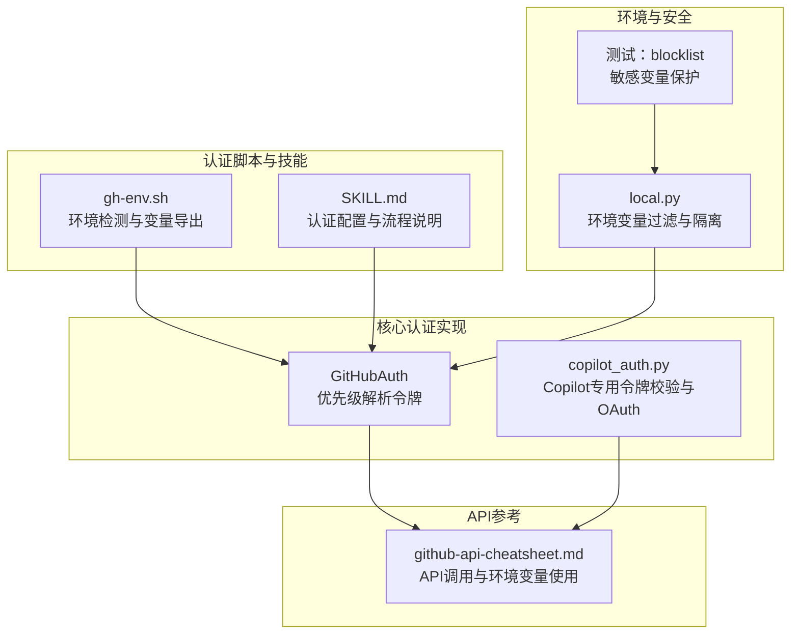
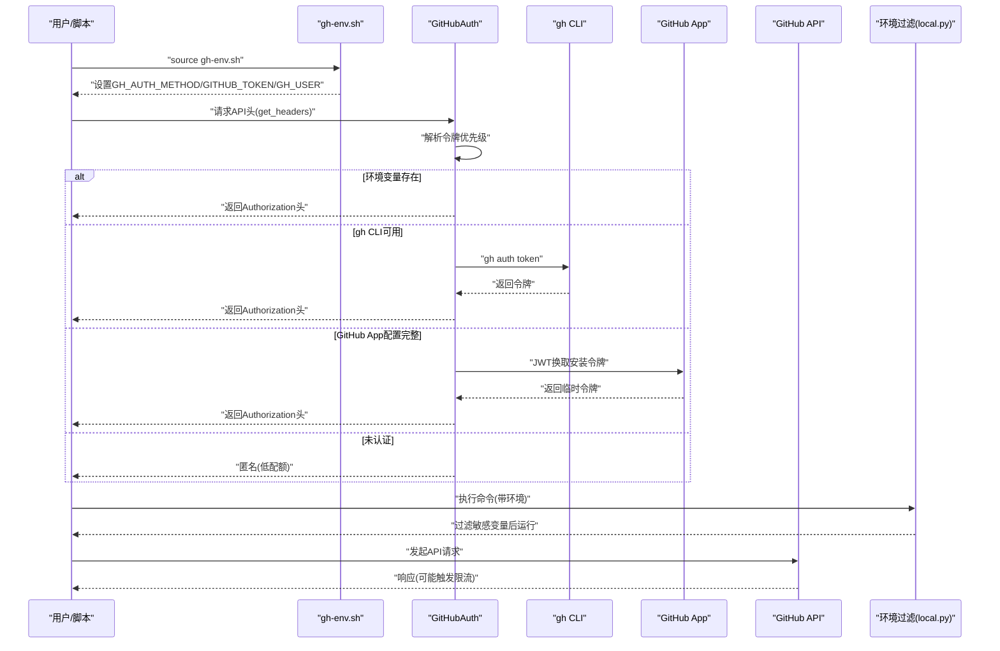
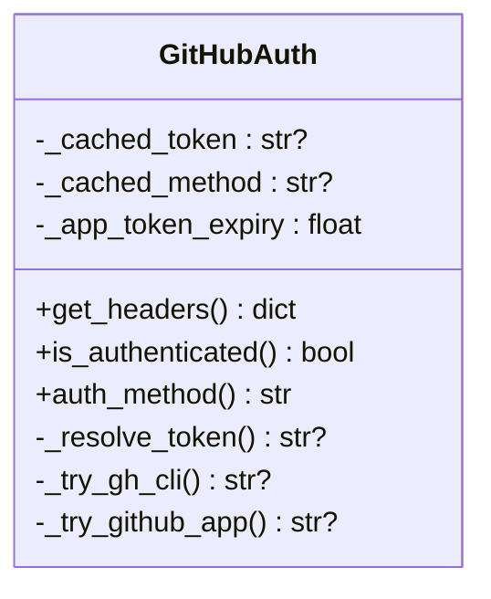
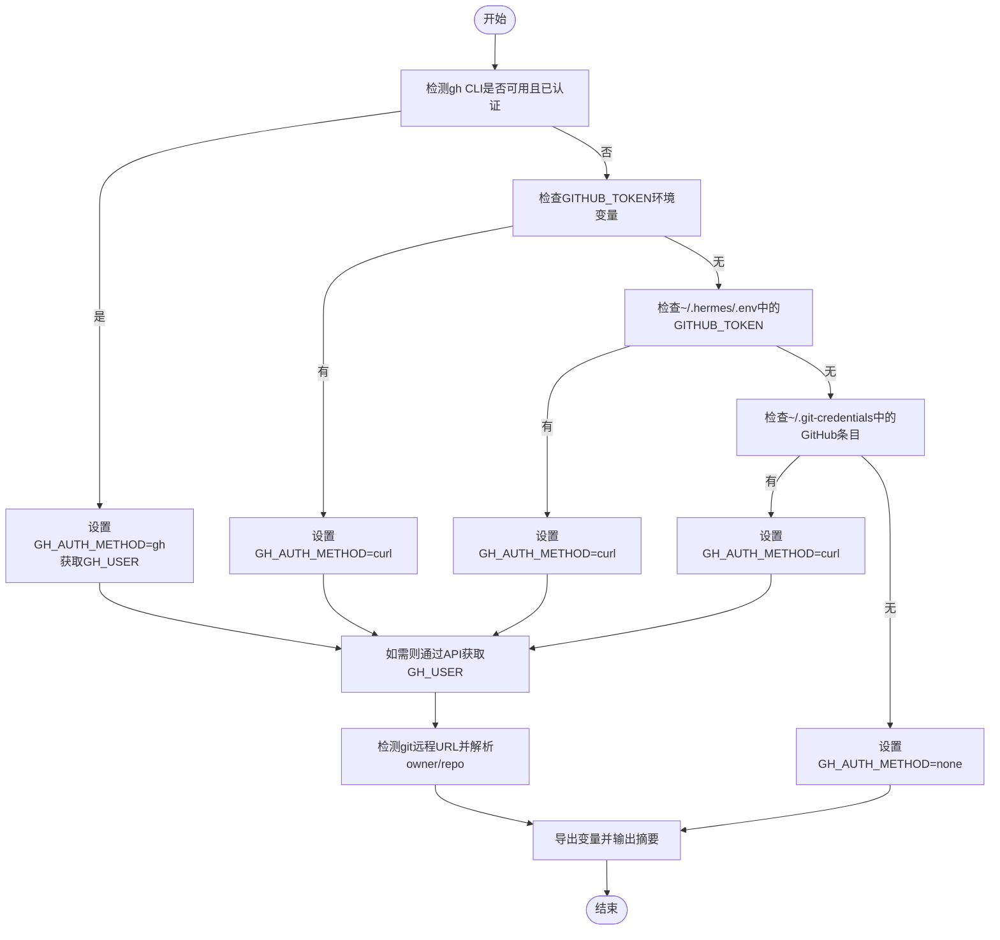
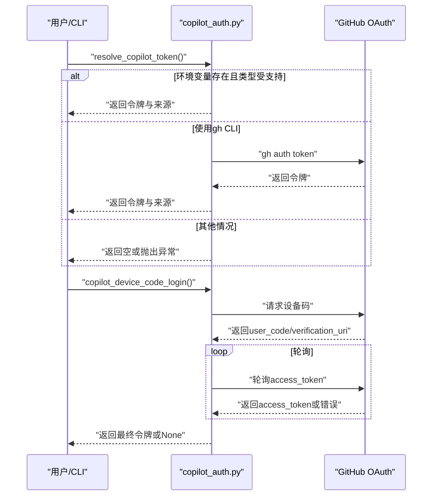
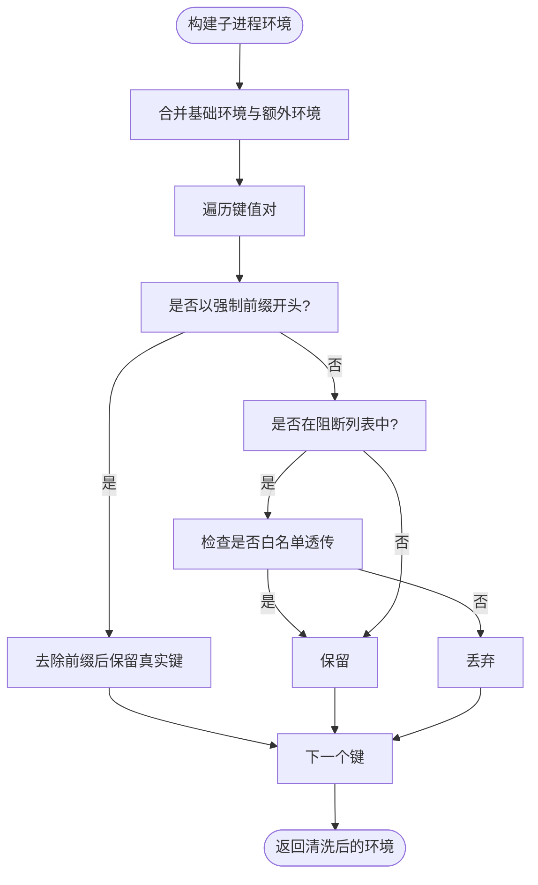
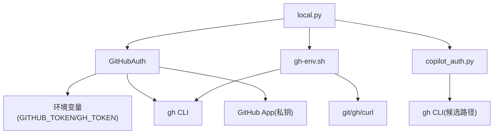

# GitHub认证管理

<cite>
**本文档引用的文件**
- [gh-env.sh](file://skills/github/github-auth/scripts/gh-env.sh)
- [SKILL.md](file://skills/github/github-auth/SKILL.md)
- [skills_hub.py](file://tools/skills_hub.py)
- [copilot_auth.py](file://hermes_cli/copilot_auth.py)
- [github-api-cheatsheet.md](file://skills/github/github-repo-management/references/github-api-cheatsheet.md)
- [local.py](file://tools/environments/local.py)
- [test_local_env_blocklist.py](file://tests/tools/test_local_env_blocklist.py)
</cite>

## 目录
1. [简介](#简介)
2. [项目结构](#项目结构)
3. [核心组件](#核心组件)
4. [架构总览](#架构总览)
5. [详细组件分析](#详细组件分析)
6. [依赖关系分析](#依赖关系分析)
7. [性能考量](#性能考量)
8. [故障排查指南](#故障排查指南)
9. [结论](#结论)
10. [附录](#附录)

## 简介
本文件面向在Hermes Agent中使用GitHub的用户与开发者，系统性介绍如何配置与管理GitHub访问令牌（PAT），涵盖个人访问令牌的生成、存储与轮换；解释认证脚本gh-env.sh的工作机制与使用方法；提供完整的认证流程配置示例（含环境变量、权限范围与安全最佳实践）；并给出认证失败、令牌过期与权限不足等常见问题的处理策略，以及不同使用场景下的认证策略建议。

## 项目结构
围绕GitHub认证的相关文件主要分布在以下位置：
- 认证脚本：skills/github/github-auth/scripts/gh-env.sh
- 认证技能说明：skills/github/github-auth/SKILL.md
- GitHub API认证实现：tools/skills_hub.py 中的 GitHubAuth 类
- Copilot专用认证工具：hermes_cli/copilot_auth.py
- API调用参考与环境变量使用：skills/github/github-repo-management/references/github-api-cheatsheet.md
- 环境变量安全过滤：tools/environments/local.py
- 测试与验证：tests/tools/test_local_env_blocklist.py

**图表来源**
- [gh-env.sh:1-67](file://skills/github/github-auth/scripts/gh-env.sh#L1-L67)
- [SKILL.md:1-247](file://skills/github/github-auth/SKILL.md#L1-L247)
- [skills_hub.py:129-246](file://tools/skills_hub.py#L129-L246)
- [copilot_auth.py:1-284](file://hermes_cli/copilot_auth.py#L1-L284)
- [github-api-cheatsheet.md:1-162](file://skills/github/github-repo-management/references/github-api-cheatsheet.md#L1-L162)
- [local.py:90-105](file://tools/environments/local.py#L90-L105)
- [test_local_env_blocklist.py:280-290](file://tests/tools/test_local_env_blocklist.py#L280-L290)

**章节来源**
- [gh-env.sh:1-67](file://skills/github/github-auth/scripts/gh-env.sh#L1-L67)
- [SKILL.md:1-247](file://skills/github/github-auth/SKILL.md#L1-L247)
- [skills_hub.py:129-246](file://tools/skills_hub.py#L129-L246)
- [copilot_auth.py:1-284](file://hermes_cli/copilot_auth.py#L1-L284)
- [github-api-cheatsheet.md:1-162](file://skills/github/github-repo-management/references/github-api-cheatsheet.md#L1-L162)
- [local.py:90-105](file://tools/environments/local.py#L90-L105)
- [test_local_env_blocklist.py:280-290](file://tests/tools/test_local_env_blocklist.py#L280-L290)

## 核心组件
- GitHubAuth：统一解析GitHub API访问令牌，按优先级从环境变量、gh CLI、GitHub App到匿名方式获取令牌，并缓存以提升性能与减少重复请求。
- gh-env.sh：在终端会话中自动检测认证状态，设置GH_AUTH_METHOD、GITHUB_TOKEN、GH_USER、GH_OWNER、GH_REPO等变量，便于后续脚本直接使用。
- copilot_auth.py：针对GitHub Copilot的令牌校验与OAuth设备码登录流程，确保使用受支持的令牌类型（gho_、github_pat_、ghu_）。
- 环境变量过滤：local.py对敏感环境变量进行阻断与白名单透传控制，避免在子进程环境中泄露令牌。

**章节来源**
- [skills_hub.py:129-246](file://tools/skills_hub.py#L129-L246)
- [gh-env.sh:1-67](file://skills/github/github-auth/scripts/gh-env.sh#L1-L67)
- [copilot_auth.py:1-284](file://hermes_cli/copilot_auth.py#L1-L284)
- [local.py:90-105](file://tools/environments/local.py#L90-L105)

## 架构总览
下图展示Hermes Agent中GitHub认证的整体流程：从环境检测与令牌解析，到API请求头注入与安全过滤，再到Copilot专用认证与OAuth流程。

**图表来源**
- [gh-env.sh:1-67](file://skills/github/github-auth/scripts/gh-env.sh#L1-L67)
- [skills_hub.py:143-188](file://tools/skills_hub.py#L143-L188)
- [local.py:110-138](file://tools/environments/local.py#L110-L138)
- [github-api-cheatsheet.md:1-162](file://skills/github/github-repo-management/references/github-api-cheatsheet.md#L1-L162)

## 详细组件分析

### GitHubAuth类（令牌解析与缓存）
- 令牌解析顺序：GITHUB_TOKEN/GH_TOKEN → gh CLI → GitHub App → 匿名
- 缓存策略：对非App令牌即时缓存；对App令牌按到期时间缓存，避免频繁刷新
- 请求头生成：统一添加Accept与Authorization头，简化API调用
- 错误与降级：当所有方式均不可用时，仍可继续但以较低配额访问公共资源

**图表来源**
- [skills_hub.py:129-246](file://tools/skills_hub.py#L129-L246)

**章节来源**
- [skills_hub.py:129-246](file://tools/skills_hub.py#L129-L246)

### 认证脚本 gh-env.sh（环境检测与变量导出）
- 功能：在终端会话中自动检测认证方式，设置GH_AUTH_METHOD、GITHUB_TOKEN、GH_USER、GH_OWNER、GH_REPO、GH_OWNER_REPO等变量
- 检测顺序：gh CLI可用且已认证 → 环境变量GITHUB_TOKEN → ~/.hermes/.env中的GITHUB_TOKEN → ~/.git-credentials中的GitHub条目
- 附加能力：通过API查询当前用户；在存在GitHub远程仓库时解析owner与repo

**图表来源**
- [gh-env.sh:1-67](file://skills/github/github-auth/scripts/gh-env.sh#L1-L67)

**章节来源**
- [gh-env.sh:1-67](file://skills/github/github-auth/scripts/gh-env.sh#L1-L67)

### Copilot专用认证（令牌类型校验与OAuth）
- 支持的令牌前缀：gho_（OAuth）、github_pat_（细粒度PAT）、ghu_（App）
- 不支持的令牌前缀：ghp_（经典PAT）
- 解析顺序：COPILOT_GITHUB_TOKEN → GH_TOKEN → GITHUB_TOKEN → gh auth token
- OAuth设备码流程：初始化设备码、打印用户码、轮询授权结果、处理超时与拒绝

**图表来源**
- [copilot_auth.py:67-95](file://hermes_cli/copilot_auth.py#L67-L95)
- [copilot_auth.py:139-259](file://hermes_cli/copilot_auth.py#L139-L259)

**章节来源**
- [copilot_auth.py:1-284](file://hermes_cli/copilot_auth.py#L1-L284)

### 环境变量安全过滤（阻断敏感变量）
- 阻断列表包含：GH_TOKEN、GITHUB_APP_ID、GITHUB_APP_PRIVATE_KEY_PATH、GITHUB_APP_INSTALLATION_ID等
- 过滤逻辑：在子进程环境构建时移除阻断列表中的变量，除非显式白名单透传
- 目的：防止令牌在子进程环境中被意外暴露

**图表来源**
- [local.py:110-138](file://tools/environments/local.py#L110-L138)
- [test_local_env_blocklist.py:280-290](file://tests/tools/test_local_env_blocklist.py#L280-L290)

**章节来源**
- [local.py:90-105](file://tools/environments/local.py#L90-L105)
- [local.py:110-138](file://tools/environments/local.py#L110-L138)
- [test_local_env_blocklist.py:280-290](file://tests/tools/test_local_env_blocklist.py#L280-L290)

## 依赖关系分析
- GitHubAuth依赖于环境变量与外部工具（gh CLI）；在App模式下依赖PyJWT与HTTP客户端
- gh-env.sh独立于Python，仅依赖shell与git/gh/curl命令
- copilot_auth.py依赖urllib与系统环境中的gh二进制（若使用gh CLI路径）
- 环境过滤模块在执行外部命令前统一应用，保障令牌安全

**图表来源**
- [skills_hub.py:159-246](file://tools/skills_hub.py#L159-L246)
- [gh-env.sh:21-43](file://skills/github/github-auth/scripts/gh-env.sh#L21-L43)
- [copilot_auth.py:98-134](file://hermes_cli/copilot_auth.py#L98-L134)
- [local.py:110-138](file://tools/environments/local.py#L110-L138)

**章节来源**
- [skills_hub.py:159-246](file://tools/skills_hub.py#L159-L246)
- [gh-env.sh:21-43](file://skills/github/github-auth/scripts/gh-env.sh#L21-L43)
- [copilot_auth.py:98-134](file://hermes_cli/copilot_auth.py#L98-L134)
- [local.py:110-138](file://tools/environments/local.py#L110-L138)

## 性能考量
- GitHubAuth对令牌解析结果进行缓存，避免重复调用外部工具与网络请求
- App令牌采用短期缓存（约58分钟），平衡安全性与性能
- 在批量API操作中，优先使用已认证请求头，减少匿名配额限制带来的失败重试

[本节为通用指导，无需特定文件分析]

## 故障排查指南
- 认证失败
  - 检查gh CLI状态与令牌有效性；确认环境变量GITHUB_TOKEN/GH_TOKEN正确设置
  - 若使用gh-env.sh，请确认其输出的GH_AUTH_METHOD与GITHUB_TOKEN
- 令牌过期
  - GitHub App令牌有效期约1小时，需重新获取；建议在调用前检查缓存是否过期
  - 对于Copilot，若提示经典PAT不支持，需改用gho_/github_pat_/ghu_类型的令牌
- 权限不足
  - 确认PAT具备所需作用域（如repo、workflow、read:org）
  - 检查仓库分支保护与组织权限设置
- 环境变量泄露风险
  - 使用环境过滤模块，确保敏感变量不在子进程环境中出现
  - 避免在命令行历史或日志中明文暴露令牌

**章节来源**
- [gh-env.sh:61-65](file://skills/github/github-auth/scripts/gh-env.sh#L61-L65)
- [skills_hub.py:187-188](file://tools/skills_hub.py#L187-L188)
- [copilot_auth.py:46-64](file://hermes_cli/copilot_auth.py#L46-L64)
- [local.py:110-138](file://tools/environments/local.py#L110-L138)

## 结论
Hermes Agent提供了从环境检测、令牌解析、API请求头注入到安全过滤的完整认证链路。通过gh-env.sh快速识别认证状态，借助GitHubAuth统一管理多种令牌来源，并结合环境过滤模块保障令牌安全。对于Copilot等特定场景，提供令牌类型校验与OAuth设备码流程，确保兼容性与安全性。

[本节为总结性内容，无需特定文件分析]

## 附录

### 完整认证流程配置示例（步骤化）
- 生成PAT
  - 登录GitHub设置，生成“classic”个人访问令牌，授予repo、workflow、read:org等必要作用域，设置合理过期时间
- 存储与使用
  - 方案A：使用git凭证助手持久化存储（store）或内存缓存（cache）
  - 方案B：将令牌嵌入远程URL（每仓库）
  - 方案C：设置环境变量GITHUB_TOKEN或GH_TOKEN
- 验证与自动化
  - 使用gh-env.sh在会话中自动导出变量，随后在脚本中直接使用
  - 在需要时通过gh CLI获取令牌，或在App模式下使用JWT换取安装令牌
- API调用
  - 参考API速查表，统一在请求头中加入Authorization: token $GITHUB_TOKEN

**章节来源**
- [SKILL.md:49-108](file://skills/github/github-auth/SKILL.md#L49-L108)
- [SKILL.md:171-184](file://skills/github/github-auth/SKILL.md#L171-L184)
- [github-api-cheatsheet.md:5-161](file://skills/github/github-repo-management/references/github-api-cheatsheet.md#L5-L161)

### 常见问题与解决方案对照
- git push提示密码：使用PAT作为密码或切换SSH
- 权限不足：补充repo、workflow、read:org等作用域
- 凭证未持久化：检查git凭证助手配置
- 多账户冲突：使用SSH多密钥或每仓库URL嵌入令牌
- gh命令不可用：使用git-only方案或gh-env.sh检测

**章节来源**
- [SKILL.md:236-247](file://skills/github/github-auth/SKILL.md#L236-L247)

### 不同使用场景下的认证策略建议
- 开发机桌面环境：优先使用gh CLI，自动处理API与git凭证
- 服务器/容器环境：使用环境变量GITHUB_TOKEN或GitHub App（推荐）
- 自动化流水线：使用GitHub内置凭据或App安装令牌
- Copilot集成：确保使用受支持的令牌类型（gho_/github_pat_/ghu_）

**章节来源**
- [copilot_auth.py:6-16](file://hermes_cli/copilot_auth.py#L6-L16)
- [skills_hub.py:130-136](file://tools/skills_hub.py#L130-L136)