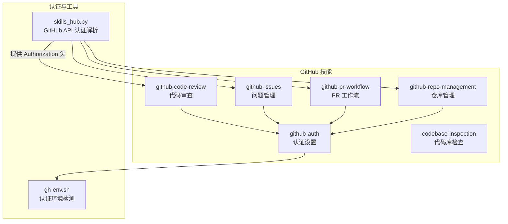
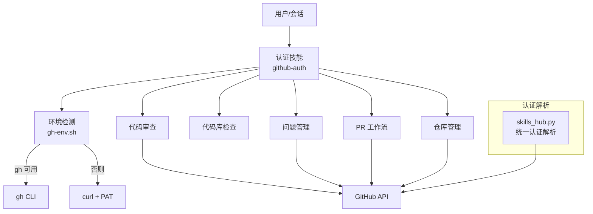
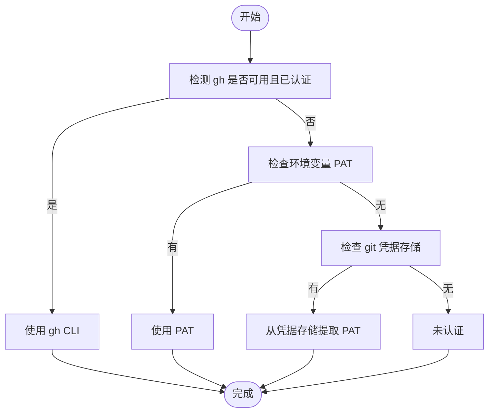
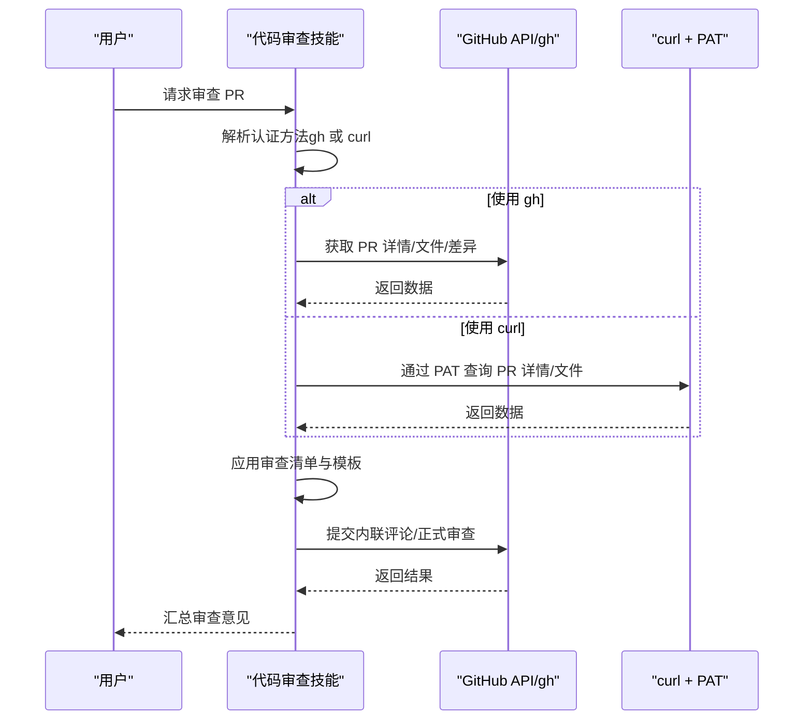
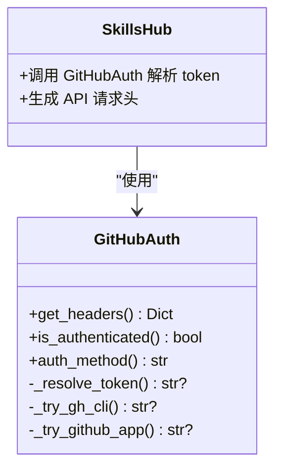
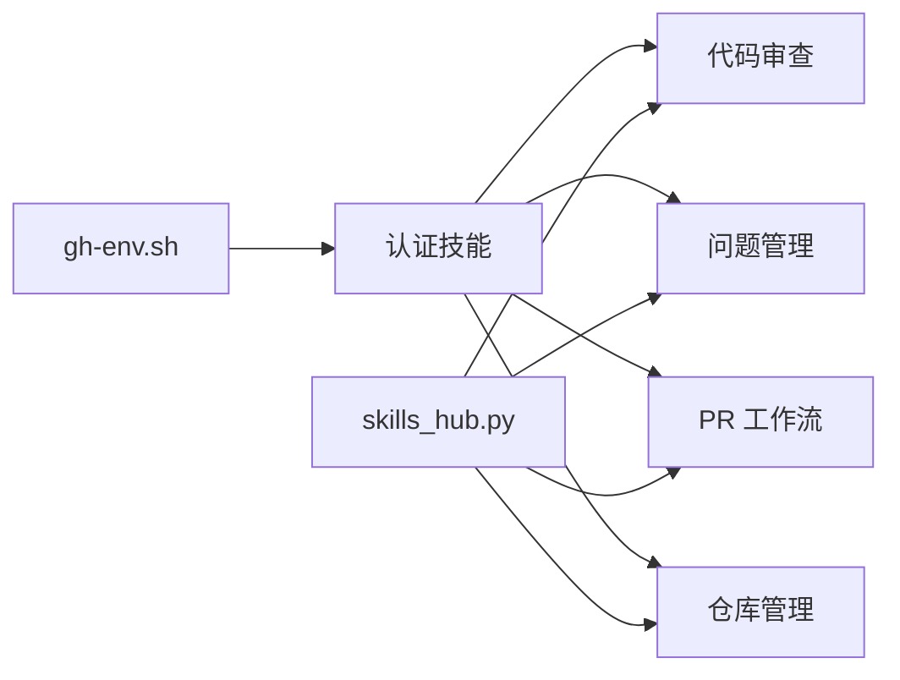

# GitHub集成

<cite>
**本文引用的文件**
- [技能总览](file://skills/github/DESCRIPTION.md)
- [认证技能 SKILL.md](file://skills/github/github-auth/SKILL.md)
- [认证环境脚本 gh-env.sh](file://skills/github/github-auth/scripts/gh-env.sh)
- [代码库检查 SKILL.md](file://skills/github/codebase-inspection/SKILL.md)
- [代码审查 SKILL.md](file://skills/github/github-code-review/SKILL.md)
- [审查输出模板 review-output-template.md](file://skills/github/github-code-review/references/review-output-template.md)
- [问题管理 SKILL.md](file://skills/github/github-issues/SKILL.md)
- [PR 工作流 SKILL.md](file://skills/github/github-pr-workflow/SKILL.md)
- [仓库管理 SKILL.md](file://skills/github/github-repo-management/SKILL.md)
- [技能中心 skills_hub.py](file://tools/skills_hub.py)
</cite>

## 目录
1. [简介](#简介)
2. [项目结构](#项目结构)
3. [核心组件](#核心组件)
4. [架构概览](#架构概览)
5. [详细组件分析](#详细组件分析)
6. [依赖关系分析](#依赖关系分析)
7. [性能考量](#性能考量)
8. [故障排除指南](#故障排除指南)
9. [结论](#结论)
10. [附录](#附录)

## 简介
本文件系统化梳理 Hermes Agent 的 GitHub 集成技能，覆盖认证管理、代码库检查、代码审查、问题跟踪、PR 生命周期与仓库管理等能力。文档基于仓库内现有技能与工具实现，提供配置要求、使用步骤、最佳实践、API 集成方式、权限与安全考虑，以及完整开发工作流示例与常见问题排查。

## 项目结构
GitHub 相关技能位于 skills/github 下，按功能拆分为多个独立技能，每个技能以 SKILL.md 文档形式提供使用说明与命令参考；认证环境检测脚本用于在终端工具中自动识别可用的认证路径（gh 或 curl）；技能中心工具提供统一的 GitHub API 认证解析逻辑，支持 PAT、gh CLI 与 GitHub App 三种方式。

**图表来源**
- [技能总览](file://skills/github/DESCRIPTION.md)
- [认证技能 SKILL.md](file://skills/github/github-auth/SKILL.md)
- [认证环境脚本 gh-env.sh](file://skills/github/github-auth/scripts/gh-env.sh)
- [代码审查 SKILL.md](file://skills/github/github-code-review/SKILL.md)
- [问题管理 SKILL.md](file://skills/github/github-issues/SKILL.md)
- [PR 工作流 SKILL.md](file://skills/github/github-pr-workflow/SKILL.md)
- [仓库管理 SKILL.md](file://skills/github/github-repo-management/SKILL.md)
- [技能中心 skills_hub.py](file://tools/skills_hub.py)

**章节来源**
- [技能总览](file://skills/github/DESCRIPTION.md)
- [认证技能 SKILL.md](file://skills/github/github-auth/SKILL.md)
- [认证环境脚本 gh-env.sh](file://skills/github/github-auth/scripts/gh-env.sh)
- [技能中心 skills_hub.py](file://tools/skills_hub.py)

## 核心组件
- 认证技能：提供 gh CLI 与 git（HTTPS/SSH）两种认证路径，自动检测可用方法，支持 HTTPS PAT、SSH Key、gh auth 与从 git 凭据提取 token。
- 代码库检查：基于 pygount 进行 LOC 统计、语言分布与代码/注释比例分析，支持多种输出格式与过滤选项。
- 代码审查：支持本地 diff 审查与 PR 在线审查，提供预推送审查清单与正式审查流程，支持通过 gh 或 curl 调用 GitHub API。
- 问题管理：支持创建、查看、搜索、标签/指派、评论、关闭/重开与批量操作，提供与 PR 的关联与分支创建能力。
- PR 工作流：覆盖分支创建、提交、推送到 PR、CI 监控、失败诊断与自动修复、合并策略与自动合并。
- 仓库管理：支持克隆、创建、fork、信息查询、设置编辑、分支保护、Secrets 管理、发布与 Actions 工作流管理、Gist 创建。
- 认证工具：统一解析 Authorization 头，优先级为环境变量 PAT > gh CLI > GitHub App，兼容技能中的 curl 回退方案。

**章节来源**
- [认证技能 SKILL.md](file://skills/github/github-auth/SKILL.md)
- [代码库检查 SKILL.md](file://skills/github/codebase-inspection/SKILL.md)
- [代码审查 SKILL.md](file://skills/github/github-code-review/SKILL.md)
- [问题管理 SKILL.md](file://skills/github/github-issues/SKILL.md)
- [PR 工作流 SKILL.md](file://skills/github/github-pr-workflow/SKILL.md)
- [仓库管理 SKILL.md](file://skills/github/github-repo-management/SKILL.md)
- [技能中心 skills_hub.py](file://tools/skills_hub.py)

## 架构概览
下图展示 GitHub 技能的调用关系与认证分发机制：认证技能负责环境检测与 token 提取；其他技能在需要时复用认证结果或直接使用 gh 命令；技能中心工具提供统一的 GitHub API 认证解析，确保各技能在无 gh 环境下也能通过 curl 使用 GitHub API。

**图表来源**
- [认证技能 SKILL.md](file://skills/github/github-auth/SKILL.md)
- [认证环境脚本 gh-env.sh](file://skills/github/github-auth/scripts/gh-env.sh)
- [代码审查 SKILL.md](file://skills/github/github-code-review/SKILL.md)
- [问题管理 SKILL.md](file://skills/github/github-issues/SKILL.md)
- [PR 工作流 SKILL.md](file://skills/github/github-pr-workflow/SKILL.md)
- [仓库管理 SKILL.md](file://skills/github/github-repo-management/SKILL.md)
- [技能中心 skills_hub.py](file://tools/skills_hub.py)

## 详细组件分析

### 认证技能（github-auth）
- 支持路径
  - gh CLI：交互式浏览器登录、token 登录、设置 git 凭据、状态校验。
  - git-only：HTTPS PAT（推荐）、SSH Key；支持凭据缓存、嵌入远程 URL、身份配置与验证。
- 自动检测流程：优先使用 gh auth status 判断；若不可用则回退到 PAT/SSH；最终回退到 curl 方案。
- API 使用：当 gh 不可用时，通过 curl + PAT 访问 GitHub API，支持从环境变量或 git 凭据存储提取 token。
- 最佳实践
  - 优先安装 gh 并使用 gh auth，简化认证与凭据管理。
  - HTTPS PAT 推荐最小权限范围：repo、workflow、read:org。
  - SSH Key 适合长期、稳定的服务器环境。
  - 将 PAT 存放在安全位置，避免明文写入命令行。

**图表来源**
- [认证技能 SKILL.md](file://skills/github/github-auth/SKILL.md)
- [认证环境脚本 gh-env.sh](file://skills/github/github-auth/scripts/gh-env.sh)

**章节来源**
- [认证技能 SKILL.md](file://skills/github/github-auth/SKILL.md)
- [认证环境脚本 gh-env.sh](file://skills/github/github-auth/scripts/gh-env.sh)

### 代码库检查（codebase-inspection）
- 功能：使用 pygount 进行 LOC 统计、语言分布、文件数量与代码/注释比例分析。
- 使用场景：询问仓库规模、语言组成、代码 vs 注释比例等。
- 关键点
  - 必须安装 pygount。
  - 强烈建议使用 --folders-to-skip 排除 .git、node_modules、venv 等目录，避免扫描耗时与卡顿。
  - 支持按后缀过滤、JSON 输出、排序与摘要格式。
- 最佳实践
  - 首选摘要格式，便于快速概览。
  - 对大型仓库使用 --suffix 指定目标语言，提升效率。

**章节来源**
- [代码库检查 SKILL.md](file://skills/github/codebase-inspection/SKILL.md)

### 代码审查（github-code-review）
- 本地审查：基于 git diff 获取变更，结合 read_file 读取上下文，执行审查清单（正确性、安全性、质量、测试、性能、文档）。
- PR 审查：支持通过 gh 或 curl 获取 PR 详情、文件列表、差异；可检出 PR 本地进行全量审查；支持通用评论与内联评论；支持一次性提交多条评论的正式审查。
- 审查输出：使用 review-output-template.md 的结构化模板，明确严重级别与结论。
- 自动化流程：预推送审查与 PR 审查的端到端步骤清晰，便于在会话中引导用户完成。

**图表来源**
- [代码审查 SKILL.md](file://skills/github/github-code-review/SKILL.md)
- [审查输出模板 review-output-template.md](file://skills/github/github-code-review/references/review-output-template.md)

**章节来源**
- [代码审查 SKILL.md](file://skills/github/github-code-review/SKILL.md)
- [审查输出模板 review-output-template.md](file://skills/github/github-code-review/references/review-output-template.md)

### 问题管理（github-issues）
- 能力：列出/查看/搜索问题、创建问题、添加/移除标签、指派、评论、关闭/重开、链接 PR 与分支创建。
- 认证：优先 gh，否则回退到 curl + PAT。
- 批量操作：结合 gh 或 curl + jq 实现批量关闭/处理。
- 最佳实践
  - 使用标准模板（Bug/Feature）提升问题描述质量。
  - 合理使用标签与指派，配合搜索提高可发现性。

**章节来源**
- [问题管理 SKILL.md](file://skills/github/github-issues/SKILL.md)

### PR 工作流（github-pr-workflow）
- 生命周期：分支创建、提交、推送、创建 PR、监控 CI、失败诊断与自动修复、合并与清理。
- CI 监控：支持 gh checks 与 curl combined status/check-runs；提供轮询脚本。
- 自动修复：失败日志获取、定位问题、使用文件工具修复、再次推送与验证。
- 合并策略：支持 squash、merge、rebase；可启用自动合并（GraphQL）。
- 最佳实践
  - 使用约定式提交消息，保持历史整洁。
  - 在 PR 描述中明确测试计划与关联问题。

**章节来源**
- [PR 工作流 SKILL.md](file://skills/github/github-pr-workflow/SKILL.md)

### 仓库管理（github-repo-management）
- 能力：克隆、创建、fork、信息查询、设置编辑、分支保护、Secrets 管理、发布、Actions 工作流与 Gist。
- 认证：优先 gh，否则回退到 curl + PAT。
- 最佳实践
  - 私有仓库优先使用 gh secret set；如仅需临时操作，可使用 curl。
  - 分支保护策略应与团队规范一致，必要时开启严格检查与审查要求。

**章节来源**
- [仓库管理 SKILL.md](file://skills/github/github-repo-management/SKILL.md)

### 认证工具（skills_hub.py）
- 统一认证解析：优先级 PAT > gh CLI > GitHub App；支持缓存与过期控制。
- API 头生成：自动注入 Accept 与 Authorization 头，供各技能调用 GitHub API。
- 适用范围：被代码审查、问题管理、PR 工作流、仓库管理等技能复用，确保在无 gh 环境下仍可通过 PAT 使用 API。

**图表来源**
- [技能中心 skills_hub.py](file://tools/skills_hub.py)

**章节来源**
- [技能中心 skills_hub.py](file://tools/skills_hub.py)

## 依赖关系分析
- 技能间耦合
  - 代码审查、问题管理、PR 工作流、仓库管理均依赖认证技能提供的认证方法与环境变量。
  - 认证环境脚本 gh-env.sh 为终端工具提供统一的认证检测与变量导出。
  - 技能中心工具为各技能提供统一的 GitHub API 认证解析，降低重复实现。
- 外部依赖
  - gh CLI：推荐安装以简化认证与 API 调用。
  - curl + PAT：无 gh 时的回退方案，需正确设置 GITHUB_TOKEN。
  - pygount：代码库检查前置条件。

**图表来源**
- [认证技能 SKILL.md](file://skills/github/github-auth/SKILL.md)
- [认证环境脚本 gh-env.sh](file://skills/github/github-auth/scripts/gh-env.sh)
- [代码审查 SKILL.md](file://skills/github/github-code-review/SKILL.md)
- [问题管理 SKILL.md](file://skills/github/github-issues/SKILL.md)
- [PR 工作流 SKILL.md](file://skills/github/github-pr-workflow/SKILL.md)
- [仓库管理 SKILL.md](file://skills/github/github-repo-management/SKILL.md)
- [技能中心 skills_hub.py](file://tools/skills_hub.py)

**章节来源**
- [认证技能 SKILL.md](file://skills/github/github-auth/SKILL.md)
- [认证环境脚本 gh-env.sh](file://skills/github/github-auth/scripts/gh-env.sh)
- [技能中心 skills_hub.py](file://tools/skills_hub.py)

## 性能考量
- 代码库检查
  - 使用 --folders-to-skip 显著减少扫描时间；对大型 monorepo 使用 --suffix 限定语言。
- CI 监控
  - 使用 gh pr checks --watch 或轮询脚本，避免频繁短间隔请求导致 API 限流。
- 批量操作
  - 结合 jq 与 xargs 实现高效批量处理，减少手工重复劳动。
- 认证缓存
  - PAT 缓存与技能中心工具的令牌缓存可减少重复解析成本。

[本节为通用指导，无需特定文件引用]

## 故障排除指南
- gh 未安装或未认证
  - 使用 git-only 方法配置 HTTPS PAT 或 SSH Key；或安装 gh 并执行 gh auth login。
- 认证失败
  - PAT 缺少 repo/workflow/scopes 权限；检查凭据是否过期；使用 git credential reject 清理缓存后重新认证。
- SSH 连接被拒绝
  - 尝试通过 443 端口走 HTTPS 隧道；或在 ~/.ssh/config 中配置 Host github.com 的 Port 与 Hostname。
- 多账户冲突
  - 使用 SSH 多密钥或每仓库凭据 URL 区分不同账户。
- CI 失败
  - 使用 gh run view 或 curl 获取失败日志，定位问题后修复并推送；遵循自动修复循环不超过 3 次的原则。

**章节来源**
- [认证技能 SKILL.md](file://skills/github/github-auth/SKILL.md)
- [PR 工作流 SKILL.md](file://skills/github/github-pr-workflow/SKILL.md)

## 结论
Hermes Agent 的 GitHub 集成技能提供了从认证到仓库管理的完整自动化能力。通过认证技能与认证环境脚本的自动检测，以及技能中心工具的统一认证解析，系统能在有/无 gh 的环境下稳定运行。建议优先使用 gh CLI 以获得更丰富的 API 能力与更简化的认证流程；在受限环境中，HTTPS PAT 与 curl 回退方案同样可靠。结合审查清单、模板与批量操作，可显著提升日常开发与协作效率。

[本节为总结性内容，无需特定文件引用]

## 附录

### 开发工作流示例（端到端 PR 合并）
- 准备阶段：认证检测（gh 或 PAT），确定 owner/repo。
- 分支与提交：基于 main 创建特性分支，使用约定式提交消息。
- 本地审查：应用审查清单，必要时修正问题。
- 推送与创建 PR：推送分支并创建 PR，填写描述与标签。
- CI 监控：等待检查完成；若失败，自动修复循环。
- 审查与合并：根据审查结果请求修改或批准，选择 squash/merge/rebase 策略合并并清理分支。

**章节来源**
- [PR 工作流 SKILL.md](file://skills/github/github-pr-workflow/SKILL.md)
- [代码审查 SKILL.md](file://skills/github/github-code-review/SKILL.md)