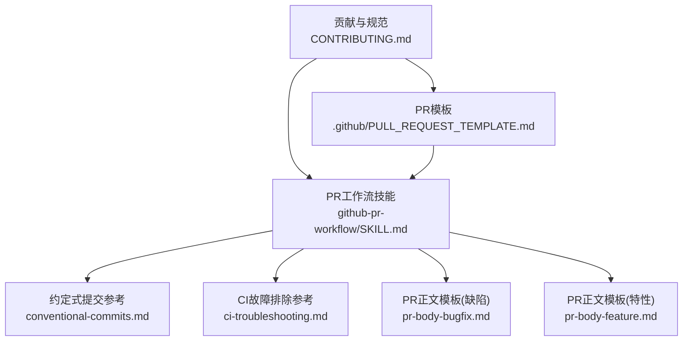
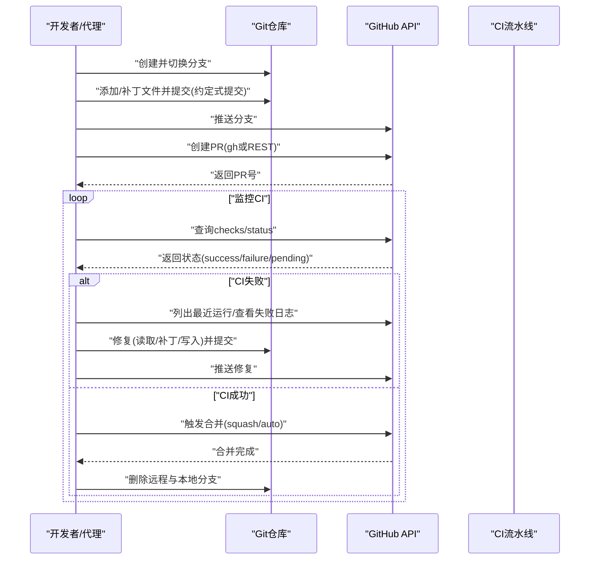
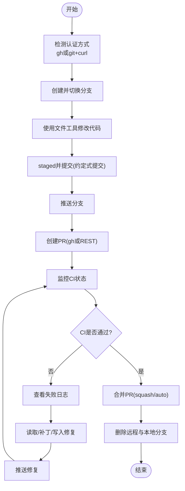
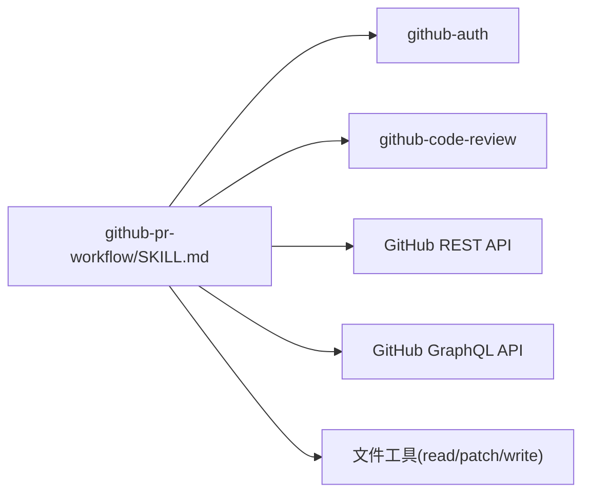
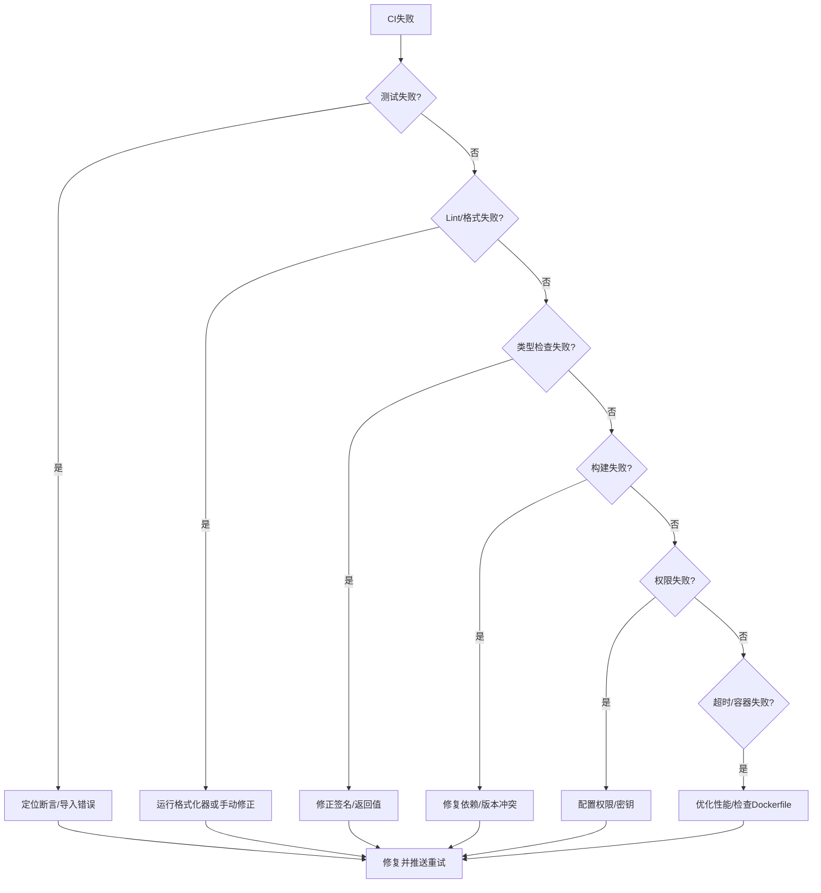

# PR工作流

<cite>
**本文引用的文件**
- [README.md](file://README.md)
- [CONTRIBUTING.md](file://CONTRIBUTING.md)
- [.github/PULL_REQUEST_TEMPLATE.md](file://.github/PULL_REQUEST_TEMPLATE.md)
- [skills/github/github-pr-workflow/SKILL.md](file://skills/github/github-pr-workflow/SKILL.md)
- [skills/github/github-pr-workflow/references/conventional-commits.md](file://skills/github/github-pr-workflow/references/conventional-commits.md)
- [skills/github/github-pr-workflow/references/ci-troubleshooting.md](file://skills/github/github-pr-workflow/references/ci-troubleshooting.md)
- [skills/github/github-pr-workflow/templates/pr-body-bugfix.md](file://skills/github/github-pr-workflow/templates/pr-body-bugfix.md)
- [skills/github/github-pr-workflow/templates/pr-body-feature.md](file://skills/github/github-pr-workflow/templates/pr-body-feature.md)
</cite>

## 目录
1. [简介](#简介)
2. [项目结构](#项目结构)
3. [核心组件](#核心组件)
4. [架构总览](#架构总览)
5. [详细组件分析](#详细组件分析)
6. [依赖关系分析](#依赖关系分析)
7. [性能考量](#性能考量)
8. [故障排除指南](#故障排除指南)
9. [结论](#结论)
10. [附录](#附录)

## 简介
本文件面向使用 Hermes Agent 自动化管理 GitHub Pull Request 的团队与个人，系统性阐述从分支创建、约定式提交、PR 模板到 CI/CD 监控、自动修复、合并策略与回滚建议的完整工作流。文档基于仓库内现有的贡献指南、PR 模板以及 GitHub PR 工作流技能资料进行整理，并提供可操作的步骤、决策树与最佳实践，帮助团队建立稳定、可重复、可审计的 PR 生命周期。

## 项目结构
围绕 PR 工作流的关键位置如下：
- 贡献与规范：CONTRIBUTING.md 定义了分支命名、提交信息格式（约定式提交）、PR 描述要求与测试流程
- PR 模板：.github/PULL_REQUEST_TEMPLATE.md 提供标准化的 PR 表单字段与清单
- PR 工作流技能：skills/github/github-pr-workflow/SKILL.md 提供端到端的 PR 生命周期自动化脚本与命令参考
- 规范与模板：conventional-commits.md 与两类 PR 正文模板（bugfix 与 feature）用于统一描述风格
- 故障排除：ci-troubleshooting.md 提供常见 CI 失败模式与诊断路径

**图表来源**
- [CONTRIBUTING.md](file://CONTRIBUTING.md)
- [.github/PULL_REQUEST_TEMPLATE.md](file://.github/PULL_REQUEST_TEMPLATE.md)
- [skills/github/github-pr-workflow/SKILL.md](file://skills/github/github-pr-workflow/SKILL.md)
- [skills/github/github-pr-workflow/references/conventional-commits.md](file://skills/github/github-pr-workflow/references/conventional-commits.md)
- [skills/github/github-pr-workflow/references/ci-troubleshooting.md](file://skills/github/github-pr-workflow/references/ci-troubleshooting.md)
- [skills/github/github-pr-workflow/templates/pr-body-bugfix.md](file://skills/github/github-pr-workflow/templates/pr-body-bugfix.md)
- [skills/github/github-pr-workflow/templates/pr-body-feature.md](file://skills/github/github-pr-workflow/templates/pr-body-feature.md)

**章节来源**
- [README.md](file://README.md)
- [CONTRIBUTING.md](file://CONTRIBUTING.md)
- [.github/PULL_REQUEST_TEMPLATE.md](file://.github/PULL_REQUEST_TEMPLATE.md)
- [skills/github/github-pr-workflow/SKILL.md](file://skills/github/github-pr-workflow/SKILL.md)

## 核心组件
- 分支与提交规范
  - 分支命名：按类型前缀（feat/fix/refactor/docs/test/ci 等）组织
  - 提交信息：遵循约定式提交，支持多行正文与链接问题
- PR 模板与清单
  - 使用 .github/PULL_REQUEST_TEMPLATE.md 统一字段，确保变更动机、验证步骤、清单等齐备
- PR 工作流自动化
  - 基于技能脚本实现：分支创建、推送、PR 创建、CI 监控、自动修复循环、合并与清理
  - 支持 gh CLI 与 git + curl 双通道，无 gh 环境时自动降级
- CI/CD 集成与质量门禁
  - 通过 gh pr checks 或 REST API 查询状态
  - 建立“失败即修复”的自动循环，限制重试次数并最终转人工
- 合并与回滚
  - 推荐 squash 合并与删除分支；必要时启用自动合并（需仓库开启）
  - 回滚建议：通过 revert 提交或回退到上一个稳定标签/分支

**章节来源**
- [CONTRIBUTING.md](file://CONTRIBUTING.md)
- [.github/PULL_REQUEST_TEMPLATE.md](file://.github/PULL_REQUEST_TEMPLATE.md)
- [skills/github/github-pr-workflow/SKILL.md](file://skills/github/github-pr-workflow/SKILL.md)
- [skills/github/github-pr-workflow/references/conventional-commits.md](file://skills/github/github-pr-workflow/references/conventional-commits.md)
- [skills/github/github-pr-workflow/references/ci-troubleshooting.md](file://skills/github/github-pr-workflow/references/ci-troubleshooting.md)

## 架构总览
下图展示从本地开发到 PR 合并的端到端流程，涵盖分支、提交、PR、CI、自动修复与合并清理：

**图表来源**
- [skills/github/github-pr-workflow/SKILL.md](file://skills/github/github-pr-workflow/SKILL.md)
- [skills/github/github-pr-workflow/references/ci-troubleshooting.md](file://skills/github/github-pr-workflow/references/ci-troubleshooting.md)

## 详细组件分析

### 分支与提交规范
- 分支命名
  - 类型前缀：feat、fix、refactor、docs、test、ci 等
  - 示例：feat/user-auth、fix/login-redirect-bug、ci/add-python312-job
- 提交信息（约定式提交）
  - 格式：type(scope): short description
  - 支持 BREAKING CHANGE 与链接问题（Closes/Fixes/Refs）
  - 建议在正文分点说明变更内容与影响范围

**章节来源**
- [CONTRIBUTING.md](file://CONTRIBUTING.md)
- [skills/github/github-pr-workflow/references/conventional-commits.md](file://skills/github/github-pr-workflow/references/conventional-commits.md)

### PR 模板与清单
- PR 模板字段
  - 变更动机、类型选择、变更列表、测试步骤、清单校验项
  - 新技能场景下的额外字段（技能可用性、依赖、端到端测试）
- 清单要点
  - 遵循贡献指南、提交信息符合约定式提交、测试通过、平台验证、文档更新等

**章节来源**
- [.github/PULL_REQUEST_TEMPLATE.md](file://.github/PULL_REQUEST_TEMPLATE.md)
- [CONTRIBUTING.md](file://CONTRIBUTING.md)

### PR 工作流自动化（技能）
- 认证与环境探测
  - 优先使用 gh CLI；若不可用则自动降级为 git + curl，并从环境或凭据文件提取令牌
  - 从远端 URL 解析 owner/repo，便于 REST API 调用
- 分支与提交
  - 切换到主分支并拉取最新；创建新分支；使用文件工具进行修改后 staged 并提交
- PR 创建
  - 通过 gh 或 REST API 创建 PR，支持草稿、审阅者、标签、基线分支等选项
- CI 监控
  - 使用 gh pr checks 或 REST API 查询 combined status 与 check-runs
  - 提供轮询脚本以等待 CI 结束
- 自动修复循环
  - 识别失败运行 → 下载并解析日志 → 读取/补丁/写入修复 → 再次推送 → 重新监控
  - 设定最大重试次数，超限后提示人工介入
- 合并与清理
  - squash 合并并删除分支；可选启用自动合并（需仓库开启）
  - 本地同步主分支并删除本地分支

**图表来源**
- [skills/github/github-pr-workflow/SKILL.md](file://skills/github/github-pr-workflow/SKILL.md)
- [skills/github/github-pr-workflow/references/ci-troubleshooting.md](file://skills/github/github-pr-workflow/references/ci-troubleshooting.md)

**章节来源**
- [skills/github/github-pr-workflow/SKILL.md](file://skills/github/github-pr-workflow/SKILL.md)

### CI/CD 集成与质量门禁
- 状态查询
  - gh pr checks 一次性或持续监控
  - REST API 查询 combined status 与 check-runs
- 质量门禁建议
  - 强制通过单元测试、静态检查、类型检查与关键构建步骤
  - 对于草稿 PR，可暂时放宽但需在转正式前补齐
- 自动化检查清单
  - 测试覆盖率阈值、安全扫描、许可证合规检查、依赖漏洞扫描

**章节来源**
- [skills/github/github-pr-workflow/SKILL.md](file://skills/github/github-pr-workflow/SKILL.md)
- [skills/github/github-pr-workflow/references/ci-troubleshooting.md](file://skills/github/github-pr-workflow/references/ci-troubleshooting.md)

### 合并与回滚机制
- 合并策略
  - 推荐 squash 合并，保持提交历史整洁；对大改动可考虑 rebase 以保留原子提交
  - 在满足条件时启用自动合并（需仓库开启相应权限）
- 回滚建议
  - 小范围错误：使用 revert 提交撤销特定提交
  - 大范围破坏：基于上一个稳定标签/分支回退并发布热修复版本
  - 发布回滚：在制品库中回滚镜像/包版本，并通知下游消费者

**章节来源**
- [skills/github/github-pr-workflow/SKILL.md](file://skills/github/github-pr-workflow/SKILL.md)

### 冲突处理与代码审查流程
- 冲突处理
  - 在本地 rebase 主干或合并主干到功能分支，解决冲突后强制推送
  - 若冲突复杂，拆分为更小的 PR 或临时创建实验分支
- 代码审查流程
  - 指定审阅者、添加标签、在 PR 中补充测试步骤与风险评估
  - 审查意见闭环：逐条回复、补充测试、更新文档
  - 仅在审查通过且 CI 通过后进入合并阶段

**章节来源**
- [CONTRIBUTING.md](file://CONTRIBUTING.md)
- [.github/PULL_REQUEST_TEMPLATE.md](file://.github/PULL_REQUEST_TEMPLATE.md)

### 团队协作最佳实践
- 任务拆分
  - 将大功能拆分为多个小 PR，每个 PR 专注单一目标
- 文档与追踪
  - PR 正文中明确动机、变更点、验证步骤与风险评估
  - 使用 issue 关联（Closes/Fixes/Refs），便于追溯
- 安全与合规
  - 避免在提交信息与 PR 正文中泄露敏感信息
  - 严格最小权限原则，避免在 CI 中硬编码密钥

**章节来源**
- [CONTRIBUTING.md](file://CONTRIBUTING.md)
- [.github/PULL_REQUEST_TEMPLATE.md](file://.github/PULL_REQUEST_TEMPLATE.md)

## 依赖关系分析
- 技能依赖
  - github-pr-workflow 依赖 github-auth 进行认证；可选依赖 github-code-review 进行预检
- 外部接口
  - GitHub REST API 与 GraphQL（如启用自动合并）
  - gh CLI（优先）或 curl（降级）
- 内部工具
  - 文件工具（读取/补丁/写入）用于自动修复

**图表来源**
- [skills/github/github-pr-workflow/SKILL.md](file://skills/github/github-pr-workflow/SKILL.md)

**章节来源**
- [skills/github/github-pr-workflow/SKILL.md](file://skills/github/github-pr-workflow/SKILL.md)

## 性能考量
- CI 执行效率
  - 缓存依赖（pip/npm/yarn）、并行化作业、按需安装工具链
- 合并策略
  - squash 合并减少历史碎片，利于后续 bisect 与回滚
- 自动化修复
  - 控制重试次数与等待间隔，避免 CI 资源浪费

[本节为通用指导，无需引用具体文件]

## 故障排除指南
- 常见失败模式与诊断
  - 测试失败：定位断言与导入错误，修复逻辑或依赖
  - Lint/格式化失败：运行对应格式化器或手动修正
  - 类型检查失败：修正签名不匹配或缺失返回
  - 构建/编译失败：核对依赖版本与锁文件
  - 权限/鉴权失败：检查 token 权限与仓库密钥配置
  - 超时失败：排查死循环、网络慢或资源不足
  - 容器失败：检查 Dockerfile 与上下文文件
- 自动修复决策树
  - 测试失败 → 更新断言或修复逻辑；模块缺失 → 添加依赖
  - Lint/类型失败 → 本地修复后提交
  - 构建失败 → 修复依赖或版本冲突
  - 权限失败 → 配置工作流权限或密钥
  - 超时失败 → 性能优化或拆分作业
- 重跑与验证
  - 修复后推送并再次监控 CI；必要时手动触发重跑

**图表来源**
- [skills/github/github-pr-workflow/references/ci-troubleshooting.md](file://skills/github/github-pr-workflow/references/ci-troubleshooting.md)

**章节来源**
- [skills/github/github-pr-workflow/references/ci-troubleshooting.md](file://skills/github/github-pr-workflow/references/ci-troubleshooting.md)

## 结论
通过约定式提交、标准化 PR 模板与自动化 PR 工作流技能，团队可以显著提升 PR 的一致性、可追溯性与交付效率。结合 CI 质量门禁与自动修复循环，能够在早期发现并解决问题，降低回归风险。建议在团队内推广该工作流，并根据项目实际情况调整合并策略与回滚预案。

[本节为总结性内容，无需引用具体文件]

## 附录

### PR 正文模板速览
- 缺陷修复模板：包含“缺陷描述、根因、修复方案、验证步骤、测试计划、风险评估”
- 特性模板：包含“摘要、动机、变更列表、测试计划、截图/示例、审阅备注”

**章节来源**
- [skills/github/github-pr-workflow/templates/pr-body-bugfix.md](file://skills/github/github-pr-workflow/templates/pr-body-bugfix.md)
- [skills/github/github-pr-workflow/templates/pr-body-feature.md](file://skills/github/github-pr-workflow/templates/pr-body-feature.md)