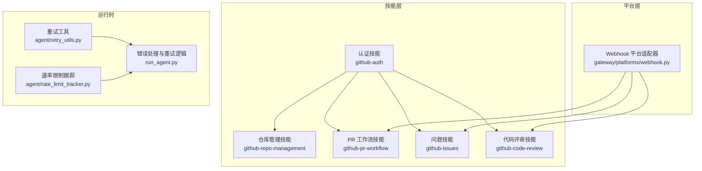
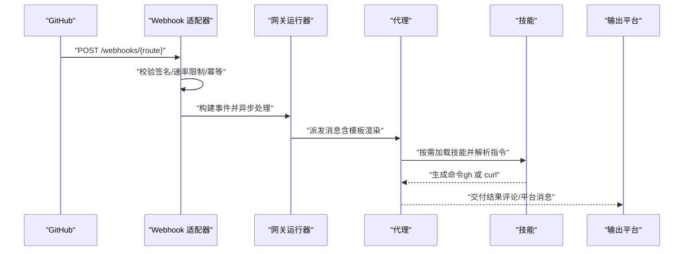
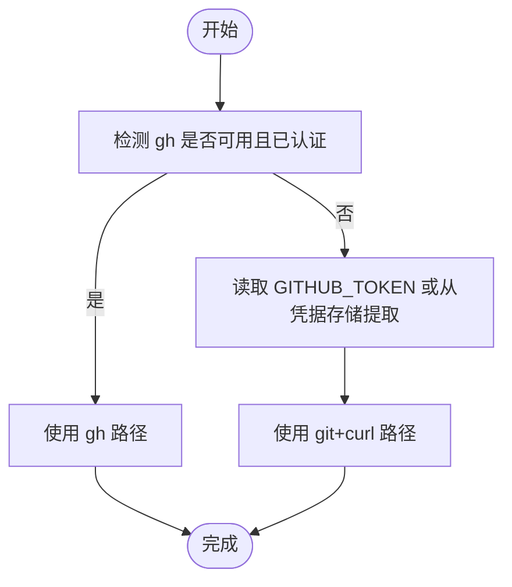
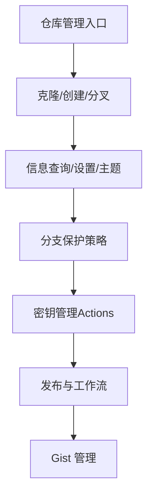
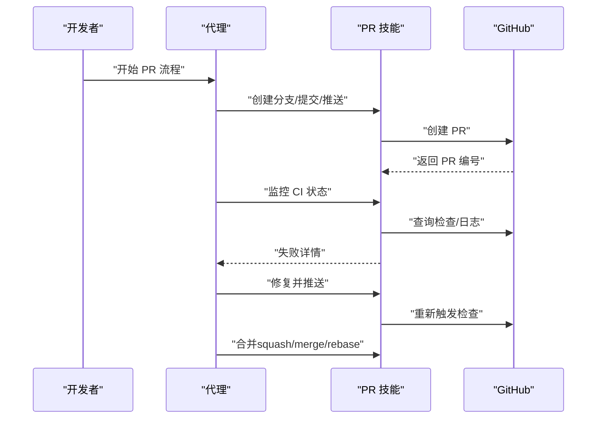
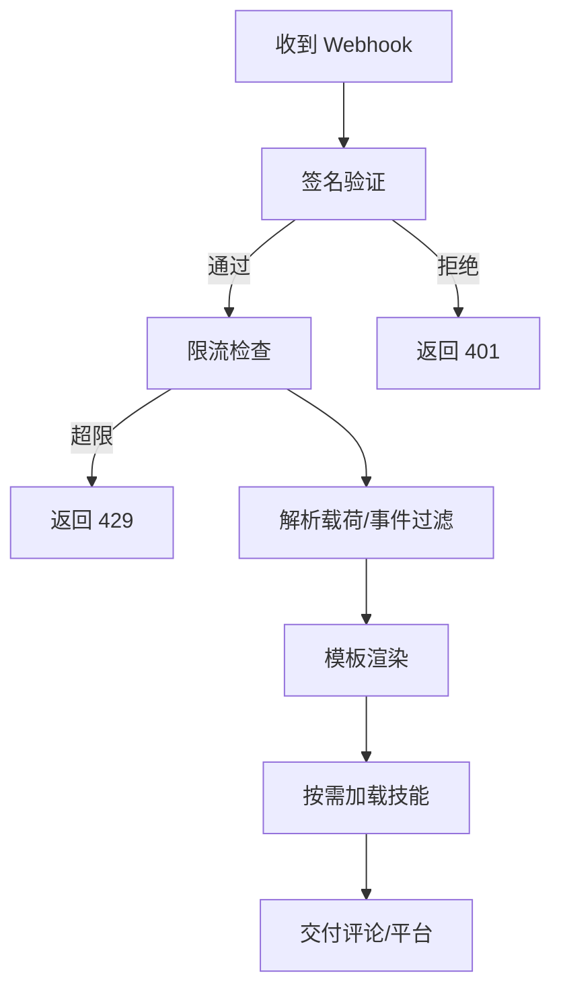
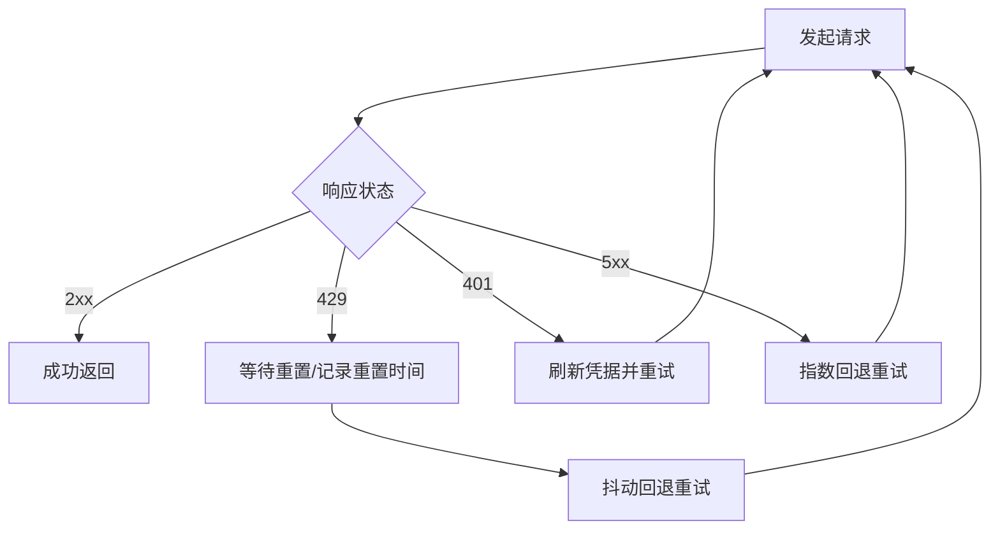
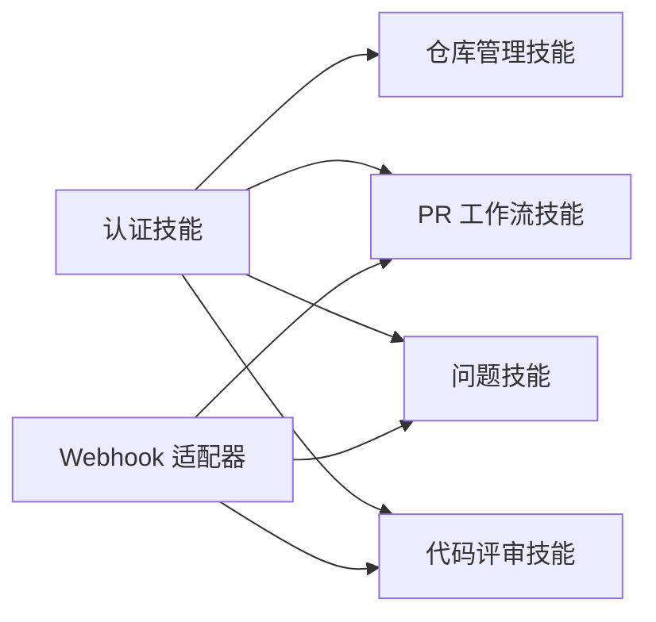

# 仓库管理

<cite>
**本文引用的文件**
- [SKILL.md（仓库管理）](file://skills/github/github-repo-management/SKILL.md)
- [SKILL.md（认证）](file://skills/github/github-auth/SKILL.md)
- [SKILL.md（PR 工作流）](file://skills/github/github-pr-workflow/SKILL.md)
- [SKILL.md（问题）](file://skills/github/github-issues/SKILL.md)
- [SKILL.md（代码评审）](file://skills/github/github-code-review/SKILL.md)
- [webhook 平台适配器](file://gateway/platforms/webhook.py)
- [webhook 路由配置示例](file://website/docs/user-guide/messaging/webhooks.md)
- [webhook 订阅技能](file://skills/devops/webhook-subscriptions/SKILL.md)
- [重试工具](file://agent/retry_utils.py)
- [速率限制跟踪](file://agent/rate_limit_tracker.py)
- [运行代理中的错误处理与重试逻辑](file://run_agent.py)
- [安全扫描与审批流程](file://tools/approval.py)
- [恢复技术参考（含 Git 恢复）](file://optional-skills/security/oss-forensics/references/recovery-techniques.md)
- [技能目录（GitHub 技能总览）](file://website/docs/reference/skills-catalog.md)
</cite>

## 目录
1. [简介](#简介)
2. [项目结构](#项目结构)
3. [核心组件](#核心组件)
4. [架构总览](#架构总览)
5. [详细组件分析](#详细组件分析)
6. [依赖分析](#依赖分析)
7. [性能考虑](#性能考虑)
8. [故障排查指南](#故障排查指南)
9. [结论](#结论)
10. [附录](#附录)

## 简介
本文件面向使用 Hermes Agent 自动化管理 GitHub 仓库的用户与工程师，系统讲解如何通过技能与平台能力实现仓库的创建、克隆、分叉、信息查询、设置与保护规则、密钥与发布、工作流与 Gist 等全链路操作；同时覆盖批量操作、权限与组织治理、API 限制处理、错误重试与监控告警、仓库迁移与权限变更、合规性检查等企业级主题，并提供可落地的实践范式与图示。

## 项目结构
围绕 GitHub 仓库管理，Hermes Agent 提供了多技能协同与平台扩展能力：
- 技能层：认证、仓库管理、PR 工作流、问题、代码评审等，均提供 gh 与 git+curl 双路径实现，确保在不同环境下的可用性。
- 平台层：Webhook 适配器支持从 GitHub 等源接收事件，触发代理执行并回传结果到多种消息平台或直接评论 PR。
- 运行时：内置重试与速率限制跟踪，配合错误分类与恢复策略，提升自动化稳定性。

**图表来源**
- [SKILL.md（认证）](file://skills/github/github-auth/SKILL.md)
- [SKILL.md（仓库管理）](file://skills/github/github-repo-management/SKILL.md)
- [SKILL.md（PR 工作流）](file://skills/github/github-pr-workflow/SKILL.md)
- [SKILL.md（问题）](file://skills/github/github-issues/SKILL.md)
- [SKILL.md（代码评审）](file://skills/github/github-code-review/SKILL.md)
- [webhook 平台适配器](file://gateway/platforms/webhook.py)
- [重试工具](file://agent/retry_utils.py)
- [速率限制跟踪](file://agent/rate_limit_tracker.py)
- [运行代理中的错误处理与重试逻辑](file://run_agent.py)

**章节来源**
- [技能目录（GitHub 技能总览）](file://website/docs/reference/skills-catalog.md)

## 核心组件
- 认证与检测：自动识别 gh 或 git+curl 的可用性与认证状态，统一注入到后续命令中，保证跨环境一致性。
- 仓库生命周期：克隆、创建、分叉、信息查询、设置编辑、分支保护、密钥与发布、工作流与 Gist。
- PR/Issue 流程：分支创建、提交、推送、PR 创建、CI 监控、失败诊断与修复、合并策略与自动合并。
- 安全与合规：密钥加密与上传、安全扫描与审批、Git 历史恢复与取证。
- 监控与告警：Webhook 接收与路由、签名验证、重复幂等、速率限制、跨平台投递与 GitHub 评论投递。

**章节来源**
- [SKILL.md（认证）](file://skills/github/github-auth/SKILL.md)
- [SKILL.md（仓库管理）](file://skills/github/github-repo-management/SKILL.md)
- [SKILL.md（PR 工作流）](file://skills/github/github-pr-workflow/SKILL.md)
- [SKILL.md（问题）](file://skills/github/github-issues/SKILL.md)
- [SKILL.md（代码评审）](file://skills/github/github-code-review/SKILL.md)
- [webhook 平台适配器](file://gateway/platforms/webhook.py)

## 架构总览
下图展示从 GitHub 事件到代理执行再到结果投递的端到端流程，强调 webhook 触发、技能加载、命令执行与交付路径。

**图表来源**
- [webhook 平台适配器](file://gateway/platforms/webhook.py)
- [webhook 路由配置示例](file://website/docs/user-guide/messaging/webhooks.md)

## 详细组件分析

### 组件一：认证与环境检测（github-auth）
- 自动检测 gh 是否已安装且已认证，否则回退到 git+curl 路径。
- 支持 HTTPS Token 与 SSH 两种凭据方式，提供凭证缓存与身份配置建议。
- 提供统一的认证方法选择与环境变量注入模式，贯穿其他技能。

**图表来源**
- [SKILL.md（认证）](file://skills/github/github-auth/SKILL.md)

**章节来源**
- [SKILL.md（认证）](file://skills/github/github-auth/SKILL.md)

### 组件二：仓库管理（github-repo-management）
- 克隆：支持 HTTPS/SSH 与浅克隆、指定分支。
- 创建：支持个人与组织仓库创建、从模板生成、本地目录推送。
- 分叉与同步：fork 后添加上游并保持同步。
- 信息查询：仓库详情、列表、搜索。
- 设置与主题：描述、可见性、默认分支、主题标签。
- 分支保护：严格检查、管理员强制、审查要求、限制。
- 密钥管理：Actions 密钥设置、列表、删除（gh 更简洁，curl 需公钥加密）。
- 发布与工作流：创建发布、列出、下载资产；列出/查看/重跑工作流与日志。
- Gist：创建与列表。

**图表来源**
- [SKILL.md（仓库管理）](file://skills/github/github-repo-management/SKILL.md)

**章节来源**
- [SKILL.md（仓库管理）](file://skills/github/github-repo-management/SKILL.md)

### 组件三：PR 工作流（github-pr-workflow）
- 分支策略：基于约定命名的分支类型（feat/fix/refactor/docs/ci）。
- 提交与推送：使用约定式提交消息，推送至远程。
- PR 创建：支持草稿、审阅者、标签、基线分支等参数。
- CI 监控：检查状态、轮询、失败日志下载与分析。
- 自动修复：循环读取失败原因、定位问题、修改后推送、再次检查。
- 合并策略：squash/merge/rebase，支持启用自动合并（REST/GraphQL）。

**图表来源**
- [SKILL.md（PR 工作流）](file://skills/github/github-pr-workflow/SKILL.md)

**章节来源**
- [SKILL.md（PR 工作流）](file://skills/github/github-pr-workflow/SKILL.md)

### 组件四：问题管理（github-issues）
- 列表/视图/搜索：按状态、标签、指派人筛选。
- 创建：标题、正文、标签、指派。
- 管理：增删标签、指派、评论、关闭/重开。
- 链接 PR：通过关键字自动关闭关联 Issue。
- 批量操作：结合 API 与脚本进行批量关闭等。

**章节来源**
- [SKILL.md（问题）](file://skills/github/github-issues/SKILL.md)

### 组件五：代码评审（github-code-review）
- 本地预检：diff 统计、冲突标记、敏感词与大文件检查。
- PR 评审：查看差异、本地检出、逐文件上下文阅读、行内评论与正式评审（approve/request-changes/comment）。
- 复合评审：一次提交多条行内评论的原子评审。

**章节来源**
- [SKILL.md（代码评审）](file://skills/github/github-code-review/SKILL.md)

### 组件六：Webhook 与监控告警（gateway/platforms/webhook.py）
- 安全：HMAC-SHA256 签名验证（GitHub/GitLab/通用），全局或路由级密钥。
- 性能：固定窗口限流、请求体大小限制、幂等缓存（按 delivery_id）。
- 交付：日志、GitHub 评论、跨平台投递（Telegram/Discord/Slack 等）。
- 动态路由：热加载订阅配置，静态优先于动态。
- 模板渲染：支持点号访问嵌套字段与 {__raw__} 输出完整载荷。

**图表来源**
- [webhook 平台适配器](file://gateway/platforms/webhook.py)
- [webhook 路由配置示例](file://website/docs/user-guide/messaging/webhooks.md)

**章节来源**
- [webhook 平台适配器](file://gateway/platforms/webhook.py)
- [webhook 路由配置示例](file://website/docs/user-guide/messaging/webhooks.md)
- [webhook 订阅技能](file://skills/devops/webhook-subscriptions/SKILL.md)

### 组件七：API 限制处理与错误重试
- 重试策略：抖动指数回退，避免并发“惊群”。
- 速率限制：解析 x-ratelimit-* 头，格式化显示与告警。
- 错误分类：429、401、5xx 等区分是否可重试与恢复。
- 代理层：记录 retry-after、x-ratelimit-reset 等头，推导重置时间。

**图表来源**
- [重试工具](file://agent/retry_utils.py)
- [速率限制跟踪](file://agent/rate_limit_tracker.py)
- [运行代理中的错误处理与重试逻辑](file://run_agent.py)

**章节来源**
- [重试工具](file://agent/retry_utils.py)
- [速率限制跟踪](file://agent/rate_limit_tracker.py)
- [运行代理中的错误处理与重试逻辑](file://run_agent.py)

### 组件八：安全扫描与审批
- 危险命令检测：结合 Tirith 扫描与危险模式匹配，提供会话/永久/仅一次三种批准策略。
- 审批持久化：允许用户在不同粒度上持久放行，便于团队治理。

**章节来源**
- [安全扫描与审批流程](file://tools/approval.py)

### 组件九：仓库迁移、权限变更与合规检查
- 迁移：通过迁移技能将旧配置迁移到新环境，支持预设与选择性迁移项。
- 权限变更：结合认证与组织治理策略，确保最小权限与审计轨迹。
- 合规：密钥加密上传、安全扫描、审批流程、日志与告警联动。

**章节来源**
- [webhook 订阅技能](file://skills/devops/webhook-subscriptions/SKILL.md)
- [安全扫描与审批流程](file://tools/approval.py)

## 依赖分析
- 技能间耦合：仓库管理依赖认证；PR/Issue/评审均依赖认证与远程仓库上下文；Webhook 作为外部事件入口驱动技能执行。
- 外部依赖：GitHub API、gh CLI、各消息平台 SDK。
- 平台扩展：Webhook 适配器可扩展为任意事件源，通过模板与路由配置实现即插即用。

**图表来源**
- [SKILL.md（认证）](file://skills/github/github-auth/SKILL.md)
- [SKILL.md（仓库管理）](file://skills/github/github-repo-management/SKILL.md)
- [SKILL.md（PR 工作流）](file://skills/github/github-pr-workflow/SKILL.md)
- [SKILL.md（问题）](file://skills/github/github-issues/SKILL.md)
- [SKILL.md（代码评审）](file://skills/github/github-code-review/SKILL.md)
- [webhook 平台适配器](file://gateway/platforms/webhook.py)

## 性能考虑
- 批量操作：利用 API 与脚本组合，减少交互次数；对 CI 失败采用轮询与指数回退结合。
- 速率控制：依据 x-ratelimit-* 头动态调整节奏，必要时降级为更少的并发。
- 存储与网络：浅克隆、按需拉取、缓存凭据与令牌，避免重复认证。
- 幂等与去重：Webhook 层面以 delivery_id 去重，防止重复执行。

## 故障排查指南
- 认证失败：确认 gh 已登录或 GITHUB_TOKEN 正确；检查凭据存储与身份配置。
- 401/403：检查 token scopes 与组织权限；必要时刷新凭据。
- 429：根据 retry-after 或 x-ratelimit-reset 推导重置时间，采用抖动回退。
- Webhook 未触发：检查签名密钥、事件类型过滤、路由配置与健康检查。
- GitHub 评论失败：确认 gh CLI 安装与认证，或改用跨平台投递。

**章节来源**
- [SKILL.md（认证）](file://skills/github/github-auth/SKILL.md)
- [运行代理中的错误处理与重试逻辑](file://run_agent.py)
- [webhook 平台适配器](file://gateway/platforms/webhook.py)

## 结论
通过认证检测、仓库管理、PR/Issue/评审、Webhook 监控与安全审批的协同，Hermes Agent 能够在多样化环境中稳定地自动化管理 GitHub 仓库。结合 API 限制处理与错误重试策略，可进一步提升可靠性与可观测性；借助 webhook 与跨平台投递，实现从事件到动作的闭环。

## 附录

### 实战范式与最佳实践
- 批量操作：使用 curl + jq + while 循环对 Issue/PR 进行批量关闭、标签更新与状态切换。
- 权限管理：为组织仓库设置最小权限 token，定期轮换；对敏感操作启用审批。
- 组织治理：统一分支保护策略、PR 审查要求与自动合并开关；通过 webhook 触发合规检查与通知。
- 备份与恢复：利用 Git 历史恢复技术（fetch by SHA、fsck 查找悬空提交）进行取证与恢复。
- 监控告警：配置 webhook 路由，将关键事件（PR、Push、CI 失败）投递到消息平台或直接评论 PR。

**章节来源**
- [SKILL.md（仓库管理）](file://skills/github/github-repo-management/SKILL.md)
- [恢复技术参考（含 Git 恢复）](file://optional-skills/security/oss-forensics/references/recovery-techniques.md)
- [webhook 路由配置示例](file://website/docs/user-guide/messaging/webhooks.md)