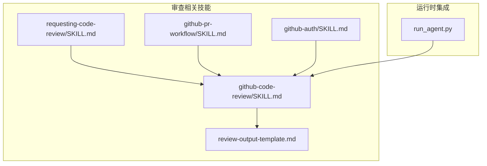
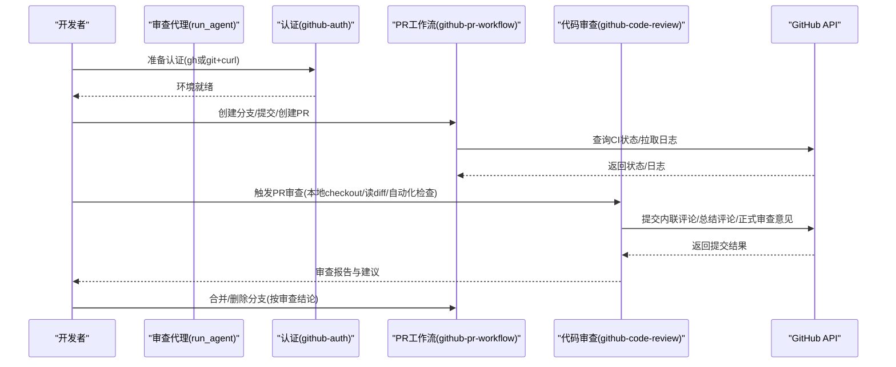
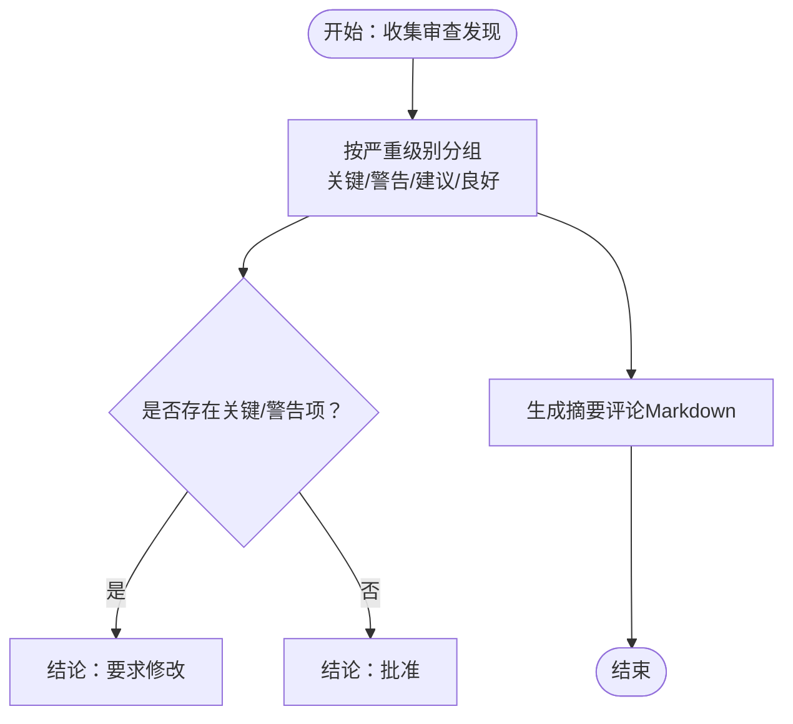
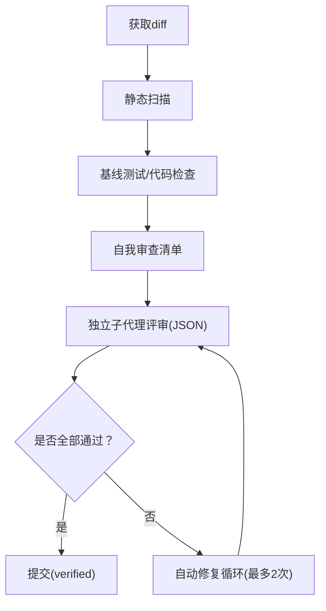
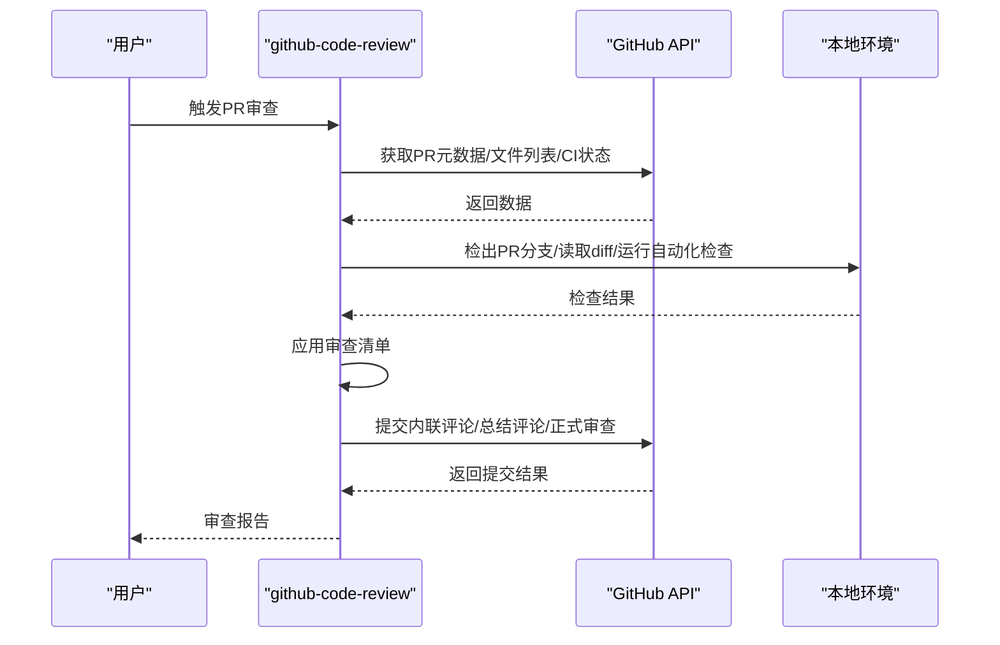
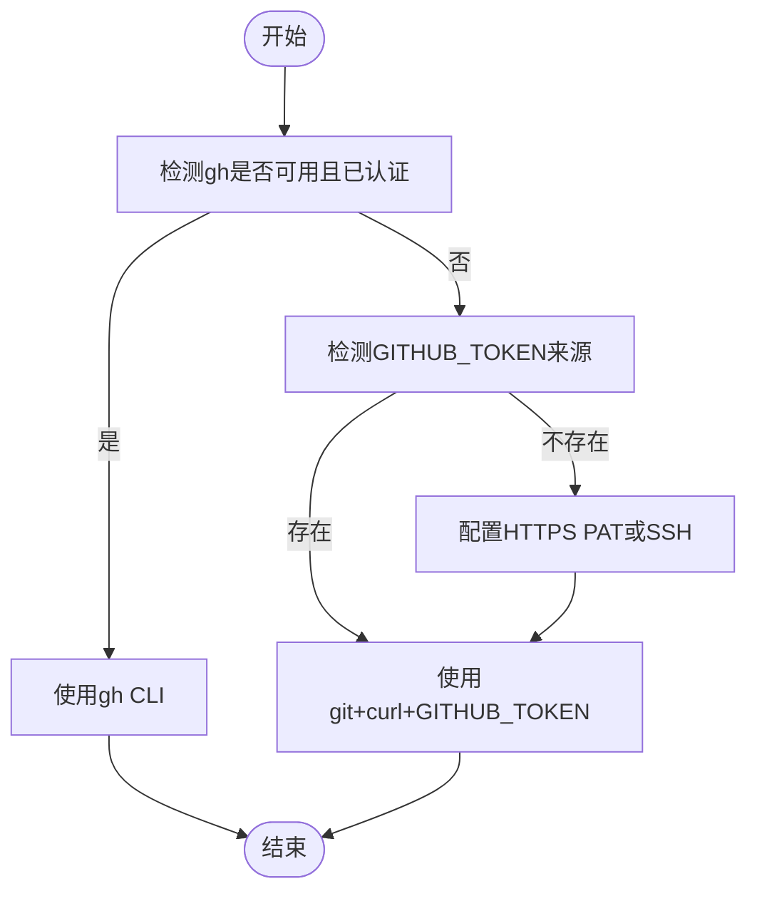
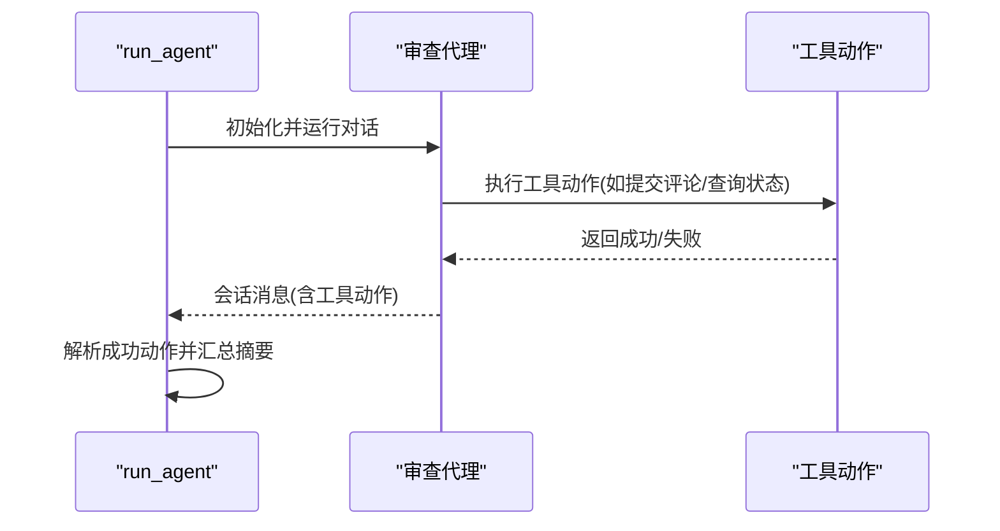
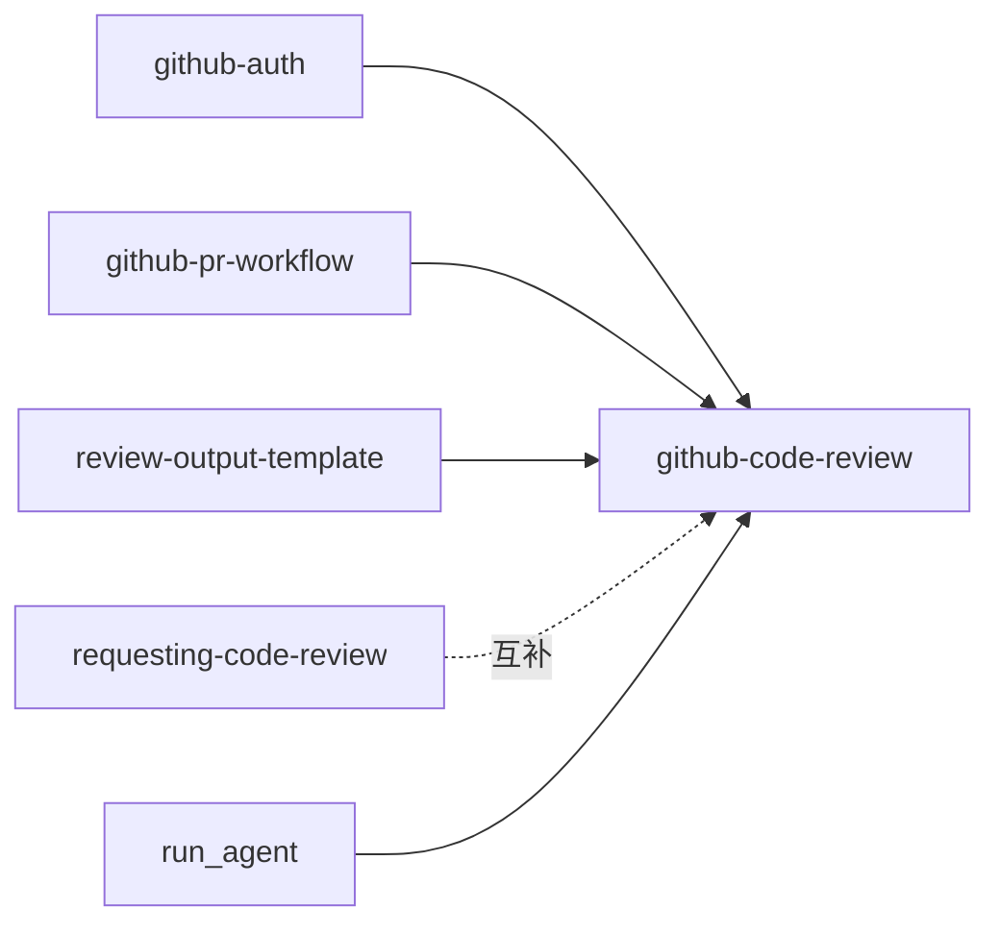

# 代码审查

<cite>
**本文引用的文件**
- [github-code-review/SKILL.md](file://skills/github/github-code-review/SKILL.md)
- [review-output-template.md](file://skills/github/github-code-review/references/review-output-template.md)
- [github-pr-workflow/SKILL.md](file://skills/github/github-pr-workflow/SKILL.md)
- [github-auth/SKILL.md](file://skills/github/github-auth/SKILL.md)
- [requesting-code-review/SKILL.md](file://skills/software-development/requesting-code-review/SKILL.md)
- [run_agent.py](file://run_agent.py)
- [README.md](file://README.md)
</cite>

## 目录
1. [简介](#简介)
2. [项目结构](#项目结构)
3. [核心组件](#核心组件)
4. [架构总览](#架构总览)
5. [详细组件分析](#详细组件分析)
6. [依赖关系分析](#依赖关系分析)
7. [性能考量](#性能考量)
8. [故障排查指南](#故障排查指南)
9. [结论](#结论)
10. [附录](#附录)

## 简介
本文件面向使用 Hermes Agent 自动化 GitHub Pull Request 代码审查的团队与个人，系统讲解如何基于仓库中的技能与工具，完成从自动化检查到人工复核再到结果反馈的完整审查流程。内容覆盖：
- 审查模板与输出格式（摘要与内联评论）
- 审查规则、质量标准与安全检查清单
- 完整的 PR 审查工作流（含本地预审与线上 PR 流程）
- 审查报告生成、关键指标统计与改进建议
- 冲突处理、重复评论与审查者分配等实践问题

## 项目结构
围绕代码审查的关键文件主要分布在以下位置：
- 审查技能：skills/github/github-code-review
- 预提交验证：skills/software-development/requesting-code-review
- PR 生命周期：skills/github/github-pr-workflow
- 认证前置：skills/github/github-auth
- 模板与参考：github-code-review/references 下的 review 输出模板
- 运行时集成：run_agent.py 中对“审查代理”的调用与动作汇总

**图表来源**
- [github-code-review/SKILL.md:1-481](file://skills/github/github-code-review/SKILL.md#L1-L481)
- [requesting-code-review/SKILL.md:1-283](file://skills/software-development/requesting-code-review/SKILL.md#L1-L283)
- [github-pr-workflow/SKILL.md:1-367](file://skills/github/github-pr-workflow/SKILL.md#L1-L367)
- [github-auth/SKILL.md:1-247](file://skills/github/github-auth/SKILL.md#L1-L247)
- [review-output-template.md:1-75](file://skills/github/github-code-review/references/review-output-template.md#L1-L75)
- [run_agent.py:2136-2164](file://run_agent.py#L2136-L2164)

**章节来源**
- [README.md:1-179](file://README.md#L1-L179)

## 核心组件
- 审查模板与输出规范：用于生成 PR 总结评论与内联评论，统一严重级别与结论判定。
- 预提交验证流水线：在本地变更落地前进行静态扫描、基线回归与独立子代理评审，自动修复循环。
- PR 生命周期管理：分支、提交、创建 PR、监控 CI、自动修复失败、合并等。
- 认证与环境准备：支持 gh CLI 与 git+curl 双路径认证，自动检测可用方案。

**章节来源**
- [github-code-review/SKILL.md:1-481](file://skills/github/github-code-review/SKILL.md#L1-L481)
- [review-output-template.md:1-75](file://skills/github/github-code-review/references/review-output-template.md#L1-L75)
- [requesting-code-review/SKILL.md:1-283](file://skills/software-development/requesting-code-review/SKILL.md#L1-L283)
- [github-pr-workflow/SKILL.md:1-367](file://skills/github/github-pr-workflow/SKILL.md#L1-L367)
- [github-auth/SKILL.md:1-247](file://skills/github/github-auth/SKILL.md#L1-L247)

## 架构总览
Hermes Agent 的代码审查由“本地预审 + GitHub PR 审查 + 结果反馈”三段式构成，结合认证与 PR 工作流技能，形成可扩展、可回放的自动化闭环。

**图表来源**
- [github-auth/SKILL.md:20-232](file://skills/github/github-auth/SKILL.md#L20-L232)
- [github-pr-workflow/SKILL.md:103-327](file://skills/github/github-pr-workflow/SKILL.md#L103-L327)
- [github-code-review/SKILL.md:330-474](file://skills/github/github-code-review/SKILL.md#L330-L474)
- [run_agent.py:2136-2164](file://run_agent.py#L2136-L2164)

## 详细组件分析

### 组件一：审查模板与输出格式
- 摘要评论结构：包含结论（批准/要求修改/仅评论）、PR 元信息、文件变更统计、严重级别分组（关键/警告/建议/良好）。
- 严重级别与结论判定：明确何时阻塞合并，何时仅建议。
- 内联评论规范：以严重图标开头，便于扫描；支持多条内联评论原子提交。
- 本地预审输出：与摘要评论一致，但省略 PR 元信息头。

**图表来源**
- [review-output-template.md:1-75](file://skills/github/github-code-review/references/review-output-template.md#L1-L75)
- [github-code-review/SKILL.md:440-467](file://skills/github/github-code-review/SKILL.md#L440-L467)

**章节来源**
- [review-output-template.md:1-75](file://skills/github/github-code-review/references/review-output-template.md#L1-L75)
- [github-code-review/SKILL.md:440-467](file://skills/github/github-code-review/SKILL.md#L440-L467)

### 组件二：预提交验证流水线（本地预审）
- 获取差异：支持大差异拆分逐文件审查。
- 静态安全扫描：硬编码密钥、命令注入、危险函数、反序列化、SQL 注入等。
- 基线测试与 Lint：检测语言自动选择，先保存现场运行基线，再对比新增失败。
- 自我审查清单：提交前快速自查。
- 独立子代理评审：fail-closed，严格 JSON 输出，自动修复循环最多两次。
- 提交：通过后打上“verified”前缀。

**图表来源**
- [requesting-code-review/SKILL.md:35-283](file://skills/software-development/requesting-code-review/SKILL.md#L35-L283)

**章节来源**
- [requesting-code-review/SKILL.md:1-283](file://skills/software-development/requesting-code-review/SKILL.md#L1-L283)

### 组件三：PR 审查工作流（线上）
- 环境准备：自动检测 gh 或 git+curl，设置 owner/repo。
- 收集上下文：PR 元数据、变更文件列表、CI 状态。
- 本地检出：便于使用文件工具与测试。
- 本地自动化检查：测试、lint。
- 应用审查清单：正确性、安全性、代码质量、测试、性能、文档。
- 提交审查：内联评论 + 总结评论 + 正式审查结论（批准/要求修改/仅评论）。
- 清理：切回主分支并删除临时分支。

**图表来源**
- [github-code-review/SKILL.md:330-474](file://skills/github/github-code-review/SKILL.md#L330-L474)
- [github-pr-workflow/SKILL.md:151-210](file://skills/github/github-pr-workflow/SKILL.md#L151-L210)

**章节来源**
- [github-code-review/SKILL.md:330-474](file://skills/github/github-code-review/SKILL.md#L330-L474)
- [github-pr-workflow/SKILL.md:151-210](file://skills/github/github-pr-workflow/SKILL.md#L151-L210)

### 组件四：认证与环境准备
- 自动检测：优先 gh，否则回退到 git+curl；token 来源支持环境变量、git 凭据存储、.env 文件。
- 方法一：git-only（HTTPS PAT 或 SSH），适合无 gh 的环境。
- 方法二：gh CLI，交互式或令牌登录，同时配置 git 凭据。
- API 使用：未安装 gh 时，使用 curl + GITHUB_TOKEN 调用 GitHub REST API。

**图表来源**
- [github-auth/SKILL.md:20-232](file://skills/github/github-auth/SKILL.md#L20-L232)

**章节来源**
- [github-auth/SKILL.md:1-247](file://skills/github/github-auth/SKILL.md#L1-L247)

### 组件五：运行时集成与动作汇总
- 审查代理调用：在 run_agent 中创建独立审查代理，执行对话并收集工具动作成功记录，汇总为简洁摘要反馈给用户。
- 适用场景：在 PR 审查流程中，作为“子代理”执行审查任务，避免上下文污染。

**图表来源**
- [run_agent.py:2136-2164](file://run_agent.py#L2136-L2164)

**章节来源**
- [run_agent.py:2136-2164](file://run_agent.py#L2136-L2164)

## 依赖关系分析
- github-code-review 依赖：
  - github-auth：认证与环境准备
  - github-pr-workflow：PR 生命周期与 CI 监控
  - review-output-template：输出格式与严重级别
- requesting-code-review 与 github-code-review 并行互补：前者在本地预审，后者在线上 PR 审查
- run_agent.py 作为运行时集成点，协调审查代理与工具动作

**图表来源**
- [github-auth/SKILL.md:1-247](file://skills/github/github-auth/SKILL.md#L1-L247)
- [github-pr-workflow/SKILL.md:1-367](file://skills/github/github-pr-workflow/SKILL.md#L1-L367)
- [github-code-review/SKILL.md:1-481](file://skills/github/github-code-review/SKILL.md#L1-L481)
- [review-output-template.md:1-75](file://skills/github/github-code-review/references/review-output-template.md#L1-L75)
- [requesting-code-review/SKILL.md:1-283](file://skills/software-development/requesting-code-review/SKILL.md#L1-L283)
- [run_agent.py:2136-2164](file://run_agent.py#L2136-L2164)

**章节来源**
- [github-auth/SKILL.md:1-247](file://skills/github/github-auth/SKILL.md#L1-L247)
- [github-pr-workflow/SKILL.md:1-367](file://skills/github/github-pr-workflow/SKILL.md#L1-L367)
- [github-code-review/SKILL.md:1-481](file://skills/github/github-code-review/SKILL.md#L1-L481)
- [review-output-template.md:1-75](file://skills/github/github-code-review/references/review-output-template.md#L1-L75)
- [requesting-code-review/SKILL.md:1-283](file://skills/software-development/requesting-code-review/SKILL.md#L1-L283)
- [run_agent.py:2136-2164](file://run_agent.py#L2136-L2164)

## 性能考量
- 大型 PR 分片审查：优先按文件逐个 diff，降低上下文压力与工具调用成本。
- 自动化检查批量化：测试与 lint 在本地执行，减少重复网络请求。
- 重复评论与冲突处理：内联评论采用原子提交，避免重复与冲突；若出现冲突，建议先清理临时分支并重试。
- 审查者分配：可通过 PR 请求审查接口指定审查者，减少无效往返。

[本节为通用指导，不直接分析具体文件]

## 故障排查指南
- 认证失败
  - 症状：git push 报权限错误或 gh auth 状态异常
  - 排查：确认 token scopes 包含 repo/workflow；使用 git credential reject 清理缓存后重新认证；若无 gh，确保 GITHUB_TOKEN 设置正确
- CI 失败
  - 症状：CI 状态失败或错误
  - 排查：使用 PR 工作流技能列出与查看失败日志，定位具体作业；修复后推送并等待再次检查
- 审查冲突与重复评论
  - 症状：内联评论重复或冲突
  - 排查：采用原子提交方式一次性提交多条评论；必要时清理临时分支后重试
- 审查者分配
  - 症状：无人审查或审查者过多
  - 排查：使用请求审查接口指定合适审查者；或在 PR 描述中标注审查者

**章节来源**
- [github-auth/SKILL.md:236-247](file://skills/github/github-auth/SKILL.md#L236-L247)
- [github-pr-workflow/SKILL.md:211-275](file://skills/github/github-pr-workflow/SKILL.md#L211-L275)
- [github-code-review/SKILL.md:203-276](file://skills/github/github-code-review/SKILL.md#L203-L276)

## 结论
通过将“预提交验证流水线 + PR 审查工作流 + 审查模板与认证准备”有机结合，Hermes Agent 能够为团队提供一套可复制、可审计、可自动化的代码审查体系。配合独立子代理评审与原子化评论提交，既保证了审查质量，也降低了沟通成本与冲突风险。

[本节为总结性内容，不直接分析具体文件]

## 附录

### 审查规则与质量标准速览
- 正确性：边界条件、错误路径、并发访问
- 安全性：硬编码密钥、输入校验、SQL 注入、XSS、路径遍历、eval/exec、反序列化
- 代码质量：命名清晰、单一职责、DRY、避免过度抽象
- 测试：新路径覆盖、正向与异常、测试可读性
- 性能：避免 N+1 查询、适当缓存、异步路径非阻塞
- 文档：公共 API 文档、非显式逻辑注释、行为变更需更新 README

**章节来源**
- [github-code-review/SKILL.md:279-314](file://skills/github/github-code-review/SKILL.md#L279-L314)

### 审查报告生成与关键指标
- 报告结构：结论、PR 元信息、文件变更统计、严重级别分组、摘要评论
- 关键指标：关键/警告/建议数量、文件数、增删行数、CI 状态
- 改进建议：针对重复逻辑、命名、测试缺失、性能瓶颈提出具体修复建议

**章节来源**
- [review-output-template.md:1-75](file://skills/github/github-code-review/references/review-output-template.md#L1-L75)
- [github-code-review/SKILL.md:440-467](file://skills/github/github-code-review/SKILL.md#L440-L467)

### 完整 PR 审查工作流示例（步骤化）
- 环境准备：检测认证方式，提取 owner/repo
- 收集上下文：PR 元数据、变更文件、CI 状态
- 本地检出：检出 PR 分支，读取 diff，运行自动化检查
- 应用审查清单：逐项检查并记录发现
- 提交审查：内联评论 + 总结评论 + 正式审查结论
- 清理：切换主分支并删除临时分支

**章节来源**
- [github-code-review/SKILL.md:330-474](file://skills/github/github-code-review/SKILL.md#L330-L474)
- [github-pr-workflow/SKILL.md:151-210](file://skills/github/github-pr-workflow/SKILL.md#L151-L210)