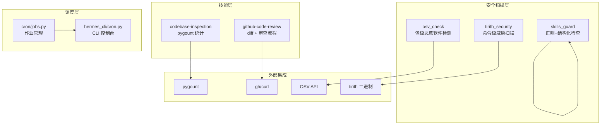
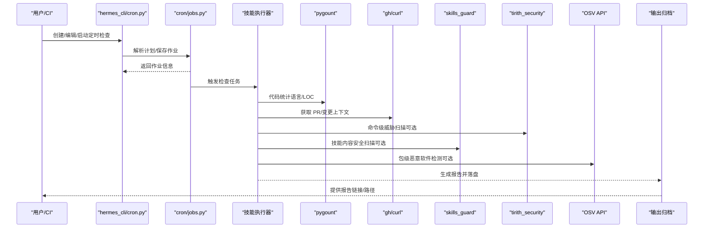
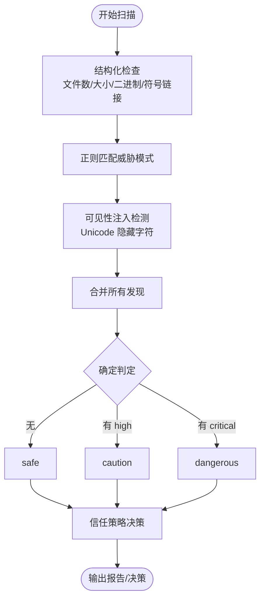
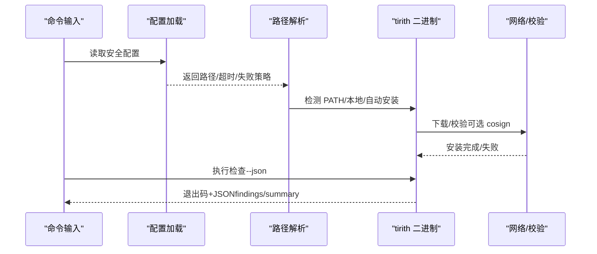
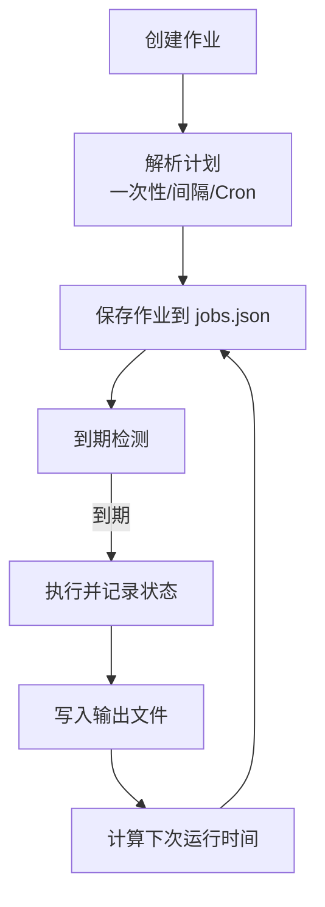
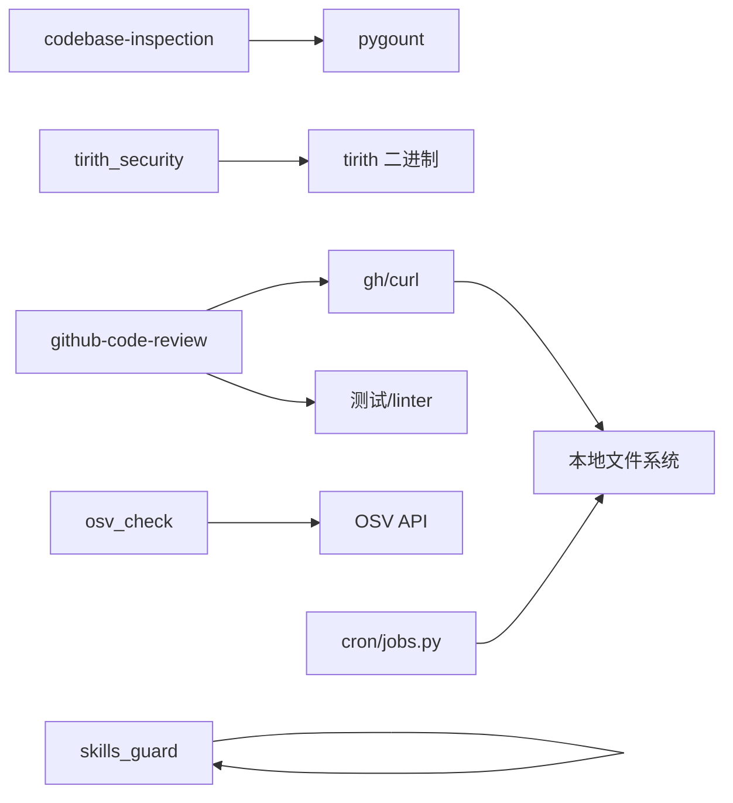

# 代码库检查

<cite>
**本文引用的文件**
- [skills/github/codebase-inspection/SKILL.md](file://skills/github/codebase-inspection/SKILL.md)
- [skills/github/github-code-review/SKILL.md](file://skills/github/github-code-review/SKILL.md)
- [tools/skills_guard.py](file://tools/skills_guard.py)
- [tools/tirith_security.py](file://tools/tirith_security.py)
- [tools/osv_check.py](file://tools/osv_check.py)
- [cron/jobs.py](file://cron/jobs.py)
- [hermes_cli/cron.py](file://hermes_cli/cron.py)
- [.github/workflows/supply-chain-audit.yml](file://.github/workflows/supply-chain-audit.yml)
- [website/docs/reference/skills-catalog.md](file://website/docs/reference/skills-catalog.md)
</cite>

## 目录
1. [简介](#简介)
2. [项目结构](#项目结构)
3. [核心组件](#核心组件)
4. [架构总览](#架构总览)
5. [详细组件分析](#详细组件分析)
6. [依赖关系分析](#依赖关系分析)
7. [性能考虑](#性能考虑)
8. [故障排查指南](#故障排查指南)
9. [结论](#结论)
10. [附录](#附录)

## 简介
本文件面向使用 Hermes Agent 对 GitHub 仓库进行自动化代码检查与分析的场景，系统性说明如何通过内置技能与安全扫描工具实现：
- 代码扫描配置与规则（静态分析、质量与安全）
- 输出格式与报告呈现
- 集成外部工具链（如 pygount、linters、curl/gh）
- 定期检查与报告归档
- 大规模代码库的性能优化与策略

目标是帮助用户从零到一落地“代码库检查”工作流，并在持续集成与日常开发中稳定运行。

## 项目结构
围绕“代码库检查”的关键位置包括：
- 技能层：位于 skills/github 下的 codebase-inspection 与 github-code-review，分别负责仓库统计与 PR/本地变更审查
- 安全扫描层：tools 目录下的 skills_guard（技能内容安全扫描）、tirith_security（命令级威胁扫描）、osv_check（包级恶意软件检测）
- 调度层：cron 子系统用于定时任务编排与输出归档
- 文档与模板：网站文档与 GitHub 工作流示例

图示来源
- [skills/github/codebase-inspection/SKILL.md:1-116](file://skills/github/codebase-inspection/SKILL.md#L1-L116)
- [skills/github/github-code-review/SKILL.md:1-481](file://skills/github/github-code-review/SKILL.md#L1-L481)
- [tools/skills_guard.py:1-978](file://tools/skills_guard.py#L1-L978)
- [tools/tirith_security.py:1-671](file://tools/tirith_security.py#L1-L671)
- [tools/osv_check.py:1-156](file://tools/osv_check.py#L1-L156)
- [cron/jobs.py:1-763](file://cron/jobs.py#L1-L763)
- [hermes_cli/cron.py:235-279](file://hermes_cli/cron.py#L235-L279)

章节来源
- [skills/github/codebase-inspection/SKILL.md:1-116](file://skills/github/codebase-inspection/SKILL.md#L1-L116)
- [skills/github/github-code-review/SKILL.md:1-481](file://skills/github/github-code-review/SKILL.md#L1-L481)
- [tools/skills_guard.py:1-978](file://tools/skills_guard.py#L1-L978)
- [tools/tirith_security.py:1-671](file://tools/tirith_security.py#L1-L671)
- [tools/osv_check.py:1-156](file://tools/osv_check.py#L1-L156)
- [cron/jobs.py:1-763](file://cron/jobs.py#L1-L763)
- [hermes_cli/cron.py:235-279](file://hermes_cli/cron.py#L235-L279)

## 核心组件
- 代码统计与语言组成：使用 pygount 进行按语言的文件数、代码行、注释行统计；支持过滤目录与输出格式
- 代码审查：基于 git diff 的本地预检或 PR 审查，结合测试与 linter 执行；支持结构化输出与批量评论
- 技能安全扫描：对技能内容进行正则匹配与结构化检查，判定信任级别与安装策略
- 命令级威胁扫描：调用 tirith 二进制对命令进行内容级威胁检测，支持自动下载与校验
- 包级恶意软件检测：查询 OSV API，仅阻断已知恶意软件（MAL-*），常规 CVE 忽略
- 定时任务：统一的作业生命周期管理、调度计算、输出落盘与状态追踪

章节来源
- [skills/github/codebase-inspection/SKILL.md:1-116](file://skills/github/codebase-inspection/SKILL.md#L1-L116)
- [skills/github/github-code-review/SKILL.md:1-481](file://skills/github/github-code-review/SKILL.md#L1-L481)
- [tools/skills_guard.py:1-978](file://tools/skills_guard.py#L1-L978)
- [tools/tirith_security.py:1-671](file://tools/tirith_security.py#L1-L671)
- [tools/osv_check.py:1-156](file://tools/osv_check.py#L1-L156)
- [cron/jobs.py:1-763](file://cron/jobs.py#L1-L763)

## 架构总览
下图展示了“代码库检查”从触发到产出的端到端流程，涵盖技能执行、安全扫描与调度输出：

图示来源
- [hermes_cli/cron.py:235-279](file://hermes_cli/cron.py#L235-L279)
- [cron/jobs.py:368-467](file://cron/jobs.py#L368-L467)
- [skills/github/codebase-inspection/SKILL.md:37-42](file://skills/github/codebase-inspection/SKILL.md#L37-L42)
- [skills/github/github-code-review/SKILL.md:330-406](file://skills/github/github-code-review/SKILL.md#L330-L406)
- [tools/tirith_security.py:600-671](file://tools/tirith_security.py#L600-L671)
- [tools/skills_guard.py:595-640](file://tools/skills_guard.py#L595-L640)
- [tools/osv_check.py:26-62](file://tools/osv_check.py#L26-L62)

## 详细组件分析

### 代码统计与语言组成（pygount）
- 功能要点
  - 使用 pygount 对仓库进行语言识别、文件计数、代码行与注释行统计
  - 支持排除目录（如 .git、node_modules、venv 等）以避免扫描冗余
  - 支持按后缀过滤（如只统计 Python 或 JS/TS）
  - 支持多种输出格式（summary、JSON、管道友好）
- 典型用法
  - 基础汇总：在仓库根目录执行 pygount 并传入 --folders-to-skip
  - 指定语言：通过 --suffix 限制统计范围
  - 结果解读：关注 Language、Files、Code、Comment、% 列；注意 Markdown 注释占比高属正常
- 注意事项
  - 必须排除依赖/构建目录，否则会显著拖慢速度
  - JSON 文件的代码行统计可能保守，必要时结合 wc -l

章节来源
- [skills/github/codebase-inspection/SKILL.md:1-116](file://skills/github/codebase-inspection/SKILL.md#L1-L116)

### 代码审查（PR/本地变更）
- 功能要点
  - 本地变更：使用 git diff 获取差异，结合 read_file 获取上下文，再运行测试与 linter
  - PR 审查：支持 gh 与 curl 两种方式；可拉取 PR 到本地进行完整审查
  - 审查清单：Correctness、Security、Code Quality、Testing、Performance、Documentation
  - 输出格式：Critical/Warnings/Suggestions/Looks Good 的结构化摘要
- 典型流程
  - 步骤 1：设置认证与环境
  - 步骤 2：获取 PR 元数据与变更文件列表
  - 步骤 3：本地检出 PR 分支
  - 步骤 4：逐文件读取上下文并应用审查清单
  - 步骤 5：提交审查结果（批准/请求修改/评论）
- 集成建议
  - 在 PR 打开或更新时触发审查技能
  - 将审查摘要作为顶层评论，同时附带内联评论

章节来源
- [skills/github/github-code-review/SKILL.md:1-481](file://skills/github/github-code-review/SKILL.md#L1-L481)

### 技能内容安全扫描（skills_guard）
- 功能要点
  - 正则模式覆盖：数据外泄（curl/wget/fetch 环境变量）、凭证读取（SSH/AWS/K8s/Herms 秘钥文件）、提示注入、破坏性操作、持久化、网络反连、混淆编码、执行注入、路径穿越、挖矿、供应链（下载执行、未固定版本、远程资源）、提权等
  - 结构化检查：文件数量/大小/单文件大小阈值、二进制扩展名、符号链接合法性
  - 可见 Unicode 注入检测：零宽字符等隐藏字符
  - 信任策略：builtin/trusted/community/agent-created 不同信任等级对应不同的安装策略
  - 输出：Findings 列表与汇总字符串，支持格式化报告
- 关键数据结构
  - Finding：pattern_id、severity、category、file、line、match、description
  - ScanResult：skill_name、source、trust_level、verdict、findings、scanned_at、summary
- 决策逻辑
  - 基于 trust_level 与 verdict 查表决定 allow/block/ask
  - 支持强制安装（--force）

图示来源
- [tools/skills_guard.py:595-640](file://tools/skills_guard.py#L595-L640)
- [tools/skills_guard.py:642-677](file://tools/skills_guard.py#L642-L677)
- [tools/skills_guard.py:679-713](file://tools/skills_guard.py#L679-L713)

章节来源
- [tools/skills_guard.py:1-978](file://tools/skills_guard.py#L1-L978)

### 命令级威胁扫描（tirith_security）
- 功能要点
  - 调用 tirith 二进制对命令进行内容级威胁检测（同源/异源 URL、管道到解释器、终端注入等）
  - 自动安装：若未找到 tirith，按平台三元组自动下载至 $HERMES_HOME/bin/tirith，并支持 cosign 供应链验证与 SHA-256 校验
  - 配置项：启用开关、二进制路径、超时、失败策略（fail-open/fail-closed）
  - 返回值：0=允许、1=阻止、2=警告；JSON 输出增强但不改变退出码判定
- 关键行为
  - 启动时后台线程尝试安装，避免阻塞
  - 失败标记持久化（24 小时），解决一次性失败导致的反复重试
  - 超时与异常遵循 fail_open/fail_closed 策略

图示来源
- [tools/tirith_security.py:68-87](file://tools/tirith_security.py#L68-L87)
- [tools/tirith_security.py:379-476](file://tools/tirith_security.py#L379-L476)
- [tools/tirith_security.py:600-671](file://tools/tirith_security.py#L600-L671)

章节来源
- [tools/tirith_security.py:1-671](file://tools/tirith_security.py#L1-L671)

### 包级恶意软件检测（OSV）
- 功能要点
  - 针对 npx/uvx/pipx 启动的 MCP 服务器，推断包名与生态，查询 OSV API
  - 仅拦截已知恶意软件（MAL-*）；常规 CVE 忽略
  - 失败开策略：网络错误/解析失败均允许继续
- 典型场景
  - 在运行外部工具前执行包级安全检查，阻断已知恶意包

章节来源
- [tools/osv_check.py:1-156](file://tools/osv_check.py#L1-L156)

### 定时检查与报告归档（cron）
- 功能要点
  - 作业创建：支持一次性/间隔/Cron 表达式；自动设置 next_run_at
  - 作业管理：暂停/恢复/触发/删除；记录 last_run_at/last_status/last_error
  - 输出归档：每次运行输出保存到 ~/.hermes/cron/output/{job_id}/{timestamp}.md
  - 调度策略：对错过窗口的重复任务采用“宽限期快进”，避免重启后大量重放
- CLI 控制台
  - list/status/tick/create/edit/pause/resume/run 等子命令

图示来源
- [cron/jobs.py:368-467](file://cron/jobs.py#L368-L467)
- [cron/jobs.py:658-734](file://cron/jobs.py#L658-L734)
- [cron/jobs.py:737-763](file://cron/jobs.py#L737-L763)
- [hermes_cli/cron.py:235-279](file://hermes_cli/cron.py#L235-L279)

章节来源
- [cron/jobs.py:1-763](file://cron/jobs.py#L1-L763)
- [hermes_cli/cron.py:235-279](file://hermes_cli/cron.py#L235-L279)

## 依赖关系分析
- 技能与工具
  - codebase-inspection 依赖 pygount
  - github-code-review 依赖 gh/curl 与本地测试/ linter
  - skills_guard 与 tirith_security 为独立扫描器，可按需启用
  - osv_check 依赖网络访问与 OSV API
- 调度与存储
  - cron/jobs.py 负责作业持久化与调度；hermes_cli/cron.py 提供 CLI 接口
- 外部集成
  - GitHub API（gh/curl）用于 PR/分支/评论
  - OSV API 用于包级恶意软件检测
  - tirith 二进制用于命令级威胁检测

图示来源
- [skills/github/codebase-inspection/SKILL.md:29-42](file://skills/github/codebase-inspection/SKILL.md#L29-L42)
- [skills/github/github-code-review/SKILL.md:22-42](file://skills/github/github-code-review/SKILL.md#L22-L42)
- [tools/skills_guard.py:1-978](file://tools/skills_guard.py#L1-L978)
- [tools/tirith_security.py:1-671](file://tools/tirith_security.py#L1-L671)
- [tools/osv_check.py:1-156](file://tools/osv_check.py#L1-L156)
- [cron/jobs.py:1-763](file://cron/jobs.py#L1-L763)

章节来源
- [website/docs/reference/skills-catalog.md:84-95](file://website/docs/reference/skills-catalog.md#L84-L95)

## 性能考虑
- 代码统计
  - 显著降低扫描范围：使用 --folders-to-skip 排除 .git、node_modules、venv 等
  - 按语言过滤：通过 --suffix 限定统计范围，减少 IO 与解析时间
  - 大型仓库：优先使用 JSON 输出并离线聚合，避免实时渲染
- 代码审查
  - 大 PR 分文件审查：先看文件列表，再逐个文件 diff + 上下文读取
  - 本地测试与 linter：仅在必要时运行，避免重复执行
- 安全扫描
  - skills_guard：正则扫描为 O(n*m)（n 为行数，m 为规则数），建议控制文件大小与数量
  - tirith_security：超时可控，合理设置 TIRITH_TIMEOUT；失败开策略避免阻塞
  - osv_check：网络延迟约 300ms，失败开策略确保可用性
- 调度与输出
  - 重复任务快进：错过窗口自动快进，避免重启后风暴
  - 输出落盘：使用临时文件 + 原子替换，保证一致性

[本节为通用指导，无需特定文件引用]

## 故障排查指南
- pygount 扫描过慢或卡死
  - 检查是否遗漏 --folders-to-skip
  - 使用 --suffix 限定语言
- PR 审查无法获取上下文
  - 确认已成功检出 PR 分支并切换到本地分支
  - 检查测试与 linter 是否可执行
- 技能安装被阻
  - 查看 skills_guard 报告中的严重级别与类别，必要时使用 --force
  - 调整信任级别或修正技能内容
- 命令被误判
  - 检查 tirith_security 配置（启用/路径/超时/失败策略）
  - 若网络异常，确认 fail_open/fail_closed 设置
- 包级检查失败
  - 网络错误或解析失败会被忽略（fail-open），可重试或更换网络
- 定时任务未运行
  - 使用 hermes_cli/cron.py status/list 检查状态
  - 检查 next_run_at 与 enabled/paused 状态
  - 查看输出目录 ~/.hermes/cron/output/{job_id}/ 下的最新报告

章节来源
- [skills/github/codebase-inspection/SKILL.md:44-116](file://skills/github/codebase-inspection/SKILL.md#L44-L116)
- [skills/github/github-code-review/SKILL.md:365-406](file://skills/github/github-code-review/SKILL.md#L365-L406)
- [tools/skills_guard.py:642-677](file://tools/skills_guard.py#L642-L677)
- [tools/tirith_security.py:610-671](file://tools/tirith_security.py#L610-L671)
- [tools/osv_check.py:46-62](file://tools/osv_check.py#L46-L62)
- [hermes_cli/cron.py:253-279](file://hermes_cli/cron.py#L253-L279)
- [cron/jobs.py:658-734](file://cron/jobs.py#L658-L734)

## 结论
通过将“代码统计/审查”与“技能/命令/包级安全扫描”有机结合，并配合 cron 调度与输出归档，Hermes Agent 能够为 GitHub 仓库提供一套可重复、可观测、可追溯的自动化代码检查体系。建议在团队内标准化检查流程、设定合理的信任策略与失败策略，并利用定时任务实现持续监控与进度跟踪。

[本节为总结，无需特定文件引用]

## 附录

### 使用示例：定期检查与报告
- 创建定时任务
  - 使用 hermes_cli/cron.py 创建作业，指定 schedule（如 every 1h、0 9 * * *）
  - 可选 script：在每次运行前注入外部数据
- 作业执行
  - cron/jobs.py 计算下次运行时间并触发
  - 技能执行完成后，输出保存到 ~/.hermes/cron/output/{job_id}/
- 报告查看
  - 通过 CLI status/list 查看最近一次运行与下次运行时间
  - 直接打开对应时间戳的 .md 文件

章节来源
- [hermes_cli/cron.py:253-279](file://hermes_cli/cron.py#L253-L279)
- [cron/jobs.py:368-467](file://cron/jobs.py#L368-L467)
- [cron/jobs.py:737-763](file://cron/jobs.py#L737-L763)

### 供应链安全（GitHub 工作流）
- 仓库可直接参考 supply-chain-audit.yml 中的扫描与评论流程，将相似逻辑集成到 Hermes Agent 的 PR 审查技能中
- 关键点：扫描结果写入文件并在 PR 评论中展示；严重风险时中断合并

章节来源
- [.github/workflows/supply-chain-audit.yml:153-192](file://.github/workflows/supply-chain-audit.yml#L153-L192)