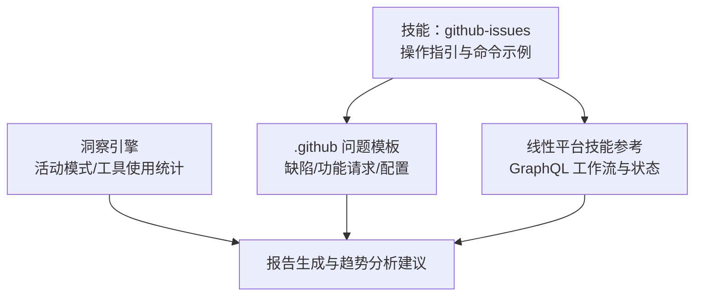
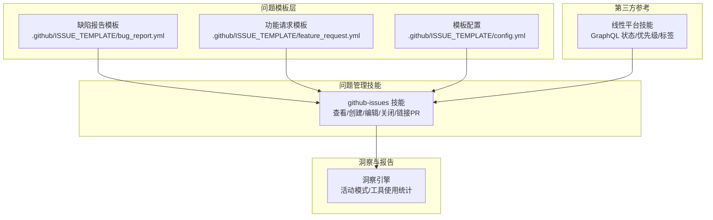
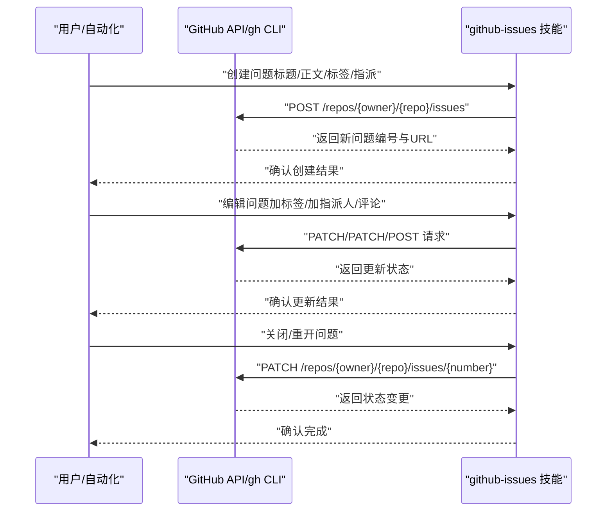
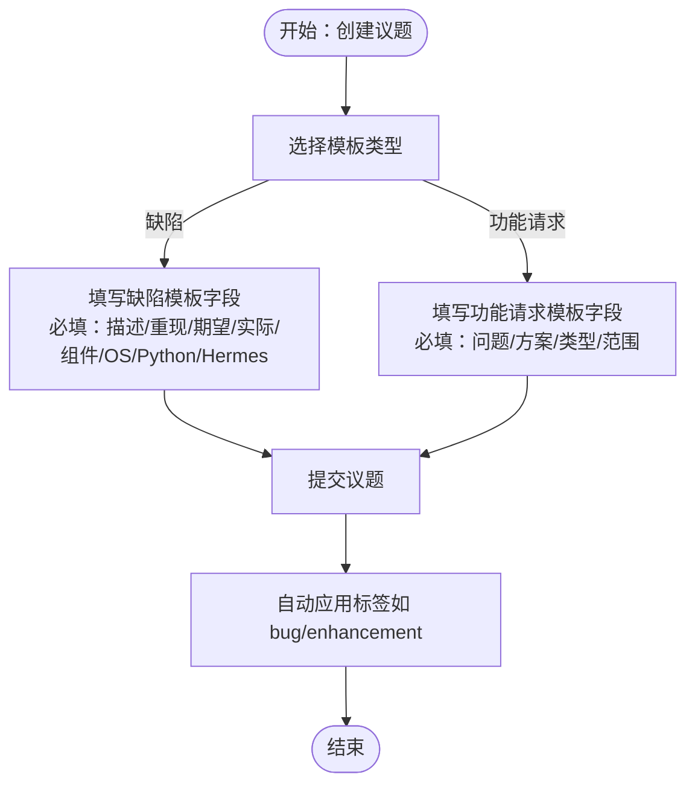
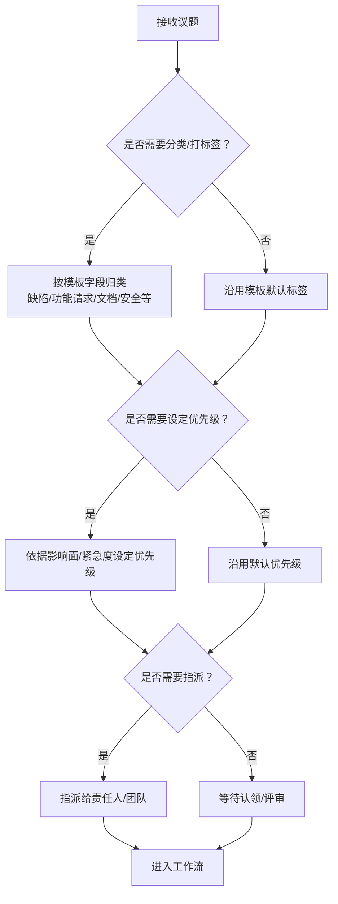
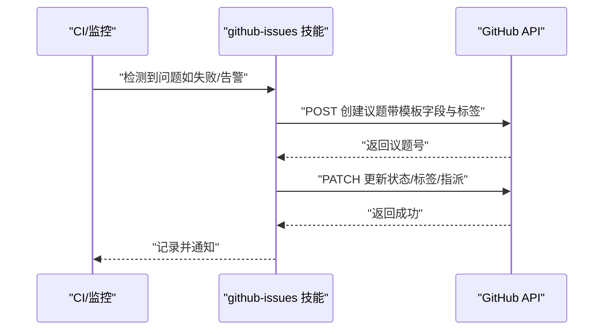
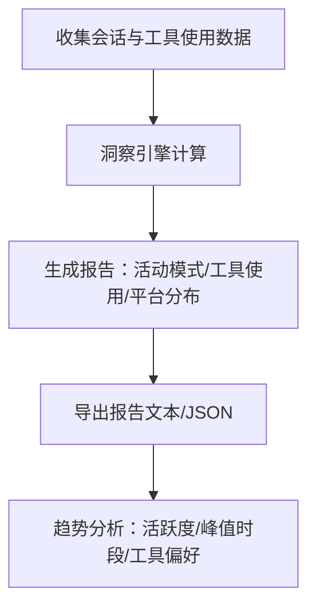
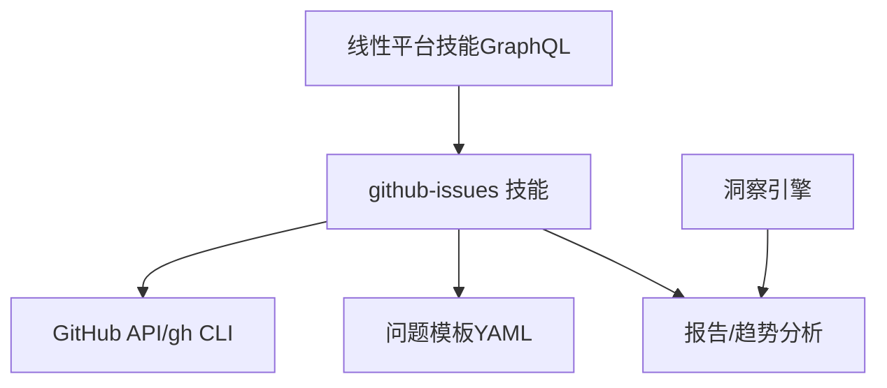

# 问题跟踪

<cite>
**本文引用的文件**
- [技能说明：github-issues](file://skills/github/github-issues/SKILL.md)
- [缺陷报告模板](file://.github/ISSUE_TEMPLATE/bug_report.yml)
- [功能请求模板](file://.github/ISSUE_TEMPLATE/feature_request.yml)
- [模板配置](file://.github/ISSUE_TEMPLATE/config.yml)
- [线性平台技能说明](file://skills/productivity/linear/SKILL.md)
- [洞察引擎：活动模式与工具使用统计](file://agent/insights.py)
- [测试：洞察引擎](file://tests/agent/test_insights.py)
- [.github 目录说明（目录）](file://.github/ISSUE_TEMPLATE/)
</cite>

## 目录
1. [简介](#简介)
2. [项目结构](#项目结构)
3. [核心组件](#核心组件)
4. [架构总览](#架构总览)
5. [详细组件分析](#详细组件分析)
6. [依赖关系分析](#依赖关系分析)
7. [性能考量](#性能考量)
8. [故障排查指南](#故障排查指南)
9. [结论](#结论)
10. [附录](#附录)

## 简介
本文件面向使用 Hermes Agent 的用户与团队，系统化阐述如何基于仓库中的 GitHub Issues 技能实现“问题生命周期”的自动化管理。内容覆盖问题模板配置与定制、问题分类与优先级策略、标签与分配管理、批量与自动化工作流、以及基于现有能力进行问题数据导出、报告生成与趋势分析的方法建议。同时给出重复问题识别与处理、问题升级与跨团队协作的实践路径。

## 项目结构
围绕 GitHub Issues 的相关资源主要分布在以下位置：
- 技能说明与操作指引：skills/github/github-issues/SKILL.md
- GitHub 问题模板：.github/ISSUE_TEMPLATE/*.yml
- 第三方平台（线性）技能参考：skills/productivity/linear/SKILL.md
- 洞察与报告能力：agent/insights.py 及其测试 tests/agent/test_insights.py

**图表来源**
- [技能说明：github-issues:1-370](file://skills/github/github-issues/SKILL.md#L1-L370)
- [缺陷报告模板:1-145](file://.github/ISSUE_TEMPLATE/bug_report.yml#L1-L145)
- [功能请求模板:1-74](file://.github/ISSUE_TEMPLATE/feature_request.yml#L1-L74)
- [模板配置:1-12](file://.github/ISSUE_TEMPLATE/config.yml#L1-L12)
- [线性平台技能说明:1-229](file://skills/productivity/linear/SKILL.md#L1-L229)
- [洞察引擎：活动模式与工具使用统计:461-790](file://agent/insights.py#L461-L790)

**章节来源**
- [技能说明：github-issues:1-370](file://skills/github/github-issues/SKILL.md#L1-L370)
- [.github 目录说明（目录）](file://.github/ISSUE_TEMPLATE/)

## 核心组件
- GitHub Issues 技能：提供查看、创建、编辑（加删标签、指派、评论）、关闭/重开、链接 PR 等能力，并支持 gh CLI 与 curl 两种调用方式。
- GitHub 问题模板：通过 YAML 定义模板字段、校验与默认标签，便于标准化缺陷报告与功能请求。
- 线性平台技能（参考）：提供 GraphQL 查询/变更示例，展示状态类型、优先级、标签等管理思路，可借鉴到 GitHub 标签与状态映射。
- 洞察引擎：提供活动模式与工具使用统计，可用于生成问题工作量与活跃度报告，辅助趋势分析。

**章节来源**
- [技能说明：github-issues:17-370](file://skills/github/github-issues/SKILL.md#L17-L370)
- [缺陷报告模板:1-145](file://.github/ISSUE_TEMPLATE/bug_report.yml#L1-L145)
- [功能请求模板:1-74](file://..github/ISSUE_TEMPLATE/feature_request.yml#L1-L74)
- [线性平台技能说明:1-229](file://skills/productivity/linear/SKILL.md#L1-L229)
- [洞察引擎：活动模式与工具使用统计:461-790](file://agent/insights.py#L461-L790)

## 架构总览
下图展示了从“问题模板”到“自动化工作流”的整体视图，以及“洞察引擎”对问题相关活动的统计输出。

**图表来源**
- [技能说明：github-issues:1-370](file://skills/github/github-issues/SKILL.md#L1-L370)
- [缺陷报告模板:1-145](file://.github/ISSUE_TEMPLATE/bug_report.yml#L1-L145)
- [功能请求模板:1-74](file://.github/ISSUE_TEMPLATE/feature_request.yml#L1-L74)
- [模板配置:1-12](file://.github/ISSUE_TEMPLATE/config.yml#L1-L12)
- [线性平台技能说明:1-229](file://skills/productivity/linear/SKILL.md#L1-L229)
- [洞察引擎：活动模式与工具使用统计:461-790](file://agent/insights.py#L461-L790)

## 详细组件分析

### 组件A：GitHub Issues 技能（生命周期管理）
- 查看与搜索：支持列表、按标签/指派人/状态过滤、按关键词搜索、查看单个问题详情。
- 创建问题：支持标题、正文、标签、指派；提供 gh 与 curl 两种方式。
- 编辑问题：加删标签、添加指派人、评论、关闭/重开、链接 PR。
- 批量操作：结合 gh 或 curl 列表后脚本化批量处理。
- 问题分流与开发分支：支持从问题创建分支。

**图表来源**
- [技能说明：github-issues:46-273](file://skills/github/github-issues/SKILL.md#L46-L273)

**章节来源**
- [技能说明：github-issues:46-273](file://skills/github/github-issues/SKILL.md#L46-L273)

### 组件B：问题模板（缺陷报告与功能请求）
- 缺陷报告模板：定义“描述/重现步骤/期望/实际/受影响组件/平台/操作系统/Python版本/Hermes版本/日志/根因分析/建议修复/是否提交PR”等字段，含必填项与默认标签。
- 功能请求模板：定义“问题/解决方案/替代方案/特性类型/范围/贡献意愿”等字段，含必填项与默认标签。
- 模板配置：允许开启空白议题、提供社区与文档链接。

**图表来源**
- [缺陷报告模板:1-145](file://.github/ISSUE_TEMPLATE/bug_report.yml#L1-L145)
- [功能请求模板:1-74](file://.github/ISSUE_TEMPLATE/feature_request.yml#L1-L74)
- [模板配置:1-12](file://.github/ISSUE_TEMPLATE/config.yml#L1-L12)

**章节来源**
- [缺陷报告模板:1-145](file://.github/ISSUE_TEMPLATE/bug_report.yml#L1-L145)
- [功能请求模板:1-74](file://.github/ISSUE_TEMPLATE/feature_request.yml#L1-L74)
- [模板配置:1-12](file://.github/ISSUE_TEMPLATE/config.yml#L1-L12)

### 组件C：问题分类、优先级与分配策略
- 分类与标签：缺陷/功能请求模板已内置默认标签；日常维护中可结合“类型/严重程度/模块/平台”等维度扩展标签体系。
- 优先级：可采用“紧急/高/中/低”或“priority:high/priority:normal”等约定；与第三方平台（如线性）的优先级数值可做映射参考。
- 分配：明确责任人或团队，避免多人交叉；必要时引入“需求评审/技术评审”环节。

**图表来源**
- [技能说明：github-issues:179-230](file://skills/github/github-issues/SKILL.md#L179-L230)
- [线性平台技能说明:39-54](file://skills/productivity/linear/SKILL.md#L39-L54)

**章节来源**
- [技能说明：github-issues:179-230](file://skills/github/github-issues/SKILL.md#L179-L230)
- [线性平台技能说明:39-54](file://skills/productivity/linear/SKILL.md#L39-L54)

### 组件D：问题管理工作流（自动创建、状态更新、标签管理、关闭）
- 自动创建：结合模板与自动化触发条件（如 CI 失败、告警），由技能自动创建议题并标注标签。
- 状态更新：在 PR 合并/评审/指派后，自动更新标签与状态；可参考线性平台的状态类型映射。
- 标签管理：统一命名规范，定期清理无效标签；批量加删标签提升效率。
- 关闭流程：问题解决后自动关闭；若为误报/计划外，标记原因并关闭。

**图表来源**
- [技能说明：github-issues:106-273](file://skills/github/github-issues/SKILL.md#L106-L273)
- [线性平台技能说明:174-181](file://skills/productivity/linear/SKILL.md#L174-L181)

**章节来源**
- [技能说明：github-issues:106-273](file://skills/github/github-issues/SKILL.md#L106-L273)
- [线性平台技能说明:174-181](file://skills/productivity/linear/SKILL.md#L174-L181)

### 组件E：问题数据导出、报告生成与趋势分析
- 导出与报告：当前洞察引擎提供“活动模式/工具使用统计/平台分布/会话概览”等维度，可作为问题相关活动的报告基础。
- 趋势分析：结合“按日/小时活跃度”“工具调用占比”等指标，评估问题响应效率与热点。

**图表来源**
- [洞察引擎：活动模式与工具使用统计:461-790](file://agent/insights.py#L461-L790)

**章节来源**
- [洞察引擎：活动模式与工具使用统计:461-790](file://agent/insights.py#L461-L790)
- [测试：洞察引擎:240-678](file://tests/agent/test_insights.py#L240-L678)

### 组件F：重复问题、问题升级与跨团队协作
- 重复问题：可先通过搜索与标签去重，再决定合并或关闭；必要时在评论中引用原始议题。
- 问题升级：当问题影响范围扩大或涉及多团队时，及时更新标签/优先级/指派，并在评论中同步进展。
- 跨团队协作：通过评论与指派明确责任方；必要时建立“升级通道”与“评审机制”。

**章节来源**
- [技能说明：github-issues:329-356](file://skills/github/github-issues/SKILL.md#L329-L356)

## 依赖关系分析
- 技能依赖：github-issues 技能依赖于 GitHub API 或 gh CLI；模板依赖于 .github/ISSUE_TEMPLATE 下的 YAML 配置。
- 参考依赖：线性平台技能提供 GraphQL 的状态/优先级/标签管理思路，可迁移至 GitHub 标签与状态映射。
- 内部依赖：洞察引擎依赖会话与工具使用数据，用于生成报告与趋势分析。

**图表来源**
- [技能说明：github-issues:17-42](file://skills/github/github-issues/SKILL.md#L17-L42)
- [缺陷报告模板:1-145](file://.github/ISSUE_TEMPLATE/bug_report.yml#L1-L145)
- [功能请求模板:1-74](file://.github/ISSUE_TEMPLATE/feature_request.yml#L1-L74)
- [线性平台技能说明:1-229](file://skills/productivity/linear/SKILL.md#L1-L229)
- [洞察引擎：活动模式与工具使用统计:461-790](file://agent/insights.py#L461-L790)

**章节来源**
- [技能说明：github-issues:17-42](file://skills/github/github-issues/SKILL.md#L17-L42)
- [线性平台技能说明:1-229](file://skills/productivity/linear/SKILL.md#L1-L229)
- [洞察引擎：活动模式与工具使用统计:461-790](file://agent/insights.py#L461-L790)

## 性能考量
- API 调用频率：合理控制批量操作的并发与速率，避免触发限流。
- 搜索与筛选：优先使用标签与状态过滤减少数据量，提高查询效率。
- 报告生成：对大规模数据进行分页与采样，避免一次性加载过多会话/工具使用记录。

## 故障排查指南
- 认证与环境变量：确保 GITHUB_TOKEN 或 gh 已认证；检查仓库远程地址解析。
- 权限问题：确认凭据具备创建/编辑/关闭议题的权限。
- 模板字段缺失：若必填字段未满足，议题创建会失败；请对照模板字段补齐。
- 报告为空：若时间窗口过短或无数据，洞察引擎可能返回空报告；适当扩大时间范围或检查数据源。

**章节来源**
- [技能说明：github-issues:22-42](file://skills/github/github-issues/SKILL.md#L22-L42)
- [缺陷报告模板:22-52](file://.github/ISSUE_TEMPLATE/bug_report.yml#L22-L52)
- [功能请求模板:23-34](file://.github/ISSUE_TEMPLATE/feature_request.yml#L23-L34)

## 结论
通过 GitHub Issues 技能与问题模板的组合，可以高效地实现问题的自动创建、分类、标签与指派、状态更新与关闭。结合线性平台技能的参考实践，可进一步完善标签与优先级策略。借助洞察引擎的能力，团队能够生成问题相关活动的报告并进行趋势分析，从而持续优化问题管理流程与响应效率。

## 附录
- 快速参考（摘自技能说明）
  - 查看/搜索/创建/加删标签/指派/评论/关闭/重开/链接 PR 的命令与端点对应关系见“快速参考表”。

**章节来源**
- [技能说明：github-issues:358-369](file://skills/github/github-issues/SKILL.md#L358-L369)