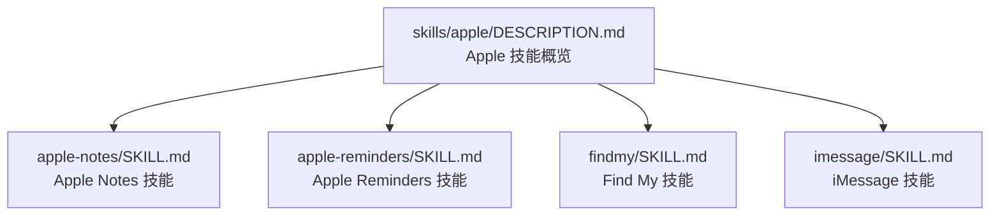
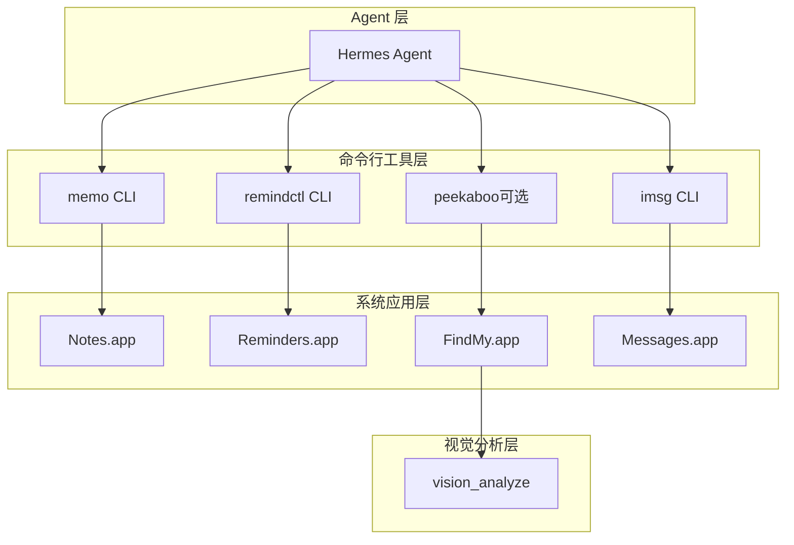
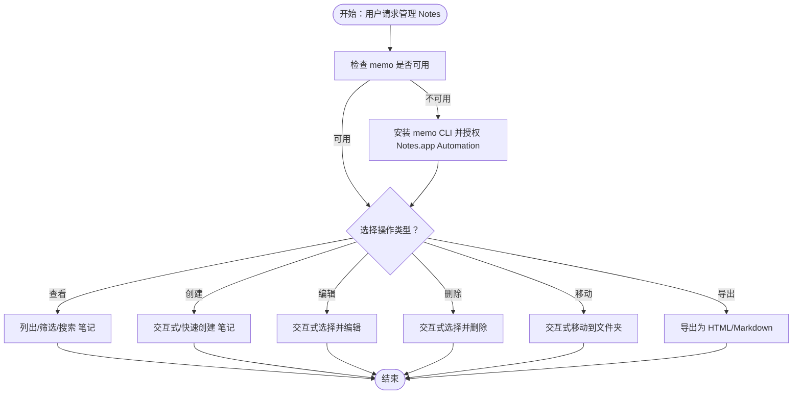
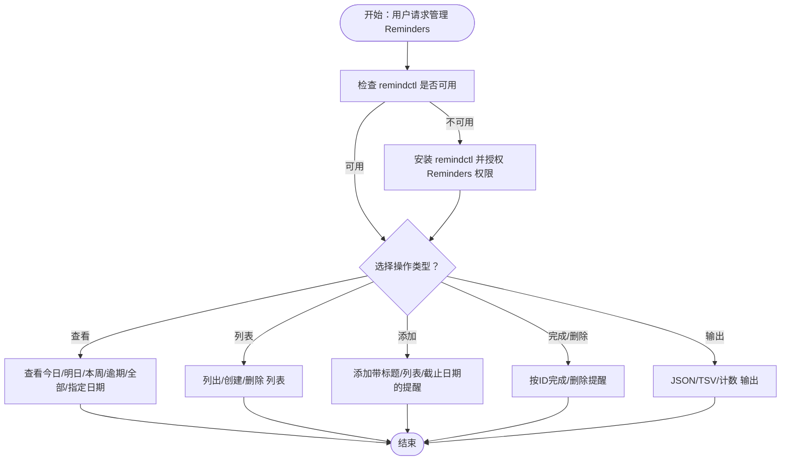
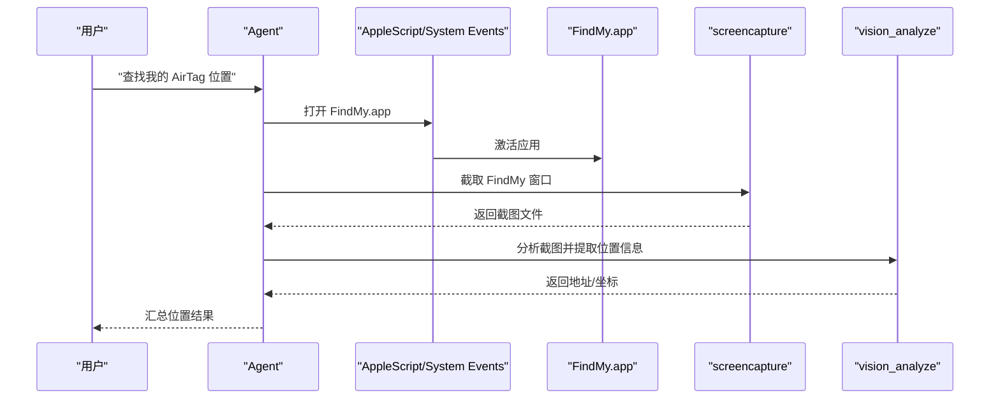
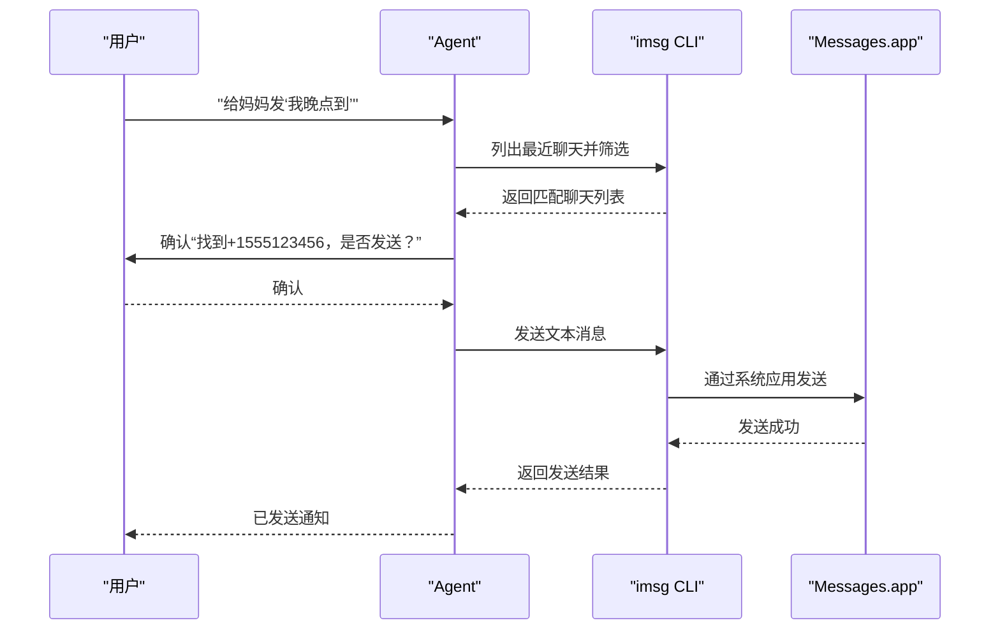
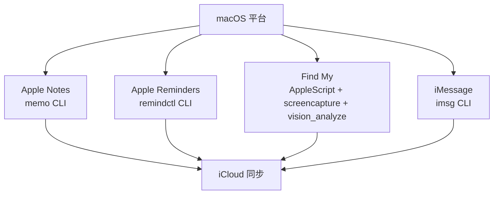

# Apple设备集成技能

<cite>
**本文档引用的文件**
- [skills/apple/DESCRIPTION.md](file://skills/apple/DESCRIPTION.md)
- [skills/apple/apple-notes/SKILL.md](file://skills/apple/apple-notes/SKILL.md)
- [skills/apple/apple-reminders/SKILL.md](file://skills/apple/apple-reminders/SKILL.md)
- [skills/apple/findmy/SKILL.md](file://skills/apple/findmy/SKILL.md)
- [skills/apple/imessage/SKILL.md](file://skills/apple/imessage/SKILL.md)
</cite>

## 目录
1. [简介](#简介)
2. [项目结构](#项目结构)
3. [核心组件](#核心组件)
4. [架构总览](#架构总览)
5. [详细组件分析](#详细组件分析)
6. [依赖关系分析](#依赖关系分析)
7. [性能考虑](#性能考虑)
8. [故障排除指南](#故障排除指南)
9. [结论](#结论)
10. [附录](#附录)

## 简介
本文件系统性地介绍 Hermes Agent 的 Apple 设备集成技能，覆盖 Apple Notes、Apple Reminders、Find My、iMessage 四项核心能力。这些技能面向 macOS 平台，通过命令行工具与系统应用（如 Notes.app、Reminders.app、FindMy.app、Messages.app）进行交互，实现数据同步、自动化工作流与跨设备协作。文档同时解释 Apple ID 认证、iCloud 同步、快捷指令（Shortcuts）集成等技术要点，并提供可操作的应用案例与配置、权限设置及故障排除指南。

## 项目结构
Apple 集成技能位于 skills/apple 目录下，每个子技能以独立的 SKILL.md 文档描述功能、前置条件、使用场景、限制与规则。整体采用“按平台/功能分技能”的组织方式，便于按需加载与维护。

图表来源
- [skills/apple/DESCRIPTION.md:1-4](file://skills/apple/DESCRIPTION.md#L1-L4)
- [skills/apple/apple-notes/SKILL.md:1-91](file://skills/apple/apple-notes/SKILL.md#L1-L91)
- [skills/apple/apple-reminders/SKILL.md:1-99](file://skills/apple/apple-reminders/SKILL.md#L1-L99)
- [skills/apple/findmy/SKILL.md:1-132](file://skills/apple/findmy/SKILL.md#L1-L132)
- [skills/apple/imessage/SKILL.md:1-103](file://skills/apple/imessage/SKILL.md#L1-L103)

章节来源
- [skills/apple/DESCRIPTION.md:1-4](file://skills/apple/DESCRIPTION.md#L1-L4)

## 核心组件
- Apple Notes：通过 memo 命令行工具在终端中查看、创建、编辑、删除、移动与导出 Apple Notes；Notes 通过 iCloud 在 iPhone、iPad、Mac 间同步。
- Apple Reminders：通过 remindctl 命令行工具列出、添加、完成、删除提醒事项；提醒事项通过 iCloud 同步到 iOS 设备。
- Find My：通过 AppleScript 打开 FindMy.app 并结合屏幕截图与视觉分析读取设备/AirTag 位置信息；支持使用 peekaboo 进行更稳定的 UI 自动化。
- iMessage：通过 imsg 命令行工具发送与接收 iMessage/SMS；需要在系统设置中授予 Full Disk Access 与 Automation 权限。

章节来源
- [skills/apple/apple-notes/SKILL.md:1-91](file://skills/apple/apple-notes/SKILL.md#L1-L91)
- [skills/apple/apple-reminders/SKILL.md:1-99](file://skills/apple/apple-reminders/SKILL.md#L1-L99)
- [skills/apple/findmy/SKILL.md:1-132](file://skills/apple/findmy/SKILL.md#L1-L132)
- [skills/apple/imessage/SKILL.md:1-103](file://skills/apple/imessage/SKILL.md#L1-L103)

## 架构总览
Apple 集成技能的整体工作流围绕“系统应用 + 命令行工具 + 视觉分析”展开。Agent 通过命令行工具与系统应用交互，借助 iCloud 实现跨设备同步；对于无原生 CLI 的场景（如 Find My），采用 AppleScript + 屏幕截图 + vision_analyze 的组合方案。

图表来源
- [skills/apple/apple-notes/SKILL.md:18](file://skills/apple/apple-notes/SKILL.md#L18)
- [skills/apple/apple-reminders/SKILL.md:17](file://skills/apple/apple-reminders/SKILL.md#L17)
- [skills/apple/findmy/SKILL.md:15](file://skills/apple/findmy/SKILL.md#L15)
- [skills/apple/imessage/SKILL.md:17](file://skills/apple/imessage/SKILL.md#L17)

## 详细组件分析

### Apple Notes 技能
- 功能范围：查看、搜索、创建、编辑、删除、移动与导出 Apple Notes。
- 数据同步：Notes 通过 iCloud 在多设备间同步，适合需要跨设备访问的场景。
- 使用建议：
  - 当用户需要跨设备同步的笔记管理时优先选择 Apple Notes。
  - 对于仅 Agent 内部使用的临时记录，建议使用内存工具而非 Notes。
  - 若用户偏好 Markdown 知识管理，可选用 Obsidian 技能。
- 限制与注意事项：
  - 不支持编辑含图片或附件的笔记。
  - 交互式提示需要终端访问（必要时启用 pty）。
  - 仅 macOS 可用，且需安装 memo CLI 并授权 Notes.app 的 Automation 权限。

图表来源
- [skills/apple/apple-notes/SKILL.md:41-78](file://skills/apple/apple-notes/SKILL.md#L41-L78)

章节来源
- [skills/apple/apple-notes/SKILL.md:1-91](file://skills/apple/apple-notes/SKILL.md#L1-L91)

### Apple Reminders 技能
- 功能范围：列出、添加、完成、删除提醒事项；支持列表管理与多种输出格式。
- 数据同步：提醒事项通过 iCloud 同步到 iOS 设备，适合需要在手机上查看的任务。
- 使用建议：
  - 当用户说“提醒我”时，需明确是 Apple Reminders（同步到手机）还是 Agent 定时告警（cronjob）。
  - 创建提醒前务必确认内容与截止日期。
  - 脚本解析推荐使用 --json 输出。
- 日期格式：支持 today、tomorrow、yesterday、YYYY-MM-DD、YYYY-MM-DD HH:mm、ISO 8601 等。

图表来源
- [skills/apple/apple-reminders/SKILL.md:42-84](file://skills/apple/apple-reminders/SKILL.md#L42-L84)

章节来源
- [skills/apple/apple-reminders/SKILL.md:1-99](file://skills/apple/apple-reminders/SKILL.md#L1-L99)

### Find My 技能
- 功能范围：追踪 Apple 设备与 AirTag；通过 AppleScript 打开 FindMy.app 并结合屏幕截图与视觉分析提取位置信息。
- 技术实现：
  - 方法一：AppleScript + screencapture + vision_analyze。
  - 方法二：推荐使用 peekaboo 进行 UI 自动化（打开应用、标注 UI、点击元素、截图详情页）。
- 工作流示例：对 AirTag 进行定时位置抓取，再用视觉分析提取坐标并绘制轨迹。
- 限制与注意事项：
  - FindMy 无 CLI 或 API，必须使用 UI 自动化。
  - AirTag 仅在页面显示时更新位置。
  - 需要授予终端 Screen Recording 权限。
  - AppleScript UI 自动化可能随 macOS 版本变化而失效。

图表来源
- [skills/apple/findmy/SKILL.md:38-52](file://skills/apple/findmy/SKILL.md#L38-L52)
- [skills/apple/findmy/SKILL.md:78-96](file://skills/apple/findmy/SKILL.md#L78-L96)
- [skills/apple/findmy/SKILL.md:100-116](file://skills/apple/findmy/SKILL.md#L100-L116)

章节来源
- [skills/apple/findmy/SKILL.md:1-132](file://skills/apple/findmy/SKILL.md#L1-L132)

### iMessage 技能
- 功能范围：列出聊天、查看历史、发送文本/带附件消息、监听新消息；支持强制 iMessage 或 SMS。
- 权限要求：需要在系统设置中授予终端 Full Disk Access 与 Messages.app Automation 权限。
- 使用建议：
  - 发送前必须确认收件人与消息内容。
  - 不得向未知号码发送消息，发送附件前需验证路径存在。
  - 避免刷屏，注意速率限制。
- 典型流程：根据用户输入查找聊天对象，二次确认后发送。

图表来源
- [skills/apple/imessage/SKILL.md:94-102](file://skills/apple/imessage/SKILL.md#L94-L102)

章节来源
- [skills/apple/imessage/SKILL.md:1-103](file://skills/apple/imessage/SKILL.md#L1-L103)

## 依赖关系分析
- 平台依赖：上述技能均声明仅在 macOS 上加载与运行。
- 外部工具依赖：memo（Notes）、remindctl（Reminders）、imsg（iMessage）、peekaboo（Find My UI 自动化，可选）。
- 系统权限依赖：Notes（Automation）、Reminders（权限/授权）、Messages（Full Disk Access、Automation）、Find My（Screen Recording）。
- 数据同步依赖：iCloud（Notes、Reminders、Find My、iMessage）。

图表来源
- [skills/apple/DESCRIPTION.md:2](file://skills/apple/DESCRIPTION.md#L2)
- [skills/apple/apple-notes/SKILL.md:18](file://skills/apple/apple-notes/SKILL.md#L18)
- [skills/apple/apple-reminders/SKILL.md:17](file://skills/apple/apple-reminders/SKILL.md#L17)
- [skills/apple/findmy/SKILL.md:15](file://skills/apple/findmy/SKILL.md#L15)
- [skills/apple/imessage/SKILL.md:17](file://skills/apple/imessage/SKILL.md#L17)

章节来源
- [skills/apple/DESCRIPTION.md:1-4](file://skills/apple/DESCRIPTION.md#L1-L4)

## 性能考虑
- Find My 截图与视觉分析：频繁截图会增加 I/O 与 CPU 开销，建议在需要时才执行，并合理设置轮询间隔。
- UI 自动化稳定性：AppleScript 与 System Events 可能受 macOS 版本影响，建议配合 peekaboo 提升鲁棒性。
- iCloud 同步延迟：跨设备可见性存在网络与服务延迟，建议在关键操作后等待短暂同步时间。
- 命令行工具输出格式：优先使用 --json 以减少解析成本，避免不必要的格式转换。

## 故障排除指南
- Notes 无法编辑含图片/附件的笔记：此类笔记不支持交互式编辑，需在 Notes.app 中手动处理。
- Reminders 未授权或状态异常：使用 status/authorize 检查与请求授权，确保系统已允许相关权限。
- iMessage 发送失败或权限不足：确认已授予 Full Disk Access 与 Automation；检查服务选项（imessage/sms/auto）是否正确。
- Find My 无法自动定位：确认已授予 Screen Recording 权限；若使用 AppleScript，注意不同 macOS 版本的 UI 变化；推荐安装并使用 peekaboo 提升稳定性。
- AirTag 位置不更新：保持 FindMy 页面处于前台，AirTag 仅在页面显示时更新位置。

章节来源
- [skills/apple/apple-notes/SKILL.md:80-85](file://skills/apple/apple-notes/SKILL.md#L80-L85)
- [skills/apple/apple-reminders/SKILL.md:23-25](file://skills/apple/apple-reminders/SKILL.md#L23-L25)
- [skills/apple/imessage/SKILL.md:23-25](file://skills/apple/imessage/SKILL.md#L23-L25)
- [skills/apple/findmy/SKILL.md:23-25](file://skills/apple/findmy/SKILL.md#L23-L25)
- [skills/apple/findmy/SKILL.md:118-125](file://skills/apple/findmy/SKILL.md#L118-L125)

## 结论
Hermes Agent 的 Apple 设备集成技能通过命令行工具与系统应用的协同，实现了 Notes、Reminders、Find My、iMessage 的本地自动化与跨设备同步。在权限与平台约束下，这些技能为用户提供从笔记管理、任务提醒、设备定位到消息处理的一体化体验。建议在生产环境中结合 iCloud 同步策略与合理的 UI 自动化方案，持续优化稳定性与性能。

## 附录
- 快速参考（命令与场景）
  - Notes：查看/搜索/创建/编辑/删除/移动/导出。
  - Reminders：查看（今日/明日/本周/逾期/全部/指定日期）、列表管理、添加提醒、完成/删除、输出格式（JSON/TSV/quiet）。
  - Find My：AppleScript 打开应用、截图、视觉分析；或使用 peekaboo 进行 UI 自动化；支持 AirTag 轨迹监控。
  - iMessage：列出聊天、查看历史、发送文本/附件、监听新消息；服务选项（imessage/sms/auto）。