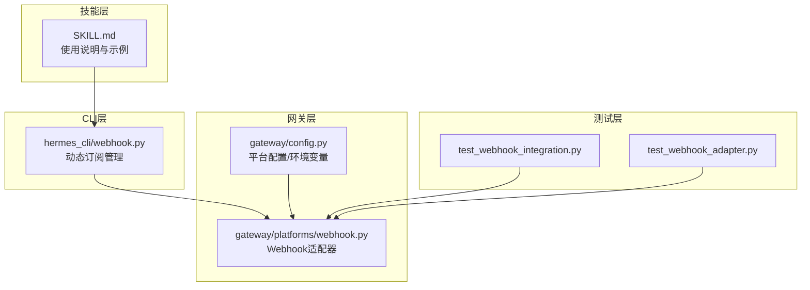
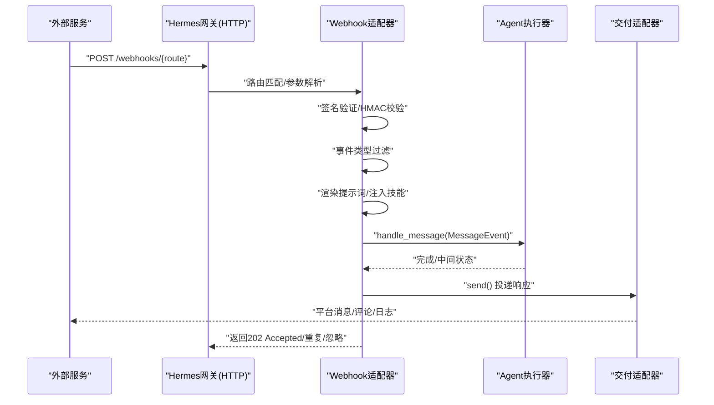
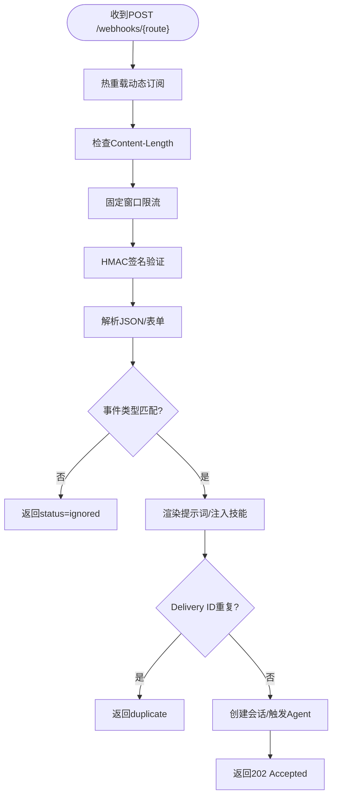
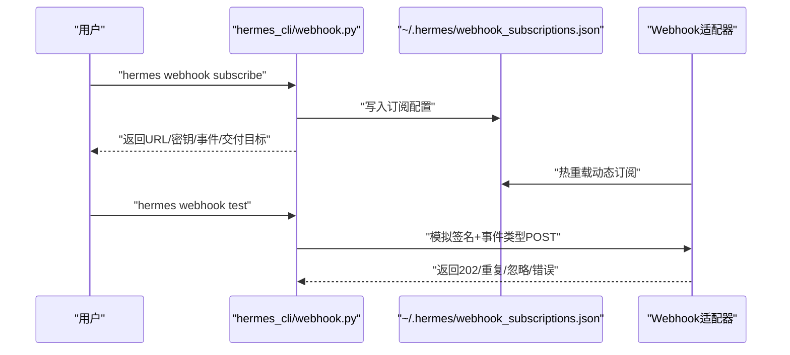
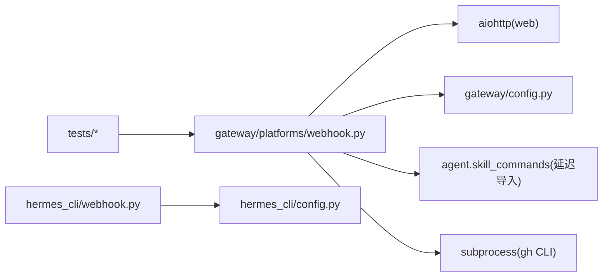
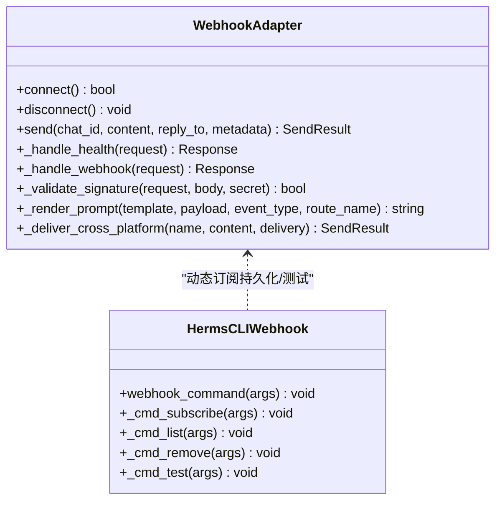

# DevOps技能

<cite>
**本文引用的文件**
- [SKILL.md](file://skills/devops/webhook-subscriptions/SKILL.md)
- [webhook.py](file://gateway/platforms/webhook.py)
- [webhook.py](file://hermes_cli/webhook.py)
- [config.py](file://gateway/config.py)
- [test_webhook_integration.py](file://tests/gateway/test_webhook_integration.py)
- [test_webhook_adapter.py](file://tests/gateway/test_webhook_adapter.py)
- [config.py](file://hermes_cli/config.py)
- [README.md](file://README.md)
</cite>

## 目录
1. [简介](#简介)
2. [项目结构](#项目结构)
3. [核心组件](#核心组件)
4. [架构总览](#架构总览)
5. [详细组件分析](#详细组件分析)
6. [依赖关系分析](#依赖关系分析)
7. [性能考量](#性能考量)
8. [故障排查指南](#故障排查指南)
9. [结论](#结论)
10. [附录](#附录)

## 简介
本文件面向Hermes Agent的DevOps用户，系统性讲解“Webhook订阅”技能的配置与使用，覆盖以下关键主题：
- Webhook平台启用与基础配置（配置文件、环境变量、网关启动）
- 动态订阅管理（hermes webhook命令族：创建、列出、删除、测试）
- Webhook接收机制、事件过滤、签名验证、幂等与速率限制
- 数据格式处理（JSON/Payload渲染、模板变量、特殊令牌）
- 安全认证（HMAC-SHA256、GitLab Token、通用签名头）
- 集成CI/CD流水线、自动化部署触发、监控告警通知
- 实际应用案例（GitHub Issues/PR、Stripe支付事件、CI流水线、通用监控）
- 错误排查与性能优化建议

## 项目结构
围绕Webhook订阅技能，涉及以下模块：
- 技能文档：skills/devops/webhook-subscriptions/SKILL.md
- 网关适配器：gateway/platforms/webhook.py（HTTP服务、签名验证、事件处理、交付路由）
- CLI子命令：hermes_cli/webhook.py（动态订阅持久化、URL/密钥生成、测试请求）
- 配置加载：gateway/config.py（平台枚举、配置合并、环境变量覆盖）
- 测试用例：tests/gateway/test_webhook_integration.py、test_webhook_adapter.py（端到端与单元测试）

图表来源
- [SKILL.md:1-181](file://skills/devops/webhook-subscriptions/SKILL.md#L1-L181)
- [webhook.py:1-260](file://hermes_cli/webhook.py#L1-L260)
- [webhook.py:1-673](file://gateway/platforms/webhook.py#L1-L673)
- [config.py:48-69](file://gateway/config.py#L48-L69)
- [test_webhook_integration.py:1-340](file://tests/gateway/test_webhook_integration.py#L1-L340)
- [test_webhook_adapter.py:1-761](file://tests/gateway/test_webhook_adapter.py#L1-L761)

章节来源
- [SKILL.md:1-181](file://skills/devops/webhook-subscriptions/SKILL.md#L1-L181)
- [webhook.py:1-673](file://gateway/platforms/webhook.py#L1-L673)
- [webhook.py:1-260](file://hermes_cli/webhook.py#L1-L260)
- [config.py:48-69](file://gateway/config.py#L48-L69)
- [test_webhook_integration.py:1-340](file://tests/gateway/test_webhook_integration.py#L1-L340)
- [test_webhook_adapter.py:1-761](file://tests/gateway/test_webhook_adapter.py#L1-L761)

## 核心组件
- Webhook平台适配器：基于aiohttp提供HTTP服务，负责接收外部Webhook、校验签名、解析事件、渲染提示词、触发Agent运行、按配置投递响应。
- CLI动态订阅管理：在~/.hermes目录下维护webhook_subscriptions.json，支持创建/列出/删除/测试订阅；测试时可模拟签名与事件类型。
- 平台配置与环境变量：支持config.yaml与.env两种方式启用Webhook平台，允许通过环境变量覆盖默认host/port/secret等参数。
- 测试套件：覆盖签名验证、事件过滤、幂等、速率限制、跨平台交付、GitHub评论交付等行为。

章节来源
- [webhook.py:65-154](file://gateway/platforms/webhook.py#L65-L154)
- [webhook.py:136-181](file://hermes_cli/webhook.py#L136-L181)
- [config.py:48-69](file://gateway/config.py#L48-L69)
- [test_webhook_integration.py:81-145](file://tests/gateway/test_webhook_integration.py#L81-L145)
- [test_webhook_adapter.py:108-173](file://tests/gateway/test_webhook_adapter.py#L108-L173)

## 架构总览
Webhook订阅技能的端到端流程如下：
- 外部服务（如GitHub/GitLab/CI/监控系统）向Hermes网关的Webhook端点发送POST请求
- 网关适配器进行签名验证、事件类型过滤、负载大小限制检查
- 渲染提示词模板，注入技能内容（可选），构建MessageEvent并异步触发Agent
- Agent完成后，根据订阅配置将结果投递到目标平台或写入GitHub评论

图表来源
- [webhook.py:278-478](file://gateway/platforms/webhook.py#L278-L478)
- [webhook.py:163-216](file://gateway/platforms/webhook.py#L163-L216)
- [test_webhook_integration.py:81-145](file://tests/gateway/test_webhook_integration.py#L81-L145)

## 详细组件分析

### 组件A：Webhook平台适配器（HTTP服务与事件处理）
- 生命周期
  - connect()：启动HTTP服务器，注册健康检查与Webhook路由，端口冲突检测，记录已配置路由
  - disconnect()：停止服务器，清理状态
- 接收与处理
  - _handle_webhook()：热重载动态订阅、限流、体大小检查、签名验证、事件类型过滤、渲染提示词、注入技能、幂等、会话隔离、触发Agent
  - _validate_signature()：支持GitHub/X-Hub-Signature-256、GitLab/X-Gitlab-Token、通用X-Webhook-Signature
  - _render_prompt()：支持点号访问嵌套字段、特殊{__raw__}令牌输出完整JSON
  - _deliver_*：支持GitHub评论交付与跨平台交付（Telegram/Discord/Slack等）
- 安全与可靠性
  - 每路由独立HMAC密钥，支持全局密钥
  - 固定窗口速率限制（每路由）
  - 幂等缓存（按Delivery ID，TTL控制）
  - 体大小限制（auth-before-body模式）
  - 静态路由优先级高于动态路由

图表来源
- [webhook.py:278-478](file://gateway/platforms/webhook.py#L278-L478)
- [webhook.py:484-514](file://gateway/platforms/webhook.py#L484-L514)
- [webhook.py:519-558](file://gateway/platforms/webhook.py#L519-L558)

章节来源
- [webhook.py:112-154](file://gateway/platforms/webhook.py#L112-L154)
- [webhook.py:278-478](file://gateway/platforms/webhook.py#L278-L478)
- [webhook.py:484-514](file://gateway/platforms/webhook.py#L484-L514)
- [webhook.py:519-558](file://gateway/platforms/webhook.py#L519-L558)
- [webhook.py:575-673](file://gateway/platforms/webhook.py#L575-L673)

### 组件B：CLI动态订阅管理
- 订阅持久化：~/.hermes/webhook_subscriptions.json，支持热重载
- 命令族
  - hermes webhook subscribe：创建/更新订阅，自动生成HMAC密钥，支持事件过滤、提示词模板、技能注入、交付目标
  - hermes webhook list/remove：查看/删除订阅
  - hermes webhook test：本地模拟签名与事件类型，发送测试请求
- 配置来源：优先从config.yaml读取Webhook平台配置，支持.env环境变量覆盖

图表来源
- [webhook.py:136-181](file://hermes_cli/webhook.py#L136-L181)
- [webhook.py:219-260](file://hermes_cli/webhook.py#L219-L260)
- [webhook.py:245-277](file://gateway/platforms/webhook.py#L245-L277)

章节来源
- [webhook.py:36-56](file://hermes_cli/webhook.py#L36-L56)
- [webhook.py:136-181](file://hermes_cli/webhook.py#L136-L181)
- [webhook.py:219-260](file://hermes_cli/webhook.py#L219-L260)
- [webhook.py:245-277](file://gateway/platforms/webhook.py#L245-L277)

### 组件C：配置与环境变量
- 平台枚举：WEBHOOK平台在Platform中定义
- 配置加载：支持config.yaml与.env，环境变量覆盖优先级高
- Webhook平台配置项：host、port、secret、routes（静态）、rate_limit、max_body_bytes、idempotency_ttl等

章节来源
- [config.py:48-69](file://gateway/config.py#L48-L69)
- [config.py:431-671](file://gateway/config.py#L431-L671)
- [config.py:730-800](file://hermes_cli/config.py#L730-L800)

### 组件D：测试用例（端到端与单元）
- 端到端：GitHub PR事件触发Agent、技能注入、跨平台交付、GitHub评论交付
- 单元测试：签名验证（GitHub/GitLab/通用）、事件过滤、HTTP处理、幂等、限流、体大小、INSECURE_NO_AUTH、会话隔离、交付信息清理、线程ID透传

章节来源
- [test_webhook_integration.py:81-145](file://tests/gateway/test_webhook_integration.py#L81-L145)
- [test_webhook_integration.py:151-207](file://tests/gateway/test_webhook_integration.py#L151-L207)
- [test_webhook_integration.py:213-265](file://tests/gateway/test_webhook_integration.py#L213-L265)
- [test_webhook_integration.py:271-340](file://tests/gateway/test_webhook_integration.py#L271-L340)
- [test_webhook_adapter.py:108-173](file://tests/gateway/test_webhook_adapter.py#L108-L173)
- [test_webhook_adapter.py:237-306](file://tests/gateway/test_webhook_adapter.py#L237-L306)
- [test_webhook_adapter.py:313-340](file://tests/gateway/test_webhook_adapter.py#L313-L340)

## 依赖关系分析
- Webhook适配器依赖aiohttp（可选依赖），连接阶段进行可用性检查
- CLI依赖配置加载模块以读取Webhook平台配置
- 交付路径依赖网关运行器（gateway_runner）提供的其他平台适配器
- 测试依赖aiohttp.test_utils与unittest.mock

图表来源
- [webhook.py:36-42](file://gateway/platforms/webhook.py#L36-L42)
- [webhook.py:61-66](file://hermes_cli/webhook.py#L61-L66)
- [config.py:48-69](file://gateway/config.py#L48-L69)
- [test_webhook_integration.py:20-28](file://tests/gateway/test_webhook_integration.py#L20-L28)

章节来源
- [webhook.py:36-42](file://gateway/platforms/webhook.py#L36-L42)
- [webhook.py:61-66](file://hermes_cli/webhook.py#L61-L66)
- [config.py:48-69](file://gateway/config.py#L48-L69)
- [test_webhook_integration.py:20-28](file://tests/gateway/test_webhook_integration.py#L20-L28)

## 性能考量
- 连接与监听：connect()阶段进行端口占用检测，避免启动失败
- 热重载：动态订阅文件mtime检查，仅在变更时重载，开销极低
- 限流与幂等：固定窗口限流（每路由）+ Delivery ID幂等，防止重复处理
- 身体大小限制：先检查Content-Length再读取body，避免大负载消耗
- 异步处理：POST直接返回202 Accepted，Agent运行在后台任务，不阻塞HTTP线程
- 交付路径：跨平台交付通过网关运行器的适配器实现，避免耦合

章节来源
- [webhook.py:130-140](file://gateway/platforms/webhook.py#L130-L140)
- [webhook.py:245-277](file://gateway/platforms/webhook.py#L245-L277)
- [webhook.py:299-307](file://gateway/platforms/webhook.py#L299-L307)
- [webhook.py:466-468](file://gateway/platforms/webhook.py#L466-L468)

## 故障排查指南
常见问题与定位步骤：
- 网关未运行或端口被占用
  - 使用systemctl或ps确认进程；检查端口占用
  - 参考：[webhook.py:130-140](file://gateway/platforms/webhook.py#L130-L140)
- Webhook服务器未监听或健康检查失败
  - curl http://localhost:PORT/health，应返回{"status":"ok","platform":"webhook"}
  - 参考：[webhook.py:241-244](file://gateway/platforms/webhook.py#L241-L244)
- 签名不匹配
  - 确认服务端使用的密钥与hermes webhook list显示一致
  - GitHub使用X-Hub-Signature-256，GitLab使用X-Gitlab-Token
  - 参考：[webhook.py:484-514](file://gateway/platforms/webhook.py#L484-L514)
- 事件类型不匹配
  - 检查--events过滤是否与服务端发送一致
  - 使用hermes webhook test验证路由与事件类型
  - 参考：[webhook.py:219-260](file://hermes_cli/webhook.py#L219-L260)
- 防火墙/NAT
  - Webhook URL必须对外可达；本地开发建议使用内网穿透工具
- 日志定位
  - 查看网关日志中包含“webhook”的条目，定位具体错误
  - 参考：[SKILL.md:171-181](file://skills/devops/webhook-subscriptions/SKILL.md#L171-L181)

章节来源
- [webhook.py:130-140](file://gateway/platforms/webhook.py#L130-L140)
- [webhook.py:241-244](file://gateway/platforms/webhook.py#L241-L244)
- [webhook.py:484-514](file://gateway/platforms/webhook.py#L484-L514)
- [webhook.py:219-260](file://hermes_cli/webhook.py#L219-L260)
- [SKILL.md:171-181](file://skills/devops/webhook-subscriptions/SKILL.md#L171-L181)

## 结论
Webhook订阅技能为Hermes Agent提供了强大的事件驱动自动化能力。通过灵活的提示词模板、多样的交付目标、严格的签名验证与幂等保障，可在CI/CD、监控告警、代码审查等多个DevOps场景中实现自动化的触发与反馈。配合CLI的动态订阅管理与测试能力，用户可以快速落地并持续优化自己的自动化工作流。

## 附录

### 配置示例与最佳实践
- 启用Webhook平台
  - 方式一：hermes gateway setup（推荐）
  - 方式二：config.yaml中开启platforms.webhook.enabled并设置host/port/secret
  - 方式三：在.env中设置WEBHOOK_ENABLED/WEBHOOK_PORT/WEBHOOK_SECRET
  - 参考：[SKILL.md:14-59](file://skills/devops/webhook-subscriptions/SKILL.md#L14-L59)
- 创建订阅
  - hermes webhook subscribe <name> --prompt "<模板>" --events "event1,event2" --deliver <平台> --deliver-chat-id "<ID>"
  - 参考：[SKILL.md:65-75](file://skills/devops/webhook-subscriptions/SKILL.md#L65-L75)
- 提示词模板语法
  - 支持{dot.notation}访问嵌套字段；{__raw__}输出完整JSON
  - 参考：[webhook.py:519-558](file://gateway/platforms/webhook.py#L519-L558)
- 安全与认证
  - 每个订阅独立HMAC密钥；支持INSECURE_NO_AUTH仅用于测试
  - 参考：[webhook.py:116-125](file://gateway/platforms/webhook.py#L116-L125)
- 交付目标
  - 支持log、github_comment、以及多种聊天平台（Telegram/Discord/Slack等）
  - 参考：[webhook.py:163-216](file://gateway/platforms/webhook.py#L163-L216)

### 实际应用案例
- GitHub Issues/PR
  - 订阅事件：issues/pull_request
  - 提示词：提取标题/作者/分支/描述等字段
  - 交付：Telegram频道或GitHub评论
  - 参考：[SKILL.md:108-131](file://skills/devops/webhook-subscriptions/SKILL.md#L108-L131)
- Stripe支付事件
  - 订阅事件：payment_intent.succeeded/payment_intent.payment_failed
  - 提示词：金额、邮箱、状态
  - 交付：Telegram频道
  - 参考：[SKILL.md:132-139](file://skills/devops/webhook-subscriptions/SKILL.md#L132-L139)
- CI/CD构建通知
  - 订阅事件：pipeline
  - 提示词：状态、仓库名、分支、提交信息
  - 交付：Discord频道
  - 参考：[SKILL.md:141-148](file://skills/devops/webhook-subscriptions/SKILL.md#L141-L148)
- 通用监控告警
  - 提示词：告警名称/严重级别/消息
  - 交付：origin（即回显到源平台）
  - 参考：[SKILL.md:150-155](file://skills/devops/webhook-subscriptions/SKILL.md#L150-L155)

### 关键流程图（代码级）

图表来源
- [webhook.py:65-154](file://gateway/platforms/webhook.py#L65-L154)
- [webhook.py:114-134](file://hermes_cli/webhook.py#L114-L134)